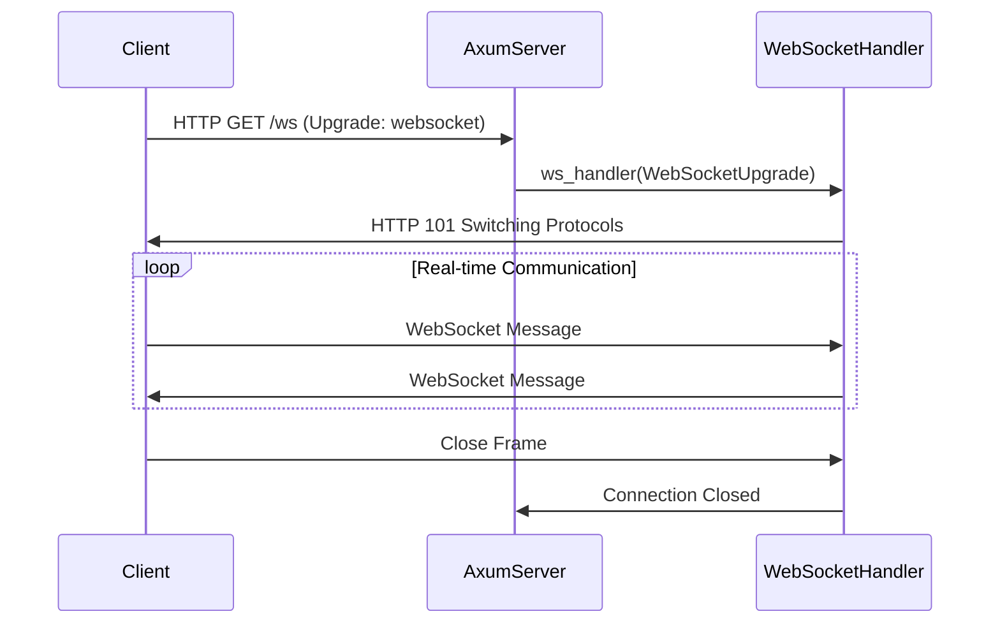

# WebSockets: Real-Time Bidirectional Communication

**Example Source**: [websockets](https://github.com/tokio-rs/axum/tree/6bc0717b06c665baf9dea57d977363ade062bf17/examples/websockets)

## The Core Concept: Why This Example Exists

**The Problem:** Traditional HTTP follows a request-response pattern where clients ask for data and servers respond. But modern web applications often need **real-time, bidirectional communication**: chat applications, live updates, multiplayer games, collaborative editing, or streaming data feeds. HTTP's request-response model creates awkward patterns like polling or long-polling that waste bandwidth and increase latency.

**The Solution:** WebSockets provide a **persistent, full-duplex communication channel** between client and server. After an initial HTTP handshake, the connection "upgrades" to the WebSocket protocol, allowing both sides to send messages independently at any time. Axum's WebSocket support makes this transition seamless while providing robust async handling for concurrent connections.

Think of WebSockets like switching from sending letters (HTTP requests) to having a phone conversation (persistent connection). Instead of writing a letter, waiting for a response, then writing another letter, both parties can speak and listen simultaneously, creating a natural, real-time interaction.

## Practical Walkthrough: Code Breakdown

This example demonstrates a complete WebSocket server with bidirectional messaging:

### WebSocket Route Setup

```rust
let app = Router::new()
    .fallback_service(ServeDir::new(assets_dir).append_index_html_on_directories(true))
    .route("/ws", any(ws_handler))
    .layer(
        TraceLayer::new_for_http()
            .make_span_with(DefaultMakeSpan::default().include_headers(true)),
    );
```

Key insights:
- **`.route("/ws", any(ws_handler))`**: WebSocket connections start as HTTP requests, so we use `any()` to accept any HTTP method
- **`fallback_service(ServeDir::new(assets_dir))`**: Serves static HTML/JS files that contain the WebSocket client code
- **Connection info setup**: `.into_make_service_with_connect_info::<SocketAddr>()` enables extracting client IP addresses

### The WebSocket Upgrade Handler

```rust
async fn ws_handler(
    ws: WebSocketUpgrade,
    user_agent: Option<TypedHeader<headers::UserAgent>>,
    ConnectInfo(addr): ConnectInfo<SocketAddr>,
) -> impl IntoResponse {
    let user_agent = if let Some(TypedHeader(user_agent)) = user_agent {
        user_agent.to_string()
    } else {
        String::from("Unknown browser")
    };
    println!("`{user_agent}` at {addr} connected.");
    // finalize the upgrade process by returning upgrade callback.
    ws.on_upgrade(move |socket| handle_socket(socket, addr))
}
```

This function handles the **HTTP-to-WebSocket transition**:

- **`WebSocketUpgrade`**: Axum's extractor that represents an incoming WebSocket upgrade request
- **HTTP header extraction**: We can access traditional HTTP headers (User-Agent, authentication, etc.) during the upgrade
- **Connection metadata**: `ConnectInfo<SocketAddr>` gives us the client's IP address
- **`ws.on_upgrade()`**: Returns a response that completes the WebSocket handshake and transitions to the WebSocket protocol

**Crucial timing**: This is your **last chance** to access HTTP-level information. Once the upgrade completes, you're working purely with WebSocket messages.

### WebSocket State Machine

```rust
async fn handle_socket(mut socket: WebSocket, who: SocketAddr) {
    // Send initial ping
    if socket
        .send(Message::Ping(Bytes::from_static(&[1, 2, 3])))
        .await
        .is_ok()
    {
        println!("Pinged {who}...");
    } else {
        println!("Could not send ping {who}!");
        return;
    }

    // Wait for response
    if let Some(msg) = socket.recv().await {
        if let Ok(msg) = msg {
            if process_message(msg, who).is_break() {
                return;
            }
        } else {
            println!("client {who} abruptly disconnected");
            return;
        }
    }
```

This demonstrates **WebSocket protocol fundamentals**:

- **Ping/Pong mechanism**: WebSockets include built-in keepalive messages to detect dead connections
- **Message reception**: `socket.recv().await` waits for the next message from the client
- **Error handling**: Network issues, client disconnections, and protocol errors must be handled gracefully
- **Early termination**: If any operation fails, we exit the handler, which closes the connection

### Bidirectional Communication with Socket Splitting

```rust
let (mut sender, mut receiver) = socket.split();

// Spawn a task that sends messages to the client
let mut send_task = tokio::spawn(async move {
    let n_msg = 20;
    for i in 0..n_msg {
        if sender
            .send(Message::Text(format!("Server message {i} ...").into()))
            .await
            .is_err()
        {
            return i;
        }
        tokio::time::sleep(std::time::Duration::from_millis(300)).await;
    }
    n_msg
});

// Spawn a task that receives messages from the client
let mut recv_task = tokio::spawn(async move {
    let mut cnt = 0;
    while let Some(Ok(msg)) = receiver.next().await {
        cnt += 1;
        if process_message(msg, who).is_break() {
            break;
        }
    }
    cnt
});
```

This shows **concurrent bidirectional communication**:

- **Socket splitting**: `.split()` separates the WebSocket into independent sender and receiver halves
- **Concurrent tasks**: Each direction of communication runs in its own async task
- **Independent operation**: The server can send messages based on internal events (timers, database changes, etc.) while simultaneously processing incoming client messages

### Task Coordination and Cleanup

```rust
tokio::select! {
    rv_a = (&mut send_task) => {
        match rv_a {
            Ok(a) => println!("{a} messages sent to {who}"),
            Err(a) => println!("Error sending messages {a:?}")
        }
        recv_task.abort();
    },
    rv_b = (&mut recv_task) => {
        match rv_b {
            Ok(b) => println!("Received {b} messages"),
            Err(b) => println!("Error receiving messages {b:?}")
        }
        send_task.abort();
    }
}
```

**`tokio::select!` explained**: This macro waits for the **first** of multiple async operations to complete. When one task finishes (either successfully or due to an error), we abort the other task and clean up resources.

This pattern ensures **graceful connection cleanup**—no matter how the WebSocket connection ends (client disconnect, network error, server shutdown), all associated tasks are properly terminated.

### Message Processing

```rust
fn process_message(msg: Message, who: SocketAddr) -> ControlFlow<(), ()> {
    match msg {
        Message::Text(t) => {
            println!(">>> {who} sent str: {t:?}");
        }
        Message::Binary(d) => {
            println!(">>> {who} sent {} bytes: {d:?}", d.len());
        }
        Message::Close(c) => {
            if let Some(cf) = c {
                println!(
                    ">>> {who} sent close with code {} and reason `{}`",
                    cf.code, cf.reason
                );
            }
            return ControlFlow::Break(());
        }
        Message::Pong(v) => {
            println!(">>> {who} sent pong with {v:?}");
        }
        Message::Ping(v) => {
            println!(">>> {who} sent ping with {v:?}");
        }
    }
    ControlFlow::Continue(())
}
```

WebSocket messages come in several types:
- **Text**: UTF-8 encoded strings (JSON, plain text, etc.)
- **Binary**: Raw bytes (images, compressed data, custom protocols)
- **Close**: Connection termination with optional reason code
- **Ping/Pong**: Keepalive mechanism (usually handled automatically)

## Mental Model: Thinking in Axum

**The WebSocket Lifecycle:** Think of WebSocket connections like establishing a telephone call between your server and client:



**Why It's Designed This Way:** Axum's WebSocket design reflects several important principles:

1. **HTTP Compatibility**: WebSocket connections start as normal HTTP requests, so they work through proxies, load balancers, and firewalls
2. **Resource Management**: Each connection gets its own async task, allowing the server to handle thousands of concurrent connections efficiently
3. **Error Isolation**: If one WebSocket connection fails, it doesn't affect others
4. **Clean Separation**: The upgrade mechanism clearly separates HTTP concerns from WebSocket concerns

**Connection State Management**: Unlike HTTP requests that are stateless, WebSocket connections are **stateful**. Each connection typically needs to track:

- **Client identification**: Who is this user?
- **Subscription state**: What data are they interested in?
- **Connection health**: Is the connection still alive?
- **Rate limiting**: Are they sending too many messages?

**Scaling Considerations**: This example handles connections in-memory, but production applications often need:

- **Message broadcasting**: Sending messages to multiple connected clients
- **Persistence**: Storing connection state in Redis or a database
- **Load balancing**: Distributing connections across multiple server instances
- **Message queuing**: Handling situations where message delivery fails

**Further Exploration:** Try these patterns to deepen your understanding:

1. **Add authentication**: Verify JWT tokens during the WebSocket upgrade
2. **Implement chat rooms**: Broadcast messages to multiple connected clients
3. **Add rate limiting**: Prevent clients from sending too many messages
4. **Handle reconnection**: Support automatic reconnection when connections drop
5. **Custom protocols**: Design your own message format for specific application needs

The beauty of Axum's WebSocket support is that it makes real-time communication feel as natural as handling HTTP requests, while providing the full power of Rust's async ecosystem for building scalable, concurrent applications.