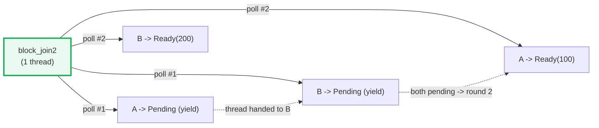

# ASYNC_BASICS — `Future`, `Poll`, and a Hand-Rolled `block_on` (No Runtime)

> **One-line goal:** `async`/`await` is **cooperative** concurrency on **one**
> thread — an `async fn` compiles to a **state machine** that implements
> `Future`; a future does **nothing** until an executor **`poll`s** it to
> completion, returning `Poll::Pending` (yield) or `Poll::Ready(T)`; `Pin` keeps
> self-referential state machines from being moved.
>
> **Run:** `just run async_basics` (== `cargo run --bin async_basics`)
> **Member:** `core` (stdlib-only — no `[dependencies]`). **No runtime** here:
> we build a tiny `block_on` by hand. 🔗 [TOKIO](#) (Phase 7) is the production
> runtime.
> **Prerequisites:** [THREADS](./THREADS.md) (OS threads — what async is *not*),
> [CLOSURES](./CLOSURES.md) (async blocks/closures), [ITERATORS](./ITERATORS.md)
> (laziness — futures are lazy too).
> **Ground truth:** [`async_basics.rs`](./async_basics.rs); captured stdout:
> [`async_basics_output.txt`](./async_basics_output.txt).

---

## Why this exists (lineage)

🔗 [THREADS](./THREADS.md) showed Rust's *other* concurrency model: `thread::spawn`
creates a real **OS thread** (a 1:1 kernel thread — megabytes of stack, a context
switch through the kernel). That is great for CPU parallelism, but expensive and
scarce: you cannot afford ten thousand OS threads waiting on ten thousand sockets.

`async` is the **cooperative** answer. Instead of one OS thread per task, you
build cheap **futures** and an **executor** that drives many of them on a small
pool of threads (even **one**). A future that is "waiting" does not block a
thread — it **yields** (`Poll::Pending`) and hands the thread to the next future.
When the thing it waits on becomes ready, the executor **polls it again**.

| Model | Unit of concurrency | Who switches? | Cost / when |
|---|---|---|---|
| **OS threads** (`std::thread`) | kernel thread | the **kernel** (preemptive) | heavy (~MB stack, syscall switch); great for CPU work |
| **async/await** | a **Future** state machine | the **executor** (cooperative — only at `.await`) | tiny futures; millions fit; ideal for many waiting tasks (I/O) |

The defining quote, from the async Book: "`async`/`.await` is Rust's built-in
tool for writing asynchronous functions that look like synchronous code. `async`
transforms a block of code into a **state machine** that implements a trait
called `Future`." ([async Book — primer][async-primer]) And the std docs drive
the laziness home: **"Futures alone are *inert*; they must be *actively* `poll`ed
for the underlying computation to make progress"** ([`std::future::Future`][std-future]).

```mermaid
graph TD
    AF["async fn add(a,b) -> i32"] -->|desugars| GEN["a generated STATE MACHINE<br/>(one state per .await point)"]
    GEN -->|implements| FUT["impl Future&lt;Output=i32&gt;<br/>(INERT until polled)"]
    FUT -->|block_on: loop poll(cx)| POLL["poll(self: Pin<&mut Self>, cx)<br/>-> Poll&lt;T&gt;"]
    POLL -->|not ready| PEND["Poll::Pending<br/>+ stores Waker, then yields"]
    POLL -->|ready| READY["Poll::Ready(T)<br/>-> returns T"]
    PEND -->|Waker wakes -> re-poll| POLL
    style FUT fill:#eafaf1,stroke:#27ae60,stroke-width:3px
    style POLL fill:#eaf2f8,stroke:#2980b9,stroke-width:2px
    style PEND fill:#fef9e7,stroke:#f1c40f,stroke-width:2px
    style READY fill:#eaf2f8,stroke:#2980b9,stroke-width:2px
```

The `Future` trait itself is tiny — one associated type, one method:

```rust
pub trait Future {
    type Output;
    fn poll(self: Pin<&mut Self>, cx: &mut Context<'_>) -> Poll<Self::Output>;
}
pub enum Poll<T> { Ready(T), Pending }
```

That `Pin<&mut Self>` (not `&mut Self`) is **the** detail that makes Rust's async
possible — it lets the state machine be **self-referential** without being moved.
Section F is all about why.

---

## Section A — `async fn` returns a Future; nothing happens until polled

```rust
async fn add(a: i32, b: i32) -> i32 { a + b }

let fut = add(2, 3);        // fut: impl Future<Output = i32> — body NOT run yet
let result = block_on(fut); // NOW an executor polls fut to Ready
```

> **From async_basics.rs Section A:**
> ```
> ======================================================================
> SECTION A — async fn returns a Future; NOTHING happens until polled
> ======================================================================
>   async fn add(a: i32, b: i32) -> i32 { a + b }
>   let fut = add(2, 3);        // fut is a Future; body NOT run yet
>   let result = block_on(fut); // NOW the executor polls it to Ready
>   result = 5
> [check] block_on(add(2, 3)) == 5: OK
>   block_on(async { add(10,10).await + 1 }) = 21
> [check] nested .await across two await points: result == 21: OK
> ```

**What.** Calling `add(2, 3)` prints nothing and computes nothing — it builds an
**inert** state machine. Only when `block_on` polls it does `a + b` actually
execute and yield `5`. The second example nests `.await` inside an `async {}`
block: `block_on` drives the outer future, and `.await` drives each sub-future.

**Why (internals).** `async fn add(..)` desugars to a plain function returning
`impl Future<Output = i32>` — it is *not* a callback and *not* a thread. The
Book's primer is explicit: "The value returned by `async fn` is a `Future`. For
anything to happen, the `Future` needs to be run on an executor"
([async Book — primer][async-primer]). Inside an `async fn`/block, `.await`
polls a sub-future to completion; the variable `y` stays **live across the await
point**, which is precisely what forces the generated struct to store it (and is
what makes `Pin` necessary — see Section F).

> **This is why async Rust "does nothing" without a runtime.** `fn main` is
> synchronous. A top-level `async fn` future will sit inert forever unless
> something polls it — that something is the runtime (`tokio`/`async-std`) or a
> hand-rolled `block_on` like ours. `tokio::main` is literally a macro that
> builds the executor and `block_on`s your `async main` on it (🔗 Phase 7).

---

## Section B — A hand-rolled `block_on`: poll until `Ready` (the executor)

Because futures are inert, *someone* must drive them. We build the smallest
possible executor: a loop that polls until `Poll::Ready`.

> **From async_basics.rs Section B:**
> ```
> ======================================================================
> SECTION B — a hand-rolled block_on: poll until Ready (the executor)
> ======================================================================
>   pub trait Future {
>       type Output;
>       fn poll(self: Pin<&mut Self>, cx: &mut Context) -> Poll<Self::Output>;
>   }
>   pub enum Poll<T> { Ready(T), Pending }
> 
>   block_on = `loop { if Ready(v) = poll(cx) { return v } }`
>   (with a Waker in the Context; we use a noop one + busy poll)
>   block_on(std::future::ready(42)) -> 42  (Ready on poll #1)
> [check] block_on drives std::future::ready(42) == 42: OK
>   block_on(Ready(Some(42)))     -> 42  (Ready on poll #1)
> [check] our Ready<T> wrapper == std::future::ready behavior: OK
> [check] block_on always returns exactly the future's Output (here i32): OK
> ```

**What.** `std::future::ready(42)` and our own `Ready<T>` wrapper are both
`Ready` on the **first** poll, so `block_on` returns at once. The core of the
executor is four lines:

```rust
fn block_on<F: Future>(fut: F) -> F::Output {
    let waker = noop_waker();                       // a Waker the Context needs
    let mut cx = Context::from_waker(&waker);
    let mut fut = pin!(fut);                         // pin: !Unpin futures need it
    loop {
        if let Poll::Ready(v) = fut.as_mut().poll(&mut cx) { return v; }
        // Pending -> loop and poll again (busy poll; no timers, no parking)
    }
}
```

**Why (internals).**
- **`poll` takes a `Context`, which carries a `Waker`.** The contract ([std
  `Future` docs][std-future]): when `poll` returns `Pending`, the future must
  store a clone of the `Waker` and arrange for it to be `wake()`n when progress
  is possible; the executor then re-polls. Our `NoopWaker` does nothing because
  our executor **busy-polls** (re-polls unconditionally each loop), which keeps
  the output deterministic — no OS scheduling, no wall-clock.
- **The canonical `block_on`** (right out of the `std::task::Wake` docs) is
  identical in shape but uses a **`ThreadWaker`** that calls
  `thread::current().unpark()`, and the loop calls `thread::park()` on `Pending`
  ([`std::task::Wake`][std-wake]). We simplify to a busy loop so this bundle
  needs **no timers and no thread parking** — "async waiting" here is a ready
  flag flipped on the next poll, which is why `_output.txt` reproduces exactly.
- **`pin!(fut)`** is load-bearing: an `async fn` future is `!Unpin`, so it
  **cannot** be polled without being pinned first. `pin!` (stabilized 1.68) is
  the safe, allocation-free way to pin on the stack. More in Section F.

> **`Wake` vs `RawWaker`.** Building a `Waker` from scratch has two paths: the
> **safe** `std::task::Wake` trait + `Waker::from(Arc<W>)` (what we use), or the
> **`unsafe`** `RawWaker`/`RawWakerVTable` (for `#![no_std]`/embedded where
> `Arc`/atomics are unavailable). `Wake` is a "memory-safe and ergonomic
> alternative" to `RawWaker` ([`std::task::Wake`][std-wake]).

🔗 [BOX_RC_ARC](./BOX_RC_ARC.md) — `Arc` is the ownership backbone of the
`Wake`-to-`Waker` bridge (each wake clones an `Arc` handle to the task).

---

## Section C — `Poll` semantics: a custom Future that is `Pending` once, then `Ready`

To see `Pending` we must **write** a future by hand: `YieldOnce<T>` returns
`Pending` on the first poll (honoring the waker contract) and `Ready(value)` on
the second.

> **From async_basics.rs Section C:**
> ```
> ======================================================================
> SECTION C — Poll semantics: a custom Future that is Pending ONCE, then Ready
> ======================================================================
>   impl Future for YieldOnce<T> {
>       fn poll(self: Pin<&mut Self>, cx) -> Poll<T> {
>           if self.yielded { Poll::Ready(value) }
>           else { self.yielded = true; cx.waker().wake_by_ref();
>                 Poll::Pending }   // <- yields the thread once
>       }
>   }
>   block_on(YieldOnce::counted("done")) -> "done"
>   poll count = 2  (Pending on poll #1, Ready on poll #2)
> [check] YieldOnce returned its value: "done": OK
> [check] YieldOnce polled exactly twice: Pending once, then Ready: OK
> ```

**What.** The shared poll counter proves `YieldOnce` was polled **exactly twice**
— one `Pending`, one `Ready`. `block_on` completes and returns `"done"`.

**Why (internals).**
- **`Pending` means "I can't make progress now; poll me again later."** The
  std contract: when a future returns `Pending` it stores the `Waker` from the
  `Context`; whoever later calls `Waker::wake` signals the executor to re-poll
  ([`std::future::Future` — return value][std-future]). `YieldOnce` calls
  `cx.waker().wake_by_ref()` *immediately* — in a parking executor that would
  re-schedule the task at once; in our busy executor it is a no-op (we re-poll
  anyway). Either way the next poll returns `Ready`.
- **A future that is always `Pending` would hang `block_on` forever.** That is
  not a bug in the executor — it is the contract: a well-behaved future must
  eventually become `Ready`, and it must actually arrange a wakeup. (A common
  bug: forgetting to register/call the waker so the future is never re-polled.)
- **"Once `Ready`, do not poll again."** The std docs: "Once a future has
  finished, clients should not `poll` it again" — re-polling a completed future
  may panic or worse ([`std::future::Future`][std-future]). `block_on` returns
  immediately on `Ready`, and `YieldOnce`'s `.take()` would panic if mis-polled.

```mermaid
sequenceDiagram
    participant E as block_on (executor)
    participant F as YieldOnce
    E->>F: poll #1(cx)
    F->>F: yielded=false -> set true; store+wake(cx.waker)
    F-->>E: Poll::Pending
    E->>E: (busy loop / re-scheduled by wake)
    E->>F: poll #2(cx)
    F-->>E: Poll::Ready(value)
```

---

## Section D — `async fn` IS a state machine: suspend & resume across awaits

An `async fn` with two `.await` points compiles to a state machine with (roughly)
a state per await. It runs to await #1, **yields**; resumes at await #1 and runs
to await #2, **yields**; resumes and finishes — all on the **same** thread.

> **From async_basics.rs Section D:**
> ```
> ======================================================================
> SECTION D — async fn is a state machine: suspend & resume across awaits
> ======================================================================
>   async fn two_steps(log) -> i32 {
>       log.push("step1..."); let a = yield(10).await;
>       log.push("step2..."); let b = yield(a+5).await;
>       log.push("step3..."); b
>   }
>   block_on(two_steps(..)) -> 15   (suspend, resume, suspend, resume)
>   execution trace (in order):
>     step1: before first await
>     step2: after await #1, a = 10
>     step3: after await #2, b = 15
> [check] two_steps returned the final value 15 (10 then 10+5): OK
> [check] state machine ran step1, step2, step3 in ORDER (suspend+resume preserves it): OK
> ```

**What.** The trace is printed in strict order `step1 → step2 → step3`, and the
final value is `15` (`a = 10`, `b = 10 + 5`). Each `yield(..).await` (a
`YieldOnce`) suspends the whole function; `block_on`'s re-poll **resumes exactly
where it left off**, with `a` still bound to `10`.

**Why (internals).**
- **The compiler lowers the body into an `enum` of states.** Conceptually,
  `two_steps` becomes something like:

  ```rust
  enum TwoSteps {
      Start,                 // about to run until await #1
      Awaited1 { a: i32 },   // suspended at await #2; `a` is LIVE across it
      Done,
  }
  ```

  `poll` is a `match` on that state: it runs forward until the next suspension,
  transitions the state, and returns `Pending`. This is *exactly* the "futures
  compile to allocation-free state machines" point the async Book makes
  ([async Book — Future trait][async-future]).
- **`a` survives the first await because the state machine STORES it.** Locals
  that are live across an `.await` are **fields** of the generated struct, not
  stack slots that vanish. That is why async code "remembers" values across
  awaits — and why a future can become **self-referential** (Section F).
- **`log.lock().unwrap().push(..)` never holds its lock across an await.** Each
  guard is dropped at the statement's `;`; the `.await` is a separate statement.
  Holding a `MutexGuard` (or any non-`Send` guard) across `.await` is the classic
  footgun clippy's `await_holding_lock` catches — see the pitfalls table.

---

## Section E — Concurrency on ONE thread: a round-robin join of two futures

No new OS threads: `block_join2` polls future **A** then future **B** each pass.
They make progress by **cooperating** (yielding), so two "concurrent" tasks
interleave on a single thread.

> **From async_basics.rs Section E:**
> ```
> ======================================================================
> SECTION E — concurrency on ONE thread: round-robin join of two futures
> ======================================================================
>   block_join2(StepFuture("A",100), StepFuture("B",200))
>   poll order (deterministic round-robin):
>     A: Pending (yield once)
>     B: Pending (yield once)
>     A: Ready(100)
>     B: Ready(200)
>   outputs = (100, 200);  sorted = [100, 200]
> [check] both futures completed: outputs (100, 200): OK
> [check] round-robin interleaving is deterministic: A-pend, B-pend, A-ready, B-ready: OK
> [check] sorted outputs == [100, 200] (determinism discipline): OK
> ```

**What.** The log shows the exact interleaving — `A: Pending`, `B: Pending`,
`A: Ready(100)`, `B: Ready(200)` — and **both** complete. The outputs are sorted
before the check, per the determinism discipline.

**Why (internals).**
- **This is the heart of cooperative concurrency.** Each future runs until it
  `Pending`s (yields the thread); the executor immediately polls the next. There
  is exactly **one** thread here, doing both tasks by time-slicing at `.await`
  points. The async Book's `Join` example demonstrates the identical mechanism:
  "calls to `poll` each future may be interleaved, allowing each future to
  advance itself at its own pace" ([async Book — Future trait][async-future]).
- **The interleaving is DETERMINISTIC** — unlike 🔗 [THREADS](./THREADS.md),
  where the OS scheduler picks who runs first and we had to **sort** outputs to
  keep stdout stable. Here the poll order is fixed (A then B each round), so we
  can assert the **exact** sequence. (We still sort the outputs in the check as a
  belt-and-suspenders determinism habit.)
- **A future that never yields (busy work, no `.await`) starves everyone.**
  Cooperative means a task must *cooperate* by yielding; a tight loop with no
  await point monopolizes the thread. Real runtimes preempt with a timer
  occasionally, but the base model is cooperative.



> In production you would write `futures::join!(a, b)` or `tokio::join!` instead
> of our `block_join2` — they poll both branches concurrently in exactly this
> round-robin way, but with proper wakers so a branch is re-polled *only* when
> its own waker fires (not on every loop). That is the 🔗 [TOKIO](#) (Phase 7)
> story.

---

## Section F — Why `Pin`: async state machines can be self-referential

`poll`'s signature is `fn poll(self: Pin<&mut Self>, ..)` — **not** `&mut Self`.
That `Pin` is the whole reason `async`/`await` can exist in safe Rust.

> **From async_basics.rs Section F:**
> ```
> ======================================================================
> SECTION F — why Pin: async state machines can be self-referential
> ======================================================================
>   async fn body -> a generated state-machine struct.
>   Locals LIVE across an .await are stored IN that struct. If a local
>   holds a reference into ANOTHER local of the same struct, the struct
>   is SELF-REFERENTIAL. Moving it in memory would dangle that pointer.
>   Pin<&mut Self> in poll's signature GUARANTEES the value will not be
>   moved, so the self-reference stays valid. `Unpin` types opt out.
> 
>   i32 is Unpin -> Pin::new(&mut x); *p.get_mut() = 2; -> x = 2
> [check] Unpin type (i32): Pin<&mut> allows mutation via get_mut: OK
>   needs_unpin::<i32>() compiled  (i32: Unpin).
> [check] i32: Unpin (compile-witness); an async-block future is !Unpin: OK
> ```

**What.** For an `Unpin` type like `i32`, `Pin<&mut T>` behaves like `&mut T`:
`Pin::new` exists, and `get_mut` lets you move/replace the value. An async-block
future, by contrast, is **`!Unpin`** — the compile-witness `needs_unpin::<i32>()`
compiles, but `needs_unpin_val(&async_block)` does **not**.

**Why (internals).**
- **The problem.** Across an `.await`, a local may hold a **reference into
  another local** of the same generated struct:

  ```rust
  async fn selfref() {
      let s = String::from("hi");
      let r = &s;            // r points INTO this async fn's state machine
      yield_once().await;    // <- suspension: s AND r are stored as fields
      println!("{r}");       // r must still point at s after the resume
  }
  ```

  If that state machine were ever **moved** in memory after `r` was created, `r`
  would dangle (it would still hold the old address of `s`). The async Book:
  `Pin<&mut Self>` "allows us to create futures that are **immovable**.
  Immovable objects can store pointers between their fields…
  **Pinning is necessary to enable async/await**" ([async Book — Future trait][async-future]).
- **The guarantee.** `Pin<P>` is a promise that the pointee will **not be moved**
  (until it is dropped). With that promise, a self-pointer stored in a field stays
  valid for the life of the future. `poll` taking `Pin<&mut Self>` is how the
  compiler proves, at every poll, that the state machine hasn't been relocated.
- **`Unpin` is the opt-out.** Most types (`i32`, `String`, `Vec`, `Arc`) are
  `Unpin` — moving them is always safe (no self-references), so `Pin<&mut T>` for
  them is just `&mut T` and `Pin` imposes no real restriction (`get_mut`/`into_inner`/`Pin::new` all work). An async-generated future is `!Unpin` *in
  general* (the compiler is conservative), which is why **you must pin it before
  polling** — that is exactly what `pin!`, `Box::pin`, and `.await` do for you.
- **You almost never touch `Pin` by hand.** `async`/`await`, `pin!`, and
  `Box::pin` cover essentially every case. Hand-writing `Pin`-projecting code on
  a `!Unpin` future requires `unsafe` (or the `pin-project` crate); this bundle
  deliberately does **not** — it only pins via the safe `pin!` macro.

**The compile error (cannot live in the runnable `.rs` — it would not build):**
passing an `async {}` future (which is `!Unpin`) to a function requiring `Unpin`:

```console
error[E0277]: `{async block@t.rs:3:13: 3:18}` cannot be unpinned
 --> t.rs:4:21
  |
4 |     needs_unpin_val(&f);
  |     --------------- ^^ the trait `Unpin` is not implemented for `{async block@t.rs:3:13: 3:18}`
  |     |
  |     required by a bound introduced by this call
  |
  = note: consider using the `pin!` macro
          consider using `Box::pin` if you need to access the pinned value outside of the current scope
```

The note even tells you the fix (`pin!` / `Box::pin`). 🔗 [BOX_RC_ARC](./BOX_RC_ARC.md)
covers `Box::pin` and `Pin<Box<dyn Future>>` (the type-erased pinned future).

---

## Pitfalls (the expert payoff)

| Trap | Symptom | Fix / why |
|---|---|---|
| **Calling an `async fn` and not driving it** | "my async code never runs / nothing prints" | An `async fn` returns an **inert** future. You must `.await` it (inside another async) or `block_on` it. A bare `add(2,3);` is a no-op warning (`unused future that must be used`). |
| **Forgetting a runtime** | `error: future is not `Send`` / nothing executes / "`main` is not async" | `fn main` is sync. You need a runtime (`#[tokio::main]`) or a hand-rolled `block_on`. There is **no** runtime in std. |
| **A future that returns `Pending` without arranging a wake** | the task hangs forever (never re-polled) | The contract: on `Pending`, store/call the `Context`'s `Waker`. Miss it and the executor never polls you again. (Our `YieldOnce` calls `wake_by_ref`.) |
| **Polling a future after `Ready`** | panic / corruption / "once finished, clients should not poll it again" | `block_on`/`.await` stop on `Ready`. Re-polling a completed future is UB-adjacent and explicitly disallowed. |
| **Holding a lock/guard across `.await`** | clippy `await_holding_lock` / subtle deadlock / `!Send` future | Drop guards before the `.await`. A `MutexGuard` held across an await makes the future `!Send` and can deadlock a multi-thread runtime. |
| **A future that never yields** | other tasks starve; the runtime appears frozen | Async is **cooperative**: a task must `.await` to yield the thread. Long CPU work with no await monopolizes it — offload to `spawn_blocking` (🔗 Phase 7). |
| **`block_on`-inside-`block_on` / `.await` in `fn main`** | "cannot use `await` outside of an async context" / nested executor deadlock | Only `.await` inside `async`. A real runtime's `block_on` re-entrant handling is subtle; the `Wake` docs note nested `block_on` "trades correctness for simplicity." |
| **Treating `Pin` as `&mut` on a `!Unpin` future** | `get_mut`/`into_inner` unavailable; can't move out | `!Unpin` futures can be self-referential. Use `pin!`/`Box::pin`/`.await`; never hand-roll `Pin` projection without `pin-project` or `unsafe`. |
| **Confusing async with parallelism** | "I added `.await` but it's not faster" | Async is **concurrency** (interleaving), not parallelism. One future per thread does NOT run in parallel unless the runtime has multiple worker threads AND you `spawn` them. |
| **`Future` not `Send` so `tokio::spawn` rejects it** | `error: future cannot be sent between threads safely` | A `!Send` value held across `.await` (e.g. `Rc`, non-`Send` guard) poisons the future. Use `Arc`/`Send` types across awaits; or `tokio::task::LocalSet`. |

---

## Cheat sheet

```rust
// async fn == fn returning impl Future<Output=..>; the body is INERT until polled.
async fn add(a: i32, b: i32) -> i32 { a + b }   // returns impl Future<Output=i32>

// The trait: one method, poll, returning Poll<T>.
//   trait Future { type Output;
//     fn poll(self: Pin<&mut Self>, cx: &mut Context) -> Poll<Self::Output>; }
//   enum Poll<T> { Ready(T), Pending }
// Futures are INERT: "Futures alone are inert; they must be actively polled."

// block_on: a loop that polls a future to completion (the executor).
fn block_on<F: Future>(fut: F) -> F::Output {
    let waker = Waker::from(Arc::new(NoopWaker));   // Wake trait -> Waker
    let mut cx = Context::from_waker(&waker);
    let mut fut = pin!(fut);                         // pin: !Unpin futures NEED it
    loop { if let Poll::Ready(v) = fut.as_mut().poll(&mut cx) { return v; } }
}   // real runtimes park on Pending & re-poll when the Waker fires; we busy-poll.

// Pending contract: on Pending, store/call cx.waker(); the executor re-polls.
// A future must eventually be Ready; never poll again after Ready.

// async fn == a state machine: one state per .await; locals live across awaits.
// Pin<&mut Self> guarantees the (possibly self-referential) state machine won't
// move. Unpin types (i32, String, Arc) opt out. Use pin!/Box::pin/.await — never
// hand-roll Pin projection on a !Unpin future without `pin-project`/unsafe.

// Concurrency != parallelism: round-robin polling interleaves futures on ONE
// thread (cooperative); parallelism needs multiple threads + spawn (THREADS).
```

---

## Sources

Every claim above was web-verified in at least two authoritative places.

- **`std::future::Future` docs** — the exact `poll` signature
  `fn poll(self: Pin<&mut Self>, cx: &mut Context) -> Poll<Self::Output>`,
  `Poll::Pending`/`Poll::Ready`, the waker contract ("store a clone of the
  `Waker`… woken once the future can make progress"), "Futures alone are *inert*;
  they must be *actively* `poll`ed", "once a future has finished, clients should
  not `poll` it again":
  https://doc.rust-lang.org/std/future/trait.Future.html
- **Asynchronous Programming in Rust — `async`/`await` primer** — "`async`
  transforms a block of code into a **state machine** that implements a trait
  called `Future`", "The value returned by `async fn` is a `Future`. For anything
  to happen, the `Future` needs to be run on an executor", `block_on` drives the
  top-level future, `.await` vs `block_on`, `join!` for concurrency:
  https://rust-lang.github.io/async-book/01_getting_started/04_async_await_primer.html
- **Asynchronous Programming in Rust — The `Future` Trait** — the real
  `Pin<&mut Self>` + `Context`/`Waker` signature, "self type… `Pin<&mut Self>`…
  allows us to create futures that are **immovable**… **Pinning is necessary to
  enable async/await**", the `Join` combinator as interleaved polls:
  https://rust-lang.github.io/async-book/02_execution/02_future.html
- **Asynchronous Programming in Rust — Build an Executor** — the executor polls
  futures, re-polls on `wake()`, a full task-queue executor design:
  https://rust-lang.github.io/async-book/02_execution/04_executor.html
- **`std::task::Wake` docs** — the canonical `block_on` example with a
  `ThreadWaker` (`thread::current().unpark()` + `thread::park()`), `Wake` as a
  "memory-safe and ergonomic alternative" to `RawWaker`, `Waker::from(Arc<W>)`:
  https://doc.rust-lang.org/std/task/trait.Wake.html
- **`std::pin::pin!` macro docs** — safe stack pinning ("the main non-`unsafe`
  `#![no_std]`-compatible `Pin` constructor"), the manually-polling-a-Future
  example with `pin!(fut)` + `as_mut().poll`, why `pin!` cannot return a pinned
  value (use `Box::pin`), edition-2024 `use std::pin::pin`:
  https://doc.rust-lang.org/std/pin/macro.pin.html
- **`std::pin::Pin` / `Unpin`** — the pinning guarantee, `Pin::new`/`get_mut`
  require `T: Unpin`, why `!Unpin` self-referential types need it (corroborates
  the async Book's immovability argument):
  https://doc.rust-lang.org/std/pin/index.html
