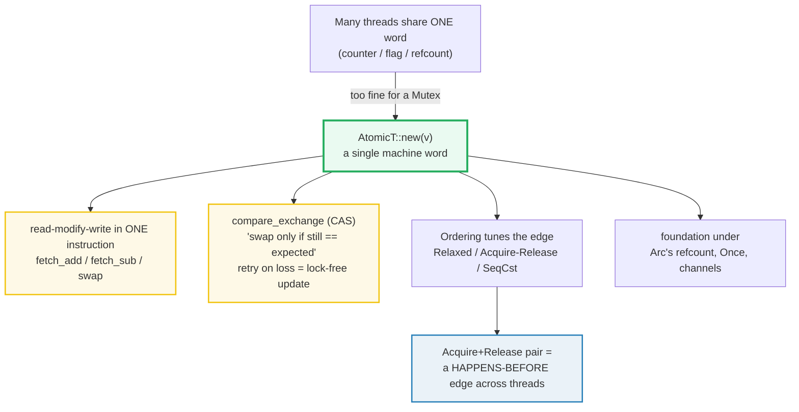
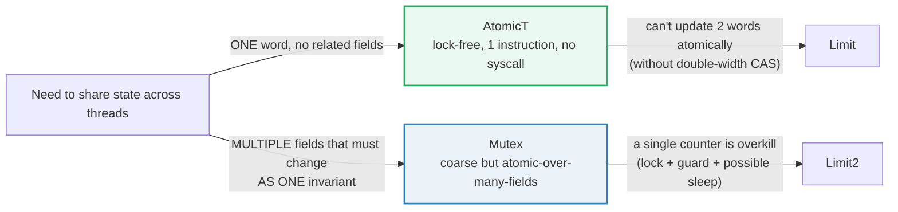

# ATOMICS — Lock-Free Shared State and Memory Ordering

> **One-line goal:** `std::sync::atomic` gives lock-FREE, single-word shared
> state whose reads/writes are indivisible and whose memory **ordering** can
> publish/observe a happens-before edge between threads — the primitive
> underneath `Arc`'s refcount, `Once`, and channels.
>
> **Run:** `just run atomics` (== `cargo run --bin atomics`)
> **Member:** `core` (stdlib-only — no `[dependencies]`).
> **Prerequisites:** 🔗 [THREADS](./threads.rs) (`Send`/`Sync`, scoped threads),
> 🔗 [MUTEX_RWLOCK](./MUTEX_RWLOCK.md) (the heavier lock-based alternative),
> 🔗 [BOX_RC_ARC](./BOX_RC_ARC.md) (`Arc`'s refcount is an atomic — see Section F).
> **Ground truth:** [`atomics.rs`](./atomics.rs); captured stdout:
> [`atomics_output.txt`](./atomics_output.txt).

---

## Why this exists (lineage)

A 🔗 [MUTEX_RWLOCK](./MUTEX_RWLOCK.md) is a **coarse** tool: it serializes a
whole critical section, takes a (cheap but real) lock/unlock pair, and on
contention can put a thread to sleep (a syscall). For the single most common
concurrency need — **one number that many threads bump** (a counter, a flag, a
refcount) — that is wildly overkill. Atomics are the **fine-grained** primitive
for exactly that case: a single machine word updated by **one** hardware
instruction, with no lock, no guard, and no sleeping.



Rust does **not** invent its own memory model. Per the Rustnomicon, "Rust pretty
blatantly just inherits the memory model for atomics from C++20" — including its
well-known complexity ([nomicon][nomicon]). The payoff for that complexity is
that the same `AtomicT` type serves a counter (cheapest), a hand-rolled lock, a
once-init guard, and a thread-safe reference count.

---

## The two jobs of an atomic

1. **Atomicity** — the word is never seen half-written. A `fetch_add` is a
   read-modify-write (RMW) that no other thread can observe mid-flight. This
   holds even at the weakest ordering, `Relaxed`.
2. **Ordering / synchronization** — *optionally*, an atomic op can establish a
   **happens-before** relationship with another thread, so non-atomic writes
   made before it become visible after it. This is what `Ordering` controls.

Sections A/D exercise job 1; Section B exercises job 2; Section C builds a
real lock-free structure (a counter) out of both.

---

## Section A — load / store / fetch_add / swap: the RMW vocabulary

```rust
use std::sync::atomic::{AtomicI32, Ordering};

let a = AtomicI32::new(0);   // construct the atomic cell
a.store(7, Ordering::Relaxed);
let _v = a.load(Ordering::Relaxed);

let old = a.fetch_add(5, Ordering::Relaxed);  // RMW: returns OLD, cell = old+5
let _prev = a.swap(99, Ordering::Relaxed);    // RMW: returns old, cell = 99
```

> **From atomics.rs Section A:**
> ```
> ======================================================================
> SECTION A — load / store / fetch_add / swap: the RMW vocabulary
> ======================================================================
>   let a = AtomicI32::new(0);   a.load(Relaxed) = 0
>   a.store(7, Relaxed);         a.load(Relaxed) = 7
> [check] store writes a whole word: a.load(Relaxed) == 7 after store(7): OK
>   let c = AtomicI32::new(0); c.fetch_add(5, Relaxed) -> 0 (OLD); c.load -> 5
> [check] fetch_add returns the PREVIOUS value (0); the cell then holds 0+5 = 5: OK
>   c.fetch_add(5, Relaxed) -> 5 (OLD);  c.load -> 10
> [check] second fetch_add returns 5 (the previous), cell now 10: OK
>   c.swap(99, Relaxed) -> 10 (OLD);       c.load -> 99
> [check] swap returns the previous (10) and stores 99: OK
> ```

**What.** `fetch_add` returns the value the cell held **before** the add, then
leaves the cell at `old + n`. The output pins this exactly: from `0`,
`fetch_add(5)` returns `0` and the next `load` reads `5`; a second `fetch_add(5)`
returns `5` and the cell becomes `10`. `swap` is the unconditional version — it
overwrites and hands back the previous value.

**Why (internals).**
- `AtomicI32` has "the same size and bit validity as the underlying integer type,
  `i32`" but with a stronger alignment, and is "only available on platforms that
  support atomic loads and stores of `i32`" ([AtomicI32 docs][std-atomic-i32]).
  Conceptually it is an `i32` the compiler promises to touch only with indivisible
  CPU instructions (`LOCK XADD` on x86, `LDXR`/`STXR` loops on ARM).
- `fetch_add` is a **read-modify-write (RMW)** instruction. Because it reads and
  writes in one bus operation, two threads doing `fetch_add(1)` concurrently
  **cannot** lose an increment — the count rises by exactly 2. This is the core
  advantage over `*p += 1` on a shared `i32` (a plain load, add, store — a data
  race that would lose updates).
- All the `fetch_*` ops (`fetch_sub`, `fetch_and`, `fetch_or`, `fetch_xor`,
  `fetch_max`, `fetch_min`) share this "return the **previous** value" contract,
  and all **wrap around on overflow** (no panic, even in debug) ([AtomicI32
  docs][std-atomic-i32]).
- The whole of Section A uses `Ordering::Relaxed`. That is correct *here* because
  no other data is being synchronized — these are independent word updates. The
  nomicon: "incrementing a counter can be safely done by multiple threads using a
  relaxed `fetch_add` if you're not using the counter to synchronize any other
  accesses" ([nomicon][nomicon]).

---

## Section B — Ordering: a Release store pairs with an Acquire load

Atomics' second job is **synchronization**: publishing ordinary (non-atomic)
writes from one thread to another. The model (C++20, inherited by Rust) gives you
five orderings in `std::sync::atomic::Ordering` ([Ordering docs][std-ordering]):

| Ordering | Use on | Meaning (nomicon phrasing) |
|---|---|---|
| `Relaxed` | any | No ordering constraint — atomicity only. |
| `Release` | a **store** | Everything I wrote *before* this is now published. |
| `Acquire` | a **load** | If I read the published value, I see all those writes. |
| `AcqRel` | an RMW | Both: `Acquire` for the load half, `Release` for the store half. |
| `SeqCst` | any | Acquire/Release **plus** one global order all threads agree on. Strongest, slowest. |

The load/store panics to remember (from the [AtomicI32 docs][std-atomic-i32]):
`load` accepts only `SeqCst`/`Acquire`/`Relaxed` (panics on `Release`/`AcqRel`);
`store` accepts only `SeqCst`/`Release`/`Relaxed` (panics on `Acquire`/`AcqRel`).
And `compare_exchange`'s **failure** ordering "can only be `SeqCst`, `Acquire` or
`Relaxed`" and must be no stronger than the success ordering.

```rust
// producer: write the payload, THEN publish it with a Release store of the flag
data.store(42, Ordering::Relaxed);
ready.store(true, Ordering::Release);

// consumer: Acquire-load the flag; once it reads true, the payload read is safe
while !ready.load(Ordering::Acquire) { std::hint::spin_loop(); }
let v = data.load(Ordering::Relaxed);   // guaranteed to see 42
```

> **From atomics.rs Section B:**
> ```
> ======================================================================
> SECTION B — Ordering: a Release store pairs with an Acquire load
> ======================================================================
>   data = AtomicI32::new(0);  ready = AtomicBool::new(false);
>   after join: consumer broke the Acquire spin loop and read data = 42
> [check] Release-store / Acquire-load handshake: consumer observed the payload (42): OK
> [check] producer's Relaxed store of 42 is the cell's final value after join: OK
> ```

**What.** The producer writes `42` into `data` (a `Relaxed` store — atomic, but
by itself publishes nothing), then sets `ready = true` with `Release`. The
consumer spins on `ready` with `Acquire`. The output shows that once the consumer
breaks out of the loop it reads `data == 42` — never the stale `0`.

**Why (internals) — the happens-before edge.**
- A `Release` store and an `Acquire` load **of the same variable** that observes
  it establish a **synchronizes-with** edge. From the [Ordering docs][std-ordering]:
  a `Release` store makes "all previous operations ... ordered before any load of
  this value with `Acquire` (or stronger) ordering … all previous writes become
  visible."
- Concretely: `data.store(42)` is **sequenced-before** `ready.store(Release)` in
  the producer; the consumer's `ready.load(Acquire)` that returns `true`
  **synchronizes-with** that store; `data.load(Relaxed)` is **sequenced-after**
  the Acquire load. Chained (`sequenced-before` ∘ `synchronizes-with` ∘
  `sequenced-after`), the payload read **happens-after** the payload write — so it
  is *guaranteed* to observe `42`. This is a property of the model, not of luck or
  of x86 being strongly ordered.
- **Why not just use `Relaxed` everywhere?** With both ops `Relaxed` there is **no**
  edge. The compiler and CPU may reorder the producer's two stores (or the
  consumer's load pair), so the consumer could in principle observe
  `ready == true` while still seeing `data == 0`. On strongly-ordered x86 this
  rarely bites; on weakly-ordered ARM it absolutely will. The nomicon warns that
  bugs from too-weak ordering "are more likely to *happen* to work" on x86 — so
  "concurrent algorithms should be tested on weakly-ordered hardware"
  ([nomicon][nomicon]).
- **`SeqCst`** is the safe default when unsure: it is "like
  Acquire/Release/AcqRel … with the additional guarantee that all threads see all
  sequentially consistent operations in the same order" ([Ordering
  docs][std-ordering]). It costs a memory fence even on x86, so reach for it when
  correctness is unclear and downgrade to `Relaxed`/Acquire-Release once proven —
  not the reverse.
- **`AcqRel`** is for RMW ops that both read and write (e.g. the
  `compare_exchange` inside a lock acquire): it applies `Acquire` to the load and
  `Release` to the store. Note the docs' subtlety: a *failed* CAS does no store,
  so `AcqRel` on failure degrades to plain `Acquire` — "however, `AcqRel` will
  never perform `Relaxed` accesses" ([Ordering docs][std-ordering]).

> **The spin loop.** `while !ready.load(Acquire) { std::hint::spin_loop(); }` is
> the idiomatic busy-wait. `spin_loop()` emits a CPU hint (`PAUSE`/`YIELD`) that
> tells the hyperthread "I am waiting" — it is not a no-op, and clippy will nag a
> truly empty `loop {}` (`clippy::empty_loop`).

---

## Section C — The CAS loop: a lock-free update via `compare_exchange`

`compare_exchange` ("CAS") is the universal building block of lock-free code:
"store `new` **only if** the current value still equals `expected`; tell me
whether it happened." Spelled as a **retry loop**, it builds any atomic update
the hardware doesn't offer directly.

```rust
loop {
    let cur = counter.load(Ordering::Relaxed);
    let next = cur + 1;
    if counter.compare_exchange(cur, next, Ordering::Relaxed, Ordering::Relaxed).is_ok() {
        break;            // won the race
    }
    // lost: `cur` was stale — reload and retry
}
```

> **From atomics.rs Section C:**
> ```
> ======================================================================
> SECTION C — the CAS loop: a lock-free update via compare_exchange
> ======================================================================
>   counter = AtomicUsize::new(0);  8 threads x 20000 increments each
>   CAS-loop version: final counter.load(Relaxed) = 160000  (== 8 * 20000)
> [check] lock-free CAS loop: N threads x K increments -> final == N*K (no lost updates): OK
>   fetch_add version: final = 160000  (one RMW per increment, no retry loop)
> [check] fetch_add(1, Relaxed) reaches the same total as the CAS loop (both lock-free): OK
> ```

**What.** 8 threads each run 20 000 increments through a CAS loop. The final
counter is exactly `160 000` — `8 * 20 000` — with **no lost updates**, even
though threads constantly steal work from under each other and retry. The second
check runs the *same* workload with `fetch_add(1, Relaxed)` and reaches the same
total.

**Why (internals).**
- **Why the loop converges.** `compare_exchange` succeeds only if the value is
  *still* `cur` when it runs; otherwise it returns `Err(actual)` and writes the
  actual value back into your `expected` slot. So on contention a thread just
  reloads and retries. Because every retry reads the *latest* value, progress is
  guaranteed as long as **some** thread's CAS wins — that is the definition of
  **lock-free** (system-wide forward progress). Contrast with a mutex, where a
  crashed/unscheduled holder blocks everyone.
- **`compare_exchange` vs `compare_exchange_weak`.** The `_weak` variant "is
  allowed to fail spuriously even when the comparison succeeds, which can result
  in more efficient code on some platforms" ([AtomicI32 docs][std-atomic-i32]) —
  so in a loop you use `_weak`; in a single-shot you use the strong form. This
  file uses the strong form for clarity.
- **When you don't need the loop.** For plain "add to a word", `fetch_add` is one
  hardware instruction with no retry — strictly better than the CAS loop, as the
  side-by-side check shows. Reach for the CAS loop only when the update is a
  *function* of the current value that no single RMW instruction covers (e.g.
  "double it", "push if there's room", "advance a linked-list head").
- **Determinism discipline.** The **final** `160 000` is deterministic (it is the
  sum of all increments), but the *interleaving* — which thread won which CAS —
  is not. This file therefore asserts the **total** after `join` and never prints
  from inside a thread (the `HOW_TO_RESEARCH.md` §4.2 rule 3).

> **ABA warning.** CAS reasons about *bitwise equality*, not identity. A sequence
> A→B→A looks "unchanged" to a CAS even though two mutations happened in between.
> For indices/pointers this is the classic **ABA problem** (the docs call it out
> explicitly for `compare_exchange`). Counters bounded to one writer's lifetime
> are safe; free-list indices and recycled pointers are not.

---

## Section D — `compare_exchange`: `Ok` on match, `Err` on mismatch

```rust
let a = AtomicI32::new(5);

a.compare_exchange(5, 10, Ordering::Acquire, Ordering::Relaxed)  // -> Ok(5)
a.compare_exchange(6, 12, Ordering::SeqCst, Ordering::Acquire)   // -> Err(10)
```

> **From atomics.rs Section D:**
> ```
> ======================================================================
> SECTION D — compare_exchange: Ok on match, Err on mismatch
> ======================================================================
>   let a = AtomicI32::new(5);
>   a.compare_exchange(5, 10, Acquire, Relaxed) -> Ok(5)
>   a.load(Relaxed) -> 10 (swapped)
> [check] compare_exchange Ok when expected matches: Ok(5), cell now 10: OK
>   a.compare_exchange(6, 12, SeqCst, Acquire) -> Err(10)
>   a.load(Relaxed) -> 10 (unchanged)
> [check] compare_exchange Err on mismatch: Err(10) (the ACTUAL value), cell unchanged: OK
> ```

**What.** The two checks pin both outcomes. When `expected` (5) matches the
current value, the swap happens and CAS returns `Ok(previous)` — and the docs
guarantee that previous value **equals** `expected` ([AtomicI32 docs][std-atomic-i32]).
When `expected` (6) does **not** match (the cell holds 10), nothing is written and
CAS returns `Err(actual)` carrying the value that *was* there.

**Why (internals).**
- The signature is
  `compare_exchange(&self, current: T, new: T, success: Ordering, failure: Ordering) -> Result<T, T>`
  ([AtomicI32 docs][std-atomic-i32]). `success` is the ordering of the RMW on a
  win; `failure` is the ordering of the *load* on a loss, and "can only be
  `SeqCst`, `Acquire` or `Relaxed`" and must be ≤ `success`.
- The `Err` value is **load-bearing**: in a CAS loop you can fold it straight back
  into `expected` instead of re-loading — `Err(x) => expected = x`. (The docs note
  `compare_exchange(...).unwrap_or_else(|x| x)` recovers the old
  `compare_and_swap` behavior.) This is why a CAS loop reloads "for free" on
  contention.
- `Ok` carrying the previous value (not `()`) lets you build **fetch-and-update**
  primitives: you always learn what was there, win or lose.

---

## Section E — When atomics beat a mutex (and when they don't)



> **From atomics.rs Section E:**
> ```
> ======================================================================
> SECTION E — when atomics beat a mutex (and when they don't)
> ======================================================================
>   hits = AtomicI32::new(0); two fetch_add(1) -> 2
> [check] single counter: two atomic increments -> 2 (lock-free, no mutex needed): OK
>   acct = Mutex(Account { checking: 100, savings: 0 })
>   after a 50 transfer: checking + savings = 100 (invariant held)
> [check] multi-field invariant needs a mutex: total preserved across the transfer (== 100): OK
> ```

**What.** Two scenarios, two right tools:
- A bare **counter** (`hits`) → `AtomicI32::fetch_add`. One instruction, no guard,
  no contention on a lock. Two increments land as `2`.
- A **transfer** that must debit `checking` *and* credit `savings` together → a
  `Mutex<Account>`. The guard spans both mutations, so `checking + savings` stays
  `100` throughout (the invariant never wobbles, even to a reader mid-transfer).

**Why (internals).**
- An atomic only ever updates **one** word indivisibly. To keep two fields
  consistent *together* with atomics you'd need a 128-bit/double-width CAS
  (`AtomicU64` pair, `#[repr(C)]` packing) — fiddly and not portable. A `Mutex`
  makes the whole struct one critical section for free. The Rust Book's
  "Shared-State Concurrency" chapter reaches for `Mutex<T>` for exactly this kind
  of guarded, multi-field state ([Book ch16.3][book-shared-state]).
- The Book is explicit about the trade-off: "if you are doing simple numerical
  operations, there are types simpler than `Mutex<T>` … provided by the
  `std::sync::atomic` module" — and "thread safety comes with a performance
  penalty that you only want to pay when you really need to" ([Book
  ch16.3][book-shared-state]). So: **one independent word → atomic; any
  invariant spanning >1 word → mutex.**
- A `Mutex` is *built out of* an atomics — the lock word is an `AtomicBool`/state
  CAS, exactly the spinlock pattern from the nomicon
  (`compare_exchange(false, true, Acquire, Relaxed)` to acquire, `store(false,
  Release)` to release) ([nomicon][nomicon]). Atomics are the lower layer.

---

## Section F — Atomics under the hood: `Arc`'s refcount IS an `AtomicUsize`

You don't usually see raw atomics; you see the structures built on them. The most
famous is `Arc<T>`.

> **From atomics.rs Section F:**
> ```
> ======================================================================
> SECTION F — atomics under the hood: Arc's refcount IS an AtomicUsize
> ======================================================================
>   let a = Arc::new(7);  strong_count = 1
> [check] Arc starts at strong_count == 1 (its AtomicUsize refcount = 1): OK
>   after 2 worker clones dropped: strong_count = 1
> [check] atomic refcount: count returns to 1 after the worker clones drop: OK
> [check] the shared value is still readable (Arc kept it alive): *a == 7: OK
> ```

**What.** `Arc::new(7)` starts at `strong_count == 1`. Two worker threads each
`Arc::clone` (count → 3 inside the workers) and then drop their clones. After the
threads join, the count is back to `1` and the value `7` is still readable.

**Why (internals).**
- `Arc<T>` is a heap allocation plus an `AtomicUsize` strong count (and a weak
  count). `Arc::clone` does an atomic **increment**; `Arc`'s `Drop` does an atomic
  **decrement** and frees when it hits zero. Because those are RMW instructions,
  concurrent clones/drops never lose a count — which is precisely why the count
  returns to `1` deterministically here.
- **This is the whole reason `Arc` is `Send + Sync` and `Rc` is not.** `Rc`'s
  count is a plain `Cell<usize>` (non-atomic). Two threads doing `Rc::clone` at
  once would race that counter — a lost increment means a future double-free or
  use-after-free. The compiler forbids moving an `Rc` across threads
  (`error[E0277]: … the trait `Send` is not implemented for `Rc<…>``); `Arc`'s
  atomic count removes that hazard. The Book: "The *a* stands for *atomic* …
  Atomics are an additional kind of concurrency primitive" and "`Rc<T>` is not
  safe to share across threads … it doesn't use any concurrency primitives to make
  sure that changes to the count can't be interrupted" ([Book ch16.3][book-shared-state]).
- The same primitive hides under other stdlib types: `std::sync::Once` (one-time
  init) is an atomic state machine, and `std::sync::mpsc` channels use atomics for
  their internal coordination. Once you can read `AtomicUsize`, you can read the
  bones of `std::sync`.

🔗 [BOX_RC_ARC](./BOX_RC_ARC.md) — the full `Rc`/`Arc`/`Weak` treatment
(strong vs weak counts, cycles, why `Rc` is `!Send`).

---

## Pitfalls (the expert payoff)

| Trap | Symptom | Fix / why |
|---|---|---|
| **Reaching for a `Mutex` for a counter** | lock + guard + possible sleep for "++" | Use `AtomicT::fetch_add(1, …)`. One instruction, no guard. (Book ch16.3.) |
| **Using `Relaxed` to publish other data** | reader sees the flag but a *stale* payload | A `Relaxed` store publishes nothing. Pair a `Release` store with an `Acquire` load to establish the happens-before edge (Section B). |
| **Wrong ordering on `load`/`store`** | panic at runtime: `"Relaxed or SeqCst or Acquire"` | `load` rejects `Release`/`AcqRel`; `store` rejects `Acquire`/`AcqRel` (they panic). `load` ⇒ Acquire/Relaxed/SeqCst; `store` ⇒ Release/Relaxed/SeqCst. |
| **`compare_exchange` failure ordering too strong / wrong type** | panic, or clippy/build surprise | The failure ordering may only be `SeqCst`/`Acquire`/`Relaxed`, and must be ≤ the success ordering. |
| **Ignoring the `Err` value of CAS** | needless extra `load` in the loop | `Err` *carries the current value* — fold it into `expected` (`Err(x) => cur = x`) instead of reloading. |
| **`compare_exchange` outside a loop** | spurious-ish logic bug or missed update | The *strong* form is correct for one-shot; the *weak* form may fail spuriously and is only safe **inside** a retry loop. |
| **ABA with CAS on indices/pointers** | CAS sees "same value" after A→B→A and clobbers | CAS reasons about bitwise equality, not identity (the docs flag this). Use a versioned tag or a mutex for recycled slots/pointers. |
| **Printing from threads** | `_output.txt` differs on re-run | The final atomic value is deterministic; the interleaving is not. Assert **totals** after `join`; never print scheduling order. (§4.2 rule 3.) |
| **Expecting atomics to sync multiple fields** | torn read / broken invariant between two words | One atomic = one word. Multi-field invariants need a `Mutex` (or a double-width CAS). (Section E.) |
| **Busy-wait with `loop {}`** | `clippy::empty_loop`; wastes a core | Use `while !cond { std::hint::spin_loop(); }` — the hint (`PAUSE`/`YIELD`) is the point. |
| **Testing only on x86** | ordering bug "works" locally, breaks on ARM | x86 is strongly ordered, masking weak-ordering bugs. "Concurrent algorithms should be tested on weakly-ordered hardware" (nomicon). |
| **`fetch_*` overflow** | counter wraps silently at `T::MAX` | All `fetch_*` ops "wrap around on overflow" (no panic, even in debug). Use a wider type or `fetch_update` with bounds if that matters. |

---

## Cheat sheet

```rust
use std::sync::atomic::{AtomicI32, AtomicBool, AtomicUsize, Ordering};

// ── the word ops (all return the PREVIOUS value; fetch_* wrap on overflow) ──
let a = AtomicI32::new(0);
a.store(7, Ordering::Relaxed);            // write 1 word
a.load(Ordering::Relaxed);                // read  1 word   (only Acq/Relaxed/SeqCst)
let _old = a.fetch_add(5, Ordering::Relaxed);   // RMW: returns old, cell = old+5
let _old = a.swap(99, Ordering::Relaxed);       // RMW: returns old, cell = 99

// ── compare_exchange (CAS): Ok(prev) on match, Err(actual) on mismatch ─────
let r = a.compare_exchange(5, 10, Ordering::AcqRel, Ordering::Acquire);
//   failure ordering ∈ {SeqCst, Acquire, Relaxed}, and ≤ success.

// ── the CAS loop: lock-free "update as a function of current value" ────────
loop {
    let cur = a.load(Ordering::Relaxed);
    let next = cur * 2;                       // any function of cur
    match a.compare_exchange(cur, next, Ordering::AcqRel, Ordering::Relaxed) {
        Ok(_) => break,                       // won
        Err(actual) => { /* `actual` is the fresh value; retry */ }
    }
}
// for plain "add 1", prefer fetch_add(1, Relaxed) — one instruction, no retry.

// ── Ordering, in order of strength ─────────────────────────────────────────
//   Relaxed      atomicity only; no happens-before edge.  (counters)
//   Acquire/Release  a Release STORE pairs with an Acquire LOAD of the same
//                    var -> the Acquire sees everything before the Release. (publish)
//   AcqRel       RMW that both reads and writes (e.g. lock acquire).
//   SeqCst       Acquire/Release + one global order everyone agrees on. (default when unsure)

// ── pick by problem shape ──────────────────────────────────────────────────
//   ONE word, no related fields            -> AtomicT            (lock-free)
//   an invariant over SEVERAL fields       -> Mutex<T>           (Arc's refcount IS an AtomicUsize)
```

---

## Sources

Every claim above was web-verified against the authoritative Rust documentation
(and the C++20 model Rust inherits).

- **`std::sync::atomic::Ordering`** — the five variants (`Relaxed`, `Release`,
  `Acquire`, `AcqRel`, `SeqCst`); "Rust's memory orderings are the same as those
  of C++20"; Acquire/Release "all previous writes become visible"; SeqCst "all
  threads see all sequentially consistent operations in the same order"; `AcqRel`
  on a failed CAS degrades to `Acquire`, never `Relaxed`:
  https://doc.rust-lang.org/std/sync/atomic/enum.Ordering.html
- **`AtomicI32` docs** — `new`/`load`/`store` (and their accepted orderings /
  panics), `fetch_add` "returns the previous value … wraps around on overflow",
  `swap`, `compare_exchange` signature `(&self, current, new, success, failure)
  -> Result<T,T>` with "Ok … guaranteed to be equal to `current`", failure
  ordering "can only be `SeqCst`, `Acquire` or `Relaxed`", `compare_exchange_weak`
  "may spuriously fail", the ABA caveat:
  https://doc.rust-lang.org/std/sync/atomic/struct.AtomicI32.html
- **The Rustonomicon — "Atomics"** — "Rust … inherits the memory model for
  atomics from C++20"; compiler vs hardware reordering; data accesses vs atomic
  accesses; SeqCst "single global execution … all threads agree on"; Acquire/
  Release "causality is established … every write that happened before A's
  release will be observed by B"; Relaxed "still atomic … don't count as data
  accesses"; the `compare_exchange(Acquire)`/`store(Release)` spinlock; "test on
  weakly-ordered hardware":
  https://doc.rust-lang.org/nomicon/atomics.html
- **The Rust Programming Language, ch16.3 "Shared-State Concurrency"** —
  `Mutex<T>`/`MutexGuard`, the `E0277` that `Rc<T>` is `!Send`, "The *a* stands
  for *atomic*", "Rc doesn't use any concurrency primitives", "if you are doing
  simple numerical operations, there are types simpler than Mutex … provided by
  the `std::sync::atomic` module", "thread safety comes with a performance
  penalty":
  https://doc.rust-lang.org/book/ch16-03-shared-state.html
- **Mara Bos — "Rust Atomics and Locks", ch3 Memory Ordering** — independent
  corroboration of the Release/Acquire pairing and that `fetch_add` returns the
  value before the operation:
  https://mara.nl/atomics/memory-ordering.html
- **cppreference `std::memory_order` (C++20)** — the underlying model Rust's
  `Ordering` maps to (Relaxed / Release-Acquire / Sequentially-consistent):
  https://en.cppreference.com/w/cpp/atomic/memory_order
