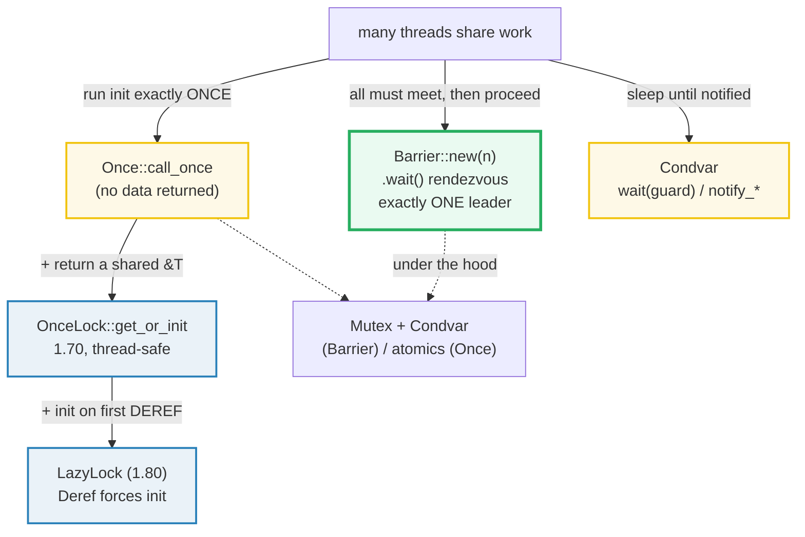

# BARRIER_ONCE — Barrier, Once, OnceLock, LazyLock, and Condvar

> **One-line goal:** the **higher-level** thread-synchronization primitives that
> sit above raw atomics — `Barrier` (rendezvous N threads), `Once` / `OnceLock<T>`
> / `LazyLock<T,F>` (one-shot and lazy one-time initialization), and `Condvar`
> (wait/notify on a `Mutex` predicate). Every count below is deterministic.
>
> **Run:** `just run barrier_once` (== `cargo run --bin barrier_once`)
> **Member:** `core` (stdlib-only — no `[dependencies]`).
> **Prerequisites:** [THREADS](./THREADS.md) (`Send`/`Sync`, `thread::scope`),
> [ATOMICS](./ATOMICS.md), [MUTEX_RWLOCK](./MUTEX_RWLOCK.md).
> **Ground truth:** [`barrier_once.rs`](./barrier_once.rs); captured stdout:
> [`barrier_once_output.txt`](./barrier_once_output.txt).

---

## Why this exists (lineage)

`Mutex`/`RwLock` (P4) and atomics (P4) are **fine-grained**: they serialize
*access to a value* or flip bits. But four extremely common needs are
**coarser**, and hand-rolling them from a `Mutex` every time is a bug farm:

| Need | "Do it by hand" (fragile) | The std primitive |
|---|---|---|
| "All N threads must reach this point before *any* proceeds." | A shared counter + a spin loop / a `Condvar` you fumble. | **`Barrier`** |
| "Run this setup exactly once, ever, no matter who calls it." | A `static mut FLAG` + `unsafe`. | **`Once`** |
| "Compute a shared value once, lazily, thread-safely." | `Once` + `unsafe` to read the `static mut`. | **`OnceLock<T>`** |
| "…and make it look like a plain `&T`." | A wrapper struct + `Deref`. | **`LazyLock<T,F>`** |
| "Sleep this thread until *that* thread says go." | A `Mutex<bool>` you poll in a loop (burns a core). | **`Condvar`** |

These five are the **rendezvous / one-shot-init / wait-notify** layer. They do
**not** transfer ownership between threads — that is what channels are for
(🔗 [MPSC_CHANNELS](./MPSC_CHANNELS.md)) — and they are all `Send + Sync`, built
on top of atomics and (for `Barrier`/`Condvar`) an OS futex/condvar.



> **Version note.** `Barrier`, `Once`, `Condvar` are ancient (1.0). `OnceLock<T>`
> landed in **1.70** and `LazyLock<T,F>` in **1.80**; before those, the ecosystem
> used the `once_cell` crate and the `lazy_static!` macro. `OnceLock`/`LazyLock`
> are the std replacements and should be preferred. The std `Once` docs now state
> it plainly: *"OnceLock<T> in particular supersedes Once in functionality and
> should be preferred for the common case where the Once is associated with
> data."* ([std Once][std-once]).

---

## Section A — `Barrier`: N threads rendezvous; all release together

```rust
use std::sync::{Barrier, Arc};
use std::thread;

let barrier = Barrier::new(3);          // a gate for exactly 3 waiters
thread::scope(|s| {
    for _ in 0..3 {
        s.spawn(|| {
            // ... work before the rendezvous ...
            let result = barrier.wait(); // blocks until all 3 have arrived
            result.is_leader();          // true for EXACTLY ONE (arbitrary) thread
        });
    }
});                                       // barrier is now RE-USABLE
```

> **From barrier_once.rs Section A:**
> ```
> ======================================================================
> SECTION A — Barrier: N threads rendezvous; all release together
> ======================================================================
>   Barrier::new(3); 3 threads each call .wait()
>   threads that crossed the barrier: 3
>   leader threads (is_leader() == true): 1
>   thread ids that crossed (sorted): [0, 1, 2]
> [check] all N threads crossed the Barrier together: OK
> [check] exactly ONE thread is the leader (is_leader): OK
> [check] the same N thread ids crossed (no thread lost/stuck): OK
> ```

**What.** `Barrier::new(n)` builds a gate. The first `n-1` callers of `.wait()`
**block**; when the `n`th caller arrives, **all `n` are released at once**. Each
caller gets back a [`BarrierWaitResult`][std-barrierresult] whose `.is_leader()`
is `true` for **exactly one** thread — and that thread is **arbitrary** (the std
docs say *"A single (arbitrary) thread will receive a BarrierWaitResult that
returns true from is_leader()"* ([std Barrier][std-barrier])). So the
deterministic fact to assert is the **count** of leaders (`1`), never *which*
thread it was. Per-thread output is collected, **sorted**, then printed — see the
DETERMINISM rule in [`HOW_TO_RESEARCH.md`](./../HOW_TO_RESEARCH.md) §4.2 rule 3.

**Why (internals).**
- **Under the hood it is a `Mutex` + `Condvar` + a generation counter.** Each
  `wait()` locks an inner state, increments the local count, and either parks on
  the `Condvar` (if it is not the `n`th) or `notify_all`s the rest and rolls the
  generation forward. That generation counter is what makes a `Barrier`
  **re-usable**: the std docs guarantee *"Barriers are re-usable after all
  threads have rendezvoused once, and can be used continuously."*
  ([std Barrier][std-barrier]). After the rendezvous the gate simply resets.
- **`is_leader` is the "you do the post-processing" role.** Exactly one thread
  gets the chance to run follow-up work without an extra lock — a common pattern
  for "every worker dumps its partial result; the leader merges."
- **The deadlock trap.** `Barrier::new(n)` expects **exactly `n`** waiters. If
  you spawn fewer (or one panics on the way), the rest block **forever** — a
  silent hang, not a panic. Always size the barrier to the real thread count.

🔗 [THREADS](./THREADS.md) — `thread::scope` (used here) lets the closures borrow
the locals by `&` without `Arc`, because the scope guarantees they finish.

---

## Section B — `Once::call_once`: the closure runs EXACTLY ONCE

```rust
use std::sync::Once;

static INIT: Once = Once::new();
INIT.call_once(|| {
    // this body runs once and only once across ALL threads, ever
});
```

> **From barrier_once.rs Section B:**
> ```
> ======================================================================
> SECTION B — Once::call_once: the closure runs EXACTLY ONCE
> ======================================================================
>   Once::new(); 4 threads call_once an init that bumps a counter
>   init closure executed: 1 time(s)
> [check] call_once ran the closure EXACTLY ONCE across N threads: OK
> [check] is_completed() is true after a successful call_once: OK
> ```

**What.** Four threads all call `INIT.call_once(init)`. The check confirms the
`init` body ran **exactly once** — the other three callers simply blocked until
the first finished, then returned without re-running it. `is_completed()` then
reports `true`.

**Why (internals).**
- **An atomic state machine: `Incomplete → Running → Complete`.** The first
  caller to observe `Incomplete` flips it to `Running` and executes the closure
  while every other caller **blocks**; once it finishes the state becomes
  `Complete` and all waiters proceed. `Once` is the load-bearing atomics
  primitive here — it is *"a low-level synchronization primitive for one-time
  global execution"* ([std Once][std-once]). 🔗 [ATOMICS](./ATOMICS.md).
- **Happens-before is guaranteed.** The docs are explicit: *"any memory writes
  performed by the executed closure can be reliably observed by other threads at
  this point (there is a happens-before relation between the closure and code
  executing after the return)."* This is why `Once` is the safe replacement for a
  racy `static mut FLAG` + `unsafe`.
- **Poisoning.** If the closure **panics**, the `Once` is *poisoned* — every
  future `call_once` panics too (*"causing all future invocations of call_once to
  also panic"* ([std Once][std-once])). This mirrors `Mutex` poisoning (🔗
  [MUTEX_RWLOCK](./MUTEX_RWLOCK.md) Section E). `call_once_force` ignores poison;
  `OnceLock` (next) sidesteps it entirely.
- **Reentrancy is undefined.** Calling `call_once` *from inside* its own closure
  is *"not specified: allowed outcomes are a panic or a deadlock"*
  ([std Once][std-once]). Don't do it.

---

## Section C — `OnceLock<T>`: a cell initialized ONCE, lazily, thread-safely

```rust
use std::sync::OnceLock;

static CONFIG: OnceLock<u32> = OnceLock::new();
let v: &u32 = CONFIG.get_or_init(|| 42);   // runs once; later callers get &42
CONFIG.set(99);                            // Err(99) — already initialized
```

> **From barrier_once.rs Section C:**
> ```
> ======================================================================
> SECTION C — OnceLock<T>: a cell initialized ONCE, lazily, thread-safely
> ======================================================================
>   OnceLock::new(); 4 threads call get_or_init(|| 42)
>   init closure executed: 1 time(s)
>   values returned to threads (sorted): [42, 42, 42, 42]
> [check] get_or_init ran the closure EXACTLY ONCE: OK
> [check] all N threads observed the initialized value (42): OK
> [check] get() returns Some(&42) after initialization: OK
> [check] set() after initialization returns Err (already set, value refused): OK
> ```

**What.** `OnceLock<T>` is *"a synchronization primitive which can nominally be
written to only once"* ([std OnceLock][std-oncelock]) — a thread-safe
[`OnceCell`](./INTERIOR_MUTABILITY.md), usable in `static`s. Four threads call
`get_or_init(|| 42)`; the closure runs **once**, and every caller gets `&42`. A
later `set(99)` is **refused** (`Err(99)`) — the cell is already full.

**Why (internals).**
- **`Once` carries the once-ness; `UnsafeCell<T>` carries the value.** Conceptually
  `OnceLock<T>` is `Once` + an uninitialized slot: `get_or_init(f)` runs `f`
  through a `call_once`-style state machine and hands back a `&T`. The std docs
  describe it as *"a safe abstraction over uninitialized data that becomes
  initialized once written"* ([std OnceLock][std-oncelock]). 🔗
  [INTERIOR_MUTABILITY](./INTERIOR_MUTABILITY.md) — this is thread-safe interior
  mutability (write once, then share `&T` forever).
- **Concurrent `get_or_init` is safe.** The docs guarantee *"Many threads may call
  get_or_init concurrently with different initializing functions, but it is
  guaranteed that only one function will be executed if the function doesn't
  panic"* ([std OnceLock][std-oncelock]).
- **`OnceLock` is NEVER poisoned.** Unlike `Mutex`/`Once`, a panicking init does
  not poison: *"the cell remains uninitialized"* ([std OnceLock][std-oncelock]),
  so the next caller can try again. This is the practical reason to prefer it over
  raw `Once`.
- **`get()` never blocks.** It returns `None` if uninitialized (or currently being
  initialized) — a non-blocking probe. (1.86 added a blocking `wait()`; this bundle
  sticks to the long-stable surface.)

---

## Section D — `LazyLock<T,F>`: initialized on first deref (std 1.80)

```rust
use std::sync::LazyLock;

// usable in a static; the thunk runs the FIRST time anyone derefs it
static DEEP: LazyLock<String> = LazyLock::new(|| compute_once());
let s: &String = &*DEEP;          // Deref forces init, then yields &String
```

> **From barrier_once.rs Section D:**
> ```
> ======================================================================
> SECTION D — LazyLock<T,F> (std 1.80): initialized on first deref
> ======================================================================
>   LazyLock::new(|| ...); before first access get().is_some() = false
> [check] LazyLock is NOT initialized until first deref: OK
>   4 threads deref it; init closure executed: 1 time(s)
>   snapshots (sorted): ["configured-on-first-deref", "configured-on-first-deref", "configured-on-first-deref", "configured-on-first-deref"]
> [check] LazyLock initialized EXACTLY ONCE across N threads: OK
> [check] all N threads saw the same lazy value: OK
> [check] the value derefs to 'configured-on-first-deref': OK
> ```

**What.** `LazyLock<T, F>` is *"A value which is initialized on the first
access"* ([std LazyLock][std-lazylock]) — a thread-safe `LazyCell` usable in
`static`s. You hand it a thunk `F: FnOnce() -> T`; the first check proves the
thunk has **not** run yet (`get()` is `None`). After four threads deref it, the
thunk ran **exactly once** and every thread saw the same value. Because
`LazyLock` **implements `Deref<Target = T>`**, `&*lazy` just looks like a `&T` —
no `get_or_init` ceremony. This is the std replacement for the `lazy_static!`
macro and `once_cell::sync::Lazy`.

**Why (internals).**
- **`LazyLock` ≈ `OnceLock<T>` + the stored init closure.** It holds the closure
  alongside the cell; its `Deref` impl calls `force()`, which runs the stored
  closure through the `OnceLock` once and returns `&T`. So *every* guarantee of
  `OnceLock` (runs once, thread-safe, usable in `static`s) applies, plus the
  ergonomics of transparent deref. *"Since initialization may be called from
  multiple threads, any dereferencing call will block the calling thread if
  another initialization routine is currently running."* ([std LazyLock][std-lazylock])
- **`OnceLock` vs `LazyLock` — pick by whether the init needs inputs.** The
  `OnceLock` docs spell out the trade-off: use `LazyLock` when the init is a fixed
  thunk; use `OnceLock` *"when LazyLock is too simple to support a given case, as
  LazyLock doesn't allow additional inputs to its function after you call
  LazyLock::new"* ([std OnceLock][std-oncelock]). `get_or_init(|| ...)`, where
  `...` can close over runtime arguments, is the `OnceLock` escape hatch.
- **Poisoning is unrecoverable here.** If the init closure panics, `LazyLock` is
  poisoned and *"all future accesses of the lock from other threads will panic"*
  — unlike `OnceLock`, there is no retry, because the thunk is gone
  ([std LazyLock][std-lazylock]). Keep lazy inits infallible.

---

## Section E — `Condvar`: `wait()` releases the Mutex; `notify_*` wakes it

```rust
use std::sync::{Arc, Mutex, Condvar};

let pair = Arc::new((Mutex::new(false), Condvar::new()));
// waiter:
let (lock, cvar) = &*pair;
let mut started = lock.lock().unwrap();
while !*started {                       // ALWAYS re-check the predicate
    started = cvar.wait(started).unwrap();   // atomically: unlock, park, re-lock
}
// notifier:
*lock.lock().unwrap() = true;
cvar.notify_one();
```

> **From barrier_once.rs Section E:**
> ```
> ======================================================================
> SECTION E — Condvar: wait() releases the Mutex; notify_* wakes it
> ======================================================================
>   Arc<(Mutex<bool>, Condvar)>; waiter parks until notified
>   waiter observed the predicate and set woken = true
> [check] the Condvar woke the waiting thread (predicate true after join): OK
> ```

**What.** A `Condvar` lets a thread **block consuming no CPU** until another
thread signals. The waiter locks the `Mutex`, checks the predicate in a `while`
loop, and calls `cvar.wait(guard)`. That call *"will atomically unlock the mutex
specified (represented by guard) and block the current thread"* and *"When this
function call returns, the lock specified will have been re-acquired"*
([std Condvar][std-condvar]). The notifier flips the predicate and calls
`notify_one`/`notify_all`. After `join`, the waiter provably woke (`woken ==
true`) — deterministic.

**Why (internals).**
- **`wait(guard)` takes the guard BY VALUE and returns a new one.** The
  `MutexGuard` moves into `wait`, which unlocks the OS mutex while the thread
  parks and re-locks it before returning — handing you a fresh guard. This is why
  the loop reassigns: `started = cvar.wait(started).unwrap();`.
- **Notifications are NOT buffered.** *"Calls to notify_one are not buffered in
  any way"* ([std Condvar][std-condvar]). A `notify_one` with **no current
  waiter is lost**. That is exactly why the predicate loop is mandatory: it makes
  the pattern correct whether the notify arrives before or after the `wait`.
- **Spurious wakeups are real.** *"this function is susceptible to spurious
  wakeups… the predicate must always be checked each time this function returns"*
  ([std Condvar][std-condvar]). A bare `wait()` without the `while !pred` loop is
  a latent bug; `wait_while` wraps the loop for you.
- **One condvar, one mutex.** *"any attempt to use multiple mutexes on the same
  condition variable may result in a runtime panic"* ([std Condvar][std-condvar]).
  The idiom is `Arc<(Mutex<T>, Condvar)>` (as here) so the pair always travels
  together.
- **Reach for a channel first.** `Condvar` is powerful but easy to misuse
  (lost wakeups, forgotten predicates, deadlock). The Book and most Rust
  guidance: prefer channels for "pass a value / signal done" and reserve
  `Condvar` for genuine shared-state wait/notify. 🔗 [MPSC_CHANNELS](./MPSC_CHANNELS.md).

---

## Section F — when to use what (decision table)

> **From barrier_once.rs Section F:**
> ```
> ======================================================================
> SECTION F — when to use what: rendezvous vs one-shot init vs wait/notify
> ======================================================================
>   PRIMITIVE     ROLE                                                    TYPICAL USE
>   Barrier       rendezvous: N threads meet, then all proceed together   compute phases / fan-out then sync
>   Once          one-shot SIDE-EFFECTING init, returns no data           global setup over static mut
>   OnceLock<T>   one-shot init that RETURNS a shared &T                  lazy global config / cache
>   LazyLock<T,F> OnceLock that inits on first DEREF (ergonomic &T)       static computed-once value
>   Condvar       wait/notify on a Mutex predicate                        rare; channels usually fit better
> [check] the five primitives map to five distinct roles: OK
> [check] none of these transfer ownership across threads (channels do): OK
> ```

The throughline: **none of these transfer ownership across threads.** They
synchronize *access*; if you want to *move* a value from one thread to another,
use a channel. If you want to *serialize access* to a value many threads mutate,
use a `Mutex` (🔗 [MUTEX_RWLOCK](./MUTEX_RWLOCK.md)). If you want lock-free
counter/flag bits, use atomics (🔗 [ATOMICS](./ATOMICS.md)). The five here cover
the gaps: **rendezvous** (`Barrier`), **one-shot/lazy init**
(`Once`/`OnceLock`/`LazyLock`), and **wait/notify** (`Condvar`). 🔗
[ASYNC_BASICS](./ASYNC_BASICS.md) — the async equivalents (`tokio::sync::*`)
trade threads for tasks but solve the same problems.

---

## Pitfalls (the expert payoff)

| Trap | Symptom | Fix / why |
|---|---|---|
| **`Barrier::new(n)` with fewer than `n` waiters** | the program **hangs forever** (silent, no panic) | Size the barrier to the exact thread count; a panicked worker leaves the rest stuck. There is no timeout by default. |
| **Asserting *which* thread is the `Barrier` leader** | flaky test — the leader is **arbitrary** | Assert the **count** of leaders (`== 1`), never the identity. Same for any per-thread order: collect + sort. |
| **`Condvar` without a `while !pred` loop** | missed wakeups / spurious-wakeup bug | `wait` can return spuriously and notifications aren't buffered. Always re-check the predicate (or use `wait_while`). |
| **`notify_one` before anyone `wait`s** | the wakeup is **lost** (not buffered) | The predicate-loop pattern is self-correcting; a bare "notify then assume someone is waiting" is not. |
| **Using one `Condvar` with two different `Mutex`es** | `panic!` at runtime | One condvar pairs with exactly one mutex — keep them in `Arc<(Mutex<T>, Condvar)>>`. |
| **Reentrant `call_once` / `get_or_init`** | unspecified (deadlock or panic) | Don't call a `Once`/`OnceLock` on itself from inside its own init closure. |
| **`Once` poisoning after an init panic** | every later `call_once` panics | Use `call_once_force` to ignore poison, or — better — switch to `OnceLock` (never poisoned; init is retryable). |
| **`LazyLock` init panics → poisoned forever** | all future derefs panic, unrecoverably | Keep the lazy thunk infallible. If init can fail, use `OnceLock` + a `Result`, not `LazyLock`. |
| **`Once` vs `OnceLock` confusion** | writing `unsafe` to read a `static mut` the `Once` initialized | `Once` returns **no data**. If you want the value back, use `OnceLock<T>` (or `LazyLock`) — that's its whole point. |
| **Printing per-thread scheduling** | `_output.txt` not reproducible | Thread interleaving is nondeterministic. Collect into a `Vec` (Mutex/channel), **sort**, print from `main` after `join`. |
| **Treating `LazyLock` as already-initialized** | surprise work on the hot path | The first deref pays the init cost (and blocks racing threads). For a `static`, that's once per process — fine; for a per-request value, don't hide compute behind `Deref`. |
| **Expecting `get()` to block** | it returns `None` while init is in flight | `OnceLock::get` **never blocks** (it's a probe). Use 1.86's `wait()` if you must block for another thread's init. |

---

## Cheat sheet

```rust
use std::sync::{Barrier, Once, OnceLock, LazyLock, Condvar, Mutex, Arc};

// Barrier — N threads meet, then ALL proceed; reusable; one arbitrary leader.
let b = Barrier::new(3);
let r: BarrierWaitResult = b.wait();   // blocks until 3 callers arrive
r.is_leader();                         // true for EXACTLY ONE thread (arbitrary)

// Once — one-shot SIDE-EFFECTING init; returns no data; poisons on panic.
static INIT: Once = Once::new();
INIT.call_once(|| { /* runs once, ever */ });
INIT.is_completed();                   // true after a successful call_once

// OnceLock<T> (1.70) — one-shot init that RETURNS a shared &T; never poisoned.
static CFG: OnceLock<u32> = OnceLock::new();
let v: &u32 = CFG.get_or_init(|| 42);  // closure runs once; later callers get &42
CFG.set(99);                           // Err(99) — already set
CFG.get();                             // Option<&T>, NEVER blocks

// LazyLock<T,F> (1.80) — OnceLock that inits on first DEREF; impl Deref<Target=T>.
static NAME: LazyLock<String> = LazyLock::new(|| "rust".into());
let s: &String = &*NAME;               // first deref runs the thunk once
LazyLock::get(&NAME);                  // None before first deref, Some after

// Condvar — wait/notify on a Mutex predicate; notify NOT buffered; spurious wakes.
let pair = Arc::new((Mutex::new(false), Condvar::new()));
// waiter:
let (lock, cvar) = &*pair;
let mut g = lock.lock().unwrap();
while !*g { g = cvar.wait(g).unwrap(); }   // unlock -> park -> re-lock (loop!)
// notifier:
*lock.lock().unwrap() = true;
cvar.notify_one();                     // lost if no one is waiting

// PICK: Barrier=rendezvous · Once/OnceLock/LazyLock=one-shot init ·
//       Condvar=wait/notify · channels=ownership transfer · Mutex=serialized access.
```

---

## Sources

Every claim above was web-verified against the official Rust documentation (each
API page corroborates the behavior, and the Book ch16 frames the concurrency
model). All URLs were fetched during this build.

- **The Rust Programming Language, ch16 "Fearless Concurrency"** — threads,
  `thread::scope`, message-passing vs shared-state, `Mutex`/`Arc` (the bedrock
  these primitives sit on):
  https://doc.rust-lang.org/book/ch16-00-concurrency.html
- **`std::sync::Barrier`** — `new(n)`, `wait()` blocks until the `n`th caller
  then wakes all, re-usability, `is_leader` is *"a single (arbitrary) thread"*:
  https://doc.rust-lang.org/std/sync/struct.Barrier.html
- **`std::sync::BarrierWaitResult`** — `is_leader()` returns `true` for exactly
  one thread:
  https://doc.rust-lang.org/std/sync/struct.BarrierWaitResult.html
- **`std::sync::Once`** — *"low-level synchronization primitive for one-time
  global execution"*; `call_once` runs the closure once with a happens-before
  guarantee; panics **poison**; `OnceLock<T>` supersedes it; reentrancy is
  unspecified:
  https://doc.rust-lang.org/std/sync/struct.Once.html
- **`std::sync::OnceLock<T>`** (1.70) — *"nominally written to only once"*;
  thread-safe `OnceCell`, usable in `static`s; `get_or_init` runs one function
  even under concurrent callers; **never poisoned**; `get()` never blocks;
  when to prefer it over `LazyLock`:
  https://doc.rust-lang.org/std/sync/struct.OnceLock.html
- **`std::sync::LazyLock<T, F>`** (1.80) — *"A value which is initialized on the
  first access"*; thread-safe `LazyCell`, usable in `static`s; `Deref` blocks
  racing threads during init; poisoning is unrecoverable; the std replacement for
  `lazy_static!`:
  https://doc.rust-lang.org/std/sync/struct.LazyLock.html
- **`std::sync::Condvar`** — `wait(guard)` *"atomically unlock the mutex … and
  block"* then re-acquire on return; *"susceptible to spurious wakeups"* → always
  re-check the predicate; `notify_one`/`notify_all` *"not buffered in any way"*;
  panics if used with more than one mutex:
  https://doc.rust-lang.org/std/sync/struct.Condvar.html
