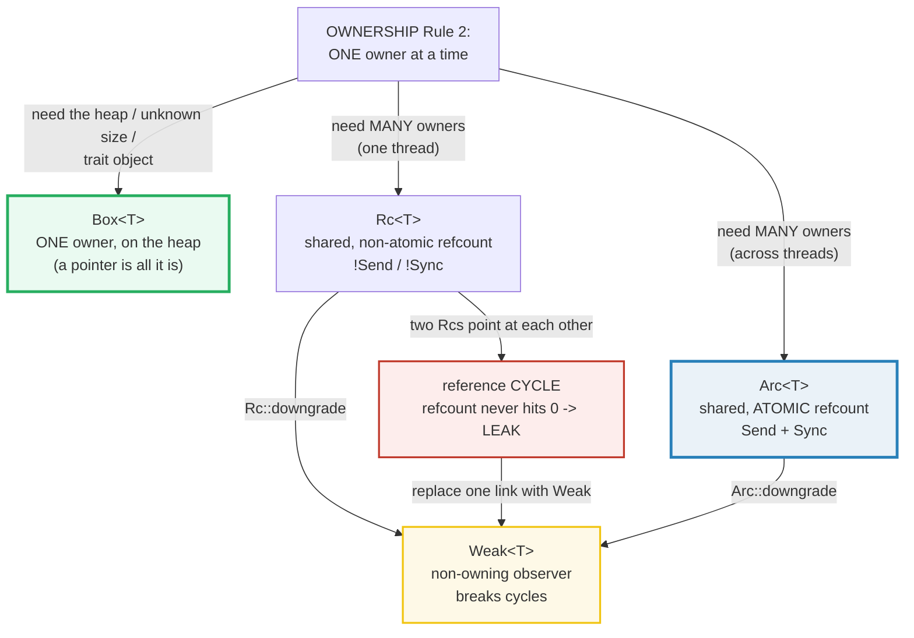
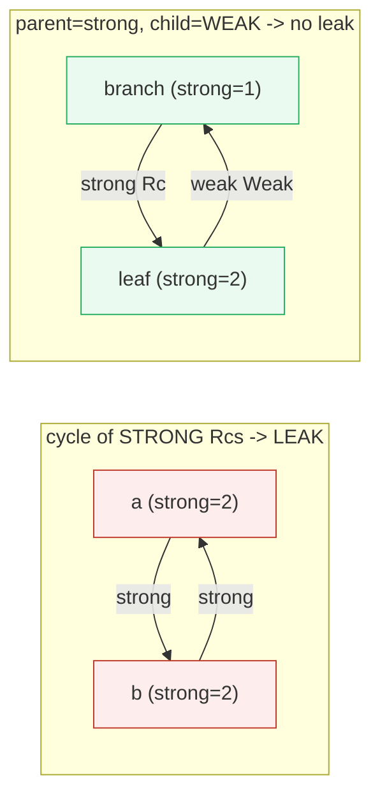

# BOX_RC_ARC — Heap Allocation and Shared Ownership (Box, Rc, Arc, Weak)

> **One-line goal:** ownership has three shapes beyond a single stack binding —
> `Box<T>` puts ONE owner on the **heap**, `Rc<T>` gives a value **many owners
> on one thread** (a non-atomic refcount), and `Arc<T>` gives a value **many
> owners on any thread** (an atomic refcount); `Weak<T>` is a non-owning
> reference that breaks the cycles `Rc`/`Arc` would otherwise leak.
>
> **Run:** `just run box_rc_arc` (== `cargo run --bin box_rc_arc`)
> **Member:** `core` (stdlib-only — no `[dependencies]`).
> **Prerequisites:** [OWNERSHIP](./OWNERSHIP.md) (one owner, moves, drop) and
> [BORROWING](./BORROWING.md) (`&`/`&mut` as permissions). This is **Phase 3 /
> bundle #1** — it is the *shared-ownership* extension of the single-owner model.
> **Ground truth:** [`box_rc_arc.rs`](./box_rc_arc.rs); captured stdout:
> [`box_rc_arc_output.txt`](./box_rc_arc_output.txt).

---

## Why this exists (lineage)

[OWNERSHIP](./OWNERSHIP.md) established Rule 2: *there can only be one owner at
a time*. That is true for every stack binding — but it is too strict for two
real-world situations:

1. **A value must live on the heap** (its size is unknown at compile time, it is
   huge and you don't want to copy it on a move, or you want to erase its
   concrete type behind a trait).
2. **A value genuinely has many owners** — two lists share the same tail, every
   edge of a graph owns the node it points at, a cache and a worker both hold a
   config. There is no *single* last user you can name at compile time.

Rust's answer is a family of **smart pointers** — types that *own* a value (so
they are not plain `&` borrows) and add one extra capability on top:

| Pointer | Owners | Threads | Refcount | Size | The one thing it adds |
|---|---|---|---|---|---|
| **`Box<T>`** | **one** | any | none (drops at the owner's `}`) | 1 pointer (8 B) | **heap** allocation + indirection |
| **`Rc<T>`** | **many** | **single** | non-atomic | 1 pointer (8 B) | **shared** ownership, cheap |
| **`Arc<T>`** | **many** | **any** | **atomic** | 1 pointer (8 B) | shared ownership, **thread-safe** |
| **`Weak<T>`** | none (observer) | matches its `Rc`/`Arc` | bumps `weak_count` | 1 pointer (8 B) | breaks **cycles** |



All four are **heap** pointers, all four are exactly one machine word wide, and
all four implement `Deref` (so they behave like the value) and `Drop` (so they
manage cleanup). What differs is *who owns, and how many*.

---

## Section A — `Box<T>`: one owner of heap data

```rust
let b = Box::new(42_u64);   // 42 now lives on the HEAP; the stack holds a pointer
enum List { Cons(i32, Box<List>), Nil }   // Box gives a recursive type a finite size
let g: Box<dyn Greet> = Box::new(English); // Box sizes a DST (a trait object)
```

> **From box_rc_arc.rs Section A:**
> ```
> ======================================================================
> SECTION A — Box<T>: ONE owner of heap data; a pointer is all it is
> ======================================================================
>   let b = Box::new(42_u64);
>     *b = 42  (Deref: a Box<T> behaves like the value it owns)
>     size_of::<Box<u64>>() = 8 == size_of::<usize>() = 8
> [check] Box<T> is one pointer: size_of::<Box<u64>>() == size_of::<usize>() == 8: OK
> [check] Box<T> owns the value: *b == 42 (Deref works like &T): OK
>   Cons(1, Box(Cons(2, Box(Cons(3, Box(Nil)))))) ; list_sum = 6
> [check] Box enables a recursive type (the cons list sums to 6): OK
>   let g: Box<dyn Greet> = Box::new(English); g.greet() = "hello"
>     size_of::<Box<dyn Greet>>() = 16 (data-ptr + vtable-ptr = 2 usizes)
> [check] Box<dyn Trait> is a fat pointer: 2 * usize == 16: OK
> ```

**What.** `Box::new(v)` moves `v` onto the heap and hands back a single owning
pointer. `*b` reads the value (via `Deref`); when `b` reaches its `}`, the heap
allocation is freed (via `Drop`). Three jobs, one type:

1. **Heap allocation.** `size_of::<Box<u64>>() == 8 == size_of::<usize>()` — a
   `Box` is *literally one pointer*, no matter how big `T` is.
2. **Recursive-type enabler.** `enum List { Cons(i32, List), Nil }` has
   *infinite* size (the compiler error is `E0072: recursive type has infinite
   size`). Wrapping the recursive field in `Box<List>` inserts indirection: the
   `Cons` variant becomes `i32 + pointer` = finite, so the cons list
   `1 → 2 → 3 → Nil` builds and sums to `6`.
3. **Trait-object sizer.** `dyn Greet` is a **DST** (dynamically-sized type) —
   it has no static size. `Box<dyn Greet>` *is* that DST sized: it is a **fat
   pointer** = `data-ptr (8) + vtable-ptr (8) = 16` bytes.

**Why (internals).**
- **One owner, exactly as in [OWNERSHIP](./OWNERSHIP.md).** A `Box<T>` does not
  change the ownership *rules* — it changes *where* the value lives. `let b2 = b;`
  still **moves** the box (the pointer is copied bitwise, `b` is poisoned); the
  heap bytes are touched only once, at the single owner's `}`. The Book: "Just
  like any owned value, when a box goes out of scope ... it will be deallocated.
  The deallocation happens both for the box ... and the data it points to"
  ([Book ch15.1][book-box]).
- **A `Box` is a pointer, so it has a known size.** That is the *whole* trick
  for recursive types and DSTs: "Because a `Box<T>` is a pointer, Rust always
  knows how much space a `Box<T>` needs: A pointer's size doesn't change based on
  the amount of data it's pointing to" ([Book ch15.1][book-box]). The compiler's
  own suggested fix for `E0072` is literally `Cons(i32, Box<List>)`.
- **Zero-cost.** "Boxes don't have performance overhead, other than storing
  their data on the heap" ([Book ch15.1][book-box]). There is no refcount, no
  lock, no atomic — just one allocation and one free. If you need *more* than
  heap indirection (shared ownership, interior mutability), reach for `Rc`/`Arc`/
  `RefCell` instead.

> **The trait-object fat pointer.** `Box<dyn Trait>` is *two* words, not one:
> the data pointer **plus** a pointer to the trait's **vtable** (the function
> pointers for the trait's methods). That is what makes dynamic dispatch work.
> 🔗 [TRAIT_OBJECTS](./TRAIT_OBJECTS.md) covers `dyn` and the vtable in depth.

🔗 [MOVE_SEMANTICS](./MOVE_SEMANTICS.md) — moving a `Box` is the O(1) shallow
move of [OWNERSHIP](./OWNERSHIP.md) Section E, applied to a heap pointer.

---

## Section B — `Rc<T>`: shared ownership, single thread

```rust
use std::rc::Rc;
let a = Rc::new(String::from("shared"));   // strong_count = 1
let b = Rc::clone(&a);                      // strong_count = 2 (NOT a deep copy)
```

> **From box_rc_arc.rs Section B:**
> ```
> ======================================================================
> SECTION B — Rc<T>: SHARED ownership, SINGLE thread (non-atomic refcount)
> ======================================================================
>   let a = Rc::new("shared");  Rc::strong_count(&a) = 1
> [check] Rc::new -> strong_count == 1: OK
>   let b = Rc::clone(&a);      Rc::strong_count(&a) = 2
> [check] one Rc::clone -> strong_count == 2: OK
>   let _c = Rc::clone(&a);     Rc::strong_count(&a) = 3
> [check] two Rc::clone -> strong_count == 3: OK
>   (inner `c` dropped at `}`)  Rc::strong_count(&a) = 2
> [check] dropping one clone decrements strong_count back to 2: OK
>   a = "shared", b = "shared"  (both owners, one allocation)
> [check] Rc shares data: both owners read the same value: OK
> ```

**What.** The refcount walks `1 → 2 → 3 → 2` exactly as the clones appear and
drop. `Rc::clone(&a)` does **not** copy the `String` — it bumps a counter and
returns a second owner pointing at the *same* heap allocation. When the inner
`_c` reaches its `}`, `Drop` decrements the counter automatically (no manual
"decrease" call). The value is freed only when `strong_count` hits `0`.

**Why (internals).**
- **`Rc::clone` is a refcount bump, not a deep copy.** The Book is explicit:
  "The implementation of `Rc::clone` doesn't make a deep copy of all the
  data ... The call to `Rc::clone` only increments the reference count, which
  doesn't take much time" ([Book ch15.4][book-rc]). This is why the convention
  is `Rc::clone(&a)` rather than `a.clone()` — it is a *visual signal* that no
  expensive copy happens.
- **`Drop` decrements.** "We don't have to call a function to decrease the
  reference count ... The implementation of the `Drop` trait decreases the
  reference count automatically when an `Rc<T>` value goes out of scope"
  ([Book ch15.4][book-rc]).
- **Single-threaded only.** "`Rc<T>` is only for use in single-threaded
  scenarios" ([Book ch15.4][book-rc]). The refcount is a *plain integer*; that
  is what makes it cheap, and also what makes it unsafe across threads — see
  Section E.
- **Shared read, no shared mutation.** `Rc<T>` hands out *shared* (`&T`) access.
  To mutate through shared ownership you need interior mutability — typically
  `Rc<RefCell<T>>`. 🔗 [INTERIOR_MUTABILITY](./INTERIOR_MUTABILITY.md).

> **`_c` vs `_`.** The binding is named `_c` (underscore-prefixed), **not** bare
> `_`. A bare `let _ = expr;` drops *immediately*; a named binding like `let _c`
> (even with the underscore) lives to the end of its scope. This is the exact
> pitfall from [OWNERSHIP](./OWNERSHIP.md)'s table — using `_` here would have
> freed the clone at once and the count would never have reached 3.

---

## Section C — `Weak<T>`: a non-owning reference

```rust
let strong = Rc::new(99);
let weak: Weak<i32> = Rc::downgrade(&strong);   // bumps weak_count, NOT strong_count
weak.upgrade()   // -> Some(Rc) while strong refs live; -> None once they're all gone
```

> **From box_rc_arc.rs Section C:**
> ```
> ======================================================================
> SECTION C — Weak<T>: a non-owning reference (does not keep the value alive)
> ======================================================================
>   let strong = Rc::new(99);  strong_count = 1, weak_count = 0
>   let weak = Rc::downgrade(&strong);  strong_count = 1, weak_count = 1
> [check] Rc::downgrade bumps weak_count, not strong_count: OK
>   weak.upgrade() while alive -> Some(99)
> [check] Weak::upgrade on a LIVE value -> Some(99): OK
>   after `drop(strong)`: weak.upgrade() -> None
> [check] Weak::upgrade after all strong refs drop -> None (value freed): OK
> ```

**What.** `Rc::downgrade` makes a `Weak<T>` that bumps `weak_count` (now `1`)
**without** touching `strong_count` (still `1`). While a strong `Rc` is alive,
`weak.upgrade()` returns `Some(99)`. After `drop(strong)` removes the *last*
strong ref, the value is freed — and `weak.upgrade()` then returns `None`, even
though `weak` itself still exists.

**Why (internals).**
- **Two counts, one threshold.** An `Rc` allocation tracks `strong_count` *and*
  `weak_count`. Only `strong_count == 0` frees the **value**; `weak_count` is
  irrelevant to the value's lifetime. The Book: "the `weak_count` doesn't need
  to be 0 for the `Rc<T>` instance to be cleaned up"
  ([Book ch15.6][book-cycles]).
- **`upgrade` is a runtime liveness check.** Because the value may already be
  gone, `Weak::upgrade` returns `Option<Rc<T>>` — `Some` if it survives, `None`
  if not. "you'll get a result of `Some` if the `Rc<T>` value has not been
  dropped yet and a result of `None` if ... dropped" ([Book ch15.6][book-cycles]).
  The `Option` *is* the safety: there is no dangling pointer, only a checked
  `None`.
- **This is the cycle-breaker.** A `Weak` expresses "I know about it but I don't
  own it." Section F shows exactly how that distinction turns a leak into a clean
  drop.

---

## Section D — `Arc<T>`: atomic refcount, thread-safe

```rust
use std::sync::Arc;
let a = Arc::new(vec![10, 20, 30]);      // strong_count = 1
let c = Arc::clone(&a);                   // strong_count = 2 (atomic increment)
std::thread::spawn(move || { /* c is Send -> crosses the thread boundary */ });
```

> **From box_rc_arc.rs Section D:**
> ```
> ======================================================================
> SECTION D — Arc<T>: ATOMIC refcount — shared ownership across THREADS
> ======================================================================
>   let a = Arc::new(vec![10,20,30]);  strong_count = 1
> [check] Arc::new -> strong_count == 1: OK
>   let a_clone = Arc::clone(&a);     strong_count = 2
> [check] Arc::clone -> strong_count == 2: OK
>   spawned thread: strong_count seen inside = 2, sum = 60
> [check] Arc crossed into a thread; worker saw strong_count == 2 (a + its clone): OK
>   after thread joined (its clone dropped): strong_count = 1
> [check] Arc count returns to 1 after the thread's clone drops: OK
> ```

**What.** `Arc` ("**A**tomic reference **C**ounted") behaves like `Rc` — clone
bumps the count, drop decrements it — but the counter is updated with **atomic**
operations, so a clone of `a` can be **moved into another thread** and the count
stays correct. The worker observes `strong_count == 2` (the main `a` plus its
own moved clone); when the thread ends and drops its clone, the count returns to
`1`.

**Why (internals).**
- **Atomic, therefore thread-safe.** "Unlike `Rc<T>`, `Arc<T>` uses atomic
  operations for its reference counting. This means that it is thread-safe. The
  disadvantage is that atomic operations are more expensive than ordinary memory
  accesses" ([`std::sync::Arc` docs][std-arc]).
- **`Arc<T>: Send + Sync` when `T: Send + Sync`.** "Arc<T> will implement Send
  and Sync as long as the T implements Send and Sync" ([`std::sync::Arc`][std-arc]).
  That is why the `move` closure compiles: `Arc<Vec<i32>>` is `Send`, so it can
  cross the `std::thread::spawn` boundary (which requires `F: Send + 'static`).
  The runnable proof in Section E is a compile-time witness of exactly this.
- **Arc makes *ownership* thread-safe, not the data.** "Arc<T> makes it thread
  safe to have multiple ownership of the same data, but it doesn't add thread
  safety to its data" ([`std::sync::Arc`][std-arc]). `Arc<RefCell<T>>` would
  *not* be `Sync` — to mutate shared data across threads you pair `Arc` with a
  **`Mutex`** or **`RwLock`** (or an `Atomic*`). 🔗 [THREADS](./THREADS.md)
  (Phase 4) develops `Send`/`Sync` and locking.

> **Determinism note.** The thread does *not* print directly — it returns
> `(strong_count, sum)` to `main`, which prints after `join`. With a single
> worker there is no interleaving anyway, but the collect-then-print discipline
> keeps the bundle byte-reproducible (see `HOW_TO_RESEARCH.md` §4.2 rule 3).

---

## Section E — why `Rc<T>` is `!Send` / `!Sync` (and `Arc` is)

This is a **compile-time** property, so the failing version cannot live in a
runnable file. Section E of the `.rs` proves the *positive* half at compile time
— `is_send_sync::<Arc<i32>>()` compiles only because `Arc<i32>: Send + Sync` —
and documents the negative half verbatim:

```rust
fn is_send_sync<T: Send + Sync>() {}        // the witness (compiles iff T: Send+Sync)
is_send_sync::<Arc<i32>>();                 // OK  -> Arc<i32>: Send + Sync
// is_send_sync::<Rc<i32>>();              // E0277 -> Rc is !Send/!Sync
```

```rust
// This does NOT compile (so it is not in the runnable .rs):
let r = std::rc::Rc::new(1);
std::thread::spawn(move || { let _ = r; });
```

```console
error[E0277]: `Rc<{integer}>` cannot be sent between threads safely
 --> src/main.rs:2:5
  |
2 |     std::thread::spawn(move || { let _ = r; });
  |     ^^^^^^^^^^^^^^^^^^ `Rc<{integer}>` cannot be sent between threads safely
  |
  = help: the trait `Send` is not implemented for `Rc<{integer}>`
note: required because it's used within this closure
```

> **From box_rc_arc.rs Section E:**
> ```
> ======================================================================
> SECTION E — why Rc<T> is !Send / !Sync (documented; Arc proven Send+Sync)
> ======================================================================
>   is_send_sync::<Arc<i32>>() compiled -> Arc<i32>: Send + Sync.
>   (is_send_sync::<Rc<i32>>() would be E0277 -> Rc is !Send/!Sync.)
> [check] Arc<i32> is Send + Sync (compile-time proved); Rc<i32> is not: OK
> ```

**Why (internals).** `Rc`'s refcount is a **plain integer**. If two threads did
`Rc::clone` / `drop` concurrently, the non-atomic `+= 1` / `-= 1` would **race**:
a lost increment would make the count too small (early free → use-after-free) and
a lost decrement would make it too large (never freed → leak). Rather than pay
for atomics when most data is single-threaded, Rust makes `Rc` cheap **and**
forbids it from crossing threads by *not* implementing `Send`/`Sync`:

> "`Rc` uses non-atomic reference counting. This means that overhead is very low,
> but an `Rc` cannot be sent between threads, and consequently `Rc` does not
> implement [`Send`/`Sync`]." — [`std::rc` docs][std-rc]

The compiler turns the mistake into `E0277` at build time — no runtime data race
is ever possible. `Arc` is the *same data structure* with atomic counter
operations, which is why it *is* `Send + Sync` and costs slightly more per
clone. **Rule of thumb:** single-threaded data → `Rc`; anything a thread touches
→ `Arc`. 🔗 [THREADS](./THREADS.md) (Phase 4) is the full `Send`/`Sync` story.

---

## Section F — reference cycles leak; `Weak<T>` breaks them

Rust guarantees memory *safety*, not freedom from *leaks*. With interior
mutability (`RefCell`), two `Rc`s can be pointed at each other — and because each
keeps the other's `strong_count` above 0, **neither ever frees**. `Weak` is the
escape hatch.

> **From box_rc_arc.rs Section F:**
> ```
> ======================================================================
> SECTION F — reference cycles LEAK; Weak<T> breaks them
> ======================================================================
> 
>   -- a cycle of two Rcs: LEAKS (refcount never hits 0) --
>   after cycle: a strong_count = 2, b strong_count = 2
> [check] cycle: a and b each have strong_count == 2 (each pointed at by the other): OK
>   after dropping both handles: weak_a.upgrade() -> Some(1)
> [check] Rc cycle LEAKS: node `a` survives with no named owner (weak_a still upgrades): OK
> 
>   -- same shape, but child->parent is Weak: NO leak --
>   leaf.parent.upgrade() before branch exists -> false
>   inside scope: leaf strong=2, branch strong=1, branch weak=1, branch children=1
> [check] branch owns leaf (leaf strong=2, branch owns 1 child); leaf->branch is weak (branch weak=1): OK
>   leaf.parent.upgrade() while branch alive -> true
> [check] while branch is alive, leaf.parent.upgrade() -> Some: OK
>   after branch dropped: leaf.parent.upgrade() -> None? true (branch FREED)
> [check] Weak broke the cycle: branch was freed (leaf.parent.upgrade() -> None): OK
> [check] leaf still owned by its own handle (strong_count == 1), value still readable: OK
> ```

**The leak (first half).** `a.next -> b` and `b.next -> a`. After the cycle,
both have `strong_count == 2` (the named handle plus the other node's link).
When both *handles* drop, each count falls `2 -> 1` — never `0` — so **both
allocations survive with no named owner**. The leak is *observable*: a `Weak`
held onto `a` still `upgrade()`s to `Some(1)` after the handles are gone. The
Book: "The reference count of each item in the cycle will never reach 0, and the
values will never be dropped" ([Book ch15.6][book-cycles]).

> **Never print a cyclic graph's `Debug`.** `{:?}` on `a -> b -> a -> ...`
> recurses forever and overflows the stack — the Book warns about exactly this.
> Section F prints only the counts (deterministic for a fixed graph), never the
> cyclic structure.

**The fix (second half).** Redesign the relationship so *ownership* goes one way
and *knowledge* goes the other: a parent **owns** its children (strong `Rc`), a
child only **knows** its parent (weak `Weak`). Now `branch` has `strong_count ==
1` (its handle alone) and `weak_count == 1` (the child's back-reference). When
`branch` drops, `1 -> 0` and it **frees**; the child's `Weak` then `upgrade()`s
to `None`. No cycle, no leak — and `leaf` itself is still readable through its
own handle. The Book: "you're able to have parent nodes point to child nodes and
vice versa without creating a reference cycle and memory leaks"
([Book ch15.6][book-cycles]).



🔗 [INTERIOR_MUTABILITY](./INTERIOR_MUTABILITY.md) — `RefCell` is what lets a
link be re-pointed *after* construction (the cycle needs it). 🔗
[DROP_UNSAFE](./DROP_UNSAFE.md) — the `Drop` impls of `Rc`/`Arc`/`Weak` are what
decrement the counts.

---

## Pitfalls (the expert payoff)

| Trap | Symptom | Fix / why |
|---|---|---|
| **`Rc` across a thread** | `error[E0277]: \`Rc<T>\` cannot be sent between threads safely` | `Rc`'s refcount is non-atomic. Use `Arc<T>` for anything a thread touches. |
| **`Arc<RefCell<T>>` is not `Sync`** | `E0277` on a `spawn(move || ...)` capturing it | `Arc` only shares *ownership* thread-safely, not *mutation*. Pair with `Mutex`/`RwLock`/`Atomic*` for cross-thread mutation. |
| **A reference cycle leaks** | memory grows; counts never reach 0 | Make one direction of the cycle a `Weak<T>` (e.g. child→parent). `Rc`/`Arc` cannot detect cycles for you. |
| **`a.clone()` vs `Rc::clone(&a)`** | readers can't tell a cheap refcount bump from a deep copy | Convention: `Rc::clone`/`Arc::clone` for refcount-bumps; reserve `.clone()` for actual (possibly deep) copies. |
| **`Weak::upgrade()` ignored** | panic on `.unwrap()` after the value was freed | `upgrade` returns `Option` *because* the value may be gone. Always match the `None` case. |
| **Printing a cyclic `Rc` graph** | stack overflow from infinite `Debug` recursion | Don't `{:?}` a structure that may contain a cycle; print counts/ids instead. |
| **`Box` where `Rc`/`Arc` is needed** | `E0382: use of moved value` when two owners are wanted | `Box` is *one* owner. For multiple owners pick `Rc` (1 thread) or `Arc` (many). |
| **`Rc`/`Arc` of a huge value, mutated rarely** | needless heap traffic on clone | clone is O(1) (refcount bump) — but `Arc::make_mut`/`get_mut` avoid even that when you need mutation. |
| **Expecting `Arc` to make data thread-safe** | data race / `!Sync` error | `Arc` shares ownership atomically; it does **not** lock the data. `Arc<Mutex<T>>` is the usual combo. |
| **`let _ = Rc::clone(&a);`** | count drops *immediately* to 1, not at `}` | bare `_` drops at once; name the binding (`_c`) to keep it alive to scope end. |
| **Forgetting `Box` makes a recursive type compile** | `E0072: recursive type has infinite size` | add indirection: `Box<T>`, `Rc<T>`, or `&T` in the recursive field. |

---

## Cheat sheet

```rust
use std::boxed::Box;            // 1 owner, heap. size_of::<Box<T>>() == usize (8)
use std::rc::{Rc, Weak};        // many owners, 1 THREAD. !Send/!Sync. non-atomic.
use std::sync::{Arc, Weak};     // many owners, ANY thread. Send+Sync. ATOMIC.

// ── Box<T>: one owner on the heap ──────────────────────────────────────────
let b: Box<u64> = Box::new(42);     // 42 now on the heap; *b == 42 via Deref
enum List { Cons(i32, Box<List>), Nil } // Box breaks the infinite-size recursion
let g: Box<dyn Trait> = Box::new(Impl); // fat ptr: data(8) + vtable(8) == 16

// ── Rc<T>: shared ownership, single thread ─────────────────────────────────
let a = Rc::new("x".to_string());   // Rc::strong_count(&a) == 1
let b = Rc::clone(&a);              // strong_count == 2  (NOT a deep copy)
// drop(b) at `}` -> strong_count back to 1; freed at 0.

// ── Weak<T>: non-owning observer ───────────────────────────────────────────
let w: Weak<T> = Rc::downgrade(&a); // bumps weak_count, NOT strong_count
match w.upgrade() { Some(rc) => {…}, None => {…} }  // None once strong refs gone

// ── Arc<T>: shared ownership across threads ────────────────────────────────
let a = Arc::new(vec![1,2,3]);      // strong_count == 1
let c = Arc::clone(&a);             // strong_count == 2  (ATOMIC increment)
std::thread::spawn(move || { /* c: Send -> crosses the boundary */ });
// Arc<Mutex<T>> for shared MUTATION; Arc alone only shares ownership.

// RULE: one owner -> Box. many owners, 1 thread -> Rc. many owners, threads
//       -> Arc. cycle risk -> break one link with Weak. Rc is !Send/!Sync
//       because its refcount is a plain integer (E0277 if you try).
```

---

## Sources

Every claim above was web-verified in at least two authoritative places.

- **The Rust Programming Language, ch15.1 "Using `Box<T>` to Point to Data on the
  Heap"** — heap allocation, the three Box use cases, `E0072` recursive-type
  error, "a pointer's size doesn't change", "boxes don't have performance
  overhead", drop of box + data:
  https://doc.rust-lang.org/book/ch15-01-box.html
- **The Rust Programming Language, ch15.4 "`Rc<T>`, the Reference-Counted Smart
  Pointer"** — shared ownership, "`Rc::clone` ... only increments the reference
  count", `strong_count` walks 1→2→3→2, `Drop` decrements automatically,
  "single-threaded scenarios":
  https://doc.rust-lang.org/book/ch15-04-rc.html
- **The Rust Programming Language, ch15.6 "Reference Cycles Can Leak Memory"** —
  cycles never reach 0, `Rc::downgrade` / `weak_count` / `Weak::upgrade` ->
  `Option`, the parent/child tree with `Weak`, "weak_count doesn't need to be 0":
  https://doc.rust-lang.org/book/ch15-06-reference-cycles.html
- **`std::sync::Arc` docs** — "Atomically Reference Counted", "uses atomic
  operations ... thread-safe ... atomic operations are more expensive", "Arc<T>
  will implement Send and Sync as long as the T implements Send and Sync",
  "Arc<T> makes it thread safe to have multiple ownership ... but it doesn't add
  thread safety to its data" (the `Arc<RefCell<T>>` caveat):
  https://doc.rust-lang.org/std/sync/struct.Arc.html
- **`std::rc` module docs** — "`Rc` uses non-atomic reference counting ...
  overhead is very low, but an `Rc` cannot be sent between threads, and
  consequently `Rc` does not implement `Send`/`Sync`" (the authoritative reason
  `Rc` is `!Send`/`!Sync`):
  https://doc.rust-lang.org/std/rc/index.html
- **The Rust Programming Language, ch15.00 "Smart Pointers" (intro)** — the
  reference-vs-smart-pointer distinction, `Deref`/`Drop` as the enabling traits:
  https://doc.rust-lang.org/book/ch15-00-smart-pointers.html
- **The Rust Reference — "Destructors"** — drop glue / drop order, the mechanism
  by which `Rc`/`Arc`/`Weak` `Drop` impls decrement the counts:
  https://doc.rust-lang.org/reference/destructors.html
