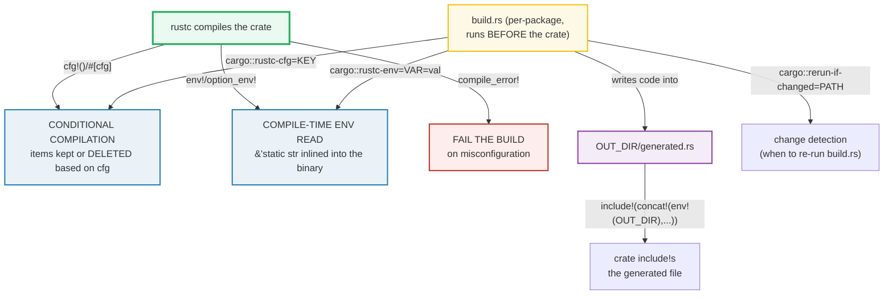

# BUILD_CONFIG — Conditional Compilation, Compile-Time Env, and `build.rs`

> **One-line goal:** Rust fixes a large class of values **before the program ever
> runs** — what code *exists* (`cfg`/`#[cfg]`/`#[cfg_attr]`), what strings are
> *baked in* (`env!`/`option_env!`), and how to *fail the build loudly* on
> misconfiguration (`compile_error!`) — and a package-level **`build.rs`** script
> can generate code and feed `cfg`/env values to the crate before it compiles.
>
> **Run:** `just run build_config` (== `cargo run --bin build_config`)
> **Member:** `core` (stdlib-only — no `[dependencies]`).
> **Prerequisites:** [MODULES](./MODULES.md) (crates/packages), [MACRO\_RULES](./MACRO_RULES.md)
> (these are all built-in macros). A `build.rs` is per-package, so read
> [MODULES](./MODULES.md) first.
> **Ground truth:** [`build_config.rs`](./build_config.rs); captured stdout:
> [`build_config_output.txt`](./build_config_output.txt).

---

## Why this exists (lineage)

Most languages decide "what code runs" at *runtime*: dynamic dispatch, `if
(os == "linux")`, `getattr`, `process.env.NAME` read every call. Rust rejects
that for two reasons:

| Concern | Runtime approach (Python/Go/JS) | Rust build-time approach |
|---|---|---|
| **Platform code** (`linux` vs `windows` path) | `if runtime.GOOS == "linux"` — dead branch still ships, still costs a branch | `#[cfg(target_os = "linux")]` — the wrong platform's code is **deleted** at compile time (zero cost, no dead branch) |
| **Config values** (version, git hash) | Read a file / env at startup | `env!("CARGO_PKG_VERSION")` — the literal is **inlined** into the binary as `&'static str` |
| **Feature gates** (json support on/off) | `if features.json { ... }` runtime flag | `#[cfg(feature = "json")]` — un-enabled code is **not compiled at all** (smaller binary, no dead code) |
| **Misconfiguration** | runtime `panic`/`throw` on bad config | `compile_error!("enable feature x")` — the build **refuses to produce a binary** |

The payoff: **no dead branches, no runtime config reads, no "it built but crashes
on startup because the env was wrong."** The cost: configuration becomes a
*compile-time* concern, which is exactly what this bundle makes mechanical.

> **Why this bundle is one `[[bin]]`, not a real `build.rs`.** A build script is
> a *build-time program* compiled and run **before** its package — one per
> package, in a file literally named `build.rs`. A workspace `[[bin]]` cannot
> host one (it is itself a crate target, built *by* a package). So the build-time
> primitives a normal crate **can** use — `cfg!`, `env!`, `option_env!`, `concat!`
> — are exercised **live** below (Sections A, B, D, E), and the `build.rs` +
> `OUT_DIR` + `cargo::` directives + `include!` workflow is **documented** with a
> concrete, copy-pasteable example (Section E), clearly labelled as *build-system
> evidence* (like a `-gcflags` trace in the Go bundles). An unconditional
> `compile_error!` is also documentation-only (Section C) — shipping one would
> make this file fail to compile.



The decisive distinction: **`cfg`/`env!`/`compile_error!` run inside rustc** when
it compiles *your* crate; **`build.rs` runs as its own little program *before***
rustc is even invoked on your crate, and it influences that later compilation
through `cargo::` directives and files in `OUT_DIR`.

---

## Section A — `cfg!()`: conditional compilation that evaluates to a `bool`

```rust
let on_mac: bool = cfg!(target_os = "macos");   // expands to the literal `true` here
```

> **From build_config.rs Section A:**
> ```
> ======================================================================
> SECTION A — cfg!(): conditional compilation -> a `bool` literal
> ======================================================================
>   cfg!(debug_assertions)       = true   (debug build via `cargo run`)
> [check] cfg!(debug_assertions) is true for a debug (`cargo run`) build: OK
>   cfg!(target_os = "macos")   = true
>   cfg!(target_os = "linux")   = false
> [check] exactly one of macos/linux target_os holds on a single host: OK
> [check] this machine is cfg!(target_os = "macos"): OK
>   cfg!(unix)                   = true
>   cfg!(windows)                = false
> [check] cfg!(unix) and cfg!(windows) are mutually exclusive: OK
>   NOTE: cfg!() expands to a bool and KEEPS all code;
>         #[cfg(...)] is an attribute that REMOVES items when false.
> ```

**What.** `cfg!(PREDICATE)` is a built-in macro that expands to the **literal
`true` or `false`** depending on whether `PREDICATE` holds for *this*
compilation ([Reference — the `cfg` macro][ref-cfg-macro]). Because it yields a
plain `bool`, you can print it, store it, branch on it — exactly what Section A
does. The output pins four facts: `debug_assertions` is `true` in a debug build;
exactly one of `target_os = "macos"` / `"linux"` holds; and the `unix`/`windows`
*name* cfgs (derived from `target_family`) are mutually exclusive.

**Why (internals) — the two faces of `cfg`.** There are **two** cfg mechanisms
and they behave very differently:

| Form | What it does | Effect on code |
|---|---|---|
| `cfg!(pred)` **macro** | Expands to the `bool` literal `true`/`false` | **Keeps all code** — every branch of `if cfg!(...)` must still type-check |
| `#[cfg(pred)]` **attribute** | Decides whether to *include* the item | **Removes the item entirely** when `pred` is false (it is as if it were never written) |

The std docs are explicit: *"`cfg!`, unlike `#[cfg]`, does not remove any code and
only evaluates to true or false... all blocks in an if/else expression need to be
valid when `cfg!` is used for the condition"* ([`std::cfg!`][std-cfg]). That is
why the file can `println!("{}", cfg!(target_os = "linux"))` even on macOS: the
`"linux"` branch isn't deleted, it just prints `false`.

**The predicate grammar** ([Reference — conditional compilation][ref-cfg]):
- A **name**: `unix`, `windows`, `debug_assertions` — true iff that option is set.
- A **key=value**: `target_os = "macos"`, `target_arch = "aarch64"` — true iff the
  key equals that string.
- **Combinators**: `all(...)`, `any(...)`, `not(...)`, and the literals
  `true`/`false`. So `#[cfg(all(unix, target_pointer_width = "32"))]` means
  "a 32-bit Unix".

> **`debug_assertions` is the cfg behind `debug_assert!`.** rustc sets it
> whenever compiling **without** `-O` (i.e. a debug build). `cargo run` builds in
> debug, so it is `true` here; `cargo run --release` would make it `false`. The
> stdlib's `debug_assert!` macro is literally `if cfg!(debug_assertions) { assert!(...) }`
> — which is why debug assertions vanish in release with zero runtime cost
> ([Reference — `debug_assertions`][ref-cfg]).

🔗 [CONTROL\_FLOW](./CONTROL_FLOW.md) — `cfg!` is often used to pick a branch at
runtime (with a value fixed at compile time); contrast with `#[cfg]` which picks
at *compile* time and ships only one branch.

---

## Section B — `env!` / `option_env!`: read the environment at COMPILE time

```rust
let pkg: &'static str = env!("CARGO_PKG_NAME");        // "core", or compile error
let home: Option<&'static str> = option_env!("HOME");  // Some(...) or None
```

> **From build_config.rs Section B:**
> ```
> ======================================================================
> SECTION B — env! / option_env!: read the env at COMPILE time
> ======================================================================
>   env!("CARGO_PKG_NAME")    = "core"
>   env!("CARGO_PKG_VERSION") = "0.0.0"
>   env!("CARGO_CRATE_NAME")  = "build_config"
> [check] env!("CARGO_PKG_NAME") == "core" (the member PACKAGE name): OK
> [check] env!("CARGO_PKG_VERSION") is non-empty (set by Cargo): OK
> [check] env!("CARGO_PKG_VERSION") == "0.0.0" (workspace version): OK
> [check] env!("CARGO_CRATE_NAME") == "build_config": the BIN crate, NOT the package: OK
> [check] CARGO_PKG_NAME ("core") != CARGO_CRATE_NAME ("build_config"): package vs target crate: OK
>   option_env!("HOME")                       = <Some>
>   option_env!("BUILD_CONFIG_DEFINITELY_UNSET...") = <None>
>   option_env!("OUT_DIR")                    = <None>
> [check] option_env!("HOME") is Some on a typical Unix build host (presence only): OK
> [check] option_env! on an unset var returns None (never a compile error): OK
> [check] option_env!("OUT_DIR") is None: `core` has NO build.rs (OUT_DIR is build-script-only): OK
> ```

**What.** `env!("VAR")` expands to a **`&'static str`** holding the value of
`VAR` **as it was when rustc ran** (i.e. at *build* time), and is a **compile
error** if `VAR` is unset or not valid Unicode. `option_env!("VAR")` is the
total version: it expands to `Option<&'static str>` — `Some` if set, `None` if
not, and **never** a compile error ([`std::env!`][std-env],
[`std::option_env!`][std-optionenv]). To read an env var at *runtime* instead,
use `std::env::var` — these macros are strictly compile-time.

**Why (internals).**
- **The value is baked into the binary.** `env!("CARGO_PKG_VERSION")` is not a
  lookup at startup; rustc inlines the literal `"0.0.0"` straight into the
  `.rodata` section. There is no runtime cost and no way for the running program
  to change it.
- **Cargo sets a fixed family of `CARGO_*` vars** for every crate it builds.
  The output distinguishes two that are easy to confuse:
  - `CARGO_PKG_NAME` = the **package** name from `Cargo.toml` → `"core"` (the
    member crate).
  - `CARGO_CRATE_NAME` = the name of the **specific crate/target being compiled**
    → `"build_config"` (the `[[bin]]`). For the *library* target of the same
    package this would instead be the snake-normalized package name. The fifth
    check encodes this distinction explicitly: they are *not* equal here.
- **`option_env!` checks presence only.** The file deliberately prints `<Some>` /
  `<None>` rather than the *value* of `HOME`: the value (a home directory) is
  host-specific and would make `_output.txt` non-reproducible across machines
  (the DETERMINISM rule, `HOW_TO_RESEARCH.md` §4.2). The *boolean* presence is
  deterministic.
- **`OUT_DIR` is `None` here — on purpose.** `OUT_DIR` is an env var Cargo sets
  **only for packages that have a build script**. `core` has no `build.rs`, so
  `option_env!("OUT_DIR")` is `None`. The last check is a live demonstration that
  `OUT_DIR` is *build-script-gated*, not universally present ([Cargo Book — build
  script inputs][cargo-build]). (This also means `env!("OUT_DIR")` — without
  `option_` — would be a **compile error** in this crate.)

> **Custom error message.** `env!("VAR", "explanation")` lets you replace the
> default "not defined at compile time" error with your own text — useful when
> the var is optional-but-expected ([`std::env!` examples][std-env]).

🔗 [MODULES](./MODULES.md) — `CARGO_PKG_NAME` vs `CARGO_CRATE_NAME` only makes
sense once you know a *package* can hold many crate *targets* (libs + bins).

---

## Section C — `compile_error!`: fail the build on misconfiguration (DOCUMENTED)

```rust
// The cfg-GUARDED form recommended by the std docs:
#[cfg(not(any(feature = "foo", feature = "bar")))]
compile_error!("Either feature \"foo\" or \"bar\" must be enabled for this crate.");
```

> **From build_config.rs Section C:**
> ```
> ======================================================================
> SECTION C — compile_error!: fail the build on misconfiguration (DOCUMENTED)
> ======================================================================
>   // An UNCONDITIONAL compile_error! always fails the build:
>   //   compile_error!("boom");   // <- never ship this in a runnable file
> 
>   // The idiomatic cfg-GUARDED form (verbatim from the std docs):
>   //   #[cfg(not(any(feature = "foo", feature = "bar")))]
>   //   compile_error!("Either feature \"foo\" or \"bar\" must be enabled.");
> 
>   // Single-feature guard (the brief's pattern):
>   //   #[cfg(not(feature = "x"))]
>   //   compile_error!("enable feature `x`");
> 
>   // How it behaves:
>   //   - if the cfg predicate is FALSE -> the item is removed (no error).
>   //   - if the cfg predicate is TRUE  -> compilation stops with the message.
>   //   - it is the compiler-level form of panic!, emitted during compilation.
> [check] a contradictory cfg predicate (all(unix, windows)) is always false: OK
> ```

**What.** `compile_error!("msg")` is the **compile-time analogue of `panic!`**:
when rustc reaches it, compilation **fails** with `msg`. The std docs describe it
as "the compiler-level form of `panic!`, but emits an error during *compilation*
rather than at *runtime*" ([`std::compile_error!`][std-cerr]).

**Why an unconditional one cannot live in this file.** A bare
`compile_error!("boom");` makes the crate **never compile** — so it cannot be
shipped in a runnable bundle (or any crate you want to build). That is why this
section is *documentation*: it prints the pattern rather than executing it.

**The idiomatic pattern — a cfg guard.** The real use is to put `compile_error!`
behind a `#[cfg(...)]` that is true **only on misconfiguration**. The std docs'
canonical example is verbatim above: if *neither* feature `foo` nor `bar` is
enabled, the predicate `not(any(feature="foo", feature="bar"))` becomes true and
the build stops with a helpful message; otherwise the item is removed by `#[cfg]`
and no error fires. This is how a crate **fails loudly** instead of silently
shipping a broken artifact.

**The runnable piece — proving the guard is dead code.** Section C asserts that
the contradictory predicate `all(unix, windows)` is `false` on *every* host
(`unix` and `windows` are mutually-exclusive target families). A
`compile_error!` placed behind `#[cfg(all(unix, windows))]` would therefore be
removed on every host and never fire — the exact mechanism that makes a guarded
`compile_error!` safe. (Note: we deliberately avoid `feature = "..."` cfgs in the
runnable check — this crate declares no `[features]`, so they would trip the
`unexpected_cfgs` lint under `-D warnings`; see the pitfalls table.)

> **Where else it shines.** `compile_error!` is also the standard way to give a
> helpful message inside `macro_rules!` for an unmatched arm (e.g.
> `give_me_foo_or_bar!(neither)` → "This macro only accepts `foo` or `bar`"),
> instead of the cryptic default "no rule expects the token `neither`"
> ([`std::compile_error!` examples][std-cerr]). 🔗 [MACRO\_RULES](./MACRO_RULES.md)

---

## Section D — target info via `cfg`: arch / os / vendor / width / endian

```rust
if cfg!(target_arch = "aarch64") { /* arm64 path */ }
```

> **From build_config.rs Section D:**
> ```
> ======================================================================
> SECTION D — target info via cfg: arch / os / vendor / width / endian
> ======================================================================
>   this target_os = "macos"
> [check] the current target_os is in the Reference's enumerated set: OK
>   cfg!(target_arch         = "aarch64") = true
>   cfg!(target_vendor       = "apple")   = true
>   cfg!(target_pointer_width= "64")      = true
>   cfg!(target_endian       = "little")  = true
>   cfg!(target_family       = "unix")    = true
> [check] cfg!(target_arch = "aarch64") on this Apple Silicon host: OK
> [check] cfg!(target_vendor = "apple") on this host: OK
> [check] cfg!(target_pointer_width = "64") on this 64-bit host: OK
> [check] cfg!(target_endian = "little") on this host: OK
> [check] cfg!(target_family = "unix") on this host: OK
> [check] on macOS, target_env is the empty string (only set when needed to disambiguate): OK
> ```

**What.** The compiled crate learns about its **target** through a family of
key/value cfg options. Section D pins this host as `aarch64` / `apple` / `macos`
/ `64-bit` / `little-endian` / `unix`, and asserts that the resolved
`target_os` (`"macos"`) is a member of the enumerated set the Rust Reference
publishes.

**Why (internals) — these are *target* cfgs, not *host* cfgs.**
- The Reference defines each ([Reference — set configuration options][ref-cfg]):
  `target_arch` (e.g. `"aarch64"`, `"x86_64"`), `target_os` (`"macos"`,
  `"linux"`, `"windows"`, ...), `target_vendor` (`"apple"`, `"pc"`, ...),
  `target_pointer_width` (`"16"`/`"32"`/`"64"`), `target_endian`
  (`"little"`/`"big"`), `target_family` (`"unix"`/`"windows"`/`"wasm"`), and the
  derived name-cfgs `unix`/`windows`.
- **`target_env` is quirky on macOS.** The last check shows `target_env = ""`
  (empty string) on this host. The Reference explains: *"`target_env`... is only
  defined as not the empty-string when actually needed for disambiguation"* — so
  on many GNU/macOS platforms it is `""`, while on Linux it distinguishes
  `"gnu"`/`"musl"` and on Windows `"msvc"`/`"gnu"` ([Reference — `target_env`][ref-cfg]).
- **`TARGET`/`HOST`/`OPT_LEVEL`/`DEBUG` are *not* available here.** Those are
  **environment variables** Cargo sets **only for build scripts**, not for the
  crate itself. A normal crate cannot read them with `env!("TARGET")` (compile
  error); it must use the `cfg` options above instead. This is why Section D uses
  `cfg!(target_arch = ...)`, never `env!("TARGET")`. (See the pitfalls table.)

> **Discovering your cfgs.** `rustc --print cfg --target aarch64-apple-darwin`
> prints every cfg option rustc will set for that target — invaluable when
> writing `#[cfg(...)]` guards ([rustc — `--print cfg`][ref-cfg]).

---

## Section E — `build.rs`: a build-time program (DOCUMENTED) + the `concat!` splice (RUN)

```rust
// build.rs (at the package root; compiled and run BEFORE the crate)
fn main() {
    let version = env!("CARGO_PKG_VERSION");
    let out_dir = env!("OUT_DIR");
    std::fs::write(
        std::path::Path::new(&out_dir).join("generated.rs"),
        format!("pub const VERSION: &str = \"{version}\";\n"),
    ).unwrap();
    println!("cargo::rerun-if-changed=Cargo.toml");
}

// crate side — pull the generated file in at compile time:
include!(concat!(env!("OUT_DIR"), "/generated.rs"));
```

> **From build_config.rs Section E:**
> ```
> ======================================================================
> SECTION E — build.rs workflow (DOCUMENTED) + the concat! splice (RUN)
> ======================================================================
>   // ── build.rs (lives at the package root; run BEFORE the crate) ──
>   // fn main() {
>   //     // Cargo sets CARGO_PKG_VERSION, OUT_DIR, TARGET, HOST, ... for
>   //     // the build script. Read the version, bake it into generated code.
>   //     let version = env!("CARGO_PKG_VERSION");
>   //     let out_dir = env!("OUT_DIR");
>   //     let dest = std::path::Path::new(&out_dir).join("generated.rs");
>   //     let generated = format!("pub const VERSION: &str = \"{version}\";\n");
>   //     std::fs::write(&dest, generated).unwrap();
>   //     // Tell Cargo: re-run me only when Cargo.toml changes.
>   //     println!("cargo::rerun-if-changed=Cargo.toml");
>   //     // (optional) expose a value to the crate via env! at compile time:
>   //     println!("cargo::rustc-env=BUILD_GIT_HASH=abc123");
>   // }
> 
>   // ── crate side: pull the generated file in at compile time ──
>   // include!(concat!(env!("OUT_DIR"), "/generated.rs"));
>   // // now `VERSION` is in scope, e.g.:
>   // println!("built version: {}", VERSION);
> 
>   // cargo:: directives a build script can emit (Cargo Book):
>   //   cargo::rustc-cfg=KEY[="VALUE"]        -> enables a #[cfg(KEY)] in the crate
>   //   cargo::rustc-env=VAR=VALUE            -> readable via env!("VAR") in the crate
>   //   cargo::rerun-if-changed=PATH          -> re-run only when PATH changes
>   //   cargo::rerun-if-env-changed=NAME      -> re-run only when env NAME changes
>   //   cargo::warning=/cargo::error=MESSAGE -> surface a warning / fail the build
> 
>   concat!(env!("CARGO_PKG_NAME"), ".rs") = "core.rs"
> [check] concat!(env!(...), ...) is a compile-time &'static str splice (== "core.rs"): OK
> ```

**What.** Placing a file named `build.rs` at the root of a package makes Cargo
**compile it and run it just before building the package** ([Cargo Book — Build
Scripts][cargo-build]). The script can read build-time env vars, write generated
code into `OUT_DIR`, and emit `cargo::` directives to stdout that change how the
package is then compiled. The example above bakes `CARGO_PKG_VERSION` into a
generated `pub const VERSION`, and the crate pulls that file in with
`include!(concat!(env!("OUT_DIR"), "/generated.rs"))`.

> **This is build-system evidence, not a live run.** A single `[[bin]]` cannot
> host a real `build.rs` (it is a crate target, not a package-level script), so
> the `build.rs` body and the `include!` line are shown as a verified code block,
> exactly as a `-gcflags` trace is shown in the Go bundles. The one piece of the
> pipeline a normal crate **can** run live is the `concat!`+`env!` splice that
> `include!` relies on — exercised in the last check.

**Why (internals) — the build script's contract.**
- **Life cycle.** Cargo compiles `build.rs` into an executable (rebuilding it only
  when *its* sources/deps change), runs it, and only then compiles the rest of
  the package. A non-zero exit code halts the whole build ([Cargo Book — life
  cycle][cargo-build]).
- **Inputs.** The script's current directory is the package root, and Cargo sets
  a rich set of env vars for it: `CARGO_PKG_*`, `OUT_DIR`, `TARGET`, `HOST`,
  `OPT_LEVEL`, `DEBUG`, `CARGO_CFG_*` (the *target's* cfg as env vars — see the
  cross-compile pitfall below), and more.
- **Outputs.** Generated files go **only** in `OUT_DIR` (Cargo does not clean it
  between builds — intentional for incremental native-code compilation). The
  script "talks back" to Cargo by printing lines starting with `cargo::`. The
  load-bearing ones ([Cargo Book — outputs][cargo-build]):
  - `cargo::rustc-cfg=KEY[="VALUE"]` → passes `--cfg KEY[="VALUE"]` to rustc, so
    `#[cfg(KEY)]` works in the crate. (Note: this is a *plain* cfg, **not** a
    Cargo feature — it cannot enable optional deps; features use `feature="..."`.)
  - `cargo::rustc-env=VAR=VALUE` → sets `VAR` so the crate can read it via
    `env!("VAR")`. This is the standard way to embed e.g. a git-hash in the
    binary.
  - `cargo::rerun-if-changed=PATH` → **narrow change detection**: re-run the
    script only when `PATH` changes. Without *any* `rerun-if-*` directive, Cargo
    conservatively re-runs whenever *anything* in the package changes — usually
    wrong, so every build script should emit at least one.
  - `cargo::rerun-if-env-changed=NAME` → re-run when env var `NAME` changes.
  - `cargo::warning=`/`cargo::error=` → surface a warning / fail the build.
- **`include!` is the bridge.** `include!("file")` parses a file as Rust code
  **unhygienically** at the call site ([`std::include!`][std-include]). It is the
  primary way (besides `include_str!`/`include_bytes!`) to consume build-script
  output: `include!(concat!(env!("OUT_DIR"), "/generated.rs"))` splices the
  `OUT_DIR` path (a build-time env var) with a filename at compile time and
  parses the result as a module's worth of items.

**The runnable piece — the `concat!`+`env!` splice.** The last check shows
`concat!(env!("CARGO_PKG_NAME"), ".rs")` == `"core.rs"`: `env!` yields the
`&'static str` `"core"`, and `concat!` joins it with `".rs"` **at compile time**
into a single `&'static str`. That is precisely the mechanism
`include!(concat!(env!("OUT_DIR"), "/generated.rs"))` uses — just pointed at a
package-name-derived filename instead of `OUT_DIR`. It costs nothing at runtime.

> **MSRV note.** The `cargo::KEY=VALUE` (double-colon) syntax requires Cargo
> ≥ 1.77; for older toolchains use the legacy single-colon `cargo:KEY=VALUE` form
> ([Cargo Book][cargo-build]).

🔗 [PROC\_MACROS](../pmacros-demo/PROC_MACROS.md) — when codegen is too involved for a `build.rs` + `include!`
(string parsing, attribute macros), a **proc macro** is the heavier tool. A
`build.rs` is a plain program that writes text; a proc macro is a compiler plugin
that emits tokens. 🔗 [MODULES](./MODULES.md) — `build.rs` is per-**package**.

---

## Section F — Cargo features: `[features]` → `cfg(feature = "..")` (DOCUMENTED)

```toml
# Cargo.toml
[features]
json   = ["dep:serde_json"]   # optional dep + a cfg switch
pretty = []                   # pure switch, no extra dep

[dependencies]
serde_json = { version = "1", optional = true }   # only pulled in by `json`
```

```rust
#[cfg(feature = "json")]
fn parse_json() { /* serde_json is in scope here, and only here */ }

if cfg!(feature = "pretty") { /* pretty-print path */ }
```

> **From build_config.rs Section F:**
> ```
> ======================================================================
> SECTION F — Cargo features: [features] -> cfg(feature = "..") (DOCUMENTED)
> ======================================================================
>   // [features] in Cargo.toml:
>   //   [features]
>   //   json   = ["dep:serde_json"]   # optional dep + a cfg switch
>   //   pretty = []                    # pure switch, no extra dep
> 
>   // [dependencies] (optional, pulled in only by the feature):
>   //   serde_json = { version = "1", optional = true }
> 
>   // In code, the feature becomes a cfg:
>   //   #[cfg(feature = "json")]
>   //   fn parse_json() { /* ... */ }
> 
>   //   if cfg!(feature = "pretty") { /* pretty-print */ }
> 
>   // Enable from the CLI:   cargo build --features json
>   //                       cargo build --all-features
>   //                       cargo build --no-default-features
> 
>   // A feature `json` gates code via the cfg `feature = "json"`:
>   //   format!("feature = \"{}\"", "json") = "feature = \"json\""
> [check] a feature named `json` in [features] gates code via cfg `feature = "json"`: OK
> ```

**What.** Cargo features are **compile-time switches** declared in `[features]`
of the manifest. Enabling a feature `foo` sets the cfg `feature = "foo"`, which
gates code with `#[cfg(feature = "foo")]` / `cfg!(feature = "foo")`. Features can
also turn on **optional dependencies** (`dep:serde_json`), so a feature both
flips a cfg *and* adds a crate to the build graph. `core` ships **no**
`[features]` (it is stdlib-only), so every `feature=` cfg would be false here;
this section therefore **documents** the manifest shape rather than assert a live
feature.

**Why (internals).**
- **A feature is a cfg, not a runtime flag.** Un-enabled feature code is **not
  compiled at all** — no dead branch, smaller binary, no unused-dependency bloat.
  The Reference calls `feature` "a convention used by Cargo for specifying
  compile-time options and optional dependencies" ([Reference — cfg][ref-cfg]).
- **Optional deps are feature-gated.** `serde_json = { optional = true }` is only
  pulled in when the `json` feature (which lists `dep:serde_json`) is enabled.
  This is the idiomatic way to keep a heavy dependency out of the default build.
- **`cfg!(feature = "...")` for an undeclared feature is a lint.** Because
  `core` declares no features, writing `cfg!(feature = "serde")` in *this* file
  would trip the `unexpected_cfgs` lint (warn-by-default since 1.80) and fail
  under `-D warnings`. That is why Section F uses a string-splice check to show
  the `feature = "json"` mapping instead. The fix, in a real crate, is to
  `cargo::rustc-check-cfg` the feature or simply declare it in `[features]`.

> **CLI control.** `cargo build --features json` turns a feature on;
> `--all-features` turns them all on; `--no-default-features` disables the
> `default` feature set. Features are **additive** across the dependency graph
> (union semantics) — a crate compiled once is compiled with the union of all
> features requested by its dependents.

---

## Pitfalls (the expert payoff)

| Trap | Symptom | Fix / why |
|---|---|---|
| **`cfg!()` vs `#[cfg]`** | "I used `cfg!(target_os=...)` to exclude code but the other platform's code still must compile" | `cfg!()` expands to a `bool` and **keeps all code** (all branches type-check). Use the **`#[cfg(...)]` attribute** to actually *remove* an item ([`std::cfg!`][std-cfg]). |
| **`env!("OUT_DIR")` with no build script** | `error: environment variable 'OUT_DIR' not defined at compile time` | `OUT_DIR` is set **only** for packages with a `build.rs`. Use `option_env!("OUT_DIR")` to tolerate its absence (it is `None` in `core`). |
| **Confusing `TARGET` (build-script env) with `target_os` (cfg)** | `env!("TARGET")` fails to compile in a normal crate | `TARGET`/`HOST`/`OPT_LEVEL`/`DEBUG` are **build-script-only** env vars. A crate reads the target via `cfg!(target_os = ...)`, not `env!("TARGET")`. |
| **`cfg!` in a build script checks the HOST, not the TARGET** | build script's `cfg!(target_os=...)` is wrong when cross-compiling | In `build.rs`, `cfg!`/`#[cfg]` reflect the **host** (where the script runs). Read `CARGO_CFG_TARGET_OS` (an env var) or the `CARGO_CFG_*` family to see the **target** ([Cargo Book — inputs][cargo-build]). |
| **`CARGO_PKG_NAME` vs `CARGO_CRATE_NAME`** | assuming both are the package name | `CARGO_PKG_NAME` = the **package**; `CARGO_CRATE_NAME` = the **target crate** (the bin name for a `[[bin]]`). They differ for bins (Section B: `"core"` vs `"build_config"`). |
| **`compile_error!` without a guard** | the crate never compiles | A bare `compile_error!` always fires. Put it behind `#[cfg(not(...))]` so it fires only on misconfiguration (Section C). |
| **`unexpected_cfgs` for an undeclared feature** | `warning: unexpected cfg condition value` under `-D warnings` | Declare the feature in `[features]`, or register it with `cargo::rustc-check-cfg`. Don't `cfg!(feature="x")` for a feature the crate doesn't have. |
| **`build.rs` runs on every change** | slow rebuilds | By default Cargo re-runs it if *any* package file changes. Emit `cargo::rerun-if-changed=PATH` to narrow it (Section E). |
| **`option_env!` value is host-specific** | `_output.txt` differs across machines | Read `.is_some()` / `.is_none()` for the boolean, or assert the *structural* fact — never print a host path as a value (DETERMINISM, §4.2). |
| **`include!` is unhygienic** | name collisions between the included file and the surrounding code | `include!` pastes the file's tokens at the call site with no hygiene. Prefer the module system for multi-file projects; reserve `include!` for generated `OUT_DIR` files ([`std::include!`][std-include]). |
| **`target_env` is empty on macOS** | `cfg!(target_env = "gnu")` is unexpectedly false on macOS | `target_env` is `""` on macOS and many GNU platforms — it is only non-empty when needed to disambiguate the ABI (Section D). |
| **A `cargo::rustc-cfg=KEY` is not a feature** | `#[cfg(feature = "KEY")]` doesn't fire for a build-script cfg | `rustc-cfg` sets a *plain* cfg (`#[cfg(KEY)]`), not `feature="KEY"`. It cannot enable optional deps either ([Cargo Book — rustc-cfg][cargo-build]). |
| **Forgetting `cargo::` syntax MSRV** | older Cargo ignores `cargo::KEY=VALUE` | The double-colon form needs Cargo ≥ 1.77. Use legacy `cargo:KEY=VALUE` (single colon) for older toolchains ([Cargo Book][cargo-build]). |

---

## Cheat sheet

```rust
// ── cfg!() vs #[cfg]: macro keeps code (bool), attribute REMOVES items ──
let on_mac: bool = cfg!(target_os = "macos");          // true here; code stays
#[cfg(target_os = "macos")]                            // removes the item if false
fn mac_only() {}

// ── env! / option_env!: compile-time env -> &'static str ──
let pkg: &'static str = env!("CARGO_PKG_NAME");        // "core", or COMPILE ERROR
let home: Option<&'static str> = option_env!("HOME");  // Some(...) / None, never errors
// runtime env: std::env::var("HOME") -> Result<String, VarError>

// ── compile_error!: the compile-time panic!; ALWAYS guard it ──
#[cfg(not(feature = "x"))] compile_error!("enable feature `x`");

// ── target cfgs (target_*), NOT env!("TARGET") ──────────────────
//   target_arch / target_os / target_vendor / target_pointer_width
//   target_endian / target_family / unix / windows / debug_assertions
//   TARGET/HOST/OPT_LEVEL/DEBUG are BUILD-SCRIPT-ONLY env vars.

// ── build.rs (per-package, runs BEFORE the crate) ───────────────
//   // build.rs:
//   let out = env!("OUT_DIR");
//   std::fs::write(format!("{out}/g.rs"), "pub const V: &str = \"0.0.0\";").unwrap();
//   println!("cargo::rerun-if-changed=Cargo.toml");
//   println!("cargo::rustc-env=GIT_HASH=abc123");
//   println!("cargo::rustc-cfg=nightly");        // -> #[cfg(nightly)] in crate
//   // crate side:
//   include!(concat!(env!("OUT_DIR"), "/g.rs"));  // splice path at compile time

// ── features: [features] -> cfg(feature = "..") + optional deps ──
//   [features] json = ["dep:serde_json"]
//   #[cfg(feature = "json")] fn parse() { /* serde_json in scope here only */ }
```

---

## Sources

Every claim above was web-verified against an authoritative source.

- **The Rust Reference — Conditional Compilation** — the cfg predicate grammar
  (`all`/`any`/`not`/`true`/`false`), the `#[cfg]`/`#[cfg_attr]` attributes, the
  `cfg!` macro (expands to a bool, "does not remove any code"), and the full list
  of compiler-set options (`target_arch`, `target_os`, `target_vendor`,
  `target_pointer_width`, `target_endian`, `target_family`, `target_env`'s
  empty-string quirk, `debug_assertions`, `unix`/`windows`, `feature`):
  https://doc.rust-lang.org/reference/conditional-compilation.html
- **`std::cfg!` docs** — "evaluates boolean combinations of configuration flags
  at compile-time"; "`cfg!`, unlike `#[cfg]`, does not remove any code and only
  evaluates to true or false":
  https://doc.rust-lang.org/std/macro.cfg.html
- **`std::env!` docs** — "inspects an environment variable at compile time",
  yields `&'static str`, compile error if unset (use `option_env!`), custom error
  message via the second argument:
  https://doc.rust-lang.org/std/macro.env.html
- **`std::compile_error!` docs** — "causes compilation to fail with the given
  error message"; "the compiler-level form of `panic!`"; the canonical
  cfg-guarded example `#[cfg(not(any(feature="foo", feature="bar")))]
  compile_error!(...)`:
  https://doc.rust-lang.org/std/macro.compile_error.html
- **`std::include!` docs** — "parses a file as an expression or an item";
  unhygienic; primary use is including build artifacts from `OUT_DIR`:
  https://doc.rust-lang.org/std/macro.include.html
- **The Cargo Book — Build Scripts** — life cycle (compiled + run before the
  package), inputs (`OUT_DIR`, `TARGET`, `HOST`, `CARGO_CFG_*`, the
  host-vs-target `cfg!` caveat), outputs (`cargo::rustc-cfg`, `cargo::rustc-env`,
  `cargo::rerun-if-changed`, `cargo::rerun-if-env-changed`, `cargo::warning`,
  `cargo::error`, `cargo::rustc-check-cfg`), `OUT_DIR` not cleaned between
  builds, the `cargo::` ≥ 1.77 / legacy `cargo:` MSRV note:
  https://doc.rust-lang.org/cargo/reference/build-scripts.html
- **The Cargo Book — Features** (referenced via the build-scripts page) —
  `[features]`, `feature="..."` cfg convention, optional dependencies
  (`dep:`/`optional = true`), `--features`/`--all-features`/`--no-default-features`:
  https://doc.rust-lang.org/cargo/reference/features.html
