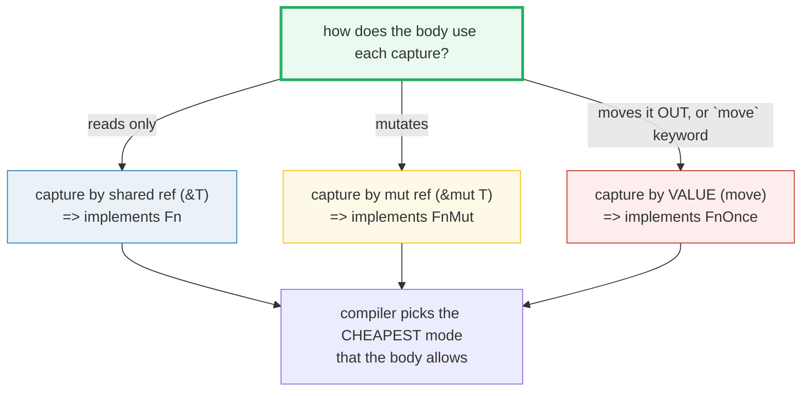
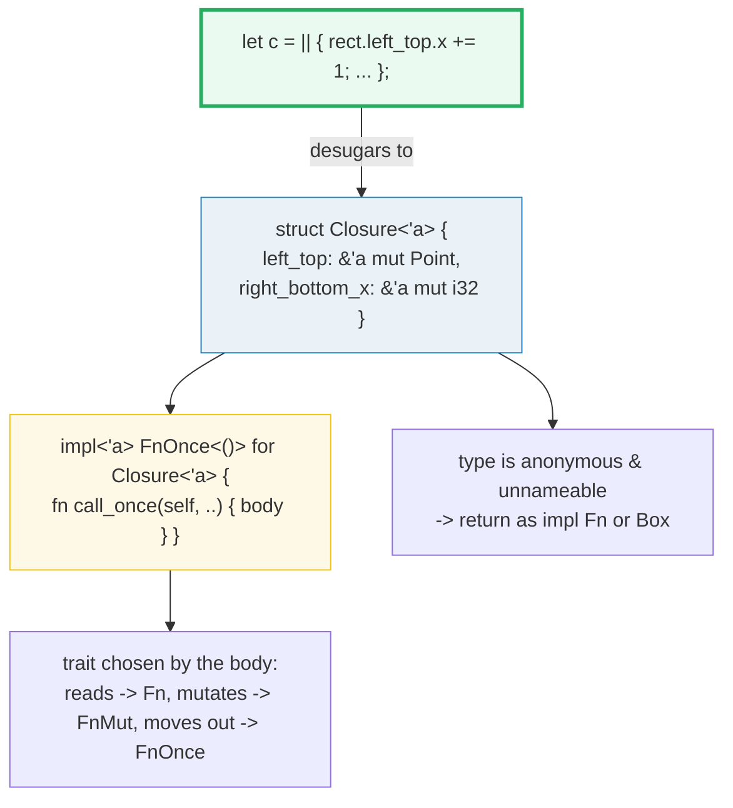

# CLOSURES — Capturing Closures and the `Fn` / `FnMut` / `FnOnce` Traits

> **One-line goal:** a closure is an **anonymous function that captures variables
> from its environment**; the compiler picks one of three **capture modes**
> (shared ref / mut ref / by-value via `move`) and one of three **call traits**
> (`Fn` / `FnMut` / `FnOnce`) from how the body uses each capture; a closure
> **desugars to an anonymous struct** holding the captures + an `impl` of those
> traits, which is why its type is **unnameable** and must be returned as
> `impl Fn` or `Box<dyn Fn>`.
>
> **Run:** `just run closures` (== `cargo run --bin closures`)
> **Member:** `core` (stdlib-only — no `[dependencies]`).
> **Prerequisites:** 🔗 [OWNERSHIP](./OWNERSHIP.md) and 🔗 [BORROWING](./BORROWING.md)
> (capture modes *are* borrows), 🔗 [MOVE_SEMANTICS](./MOVE_SEMANTICS.md) (`move`
> closures), 🔗 [TRAITS_BASICS](./TRAITS_BASICS.md) / 🔗 [TRAIT_BOUNDS](./TRAIT_BOUNDS.md)
> (the `Fn*` traits are trait bounds), 🔗 [TRAIT_OBJECTS](./TRAIT_OBJECTS.md)
> (`Box<dyn Fn>`).
> **Ground truth:** [`closures.rs`](./closures.rs); captured stdout:
> [`closures_output.txt`](./closures_output.txt).

---

## Why this exists (lineage)

A plain `fn` in Rust is a closed box: it can only see its arguments and globals.
A **closure** (also called a *lambda*) opens that box — it is an anonymous
function that can **reach into the scope where it is defined** and *capture*
variables from it. That single ability is what makes callbacks, iterators,
thread spawns, and event handlers expressive:

```rust
let prefix = "hello";
let greet = || println!("{prefix}, world"); // captures `prefix` from scope
```

But "reaching into the scope" is an **ownership question**: does the closure
*read* the variable, *mutate* it, or *take it away*? Rust answers with the same
borrowing/ownership model the rest of the language uses. The compiler inspects
the closure body and, for each captured variable, picks the **cheapest capture
mode that works** — and that mode determines which of three **call traits**
(`Fn`, `FnMut`, `FnOnce`) the closure implements. Those traits are how the rest
of the program *specifies* what kind of closure it will accept (e.g.
`Option::unwrap_or_else` demands `FnOnce`, `sort_by_key` demands `FnMut`).



---

## The three capture modes and the three traits

The Rust Reference fixes four capture modes ([Reference — Closure types, "Capture
modes"][ref-closure-types]); three of them are the everyday ones:

| Body's use of the capture | Capture mode | Trait the closure implements | Receiver |
|---|---|---|---|
| reads it only | shared borrow `&T` | **`Fn`** | `&self` (callable repeatedly, no mutation) |
| mutates it | mutable borrow `&mut T` | **`FnMut`** | `&mut self` (callable repeatedly, may mutate) |
| moves it OUT (or `move` forces it) | by value | **`FnOnce`** | `self` (consumes the closure — callable ONCE) |

> The fourth mode, *unique immutable borrow*, is an internal detail needed when a
> closure mutates through a `&mut` reference it does not own; it cannot be written
> in source. See [Reference — Unique immutable borrows][ref-closure-types].

Two invariants make the whole system click:

1. **The compiler picks the *cheapest* mode the body allows** — it never moves or
   mutably borrows a capture it only needs to read ([Reference — capture
   inference][ref-closure-expr]).
2. **The three traits form a supertrait chain**: `trait Fn<Args>: FnMut<Args>`
   and `trait FnMut<Args>: FnOnce<Args>` ([std::ops::Fn][std-fn]). So **every
   `Fn` IS-A `FnMut` IS-A `FnOnce`**. A function bound by `F: FnOnce()` accepts
   *all* closures; a function bound by `F: Fn()` accepts *only* read-only ones.


---

## Section A — Capture by shared reference: a read-only closure is `Fn`

```rust
let greeting = String::from("hello");
let greet = || println!("{greeting}");   // reads greeting -> captures &greeting
greet();
greet();                                  // callable any number of times
```

> **From closures.rs Section A:**
> ```
> ======================================================================
> SECTION A — capture by shared reference (&T): a read-only closure is `Fn`
> ======================================================================
>   let greeting = String::from("hello");
>   let greet = || { ... &greeting ... };   // captures &greeting
>     [closure] greeting = "hello" (len 5)
>     [closure] greeting = "hello" (len 5)
>   greet() called twice (same shared borrow, no mutation)
>   caller still owns greeting = "hello"
> [check] a read-only closure borrows by shared ref: caller keeps ownership: OK
> [check] a Fn closure reads the SAME value on every call (no consumption): OK
> ```

**What.** `greet` captures `greeting` by **shared reference** because the body
only reads it. The caller keeps ownership; the closure value simply holds a
`&String`. `greet()` is called twice and `greeting` is still `"hello"` in the
caller afterward — nothing was moved or mutated.

**Why (internals).** The Reference is explicit: *"Without the `move` keyword, the
closure expression infers how it captures each variable from its environment,
preferring to capture by shared reference"* ([Reference — closure-expr][ref-closure-expr]).
A read-only capture is the cheapest mode, and it makes the closure `Fn`
(callable by `&self`, repeatedly). Because the closure never mutates or consumes
its capture, the caller can keep using `greeting` freely while the closure is
alive — the same rules as any shared borrow. This is why `Option::unwrap_or_else`
can accept a closure that calls a method on `self`: the closure captures `&self`
and is `Fn`.

---

## Section B — Capture by mutable reference: a mutating closure is `FnMut`

```rust
let mut count = 0u32;
let mut bump = || { count += 1; count };  // mutates count -> captures &mut count
bump(); bump(); bump();                     // -> 1, 2, 3
```

> **From closures.rs Section B:**
> ```
> ======================================================================
> SECTION B — capture by mutable reference (&mut T): a mutating closure is `FnMut`
> ======================================================================
>   let mut count = 0u32;
>   let mut bump = || { count += 1; count };   // captures &mut count
>     bump() called 3 times -> 1 then 2 then 3
>   after `bump` drops, the &mut borrow releases; count = 3
> [check] 1st FnMut call returns the incremented counter (1): OK
> [check] 3rd FnMut call returns the incremented counter (3): OK
> [check] the captured counter's final value is 3 after 3 calls: OK
> ```

**What.** `bump` mutates `count`, so it captures `&mut count` and is `FnMut`. It
is callable repeatedly (it returns `1`, then `2`, then `3`), and the captured
counter ends at `3`. The binding must be `let mut bump` because calling an
`FnMut` closure borrows it mutably.

**Why (internals).**
- **`FnMut` = `&mut self` receiver.** The closure may mutate its captures, so
  each call takes the closure *by mutable reference*. That is why the binding is
  `mut bump` and why `sort_by_key` (which calls the closure once per element)
  bounds its callback by `FnMut`, not `FnOnce` ([Book ch13.1][book-closures]).
- **The `&mut` borrow lasts the closure's whole life.** While `bump` is alive,
  `count` is mutably borrowed, so a direct `println!("{count}")` *between* the
  calls is a borrow-check error. The `.rs` scopes `bump` in an inner block so the
  borrow releases before `count` is read again — a pattern you will use whenever
  a mutating closure and the original binding must coexist.
- **`FnMut` is still callable many times.** Unlike `FnOnce`, it does *not* consume
  itself; it just needs `&mut self`. So it satisfies both the `FnMut` and `FnOnce`
  bounds (Section F proves the hierarchy).

---

## Section C — Moving a capture OUT makes the closure `FnOnce` (call once)

```rust
let name = String::from("Ferris");
let consume = || name;          // returns name BY VALUE -> moves it OUT -> FnOnce
let recovered = consume();      // OK: returns "Ferris"
// consume();                   // E0382: use of moved value: `consume`
```

> **From closures.rs Section C:**
> ```
> ======================================================================
> SECTION C — moving a capture OUT makes the closure `FnOnce` (call once)
> ======================================================================
>   let name = String::from("Ferris");
>   let consume = || name;   // returns name BY VALUE -> moves it OUT -> FnOnce
>   let recovered = consume();  -> "Ferris"
> [check] an FnOnce closure returns the moved-out String on its single call: OK
> [check] the returned value carries the captured length (6): OK
> ```

**What.** The body is just `name` — returning a captured `String` **by value
moves it out** of the environment into the return value. Because that move would
leave nothing to move on a second call, the closure can be called **exactly
once**: it is `FnOnce`. The single call returns `"Ferris"` (length `6`).

**Why (internals).** The Book defines the trait precisely: *"`FnOnce` applies to
closures that can be called once… A closure that moves captured values out of its
body will only implement `FnOnce` and none of the other `Fn` traits because it
can only be called once"* ([Book ch13.1][book-closures]). The `FnOnce` receiver
is `self` (it *consumes* the closure), so the first call moves the closure (and
its moved-out capture) away — the binding is then dead. This is the *only* call
trait that `Option::unwrap_or_else` needs, because it calls the fallback closure
at most once.

> **The compile error (calling an `FnOnce` closure twice) cannot live in the
> runnable `.rs` — it would not build.** The verified message is `E0382`:
>
> ```console
> error[E0382]: use of moved value: `consume`
>   |
> 3 |     let consume = || { let s = name; s };
>   |                                ^^^^
> note: closure cannot be invoked more than once because it moves
>       the variable `name` out of its environment
> 4 |     let a = consume();
>   |             --------- `consume` moved due to this call
> 5 |     let b = consume();
>   |             ^^^^^^^ value used here after move
> ```
>
> The note names the exact reason: the body *moves `name` out of its environment*,
> so the closure value is consumed by the first call.

> **`move` vs moving-out — do not confuse them.** `move` controls how captures
> are taken *in* (by value). Whether a capture is moved *out* on a call is what
> decides `FnOnce`. A `move ||` that only reads its captures is still `Fn`
> (Section D); a plain `|| name` that returns a capture by value is `FnOnce`
> even with no `move`. The Reference: *"the traits implemented by a closure type
> are determined by what the closure does with captured values, not how it
> captures them"* ([Reference — call traits][ref-closure-types]).

---

## Section D — `move` forces by-value capture (own, don't borrow)

```rust
fn make_repeater(word: String) -> Box<dyn Fn(usize) -> String> {
    Box::new(move |n| word.repeat(n))   // move || OWNS word
}
let rep = make_repeater(String::from("ab"));
assert_eq!(rep(3), "ababab");           // callable repeatedly -> Fn
```

> **From closures.rs Section D:**
> ```
> ======================================================================
> SECTION D — `move` forces by-value capture (the closure OWNS its captures)
> ======================================================================
>   fn make_repeater(word: String) -> Box<dyn Fn(usize) -> String>
>       Box::new(move |n| word.repeat(n))   // `move ||` owns `word`
>   let rep = make_repeater(String::from("ab"));   // word moved INTO rep
>     rep(3) -> "ababab"
>     rep(2) -> "abab"
> [check] a move closure owns its capture: rep(3) == "ababab": OK
> [check] a move closure that only READS its capture is still `Fn` (callable N times): OK
> [check] move => by-value capture => 'static => RETURNABLE from a fn (no E0373): OK
> ```

**What.** `move |n| word.repeat(n)` is forced to take `word` **by value** (the
closure *owns* it), even though the body only reads it. The returned closure is
`Fn` (callable repeatedly — `rep(3) == "ababab"`, `rep(2) == "abab"`), proving
that a `move` closure that does not move its captures *out* is still `Fn`.

**Why (internals).**
- **`move` overrides capture inference.** Normally the compiler would capture
  `word` by reference (it only reads it). `move` says "take everything by value"
  — by move for non-`Copy`, by copy for `Copy` ([Reference — `move`][ref-closure-expr]).
- **`move` is REQUIRED to return a closure that captures a local.** Without it,
  `make_repeater`'s closure would borrow `word`, but `word` is dropped when the
  function returns — a dangling borrow. The verified error is `E0373`:
  ```console
  error[E0373]: closure may outlive the current function, but it borrows `word`,
                which is owned by the current function
   --> src/main.rs:3:14
  help: to force the closure to take ownership of `word` (and any other
        referenced variables), use the `move` keyword
  ```
  `move` makes the closure *own* its captures, so it is self-contained
  (`'static`) and freely returnable. This is exactly why `thread::spawn` closures
  almost always need `move` — the new thread must own the data it touches.
  🔗 [THREADS](./THREADS.md).
- **A `move` closure is not necessarily `FnOnce`.** Owning a capture and
  *consuming* it are different things. `make_repeater` owns `word` but only reads
  it (`str::repeat` takes `&self`), so it is `Fn`. Only moving a capture *out*
  (Section C) forces `FnOnce`.

---

## Section E — Returning a closure: `impl Fn` (static) vs `Box<dyn Fn>` (dynamic)

```rust
fn make_adder(n: i32) -> impl Fn(i32) -> i32 { move |x| x + n }
let add10 = make_adder(10);
assert_eq!(add10(5), 15);                 // static, monomorphized, zero-cost
```

> **From closures.rs Section E:**
> ```
> ======================================================================
> SECTION E — returning a closure: `impl Fn` (static) vs `Box<dyn Fn>` (dynamic)
> ======================================================================
>   fn make_adder(n: i32) -> impl Fn(i32) -> i32 { move |x| x + n }
>   let add10 = make_adder(10);   // returned by value (impl Fn)
>     add10(5)   -> 15
>     add10(100) -> 110
> [check] impl Fn return: make_adder(10)(5) == 15: OK
> [check] the returned closure is `Fn` (callable many times, not once): OK
>   let boxed: Box<dyn Fn(i32) -> i32> = Box::new(make_adder(7));
>     boxed(3) -> 10
> [check] Box<dyn Fn>: make_adder(7) boxed, call with 3 == 10: OK
> ```

**What.** `make_adder` returns a closure two ways: by value as `impl Fn(i32) ->
i32` (static — `add10(5) == 15`), and boxed as `Box<dyn Fn(i32) -> i32>` (dynamic
— `boxed(3) == 10`). Both are callable repeatedly; both work because `move`
makes the closure own `n`.

**Why (internals).**
- **Closures have anonymous, unnameable types.** *"Each closure expression has a
  unique, anonymous type"* ([Reference — closure-expr][ref-closure-expr]). You
  cannot write the return type concretely, so you abstract it two ways:
  - `impl Fn(...)` — the **static** path. The compiler monomorphizes one concrete
    type per call site (🔗 [GENERICS](./GENERICS.md)); no heap allocation, no
    virtual call — zero-cost. The caller sees only the `impl Trait` abstraction.
  - `Box<dyn Fn(...)>` — the **dynamic** path. The concrete type is erased behind
    a trait object on the heap; each call is an indirect (virtual) dispatch
    (🔗 [TRAIT_OBJECTS](./TRAIT_OBJECTS.md)). Use it when you must store
    *different* closure types together (e.g. `Vec<Box<dyn Fn()>>`) or return one
    of several closure types from the same function.
- **`move` is needed in both.** Whichever return form, the closure must outlive
  the function, so it must own `n` — hence `move |x| x + n`. Dropping `move`
  here is `E0373` (Section D).
- **You can call a `Box<dyn FnOnce>` directly.** Since Rust 1.35, `Box<F>` for
  `F: FnOnce` implements `FnOnce`, so `Box<dyn FnOnce()>` is callable without
  `Box::call_once` — handy for one-shot callbacks.

---

## Section F — The hierarchy `Fn` <: `FnMut` <: `FnOnce`

```rust
fn call_fn<F:   Fn()    -> T>(f: F) -> T { f() }   // accepts ONLY Fn
fn call_fnmut<F: FnMut() -> T>(f: F) -> T { f() }   // accepts Fn AND FnMut
fn call_fnonce<F: FnOnce() -> T>(f: F) -> T { f() }  // accepts ALL closures
```

> **From closures.rs Section F:**
> ```
> ======================================================================
> SECTION F — the hierarchy: `Fn` <: `FnMut` <: `FnOnce` (least restrictive wins)
> ======================================================================
>   // trait Fn<Args>:    FnMut<Args>   // Fn is MOST restrictive (callable by &self)
>   // trait FnMut<Args>: FnOnce<Args>  // FnMut callable by &mut self
>   // => every Fn IS-A FnMut IS-A FnOnce; a Fn works where FnOnce is asked
>   let reader = || ten + 1;   // reads `ten` -> Fn (also FnMut, also FnOnce)
>     call_fn(reader)     -> 11
>     call_fnmut(reader)  -> 11
>     call_fnonce(reader) -> 11
> [check] a Fn closure satisfies the Fn bound: OK
> [check] a Fn closure ALSO satisfies FnMut (Fn <: FnMut): OK
> [check] a Fn closure ALSO satisfies FnOnce (Fn <: FnOnce): OK
>   let mutator = || { state += 2; state };   // mutates -> FnMut, NOT Fn
>     call_fnmut(mutator)        -> 2  (FnMut-bound accepts it)
>     call_fnonce(FnMut closure) -> 5  (FnMut <: FnOnce)
> [check] a FnMut closure satisfies the FnMut bound: OK
> [check] a FnMut closure ALSO satisfies FnOnce (FnMut <: FnOnce): OK
>   let consumer = || owned;   // moves owned OUT -> FnOnce ONLY
>     call_fnonce(consumer) -> "x"
> [check] an FnOnce closure satisfies ONLY the FnOnce bound (it moved the String out): OK
>   let add: fn(i32, i32) -> i32 = |a, b| a + b;   // non-capturing -> coerces to fn
>     add(2, 3) -> 5
> [check] a non-capturing closure coerces to a fn pointer (add(2,3) == 5): OK
> ```

**What.** One read-only closure (`reader`) is handed to all three helpers and
passes every bound (`11` each) — because `Fn <: FnMut <: FnOnce`. A mutating
closure (`mutator`) passes the `FnMut` and `FnOnce` bounds but would fail the
`Fn` bound. A consuming closure (`consumer`) passes *only* the `FnOnce` bound.
Finally, a non-capturing closure coerces to a plain `fn` pointer.

**Why (internals).**
- **Supertraits, not alternatives.** The std signatures are
  `pub trait Fn<Args>: FnMut<Args>` and `pub trait FnMut<Args>: FnOnce<Args>`
  ([std::ops::Fn][std-fn]). Implementing `Fn` *requires* implementing `FnMut` and
  `FnOnce`; the compiler auto-implements "one, two, or all three… in an additive
  fashion" ([Book ch13.1][book-closures]). So the set of traits a closure has is
  always `{FnOnce}`, `{FnOnce, FnMut}`, or `{FnOnce, FnMut, Fn}`.
- **Use the LEAST restrictive bound your code needs.** `FnOnce` accepts the most
  closures but can call the callback at most once; `FnMut` can call repeatedly
  and mutate; `Fn` can call repeatedly *and concurrently* (shared `&self`).
  `unwrap_or_else` uses `FnOnce` (one call); `sort_by_key` uses `FnMut` (many
  calls, may mutate state); `Iterator::map` uses `FnMut` too. Asking for `Fn`
  when `FnOnce` would do needlessly rejects mutating/consuming closures.
- **Non-capturing closures coerce to `fn`.** A closure that captures nothing has
  no environment, so its type is interchangeable with a plain function pointer
  `fn(Args) -> Output` ([Reference — non-capturing closures][ref-closure-types]).
  That is why `unwrap_or_else(Vec::new)` works — a function name coerces to the
  needed `FnOnce`. Capturing *anything* makes the type the anonymous closure
  type again, losing the coercion.

> **The compile error (passing a `FnMut` closure where `Fn` is bound) is `E0525`:**
>
> ```console
> error[E0525]: expected a closure that implements the `Fn` trait,
>               but this closure only implements `FnMut`
>  --> src/main.rs:4:19
>   |
> 1 | fn call_fn<F: Fn() -> i32>(f: F) -> i32 { f() }
>   |               ----------- required by a bound in `call_fn`
> 4 |     let r = call_fn(mutator);
>   |                   ^^^^^^^
> ```
>
> The message is precise: the closure *only* implements `FnMut` (it mutates),
> so it cannot satisfy the stricter `Fn` bound. Either relax the bound to
> `FnMut`, or stop mutating in the closure.

---

## Internals — a closure desugars to a struct + an `impl`

The single fact that unifies everything: **a closure is, conceptually, an
anonymous struct that stores the captures, plus an `impl` of the relevant call
trait whose method runs the body.** The Reference gives the canonical lowering
([Reference — closure types][ref-closure-types]) — a closure like

```rust
let mut rect = Rectangle { left_top: Point{x:1,y:1}, right_bottom: Point{x:0,y:0} };
let c = || { rect.left_top.x += 1; rect.right_bottom.x += 1; format!("{:?}", rect.left_top) };
```

is *"approximately equivalent to a struct which contains the captured values"*:

```rust
struct Closure<'a> {
    left_top:        &'a mut Point,
    right_bottom_x:  &'a mut i32,
}
impl<'a> FnOnce<()> for Closure<'a> {
    type Output = String;
    extern "rust-call" fn call_once(self, _args: ()) -> String {
        self.left_top.x += 1;
        *self.right_bottom_x += 1;
        format!("{:?}", self.left_top)
    }
}
```

From that one fact every other rule follows:

- **The captures are *fields*.** So the capture *mode* is just the field type:
  `&T` for shared, `&mut T` for mutable, `T` for by-value. This is why Section A
  keeps the caller's ownership (the field is a `&String`) and Section C consumes
  on call (the body moves a field out → `call_once(self, ..)`).
- **The type is anonymous and unnameable.** You cannot write `Closure<'a>` in
  your own code — hence Section E's `impl Fn` / `Box<dyn Fn>`.
- **The trait is chosen by the body, exactly as the struct's methods would be.**
  A body that only reads fields → the struct can implement `Fn` (`&self`); a body
  that mutates fields → `FnMut` (`&mut self`); a body that moves a field out →
  only `FnOnce` (`self`).
- **`move` is `T` fields instead of `&T`/`&mut T` fields.** `move` rewrites every
  field to own its value, so the struct (and the closure) becomes `'static`.



> **This is conceptual, not literal.** You cannot print the desugared struct or
> its `impl` directly; the `.rs` observes the *consequences* (ownership kept vs
> moved, call counts, which bounds pass). The exact `extern "rust-call"` ABI and
> `fn_traits` are nightly-only experimental APIs.

---

## Pitfalls (the expert payoff)

| Trap | Symptom | Fix / why |
|---|---|---|
| **Calling an `FnOnce` twice** | `error[E0382]: use of moved value: \`c\`` | The body moves a capture *out*, so the closure consumes itself on the first call. Either accept call-once semantics, or stop moving the capture out (borrow/clone it). |
| **Returning a closure without `move`** | `error[E0373]: closure may outlive the current function, but it borrows \`x\`` | The closure borrows a local that dies with the function. Add `move` so it owns its captures and becomes `'static`. |
| **Passing a `FnMut` where `Fn` is bound** | `error[E0525]: expected a closure that implements the \`Fn\` trait, but this closure only implements \`FnMut\`` | Relax the bound to `FnMut`, or remove the mutation from the body. `Fn` requires read-only access. |
| **Expecting `move` to mean `FnOnce`** | A `move ||` is rejected where `Fn` is needed, yet you "moved" it | `move` controls capture-*in*, not move-*out*. A `move ||` that only reads is still `Fn`. Only moving a capture *out* makes `FnOnce`. |
| **Needing `mut` to call a closure** | `error: cannot borrow \`c\` as mutable, as it is not declared as mutable` | An `FnMut`/`FnOnce` closure is called via `&mut self`/`self`. Bind it `let mut c = ..` for `FnMut`. (`Fn` needs no `mut`.) |
| **Closure + original value coexisting** | `error: cannot borrow \`x\` as mutable because it is also borrowed as immutable` | A `FnMut`/`Fn` closure holds a borrow of `x` for its whole lifetime. Scope the closure so the borrow drops before you touch `x` again. |
| **Closure parameter type "locked" on first call** | `error[E0308]: mismatched types` on the 2nd call | Each closure parameter gets ONE inferred concrete type. `let f = \|x\| x; f("a"); f(5);` fails — the first call fixed `x: &str`. Annotate or use two closures. |
| **Returning the concrete closure type** | "cannot find type `Closure@..`" | Closure types are anonymous and unnameable. Return `impl Fn(..)` (static) or `Box<dyn Fn(..)>` (dynamic). |
| **`F: Fn` when `FnOnce` would do** | Mutating/consuming callbacks rejected | `Fn` is the *most* restrictive bound. Use the *least* restrictive trait your body needs (`FnOnce` is most permissive). |
| **Forgetting `move` in `thread::spawn`** | `error[E0373]` / lifetime errors | The spawned closure must own any data it touches across threads → almost always `move`. 🔗 [THREADS](./THREADS.md) |
| **Thinking `fn` == closure** | Passing a `fn` pointer where a closure capturing state is needed | A `fn` is a plain function pointer with *no environment*. Only *non-capturing* closures coerce to `fn`; capturing closures are their own anonymous type. |

---

## Cheat sheet

```rust
// Capture modes (compiler picks the CHEAPEST the body allows):
//   reads only   -> &T        -> Fn    (call by &self,    repeatable)
//   mutates      -> &mut T    -> FnMut (call by &mut self, repeatable)
//   moves out    -> by value  -> FnOnce(call by self,      ONCE only)
//   `move` keyword -> forces EVERY capture by value (move/copy).

let s = String::from("hi");
let read   = || println!("{s}");      // &s     -> Fn
let mut n = 0; let mut inc = || { n += 1; };   // &mut n -> FnMut
let take   = || s;                    // moves s OUT -> FnOnce (call once!)

// The trait hierarchy (supertraits):
//   trait Fn:    FnMut
//   trait FnMut: FnOnce
//   => every Fn IS-A FnMut IS-A FnOnce. Bound by the LEAST restrictive you need:
//        FnOnce  — accepts ALL closures, call at most once  (unwrap_or_else)
//        FnMut   — accepts Fn + FnMut, may mutate           (sort_by_key, map)
//        Fn      — accepts ONLY Fn, read-only, concurrently safe

// `move` is REQUIRED to return/spawn a closure that captures a local:
fn make_adder(n: i32) -> impl Fn(i32) -> i32 { move |x| x + n }   // static, 'static
fn make_boxed() -> Box<dyn Fn()> { let s = String::from("x"); Box::new(move || println!("{s}")) } // dynamic

// A NON-capturing closure coerces to a plain `fn` pointer:
let add: fn(i32, i32) -> i32 = |a, b| a + b;

// Compile errors to recognize:
//   E0382  call an FnOnce twice        (it moved a capture out)
//   E0373  return a closure w/o `move` (borrows a dying local)  -> add `move`
//   E0525  FnMut where Fn is bound     -> relax to FnMut, or stop mutating
```

---

## Sources

Every claim above was web-verified in at least two authoritative places.

- **The Rust Programming Language, ch13.1 "Closures"** — capture modes (shared
  ref / mut ref / `move`), the `Fn`/`FnMut`/`FnOnce` definitions, `unwrap_or_else`
  (`FnOnce`) and `sort_by_key` (`FnMut`) bounds, "moving captured values out of
  closures" ⇒ `FnOnce`, the `E0507`/`E0525` examples:
  https://doc.rust-lang.org/book/ch13-01-closures.html
- **The Rust Reference — "Closure expressions"** — syntax, *"infers how it
  captures each variable… preferring to capture by shared reference"*, `move`
  forces by-value capture, *"each closure expression has a unique, anonymous
  type"*, *"captures their environment, which regular function definitions do
  not"*:
  https://doc.rust-lang.org/reference/expressions/closure-expr.html
- **The Rust Reference — "Closure types"** — *"approximately equivalent to a
  struct which contains the captured values"* (the desugaring), the four capture
  modes (ImmBorrow / UniqueImmBorrow / MutBorrow / ByValue), *"the traits
  implemented by a closure type are determined by what the closure does with
  captured values, not how it captures them"*, non-capturing closures coerce to
  `fn`, unique-immutable borrows, `Send`/`Sync`/`Clone`/`Copy` rules:
  https://doc.rust-lang.org/reference/types/closure.html
- **`std::ops::Fn` docs** — the supertrait signature `pub trait Fn<Args>:
  FnMut<Args>`, *"any instance of `Fn` can be used as a parameter where a `FnMut`
  or `FnOnce` is expected"*, `&F: Fn` blanket impl:
  https://doc.rust-lang.org/std/ops/trait.Fn.html
- **`std::ops::FnMut`** and **`std::ops::FnOnce`** docs — the `&mut self` /
  `self` receivers and the supertrait chain:
  https://doc.rust-lang.org/std/ops/trait.FnMut.html ,
  https://doc.rust-lang.org/std/ops/trait.FnOnce.html
- **Verified compile errors** (reproduced locally with `rustc --edition 2024`):
  `E0382` (use of moved value — calling an `FnOnce` twice, *"closure cannot be
  invoked more than once because it moves the variable… out of its
  environment"*), `E0373` (closure may outlive the current function, fix:
  *"use the `move` keyword"*), `E0525` (*"expected a closure that implements the
  `Fn` trait, but this closure only implements `FnMut"*`) — see
  `rustc --explain E0382` / `E0373` / `E0525`.
