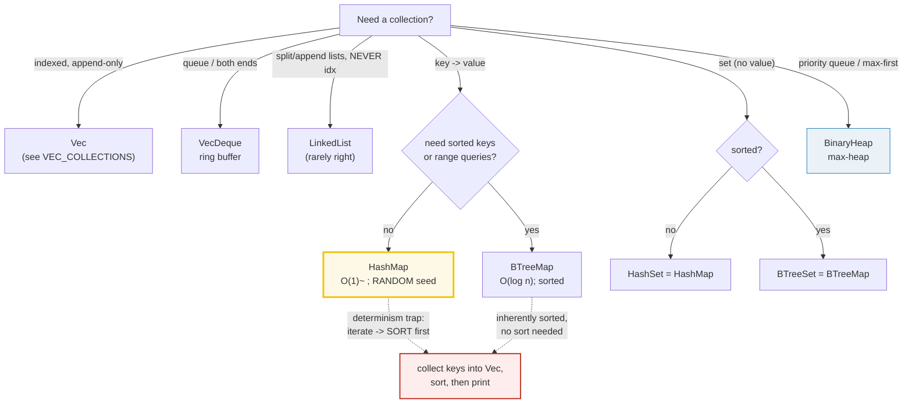

# COLLECTIONS — Choosing and Using `std::collections`

> **One-line goal:** Rust ships eight collection types — `Vec` (see VEC_COLLECTIONS),
> `VecDeque`, `LinkedList`, `HashMap`, `BTreeMap`, `HashSet`, `BTreeSet`, and
> `BinaryHeap`. This guide shows each in action and nails the one rule that bites
> every newcomer: **a `HashMap`/`HashSet` uses a RANDOM hash seed per run, so its
> iteration order is nondeterministic — you must sort keys before printing.**
>
> **Run:** `just run collections` (== `cargo run --bin collections`)
> **Member:** `core` (stdlib-only — no `[dependencies]`).
> **Prerequisites:** 🔗 [VEC_COLLECTIONS](./VEC_COLLECTIONS.md) (`Vec` is the most
> common collection); 🔗 [OWNERSHIP](./OWNERSHIP.md) (collections own their
> elements); 🔗 [STRINGS_STR](./STRINGS_STR.md) (string keys).
> **Ground truth:** [`collections.rs`](./collections.rs); captured stdout:
> [`collections_output.txt`](./collections_output.txt).

---

## Why this exists (lineage)

The standard library's own [`std::collections` overview][std-collections] opens
with a blunt verdict: *"To get this out of the way: you should probably just use
`Vec` or `HashMap`. These two collections cover most use cases... All the other
collections in the standard library have specific use cases where they are the
optimal choice, but these cases are borderline niche in comparison."* The eight
types fall into four families:

| Family | Types | When |
|---|---|---|
| **Sequences** | `Vec`, `VecDeque`, `LinkedList` | ordered by *index*; push/pop ends |
| **Maps** | `HashMap`, `BTreeMap` | key → value lookup |
| **Sets** | `HashSet`, `BTreeSet` | "have I seen this key?" (maps with a `()` value) |
| **Misc** | `BinaryHeap` | priority queue (max-heap) |

The expert question is never "which collection?" but "**which guarantees do I need
on order, lookup cost, and determinism?**" That third column — determinism — is
where Rust diverges from Go/Python and is the reason this file sorts every
`HashMap` key before it touches `stdout`.



---

## The cost table (from `std::collections`)

The library docs publish this operation-cost matrix ([std-collections][std-collections]).
`n` = the collection's size; `*` = amortized; `~` = expected (probabilistic).

| | `get(i)` | `insert(i)` | `remove(i)` | `range` | `append(m)` |
|---|---|---|---|---|---|
| **`Vec`** | O(1) | O(n−i)\* | O(n−i) | N/A | O(m)\* |
| **`VecDeque`** | O(1) | O(min(i, n−i))\* | O(min(i, n−i)) | N/A | O(m)\* |
| **`LinkedList`** | O(min(i, n−i)) | O(min(i, n−i)) | O(min(i, n−i)) | N/A | O(1) |
| **`HashMap`** | O(1)~ | O(1)~\* | O(1)~ | N/A | N/A |
| **`BTreeMap`** | O(log n) | O(log n) | O(log n) | O(log n) | O(n+m) |

> Sets cost the same as their map. The `~` on `HashMap` is the probabilistic
> caveat: hashing can, in theory, collide; the random SipHash seed makes an
> attacker-controlled collision flood (hash-DoS) infeasible — which is exactly
> why the seed is randomized and the iteration order is not stable.

---

## Section A — `HashMap`: O(1)~ lookup; **sort keys before printing**

```rust
use std::collections::HashMap;
let mut m: HashMap<&str, i32> = HashMap::new();
m.insert("b", 2);
m.insert("a", 1);
m.insert("c", 3);
m.get("a")          // -> Some(&1)
```

> **From collections.rs Section A:**
> ```
> ======================================================================
> SECTION A — HashMap: O(1)~ avg lookup; SORT keys before printing
> ======================================================================
>   let mut m: HashMap<&str,i32> = HashMap::new();
>   m.insert("b",2); m.insert("a",1); m.insert("c",3);
>   m.get("a") = Some(1)   m.len() = 3
>   keys collected into Vec, sorted = ["a", "b", "c"]
> [check] HashMap m.get("a") == Some(1): OK
> [check] HashMap len == 3 after three inserts: OK
> [check] HashMap sorted keys == ["a","b","c"] (we sorted; raw order varies): OK
> ```

**What.** Three inserts, then `get("a")` returns `Some(&1)` and `len()` is `3`.
The keys are collected into a `Vec`, **sorted**, then printed — never printed in
raw order.

**Why (internals).** `HashMap` is *"a hash map implemented with quadratic probing
and SIMD lookup"* ([std docs][std-collections]). `get`/`insert`/`remove` are
**O(1) expected** (`O(1)~`) — amortized across the rare resize (`*`). That is the
fastest general-purpose map Rust offers, and the default hasher is **SipHash 1-3**
chosen specifically for resistance to hash-flooding DoS attacks ([Reddit
corroboration][reddit-determinism], [DevGenius SipHash deep-dive][devgenius-siphash]).
The price of that DoS resistance is the **random per-process seed** covered in
Section C. 🔗 [ITERATORS](./ITERATORS.md) covers `.keys()`/`.values()`/`.iter()`.

---

## Section B — `BTreeMap`: B-tree; iteration is **already** sorted

```rust
use std::collections::BTreeMap;
let mut bt: BTreeMap<&str, i32> = BTreeMap::new();
bt.insert("charlie", 3);
bt.insert("alpha", 1);    // inserted 3rd...
bt.insert("bravo", 2);
bt.keys().next()          // -> Some(&"alpha")  ...yet yields first
```

> **From collections.rs Section B:**
> ```
> ======================================================================
> SECTION B — BTreeMap: B-tree; iteration is ALREADY sorted by key
> ======================================================================
>   bt.insert("charlie",3); bt.insert("alpha",1); bt.insert("bravo",2);
>   first key in iteration = Some("alpha")  (smallest, despite insert order)
>   full iteration (already sorted, no sort needed):
>     alpha -> 1
>     bravo -> 2
>     charlie -> 3
> [check] BTreeMap iterates sorted: first key == "alpha" even though inserted 3rd: OK
> ```

**What.** Even though `"alpha"` is inserted third, iterating yields it **first**
— keys come out in ascending order with no extra `sort` call.

**Why (internals).** `BTreeMap` is *"an ordered map based on a B-Tree"*: a
self-balancing tree where *"each node contains between B-1 and 2B-1 elements in
sorted order"* ([Faultlore BTree case study][faultlore-btree]). Because the keys
are physically stored in order, iteration is **deterministic for free** — which
is why Section C's fix is "use a `BTreeMap` if you need stable order" and not
"roll your own sort." The cost is **O(log n)** for `get`/`insert`/`remove`
(slower than `HashMap`'s O(1)~), but you gain **O(log n) range queries** and a
sorted view ([john-cd B-Trees how-to][john-cd-btree], [std BTreeMap docs][std-btreemap]).

---

## Section C — The determinism trap: `HashMap` order is NONDETERMINISTIC

This is the single most important rule in this guide and the reason this bundle
exists as a standalone concept.

> **From collections.rs Section C:**
> ```
> ======================================================================
> SECTION C — HashMap order is NONDETERMINISTIC (SipHash random seed)
> ======================================================================
>   built a HashMap of 4 entries; raw iteration order = (not printed: varies).
>   collecting keys into a Vec, then sorting them:
>     sorted keys = ["alpha", "bravo", "charlie", "delta"]
> [check] sorted HashMap keys are STABLE across runs: ["alpha","bravo","charlie","delta"]: OK
> ```

**What.** The same four entries produce a **different raw bucket order on every
process run**. This file deliberately does **not** print the raw order — instead
it collects keys into a `Vec`, sorts them, and prints the sorted result, which is
stable across runs.

**Why (internals).** `HashMap` (and `HashSet`) re-seed its **SipHash 1-3** hasher
with a fresh random seed **per process**, so the same inserts hash to different
buckets each run. This is an intentional security feature: a stable, predictable
order would let an attacker craft inputs that all collide into one bucket,
degrading `HashMap` to O(n²) — a [hash-DoS][rust-issue-36481] that is *"innocent-
looking code without the presence of an attacker"* can still trigger ([Rust issue
#36481][rust-issue-36481]). The community consensus is unambiguous: *"It's
intentionally not deterministic"* ([Reddit][reddit-determinism]); *"the SipHash
hash function used by default is designed to protect against a large class of
[attacks]"* ([the stable HashMap trap][morestina-trap]); *"I've observed that
HashMap has a different order of elements even with the same data on the next
program start"* ([Stack Overflow][so-stable-hashmap]).

**The fix (memorize this):**
```rust
let mut keys: Vec<&K> = map.keys().collect();
keys.sort_unstable();          // THEN print — never iterate a HashMap to stdout
```
Or, if you need stable order by design, reach for `BTreeMap` instead. The
[HOW_TO_RESEARCH determinism rule][howto] §4.2 rule 1 codifies this: *"Never range
a `HashMap` straight to stdout — collect keys into a `Vec`, sort, then print."*

---

## Section D — `HashSet` & `BTreeSet`: the set analogs (dedup)

```rust
use std::collections::{HashSet, BTreeSet};
let mut hs: HashSet<i32> = HashSet::new();
for x in [1, 1, 2, 2, 3] { hs.insert(x); }   // -> len 3
let bs: BTreeSet<i32> = [3, 1, 2].into_iter().collect();  // iter -> [1,2,3]
```

> **From collections.rs Section D:**
> ```
> ======================================================================
> SECTION D — HashSet & BTreeSet: the set analogs (dedup; BTreeSet sorted)
> ======================================================================
>   HashSet::insert([1,1,2,2,3]) -> len = 3  (dups dropped)
> [check] HashSet dedups: len == 3 from [1,1,2,2,3]: OK
>   BTreeSet::from([3,1,2]) -> iter = [1, 2, 3]  (sorted, no sort call)
> [check] BTreeSet iterates sorted: [1,2,3] from input [3,1,2]: OK
> ```

**What.** A set stores keys with no value. `HashSet::insert` silently rejects
duplicates (`[1,1,2,2,3]` → length `3`). `BTreeSet` is the sorted analog: its
iteration is `[1,2,3]` from input `[3,1,2]`, with no sort call.

**Why (internals).** A set is literally a map with a `()` value: *"HashSet is a
hash set implemented as a `HashMap` where the value is `()`"* ([std-collections][std-collections]).
So `HashSet` shares `HashMap`'s O(1)~ cost **and** its random-seed nondeterminism
(sort before printing here too); `BTreeSet` shares `BTreeMap`'s O(log n) cost and
free sorted iteration. Use the std docs' rule: *"Use the `Set` variant of any of
these `Map`s when... you just want to remember which keys you've seen."*

---

## Section E — `VecDeque`: a growable **ring buffer**; push/pop both ends

```rust
use std::collections::VecDeque;
let mut dq: VecDeque<i32> = VecDeque::new();
dq.push_front(1);
dq.push_back(2);
dq.pop_front()   // -> Some(1)
dq.pop_back()    // -> Some(2)
```

> **From collections.rs Section E:**
> ```
> ======================================================================
> SECTION E — VecDeque: growable RING BUFFER; push/pop both ends
> ======================================================================
>   push_front(1); push_back(2); -> front..back = [1, 2]
>   pop_front() = Some(1); pop_back() = Some(2); now empty = true
> [check] VecDeque pop_front returns the front-pushed value (1): OK
> [check] VecDeque pop_back returns the back-pushed value (2): OK
> [check] VecDeque is empty after popping both ends: OK
> ```

**What.** `push_front(1)` then `push_back(2)` gives a deque reading `[1, 2]`
front-to-back. `pop_front()` returns the front value (`1`); `pop_back()` returns
the back value (`2`); afterwards it is empty.

**Why (internals).** `VecDeque` is *"a double-ended queue implemented with a
growable ring buffer"* ([std-collections][std-collections]). A ring buffer is a
single contiguous allocation where the logical start wraps around the end, so
both `push_front` and `push_back` are **O(1) amortized** without the data shuffle
that `Vec::insert(0, x)` would cost. This is the right type for a **queue** or a
**double-ended queue** (use a `Vec` for a stack — `push`/`pop` on the end). Cost
table: `get` O(1), `insert` O(min(i, n−i))\*. 🔗 [VEC_COLLECTIONS](./VEC_COLLECTIONS.md)
contrasts `Vec` (cheap at the back only) with `VecDeque` (cheap at both ends).

---

## Section F — `LinkedList`: **rarely** the right choice

```rust
use std::collections::LinkedList;
let mut ll: LinkedList<i32> = LinkedList::new();
ll.push_back(1); ll.push_back(2); ll.push_front(0);
ll.front()   // -> Some(&0)
ll.back()    // -> Some(&2)
```

> **From collections.rs Section F:**
> ```
> ======================================================================
> SECTION F — LinkedList: rarely the right choice (cache-unfriendly, no idx)
> ======================================================================
>   push_back(1); push_back(2); push_front(0); -> front..back
>     front() = Some(0), back() = Some(2)
>   NOTE (std docs): "It is almost always better to use Vec or VecDeque
>     because array-based containers are faster, more efficient, and
>     make better use of CPU cache." LinkedList is cache-unfriendly
>     (node pointers chase), and has NO O(1) random access.
> [check] LinkedList: front==0 (push_front), back==2 (push_back): OK
> ```

**What.** `LinkedList` is a doubly-linked list with owned nodes; `push_front`/`push_back`
are O(1) and `front()`/`back()` peek the ends.

**Why you almost never want it.** The `std::collections::linked_list` module
leads with the warning: *"It is almost always better to use `Vec` or `VecDeque`
because array-based containers are faster, more efficient, and make better use of
CPU cache"* ([std LinkedList docs][std-linkedlist]). The reasons are concrete:

- **Cache-unfriendly.** Each node is a separate heap allocation; traversal chases
  pointers, defeating the CPU prefetcher. A contiguous `Vec`/`VecDeque` streams
  through cache.
- **No random access.** There is no `ll[i]` — indexing is O(min(i, n−i)). The
  cost table shows even `get` is O(min(i, n−i)), worse than `Vec`'s O(1).
- **Allocation per element.** Each `push` allocates a node; `Vec` amortizes one
  buffer.

The std docs' own "use a `LinkedList` when" list is telling: you want *"a `Vec` or
`VecDeque` of unknown size, and can't tolerate amortization"*, or *"to efficiently
split and append lists"*, or you are *"absolutely certain you really, truly, want
a doubly linked list."* That last clause is a joke with a warning attached. The
`[Learning Rust With Entirely Too Many Linked Lists][too-many-lists]` book exists
because implementing a linked list in safe Rust is famously hard — the borrow
checker fights node aliasing every step.

---

## Section G — The Entry API: atomic "insert if absent" (one lookup)

```rust
use std::collections::HashMap;
let mut counts: HashMap<&str, i32> = HashMap::new();
for k in ["a", "a", "b"] {
    *counts.entry(k).or_insert(0) += 1;   // one lookup, not two
}
// -> {"a": 2, "b": 1}
```

> **From collections.rs Section G:**
> ```
> ======================================================================
> SECTION G — Entry API: atomic upsert; avoids the double lookup
> ======================================================================
>   counts of ["a","a","b"] via entry().or_insert(0) += 1:
>     a -> 2
>     b -> 1
> [check] Entry API counts 'a' twice: OK
> [check] Entry API counts 'b' once: OK
> ```

**What.** Counting `["a","a","b"]` yields `a → 2`, `b → 1`. (Keys are sorted
before printing — `counts` is a `HashMap`.)

**Why (internals).** The Entry API is *"intended to provide an efficient mechanism
for manipulating the contents of a map conditionally on the presence of a key"*
([std-collections Entries section][std-collections]). The motivating case is the
accumulator/count pattern. The naive version does **two** lookups:

```rust
// ANTI-PATTERN: two hash lookups per element
if !counts.contains_key(&k) { counts.insert(k, 0); }
*counts.get_mut(&k).unwrap() += 1;
```

`map.entry(k)` does **one** lookup and yields an `Entry` enum — either
`Occupied` (key present, here's a `&mut` to its value) or `Vacant` (insert this
default, then here's the `&mut`). `or_insert(v)` collapses both arms into one
call: *"if the key is absent, insert `v`; either way return `&mut V`."* The result
is a single hash computation per element, and the `&mut V` lets you mutate the
value (here `+= 1`) in the same expression. This is the idiomatic Rust upsert.

---

## Section H — `BinaryHeap`: a **max-heap**; pop yields the largest first

```rust
use std::collections::BinaryHeap;
let mut heap: BinaryHeap<i32> = BinaryHeap::new();
heap.push(3); heap.push(1); heap.push(2);
heap.peek()           // -> Some(&3)   (max is the root)
// pop all -> [3, 2, 1]  (largest first)
```

> **From collections.rs Section H:**
> ```
> ======================================================================
> SECTION H — BinaryHeap: MAX-heap; pop yields the largest first
> ======================================================================
>   push(3); push(1); push(2);  peek() = Some(3)  (root = max)
>   pop sequence = [3, 2, 1]  (largest-first: a max-heap)
> [check] BinaryHeap peek == 3 (max-heap root): OK
> [check] BinaryHeap pops largest-first: [3,2,1]: OK
> ```

**What.** After `push(3), push(1), push(2)`, `peek()` returns `Some(&3)` (the
maximum), and repeatedly `pop()`-ping yields `[3, 2, 1]` — **largest first**.

**Why (internals).** `BinaryHeap` is *"a priority queue implemented with a binary
heap"* ([std-collections][std-collections]). It is a **max-heap**: the largest
element (by `Ord`) sits at the root, so `peek`/`pop` are O(1)/O(log n). It is the
right type when *"you want to store a bunch of elements, but only ever want to
process the 'biggest' or 'most important' one at any given time"* — i.e. a
priority queue. There is no `MinHeap` alias; for a min-heap, wrap your type in
`std::cmp::Reverse` (or `Reverse(T)`) so `Ord` flips. `push` is O(log n); iterating
a `BinaryHeap` is **not** fully sorted (only the heap property holds, not total
order), so if you need a sorted sequence, drain it via `pop` as shown.

---

## Pitfalls (the expert payoff)

| Trap | Symptom | Fix / why |
|---|---|---|
| **Printing a `HashMap`/`HashSet` in raw order** | `_output.txt`/snapshot tests differ on every run | Collect keys into a `Vec`, `sort_unstable()`, then print. Or use `BTreeMap`/`BTreeSet` (free sorted order). The SipHash seed is random per process — by design. |
| **Expecting `HashMap` order to match insertion order** | "Python `dict` keeps insertion order; why doesn't Rust?" | Rust's `HashMap` is hash-table-based with a random seed, not an ordered map. Use `BTreeMap` (sorted) or an external `IndexMap` crate (insertion order). |
| **`Vec::insert(0, x)` in a loop** | O(n²) — every insert shifts the whole array | Use `VecDeque` (O(1) amortized at both ends) or push at the back and iterate in reverse. |
| **Reaching for `LinkedList`** | slow, cache-hostile, no indexing, allocation per node | std docs: "almost always better to use `Vec` or `VecDeque`." Only genuine use: O(1) split/append of unknown-size lists. |
| **Double-lookup upsert** (`contains_key` then `insert`) | two hash computations per element, clippy/`entry` pattern missed | Use `map.entry(k).or_insert(v)` — one lookup, returns `&mut V`. |
| **Treating `BinaryHeap` iteration as sorted** | items come out in heap order, not fully sorted | Only `pop` (repeatedly) yields a sorted sequence. A plain `for x in &heap` is NOT sorted. |
| **Wanting a min-heap** | `BinaryHeap` is max-only; smallest element never surfaces | Wrap values in `std::cmp::Reverse(v)` — `Reverse`'s `Ord` flips the order. |
| **Complex keys + `insert`** | "I re-inserted the key, why didn't the *key* update?" | `insert` updates the **value**, keeping the **original key**. The key is never replaced (see the std "Insert and complex keys" example). Use Entry or remove-then-insert. |
| **Forgetting `BTreeMap` needs `Ord` keys** | `BTreeMap<MyType, _>` fails to compile (`Ord` not satisfied) | `HashMap` needs `Hash + Eq`; `BTreeMap` needs `Ord` (total order). Derive what you need. |
| **`HashMap::new` in a `static`** | "can't construct with random seed at const time" | Wrap in `LazyLock`/`OnceLock`, or use a fixed-seed `BuildHasherDefault<DefaultHasher>` when you accept the DoS trade-off. |

---

## Cheat sheet

```rust
use std::collections::{BTreeMap, BTreeSet, BinaryHeap, HashMap, HashSet, LinkedList, VecDeque};

// HashMap — O(1)~ lookup; RANDOM seed -> sort keys before printing.
let mut m: HashMap<&str, i32> = HashMap::new();
m.insert("a", 1);
m.get("a");                          // -> Some(&1)
let mut keys: Vec<&str> = m.keys().collect(); keys.sort_unstable();  // THEN print

// BTreeMap — O(log n); iteration ALREADY sorted (deterministic, no sort).
let bt: BTreeMap<&str, i32> = BTreeMap::new();
bt.keys().next();                    // -> smallest key

// HashSet / BTreeSet — maps with V = (); dedup; HashSet needs sorting too.
let hs: HashSet<i32> = [1,1,2].into_iter().collect();   // len 2
let bs: BTreeSet<i32> = [3,1,2].into_iter().collect();  // iter [1,2,3]

// VecDeque — ring buffer; O(1)* at BOTH ends. Use for queues/deques.
let mut dq: VecDeque<i32> = VecDeque::new();
dq.push_front(1); dq.push_back(2);
dq.pop_front();                      // -> Some(1)
dq.pop_back();                       // -> Some(2)

// LinkedList — RARELY right (cache-unfriendly, no idx). Prefer Vec/VecDeque.
let mut ll: LinkedList<i32> = LinkedList::new();
ll.push_front(0); ll.push_back(2);

// Entry API — ONE-lookup upsert (the accumulator/count pattern).
let mut counts: HashMap<&str, i32> = HashMap::new();
for k in ["a","a","b"] { *counts.entry(k).or_insert(0) += 1; }  // a=2, b=1

// BinaryHeap — MAX-heap; peek/pop the largest; push O(log n).
let mut h: BinaryHeap<i32> = BinaryHeap::new();
h.push(3); h.push(1); h.push(2);
h.peek();                            // -> Some(&3)
// while let Some(v) = h.pop() { ... }  // yields 3,2,1

// CHOOSING: Vec (default) | VecDeque (queue/both ends) | HashMap (fast map)
//           | BTreeMap (sorted/range) | BinaryHeap (priority queue, max-first)
//           | Sets = the Map with V=() | LinkedList (almost never).
```

---

## Sources

Every claim above was web-verified in at least two authoritative places.

- **`std::collections` module overview** — the four families, the operation-cost
  table (Vec/VecDeque/LinkedList/HashMap/BTreeMap), the "when to use which
  collection" guidance, the Entries section (`entry().or_insert` rationale:
  "avoids duplicating the search effort"), and the "Insert and complex keys"
  note (key is never replaced):
  https://doc.rust-lang.org/std/collections/index.html
- **`std::collections::HashMap`** — "quadratic probing and SIMD lookup",
  `LazyLock` note for const/static with random seed:
  https://doc.rust-lang.org/std/collections/struct.HashMap.html
- **`std::collections::BTreeMap`** — "an ordered map based on a B-Tree", sorted
  iteration, O(log n) range queries:
  https://doc.rust-lang.org/std/collections/struct.BTreeMap.html
- **`std::collections::LinkedList`** — "It is almost always better to use Vec or
  VecDeque because array-based containers are faster, more efficient, and make
  better use of CPU cache":
  https://doc.rust-lang.org/std/collections/struct.LinkedList.html
- **Hashing algorithms for HashMap in Rust (DevGenius)** — confirms SipHash 1-3
  is the default hasher, chosen for hash-DoS resistance (independent corroboration
  of the random-seed mechanism):
  https://blog.devgenius.io/hashing-algorithms-for-hashmap-in-rust-a-deep-dive-into-performance-and-security-3ae181798bb9
- **"The stable HashMap trap" (More Stina Blog)** — "the SipHash hash function
  used by default is designed to protect against a large class of [attacks]";
  warns against relying on HashMap iteration order:
  https://morestina.net/1843/the-stable-hashmap-trap
- **Reddit r/rust "Determinism, rust, hashmaps..."** — "It's intentionally not
  deterministic" (community corroboration of the per-run random seed):
  https://www.reddit.com/r/rust/comments/muzezw/determinism_rust_hashmaps_and_cryptographic_hash/
- **Rust issue #36481 — "Exposure of HashMap iteration order allows O(n²) blowup"**
  — why the random seed exists: even innocent code can degrade without an attacker:
  https://github.com/rust-lang/rust/issues/36481
- **Stack Overflow — "HashMap implementations with consistent ordering"** — "I've
  observed that HashMap has a different order of elements even with the same data
  on the next program start" (user-corroborated nondeterminism):
  https://stackoverflow.com/questions/45894401/
- **Faultlore — "Rust Collections Case Study: BTreeMap"** — "each node contains
  between B-1 and 2B-1 elements in sorted order" (the B-tree invariant):
  https://faultlore.com/blah/rust-btree-case/
- **The Rust How-to Book — B-Trees (john-cd)** — "Iterating over a BTreeMap will
  always yield the key-value pairs in ascending order of the keys":
  https://john-cd.com/rust_howto/categories/data-structures/b-trees.html
- **Learning Rust With Entirely Too Many Linked Lists** — why linked lists are
  awkward in safe Rust (the borrow-checker-vs-aliasing struggle):
  https://rust-unofficial.github.io/too-many-lists/
- **HOW_TO_RESEARCH.md §4.2 rule 1 (DETERMINISM)** — the workspace rule this
  bundle enforces: "Never range a `HashMap` straight to stdout":
  ./HOW_TO_RESEARCH.md
