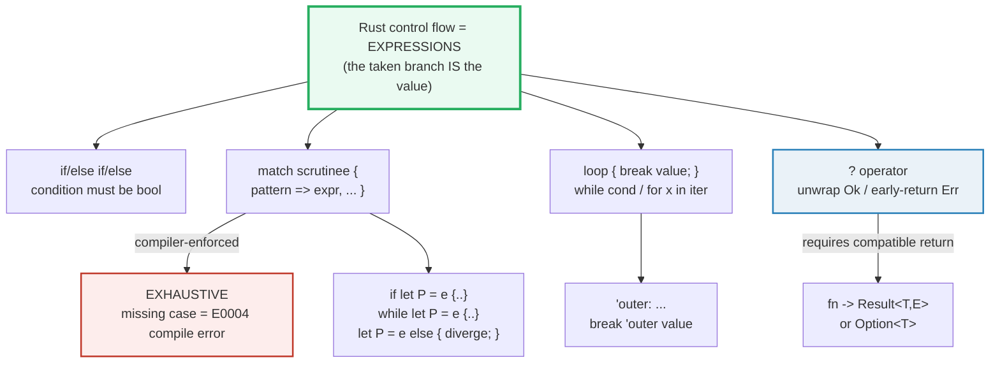
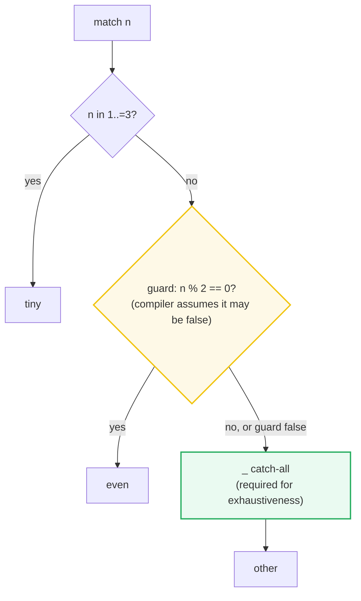

# CONTROL_FLOW — Expressions, Exhaustive `match`, and `?`

> **One-line goal:** Rust's control-flow constructs are **expressions** (they
> *yield a value*), `match` is **exhaustive** (every case must be covered or it
> won't compile), and `?` / `let else` / `loop { break v }` are all just
> early-return shapes built on the same expression model.
>
> **Run:** `just run control_flow` (== `cargo run --bin control_flow`)
> **Member:** `core` (stdlib-only — no `[dependencies]`).
> **Prerequisites:** [OWNERSHIP](./OWNERSHIP.md) (why `match`/`?` moving values
> matters) — otherwise none; this is **Phase 1**.
> **Ground truth:** [`control_flow.rs`](./control_flow.rs); captured stdout:
> [`control_flow_output.txt`](./control_flow_output.txt).

---

## Why this exists (lineage)

In C/C++/Java, `if` and `switch` are **statements** — they branch and run code
but produce no value, so you declare a mutable target above them and assign
inside each arm. In Rust, `if`, `match`, and `loop` are **expressions**: the
taken branch *is* the value. That single design choice is why Rust has no
ternary (`c ? a : b` is just `if c { a } else { b }`), why `match` can feed a
`let`, and why a `loop` can return a value through `break`. It is also why the
compiler can enforce **exhaustiveness** — every arm has a type, so it can prove
the whole `match` produces a value for *every* possible input.

| Construct | Other languages | Rust |
|---|---|---|
| `if c { a } else { b }` | statement; needs a ternary for a value | **expression** — yields the taken arm's value |
| `switch (x)` | fall-through; a missing case silently does nothing | `match` — **must** cover every case (else `E0004`); no fall-through |
| `for (int i=0; i<n; i++)` | index-based, manual bounds | `for x in iter` — driven by the `IntoIterator` trait; **cannot** run off the end |
| error from a callee | exceptions (or ignored return codes) | `?` — **early-return** the `Err`, type-checked against the fn's return |
| "find and bail out of nested loops" | a flag, or `goto` | `'label: loop { break 'label v; }` — a labeled break returns a *value* |



The two pillars to internalize: **expressions yield values**, and **`match` is
exhaustive**. Everything else (`if let`, `let else`, `?`, `loop`/`break value`)
is sugar or an early-return shape layered on those two ideas.

---

## Section A — `if` is an EXPRESSION; the condition must be `bool`

```rust
let x: i32 = if true { 10 } else { 20 };   // x == 10  (the taken arm's value)
```

> **From control_flow.rs Section A:**
> ```
> ======================================================================
> SECTION A — if is an EXPRESSION (yields a value); condition must be bool
> ======================================================================
>   let x: i32 = if true  {10} else {20};  -> x = 10
>   let y: i32 = if false {10} else {20};  -> y = 20
> [check] if-expression yields the TAKEN arm: if true {10} else {20} == 10: OK
> [check] if-expression yields the ELSE arm when cond is false: == 20: OK
>   n = 6; else-if chain -> bucket = "div3"
> [check] else-if chain: first TRUE arm wins (6 -> div3, not div2): OK
>   number = 3; `if number != 0` (explicit bool) -> taken
> [check] conditions require an explicit bool (no int truthiness): number != 0: OK
> ```

**What.** `if cond { a } else { b }` evaluates `cond`; the value of whichever
arm runs becomes the value of the whole `if`. Both arms MUST have the **same
type**. An `else if` chain scans top-down and the **first true arm wins** — `6`
is divisible by both 3 and 2, yet the output is `"div3"` because that arm is
checked first (Book ch3.5).

**Why (internals).** Because `if` is an expression, the compiler must know the
type of `x` at compile time *regardless of which arm runs*. If the arms had
different types (`{ 5 }` vs `{ "six" }`) the variable would have two possible
types depending on runtime input — which Rust forbids. That is the whole reason
both arms must agree: it makes the type of `x` statically determinable.

**The bool requirement (no truthiness).** Unlike Ruby/JS/C, Rust will **not**
coerce a number to a bool. `if number { ... }` (with `number: i32`) is a
**compile error `E0308`**, not a runtime falseness:

```console
error[E0308]: mismatched types
 --> src/main.rs:4:8
  |
4 |     if number {
  |        ^^^^^^ expected `bool`, found integer
  |
  = note: expected type `bool`
             found type `{integer}`
help: consider converting the expression to a bool
  |
4 |     if number != 0 {
  |            ++++++
```

> **`E0308`** is the "mismatched types" signature you will see constantly. The
> fix is always to write an explicit boolean — `number != 0`, `!vec.is_empty()`,
> `opt.is_some()`. The Book: "the condition ... *must* be a `bool`... Rust will
> not automatically try to convert non-Boolean types to a Boolean"
> ([ch3.5][book-cf]).

> **Expression gotcha.** When you use `if` as a **statement** (not in a `let`),
> it is legal to omit the `else`; the `if` then evaluates to `()`. But the
> moment you write `let x = if c { 5 } else { 6 };` the `else` becomes
> **mandatory** — otherwise `x` would be unbound when `c` is false.

---

## Section B — `match` is EXHAUSTIVE: every case must be covered

```rust
fn light_action(l: Light) -> &'static str {
    match l {
        Light::Red    => "stop",
        Light::Yellow => "prepare to stop",
        Light::Green  => "go",
    }                                  // no `_` — all variants named
}
```

> **From control_flow.rs Section B:**
> ```
> ======================================================================
> SECTION B — match is EXHAUSTIVE: every case must be covered (else E0004)
> ======================================================================
>   light_action(Red/Yellow/Green) = ["stop", "prepare to stop", "go"]
> [check] exhaustive match on enum: all 3 variants named, no `_` arm needed: OK
>   roll = 7; match {3, 7, _} -> outcome = "remove hat"
> [check] u8 match with `_` catch-all: 7 -> "remove hat": OK
>   roll = 42; same match -> outcome = "move"
> [check] u8 match with `_` catch-all: 42 -> "move" (the _ arm): OK
> ```

**What.** A `match` compares a **scrutinee** against a list of `pattern => expr`
**arms**, top-down; the **first** matching arm wins. There are two ways to be
exhaustive:
1. **Name every variant** of an enum (`Red`/`Yellow`/`Green`) — no `_` needed.
2. **Add a `_` catch-all** when the type is too wide to enumerate (a `u8` has
   256 values, so `{ 3, 7, _ }` is the practical form).

**Why (internals).** Because `match` is an expression yielding a value, the
compiler must guarantee a value is produced for *every* possible input. If even
one value is uncovered, the `match` has no well-defined result for it — so the
compiler refuses to compile. This is the "coin-sorting machine" the Book
describes ([ch6.2][book-match]): every value must fall through exactly one hole.

**The compile error (a missing case) is `E0004`:**

```console
error[E0004]: non-exhaustive patterns: `None` not covered
 --> src/main.rs:3:15
  |
3 |         match x {
  |               ^ pattern `None` not covered
  |
  = note: the matched value is of type `Option<i32>`
help: ensure that all possible cases are being handled by adding a match arm
      with a wildcard pattern or an explicit pattern as shown
  |
4 ~             Some(i) => Some(i + 1),
5 ~             None => todo!(),
  |
```

> **`E0004`** is *the* exhaustiveness signature. The error names the **exact
> uncovered pattern** (`None` not covered) and offers a fix. This is why adding
> a variant to an enum and recompiling points you at every `match` you forgot to
> update — the compiler is a refactoring assistant, not just a checker.

**`_` vs a named binding (`other`).** `_` matches anything and **discards** it
(no binding, no "unused variable" warning). Writing `other => ...` instead also
catches everything but **binds** the value, letting you use it in the arm. The
Book's rule: put the catch-all **last**, because arms after it can never run and
the compiler will warn they are unreachable ([ch6.2][book-match]).

---

## Section C — Match guards, ranges, and or-patterns

```rust
match n {
    1..=3               => "tiny",          // inclusive range pattern
    'a' | 'e' | 'i' | 'o' | 'u' => "vowel", // or-pattern
    x if x % 2 == 0     => "even",          // guard: extra boolean test
    _                   => "other",
}
```

> **From control_flow.rs Section C:**
> ```
> ======================================================================
> SECTION C — match guards, ranges (1..=3), and or-patterns (a|e|i|o|u)
> ======================================================================
>   classify(2) = "tiny (range 1..=3)"   (2 is in 1..=3 -> first arm wins)
>   classify(4) = "even (guard x % 2 == 0)"   (4 not in range; 4 % 2 == 0 -> guarded arm)
>   classify(9) = "other"   (9 not in range; 9 odd -> `_` arm)
> [check] range arm wins first: classify(2) == "tiny (range 1..=3)": OK
> [check] guard arm matches when range did not: classify(4) == even: OK
> [check] unmatched value falls through to `_`: classify(9) == other: OK
>   classify_char('e') = "vowel";  classify_char('k') = "consonant or other"
> [check] or-pattern: 'e' is a vowel: OK
> [check] or-pattern: 'k' falls to `_`: OK
> ```

**What.** Three pattern features that make `match` scale beyond single literals:
- **Range patterns** `1..=3` — match any value in an inclusive interval
  (char and integer types only).
- **Or-patterns** `a | b | c` — one arm matches several patterns.
- **Guards** `pattern if cond` — an extra boolean clause; the arm matches only
  if *both* the pattern fits **and** `cond` is true.

**Why (internals) — guards break exhaustiveness proofs.** This is the expert
trap: the compiler **cannot** prove a guarded arm always fires, because the
guard is an arbitrary runtime boolean. So for exhaustiveness purposes **a
guarded arm is treated as potentially never matching**. Concretely,
`match n { x if x > 0 => "+", x if x <= 0 => "-" }` *looks* exhaustive but
still requires a `_` arm — the compiler will not reason about the relationship
between the two guards. That is why `classify` keeps a `_` arm even though every
integer is either "in 1..=3", "even", or neither: the guarded even-arm is not
trusted to cover its pattern set.



> **First-match-wins with ranges.** `classify(2)` returns `"tiny"` even though
> `2` is also even — the `1..=3` arm appears first, so it wins. Reorder arms to
> change precedence, but always keep the most specific above the most general.

---

## Section D — `if let` and `while let`: single-pattern sugar

```rust
if let Some(v) = opt { /* v bound here */ } else { /* miss */ }

let mut drained = Vec::new();
while let Some(top) = stack.pop() { drained.push(top); }  // stops at None
```

> **From control_flow.rs Section D:**
> ```
> ======================================================================
> SECTION D — if let / while let: sugar for a match that cares about ONE pattern
> ======================================================================
>   if let Some(v) = Some(42) -> v = 42
> [check] if let binds the inner value on a match: v == 42: OK
> [check] if let runs the else block when the pattern does NOT match: OK
>   vec![10,20,30] drained by `while let Some(top) = stack.pop()`:
>     drained (pop order) = [30, 20, 10];  stack.is_empty() = true
> [check] while let drains a Vec via pop(): order is [30, 20, 10] (LIFO): OK
> [check] while let stops when pop() returns None: stack now empty: OK
> ```

**What.**
- `if let P = expr { a } else { b }` runs `a` (binding any variables in `P`)
  when the value matches `P`, else `b`. It is **syntax sugar** for a `match`
  with one real arm and a `_ => b` arm.
- `while let P = expr { body }` re-evaluates `expr` each iteration; when `P`
  stops matching, the loop ends. The canonical use is draining a `Vec` via
  `pop()`, which yields `Some` until empty then `None`.

**Why (internals) — the desugaring.** The Rust Reference pins the exact
lowering of `while let` ([§expr.loop.while.let][ref-loop]):

```rust
'label: while let PATS = EXPR { /* body */ }
//  ─────────────────────────────────────────  is equivalent to:
'label: loop {
    match EXPR {
        PATS => { /* body */ }
        _    => break,
    }
}
```

So `while let Some(top) = stack.pop()` is literally a `loop` that `break`s the
instant `pop()` returns `None`. That is why the drained order is `[30, 20, 10]`
(LIFO — `pop` takes from the back).

**The trade vs `match`.** `if let` is concise but **you lose the exhaustive
check**: forgetting the `None` case is silently allowed (the `else` is
optional). When a missed case would be a bug, prefer `match` and let the
compiler force you to handle every variant (Book ch6.3: "you lose the
exhaustive checking `match` enforces" [ch6.3][book-iflet]).

---

## Section E — `let ... else`: refutable binding with a DIVERGENT else

```rust
let Some(c) = s.chars().next() else { return Err("empty".into()); };
//   ^ binds in OUTER scope                      ^ must diverge (return/break/...)
```

> **From control_flow.rs Section E:**
> ```
> ======================================================================
> SECTION E — let ... else: refutable binding with a DIVERGENT else branch
> ======================================================================
>   parse_decimal("7")  = Ok(7)    (happy path binds c, then d)
>   parse_decimal("")   = Err("empty input")   (no first char -> else returns)
>   parse_decimal("x")  = Err("not a decimal digit: 'x'")    (char not a digit -> else returns)
> [check] let-else happy path: parse_decimal("7") == Ok(7): OK
> [check] let-else diverges on miss: parse_decimal("") == Err("empty input"): OK
> [check] let-else diverges on miss: parse_decimal("x") == Err("not a decimal digit: 'x'"): OK
> ```

**What.** `let P = expr else { diverge };` tries to bind `expr` against `P`. On
a match, the bindings live in the **surrounding scope** and execution continues
flat ("happy path"). On a miss, the `else` block runs — and it **must diverge**
(`return`, `break`, `continue`, `panic!`, or an infinite `loop {}`); it cannot
just "fall through". The example binds `c` then `d` across two `let else`
statements, and the body stays linear instead of nesting in two `if let`s.

**Why (internals).** This is the "refutable `let`" the Book reaches for when the
alternative — `if let` + early `return` nested inside — pushes the real work
into a deep indent. The RFC's motivation: "`let else` simplifies some very
common error-handling patterns. It is the natural counterpart to `if let`, just
as `else` is to regular `if`" ([RFC 3137][rfc-let-else]). Stabilized in
**Rust 1.65** (Nov 2022) ([release notes][rust-165]).

> **Why the `else` MUST diverge.** If it could fall through, the bindings from
> `P` would be usable despite the pattern having *failed* — an unsoundness. By
> forcing divergence (`!`, the never type), the compiler knows that after the
> `let else` line the match definitely succeeded, so `c` and `d` are
> provably-initialized. This is the same trick `?` uses.

> **`let else` vs `?`.** They solve the same "unwrap-or-bail" problem.
> `?` only works on `Result`/`Option` and *converts* the error via `From`;
> `let else` works on **any refutable pattern** (e.g. destructuring an enum
> variant, or a struct) and lets you write an arbitrary diverging block. Use
> `?` for plain error propagation; reach for `let else` when the bail is a
> pattern miss, not just an `Err`.

---

## Section F — The `?` operator: early-return `Err` (or `None`) up the stack

```rust
fn run_pipeline(s: &str) -> Result<u32, PipeErr> {
    let c = first_char(s)?;       // ? : on Err, `return Err(...)` immediately
    let d = digit_value(c)?;      // ? again
    let scaled = scale(d)?;       // ? again
    Ok(scaled + 1)
}
```

> **From control_flow.rs Section F:**
> ```
> ======================================================================
> SECTION F — the ? operator: early-return Err up the stack (and None for Option)
> ======================================================================
>   run_pipeline("3") = Ok(31)   (3 -> 3 -> scale=30 -> 31)
>   run_pipeline("")  = Err(Empty)
>   run_pipeline("x") = Err(NotDigit('x'))
>   run_pipeline("9") = Err(TooLarge(9))   (9 -> 9 -> scale errs TooLarge)
> [check] ? success path: run_pipeline("3") == Ok(31): OK
> [check] ? propagates the FIRST Err: run_pipeline("") == Err(Empty): OK
> [check] ? propagates the SECOND Err: run_pipeline("x") == Err(NotDigit('x')): OK
> [check] ? propagates the THIRD Err: run_pipeline("9") == Err(TooLarge(9)): OK
>   first_decimal_value("7abc") = Some(7);  ("") = None;  ("abc") = None
> [check] ? on Option: first_decimal_value("7abc") == Some(7): OK
> [check] ? on Option: first_decimal_value("") == None: OK
> [check] ? on Option: first_decimal_value("abc") == None ('a' not a digit): OK
> ```

**What.** `expr?` unwraps an `Ok`/`Some` in place; on `Err(e)`/`None` it does an
immediate `return` of that value out of the **whole function**. The four checks
trace all four paths of `run_pipeline`: the success path (`Ok(31)`) and the
three different `Err`s, each propagating from a *different* `?` — `Empty` from
the first, `NotDigit('x')` from the second, `TooLarge(9)` from the third. The
first error to occur wins; later `?`s never run.

**Why (internals).**
- **`?` is `match`-shaped.** Per the Book, `x?` behaves like
  `match x { Ok(v) => v, Err(e) => return Err(From::from(e)) }`
  ([ch9.2][book-result]). The `From::from` is the subtle part: `?` converts the
  inner error to the function's declared error type via the `From` trait, so a
  fn returning `Result<_, MyError>` can use `?` on any `io::Error` as long as
  `impl From<io::Error> for MyError` exists. In this bundle all errors are
  already `PipeErr`, so no conversion is visible — but the machinery is there.
- **It works on `Option` too** — but ONLY inside an `Option`-returning fn.
  `first_decimal_value` uses `?` on `text.chars().next()` (an `Option`), and on
  `None` it early-returns `None`. You **cannot** mix: `?` on a `Result` inside
  an `Option`-returning fn (or the reverse) is a type error — convert
  explicitly with `.ok()` / `.ok_or(...)` first.

**The compile error (`?` in a `()`-returning fn) is `E0277`:**

```console
error[E0277]: the `?` operator can only be used in a function that returns
              `Result` or `Option` (or another type that implements `FromResidual`)
 --> src/main.rs:4:48
  |
3 | fn main() {
  | --------- this function should return `Result` or `Option` to accept `?`
4 |     let greeting_file = File::open("hello.txt")?;
  |                                                ^ cannot use the `?` operator
  |                                                  in a function that returns `()`
  |
help: consider adding return type
  |
3 ~ fn main() -> Result<(), Box<dyn std::error::Error>> {
4 |     let greeting_file = File::open("hello.txt")?;
5 +     Ok(())
  |
```

> **`E0277`** is the "`?` in the wrong place" signature. The fix is either to
> change the fn's return type to a compatible `Result`/`Option`, or to handle
> the `Result` explicitly with `match`/`unwrap_or`/etc. instead of `?`. Note
> `main` itself may return `Result<(), E>` (Book ch9.2) — that is why the
> suggestion above works.

```mermaid
flowchart TD
    Call["caller calls run_pipeline(\"9\")"] --> R1["first_char(\"9\")"]
    R1 -->|Ok('9')| R2["digit_value('9')"]
    R2 -->|Ok(9)| R3["scale(9)"]
    R3 -->|Err TooLarge(9)| Q3["scale(d)?"]
    Q3 -->|"? = early return Err(...)"| Caller["caller receives Err(TooLarge(9))"]
    Q3 -.->|"From::from converts E<br/>(here a no-op: already PipeErr)"| Caller
    style Q3 fill:#fdedec,stroke:#c0392b,stroke-width:3px
    style Caller fill:#eaf2f8,stroke:#2980b9,stroke-width:2px
```

---

## Section G — `loop { break v }` yields a value; labels; `while`; `for` + `IntoIterator`

```rust
let first_fib_over_ten: u32 = loop { if b > 10 { break b; } /* ... */ };  // == 13

'outer: for row in &matrix {
    for &v in row { if v == target { break 'outer; } }   // break the OUTER loop
}

let found: Option<(usize, usize)> = 'search: {            // labeled BLOCK
    for (r, row) in grid.iter().enumerate() {
        for (c, &v) in row.iter().enumerate() {
            if v == want { break 'search Some((r, c)); }  // break with a VALUE
        }
    }
    None
};
```

> **From control_flow.rs Section G:**
> ```
> ======================================================================
> SECTION G — loop { break v } yields a value; labels; while; for + IntoIterator
> ======================================================================
>   first Fibonacci > 10 = 13  (loop { break b; })
> [check] loop with break value: first Fibonacci > 10 is 13: OK
>   matrix [[1, 2], [3, 4]]; target 4; cells visited before hit = 3
> [check] labeled for + break 'outer: 3 cells visited before finding 4: OK
>   grid search for 5 -> found = Some((1, 2))  (break 'search value)
> [check] labeled block + break 'label value: 5 found at (row 1, col 2): OK
>   countdown from 3 via `while` -> ticks = 3
> [check] while loop: 3 iterations for a countdown from 3: OK
>   sum of even n in 1..=6 (skipping odds via continue) = 12
> [check] for + continue: 2+4+6 == 12: OK
>   for w in Vec<String> (IntoIterator) -> total chars = 7
> [check] for consumes a Vec via IntoIterator: 4 + 3 == 7 chars: OK
> ```

**What.** Four loop shapes, each with a sharp distinguishing feature:

| Loop | Terminates when... | Yields a value? | `break`/`continue` |
|---|---|---|---|
| `loop { }` | a `break` runs | **yes** — `break v` sets the value | yes (unlabeled + labeled) |
| `while cond { }` | `cond` is false | no (always `()`) | yes |
| `for x in iter { }` | the iterator is empty | no (always `()`) | yes |
| `'blk: { }` (labeled block) | the block ends (runs **once**) | **yes** — `break 'blk v` | only `break 'blk v` |

**Why (internals).**
- **`loop` with `break value`** is the only loop that evaluates to a non-trivial
  value. The Reference fixes the type: "The type of a `loop` with associated
  `break` expressions is the [least upper bound] of all of the break operands"
  ([§expr.loop.break-value][ref-loop]). A `loop` with **no** `break` diverges
  and has type `!` (never) — that is why `loop {}` can satisfy *any* return
  type, including `-> !`.
- **Labels (`'name:`)** prefix any loop (or block). `break 'name` / `continue
  'name` target that specific loop instead of the innermost one. This is how you
  bail out of **nested** loops without a flag variable. The `matrix` scan counts
  exactly 3 cells before `break 'outer` fires, proving the outer loop was the
  one exited.
- **Labeled blocks** (`'search: { ... }`) run once but allow
  `break 'search value` to return a value from the middle — a zero-cost
  "early-exit expression." The grid search uses it to return `Some((1,2))` the
  moment the target is found, with `None` as the fall-through. (Reference
  §expr.loop.block-labels [ref-loop].)
- **`while cond`** is sugar for `loop { if !cond { break; } body }` and always
  evaluates to `()` — it cannot yield a value via `break` ([ref-loop]).
- **`for x in iter`** is driven by the `IntoIterator` trait. The Reference's
  exact desugaring ([§expr.loop.for][ref-loop]) calls
  `IntoIterator::into_iter(iter_expr)` then loops on `Iterator::next`, breaking
  on `None`. That is why `for` can consume a `Vec` by value (yielding owned
  elements) or borrow it (`for x in &vec` yields `&T`): it depends on which
  `IntoIterator` impl the scrutinee type resolves to. 🔗 [ITERATORS](./ITERATORS.md).
- **`continue`** skips the rest of the *current* iteration and jumps to the loop
  head; `continue 'label` does so for the labeled loop. The even-sum example
  skips odd `n` and so totals `2+4+6 == 12`.

> **`break` vs `return`.** `break` exits the current (or labeled) loop;
> `return` exits the current **function**. Inside a `loop` that lives in a
> function, `return` wins — it leaves the function entirely, not just the loop.

---

## Pitfalls (the expert payoff)

| Trap | Symptom | Fix / why |
|---|---|---|
| **`if number { }` (non-bool condition)** | `error[E0308]: mismatched types ... expected bool, found integer` | Write an explicit boolean: `if number != 0`, `if !v.is_empty()`. Rust has no int truthiness. |
| **Missing `match` arm** | `error[E0004]: non-exhaustive patterns: \`X\` not covered` | Add the missing variant, or a `_` catch-all **last**. The error names the exact uncovered case. |
| **Arms after a `_` catch-all** | `warning: unreachable pattern` | `_` matches everything; later arms can never run. Put `_` last (or remove the dead arms). |
| **`match` arms of different types** | `error[E0308]: \`if\` and \`else\` have incompatible types` / "match arms have incompatible types" | Every arm must yield the **same** type (the `match` is one expression). |
| **Trusting a guard for exhaustiveness** | `E0004` even though your guard "covers" the rest | The compiler treats guarded arms as possibly-never-matching. Always provide a real `_` (or full coverage) alongside guards. |
| **`if let` silently ignoring `None`** | a bug because the miss case does nothing | `if let`'s `else` is optional and unchecked. If a miss is a bug, use `match` (exhaustive) or `let else` (forced divergence). |
| **`?` in a `()`-returning fn** | `error[E0277]: the \`?\` operator can only be used in a function that returns Result or Option` | Change the fn's return type to `Result<_, E>`/`Option<_>`, or handle the `Result` with `match`/`unwrap_or` instead of `?`. |
| **Mixing `?` on `Result` and `Option`** | type error: `?` won't auto-convert Result↔Option | Convert explicitly: `.ok()` (Result→Option), `.ok_or(e)` (Option→Result). `?` only propagates within the same family. |
| **`while c { ... }` expecting a value** | "expected `()`, found `i32`" | `while`/`for` always evaluate to `()`. To get a value out, mutate an outer binding, or use `loop { break v; }`. |
| **`loop {}` with no `break`** | "value of type `()` cannot be assigned" or infinite hang | A `loop` with no `break` has type `!` (diverges). Add a `break value;` to make it yield, or give the fn a `-> !` return. |
| **Expecting `break` to exit a function** | the loop ends but the fn keeps running | `break` exits the loop; only `return` exits the fn. |
| **`for x in vec` then using `vec` after** | `error[E0382]: borrow/move of \`vec\`` | `for x in vec` consumes it via `IntoIterator`. To keep it, iterate `&vec` (borrows) or `&mut vec`. |
| **Named catch-all binds when unused** | `warning: unused variable: \`other\`` | Use `_` (discard, no binding) when you don't need the value; use `other` only if the arm uses it. |

---

## Cheat sheet

```rust
// ── if / else if / else are EXPRESSIONS (yield the taken arm; arms same type).
let x: i32 = if cond { 1 } else { 2 };          // cond MUST be bool (E0308)

// ── match is EXHAUSTIVE (E0004 if a case is uncovered); first match wins.
let s = match n {
    1 | 2 | 3      => "low",     // or-pattern
    4..=9          => "mid",     // inclusive range
    k if k % 2 == 0 => "even",   // guard (still needs `_` for exhaustiveness!)
    _              => "other",   // catch-all, MUST be last
};

// ── if let / while let = match sugar for ONE pattern (lose exhaustive check).
if let Some(v) = opt { use(v); }            // binds v on Some
while let Some(t) = stack.pop() { ... }      // stops at None (= loop{match..break})

// ── let ... else : refutable binding; else MUST diverge (return/break/...).
let Some(c) = s.chars().next() else { return Err("empty".into()); };
//  (stabilized Rust 1.65; bindings live in the OUTER / "happy" path)

// ── ? : unwrap Ok / early-return Err; also None in an Option fn. Uses From.
fn f(s: &str) -> Result<u32, MyErr> {
    let n: u32 = s.parse()?;          // Err -> return Err(From::from(it))
    Ok(n + 1)
}                                       // E0277 if fn returns () .

// ── loops: loop yields via `break v`; while/for yield ().
let v = loop { if done { break 42; } };   // v: i32
'outer: for r in &grid {                  // label
    for &x in r { if x == t { break 'outer; } continue; }
}
for w in vec { ... }      // consumes vec via IntoIterator; use &vec to borrow
```

---

## Sources

Every claim above was web-verified against at least two authoritative sources
(the Rust Book + the Rust Reference; for newer syntax, the RFC / release notes).

- **The Rust Programming Language, ch3.5 "Control Flow"** — `if`/`else if`/`else`
  as expressions, the `bool`-only condition (`E0308`), `if` in a `let`
  (Listing 3-2), `loop`/`while`/`for`, `break`/`continue`, loop labels,
  returning a value from a `loop` via `break`:
  https://doc.rust-lang.org/book/ch03-05-control-flow.html
- **The Rust Programming Language, ch6.2 "The match Control Flow Construct"** —
  arms bind values, the `Option<T>` match, **Matches Are Exhaustive** (`E0004`),
  the `_` placeholder and catch-all, "patterns are evaluated in order":
  https://doc.rust-lang.org/book/ch06-02-match.html
- **The Rust Programming Language, ch6.3 "Concise Control Flow with if let and
  let...else"** — `if let` as `match` sugar (losing exhaustive checking),
  `else` with `if let`, `let...else` for the "happy path":
  https://doc.rust-lang.org/book/ch06-03-if-let.html
- **The Rust Programming Language, ch9.2 "Recoverable Errors with Result"** —
  propagating errors with `match`, the `?` operator shortcut (Listing 9-7),
  `?` runs `From::from` on the error, `?` on `Option` (Listing 9-11), the
  `E0277` "cannot use `?` in a function that returns `()`" error, `main`
  returning `Result<(), E>`:
  https://doc.rust-lang.org/book/ch09-02-recoverable-errors-with-result.html
- **The Rust Reference — "Loops and other breakable expressions"** — formal
  syntax of `loop`/`while`/`for`/labeled-blocks, the **exact `while let`
  desugaring** to `loop { match { PATS => body, _ => break } }`, the **`for`
  desugaring** via `IntoIterator`/`Iterator::next`, `break`/`continue` labels,
  "`loop` with break expressions may terminate and its type is the least upper
  bound of the break operands", labeled blocks:
  https://doc.rust-lang.org/reference/expressions/loop-expr.html
- **RFC 3137: let-else statements** — "any refutable pattern that could be put
  into if-let's pattern position can be put into let-else's"; the `else` block
  "must diverge"; motivation as the counterpart to `if let`:
  https://rust-lang.github.io/rfcs/3137-let-else.html
- **Announcing Rust 1.65.0 (Nov 2022)** — stabilization of `let else` ("a new
  type of let statement with a refutable pattern and a diverging else block"):
  https://blog.rust-lang.org/2022/11/03/Rust-1.65.0/
- **Brown Rust Book, ch19.2 "Refutability"** — why `let`, fn params, and `for`
  accept only **irrefutable** patterns, while `if let`/`let else`/`match` arms
  may be refutable (independent corroboration of the divergence requirement):
  https://rust-book.cs.brown.edu/ch19-02-refutability.html
