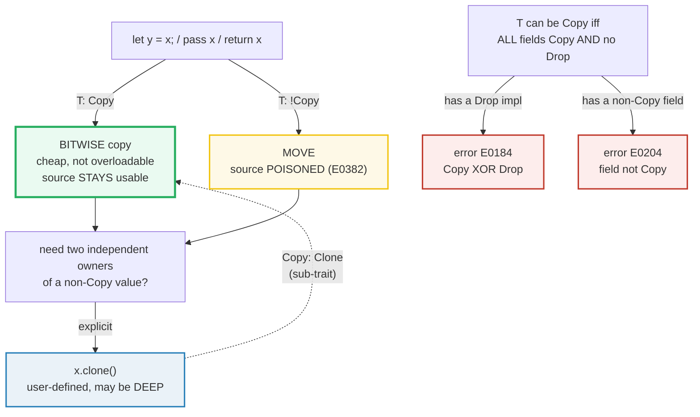

# COPY_CLONE — Bitwise Copy vs Explicit Clone (and the Copy-XOR-Drop Rule)

> **One-line goal:** `Copy` types are **bitwise-copied** on assignment (the
> source stays usable — there is no move); `Clone` is an **explicit `.clone()`**
> that may perform a user-defined **deep** copy; and a type is `Copy` only when
> **all its fields are `Copy`** and it has **no `Drop` impl**.
>
> **Run:** `just run copy_clone` (== `cargo run --bin copy_clone`)
> **Member:** `core` (stdlib-only — no `[dependencies]`).
> **Prerequisites:** 🔗 [OWNERSHIP](./OWNERSHIP.md) — this bundle is the *mirror
> image* of move semantics: `Copy` is precisely the set of types for which
> assignment does **not** move.
> **Ground truth:** [`copy_clone.rs`](./copy_clone.rs); captured stdout:
> [`copy_clone_output.txt`](./copy_clone_output.txt).

---

## Why this exists (lineage)

🔗 [OWNERSHIP](./OWNERSHIP.md) established that **every** value has one owner,
and that `let s2 = s1;` for a `String` **moves** ownership — `s1` is poisoned.
But that cannot be the whole story, because this obviously compiles and runs:

```rust
let a = 5;
let b = a;       // a is STILL usable afterwards
println!("{a}"); // prints 5, no error
```

So there are **two kinds of assignment semantics**, and the trait that selects
between them is `Copy`:

| Trait | Trigger | Cost / mechanism | Source afterwards | Examples |
|---|---|---|---|---|
| **`Copy`** | implicit (any `let y = x`, pass, return) | a cheap **bitwise copy** — not overloadable | **still usable** | `i32`, `f64`, `bool`, `char`, `&T`, `(Copy,Copy)`, `[Copy; N]` |
| **`Clone`** | explicit `x.clone()` only | a **user-defined** `fn clone(&self) -> Self` — may allocate, may be deep | source always usable (it's borrowed by `&self`) | `String`, `Vec<T>`, `Box<T>`, `HashMap`… |

The two traits are linked by a sub-trait relation — **`Copy: Clone`** — and
separated by an exclusion rule — **`Copy` xor `Drop`**. This bundle makes all
three load-bearing facts runnable.



---

## The two definitions (memorize these)

From the stdlib docs ([`std::marker::Copy`][std-copy], [`std::clone::Clone`][std-clone]):

```rust
// Copy has NO methods — its behavior (bitwise copy) cannot be overridden.
pub trait Copy: Clone { }              // Copy is a SUB-TRAIT of Clone

// Clone has one required method — YOU define what "duplicate" means.
pub trait Clone: Sized {
    fn clone(&self) -> Self;           // explicit; may run arbitrary code
    fn clone_from(&mut self, source: &Self) { ... } // provided, optimizable
}
```

Three consequences fall straight out of those signatures:

1. **Copy is implicit, Clone is explicit.** `y = x` copies for free when `T:
   Copy`; you must *write* `.clone()` to duplicate a non-Copy type. There is no
   syntax for "implicit clone" — the visual `.clone()` call is the Book's
   "indicator that something different is going on" ([Book ch4.1][book-copy]).
2. **Copy is not overloadable.** `Copy` has no methods, so its bitwise-copy
   semantics are fixed by the compiler. `Clone::clone` is ordinary code that may
   allocate (e.g. `String::clone` copies the heap buffer).
3. **`Copy: Clone`.** Every `Copy` type must also be `Clone`, and for a `Copy`
   type the `Clone` impl is trivially `fn clone(&self) -> Self { *self }`. That
   is why you always see them derived *together* as `#[derive(Copy, Clone)]`.

---

## Section A — Copy types are bitwise-copied on assignment

```rust
let a: i32 = 5;
let b = a;          // i32 is Copy -> bitwise copy; a stays usable
let c = b + 100;    // c = 105, but b is still 5 (independent copies)
```

> **From copy_clone.rs Section A:**
> ```
> ======================================================================
> SECTION A — Copy types are BITWISE-COPIED on assignment; source stays usable
> ======================================================================
>   let a: i32 = 5;
>   let b = a;   // i32 is Copy -> bitwise copy (a stays usable)
>     a = 5, b = 5  (both readable)
> [check] Copy keeps source usable: a == 5 && b == 5 after `let b = a`: OK
>   let c = b + 100 = 105;   b is still 5
> [check] copies are independent: c = 105 while b stays 5: OK
>   let t1 = (1,2,3);        let t2 = t1;   // tuple of Copy -> Copy
>   let arr1 = [10,20,30];   let arr2 = arr1; // array of Copy -> Copy
>   let big = String::from("non-Copy payload");
>   let r1 = &big;  let r2 = r1;  // &T is Copy even when T is not
>     t1 = (1, 2, 3), t2 = (1, 2, 3)
>     arr1 = [10, 20, 30], arr2 = [10, 20, 30]
>     r1 = "non-Copy payload", r2 = "non-Copy payload"  (two refs, same referent)
> [check] tuples of Copy are Copy: t1 and t2 both readable & equal: OK
> [check] arrays of Copy are Copy: arr1 and arr2 both readable & equal: OK
> [check] &T is Copy even when T is not: r1 AND r2 both usable after copy: OK
> ```

**What.** `let b = a;` for an `i32` leaves **both** `a` and `b` valid (first
check); deriving `c` from `b` leaves `b` untouched (second check). The remaining
three checks pin the **propagation rule**: `Copy` composes — a tuple of `Copy`
types is `Copy`, an array of `Copy` is `Copy`, and a shared reference `&T` is
`Copy` *even when `T` is not*.

**Why (internals).**
- **Copy semantics replace move semantics.** The stdlib docs are explicit: "By
  default, variable bindings have *move semantics*… However, if a type
  implements `Copy`, it instead has *copy semantics*" ([`std::marker::Copy`][std-copy]).
  The only observable difference between a move and a copy is **whether the
  source is still usable** — under the hood both "can result in bits being
  copied in memory, although this is sometimes optimized away" ([`std::marker::Copy`][std-copy]).
  So a copy is *not* "no bits move"; it is "bits are duplicated **and** the
  source is left valid".
- **`Copy` composes structurally.** The compiler auto-implements `Copy` for a
  tuple/array **iff every element is `Copy`** (`impl<T, const N: usize> Copy for
  [T; N] where T: Copy` is in the implementor list of [`Copy`][std-copy]). That
  is the same field-wise rule that governs structs (Section C/D).
- **`&T` is `Copy`; `&mut T` is NOT.** Copying `&T` just makes a second
  read-only pointer to the same data — always safe. Copying `&mut T` would
  create two mutable aliases into one value, violating the aliasing rule, so
  mutable references are **never** `Copy` (nor `Clone` — see `impl !Clone for
  &mut T` in [`Clone`][std-clone]). This is why the third check can copy `r1`
  while `big: String` itself cannot be copied.

> **The `&T`-is-Copy trick is how you cheaply "duplicate" a non-Copy value.**
> You cannot copy a `String`, but you can hand out a thousand `&String` copies
> of the same borrow for free. That is the bridge from this bundle to
> 🔗 [BORROWING](./BORROWING.md).

---

## Section B — Non-Copy types MOVE on assignment (the contrast)

```rust
let s1 = String::from("hello");
let s2 = s1;        // MOVE: String is not Copy -> s1 is POISONED
// s1.len();        // error[E0382]: borrow of moved value: `s1`
let c2 = s1.clone();// (hypothetically) the explicit deep-copy escape hatch
```

> **From copy_clone.rs Section B:**
> ```
> ======================================================================
> SECTION B — non-Copy types MOVE on assignment (contrast with Section A)
> ======================================================================
>   let s1 = String::from("hello");
>   let s2 = s1;   // MOVE (String is not Copy) -> s1 is now POISONED
>                   s2 = "hello"  (len 5, cap 5)
> [check] non-Copy String moves: the new owner s2 carries the value: OK
>   let c1 = String::from("rust");  let c2 = c1.clone();  // explicit deep copy
>     c1 = "rust", c2 = "rust"  (both usable)
> [check] explicit .clone() keeps the source usable: c1 and c2 both equal "rust": OK
>   let mut d2 = c2.clone();  d2.push_str("acean");
>     d2 = "rustacean", but c2 is still "rust"
> [check] Clone is deep: editing the clone leaves the source untouched: OK
> ```

**What.** `String` is `Clone` but **not** `Copy`. So `let s2 = s1` **moves** the
24-byte `{ptr,len,cap}` handle into `s2` and poisons `s1` (first check). The
only way to keep **both** is the explicit `.clone()`, which performs the deep
copy the compiler refuses to do automatically (second check). The third check
proves the clone is genuinely **deep and independent**: pushing onto `d2` leaves
`c2` equal to `"rust"`.

**Why (internals).**
- **Why isn't `String` `Copy`?** Because a `String` owns a heap buffer. If
  assignment bitwise-copied its handle, two bindings would point at the same
  buffer; when both dropped they would **double-free** it. The stdlib: "a simple
  bitwise copy of `String` values would merely copy the pointer, leading to a
  double free down the line. For this reason, `String` is `Clone` but not
  `Copy`" ([`std::marker::Copy`][std-copy]).
- **`.clone()` is `fn clone(&self) -> Self`.** It borrows the source (`&self`),
  which is *why the source stays usable* — no ownership is taken. For `String`
  the impl allocates a new buffer and copies the bytes; for `Vec<T>` it does the
  same per element (Section E).
- **The move is a compile error to violate, not a runtime check.** Reading `s1`
  after the move is `error[E0382]` — the same error 🔗 [OWNERSHIP](./OWNERSHIP.md)
  Section A shows verbatim. The compiler message even names the *reason*:
  `move occurs because 's1' has type 'String', which does not implement the Copy
  trait`. The fix it suggests (`s1.clone()`) is exactly the escape hatch above.

🔗 [MOVE_SEMANTICS](./MOVE_SEMANTICS.md) — partial moves and moving out of
fields. 🔗 [STRINGS_STR](./STRINGS_STR.md) — `String` (Clone, heap) vs `&str`
(Copy, the slice reference).

---

## Section C — A struct of all-Copy fields is Copy

```rust
#[derive(Copy, Clone)]           // Copy and Clone are derived TOGETHER
struct Point { x: i32, y: i32 }  // both fields are i32 (Copy) -> Point is Copy

let p1 = Point { x: 3, y: 4 };
let p2 = p1;                     // COPY, not move; p1 stays usable
let mut p3 = p1;  p3.x = 99;     // p3 is independent: p1.x is still 3
```

> **From copy_clone.rs Section C:**
> ```
> ======================================================================
> SECTION C — a struct of all-Copy fields is Copy: assign COPIES, not moves
> ======================================================================
>   #[derive(Copy, Clone)]  struct Point { x: i32, y: i32 }
>   let p1 = Point { x: 3, y: 4 };
>   let p2 = p1;   // COPY (all fields Copy) -> p1 stays usable
>     p1 = Point { x: 3, y: 4 }, p2 = Point { x: 3, y: 4 }
> [check] Copy struct: p1 and p2 both usable & equal after `let p2 = p1`: OK
>   let mut p3 = p1;  p3.x = 99;
>     p1 = Point { x: 3, y: 4 }, p3 = Point { x: 99, y: 4 }  (independent)
> [check] Copy struct copies are independent: mutating p3 leaves p1 unchanged: OK
> ```

**What.** `Point` has two `i32` fields. Since `i32: Copy`, the whole struct
qualifies for `Copy`: `let p2 = p1` leaves **both** usable (first check), and
mutating the copy `p3` leaves the original `p1` unchanged (second check) —
exactly like the `i32` in Section A, now lifted to a user type.

**Why (internals).**
- **The "all fields Copy" rule is structural and automatic.** The stdlib: "A
  type can implement `Copy` if all of its components implement `Copy`… A struct
  can be `Copy`, and `i32` is `Copy`, therefore `Point` is eligible to be
  `Copy`" ([`std::marker::Copy`][std-copy]). `#[derive(Copy, Clone)]` emits both
  impls; you never write the body because `Copy` has no methods.
- **`Copy` must be derived with `Clone`.** Because `Copy: Clone`, deriving
  `Copy` alone is a compile error (`the trait Copy requires Clone`). The derive
  for `Copy` also inserts the trivial `Clone { fn clone(&self) -> Self { *self } }`
  for you, so `p1.clone()` is a bitwise copy too.
- **Independent copies are the whole point.** A bitwise copy duplicates the
  bytes; for a struct of scalars that is a complete, standalone value, so
  editing one cannot affect the other. Contrast with Section D, where adding a
  heap-owning field breaks exactly this property.

> **When *should* a type be `Copy`?** The stdlib guidance: "Generally speaking,
> if your type *can* implement `Copy`, it should" ([`std::marker::Copy`][std-copy])
> — it is cheap, predictable, and removes a class of move-after-use bugs. The
> one caveat is that `Copy` is part of your **public API**: making a `Copy`
> type non-`Copy` later is a breaking change, so think twice for library types
> that might grow a heap field.

---

## Section D — One non-Copy field makes the whole struct non-Copy

```rust
#[derive(Clone)]                 // Copy is IMPOSSIBLE here
struct Labeled { tag: String, value: i32 }  // String is not Copy

let l1 = Labeled { tag: "id".into(), value: 7 };
let l2 = l1;                     // MOVE (not copy) -> l1 is POISONED
```

> **From copy_clone.rs Section D:**
> ```
> ======================================================================
> SECTION D — adding ONE non-Copy field makes the whole struct non-Copy (move)
> ======================================================================
>   #[derive(Clone)]  struct Labeled { tag: String, value: i32 }
>   let l1 = Labeled { tag: "id", value: 7 };
>   let l2 = l1;   // MOVE (String field not Copy) -> l1 is now POISONED
>     l2 = Labeled { tag: "id", value: 7 }
> [check] struct with a non-Copy field moves: the new owner l2 carries the value: OK
>   let k1 = Labeled{tag:"k",value:1};  let k2 = k1.clone();  // explicit deep copy
>     k1 = Labeled { tag: "k", value: 1 }, k2 = Labeled { tag: "k", value: 1 }  (both usable, independent)
> [check] Clone works even for non-Copy structs: k1 and k2 both usable & equal: OK
> ```

**What.** `Labeled` is the same shape as `Point` **plus** a `String` field.
Because `String` is not `Copy`, `Labeled` is not `Copy` either, so `let l2 =
l1` **moves** (first check). Deriving `Clone` still works — `Clone` has no
field-`Copy` requirement — so the explicit `.clone()` produces two independent
owners (second check).

**Why (internals).** The field rule is an **all-or-nothing** property: a single
non-`Copy` field poisons the entire aggregate. The reason is the same as for
`String` itself — if the struct were bitwise-copied, the `String` field's heap
pointer would be duplicated, and the two copies would double-free the buffer at
drop time. `Clone` sidesteps this because it can call `String::clone` on the
field (a real deep copy) rather than bitwise-copying it.

**The compile error (cannot live in the runnable `.rs`):** `#[derive(Copy)]` on
`Labeled` is **`error[E0204]`** — "The `Copy` trait was implemented on a type
which contains a field that doesn't implement the `Copy` trait"
([E0204][e0204]):

```console
error[E0204]: the trait `Copy` cannot be implemented for this type
  --> src/main.rs:3:10
   |
3  | #[derive(Copy)]
   |          ^^^^
4  | struct Labeled {
5  |     tag: String,   // field does not implement `Copy`
   |     --------
...
   = note: this error originates in the derive macro `Copy` ...
```

The compiler message is precise about *which* field breaks it
("`field 'tag' does not implement Copy`"), which is the exact diagnostic you use
to fix it: either drop the `Copy` derive (and accept move semantics), or change
the field to a `Copy` type (e.g. `&str` if you only need a borrow, or an enum
tag).

> **The same error fires for `&mut T` fields** ([E0204][e0204]): "`&mut T` is
> not `Copy`, even when `T` is `Copy` (this differs from the behavior for `&T`,
> which is always `Copy`)." This is the field-level twin of Section A's note
> that shared refs are `Copy` and mutable refs are not.

---

## Section E — Clone is explicit and may be deep (`Vec<i32>`)

```rust
let v1 = vec![10, 20, 30, 40];
let v2 = v1.clone();      // allocates a NEW buffer, copies every element
let mut v3 = v1.clone();
v3.push(50);              // v3 gains 50; v1 is untouched (independent)
```

> **From copy_clone.rs Section E:**
> ```
> ======================================================================
> SECTION E — Clone is EXPLICIT and may be DEEP: Vec<i32>
> ======================================================================
>   let v1 = vec![10, 20, 30, 40];  let v2 = v1.clone();
>     v1 = [10, 20, 30, 40], v2 = [10, 20, 30, 40]
> [check] Vec clone keeps source usable: v1 and v2 equal: OK
>   let mut v3 = v1.clone();  v3.push(50);
>     v3 = [10, 20, 30, 40, 50], v1 still = [10, 20, 30, 40]  (independent)
> [check] Clone is deep: v3.push does not affect v1: OK
> ```

**What.** `Vec<i32>` is `Clone` but not `Copy`. Cloning allocates a fresh
buffer and copies all four elements (first check); the clone is fully
independent, so pushing `50` onto `v3` leaves `v1` length `4` (second check).

**Why (internals).**
- **`Vec` is the canonical "deep `Clone`" type.** Its `Clone` impl calls the
  allocator, copies the elements, and builds a new `{ptr,len,cap}` handle. This
  is **O(n)** in both time and memory — the opposite of `Copy`'s O(1) bitwise
  duplicate. That cost is *why* it is never implicit: a hidden allocation on
  assignment would silently destroy performance.
- **`Clone` is "duplicate" in the type's own words.** The stdlib is careful to
  say `clone` "produces a duplicate" whose meaning "varies by type": a deep copy
  for `String`/`Vec`, another reference for `&T`, a refcount bump for `Rc`/`Arc`
  ([`std::clone::Clone`][std-clone]). So `.clone()` on a smart pointer does
  **not** deep-copy — it shares. That is a classic beginner trap (see pitfalls).
- **`clone_from` is the reusable-buffer hook.** `a.clone_from(&b)` is
  functionally `a = b.clone()` but `Clone` impls may override it to reuse `a`'s
  allocation instead of freeing and reallocating ([`std::clone::Clone`][std-clone]).
  In a hot loop assigning into an existing `String`, prefer `clone_from`.

> **Clippy watches your clones.** `clippy::redundant_clone` flags a `.clone()`
> whose source is never used afterwards (the move would have been free), and
> `clippy::clone_on_copy` flags `.clone()` on a `Copy` type (you wanted a copy,
> and the bitwise `let y = x` already gives you one for free — `.clone()` is
> noise). This is why this bundle's `i32` section uses plain assignment, not
> `.clone()`.

🔗 [VEC_COLLECTIONS](./VEC_COLLECTIONS.md) — `Vec`'s growth, capacity, and
heap-ownership model in depth.

---

## Section F — Copy XOR Drop: a type with `Drop` cannot be `Copy`

```rust
struct Guard<'a> { name: &'static str, drops: &'a Cell<u32> }
impl Drop for Guard<'_> { fn drop(&mut self) { /* bump counter */ } }
// #[derive(Copy)]   <-- IMPOSSIBLE: Guard has a Drop impl -> error E0184

let g1 = Guard { ... };
let _g2 = g1;    // MOVE (Guard is non-Copy because it has Drop)
                 // _g2 drops exactly once at scope end; g1 does not drop again
```

> **From copy_clone.rs Section F:**
> ```
> ======================================================================
> SECTION F — Copy XOR Drop: a type with a custom Drop CANNOT be Copy
> ======================================================================
>   created g1; moved into _g2 (Guard is non-Copy because it has Drop)
> [check] Drop type is non-Copy: g1 moved into _g2, no bitwise copy made: OK
>     (drop fires: g1)
>   after block: total drops = 1
> [check] Drop runs exactly once for a moved Drop type (no double-free): OK
> ```

**What.** `Guard` implements `Drop` (it bumps a counter and prints when
destroyed — the same RAII sentinel pattern as 🔗 [OWNERSHIP](./OWNERSHIP.md)
Section C). Because it has a custom `Drop`, it **cannot** be `Copy`, so `let
_g2 = g1` **moves** (first check). When the block ends, drop runs **exactly
once** on `_g2` — `g1` was moved, so it does not drop again (second check). No
double-free.

**Why (internals).** This is the **Copy-XOR-Drop exclusion rule**, and it is
the deepest of the three facts in this bundle:
- **A bitwise copy + a custom destructor = memory unsafety.** If `Guard` were
  `Copy`, then `let g2 = g1` would leave *two* live copies, and at scope end
  `drop` would run **twice** on the same underlying resource — a double-free
  (for a heap guard) or a double-close (for a file descriptor). The compiler
  forbids this combination outright.
- **The rule is stated in the trait docs.** "Generalizing the latter case, any
  type implementing `Drop` can't be `Copy`, because it's managing some resource
  besides its own `size_of::<T>` bytes" ([`std::marker::Copy`][std-copy]). And
  from the Book: "Rust won't let us annotate a type with the `Copy` trait if
  the type, or any of its parts, has implemented the `Drop` trait"
  ([Book ch4.1][book-copy]).
- **The runnable proof is the drop count.** The check `drops == 1` after the
  block is only possible *because* the move semantics held: exactly one owner
  (`_g2`), exactly one drop. A `Copy` version of `Guard` could not make that
  guarantee.

**The compile error (cannot live in the runnable `.rs`):** `#[derive(Copy)]`
combined with `impl Drop` is **`error[E0184]`** — "The `Copy` trait was
implemented on a type with a `Drop` implementation" ([E0184][e0184]):

```console
error[E0184]: the trait `Copy` may not be implemented for this type
             ; the type has a destructor
  --> src/main.rs:4:10
   |
4  | #[derive(Copy)]
   |          ^^^^
...
7  | impl Drop for Guard<'_> {
   | ----------------------- ...
```

The fix is never "make it `Copy`" — it is to **drop the `Drop` impl** (let
default drop glue handle cleanup, which makes the type eligible for `Copy`
again), or to **embrace move semantics** and keep the custom destructor. You
cannot have both.

> **Why "XOR"?** Because the two traits are mutually exclusive for a given type:
> it is `Copy` **or** it has a custom `Drop`, never both. (`Copy` types may
> still get the compiler-generated *drop glue* that drops their fields — what is
> excluded is a **user-written** `impl Drop`.)

🔗 [DROP_UNSAFE](./DROP_UNSAFE.md) — the `Drop` trait, drop glue, drop order,
and `ManuallyDrop`/`MaybeUninit` for the cases where you must opt out.

---

## Pitfalls (the expert payoff)

| Trap | Symptom | Fix / why |
|---|---|---|
| **Expecting a deep copy** | "I assigned `let v2 = v1` for a `Vec`, edited `v2`, and… `v1` is dead (E0382)" | Non-`Copy` types **move**. For a real duplicate you must write `v1.clone()`; there is no implicit deep copy in Rust. |
| **`.clone()` on a `Copy` type** | clippy `clone_on_copy` warning | `let y = x;` already bitwise-copies for free; `.clone()` is redundant noise. Drop the call. |
| **`.clone()` whose source is never used** | clippy `redundant_clone` | If the source binding is dead after, just **move** it — the clone is a wasted allocation. |
| **Thinking `.clone()` always deep-copies** | Two `Arc`/`Rc` clones "share" state when you expected isolation | `Clone` means "duplicate in the type's own way": deep for `String`/`Vec`, refcount-bump for `Rc`/`Arc`, another ref for `&T`. Read the type's semantics. |
| **`#[derive(Copy)]` alone** | `the trait `Copy` requires `Clone`` | `Copy: Clone` is a super-trait. Always derive them together: `#[derive(Copy, Clone)]`. |
| **Adding a heap field breaks `Copy` silently** | A type that used to copy now moves (E0382 at old call sites) | A single non-`Copy` field (`String`, `Vec`, `Box`) makes the whole struct non-`Copy`. `Copy` is part of your **public API** — removing it is a breaking change. |
| **`#[derive(Copy)]` on a type with a field that is not `Copy`** | `error[E0204]: the trait `Copy` cannot be implemented for this type` | Either drop the `Copy` derive (use move semantics + `Clone`), or change the offending field to a `Copy` type. The error names the field. |
| **`impl Drop` + `#[derive(Copy)]`** | `error[E0184]: the trait `Copy` may not be implemented for this type; the type has a destructor` | **Copy XOR Drop**: pick one. Custom cleanup ⇒ move semantics; bitwise-copy ⇒ let default drop glue handle cleanup. |
| **Expecting `&mut T` to be `Copy`/`Clone`** | `cannot move out of a mutable reference` / `&mut` won't `Clone` | `&T` is `Copy`; `&mut T` is **never** `Copy` nor `Clone` — copying it would create aliasing mutable refs. Reborrow `&mut *r` instead. |
| **`std::mem::drop` on a `Copy` value does nothing** | "I dropped my `i32` but it's still there" | `drop` moves a *copy* in and drops that; the original `Copy` value is untouched (clippy `dropping_copy_types` even warns). |
| **Confusing copy with "no bits move"** | "Isn't a copy just a no-op?" | No — a copy **duplicates** the bits and leaves the source valid; a move copies the bits (often) and **invalidates** the source. The difference is the source's validity, not whether memory is touched ([`std::marker::Copy`][std-copy]). |

---

## Cheat sheet

```rust
// TRAIT SHAPES
pub trait Copy: Clone { }                     // no methods; bitwise copy; implicit
pub trait Clone: Sized {                      // one method; user-defined; explicit
    fn clone(&self) -> Self;
    fn clone_from(&mut self, source: &Self);  // provided; may reuse allocation
}

// THREE RULES
// 1. Copy types are BITWISE-copied on `let y = x` -> source stays usable.
// 2. A type is Copy iff ALL fields are Copy AND it has NO `impl Drop`.
// 3. Copy XOR Drop: a type with a custom Drop is NEVER Copy.

// COPY (implicit, cheap)
let a: i32 = 5;  let b = a;          // both usable; b is an independent copy
#[derive(Copy, Clone)]
struct Point { x: i32, y: i32 }      // all-Copy fields -> Copy
let p1 = Point{x:3,y:4};  let p2 = p1;  // p1 still usable

// CLONE (explicit, may be deep)
let s1 = String::from("hi");
let s2 = s1.clone();                 // source s1 stays usable; s2 is a deep copy
// let s2 = s1;                      // would MOVE -> s1 poisoned (E0382)

// NON-Copy propagates: one non-Copy field poisons the aggregate
#[derive(Clone)]                     // CANNOT derive Copy (String field)
struct Labeled { tag: String, value: i32 }
let l2 = l1.clone();                 // Clone has no field-Copy requirement

// COMPILE ERRORS (not runnable here)
// #[derive(Copy)] on a type with a String field      -> error E0204
// #[derive(Copy)] on a type with `impl Drop`         -> error E0184 (Copy XOR Drop)

// WHAT IS COPY:  i*/u*/f*, bool, char, &T, fn, (Copy,), [Copy; N], all-Copy structs/enums
// WHAT IS NOT:   String, Vec, Box, HashMap, &mut T, anything with a Drop impl
```

---

## Sources

Every claim above was web-verified in at least two authoritative places.

- **The Rust Programming Language, ch4.1 "What is Ownership?" / "Ways Variables
  and Data Interact: Clone"** — `Copy` vs move-on-assign, `clone` as the
  explicit deep-copy escape hatch, the "Rust won't let us annotate a type with
  `Copy` if it has implemented `Drop`" rule, "Stack-Only Data: Copy":
  https://doc.rust-lang.org/book/ch04-01-what-is-ownership.html
- **`std::marker::Copy` trait docs** — `pub trait Copy: Clone {}`, "copy
  semantics" vs "move semantics", bitwise copy is not overloadable, "a type can
  implement `Copy` if all of its components implement `Copy`", `&T` is `Copy`,
  "any type implementing `Drop` can't be `Copy`", "if your type can implement
  `Copy`, it should" (public-API caveat):
  https://doc.rust-lang.org/std/marker/trait.Copy.html
- **`std::clone::Clone` trait docs** — `fn clone(&self) -> Self`, "what
  'duplicate' means varies by type" (deep for `String`, refcount for `Arc`/`Rc`,
  another ref for `&T`), `clone_from` reuse hook, `Clone` is a super-trait of
  `Copy`, `&mut T` is `!Clone`:
  https://doc.rust-lang.org/std/clone/trait.Clone.html
- **Rust error code E0184** — "The `Copy` trait was implemented on a type with a
  `Drop` implementation" (Copy-XOR-Drop exclusion), verbatim example of
  `#[derive(Copy)] struct Foo;` + `impl Drop for Foo`:
  https://doc.rust-lang.org/error_codes/E0184.html
- **Rust error code E0204** — "The `Copy` trait was implemented on a type which
  contains a field that doesn't implement the `Copy` trait", the `Vec<u32>`
  field example, and the `&mut T` is not `Copy` note:
  https://doc.rust-lang.org/error_codes/E0204.html
- **Rust error code E0382** (via OWNERSHIP) — "use of moved value", the
  borrow-checker signature whose message cites "does not implement the `Copy`
  trait":
  https://doc.rust-lang.org/error_codes/E0382.html
- **HashRust — "Moves, copies and clones in Rust"** — independent corroboration
  that a move is a bitwise copy + source invalidation, and that `Copy` types
  skip the invalidation so the source stays usable:
  https://hashrust.com/blog/moves-copies-and-clones-in-rust/
- **"Copy & Clone Traits in Rust" (Leapcell)** — the Copy/Clone contrast and the
  `Copy: Clone` sub-trait relationship explained with worked examples:
  https://leapcell.medium.com/copy-clone-traits-in-rust-can-you-tell-the-difference-b3cee2545713
