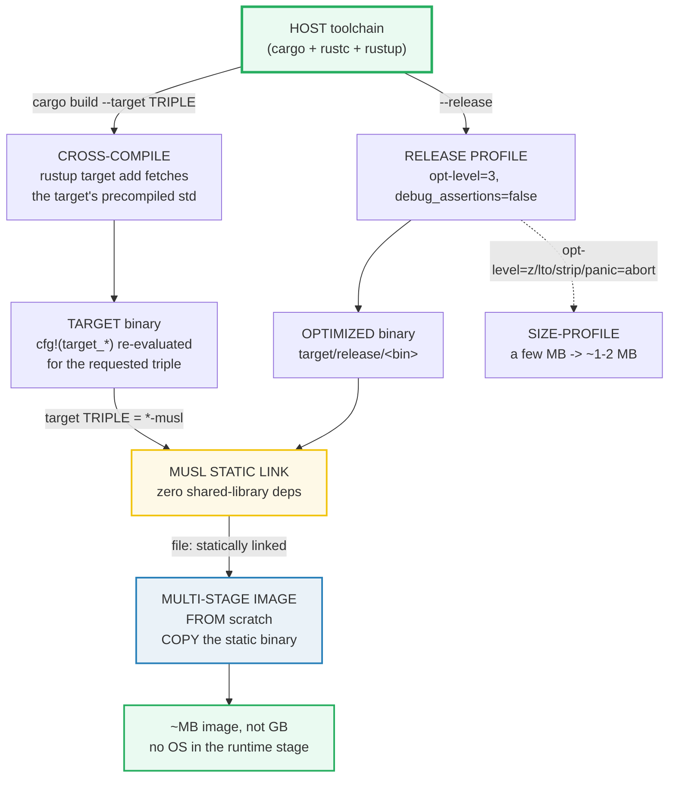

# DEPLOYMENT — Cross-Compile, musl Static Binaries & Release Profile

> **One-line goal:** Rust ships deployment-quality artifacts from the **compile
> time** up: `cargo build --target` cross-compiles to any triple, `--release`
> flips on the optimization profile, a **musl** link yields a **fully static**
> binary (no glibc), and a **multi-stage `FROM scratch`** Docker image shrinks
> the runtime to just the binary.
>
> **Run:** `just run deployment` (== `cargo run --bin deployment`)
> **Member:** `core` (stdlib-only — no `[dependencies]`).
> **Prerequisites:** 🔗 [BUILD_CONFIG](./BUILD_CONFIG.md) — `cfg!`/`#[cfg]`/`env!`
> are the compile-time primitives this bundle leans on; read it first.
> **Ground truth:** [`deployment.rs`](./deployment.rs); captured stdout:
> [`deployment_output.txt`](./deployment_output.txt).
>
> **Note on scope:** the *runnable* core here is **compile-time observation**
> (`cfg!(target_*)`, `env!`, `size_of`) plus the release-vs-debug distinction.
> The **artifact pipeline** (cross-compile, `docker build`, the release profile)
> runs **outside** `cargo run`, so it is documented as **build-system evidence**
> (code blocks with the exact commands), clearly labelled — not a `.go` callout.

---

## Why this exists (lineage)

In Go, cross-compilation is one env var (`GOOS=linux GOARCH=arm64 go build`) and
the default binary is already static. In Rust the defaults are different — and
that difference is the whole deployment story:

| Concern | Go default | Rust default |
|---|---|---|
| **Cross-compile** | env vars only | `cargo build --target <triple>` + `rustup target add` for std |
| **Linkage** | **static** by default | **dynamic** (glibc on Linux gnu) unless you target `*-musl` |
| **Optimization** | build flags | the `[profile.release]` table in `Cargo.toml` |
| **Image base** | `FROM scratch` works out of the box | `FROM scratch` needs the musl static binary first |

So "deploying a Rust binary" is really four compile-time/build-time decisions,
each of which this bundle makes visible:



The compile-time facts (`cfg!(target_os)`, `cfg!(target_env)`, pointer width)
are exactly what the linker and Dockerfile use to decide what to build and where
to run it. Sections A–D observe those facts live; Sections E–F document the
pipeline they feed.

---

## Section A — Cross-compile target flags via `cfg!(target_*)`

```rust
// Each cfg!(target_*) reads the BUILD TARGET at compile time.
let on_musl = cfg!(target_env = "musl");     // true ONLY when building FOR musl
let width   = cfg!(target_pointer_width = "64");
```

> **From deployment.rs Section A:**
> ```
> ======================================================================
> SECTION A — Cross-compile target flags via cfg!(target_*) — RUN + DOCUMENT
> ======================================================================
>   cfg!(target_os)    = "macos"
>   cfg!(target_arch)  = "aarch64"
>   cfg!(target_env)   = ""   (musl is the static-link env)
>   cfg!(target_endian)= "little"
>   cfg!(target_pointer_width = "64") = true
> [check] current target_os is in the Reference's enumerated set: OK
> [check] current target_arch is non-empty and in the known arch set: OK
> [check] current target_env is in the known env set: OK
> [check] current target_endian is in {little, big}: OK
> [check] exactly one of cfg!(unix) / cfg!(windows) holds: OK
> 
>   // Cross-compile to a STATIC musl Linux binary (no glibc dependency):
>   //   rustup target add x86_64-unknown-linux-musl     # fetch target std
>   //   cargo build --release --target x86_64-unknown-linux-musl
>   // Output -> target/x86_64-unknown-linux-musl/release/<bin>
> 
>   // Pin a default target per-project in .cargo/config.toml:
>   //   [build]
>   //   target = "x86_64-unknown-linux-musl"
> 
>   // cfg!(target_env = "musl") on THIS host = false (true only when building FOR musl)
> ```

**What.** Four `cfg!` ladders resolve the host's `target_os`/`target_arch`/
`target_env`/`target_endian` to strings, and five checks assert each is in the
Rust Reference's enumerated set (the checks are **portable** — they pass on any
host, unlike host-pinning). The captured output reflects the author's Apple
Silicon machine (`macos`/`aarch64`); re-running on a Linux x86_64 host prints
`linux`/`x86_64` and every check still passes.

**Why (internals).**
- **`cfg!(PREDICATE)` expands to a `bool` literal fixed at compile time.** Unlike
  the `#[cfg]` *attribute* (which REMOVES the annotated item when false), `cfg!()`
  never removes code — every branch of `if cfg!(...)` must still type-check. That
  is why we can *print* the value: it's a runtime `bool` whose value the compiler
  already knew. 🔗 [BUILD_CONFIG](./BUILD_CONFIG.md) covers this distinction in
  depth.
- **Cross-compilation re-evaluates these predicates for the *target*, not the
  host.** `cargo build --target x86_64-unknown-linux-musl` makes `cfg!(target_os
  = "linux")`, `cfg!(target_env = "musl")`, and `cfg!(target_pointer_width =
  "64")` all `true` *inside that build*, even on a macOS host. `cfg!(target_env =
  "musl") on THIS host = false` is the live proof: the predicate reflects whatever
  triple rustc is currently compiling **for**.
- **No toolchain dance for std.** rustc is a cross-compiler by default — the only
  thing missing for a foreign target is that target's **precompiled standard
  library**, which `rustup target add <triple>` fetches ([Cargo Book — config:
  `build.target`][cargo-config]; [Rust Project Primer — Cross-Compiling][rpp]).
  `cross` (Section E) goes further for targets needing a foreign C toolchain.

> **`target_env` is empty on macOS.** A historical quirk the Reference calls out:
> `target_env` is only set when needed to disambiguate the ABI (`gnu`/`musl` on
> Linux, `msvc`/`gnu` on Windows). On macOS/BSD it is `""`. The deployment-relevant
> value is `"musl"` — the cfg a musl target sets.

---

## Section B — Release vs Debug profile: `cfg!(debug_assertions)`

```rust
let dbg = cfg!(debug_assertions);   // true under `cargo run` (dev profile)
// `cargo run --release` flips this to false.
```

> **From deployment.rs Section B:**
> ```
> ======================================================================
> SECTION B — Release vs Debug profile — RUN cfg!(debug_assertions) + DOCUMENT
> ======================================================================
>   cfg!(debug_assertions) = true   (dev profile; --release -> false)
> [check] cfg!(debug_assertions) is true for a dev (`cargo run`) build: OK
>   255u8.checked_add(1)    = None    (None -> caller decides; mode-independent)
>   255u8.wrapping_add(1)   = 0      (wraps to 0; mode-independent)
>   255u8.saturating_add(1) = 255    (saturates; mode-independent)
> [check] checked_add on u8::MAX is None regardless of profile: OK
> [check] wrapping_add on u8::MAX wraps to 0 regardless of profile: OK
> [check] saturating_add on u8::MAX stays at 255 regardless of profile: OK
> 
>   // Bare arithmetic overflow behavior (the mode-dependent part):
>   //   let x: u8 = 255u8 + 1;
>   //   - dev    (cfg!(debug_assertions)==true ): PANIC at runtime
>   //   - release(cfg!(debug_assertions)==false): WRAPS silently to 0
> 
>   // Build the optimized artifact (--release flips debug_assertions OFF):
>   //   cargo build --release   # -> target/release/<bin>
> 
>   // Default dev profile (cargo run/build/check) — Cargo Book:
>   //   opt-level=0 debug=true strip="none" debug-assertions=true
>   //   overflow-checks=true lto=false panic="unwind" codegen-units=256
> 
>   // Default release profile (--release / cargo install) — Cargo Book:
>   //   opt-level=3 debug=false strip="none" debug-assertions=false
>   //   overflow-checks=false lto=false panic="unwind" codegen-units=16
> ```

**What.** `cargo run` builds with the **`dev`** profile, where
`cfg!(debug_assertions)` is `true` (verified by the first check). The three
`checked_`/`wrapping_`/`saturating_` results are **identical in both profiles** —
those methods are mode-independent. The *deployment-relevant* fact is the
documented default profile tables (verbatim from the Cargo Book): `dev` optimizes
for fast rebuilds (`opt-level=0`, `incremental=true`, `codegen-units=256`),
`release` optimizes for runtime speed (`opt-level=3`).

**Why (internals).**
- **The bare arithmetic operators are the ONLY overflow behavior that flips
  between profiles.** In `dev`, `255u8 + 1` **panics** (overflow-checks on); in
  `release` it **wraps** silently to `0` (overflow-checks off). The explicit
  methods (`checked_add` → `Option`, `wrapping_add` → wrap, `saturating_add` →
  clamp) exist precisely so you can write overflow behavior that does NOT depend
  on which profile shipped. This is the §4.2 rule 8 determinism concern
  (`HOW_TO_RESEARCH.md`) made concrete: a debug-only panic is a production landmine.
- **`--release` is `--profile=release`.** Cargo has four built-in profiles
  (`dev`, `release`, `test`, `bench`) and you can define custom ones (Section F).
  `cargo install` uses `release` by default; `cargo run`/`build`/`check` use `dev`
  by default. The profile is selected per-command, not per-binary
  ([Cargo Book — Profile selection][cargo-profiles]).
- **`cfg!(debug_assertions)` is the canonical profile signal.** Crates gate
  debug-only code with `#[cfg(debug_assertions)]`. It is the *only* `cfg` the
  profile settings directly toggle that is a stable, documented compile-time
  predicate (the Cargo Book explicitly maps `debug-assertions` →
  `cfg(debug_assertions)`).

---

## Section C — `env!()` Cargo constants; `CARGO_CFG_*` are build-script-only

```rust
let pkg: &str = env!("CARGO_PKG_NAME");          // "core" — crate-accessible
let cfg_os = option_env!("CARGO_CFG_TARGET_OS"); // None here — build-script-only
```

> **From deployment.rs Section C:**
> ```
> ======================================================================
> SECTION C — env!() Cargo constants + CARGO_CFG_* are build-script-only — RUN + DOCUMENT
> ======================================================================
>   env!("CARGO_PKG_NAME")    = "core"    (member PACKAGE name)
>   env!("CARGO_PKG_VERSION") = "0.0.0"    (workspace version)
>   env!("CARGO_CRATE_NAME")  = "deployment"    (this BIN crate, not package)
> [check] env!("CARGO_PKG_NAME") == "core": OK
> [check] env!("CARGO_PKG_VERSION") == "0.0.0" (workspace version): OK
> [check] env!("CARGO_CRATE_NAME") == "deployment" (the BIN crate): OK
> [check] CARGO_PKG_NAME != CARGO_CRATE_NAME (package vs bin crate): OK
>   option_env!("CARGO_CFG_TARGET_OS")   = <None>   (Some only in build.rs)
>   option_env!("CARGO_CFG_TARGET_ARCH") = <None>
> [check] CARGO_CFG_TARGET_OS is None here: CARGO_CFG_* are BUILD-SCRIPT-ONLY: OK
> [check] CARGO_CFG_TARGET_ARCH is None here (same reason): OK
> 
>   // In a build.rs, Cargo sets CARGO_CFG_<cfg> for every cfg key:
>   //   fn main() {
>   //     let os = env!("CARGO_CFG_TARGET_OS");   // "linux", "macos", ...
>   //     if os == "linux" { println!("cargo::rustc-cfg=linux_only"); }
>   //   }
>   // The crate then gates code on the installed cfg:  #[cfg(linux_only)]
> 
>   // Crates read the SAME fact via cfg!(target_os = "linux") (Section A)
>   // at compile time WITHOUT a build script.
> ```

**What.** Three `env!` reads return the deterministic Cargo constants (`core`,
`0.0.0`, `deployment`) and a fourth check proves `CARGO_PKG_NAME != CARGO_CRATE_NAME`
(a package can hold many `[[bin]]` targets). The two `option_env!` reads return
`None` — a **live proof** that `CARGO_CFG_*` environment variables are **not**
set for normal crate compilation.

**Why (internals).**
- **Two separate families of Cargo environment variables.** The `CARGO_PKG_*` and
  `CARGO_CRATE_NAME`/`CARGO_BIN_*` vars are set for **every** crate Cargo compiles,
  so `env!` works in normal code. The `CARGO_CFG_<cfg>`, `OUT_DIR`, `TARGET`,
  `HOST`, `OPT_LEVEL`, `DEBUG`, and `CARGO_FEATURE_<name>` vars are set **only
  when running a build script** ([Cargo Book — build-script environment
  variables][cargo-env]). That is why this crate reads cfg via the `cfg!()` macro
  (Section A), never via `env!("CARGO_CFG_TARGET_OS")`.
- **`env!("VAR")` vs `option_env!("VAR")`.** `env!` expands to a `&'static str`
  and is a **compile error** if `VAR` is unset; `option_env!` is the total form —
  `Option<&'static str>`, never a compile error. That's how we *demonstrate*
  absence (`<None>`) instead of failing the build. Both are **zero-cost** at
  runtime: the value is baked into the binary at compile time.
- **The build-script bridge.** When a `build.rs` DOES exist, it can read
  `env!("CARGO_CFG_TARGET_OS")` and emit `cargo::rustc-cfg=linux_only`, which the
  crate then gates on with `#[cfg(linux_only)]`. The crate itself still uses
  `cfg!()`/`#[cfg]` — the build script only *installs* new cfg keys. 🔗
  [BUILD_CONFIG](./BUILD_CONFIG.md) Section E documents that `build.rs` →
  `OUT_DIR` → `include!` workflow in full.

---

## Section D — `size_of`: deterministic layout facts baked into the binary

```rust
let s = std::mem::size_of::<&str>();        // 16 bytes (ptr + len) on 64-bit
let v = std::mem::size_of::<Vec<u8>>();     // 24 bytes (ptr + len + cap)
let o = std::mem::size_of::<Option<Box<u8>>>(); // 8 bytes (niche-optimized!)
```

> **From deployment.rs Section D:**
> ```
> ======================================================================
> SECTION D — size_of: deterministic data-layout facts baked into the binary — RUN
> ======================================================================
>   size_of::<usize>()           = 8  (target_pointer_width / 8)
>   size_of::<*const u8>()       = 8  (a raw pointer)
>   size_of::<&str>()            = 16  (ptr + len = 2 * usize)
>   size_of::<Vec<u8>>()         = 24  (ptr + len + cap = 3 * usize)
>   size_of::<Option<Box<u8>>>() = 8  (niche-optimized: == a bare Box<u8>)
> [check] size_of::<usize>() == 8 on a 64-bit target: OK
> [check] size_of::<*const u8>() == size_of::<usize>() (pointer width): OK
> [check] size_of::<&str>() == 2 * usize (ptr+len = 16 bytes): OK
> [check] size_of::<Vec<u8>>() == 3 * usize (ptr+len+cap = 24 bytes): OK
> [check] Option<Box<u8>> is niche-optimized to 1 usize (no tag byte for None): OK
> [check] cfg!(target_pointer_width = "64") implies usize == 8 bytes: OK
> ```

**What.** Six layout facts, all pinned by the pointer width (8 bytes on a 64-bit
target): `&str` is 2 words (16), `Vec` is 3 words (24), and — the expert payoff —
`Option<Box<u8>>` is **the same 8 bytes as a bare `Box<u8>`**, with no tag byte.

**Why (internals).**
- **These sizes are fixed by the target ABI, not the profile.** `size_of` returns
  a compile-time constant determined by `target_pointer_width` and the Rust layout
  rules. They do **not** change between debug and release — binary layout is stable
  across profiles. That stability is what makes `#[repr(C)]` FFI and `size_of`
  reliable deployment facts. 🔗 [FFI](./FFI.md) (ABI) relies on exactly this.
- **`&str` = `{ ptr: *const u8, len: usize }` = 16 bytes; `Vec<T>` = `{ ptr, len,
  capacity }` = 24 bytes.** This is the **handle** whose bitwise copy is a move
  (🔗 [OWNERSHIP](./OWNERSHIP.md) Section E proves a `String`/`Vec` move is an
  O(1) 24-byte handle copy). The heap payload is not counted by `size_of` — only
  the on-stack handle.
- **`Option<Box<u8>>` == 8 bytes: the niche optimization.** `Box<T>` internally
  holds a `NonNull<T>` (a non-null pointer). Because it can *never* be null, the
  null pointer value is a free **niche** that `Option` reuses to encode `None` —
  so `Option<Box<T>>` needs no extra discriminant byte. `Option<&T>` and
  `Option<NonNull<T>>` get the same treatment. This is why Rust optionality is
  zero-cost for pointer-like types.

> **Determinism note.** `size_of` reports the **structural** size, never an
> address (addresses vary per run with ASLR — see `HOW_TO_RESEARCH.md` §4.2 rule
> 2). That is why these values are safe to print and byte-reproducible.

---

## Section E — musl static binary + multi-stage `FROM scratch` Dockerfile

```dockerfile
# stage 1: builder compiles a STATIC musl binary
FROM rust:1-bookworm AS builder
RUN apt-get update && apt-get install -y musl-tools
RUN rustup target add x86_64-unknown-linux-musl
RUN cargo build --release --target x86_64-unknown-linux-musl

# stage 2: runtime = ONLY the static binary + TLS CAs
FROM scratch
COPY --from=builder /app/target/x86_64-unknown-linux-musl/release/deployment /deployment
ENTRYPOINT ["/deployment"]
```

> **From deployment.rs Section E (DOCUMENTED — build-system evidence):**
> ```
> ======================================================================
> SECTION E — Musl static binary + multi-stage scratch Dockerfile (DOCUMENTED)
> ======================================================================
>   // ── Why musl: a FULLY STATIC binary with NO glibc dependency ──
>   //   A gnu (glibc) binary dynamically links libc.so.6, so one built on
>   //   Ubuntu 24.04 may fail on older distros ("GLIBC_2.xx not found").
>   //   Linking musl (a small libc-standard C library) yields a STATIC
>   //   binary with zero shared-library deps -> runs in `FROM scratch`.
> 
>   // Build for musl, then PROVE it is fully static:
>   //   rustup target add x86_64-unknown-linux-musl
>   //   cargo build --release --target x86_64-unknown-linux-musl
>   //   file target/x86_64-unknown-linux-musl/release/deployment
>   //     # -> "... statically linked"
>   //   ldd  target/x86_64-unknown-linux-musl/release/deployment
>   //     # -> "not a dynamic executable"
> 
>   // ── Multi-stage Dockerfile: builder compiles, final stage runs ──
>   //   # ---- stage 1: builder (full Rust toolchain lives here) ----
>   //   FROM rust:1-bookworm AS builder
>   //   RUN apt-get update && apt-get install -y musl-tools
>   //   RUN rustup target add x86_64-unknown-linux-musl
>   //   WORKDIR /app
>   //   COPY Cargo.toml Cargo.lock .
>   //   RUN mkdir src && cargo build --release --target x86_64-unknown-linux-musl  # cache deps
>   //   COPY . .
>   //   RUN cargo build --release --target x86_64-unknown-linux-musl
>   //
>   //   # ---- stage 2: runtime (ONLY the static binary + TLS CAs) ----
>   //   FROM scratch
>   //   COPY --from=builder \
>   //     /app/target/x86_64-unknown-linux-musl/release/deployment /deployment
>   //   COPY --from=builder /etc/ssl/certs/ca-certificates.crt /etc/ssl/certs/
>   //   ENTRYPOINT ["/deployment"]
> 
>   //   docker build -t deployment:latest .
>   //   docker images deployment   # ~ a few MB, not GB (no OS in stage 2)
> 
>   // Distroless alternative to scratch (adds CA certs + /etc/passwd, no shell):
>   //   FROM gcr.io/distroless/cc-debian12
>   //   COPY --from=builder /app/target/.../release/deployment /deployment
> 
>   // ── `cross` (cross-rs): Dockerized toolchain for tricky targets ──
>   //   cargo install cross --git https://github.com/cross-rs/cross
>   //   cross build --release --target aarch64-unknown-linux-musl
>   //   cross build --release --target x86_64-pc-windows-gnu
>   // `cross` wraps cargo with a per-target Docker image bundling the right
>   // C toolchain + linker, so you never install arm64/mingw locally.
> ```

**What.** This is **build-system evidence** (a real cross-compile / `docker build`
runs outside `cargo run`). Three pieces: (1) the **musl** target produces a
fully-static binary (provable via `file`/`ldd`); (2) a **two-stage Dockerfile**
where stage 1 compiles with the full toolchain and stage 2 is `FROM scratch`
copying only the static binary (+ TLS CAs for HTTPS); (3) the **`cross`** tool for
targets needing a foreign C toolchain (arm64-musl, Windows gnu, embedded).

**Why (internals).**
- **Why static matters: the glibc trap.** A Linux **gnu** (glibc) binary
  dynamically links `libc.so.6` and embeds the GLIBC symbol versions it was built
  against. A binary built on Ubuntu 24.04 (glibc 2.39) will fail on Debian 11
  (glibc 2.31) with `/lib64/libc.so.6: version 'GLIBC_2.34' not found`. Targeting
  **musl** statically links a small C library *into* the binary, so there are zero
  shared-library deps — it runs anywhere, including a `FROM scratch` image with no
  OS at all ([static-linking discussion][users-static]; [minimal Docker images
  guide][oneuptime-docker]).
- **Why `FROM scratch` works.** `scratch` is Docker's reserved empty image —
  literally no filesystem. A static binary needs nothing from the OS but the
  kernel syscall interface, so `COPY`-ing just the binary (plus `ca-certificates`
  if it does TLS) is a complete runtime. The resulting image is the size of the
  binary (a few MB), not the ~GB of a `rust:1` base image ([dev.to multi-stage
  guide][dev-multi-stage]; [standalone scratch binary writeup][bxbrenden]).
- **`cross` for the hard cases.** `rustup target add` suffices when the target
  needs no foreign C libraries. But targets like `aarch64-unknown-linux-musl`,
  `x86_64-pc-windows-gnu`, or embedded triples need a matching C toolchain and
  linker installed on the host. `cross` (cross-rs) sidesteps that by running each
  build inside a Docker image that already bundles the right toolchain
  ([cross-rs README][cross-rs]; [Reddit PSA on `cross`][reddit-cross]). You keep
  your `cargo` CLI: `cross build --target ...`.

> **`FROM scratch` vs distroless.** `scratch` is the absolute minimum (just your
> binary). **Distroless** (`gcr.io/distroless/cc-debian12`) adds CA certs,
> `/etc/passwd`, and a timezone database but **no shell** — so it's still tiny and
> attack-surface-free, yet friendlier for TLS and non-root users.

---

## Section F — `[profile.release]` for minimal binary size

```toml
[profile.release]
opt-level = "z"      # optimize for SIZE (3 = speed)
lto = true           # fat LTO across the whole dependency graph
codegen-units = 1    # one unit -> best optimization, slower link
strip = "symbols"    # remove symbol tables (= strip = true)
panic = "abort"      # drop the unwind tables -> smaller binary
```

> **From deployment.rs Section F (DOCUMENTED):**
> ```
> ======================================================================
> SECTION F — [profile.release] for minimal binary size (DOCUMENTED)
> ======================================================================
>   // Shrink the release binary in Cargo.toml (Cargo Book — Profiles):
>   //   [profile.release]
>   //   opt-level = "z"     # optimize for SIZE ('s' also shrinks; 3 = speed)
>   //   lto = true          # 'fat' LTO across the whole dep graph (or "thin")
>   //   codegen-units = 1   # one unit -> best optimization, slower link
>   //   strip = "symbols"   # strip=true is equivalent; removes symbol tables
>   //   panic = "abort"     # drop the unwind tables -> smaller binary
> 
>   //   cargo build --release    # applies [profile.release] automatically
> 
>   // Each knob (Cargo Book + min-sized-rust):
>   //   opt-level="z"   -> optimize for binary size ('s'=size, 3=speed)
>   //   lto=true        -> whole-program LLVM optimization across all crates
>   //   codegen-units=1 -> one codegen unit lets LLVM see the whole crate
>   //   strip="symbols" -> remove the symbol table + debuginfo from the binary
>   //   panic="abort"   -> no unwinding machinery (smaller binary)
> 
>   // CAVEAT: panic="abort" is IGNORED by tests/benches/build scripts/proc-
>   // macros — the test harness requires unwinding, so a release TEST build
>   // forces deps back to "unwind".
> 
>   // Custom profile inheriting release + the size knobs:
>   //   [profile.min]
>   //   inherits = "release"
>   //   opt-level = "z"
>   //   lto = true
>   //   strip = true
>   //   panic = "abort"
>   //   cargo build --profile min   # -> target/min/<bin>
> 
>   // Order of magnitude: a default --release binary can be ~5-15 MB; the full
>   // size profile + musl + strip often lands it under ~1-2 MB. (Exact numbers
>   // are binary-specific; this is documentation, not a runnable check.)
> ```

**What.** The default `release` profile is tuned for **speed** (`opt-level=3`),
not size. Five knobs in `[profile.release]` trade link time and unwinding for a
much smaller binary. Every value above is verified against the Cargo Book Profiles
chapter ([Cargo Book — Profiles][cargo-profiles]) and the `min-sized-rust`
reference ([johnthagen/min-sized-rust][min-sized-rust]).

**Why (internals).**
- **`opt-level = "z"`** optimizes for binary size (turns off loop vectorization
  too); `"s"` also shrinks; `3` optimizes for speed. Cargo's `opt-level` maps 1:1
  to rustc's `-C opt-level`. The Cargo Book notes `"s"`/`"z"` aren't *always*
  smaller than `3` — measure for your binary.
- **`lto = true`** ("fat") performs LLVM link-time optimization **across the whole
  dependency graph** (all crates), letting LLVM inline and dead-code-eliminate
  across boundaries. `"thin"` is faster to link with most of the benefit; `false`
  is the default (thin *local* LTO only).
- **`codegen-units = 1`** makes rustc emit a single codegen unit so LLVM sees the
  entire crate at once (better optimization, slower link). The default is 16.
- **`strip = "symbols"`** (or `strip = true`) removes the symbol table and
  debuginfo from the final binary — the single biggest easy win. The default is
  `"none"`.
- **`panic = "abort"`** drops the stack-unwinding machinery and unwind tables,
  shrinking the binary — at the cost of no unwinding on panic (the process just
  aborts). **Caveat:** this is *ignored* by tests, benchmarks, build scripts, and
  proc macros (the test harness requires unwinding), so a release `cargo test`
  forces dependencies back to `"unwind"`.
- **Custom profiles inherit.** `[profile.min]` with `inherits = "release"` plus
  the size knobs lets you keep a normal `--release` and opt into the size-optimized
  artifact via `cargo build --profile min` → `target/min/<bin>`.

> **Why not just hand these as rustc flags?** Cargo's profile system exists so
> *everyone* building your crate gets the same knobs from `Cargo.toml` — no need
> to remember a `RUSTFLAGS` incantation. The Cargo Book warns that hand-rolled
> `build.rustflags` may collide with future Cargo-managed flags
> ([Cargo Book — `build.rustflags`][cargo-config]).

---

## Pitfalls (the expert payoff)

| Trap | Symptom | Fix / why |
|---|---|---|
| **Shipping a gnu (glibc) binary for "Linux"** | `version 'GLIBC_2.xx' not found` on the deploy host | Build for `*-musl` to get a fully static binary, or pin a very old glibc CI image. The GLIBC symbol-version trap is the #1 Rust deploy bug. |
| **Forgetting `rustup target add <triple>`** | `error[E0463]: can't find crate for 'std'` when cross-compiling | rustc is a cross-compiler, but the target's precompiled **std** must be fetched: `rustup target add x86_64-unknown-linux-musl`. |
| **C-library deps break musl static linking** | link errors for `-lssl`, `-lz`, etc. when targeting musl | Some crates link system C libs (openssl). Either vendor/musl-build them, or use `cross` with a toolchain-bundled image, or feature-flag a pure-Rust alternative (e.g. `rustls`). |
| **`FROM scratch` then TLS fails** | `error: certificate verify failed` / no CA bundle | `scratch` has *no* `/etc/ssl/certs`. `COPY --from=builder /etc/ssl/certs/ca-certificates.crt /etc/ssl/certs/` (or use distroless). |
| **`cfg!(target_os)` doesn't change with `--target`?** | It does — but only inside that build's compiled crate | The predicate reflects the **target rustc is compiling for**, not the host. `cargo run` (no `--target`) compiles for the host. |
| **`panic = "abort"` breaks tests** | tests still unwind / build behaves differently | The test harness requires unwinding, so `panic = "abort"` is ignored for tests/benches/build scripts/proc-macros; a release test build forces deps to `"unwind"`. |
| **Debug binary panics in prod, release silently wraps** | integer overflow: dev PANIC, release WRAPS to wrong value silently | Bare `+`/`-`/`*` overflow is profile-dependent. Use `checked_*`/`wrapping_*`/`saturating_*` for behavior that doesn't flip (Section B). |
| **Huge release image** | multi-GB Docker image from `FROM rust:` runtime stage | NEVER use the builder image as runtime. Multi-stage: builder compiles, runtime is `scratch`/distroless copying only the binary. |
| **`strip` left at default `"none"`** | 5-15 MB binary full of symbol tables | `strip = "symbols"` (or `strip = true`) in `[profile.release]` — usually the biggest one-line size win. |
| **`env!("CARGO_CFG_TARGET_OS")` in normal crate** | compile error (`CARGO_CFG_*` not set) | Those are build-script-only. Use `cfg!(target_os = "..")` in normal crate code (Section A/C). |
| **Expecting `opt-level = "z"` to always be smaller than `"3"`** | sometimes `"3"` is smaller | The Cargo Book warns `"s"`/`"z"` aren't guaranteed smaller — measure for your binary. |

---

## Cheat sheet

```rust
// COMPILE-TIME target facts (read at build time; re-evaluate per --target):
cfg!(target_os = "linux");           // bool, true only when building FOR linux
cfg!(target_arch = "aarch64");
cfg!(target_env = "musl");           // the static-link env
cfg!(target_pointer_width = "64");
cfg!(debug_assertions);              // true in `cargo run` (dev); false in --release

// Cargo constants baked in for EVERY crate (env! works in normal code):
env!("CARGO_PKG_NAME");              // "core" — the member PACKAGE name
env!("CARGO_CRATE_NAME");            // "deployment" — this BIN crate
env!("CARGO_PKG_VERSION");           // workspace version
// CARGO_CFG_* / OUT_DIR / TARGET / HOST / OPT_LEVEL -> BUILD-SCRIPT-ONLY.
//   use cfg!(target_os = "..") instead in normal crate code.

// Deterministic layout facts (fixed by ABI, stable across profiles):
size_of::<usize>()            == 8;   // on a 64-bit target
size_of::<&str>()             == 16;  // ptr + len
size_of::<Vec<u8>>()          == 24;  // ptr + len + cap
size_of::<Option<Box<u8>>>()  == 8;   // niche-optimized, no tag byte

// Profile-dependent overflow (the only overflow that flips):
//   255u8 + 1  ->  dev: PANIC ; release: WRAPS to 0
// Profile-independent (use these for stable behavior):
//   255u8.checked_add(1)   -> None
//   255u8.wrapping_add(1)  -> 0
//   255u8.saturating_add(1)-> 255
```

```bash
# Cross-compile a static musl binary:
rustup target add x86_64-unknown-linux-musl
cargo build --release --target x86_64-unknown-linux-musl
file target/x86_64-unknown-linux-musl/release/<bin>   # "statically linked"

# Hard targets (foreign C toolchain) — use cross (Dockerized):
cross build --release --target aarch64-unknown-linux-musl

# Multi-stage Dockerfile -> FROM scratch (see Section E for the full file):
docker build -t <bin>:latest .
```

```toml
# Shrink the release binary (Cargo.toml):
[profile.release]
opt-level = "z"
lto = true
codegen-units = 1
strip = "symbols"
panic = "abort"        # ignored by tests/benches/build scripts
```

---

## Sources

Every runnable claim was verified by running `just run deployment`; every
documented command/profile value was web-verified against the authoritative
Cargo/Rust Book pages or an independent corroborating source.

- **The Cargo Book — Profiles** — the default `dev`/`release` profile tables,
  `opt-level`/`debug`/`strip`/`lto`/`panic`/`codegen-units`/`debug-assertions`/
  `overflow-checks` settings, `panic="abort"` being ignored by tests, custom
  profiles via `inherits`, `--profile`/`--release` selection:
  https://doc.rust-lang.org/cargo/reference/profiles.html
- **The Cargo Book — Configuration (`build.target`, `build.rustflags`)** —
  `build.target` pinning a default target triple, `CARGO_BUILD_TARGET`, the
  `--target` CLI override, the four mutually-exclusive `rustflags` sources:
  https://doc.rust-lang.org/cargo/reference/config.html
- **The Cargo Book — Environment Variables** — which env vars Cargo sets for
  every crate (`CARGO_PKG_*`, `CARGO_CRATE_NAME`, `CARGO_BIN_*`) vs build-script-
  only (`CARGO_CFG_<cfg>`, `OUT_DIR`, `TARGET`, `HOST`, `OPT_LEVEL`, `DEBUG`):
  https://doc.rust-lang.org/cargo/reference/environment-variables.html
- **The Rust Reference — Conditional Compilation** — the `target_os`/`target_arch`/
  `target_env`/`target_endian`/`target_pointer_width`/`unix`/`windows`/
  `debug_assertions` cfg keys and their enumerated values:
  https://doc.rust-lang.org/reference/conditional-compilation.html
- **The Rust Performance Book — Build Configuration** — `opt-level = "z"`,
  `codegen-units = 1`, `lto = "fat"`, `panic = "abort"`, `strip = "symbols"` for
  minimal binary size:
  https://nnethercote.github.io/perf-book/build-configuration.html
- **johnthagen/min-sized-rust** — the canonical reference for shrinking Rust
  binaries (`opt-level = "z"`, LTO, `codegen-units = 1`, `strip`, `panic =
  "abort"`, UPX), with measured size reductions:
  https://github.com/johnthagen/min-sized-rust
- **cross-rs/cross** — "Zero setup cross compilation and cross testing for Rust";
  `cross build --target` wraps cargo with per-target Docker images bundling the
  C toolchain/linker:
  https://github.com/cross-rs/cross
- **Rust Project Primer — Cross-Compiling** — the two-step workflow (`rustup
  target add` + `cargo build --target`), rustc being a cross-compiler by default:
  https://rustprojectprimer.com/building/cross.html
- **OneUptime — How to Create Minimal Docker Images for Rust Binaries** —
  multi-stage builds, static linking with musl, distroless base images
  (independent corroboration of the scratch/musl workflow):
  https://oneuptime.com/blog/post/2026-01-07-rust-minimal-docker-images/view
- **dev.to — Use Multi-Stage Docker Builds For Statically-Linked Rust Binaries**
  (deciduously) — the builder + `FROM scratch` pattern with `COPY --from=builder`:
  https://dev.to/deciduously/use-multi-stage-docker-builds-for-statically-linked-rust-binaries-3jgd
- **bxbrenden — Building a Standalone Rust Binary for a Scratch Docker Image** —
  the standalone-binary-in-scratch writeup (independent corroboration):
  https://bxbrenden.github.io/
- **users.rust-lang.org — Static linking for rust without glibc / scratch image**
  — the GLIBC dependency problem and the musl/scratch solution:
  https://users.rust-lang.org/t/static-linking-for-rust-without-glibc-scratch-image/112279
- **Reddit r/rust — PSA: For cross-compiling please use the "Cross" tool** — the
  community guidance that `cross` handles the C-toolchain-heavy targets where bare
  `cargo build --target` falls short:
  https://www.reddit.com/r/rust/comments/18z5g3g/psa_for_crosscompiling_please_use_the_cross_tool/
