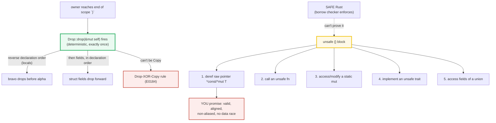

# DROP_UNSAFE — The `Drop` Trait (RAII) and the `unsafe` Escape Hatch

> **One-line goal:** the `Drop` trait lets you run cleanup code **deterministically**
> when an owner goes out of scope (RAII); `unsafe` is the **escape hatch** that
> unlocks five things the borrow checker can't check, where **you** promise the
> invariants the compiler cannot prove.
>
> **Run:** `just run drop_unsafe` (== `cargo run --bin drop_unsafe`)
> **Member:** `core` (stdlib-only — no `[dependencies]`).
> **Prerequisites:** 🔗 [OWNERSHIP](./OWNERSHIP.md) — you must already understand
> "one owner, drops at `}`, exactly once." This bundle *customizes* that drop and
> then steps *outside* the safety guarantees to see what the compiler refuses to
> prove.
> **Ground truth:** [`drop_unsafe.rs`](./drop_unsafe.rs); captured stdout:
> [`drop_unsafe_output.txt`](./drop_unsafe_output.txt).

---

## Why this exists (lineage)

[OWNERSHIP](./OWNERSHIP.md) established the third ownership rule — *"when the
owner goes out of scope, the value is dropped."* But it treated drop as a black
box. This bundle opens that box:

1. **`Drop`** is the trait that *runs your code* at that `}`. It is the mechanism
   behind every RAII guard in Rust — `Box` freeing the heap, `Vec` freeing its
   buffer, `MutexGuard` releasing the lock, a file handle closing the fd. The
   compiler inserts the call; you never write `free`.
2. **`unsafe`** is the complementary escape hatch. Rust's safety is a *conservative
   static approximation*: the borrow checker rejects some *valid* programs because
   it can't prove them. `unsafe` is where you say "I checked the invariant myself;
   trust me." The price is that **you** now own the proof — get it wrong and you
   get Undefined Behavior (UB), the thing Rust exists to prevent.



> **The one mental model for `unsafe`.** It does **not** turn off the borrow
> checker. It does **not** mean "dangerous." It means: *"inside this block, five
> specific operations are allowed, and **I** assert their invariants hold."* The
> Book: "`unsafe` doesn't turn off the borrow checker or disable any of Rust's
> other safety checks… The `unsafe` keyword only gives you access to these five
> features that are then not checked by the compiler for memory safety."
> ([Book ch20.1][book-unsafe]).

---

## Section A — The `Drop` trait: RAII, deterministic, reverse-order cleanup

`Drop` is the trait that customizes the `}`. You implement one method:

```rust
impl Drop for MyType {
    fn drop(&mut self) {
        // cleanup: free memory, release a lock, close a file, print, ...
    }
}
```

The compiler inserts a call to this at the end of the owner's scope. You never
call it yourself (that's a compile error — see Section B).

> **From drop_unsafe.rs Section A:**
> ```
> ======================================================================
> SECTION A — the Drop trait: RAII, deterministic, reverse-order cleanup
> ======================================================================
>   created alpha, then bravo
> [check] no Drop runs while the owners are still in scope: OK
>     (drop fires: bravo)
>     (drop fires: alpha)
>   recorded drop order: ["bravo", "alpha"]
> [check] locals drop in REVERSE declaration order: bravo then alpha: OK
> ```

**What.** A `DropSpy` records its name into a shared `RefCell<Vec<&str>>` when
dropped. Two spies — `alpha` then `bravo` — live in one block. The first check
proves nothing fires while both are alive; the closing `}` fires drop glue, and
the recorded order is **`["bravo", "alpha"]`** — `bravo` drops *before* `alpha`,
even though `alpha` was declared first.

**Why (internals).**
- **Deterministic & exactly once.** Unlike a GC finalizer (which may never run, or
  run at an unknowable time), Rust's drop is guaranteed to run **exactly once** at
  a known place: the `}`. That is what makes `MutexGuard`, `Box`, and file handles
  safe to implement as `Drop` impls — if the owner is reachable, cleanup happened.
  ([Book ch15.3][book-drop]).
- **Drop order for locals is REVERSE declaration order.** The Rust Reference:
  *"When control flow leaves a drop scope all variables associated to that scope
  are dropped in reverse order of declaration."* ([Reference — Destructors][ref-destructors]).
  This is a **soundness requirement**: a later binding may borrow an earlier one,
  so the borrower must die *before* the thing it borrows — i.e. last-declared,
  first-dropped. That is exactly the `bravo`-then-`alpha` order printed above.
- **But struct FIELDS drop in DECLARATION (forward) order.** This is the subtle
  twin rule: the destructor of a struct runs `<T as Drop>::drop` first, *then*
  recurses into fields **in declaration order** ([Reference][ref-destructors]).
  So *locals* reverse, *fields* forward. The rule that bites juniors: a field
  declared *after* another can observe the earlier field still alive during drop.
- **`Drop` takes `&mut self`, not `self`.** You cannot accidentally move the value
  out of its own destructor — `&mut` only lets you mutate fields, not consume the
  value. (To "move out" during drop you need `Option<T>` + `take()`, or
  `ManuallyDrop`/`MaybeUninit` — advanced tools outside this bundle's scope.)

> **Interior mutability, again.** The shared recorder is `RefCell<Vec<&str>>`
> borrowed through `&RefCell` by *two* spies. `RefCell` provides mutation through a
> shared reference (runtime-tracked borrows), so `drop(&mut self)` can push into a
> Vec that lives outside the spy. 🔗 [INTERIOR_MUTABILITY](./INTERIOR_MUTABILITY.md)
> covers `RefCell`/`UnsafeCell` in depth; `UnsafeCell` is in fact *the* primitive
> that makes *all* interior mutability sound (and is itself `unsafe`-adjacent).

---

## Section B — `std::mem::drop` forces an EARLY drop

Sometimes you can't wait for the `}` — releasing a `MutexGuard` mid-scope, closing
a file before reopening it. Rust forbids calling `Drop::drop` by hand (that would
risk a double-free, since the compiler *also* drops at the `}`). The escape is
`std::mem::drop`, which is **literally**:

```rust
pub fn drop<T>(_x: T) {}   // the entire stdlib definition — it is not magic
```

> **From drop_unsafe.rs Section B:**
> ```
> ======================================================================
> SECTION B — std::mem::drop forces an EARLY drop (before scope end)
> ======================================================================
>   created xray
> [check] nothing dropped yet: OK
>     (drop fires: xray)
>   after std::mem::drop(_x): ["xray"]
> [check] std::mem::drop runs Drop IMMEDIATELY, not at scope end: OK
>   (scope continues after the early drop)
>   after block closed: ["xray"]
> [check] no double-drop: xray is NOT dropped again at scope end: OK
> ```

**What.** Three checks pin the timing: (1) `std::mem::drop(_x)` runs `Drop`
**immediately** at the call site — the recorder shows `["xray"]` *before* the
block ends; (2) the scope visibly *continues* after the early drop; (3) there is
**no double-drop** — `xray` is not dropped again at the `}`.

**Why (internals).**
- `std::mem::drop(x)` works purely through ownership: `_x: T` takes the value **by
  value** (a move), and because `_x` is never used it drops at the end of the
  function body — i.e. right there at the call. No runtime support; it is
  ownership all the way down. ([std::mem::drop docs][std-drop]).
- The `_` name inside the function marks "intentionally unused." **Do not confuse
  this with `let _ = expr;` at the use site** (see pitfalls): `let _ = guard;`
  drops *immediately*, whereas `let _x = guard;` (a named binding, even one
  starting with `_`) lives to the `}`.

**The compile error you can't put in a runnable file** — calling the trait method
by hand is forbidden (`error[E0040]`). From the Book ([ch15.3][book-drop]):

```console
error[E0040]: explicit use of destructor method
  --> src/main.rs:16:7
   |
16 |     c.drop();
   |       ^^^^ explicit destructor calls not allowed
   |
help: consider using `drop` function
   |
16 -     c.drop();
16 +     drop(c);
```

The compiler forces you through `std::mem::drop` precisely so it can guarantee
drop runs **once** — never twice. 🔗 [OWNERSHIP](./OWNERSHIP.md) Section D
demonstrates `std::mem::drop` and reassignment-drops-old-value in the ownership
context.

---

## Section C — Drop-XOR-Copy: a type with `Drop` CANNOT be `Copy` (E0184)

`Copy` means "duplicate by a cheap bitwise copy, both copies valid." `Drop` means
"run custom cleanup when this value dies." These are mutually exclusive: if a type
were *both*, every bitwise copy would later trigger its destructor — calling
`drop` twice on the same underlying resource (a double-free). Rust forbids the
combination outright.

> **From drop_unsafe.rs Section C:**
> ```
> ======================================================================
> SECTION C — Drop-XOR-Copy: a type with Drop CANNOT be Copy (E0184)
> ======================================================================
>   Point is Copy: p1=(1, 2)  p2=(1, 2)  (both valid)
> [check] Copy type duplicates: both p1 and p2 stay valid and equal: OK
> [check] Copy type needs NO drop glue (needs_drop::<Point>() == false): OK
> [check] a Drop type needs drop glue (needs_drop::<DropSpy>() == true): OK
>   RULE: `impl Drop for T` forbids `impl Copy for T`.
>   // error[E0184]: the trait `Copy` cannot be implemented for this type;
>   //              the type has a destructor
>   // (see DROP_UNSAFE.md for the full compiler message)
> ```

**What.** `Point(i32, i32)` derives `Copy, Clone` (and has no `Drop`): `let p2 =
p1;` is a copy, and **both** `p1` and `p2` stay valid. `std::mem::needs_drop::<Point>()`
is `false`. The `DropSpy` from Section A, by contrast, implements `Drop`, so
`needs_drop::<DropSpy>()` is `true` — and it is therefore move-only.

**Why (internals).**
- `std::mem::needs_drop::<T>()` is a **type-level** query that asks "does `T`, or
  any of its fields recursively, require drop glue?" It returns `false` for all
  `Copy` types (a `Copy` type by definition has no `Drop` and no non-`Copy`
  fields). This is the compiler's cheap way to skip destructors for `i32`/`f64`/
  tuples-of-`Copy` — zero-cost drop.
- The `Drop`-XOR-`Copy` rule is enforced as a **hard compile error**, E0184. The
  exact message (verified by compiling the offending snippet):

```console
error[E0184]: the trait `Copy` cannot be implemented for this type; the type has a destructor
 --> x.rs:2:8
  |
1 | #[derive(Copy, Clone)]
  |          ---- in this derive macro expansion
2 | struct Foo;
  |        ^^^ `Copy` not allowed on types with destructors
  |
note: destructor declared here
 --> x.rs:4:5
  |
4 |     fn drop(&mut self) {}
  |        ^^^^^^^^^^^^^^^^^^
```

> 🔗 [COPY_CLONE](./COPY_CLONE.md) — the full story of which types are `Copy`
> (cheap, implicit) versus `Clone` (explicit, possibly deep), and why this XOR
> rule exists.

---

## Section D — The `unsafe` superpowers

The Book calls them *"unsafe superpowers"* — the operations that are only legal
inside an `unsafe` block. The Book and Rustonomicon enumerate **five** ([Book
ch20.1][book-unsafe], [Nomicon][nomicon-what]). This bundle teaches the four
that you will actually meet first (and notes the fifth, `union` access, which is
mostly an FFI concern):

| # | Superpower | The invariant YOU must prove |
|---|---|---|
| 1 | **Dereference a raw pointer** `*const T` / `*mut T` | The pointer is non-null, aligned, points to a valid initialized `T`, and isn't aliased in a way that violates the borrow rules. |
| 2 | **Call an `unsafe fn`** (Section E) | Every `# Safety` obligation documented on that function is satisfied by the arguments at this call site. |
| 3 | **Access/modify a `static mut`** | No concurrent access from other threads (no data race); or you've synchronized it yourself. |
| 4 | **Implement an `unsafe trait`** (Section F) | The trait's safety contract holds for your type (e.g. it really is sound to `Send`/`Sync`). |
| 5 | **Access fields of a `union`** | The field you read is the one that was last written (else the bit pattern may be an invalid value for the type). |

> **From drop_unsafe.rs Section D:**
> ```
> ======================================================================
> SECTION D — the 4 unsafe superpowers (trivially-sound examples)
> ======================================================================
>   `unsafe` unlocks FOUR things the borrow checker cannot check:
>     1) dereference a raw pointer (*const T / *mut T)   <- shown below
>     2) call an `unsafe fn`                            <- Section E
>     3) access/modify a mutable static (static mut)    <- shown below
>     4) implement an `unsafe trait`                    <- Section F
>   (the Book & Rustonomicon also list a 5th: access fields of a `union`)
>   NOTE: `unsafe` does NOT disable the borrow checker - it is a PROMISE
>   let x = 42i32; let p: *const i32 = &x; unsafe { *p } = 42
> [check] unsafe deref of a valid, aligned, non-aliased pointer reads 42: OK
>   static mut COUNTER; unsafe { COUNTER += 3; } -> 3
> [check] unsafe can modify a mutable static (single-threaded => no data race): OK
> ```

**Superpower #1 — dereference a raw pointer.** `let p: *const i32 = &x;` *creates*
a raw pointer — that part is **safe** (creating a pointer does no harm). It is the
`*p` **dereference** that must live in `unsafe`. The example is trivially sound:
`x` is alive on the stack, properly aligned for `i32`, and not mutably aliased
during the read, so `*p` reads `42`. Raw pointers differ from references in four
ways the Book lists ([ch20.1][book-unsafe]): they may **ignore borrowing rules**
(coexist `*const` and `*mut` to one location), are **not guaranteed valid**, may
be **null**, and have **no automatic cleanup**.

**Superpower #3 — access/modify a `static mut`.** A mutable global is a data-race
magnet (any thread could read/write concurrently), so all access is `unsafe`.
Here it is sound because `main` is single-threaded. Note the edition-2024 detail:
**you may not take a shared/mutable reference to a `static mut`** (the
`static_mut_refs` lint denies it). Writes go through the place directly
(`COUNTER += 3`); reads go through a **raw pointer** created with `&raw const`
(the raw borrow operator) and then dereferenced in the `unsafe` block — exactly
the pattern the Book uses ([ch20.1][book-unsafe], Listing 20-11).

**Why (internals) — what counts as Undefined Behavior.** The Rustonomicon is
specific about what `unsafe` can get wrong ([Nomicon][nomicon-what]):
dereferencing **dangling or unaligned** pointers; **breaking the pointer aliasing
rules**; calling a function with the **wrong ABI**; causing a **data race**;
producing **invalid values** (a `bool` that isn't 0/1, an `enum` with a bad
discriminant, a `char` out of range, a reference/`Box` that is dangling or
misaligned, etc.). Invoking UB "gives the compiler full rights to do arbitrarily
bad things to your program." Crucially, Rust considers it **safe** to deadlock,
race (logically), leak memory, or overflow integers with `+` — those are bugs but
not *memory*-unsafety. The line between "logic bug" and "UB" is what `unsafe`
guards.

---

## Section E — `unsafe fn`: the caller upholds the contract

An `unsafe fn` is a function with **extra safety conditions the compiler does not
check** — documented in a `# Safety` section. Calling it requires an `unsafe`
block, which is you asserting *"I read the docs and I'm satisfying the contract."*

```rust
/// Read `slice[idx]` WITHOUT a bounds check.
///
/// # Safety
/// The caller MUST guarantee `idx < slice.len()`. An out-of-bounds index is
/// Undefined Behavior (no bounds check is performed).
unsafe fn get_unchecked(slice: &[i32], idx: usize) -> i32 {
    unsafe {
        // SAFETY: caller guaranteed idx < slice.len().
        *slice.as_ptr().add(idx)
    }
}
```

> **From drop_unsafe.rs Section E:**
> ```
> ======================================================================
> SECTION E — unsafe fn: the CALLER upholds the safety contract
> ======================================================================
>   unsafe get_unchecked(&[10,20,30,40], 2) -> 30
> [check] unsafe fn returns the in-bounds element when the contract is upheld: OK
>   // CONTRACT (on the fn): caller MUST pass idx < slice.len().
>   // Passing idx >= len skips the bounds check -> Undefined Behavior.
> ```

**What.** `get_unchecked(&v, 2)` returns `30` because index `2` is in bounds
(`v.len() == 4`). The check confirms the value is correct **when the contract
holds**.

**Why (internals).**
- This mirrors the standard library's own
  [`slice::get_unchecked`](https://doc.rust-lang.org/std/primitive.slice.html#method.get_unchecked)
  and the Book's hand-rolled `split_at_mut` ([ch20.1][book-unsafe], Listing 20-6):
  a **safe abstraction** built *over* `unsafe`. The function itself is *not* marked
  `unsafe` to its users in the stdlib case — the `assert!(mid <= len)` inside
  discharges the obligation, so callers get a safe API. That is the idiom: **wrap
  a small `unsafe` kernel in a safe function that enforces the precondition**, so
  unsafety never leaks.
- **Edition-2024 nuance:** inside an `unsafe fn`, unsafe operations still need
  their **own** `unsafe {}` block. The `unsafe_op_in_unsafe_fn` lint is
  warn-by-default in edition 2024 (and an error under `-D warnings`, which this
  workspace enforces). The Reference frames the duality ([Reference — unsafe
  keyword][ref-unsafe]): an `unsafe fn` *defines* a proof obligation for callers;
  an `unsafe {}` block *discharges* one. The two are duals.
- **Idiomatic `SAFETY` comments.** Per the Book, every `unsafe` op should carry a
  comment starting with `SAFETY:` explaining *how* the invariant is upheld, and
  every `unsafe fn` a `# Safety` doc section. This file follows that discipline.

> 🔗 **FFI** (Phase 8) — `extern "C"` items are declared in `unsafe extern`
> blocks and are themselves unsafe to call: the canonical real-world `unsafe fn`.

---

## Section F — `unsafe impl`: you assert a trait's contract for your type

Some traits are **`unsafe` to implement** — they carry an invariant the compiler
can't verify. The most common are the `Send` and `Sync` marker traits: the
compiler auto-impls them when all your fields are `Send`/`Sync`, but a raw pointer
(`*const T`/`*mut T`) is **neither** by default. If your wrapper genuinely *is*
thread-safe, you take on the proof yourself:

```rust
struct OwnedPtr(*mut u8);

// SAFETY: OwnedPtr is single-owner-per-thread; the pointer is never shared or
// mutated concurrently, so moving the wrapper across threads is race-free.
unsafe impl Send for OwnedPtr {}
```

> **From drop_unsafe.rs Section F:**
> ```
> ======================================================================
> SECTION F — unsafe impl Send: YOU assert thread-safety the compiler can't
> ======================================================================
> [check] OwnedPtr satisfies Send (we asserted it via `unsafe impl Send`): OK
> [check] a Send wrapper moves into std::thread::spawn and joins back: OK
>   // NEGATIVE (not runnable): a bare `*mut u8` is NOT Send; a closure
>   // that captures one fails to compile (E0277) - hence the wrapper.
> ```

**What.** Two checks: (1) `OwnedPtr` satisfies `Send` (a compile-time fact the
`is_send::<OwnedPtr>()` witness surfaces as a runtime `true`); (2) the wrapper
can actually **move into a spawned thread** and join back — the concrete point of
`Send`.

**Why (internals).**
- The whole reason `Send`/`Sync` are `unsafe trait`s is exactly the raw-pointer
  case: the Book — "if we implement a type that contains a type that does not
  implement `Send` or `Sync`, such as raw pointers, and we want to mark that type
  as `Send` or `Sync`, we must use `unsafe`" ([ch20.1][book-unsafe]). `unsafe impl`
  is you promising the compiler "I checked; this type really can cross threads
  soundly."
- **The closure-capture subtlety this bundle demonstrates.** A naive
  `move || owned.0.is_null()` would **fail to compile** under edition 2021+'s
  *disjoint closure capture*: the closure would grab only the `*mut u8` field
  (which is not `Send`) instead of the whole wrapper. The fix used here is to
  move the *whole* `OwnedPtr` into a local first (`let wrapper: OwnedPtr = owned;`),
  forcing the closure to capture the wrapper — which **is** `Send`. That is the
  kind of detail that separates "I wrote `unsafe impl Send`" from "it actually
  compiles and crosses threads."

**The negative case (not runnable — it would not compile), E0277:**

```console
error[E0277]: `*mut u8` cannot be sent between threads safely
   |
   |     let handle = std::thread::spawn(move || {
   |                    ^^^^^^^^^^^^^^^^^^ `*mut u8` cannot be sent between threads safely
   |
   = help: within the closure, the trait `Send` is not implemented for `*mut u8`
```

This is exactly the error the `unsafe impl Send for OwnedPtr` exists to lift.
🔗 [BOX_RC_ARC](./BOX_RC_ARC.md) — why `Rc` is `!Send` (refcount races) while
`Arc` is `Send` (atomic refcounts); the `Send`/`Sync` distinction is the hinge.

---

## Pitfalls (the expert payoff)

| Trap | Symptom | Fix / why |
|---|---|---|
| **Calling `Drop::drop` by hand** | `error[E0040]: explicit use of destructor method` | Use `std::mem::drop(x)`. The compiler *also* drops at the `}`, so a manual call would double-free. |
| **Expecting fields to drop in reverse order** | A field's `Drop` sees an already-freed sibling | *Locals* drop reverse-declaration; *struct fields* drop in **declaration (forward) order**, *after* `<T as Drop>::drop` runs. Declare fields so dependents outlive their dependencies. |
| **`Drop` + `Copy` together** | `error[E0184]: …the type has a destructor` | They are mutually exclusive (a `Copy` of a `Drop` type would call `drop` twice). Drop ⇒ move-only; Copy ⇒ no custom drop. |
| **Reading a `static mut` via `&X`** | `static_mut_refs` lint (deny in ed. 2024) | Use the raw borrow operator `&raw const X` / `&raw mut X` and deref in `unsafe`; or restructure with an atomic / `Mutex`. |
| **`*p` on a dangling/uninitialized pointer** | silent UB, crashes, or "impossible" miscompiles | `unsafe` is a *promise*, not a check. The pointer must be non-null, aligned, valid, and non-aliased. Validate with `NonNull`, use `MaybeUninit` for uninitialized. |
| **`unsafe fn` body with no inner `unsafe {}`** | `unsafe_op_in_unsafe_fn` warning (error under `-D warnings`) in edition 2024 | Wrap each unsafe op in its own `unsafe {}` (or enable the lint deliberately). Keeps unsafe surface tiny. |
| **Thinking `unsafe` disables the borrow checker** | "but I'm in an unsafe block!" still E0xxx | It does not. Borrows, lifetimes, and moves are still checked. `unsafe` only grants the five superpowers. |
| **`unsafe impl Send` for a type that isn't** | latent data race / UB you can't see locally | The `unsafe impl` is a *claim*. You must prove no concurrent mutable aliasing exists. When unsure, don't — let the auto-trait defaults apply. |
| **`move || wrapper.field` not crossing threads** | `E0277` for `*mut T` despite `unsafe impl Send` | Edition 2021+ disjoint capture grabs the field, not the wrapper. Move the whole wrapper into a local inside the closure first. |
| **`let _ = guard;` vs `let _g = guard;`** | a `MutexGuard`/spy releases instantly (or never) | `let _ = expr;` drops **immediately**; a *named* binding (even `_g`) lives to the `}`. 🔗 [OWNERSHIP](./OWNERSHIP.md) pitfalls. |
| **Forgetting `SAFETY:` docs** | unmaintainable `unsafe`, future-you breaks the invariant | Every `unsafe` op → a `SAFETY:` comment; every `unsafe fn` → a `# Safety` section. The Book's prescribed discipline. |
| **Trusting `unsafe` callers** | a public `unsafe fn` called unsoundly → your crate is blamed | Either make the API safe (assert the precondition internally) or document the obligation loudly and make it hard to misuse. |

---

## Cheat sheet

```rust
// ── DROP: RAII, deterministic, exactly once ──────────────────────────────────
impl Drop for T {
    fn drop(&mut self) { /* cleanup at the `}` */ }
}
// Locals drop in REVERSE declaration order (b then a).
// Struct FIELDS drop in DECLARATION (forward) order, after Drop::drop.
// Drop XOR Copy: impl Drop => NOT Copy (E0184). Copy => no Drop glue.

std::mem::drop(x);   // force an EARLY drop. Is literally:  pub fn drop<T>(_x: T){}
// x.drop();         // E0040 — explicit destructor calls are forbidden.

// ── UNSAFE: five superpowers, each = a PROMISE you make ──────────────────────
// 1. dereference a raw pointer        *const T / *mut T
// 2. call an unsafe fn                (caller upholds its # Safety contract)
// 3. access/modify a static mut       (no data race; read via &raw const)
// 4. implement an unsafe trait        (e.g. unsafe impl Send for MyType)
// 5. access fields of a union         (the field written last)

let x = 42i32;
let p: *const i32 = &x;          // creating a raw ptr is SAFE
let v = unsafe { *p };           // the DEREF is the unsafe op (promise: valid)
assert_eq!(v, 42);

unsafe fn get_unchecked(s: &[i32], i: usize) -> i32 {
    unsafe { *s.as_ptr().add(i) }   // ed.2024: inner unsafe{} still required
}
let n = unsafe { get_unchecked(&[10,20,30], 1) };   // = 20 (in-bounds)

struct OwnedPtr(*mut u8);
unsafe impl Send for OwnedPtr {}     // YOU assert thread-safety

// RULE: `unsafe` does NOT turn off the borrow checker. It grants five ops and
// makes YOU responsible for: valid/aligned/non-aliased pointers, no data races,
// no invalid values. Get it wrong => Undefined Behavior.
```

---

## Sources

Every claim above was web-verified in at least two authoritative places.

- **The Rust Programming Language, ch15.3 "Running Code on Cleanup with the Drop
  Trait"** — RAII, `fn drop(&mut self)`, reverse-creation drop order, why you
  cannot call `Drop::drop` manually (use `std::mem::drop`), the `E0040`
  "explicit use of destructor method" error:
  https://doc.rust-lang.org/book/ch15-03-drop.html
- **The Rust Programming Language, ch20.1 "Unsafe Rust"** — the *five* unsafe
  superpowers (deref raw pointer; call unsafe fn; access/modify mutable static;
  implement unsafe trait; access union fields); "`unsafe` doesn't turn off the
  borrow checker"; raw pointer properties; the `split_at_mut` safe-abstraction
  example; `Send`/`Sync` + raw pointers require `unsafe impl`; `SAFETY:` comment
  discipline; `&raw const`/`static_mut_refs` for mutable statics:
  https://doc.rust-lang.org/book/ch20-01-unsafe-rust.html
- **The Rustonomicon — "What Unsafe Rust Can Do"** — the five capabilities and the
  full list of what constitutes Undefined Behavior (dangling/unaligned pointers,
  aliasing violations, wrong ABI, data races, invalid values); what Rust
  considers *safe* despite being a bug (deadlock, leak, integer overflow):
  https://doc.rust-lang.org/nomicon/what-unsafe-does.html
- **The Rust Reference — "The `unsafe` keyword"** — `unsafe fn` defines a proof
  obligation for callers, `unsafe {}`/`unsafe impl` discharge one; the duality;
  edition-2024 `unsafe extern` and `#[unsafe(..)]` attributes:
  https://doc.rust-lang.org/reference/unsafe-keyword.html
- **The Rust Reference — "Destructors"** — drop scopes; *"variables… dropped in
  reverse order of declaration"*; struct fields dropped in declaration order;
  `Drop::drop` runs before field destructors; `mem::forget`/`ManuallyDrop` to
  suppress:
  https://doc.rust-lang.org/reference/destructors.html
- **`std::mem::drop` docs** — the literal definition `pub fn drop<T>(_x: T) {}`,
  "it is not magic", the `Copy`-no-op behavior, the `RefCell` borrow-release
  example:
  https://doc.rust-lang.org/std/mem/fn.drop.html
- **`error[E0184]`** — *"the trait `Copy` cannot be implemented for this type; the
  type has a destructor"* — reproduced verbatim by compiling
  `#[derive(Copy, Clone)] struct Foo; impl Drop for Foo {…}` (the Drop-XOR-Copy
  rule as a hard compile error).
