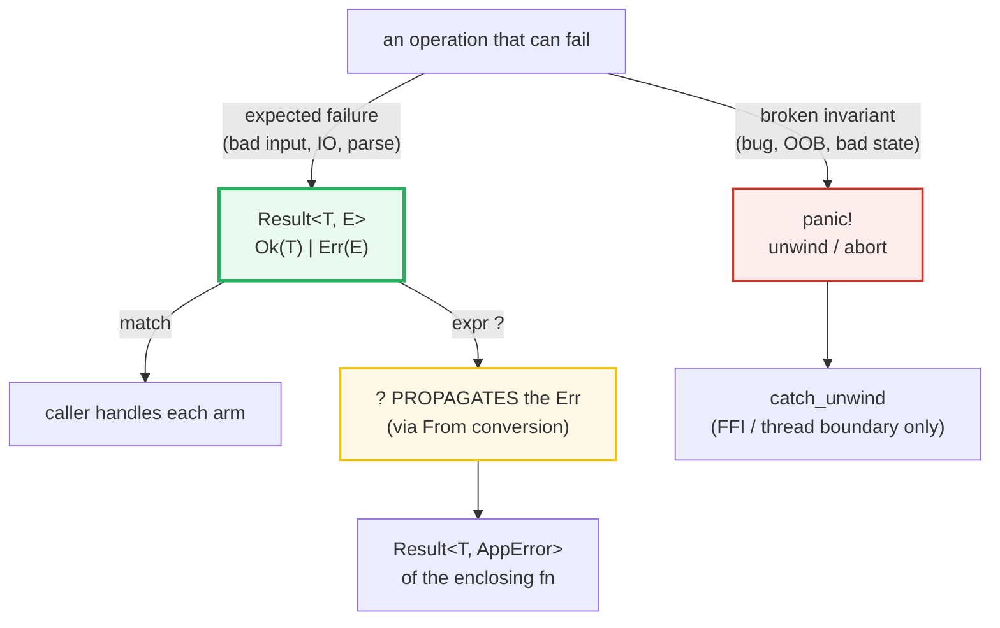
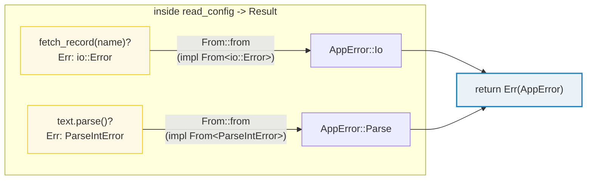
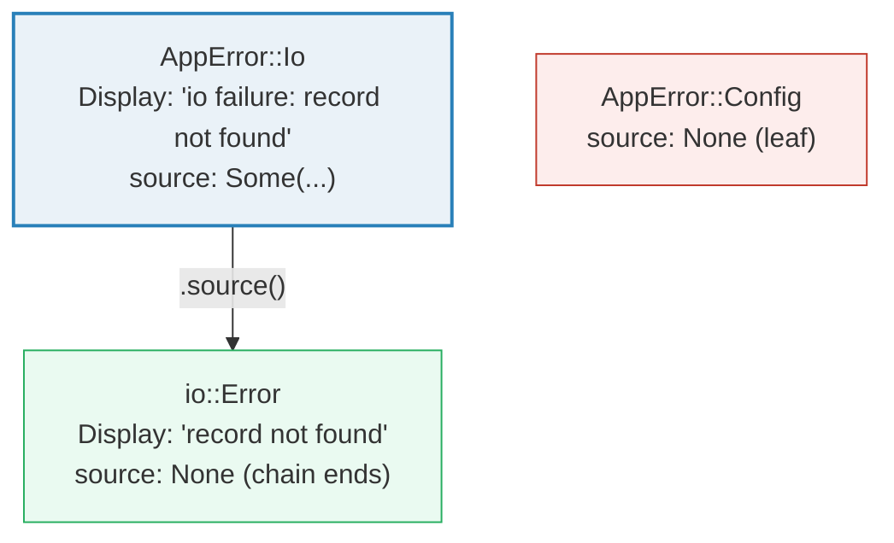

# ERROR_HANDLING — `Result`, `?`, and the `Error` Trait Trio

> **One-line goal:** Rust has **no exceptions** — recoverable failures are
> `Result<T, E>` (handled by `match` or `?`), unrecoverable failures are
> `panic!`, and a custom error type is a hand-written **`Debug + Display + Error`
> trio** with `From` impls that make `?` **adapt** one error type into another.
>
> **Run:** `just run error_handling` (== `cargo run --bin error_handling`)
> **Member:** `core` (stdlib-only — no `[dependencies]`; `thiserror`/`anyhow`
> are **documented, not imported** — the trio is built by hand).
> **Prerequisites:** 🔗 [CONTROL_FLOW](./CONTROL_FLOW.md) (`match`), 🔗
> [STRUCTS_ENUMS](./STRUCTS_ENUMS.md) (`Result`/`Option` are enums), 🔗
> [TRAITS_BASICS](./TRAITS_BASICS.md) (the `Error`/`Display`/`From` traits).
> **Ground truth:** [`error_handling.rs`](./error_handling.rs); captured stdout:
> [`error_handling_output.txt`](./error_handling_output.txt).

---

## Why this exists (lineage)

Most mainstream languages give you **exceptions**: a `throw` jumps up the call
stack, unwinding through every frame until a `catch` claims it (Java, C++,
Python, JS). Rust rejects that model entirely. There is **no `throw`, no
`catch`, no exception hierarchy**. Instead, failure is a **plain value** modeled
by two enums, and the decision of "recoverable or not" is made *by the type*:

| Failure kind | Mechanism | Who decides recovery? | Cost |
|---|---|---|---|
| **Recoverable** (file missing, bad parse, rate-limited) | `Result<T, E>` | **the caller** — `match` on it, or `?` to propagate | a value, no unwind |
| **Unrecoverable** (broken invariant, bug, OOB index) | `panic!` | **nobody** — the thread unwinds and dies | stack unwind (or abort) |

The Book's framing (ch9.3): *"When code panics, there's no way to recover... When
you choose to return a `Result` value, you give the calling code options."*
([Book ch9.3][book-panic-or-not]). `Result` is therefore the **default** for any
operation that can legitimately fail; `panic!` is reserved for "a contract was
violated and the caller has a bug."



The whole bundle is the machinery behind that diagram: `Result` + `?` (Section
A), a custom `Error` type (B), the `From` conversion that makes `?` polymorphic
(C), the `source()` cause chain (D), the `Option`↔`Result` bridges (E), and the
`panic!` vs `Result` line (F).

---

## The `Error` trait trio (memorize this)

A custom error type implements **three** things, and only `source` is optional.
The std definition is the load-bearing fact ([`std::error::Error`][std-error]):

```rust
pub trait Error: Debug + Display {   // Debug + Display are SUPERTRAIT requirements
    fn source(&self) -> Option<&(dyn Error + 'static)> { None } // provided default
}
```

- **`Debug`** — the `{:?}` form; the *programmer-facing* diagnostic (used in
  `unwrap`/`expect` panic messages and backtraces). Usually `#[derive(Debug)]`.
- **`Display`** — the `{}` form; the *user-facing* message. The std convention:
  *"Error messages are typically concise lowercase sentences without trailing
  punctuation"* ([`std::error::Error`][std-error]).
- **`Error::source()`** — the *optional lower-level cause*. Std guidance: *"In
  error types that wrap an underlying error, the underlying error should be
  either returned by `source()`, or rendered by `Display`, but not both"*
  ([`std::error::Error`][std-error]).

> **Why hand-roll it?** The `thiserror` crate DERIVES exactly this with
> `#[derive(Error)]` + `#[error("...")]` + `#[from]`. This bundle writes the
> three impls by hand so you can see precisely what the macro emits — then, in
> real code, you reach for `thiserror` (typed, `enum`-based errors) or `anyhow`
> (a single opaque `anyhow::Error` for applications) instead. See the cheat
> sheet and [Sources](#sources). 🔗 [TRAITS_BASICS](./TRAITS_BASICS.md) covers
> supertraits and `impl Trait`; here `Error: Debug + Display` is a supertrait
> bound.

---

## Section A — `Result<T, E>`: `Ok`/`Err`, `match`, and the `?` shortcut

```rust
enum Result<T, E> { Ok(T), Err(E) }   // T = success value; E = error
```

> **From error_handling.rs Section A:**
> ```
> ======================================================================
> SECTION A — Result<T,E>: Ok/Err, match, and the ? shortcut
> ======================================================================
>   enum Result<T, E> { Ok(T), Err(E) }
>   (T = success value type; E = error type)
>     "42".parse::<i32>()  = Ok(42)
>     "NaN".parse::<i32>() = Err(ParseIntError { kind: InvalidDigit })
>     match on Ok extracts the inner value: 42
> [check] match on Ok extracts the inner value (42): OK
>     read_config("42")      = Ok(42)
>     read_config("missing") = Err(Io(Custom { kind: NotFound, error: "record not found" }))
>     read_config("NaN")     = Err(Parse(ParseIntError { kind: InvalidDigit }))
> [check] read_config("42") propagates the Ok value (42): OK
> [check] read_config("missing") early-returns Err via ? (io path): OK
> [check] read_config("NaN") early-returns Err via ? (parse path): OK
> ```

**What.** `"42".parse::<i32>()` is `Ok(42)`; `"NaN".parse::<i32>()` is
`Err(ParseIntError { .. })`. You handle a `Result` either by **`match`** (the
exhaustive, explicit path — first check) or by **`?`** inside a `Result`-returning
function. `read_config` uses `?` on *two* different error types and returns a
single unified `Result<i32, AppError>`:

```rust
fn read_config(name: &str) -> Result<i32, AppError> {
    let text = fetch_record(name)?;        // ? : io::Error      -> AppError
    let n: i32 = text.trim().parse()?;     // ? : ParseIntError -> AppError
    Ok(n)
}
```

The three trailing checks pin the propagation: `"42"` → `Ok(42)`, `"missing"` →
`Err(AppError::Io(..))` (the io path), `"NaN"` → `Err(AppError::Parse(..))` (the
parse path).

**Why (internals).** The Book defines `?` exactly: *"If the value of the
`Result` is an `Ok`, the value inside the `Ok` will get returned from this
expression... If the value is an `Err`, the `Err` will be returned from the
whole function as if we had used the `return` keyword"* ([Book ch9.2][book-result]).
So `expr?` is shorthand for:

```rust
match expr {
    Ok(v) => v,                  // unwrap the success, keep going
    Err(e) => return Err(e.into()), // early-return the error (with a From cast)
}
```

The `.into()` (the `From` conversion) is the magic that lets `read_config` `?` an
`io::Error` and a `ParseIntError` even though its return type is `AppError` — see
Section C. The Book: *"Error values that have the `?` operator called on them go
through the `from` function, defined in the `From` trait... the error type
received is converted into the error type defined in the return type of the
current function"* ([Book ch9.2][book-result]).

**Where you may use `?`.** Only in a function whose return type is *compatible*
with it — i.e. a `Result`, an `Option`, or any type implementing `FromResidual`
([Book ch9.2][book-result]). Using `?` in a plain `fn main() -> ()` is a compile
error (`E0277`):

```console
error[E0277]: the `?` operator can only be used in a function that returns
              `Result` or `Option` (or another type that implements `FromResidual`)
  | fn main() {
  | --------- this function should return `Result` or `Option` to accept `?`
  |     let f = File::open("x")?;
  |                                ^ cannot use `?` in a function that returns `()`
help: consider adding return type
  | fn main() -> Result<(), Box<dyn std::error::Error>> {
```

> **Fix:** make `main` return `Result<(), E>`. The Book's canonical choice is
> `Result<(), Box<dyn Error>>` — a trait object meaning "any error" — which works
> with `?` because of a blanket `impl<E: Error> From<E> for Box<dyn Error>`
> ([Listing 9-12][book-result]; [`std::error::Error`][std-error]). A `main`
> returning `Ok(())` exits with code `0`; `Err` exits nonzero.

🔗 [CONTROL_FLOW](./CONTROL_FLOW.md) — `match` exhaustiveness is what makes
`Result` handling total. 🔗 [STRUCTS_ENUMS](./STRUCTS_ENUMS.md) — `Result` is a
2-variant generic enum; `Ok`/`Err` are its constructors.

---

## Section B — A hand-written custom error type (`Debug + Display + Error`)

```rust
#[derive(Debug)]
enum AppError {
    Io(io::Error),            // wraps an io::Error
    Parse(ParseIntError),     // wraps a parse error
    Config(String),           // a leaf error with no cause
}
```

> **From error_handling.rs Section B:**
> ```
> ======================================================================
> SECTION B — custom error type: Debug + Display + Error (by hand)
> ======================================================================
>   // `thiserror` would derive all of this; here we write it by hand:
>   #![derive(Debug)]
>   enum AppError { Io(io::Error), Parse(ParseIntError), Config(String) }
>     Display ({}):  Io     = "io failure: record not found"
>     Display ({}):  Parse  = "parse failure: invalid digit found in string"
>     Display ({}):  Config = "config failure: port out of range"
>     Debug   ({:?}): Io    = Io(Custom { kind: NotFound, error: "record not found" })
> [check] Display of AppError::Io contains the inner io message: OK
> [check] Display of AppError::Config shows its message: OK
> [check] AppError implements std::error::Error (usable as &dyn Error): OK
> ```

**What.** Three impls, all written by hand:

```rust
impl fmt::Display for AppError {
    fn fmt(&self, f: &mut fmt::Formatter<'_>) -> fmt::Result {
        match self {                                  // a match over variants
            AppError::Io(e)    => write!(f, "io failure: {e}"),
            AppError::Parse(e) => write!(f, "parse failure: {e}"),
            AppError::Config(m)=> write!(f, "config failure: {m}"),
        }
    }
}
impl Error for AppError {
    fn source(&self) -> Option<&(dyn Error + 'static)> {
        match self {
            AppError::Io(e) | AppError::Parse(e) => Some(e), // expose the cause
            AppError::Config(_)                 => None,     // leaf: no cause
        }
    }
}
```

The checks confirm: `Display` of `AppError::Io` *contains* the inner io message
(`"record not found"`), `Display` of `Config` is exactly its message, and the
type is usable as `&dyn Error` (proving it really implements the `Error` trait).

**Why (internals).**
- **`Debug + Display` are supertraits.** The trait is declared `Error: Debug +
  Display`, so you *cannot* `impl Error` without also providing both. `Debug` is
  trivially `#[derive(Debug)]`; `Display` is the one you author by hand (a
  `match` over the variants, `write!`-ing a human sentence). This is exactly what
  `#[derive(Error)]` + `#[error("...")]` in `thiserror` generates.
- **`source()` is the only real `Error` method you write**, and even it has a
  default (`None`). You override it **only when a variant wraps another error**
  you want to expose as a cause — `Io`/`Parse` do, `Config` doesn't.
- **`Display` vs `Debug` have different audiences.** `Display` (`{}`) is the
  end-user message ("io failure: record not found"); `Debug` (`{:?}`) is the
  programmer diagnostic (`Io(Custom { kind: NotFound, error: "record not found"
  })`). `unwrap()`/`expect()` print the `Debug` form in their panic; log
  frameworks usually print the `Display` form.

> **`thiserror`-style, by hand.** In production you would write the enum and add
> `#[derive(Debug, Error)]` with `#[error("io failure: {0}")]` annotations and
> `#[from]` on the wrapped fields — the derive emits the exact `Display` +
> `Error::source` + `From` impls you see here. This bundle does it manually so
> the mechanism is visible. 🔗 [TRAITS_BASICS](./TRAITS_BASICS.md) for deriving
> vs hand-implementing traits.

---

## Section C — `From<E> for AppError`: the `?`-conversion that adapts types

```rust
impl From<io::Error> for AppError { fn from(e: io::Error) -> Self { AppError::Io(e) } }
impl From<ParseIntError> for AppError { fn from(e: ParseIntError) -> Self { AppError::Parse(e) } }
```

> **From error_handling.rs Section C:**
> ```
> ======================================================================
> SECTION C — From<E> for AppError: ? converts io::Error -> AppError
> ======================================================================
>   impl From<io::Error> for AppError       { fn from(e) { AppError::Io(e) } }
>   impl From<ParseIntError> for AppError    { fn from(e) { AppError::Parse(e) } }
>   // `?` calls From::from on the Err -> the fn returns AppError.
>     AppError::from(io::Error::new(PermissionDenied, "access denied"))
>       -> Io(Custom { kind: PermissionDenied, error: "access denied" })
> [check] From<io::Error> wraps the value into AppError::Io: OK
>     read_config("missing") uses ? on an io op -> Err(Io(Custom { kind: NotFound, error: "record not found" }))
> [check] a Result<_,AppError> fn can ? an io::Error (From converts it): OK
> ```

**What.** `AppError::from(io::Error::new(PermissionDenied, "access denied"))`
produces `AppError::Io(..)` (first check). And `read_config("missing")` — which
returns `Result<_, AppError>` — successfully uses `?` on an `io::Error`-producing
call, with the conversion happening transparently (second check).

**Why (internals).** This is the **whole point** of `?` being polymorphic. The
`From` trait docs state it directly: *"The `?` operator automatically converts
the underlying error type to our custom error type with `From::from"*
([`std::convert::From`][std-from]). So inside `read_config`, the line
`fetch_record(name)?` desugars to:

```rust
match fetch_record(name) {
    Ok(v) => v,
    Err(io_err) => return Err(From::from(io_err)),  // io::Error -> AppError
}
```

The `From::from` call is what turns an `io::Error` into an `AppError::Io`. With
one `From` impl per upstream error type, **a single `?` adapts any error into
your app's error type** — no manual wrapping at every call site. `From` is also
*reflexive* (`From<T> for T` exists) and implies `Into`, so `?` on an error that
is *already* `AppError` is a no-op ([`std::convert::From`][std-from]).



> **`From` must be infallible.** The trait contract is *"intended for perfect
> conversions... must not fail"* ([`std::convert::From`][std-from]). Error-type
> conversions are always infallible (wrapping never loses information), so they
> fit perfectly. For fallible conversions, use `TryFrom` instead. 🔗
> [TRAITS_BASICS](./TRAITS_BASICS.md) / 🔗 [TRAIT_BOUNDS](./TRAIT_BOUNDS.md).

---

## Section D — `Error::source()`: walking the cause chain

```rust
impl Error for AppError {
    fn source(&self) -> Option<&(dyn Error + 'static)> {
        match self { Io(e)|Parse(e) => Some(e), Config(_) => None }
    }
}
```

> **From error_handling.rs Section D:**
> ```
> ======================================================================
> SECTION D — Error::source(): walking the cause chain
> ======================================================================
>   impl Error for AppError {
>       fn source(&self) -> Option<&(dyn Error + 'static)> {
>           match self { Io(e)|Parse(e) => Some(e), Config(_) => None }
>       }
>   }
> [check] source() on AppError::Io returns Some(inner io::Error): OK
> [check] source() on AppError::Config returns None (a leaf, no cause): OK
>     source chain from AppError::Io (2 levels):
>       [0] io failure: record not found
>       [1] record not found
> [check] the chain starts at AppError::Io and reaches its wrapped cause (>=2 levels): OK
> ```

**What.** Two checks pin the contract: `AppError::Io(..).source()` returns
`Some` (the inner `io::Error`); `AppError::Config(..).source()` returns `None`
(it is a leaf with no cause). The chain walker then follows `source()`
recursively: level `[0]` is `AppError::Io` itself (Display: `"io failure: record
not found"`), level `[1]` is the wrapped `io::Error` (Display: `"record not
found"`), and there the chain ends.

**Why (internals).**
- **`source()` crosses abstraction boundaries.** The std docs: *"`source()` is
  generally used when errors cross 'abstraction boundaries'. [A high-level
  module] can allow accessing [the lower-level] error via `source()`"*
  ([`std::error::Error`][std-error]). A library's `AppError::Io` hides *which* io
  call failed but still lets a debugger reach the original `io::Error` through
  `source()`.
- **`Option<&(dyn Error + 'static)>`.** The return is an *optional trait object*
  (🔗 [TRAIT_OBJECTS](./TRAIT_OBJECTS.md)). `None` means "I am the root cause";
  `Some(e)` means "ask `e` next". Walking until `None` reconstructs the full
  causal history — this is what error-reporting crates (`anyhow`'s `{:#}` format,
  `color-eyre`) print as "Caused by:" chains.
- **`source()` vs `Display` — pick one.** Std guidance: a wrapped cause should
  appear in *either* `source()` *or* `Display`, **not both**. Here `AppError::Io`
  mentions the inner message in `Display` for readability *and* exposes it via
  `source()` for tooling — a minor deliberate overlap; a strict library would
  have `Display` say only `"io failure"` and leave the detail to `source()`
  ([`std::error::Error`][std-error]).



---

## Section E — `Option` ↔ `Result` bridges: `ok_or` / `ok_or_else` / `.ok()` / `.err()`

> **From error_handling.rs Section E:**
> ```
> ======================================================================
> SECTION E — Option <-> Result: ok_or / ok_or_else / .ok() / .err()
> ======================================================================
>   // Option -> Result: turn None into a concrete Err.
>   // Result -> Option: discard the Err with .ok().
>     Some(5).ok_or("missing") = Ok(5)
>     None.ok_or("missing")     = Err("missing")
> [check] None.ok_or("missing") == Err("missing"): OK
> [check] Some(5).ok_or("missing") == Ok(5): OK
>     None.ok_or_else(|| "built lazily") = Err("built lazily")
> [check] ok_or_else builds the Err only on None: OK
>     Ok::<i32,&str>(5).ok()   = Some(5)
>     Err::<i32,&str>("x").ok()= None
>     Ok::<i32,&str>(5).err()  = None
> [check] Ok(5).ok() == Some(5): OK
> [check] Err("x").ok() == None: OK
>     first_line("alpha\nbeta") via ? on Option = Some("alpha")
> [check] ? on Option early-returns None inside an Option-returning fn: OK
> ```

**What.** Four bridge methods connect the two enums:

| Direction | Method | `Some`/`Ok` | `None`/`Err` |
|---|---|---|---|
| `Option → Result` | `.ok_or(err)` | `Ok(v)` | `Err(err)` *(err evaluated eagerly)* |
| `Option → Result` | `.ok_or_else(f)` | `Ok(v)` | `Err(f())` *(closure runs only on `None`)* |
| `Result → Option` | `.ok()` | `Some(v)` | `None` *(error discarded)* |
| `Result → Option` | `.err()` | `None` | `Some(e)` *(value discarded)* |

The checks confirm `None.ok_or("missing") == Err("missing")`, the lazy
`ok_or_else` builds its message only when needed, and `?` on an `Option` (in
`first_line`) early-returns `None` just like `?` on a `Result` early-returns
`Err`.

**Why (internals).** `?` works on **both** `Result` and `Option`, but **never
converts between them** — you must do that explicitly with the bridges above.
The Book: *"you can use `?` on a `Result` in a function that returns `Result`,
and `?` on an `Option` in a function that returns `Option`, but you can't mix and
match. The `?` operator won't automatically convert a `Result` to an `Option`...
use methods like `.ok()` on `Result` or `.ok_or()` on `Option` to do the
conversion explicitly"* ([Book ch9.2][book-result]). So `first_line` (returns
`Option`) can `?` a `next()`, but if it needed to `?` a `Result` it would first
call `.ok()` to drop the error (losing information) or `.ok_or(...)` to invent
one.

> **`ok_or` vs `ok_or_else`.** `ok_or("missing")` evaluates `"missing"` *every*
> call, even on `Some`. `ok_or_else(|| expensive())` runs the closure *only* on
> `None` — use it when the error is costly to build (a `String`, an allocation).

🔗 [STRUCTS_ENUMS](./STRUCTS_ENUMS.md) — `Option`/`Result` are sibling 2-variant
enums; these methods are the typed glue between them.

---

## Section F — `panic!` vs `Result`: unrecoverable vs recoverable

> **From error_handling.rs Section F:**
> ```
> ======================================================================
> SECTION F — panic! vs Result: unrecoverable vs recoverable
> ======================================================================
>   // panic!  = unrecoverable; unwinds the stack (or aborts).
>   // Result  = recoverable; the caller decides what to do.
>   // Rule: panic for BROKEN INVARIANTS; Result for EXPECTED failure.
>     catch_unwind caught a panic! payload: Some("invariant violated: vector index out of bounds")
> [check] catch_unwind turns a panic! into Err (an unwind is catchable): OK
> [check] the panic payload is the &'static str message: OK
>     "NaN".parse::<i32>() = Err(ParseIntError { kind: InvalidDigit })  (Result, NOT a panic)
> [check] expected failure (bad parse) returns Err, not a panic: OK
> ```

**What.** A `panic!("...")` inside `std::panic::catch_unwind` is caught as
`Err(..)` — the closure's `&'static str` payload is recovered via
`downcast_ref`. The *same logical failure* (bad input) done the `Result` way —
`"NaN".parse::<i32>()` — returns `Err(ParseIntError { .. })` instead, with no
unwind and no thread death.

> The `thread 'main' panicked at ...` message you see when running the binary is
> printed to **stderr** by the default panic hook *before* `catch_unwind` claims
> the unwind; it is **not** part of `_output.txt` (stdout), which is why the
> deterministic capture above omits the non-reproducible thread id.

**Why (internals).**
- **Two ways to panic.** Either call `panic!` explicitly, or trigger an
  operation that panics (out-of-bounds indexing: `v[99]` on a 3-element `Vec`).
  By default a panic **unwinds** the stack — Rust walks back up, running each
  frame's `Drop` — then the thread dies. The alternative is **abort** (`panic =
  'abort'` in `Cargo.toml`), which skips cleanup and hands the mess to the OS
  ([Book ch9.1][book-panic]).
- **`catch_unwind` catches unwinds, not aborts.** It turns an unwinding panic
  into an `Err(Box<dyn Any + Send>)`. Its real use is **FFI boundaries** (a Rust
  panic must not cross into C, which has no concept of unwinding) and thread
  supervision — *not* ordinary control flow. If abort-on-panic is set, or the
  panic is `panic = abort`, `catch_unwind` cannot catch it.
- **When to `panic!` vs return `Result`.** The Book's rule (ch9.3): panic when a
  *"bad state"* (a broken assumption/invariant/contract) is *unexpected*, when
  code afterward relies on not being in it, and when the type system can't encode
  it; return `Result` when *"failure is expected"* — a parser given malformed
  data, an HTTP rate-limit, a missing file ([Book ch9.3][book-panic-or-not]).
  Concretely: an out-of-bounds index panics (the caller violated the contract);
  a parse or file-open returns `Result` (the caller may legitimately recover).
  - **Examples, prototypes, tests:** `.unwrap()`/`.expect()` (which panic on
    `Err`) are acceptable — they're placeholders, and a failing test *should*
    panic (that is how tests report failure).
  - **More info than the compiler:** `.expect("hardcoded IP is valid")` on a
    `parse` you can prove always succeeds is fine, with the reason documented in
    the message ([Book ch9.3][book-panic-or-not]).

🔗 [OWNERSHIP](./OWNERSHIP.md) — unwinding runs each frame's `Drop` in reverse,
which is why RAII cleanup still happens on panic. 🔗 [IO](./IO.md) — `io::Result`
and `io::Error` (the type `AppError::Io` wraps here).

---

## Pitfalls (the expert payoff)

| Trap | Symptom | Fix / why |
|---|---|---|
| **`?` in a `() -> ()` fn** | `error[E0277]: the ? operator can only be used in a function that returns Result or Option` | The fn's return type must be compatible (`Result`/`Option`/`FromResidual`). For `main`, use `fn main() -> Result<(), Box<dyn Error>>`. |
| **Mixing `?` types** | `?` on a `Result` in an `Option`-returning fn (or vice versa) won't compile | `?` does **not** convert `Result`↔`Option`. Bridge explicitly: `.ok()` (Result→Option, drops the error) or `.ok_or(...)` (Option→Result). |
| **Forgetting `From<E> for AppError`** | `?` on an `io::Error` inside a `Result<_, AppError>` fn: `error[E0277]: the trait From<io::Error> is not implemented` | Add `impl From<io::Error> for AppError`. `?` calls `From::from`; without it the conversion doesn't exist. |
| **Implementing `Error` without `Display`/`Debug`** | `error[E0277]: the trait fmt::Display is not implemented` | `Error: Debug + Display` are **supertraits** — you must impl both (or `#[derive(Debug)]` + a hand `Display`). |
| **Returning the cause in both `source()` and `Display`** | duplicated, noisy error reports; the chain prints the inner message twice | Std guidance: expose the wrapped cause via **`source()`** *or* render it in `Display`, not both. |
| **Error message with trailing period / capitals** | inconsistent with stdlib style | Convention: *"concise lowercase sentences without trailing punctuation"* (`io::Error`, `ParseIntError` all follow this). |
| **`unwrap()` in production paths** | an expected failure crashes the program | `unwrap()`/`expect()` **panic** on `Err` — fine for tests/prototypes, wrong for recoverable errors. Use `?` or `match`. |
| **`unwrap()` on `catch_unwind`'s payload** | can't get the message out | The payload is `Box<dyn Any + Send>`; `downcast_ref::<&'static str>()` (or `String`) recovers the message — its concrete type depends on what `panic!` was given. |
| **Expecting `catch_unwind` to catch aborts** | it panics anyway | `catch_unwind` only catches **unwinding** panics. With `panic = 'abort'` (or an aborting panic), it cannot catch. Don't rely on it for logic. |
| **`ok_or` building an expensive error every call** | needless allocation on the `Some` path | Use `ok_or_else(|| expensive())` so the error is constructed **only** on `None`. |
| **Using `panic!` for expected failure** | a missing file crashes the app instead of being handled | Expected failure (parse, IO, rate-limit) → `Result`. `panic!` is for **broken invariants** the caller must fix. |
| **Deriving `PartialEq` on an error enum "to assert on it"** | `io::Error` isn't `PartialEq`; the derive fails | Don't compare errors with `==`. Match structurally with `matches!(e, Err(AppError::Io(_)))` instead (as the `.rs` does). |

---

## Cheat sheet

```rust
// RESULT: recoverable.  panic!: unrecoverable.  Rust has NO exceptions.
enum Result<T, E> { Ok(T), Err(E) }

// Handle by match, or propagate with `?`:
let n: i32 = match s.parse() { Ok(v) => v, Err(e) => return Err(e.into()) };
let n: i32 = s.parse()?;                       // SAME thing, via ?
// `?` = Ok(v)=>v  |  Err(e)=>return Err(From::from(e))   (needs a Result return)

// A custom error type = Debug + Display + Error (+ From impls for `?`):
#[derive(Debug)]
enum AppError { Io(io::Error), Parse(ParseIntError), Config(String) }

impl fmt::Display for AppError {
    fn fmt(&self, f: &mut fmt::Formatter<'_>) -> fmt::Result {
        match self { Self::Io(e)=>write!(f,"io failure: {e}"), _ => write!(f,"...") }
    }
}
impl std::error::Error for AppError {
    fn source(&self) -> Option<&(dyn std::error::Error + 'static)> {
        match self { Self::Io(e)|Self::Parse(e)=>Some(e), Self::Config(_)=>None }
    }
}
impl From<io::Error> for AppError { fn from(e: io::Error)->Self { Self::Io(e) } }
//   ^ now `?` on an io::Error inside Result<_,AppError> converts automatically.

// Option <-> Result bridges (`?` does NOT convert between them):
none.ok_or("missing")        // Option -> Result (eager)
none.ok_or_else(|| build())  // Option -> Result (lazy)
ok.ok()   // -> Some(v)      // Result -> Option (drops Err)
ok.err()  // -> Some(e)      // Result -> Option (drops Ok)

// main can return Result -> `?` works; Ok(()) exits 0, Err exits nonzero:
fn main() -> Result<(), Box<dyn std::error::Error>> { do_thing()?; Ok(()) }

// ECOSYSTEM (not imported here — this is stdlib `core`):
//   thiserror  -> #[derive(Error)] emits Display + source + From for an enum.
//   anyhow     -> one opaque anyhow::Error for apps (any error, with context).
//   rule of thumb: thiserror for LIBRARIES (typed errors); anyhow for APPS.
```

---

## Sources

Every claim above was web-verified in at least two authoritative places (the Rust
Book + the relevant std doc page).

- **The Rust Programming Language, ch9.1 "Unrecoverable Errors with `panic!`"** —
  `panic!` semantics, unwind vs abort (`panic = 'abort'`), out-of-bounds panics,
  backtraces / `RUST_BACKTRACE`:
  https://doc.rust-lang.org/book/ch09-01-unrecoverable-errors-with-panic.html
- **The Rust Programming Language, ch9.2 "Recoverable Errors with `Result`"** —
  the `Result<T,E>` definition, `match`, `unwrap`/`expect`, error propagation,
  the `?` operator and its `From` conversion, `?` on `Option`, the `E0277`
  "cannot use `?` in a fn that returns `()`" error, `main` returning
  `Result<(), Box<dyn Error>>` (Listing 9-12):
  https://doc.rust-lang.org/book/ch09-02-recoverable-errors-with-result.html
- **The Rust Programming Language, ch9.3 "To `panic!` or Not to `panic!`"** —
  recoverable vs unrecoverable guidance, "bad state" / contract violations,
  examples/tests/prototypes, `.expect` when you know more than the compiler,
  custom validating types:
  https://doc.rust-lang.org/book/ch09-03-to-panic-or-not-to-panic.html
- **`std::error::Error` trait** — the `pub trait Error: Debug + Display`
  definition, `source()` signature and semantics, the "concise lowercase
  sentences" message convention, "source or Display but not both" guidance, the
  `SuperError`/`SuperErrorSideKick` source-chain example, and the blanket
  `impl<E: Error> From<E> for Box<dyn Error>` (why `Box<dyn Error>` works with
  `?`):
  https://doc.rust-lang.org/std/error/trait.Error.html
- **`std::convert::From` trait** — the `From<T>: Sized` definition, "must not
  fail" (infallible) contract, reflexivity and the `From`⇒`Into` implication,
  and the verbatim statement *"The `?` operator automatically converts the
  underlying error type to our custom error type with `From::from`"* with the
  `CliError` example (`From<io::Error>` + `From<ParseIntError>`):
  https://doc.rust-lang.org/std/convert/trait.From.html
- **`thiserror` crate (docs.rs)** — *"This library provides a convenient derive
  macro for the standard library's `std::error::Error` trait"* (the macro that
  generates the hand-written `Display` + `Error::source` + `From` impls this
  bundle writes manually):
  https://docs.rs/thiserror
- **`anyhow` crate (docs.rs)** — the opaque `anyhow::Error`/`Result` for
  application-layer error handling (the contrast to `thiserror`'s typed enum
  errors):
  https://docs.rs/anyhow
