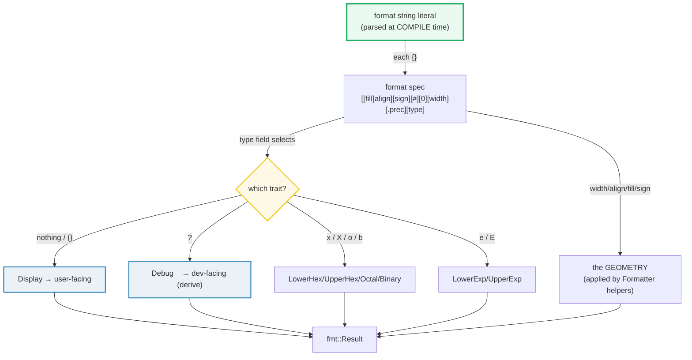

# FORMATTING — `Display`, `Debug`, and the `format!` Spec Grammar

> **One-line goal:** Rust turns values into text through **formatting traits**
> (`Display` for users, `Debug` for developers), selected by a tiny **format
> spec grammar** inside `{}` (`{:>5}`, `{:08}`, `{:.2}`, `{:#x}`), driven by the
> `format!`/`println!`/`write!` macros that all lower to `format_args!`.
>
> **Run:** `just run formatting` (== `cargo run --bin formatting`)
> **Member:** `core` (stdlib-only — no `[dependencies]`).
> **Prerequisites:** 🔗 [STRUCTS_ENUMS](./STRUCTS_ENUMS.md) (you `#[derive(Debug)]`
> on a struct), 🔗 [TRAITS_BASICS](./TRAITS_BASICS.md) (implementing a trait),
> 🔗 [STRINGS_STR](./STRINGS_STR.md) (`format!` returns a `String`).
> **Ground truth:** [`formatting.rs`](./formatting.rs); captured stdout:
> [`formatting_output.txt`](./formatting_output.txt).

---

## Why this exists (lineage)

In C you learn one formatting function — `printf("%d", x)` — and a format spec
like `%05d`. Rust splits that idea into two orthogonal halves, and the split is
the whole point:

| Half | Responsibility | Where it lives |
|---|---|---|
| **The format spec** (`{:>5}`, `{:08}`, `{:.2}`) | width / alignment / fill / sign / precision — the *geometry* of the output | the **format string**, parsed at compile time |
| **The formatting trait** (`Display`, `Debug`, `LowerHex`, …) | how a *type* renders itself as characters — the *content* | the **type**, via a trait impl |

The spec and the trait are **composed**: `{:#x}` means "use the `LowerHex` trait
*and* prepend the `0x` alternate prefix". `{}` (empty) means "use `Display` with
no geometry". `{:?}` means "use `Debug`". Every primitive type implements the
relevant traits in the stdlib; for your own types you either `#[derive(Debug)]`
or hand-write `impl Display`.



The payoff of the split: **you can render one type many ways** (`Point` prints
`P(1,2)` to a user via Display but `Point { x: 1, y: 2 }` to a log via Debug),
and **you can apply one geometry to many types** (`{:>8}` right-aligns an `i32`,
a `&str`, or anything with a trait impl). Neither half knows about the other.

---

## The spec grammar (memorize this)

The Rust Reference and `std::fmt` define the format spec verbatim
([std::fmt — Syntax][fmt-syntax]):

```
format := '{' [ argument ] [ ':' format_spec ] '}'
format_spec := [[fill]align][sign]['#']['0'][width]['.' precision][type]
fill   := character
align  := '<' | '^' | '>'
sign   := '+' | '-'
width  := count
precision := count | '*'
type   := '?' | 'x?' | 'X?' | 'o' | 'x' | 'X' | 'p' | 'b' | 'e' | 'E'
```

And the **type → trait** routing table (the `type` field is just a trait picker):

| `type` | Trait | Notes |
|---|---|---|
| *(nothing)* | `Display` | `{}` — the user-facing default |
| `?` | `Debug` | `{:?}`; `{:#?}` pretty-prints; usually `#[derive(Debug)]` |
| `x?` / `X?` | `Debug` | Debug with hex integers |
| `o` / `x` / `X` / `b` | `Octal` / `LowerHex` / `UpperHex` / `Binary` | `{:#o}` etc. add a base prefix |
| `p` | `Pointer` | `{:p}` formats a pointer |
| `e` / `E` | `LowerExp` / `UpperExp` | scientific (floats) |

Everything below is a worked example of one slot in that grammar.

---

## Section A — `Display`: the user-facing trait (`{}`)

```rust
struct Point { x: i32, y: i32 }

impl fmt::Display for Point {
    fn fmt(&self, f: &mut fmt::Formatter<'_>) -> fmt::Result {
        write!(f, "P({},{})", self.x, self.y)
    }
}

format!("{}", Point { x: 1, y: 2 });   // => "P(1,2)"
```

> **From formatting.rs Section A:**
> ```
> ======================================================================
> SECTION A — Display: the user-facing trait ({})
> ======================================================================
>   format!("{}", Point { x:1, y:2 }) = "P(1,2)"
> [check] Display renders the hand-written form exactly: OK
>   p.to_string() = "P(1,2)"
> [check] to_string() is Display in disguise: OK
> ```

**What.** `{}` (an empty format spec) routes to the `Display` trait. You write
the impl yourself — **`Display` is never derived**. The method signature is
fixed: `fn fmt(&self, f: &mut fmt::Formatter<'_>) -> fmt::Result`. You emit text
by `write!`-ing into the `Formatter` `f` (which itself implements `fmt::Write`),
and return the resulting `fmt::Result`.

**Why (internals).**
- **`fmt::Result` is `Result<(), std::fmt::Error>`** — confirmed structurally in
  Section F (its `type_name` equals `Result<(), fmt::Error>`'s). Formatting
  itself is *infallible*; the `Result` exists only so a `Formatter` can surface a
  write failure from the underlying sink (e.g. a full disk on a `File`). The
  stdlib docs are explicit: a formatting impl "must and may only return an error
  if the passed-in `Formatter` returns an error" ([std::fmt][fmt-syntax]).
- **`to_string()` is just `Display` in disguise.** Every `T: Display` gets a
  blanket `impl ToString for T`, so `x.to_string()` is literally
  `format!("{}", x)` — the second check pins this. Reach for `to_string()` for a
  single value; reach for `format!` when you are composing several.
- **`write!(f, ...)` inside the impl propagates the geometry for free.** Because
  you delegate to `write!`, width/alignment a *caller* attaches
  (`format!("{:>10}", p)`) is applied by the `Formatter` around your output — you
  don't have to read `f.width()` yourself unless you want custom behavior.

> **`Display` is opt-in, not universal.** The Book is clear: not every type
> *should* be `Display` (a `TcpStream` has no obvious user-facing string). That
> is exactly why `Display` can't be derived — forcing you to write the impl is a
> speed bump that asks "is there a faithful string for this?". `Debug`, by
> contrast, "should be implemented for all public types" ([std::fmt][fmt-syntax]).

🔗 [TRAITS_BASICS](./TRAITS_BASICS.md) — implementing a trait is the prerequisite
mechanic; `Display` is just a trait with one required method.

---

## Section B — `Debug`: the developer-facing trait (`{:?}`), usually derived

```rust
#[derive(Debug)]
struct Point { x: i32, y: i32 }

format!("{:?}",  Point { x: 1, y: 2 });  // => "Point { x: 1, y: 2 }"
format!("{:#?}", Point { x: 1, y: 2 });  // => multi-line, 4-space indented
```

> **From formatting.rs Section B:**
> ```
> ======================================================================
> SECTION B — Debug: the developer-facing trait ({:?}), usually #[derive(Debug)]
> ======================================================================
>   format!("{:?}", p) = "Point { x: 1, y: 2 }"
> [check] derived Debug prints StructName { field: value, ... }: OK
>   format!("{:#?}", p) =
>     Point {
>         x: 1,
>         y: 2,
>     }
> [check] {:#?} pretty-prints Debug across multiple indented lines: OK
>   same Point:  Display = P(1,2)   Debug = Point { x: 1, y: 2 }
> ```

**What.** `{:?}` routes to `Debug`. With `#[derive(Debug)]` the compiler emits
the canonical `StructName { field: value, ... }` form (first check). `{:#?}` is
the `#` alternate: it spreads the struct across lines with 4-space indentation
(second check). The last line is the whole story: **one value, two traits, two
representations** — `P(1,2)` for users, `Point { x: 1, y: 2 }` for logs.

**Why (internals).**
- **`{:?}` requires `Debug` — it is a *compile* error, not a runtime one, to use
  it on a type without the trait.** The derive is the 99% case; a hand-written
  `Debug` (via the `debug_struct`/`debug_tuple`/`debug_list` builders on
  `Formatter`) is reserved for when you want to hide fields or print a custom
  shape.
- **`{:#?}` is not a different trait** — it is the *same* `Debug` impl, told
  (via `Formatter::alternate()`) to emit newlines. That is why a single derive
  gives you both compact and pretty output for free.
- **`Debug` is a debugging surface, not a serialization format.** Its output is
  not stable across versions and is not parseable back into the type. For
  round-trippable data, use 🔗 [serde] (Phase 6), never `Debug`.

**The compile error (`{:?}` on a non-`Debug` type) — it cannot live in the
runnable `.rs`:**

```console
error[E0277]: `Point` doesn't implement `Debug`
  --> src/main.rs:2:22
   |
 2 |     println!("{:?}", p);
   |                  ----  ^ `Point` cannot be formatted using `{:?}`
   |                  |        because it doesn't implement `Debug`
   |                  required by this formatting parameter
   |
   = help: add `#[derive(Debug)]` to `Point` or manually `impl Debug for Point`
```

> **`E0277` ("trait not implemented")** is the mirror image of the `{:?}`
> selector: the format string asked for `Debug`, the type doesn't have it, the
> compiler refuses to build. The fix is always one line: `#[derive(Debug)]`
> (or an `impl`).

🔗 [STRUCTS_ENUMS](./STRUCTS_ENUMS.md) — `#[derive(Debug)]` is the first derive
most structs get; structs/enums shows it on every shape.

---

## Section C — width / alignment / fill / sign-aware zero-pad

> **From formatting.rs Section C:**
> ```
> ======================================================================
> SECTION C — width / alignment / fill / sign-aware zero-pad (spec grammar)
> ======================================================================
>   "[{:>5}]" of 42 = [   42]
>   "[{:<5}]" of 42 = [42   ]
>   "[{:^5}]" of 42 = [ 42  ]
> [check] right-align width 5 pads on the LEFT with spaces: OK
> [check] left-align width 5 pads on the RIGHT with spaces: OK
> [check] center width 5 splits padding around the value: OK
>   "[{:-<5}]" of "x" = [x----]
>   "[{:0>5}]" of "x" = [0000x]
> [check] fill char precedes align: {:-<5} fills with '-': OK
> [check] fill '0' + right-align: {:0>5} fills with '0': OK
>   "{:08}" of 255 = "00000255"
>   "{:08}" of -1  = "-0000001"
> [check] {:08} zero-pads 255 to width 8: OK
> [check] {:08} is sign-aware: -1 keeps the sign, then 6 zeros (not 7): OK
>   "{:+}" of 5 = "+5"
> [check] {:+} forces a leading '+' on positive numbers: OK
> ```

**What.** Six checks pin the geometry half of the grammar:
1. **Width** (`:5`) pads to *at least* N columns; default fill is a space.
2. **Alignment** (`<` left, `^` center, `>` right). Defaults differ by type:
   *numbers* default right, *strings* default left.
3. **Fill** is the char *before* the align char — `{:-<5}` fills with `-`,
   `{:0>5}` fills with `0`.
4. The **`0` flag** (`{:08}`) is *sign-aware* zero-pad: `-1` keeps its sign and
   gets **one fewer zero** than `255` (`-0000001`, six zeros, not seven).
5. The **`+` flag** always prints the sign, even for positives.

**Why (internals).**
- **`0` vs fill-`0` are different mechanisms.** `{:08}` uses the `0` *flag*
  (sign-aware, prefix-aware); `{:0>8}` uses fill char `0` with right alignment
  (not sign-aware — it would put the `0`s *before* a `-`). The stdlib doc:
  "`{:08}` would yield `00000001` for the integer `1`, while the same format
  would yield `-0000001` for `-1`. Notice that the negative version has one fewer
  zero" ([std::fmt — Sign/#/0][fmt-sign]). With `#`, the base prefix is also
  included in the width and the zeros go *after* it.
- **Width is a *minimum*.** If the value is already wider than `width`, nothing
  is truncated (width never shrinks). Truncation is `precision`'s job (Section D).
- **Dynamic width** comes from another argument with a `$` suffix —
  `{:>width$}` reads `width` from a `usize` arg (shown in Section E). This is how
  you right-align a column whose width you only know at runtime.

> **Alignment is not honored by every trait.** The stdlib warns that alignment
> "might not be implemented by some types. In particular, it is not generally
> implemented for the `Debug` trait" ([std::fmt][fmt-sign]). The reliable trick
> when you must pad a `Debug` value: format it first, then pad the resulting
> string: `format!("{:^15}", format!("{:?}", x))`.

🔗 [VEC_COLLECTIONS](./VEC_COLLECTIONS.md) — width/alignment is how you render a
column-aligned table from a `Vec`.

---

## Section D — precision (float digits / string truncation) + radix + scientific

> **From formatting.rs Section D:**
> ```
> ======================================================================
> SECTION D — precision (float digits / string trunc) + radix + scientific
> ======================================================================
>   "{:.2}" of 1.0/3.0  = "0.33"
>   "{:.3}" of "abcdefg" = "abc"
> [check] {:.2} keeps 2 fractional digits (1.0/3.0 -> 0.33): OK
> [check] {:.3} truncates the string to 3 chars: OK
>   "{:.0}" of 0.5 = "0"   (round half-to-even -> 0)
>   "{:.0}" of 2.5 = "2"   (round half-to-even -> 2)
> [check] round-half-to-even: 0.5 -> 0: OK
> [check] round-half-to-even: 2.5 -> 2: OK
>   "{:x}"/"{:#x}" of 255 = "ff" / "0xff"
>   "{:o}"/"{:#o}" of 8   = "10" / "0o10"
>   "{:b}"/"{:#b}" of 5   = "101" / "0b101"
> [check] {:x} is lowercase hex with no prefix: OK
> [check] {:#x} prepends the 0x prefix: OK
> [check] {:o} is octal with no prefix: OK
> [check] {:#o} prepends the 0o prefix: OK
> [check] {:b} is binary with no prefix: OK
> [check] {:#b} prepends the 0b prefix: OK
>   "{:e}"/"{:E}" of 25500.0 = "2.55e4" / "2.55E4"
>   "{:e}" of 1.0 = "1e0"
> [check] {:e} is lowercase scientific (mantissa e exponent): OK
> [check] {:E} is uppercase scientific: OK
> [check] {:e} of 1.0 is 1e0: OK
> ```

**What.** Precision `.N` is **overloaded by the type of the value**:

| Value type | `.N` means |
|---|---|
| **float** | digits *after* the decimal point, **rounded** |
| **string** | a **maximum width** — the string is *truncated* to N chars |
| **integer** | **ignored** (precision does nothing) |

So `{:.2}` of `1.0/3.0` is `"0.33"` and `{:.3}` of `"abcdefg"` is `"abc"`. Radix
(`x`/`o`/`b`) selects a different *trait* (`LowerHex`/`Octal`/`Binary`); `#` adds
the base prefix. Scientific (`e`/`E`) selects `LowerExp`/`UpperExp` (floats only).

**Why (internals).**
- **Float rounding is round-half-to-even (banker's rounding), the IEEE 754
  default — *not* half-up.** The two `0.5`/`2.5` checks are the smoking gun: both
  round *down* to the even neighbor (`0` and `2`), because half-to-even always
  picks the even digit. The stdlib is explicit: "When truncating these values,
  Rust uses round half-to-even, which is the default rounding mode in IEEE 754"
  ([std::fmt — Precision][fmt-precision]). This is the #1 formatting surprise for
  people coming from `printf`, which rounds half-away-from-zero.
- **`#` is the "alternate" flag, not a hex toggle.** It asks the trait for its
  alternate form: `#?` pretty-prints Debug, `#x` adds `0x`, `#o` adds `0o`,
  `#b` adds `0b`. One flag, trait-specific meaning.
- **Radix traits are implemented for the integer primitives, not floats.**
  `format!("{:x}", 255.0)` is a compile error — `LowerExp` (`{:e}`) is the
  float's "exponent" form, a different thing entirely.

> **Why not `3.14159` as the float example?** clippy's `approx_constant` lint
> (on under `-D warnings`) flags any literal within a hair of a known math
> constant (`PI`, `E`, …). The bundle uses `1.0/3.0` — a computed value, not a
> literal — to keep the build lint-clean while still showing `.2` precision.

🔗 [STRINGS_STR](./STRINGS_STR.md) — `format!` is one of the three ways to build
a `String` (alongside `String::from` and `to_string`).

---

## Section E — argument forms: positional / explicit-index / named / dynamic

> **From formatting.rs Section E:**
> ```
> ======================================================================
> SECTION E — argument forms: positional / explicit-index / named / dynamic width
> ======================================================================
>   "{0} {0} {1}", "a", "b"   = "a a b"
>   "{1} {} {0} {}", 1, 2 = "2 1 1 2"
> [check] {0} reuses arg 0 twice -> "a a b": OK
> [check] {1} {} {0} {} mixes explicit-index and next-arg -> "2 1 1 2": OK
>   "{} {name}", 1, name=2   = "1 2"
>   "[{:>0width$}]", 7, width=5 = "[00007]"
> [check] named arg {name} substitutes the named value: OK
> [check] width$ takes width from a (usize) arg -> zero-padded to 5: OK
>   escaping { } around arg "x" -> "{x}"
> [check] {{ and }} escape to literal braces around an argument -> {x}: OK
> ```

**What.** Four argument forms, each checked:
1. **Explicit index** `{0}` reuses an arg without consuming the "next arg"
   cursor — `{0} {0} {1}` ⇒ `"a a b"`.
2. **Mixing** explicit `{N}` and implicit `{}`: the implicit ones advance an
   *independent* cursor, so `{1} {} {0} {}` with `(1,2)` ⇒ `"2 1 1 2"`.
3. **Named** args (`name = value`) come last; `{name}` substitutes them. A name
   can also be a `usize` *count* with a `$` suffix — `{:>0width$}` reads `width`
   from the `width` arg.
4. **Escaping**: `{{` and `}}` are the *only* escapes; they emit literal braces.
   `format!("{{{}}}", "x")` ⇒ `"{x}"` (literal `{` + arg + literal `}`).

**Why (internals).**
- **The "next argument" cursor and explicit indices are independent.** The
  stdlib model: "the 'next argument' specifier can be thought of as an iterator
  over the argument. Each time a 'next argument' specifier is seen, the iterator
  advances" ([std::fmt — Positional][fmt-positional]). Naming an arg explicitly
  does *not* advance that iterator — which is why `{1} {} {0} {}` reorders
  without shifting the `{}`s.
- **The format string must be a literal** so the compiler can (a) type-check
  each `{}` against its argument's traits and (b) emit compile errors for
  mismatched/unused arguments. This is checked statically — a wrong number of
  args is `error[E0277]`/`E0495` at build time, never a runtime crash.
- **All arguments must be used.** Supplying an argument the format string never
  references is a compile error — there is no silent drop.

> **Implicit captured identifiers (`format!("{x}")`)** are sugar for
> `format!("{}", x)` that reads a same-named local in scope. It is *not* a named
> arg in the positional sense — it cannot be reused or reindexed, and it still
> counts toward "all args used".

🔗 [ERROR_HANDLING](./ERROR_HANDLING.md) — `{}` uses `Display`, so `?`-propagated
errors render their user-facing message; `{:?}` renders the debug form.

---

## Section F — `write!`/`writeln!` into a buffer; `format_args!` is zero-alloc

```rust
use std::fmt::Write;          // MUST be in scope for write! to a String

let mut buf = String::new();
write!(buf, "x={}", 42)?;     // buf == "x=42"
writeln!(buf, "!")?;          // buf == "x=42!\n"
```

> **From formatting.rs Section F:**
> ```
> ======================================================================
> SECTION F — write!/writeln! into a String; format_args! is zero-alloc
> ======================================================================
>   after write!(buf, "x={}", 42) -> buf = "x=42"
> [check] write! appends formatted text to the String: OK
>   after writeln!(buf, "!")         -> buf = "x=42!\n"
> [check] writeln! appends the text AND a trailing newline: OK
>   type_name::<fmt::Result>()           = core::result::Result<(), core::fmt::Error>
>   type_name::<Result<(),fmt::Error>>() = core::result::Result<(), core::fmt::Error>
> [check] fmt::Result IS Result<(), std::fmt::Error>: identical type_name: OK
>   format_args!("k={}", 1) -> written = "k=1"
> [check] format_args! carries the precompiled format, written later: OK
> ```

**What.** Four checks cover the buffer-writing family:
1. `write!(buf, ...)` appends formatted text to a `String` (or any `fmt::Write`/
   `io::Write`).
2. `writeln!` does the same **plus a trailing `\n`**.
3. `fmt::Result` is provably `Result<(), std::fmt::Error>` — both `type_name`s
   print identically.
4. `format_args!(...)` builds a `fmt::Arguments` with **no heap allocation** and
   writes it later.

**Why (internals).**
- **Every formatting macro lowers to `format_args!`.** `format!` is
  `format_args!(...).to_string()`; `println!`/`write!`/`eprintln!` all build a
  `fmt::Arguments` and hand it to a writer. The stdlib: "Under the hood, all of
  the related macros are implemented in terms of this"
  ([std::fmt — format_args!][fmt-format-args]). `fmt::Arguments` is a stack-only
  handle that *borrows* the format string and the args — no `String` is built
  until something writes it.
- **`format!` allocates a `String`; `write!` does not.** When you already have a
  buffer (a `String`, a `File`, `io::stdout()`), `write!`/`writeln!` streams
  directly into it and skips the intermediate `String`. That is why `write!` is
  the choice in hot paths and inside `impl Display` (you write into the borrowed
  `Formatter`, not a fresh `String`).
- **`format!` panics on an `Err`; `write!` returns it.** `format!` writes to a
  `String`, and `fmt::Write for String` is infallible, so an `Err` there "indicates
  an incorrect implementation" and is turned into a panic ([format! docs][fmt-macro]).
  `write!` to a real sink (a `File`) *can* fail, so it hands you the `Result` to
  handle — typically with `?`.

**The compile error (`write!` to a `String` without `fmt::Write` in scope):**

```console
error[E0599]: cannot write into `String`
   --> src/main.rs:3:5
    |
  3 |     write!(s, "x={}", 42);
    |            ^
    |
   = help: items from traits can only be used if the trait is in scope
 1 + use std::fmt::Write;
    |
```

> **`E0599`** here is the classic "trait method exists but the trait isn't
> imported" error. `write!` resolves against `fmt::Write` *or* `io::Write`;
> `String` implements `fmt::Write`, so importing that trait fixes it. (For a
> `Vec<u8>` or a `File` you'd import `std::io::Write` instead.)

🔗 [IO](./IO.md) — `write!`/`writeln!` over `std::io::Write` (files, `stdout`) is
the byte-stream twin of this section's `fmt::Write` over `String`.

---

## Pitfalls (the expert payoff)

| Trap | Symptom | Fix / why |
|---|---|---|
| **`{:?}` on a non-`Debug` type** | `error[E0277]: T doesn't implement Debug` | Add `#[derive(Debug)]` (or hand-`impl`). `{:?}` *requires* the trait; it's a compile error, not a runtime fallback. |
| **`write!(string, ...)` won't compile** | `error[E0599]: cannot write into String` | `use std::fmt::Write;` — the trait must be in scope. (`Vec<u8>`/`File` need `use std::io::Write;`.) |
| **Expecting half-up rounding** | `{:.0}` of `2.5` gives `2`, not `3` | Rust rounds **half-to-even** (IEEE 754). `0.5→0`, `2.5→2`, `1.5→2`, `3.5→4`. Use `format!` + round manually if you need half-away. |
| **Precision ignored on integers** | `{:.3}` of `42` prints `42`, not `042` | `.N` only affects floats (digits) and strings (truncation). For zero-padded ints use the `0` flag: `{:03}`. |
| **`{:>5}` not padding a `Debug` value** | alignment seems to do nothing on `{:?}` output | Alignment isn't generally honored by `Debug`. Format first, then pad: `format!("{:>5}", format!("{:?}", x))`. |
| **Width won't truncate** | a long value blows past `{:5}` | Width is a *minimum*. Truncation is precision's job: `{:.5}` (strings) or pre-truncate. |
| **`0` flag vs fill-`0`** | `{:08}` of `-1` is `-0000001` (sign-aware) but `{:0>8}` of `-1` is `0000000-1` | The `0` *flag* is sign/prefix-aware; a `0` *fill char* is dumb left-padding. They look similar, they aren't. |
| **`format!` allocates** | needless `String` churn in a hot loop / inside `impl Display` | Use `write!(f, ...)` into the existing `Formatter`/buffer, or `format_args!` to defer/avoid allocation. |
| **Unused format argument** | `error: argument never used` | The format string must reference *every* argument — there is no silent drop. Remove it or reference it. |
| **Mixing `{}` and `{N}` cursor** | `{1} {} {0} {}` surprises you | Explicit `{N}` does *not* advance the "next argument" cursor that `{}` uses. They are independent; track both. |
| **`{}` vs `{:?}` escaping on strings** | `"a\nb"` prints as a *real newline* under `{}` but as the literal `a\nb` (quoted, backslash-escaped) under `{:?}` | `{}` emits raw content; `{:?}` quotes the string and escapes control chars (`\n`, `\t`, `\\`, `\"`). `{:?}` is for logs; `{}` is for users. |
| **`format!` panics on impl error** | a bad `Display`/`Debug` impl that returns `Err` panics in `format!` | `fmt::Write for String` is infallible, so an `Err` "indicates an incorrect implementation". Return `Err` only if the `Formatter` did. |

---

## Cheat sheet

```rust
use std::fmt::{self, Write};            // Write needed for write!(string, ...)

// ── traits (the `type` field is a trait picker) ──────────────────────────────
//   {}   -> Display   {:?} -> Debug   {:#?} -> pretty Debug (the # alternate)
//   {:x}/{:X} -> LowerHex/UpperHex   {:o} -> Octal   {:b} -> Binary   {:p} -> Pointer
//   {:e}/{:E} -> LowerExp/UpperExp   {:#x}/{:#o}/{:#b} add the base prefix

// ── spec grammar ─────────────────────────────────────────────────────────────
//   format_spec := [[fill]align][sign]['#']['0'][width]['.' precision][type]
//   align: < ^ >        sign: + -        fill: any char BEFORE align
#[derive(Debug)]
struct Point { x: i32, y: i32 }
impl fmt::Display for Point {
    fn fmt(&self, f: &mut fmt::Formatter<'_>) -> fmt::Result {  // == Result<(), fmt::Error>
        write!(f, "P({},{})", self.x, self.y)                   // delegate -> geometry is free
    }
}
let p = Point { x: 1, y: 2 };
format!("{}",  p);   // "P(1,2)"         (Display, hand-written, never derived)
format!("{:?}", p);  // "Point { x: 1, y: 2 }"   (Debug, derived)
format!("{:#?}", p); // pretty multi-line Debug
p.to_string();       // == format!("{}", p)  (Display in disguise)

// ── geometry ─────────────────────────────────────────────────────────────────
format!("[{:>5}]", 42);   // "[   42]"  right-align (nums default right, strs left)
format!("[{:<5}]", 42);   // "[42   ]"  left-align
format!("[{:^5}]", 42);   // "[ 42  ]"  center
format!("[{:-<5}]", "x"); // "[x----]"  fill char precedes align
format!("{:08}", 255);    // "00000255" 0 FLAG (sign-aware: -1 -> "-0000001")
format!("{:+}", 5);       // "+5"       + forces the sign
format!("{:.2}", 1.0/3.0);// "0.33"     float precision (round HALF-TO-EVEN)
format!("{:.3}", "abcdefg"); // "abc"   string precision = MAX width (truncates)
format!("{:#x}", 255);    // "0xff"     # + LowerHex;  also {:#o}=0o.. {:#b}=0b..
format!("{:e}", 25500.0); // "2.55e4"   scientific

// ── args ─────────────────────────────────────────────────────────────────────
format!("{0} {0} {1}", "a", "b");     // "a a b"   explicit index reuses
format!("{1} {} {0} {}", 1, 2);       // "2 1 1 2" explicit vs next-arg cursor
format!("{} {name}", 1, name = 2);    // "1 2"     named
format!("[{:>0width$}]", 7, width=5); // "[00007]" width from a usize arg
format!("{{{}}}", "x");               // "{x}"     {{ }} are the only escapes

// ── macros -> all lower to format_args! (zero-alloc fmt::Arguments) ──────────
let s: String = format!("x={}", 42);             // builds + allocates a String
let mut buf = String::new();
write!(buf, "x={}", 42).unwrap();                // streams into buf, no alloc
writeln!(buf, "!").unwrap();                      // + trailing '\n'
println!("{} {}", 1, 2);                          // stdout
eprintln!("err: {:?}", err);                      // stderr
let args = format_args!("{}={}", "k", 1);         // fmt::Arguments, NO alloc
write!(buf, "{args}").unwrap();                   // write it later
```

---

## Sources

Every claim above was web-verified in authoritative Rust documentation.

- **`std::fmt` module reference** — the format spec grammar (`format_spec :=
  [[fill]align][sign]['#']['0'][width]['.' precision][type]`), the type→trait
  routing table, `Display` vs `Debug` ("Display … is not expected that all types
  implement"; Debug "should be implemented for all public types"), fill/align,
  sign-aware zero-pad (`-0000001`), round-half-to-even precision, positional vs
  named arguments, `format_args!` as the zero-alloc base of every macro, and the
  `fn fmt(&self, f: &mut fmt::Formatter<'_>) -> fmt::Result` signature:
  https://doc.rust-lang.org/std/fmt/index.html
- **`format!` macro reference** — "Creates a `String` using interpolation", the
  format string must be a literal, "panics if a formatting trait implementation
  returns an error" (because `fmt::Write for String` is infallible):
  https://doc.rust-lang.org/std/macro.format.html
- **`std::fmt::Formatter` reference** — `Formatter` is "Configuration for
  formatting", passed by `&mut` to every `fmt` method; the `pad` / `pad_integral`
  / `sign_aware_zero_pad` / `width` / `precision` / `alternate` helpers a
  hand-written impl uses; `impl Write for Formatter` (why `write!(f, ...)` works
  inside an impl):
  https://doc.rust-lang.org/std/fmt/struct.Formatter.html
- **`std::fmt::Display` trait reference** — the required method
  `fn fmt(&self, f: &mut Formatter<'_>) -> Result`, "Format trait for an empty
  format, `{}`":
  https://doc.rust-lang.org/std/fmt/trait.Display.html
- **`std::fmt::Debug` trait reference** — "`?` formatting", "should generally
  be implemented for all public types", "using `#[derive(Debug)]` is sufficient
  and recommended":
  https://doc.rust-lang.org/std/fmt/trait.Debug.html
- **The Rust Reference — Formatting** — the `format!`/`format_args!` expression
  grammar, the `format_spec` production, and the compile-time argument checking:
  https://doc.rust-lang.org/reference/expressions/format-expr.html
