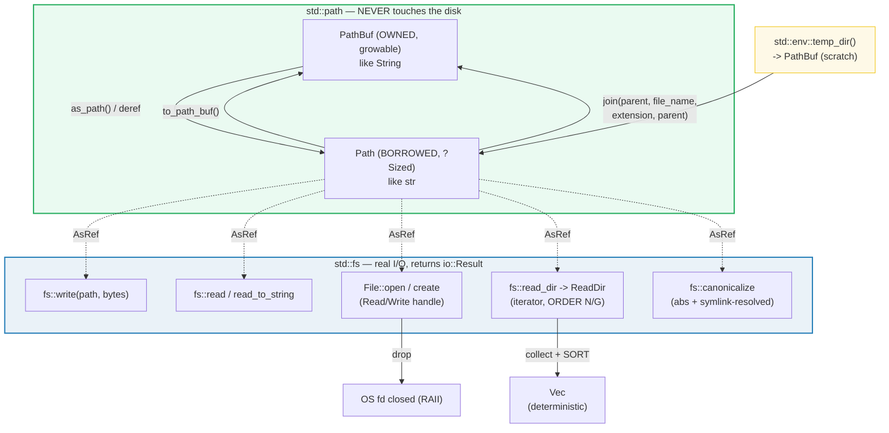

# FS_PATHS — `std::fs`, `std::path`, and `env::temp_dir`

> **One-line goal:** read and write the filesystem portably with `std::fs`
> (`read`/`write`/`File`/`read_dir`/`canonicalize`), manipulate paths
> cross-platform with `std::path` (`Path` vs `PathBuf`), and get a scratch
> directory with `env::temp_dir` — while knowing the traps (TOCTOU, swallowed
> errors, unordered `read_dir`, symlink-resolving `canonicalize`).
>
> **Run:** `just run fs_paths` (== `cargo run --bin fs_paths`)
> **Member:** `core` (stdlib-only — no `[dependencies]`).
> **Prerequisites:** 🔗 [ERROR_HANDLING](./ERROR_HANDLING.md) — every fs call
> returns `io::Result<T>`; this bundle leans on `?` throughout. 🔗
> [VEC_COLLECTIONS](./VEC_COLLECTIONS.md) — `read_dir` entries are collected into
> a `Vec` and **sorted** for deterministic output.
> **Ground truth:** [`fs_paths.rs`](./fs_paths.rs); captured stdout:
> [`fs_paths_output.txt`](./fs_paths_output.txt).

---

## Why this exists (lineage)

Rust's filesystem story is deliberately split across **three** stdlib modules so
that *path manipulation never touches the disk*:

| Module | Touches the disk? | Key types/fns |
|---|---|---|
| `std::path` | **No** — pure string parsing/building | `Path` (borrowed), `PathBuf` (owned), `join`, `parent`, `file_name`, `extension`, `MAIN_SEPARATOR` |
| `std::fs` | **Yes** — real I/O | `read`, `read_to_string`, `write`, `File` (`open`/`create`), `read_dir`, `canonicalize`, `create_dir`, `remove_file`, `exists`, `metadata` |
| `std::env` | (config) | `temp_dir()` → the OS temp directory as a `PathBuf` |

The genius of the split is that `Path` operations are **free, infallible, and
deterministic** — `Path::new("a/b.txt").parent()` is just substring logic and
can never fail. Only when you cross into `std::fs` do errors become possible
(returned as `io::Result`). And because every `fs` function takes `P:
AsRef<Path>`, a `&str`, `String`, `Path`, or `PathBuf` all work at the call site
with no conversion. This is the [`str`/`String` pattern][strings] generalized to
operating-system strings ([`OsStr`/`OsString`][osstr]).



---

## Section A — `fs::write` then `fs::read` / `read_to_string`

The three whole-file convenience functions ([`std::fs`][fs-mod]):

```rust
pub fn read<P: AsRef<Path>>(path: P) -> io::Result<Vec<u8>>                 // raw bytes
pub fn read_to_string<P: AsRef<Path>>(path: P) -> io::Result<String>        // UTF-8 text
pub fn write<P: AsRef<Path>, C: AsRef<[u8]>>(path: P, contents: C) -> io::Result<()>
//                                ^ accepts &[u8], &str, &Vec<u8>, Bytes, ...
```

> **From fs_paths.rs Section A:**
> ```
> ======================================================================
> SECTION A — write then read: fs::write / read / read_to_string
> ======================================================================
>   fs::write(temp/"rs_fs_probe.txt", "hello");  // created/replaced
>   fs::read_to_string -> "hello"  (len 5)
>   fs::read          -> len 5, bytes = [104, 101, 108, 108, 111]
> [check] write "hello" then read_to_string returns "hello": OK
> [check] fs::read byte length matches the 5-byte payload: OK
> [check] first byte of "hello" is b'h' (104): OK
> ```

**What.** `fs::write` drops the 5 bytes `"hello"` into a file; `read_to_string`
returns the same `String`; `read` returns the raw `Vec<u8>` `[104, 101, 108, 108,
111]` (the ASCII codes of `h-e-l-l-o`).

**Why (internals).**
- **`write` is "create-or-replace".** The [docs][fs-write] state it verbatim:
  *"This function will create a file if it does not exist, and will entirely
  replace its contents if it does."* It is a convenience wrapper over
  `File::create` + `Write::write_all` — there is no append mode here.
- **`read` vs `read_to_string`.** `read_to_string` **errors if the bytes are not
  valid UTF-8** ([docs][fs-read-to-string]); `read` never does, because it hands
  you bytes. Rule of thumb: text → `read_to_string`, anything binary or of
  unknown encoding → `read`. (Both auto-retry on `ErrorKind::Interrupted`, so you
  never see a short read.)
- **`C: AsRef<[u8]>` is why a `&str` just works.** `&str: AsRef<[u8]>` (a string
  *is* a byte slice), so `fs::write(path, "hello")` compiles with no `.as_bytes()`
  at the call site. Likewise `P: AsRef<Path>` lets you pass a `&str`/`String`
  directly to any `fs` function.

---

## Section B — `Path` (borrowed) vs `PathBuf` (owned)

`Path`/`PathBuf` is the exact analog of `str`/`String`, but layered over
`OsStr`/`OsString` so paths carry the **local platform's** syntax (`/` on Unix,
`\` or `/` on Windows):

```rust
pub struct Path { /* private: a slice of OsStr, ?SIZED, always behind &/Box */ }
pub struct PathBuf { /* private: an owned, growable OsString */ }

// build:
PathBuf::from("a").join("b.txt")            // -> PathBuf "a/b.txt" (unix)
Path::new("a/b.txt").parent()               // -> Some(Path "a")   // pure parsing
Path::new("x.txt").file_stem()              // -> Some("x")
Path::new("x.txt").extension()              // -> Some("txt")
```

> **From fs_paths.rs Section B:**
> ```
> ======================================================================
> SECTION B — Path (borrowed, unsized) vs PathBuf (owned, growable)
> ======================================================================
>   PathBuf::from("a").join("b.txt") -> a/b.txt
>   std::path::MAIN_SEPARATOR         = '/'
>   Path::new("x.txt").file_name()   -> Some("x.txt")
>   Path::new("x.txt").file_stem()   -> Some("x")
>   Path::new("x.txt").extension()   -> Some("txt")
>   Path::new("a/b.txt").parent()    -> Some("a")
> [check] join builds the cross-platform path "a/b.txt": OK
> [check] file_stem("x.txt") == "x": OK
> [check] extension("x.txt") == "txt": OK
> [check] parent("a/b.txt") == "a": OK
> ```

**What.** `join` builds `"a/b.txt"` (note `MAIN_SEPARATOR == '/'` on this Unix
target). `file_stem`, `extension`, and `parent` are pure queries that need no
filesystem — they never return `Err`.

**Why (internals).**
- **`Path` is `?Sized`** ([docs][path-struct]): like `str`, you can never own a
  `Path` by value — it always lives behind a reference (`&Path`) or a pointer
  (`Box<Path>`/`Rc<Path>`/`Arc<Path>`). The owned, growable form is `PathBuf`,
  exactly as `String` owns a `str`. `PathBuf` derefs to `&Path` and implements
  `DerefMut`, so `&PathBuf` auto-coerces to `&Path` at every call site.
- **`join` uses the platform separator and is "absolute-wins".** `join` appends
  with `MAIN_SEPARATOR`, *but* if you join an **absolute** path it **replaces**
  the base: `Path::new("/etc").join("/bin/sh") == "/bin/sh"` ([docs][path-join]).
  The `AsRef<Path>` bound is why `join("b.txt")` (a `&str`) compiles.
- **`extension`/`file_stem` rules** ([docs][path-ext]): the extension is the part
  after the **last** `.` (so `"foo.tar.gz"` → stem `"foo.tar"`, ext `"gz"`); a
  leading dot with no other dots (`.gitignore`) has **no** extension. Both return
  `Option<&OsStr>` and are pure parsing — they cannot fail.
- **These ops are case-sensitive** regardless of platform ([module docs][path-mod]):
  `Path::starts_with`/`ends_with` compare component-wise, never by substring.

> **`Path` vs `PathBuf` decision:** take **`&Path`** in function signatures (more
> general — accepts `&PathBuf`, `&str` via coercion, `&String`); return/own a
> **`PathBuf`** when you need to build or store. This mirrors the `&str`/`String`
> idiom (clippy's `ptr_arg` enforces the same for `&String`).

---

## Section C — `File::open` / `File::create`: a handle, closed on `drop`

When the convenience functions aren't enough, drop to `File`, which is both a
[`Read`][read-trait] and a [`Write`][write-trait] handle. It closes itself.

```rust
pub fn File::create<P: AsRef<Path>>(path: P) -> io::Result<File>  // write: create+truncate
pub fn File::open<P: AsRef<Path>>(path: P)   -> io::Result<File>  // read-only
// File: Read + Write + Seek; the OS descriptor is closed by Drop (RAII).
```

> **From fs_paths.rs Section C:**
> ```
> ======================================================================
> SECTION C — File::open / File::create: a Read+Write handle, closed on DROP
> ======================================================================
>   File::create(path); f.write_all(b"file-content");
>   File::open(path); read_to_string -> "file-content"  (len 12)
> [check] File::create + write_all, then File::open + read_to_string round-trips: OK
> [check] File::write_all wrote 12 bytes: OK
> ```

**What.** `File::create` + `write_all` writes 12 bytes; the `{ ... }` block ends
and `f` drops; a **new** `File::open` then reads those exact bytes back.

**Why (internals).**
- **`File`'s descriptor is freed by `Drop` (RAII).** There is **no `close()`
  method** — you scope the `File` in a block (or let it fall off the end) and the
  OS handle is released deterministically at the `}`. This is the same ownership
  guarantee as `Box` freeing heap: if the `File` is reachable, the fd is open;
  the instant it isn't, it closes. (For mid-scope close, `std::mem::drop(f)` —
  see 🔗 [OWNERSHIP](./OWNERSHIP.md) Section D.)
- **`create` ≠ `open`.** `File::create` opens with **write + create + truncate**;
  `File::open` opens **read-only**. For full control (append, read+write,
  exclusive create) use [`OpenOptions`][openopts] — e.g.
  `OpenOptions::new().create_new(true).write(true).open(path)` is the **atomic**
  "create only if absent" (no TOCTOU window, see Section E / pitfalls).
- **`read_to_string` here is the `Read` trait method**, not the free `fs` fn:
  `f.read_to_string(&mut buf)` fills a `String` you own. `write_all` is the
  `Write` trait method that writes the whole buffer or returns `Err`. Both are
  why this file does `use std::io::{Read, Write};`.

---

## Section D — `read_dir`: an iterator whose order is **not guaranteed**

```rust
pub fn read_dir<P: AsRef<Path>>(path: P) -> io::Result<ReadDir>
// ReadDir: Iterator<Item = io::Result<DirEntry>>   (order NOT guaranteed!)
```

> **From fs_paths.rs Section D:**
> ```
> ======================================================================
> SECTION D — read_dir: an iterator of entries (order NOT guaranteed -> SORT)
> ======================================================================
>   created 3 files in a fresh temp dir: ["03.txt", "01.txt", "02.txt"]
>   read_dir entries (SORTED): ["01.txt", "02.txt", "03.txt"]
> [check] sorted read_dir names == ["01.txt", "02.txt", "03.txt"]: OK
> [check] read_dir yielded exactly 3 entries: OK
> ```

**What.** Three files are created in the order `["03.txt", "01.txt", "02.txt"]`;
after collecting the entry names and **sorting**, the result is the deterministic
`["01.txt", "02.txt", "03.txt"]`.

**Why (internals).**
- **The order is platform- and filesystem-dependent.** The [docs][fs-readdir]
  say it outright: *"The order in which `read_dir` returns entries can change
  between calls. If reproducible ordering is required, the entries should be
  explicitly sorted."* On Unix this is `opendir`/`readdir` order (often inode
  order, not lexical); on Windows it's `FindFirstFile`/`FindNextFile`. **Never
  print `read_dir` output straight to stdout** if you need reproducible output —
  this is exactly `HOW_TO_RESEARCH.md` §4.2 determinism rule applied to the
  filesystem. 🔗 [VEC_COLLECTIONS](./VEC_COLLECTIONS.md) for `.sort()`.
- **`ReadDir` yields `io::Result<DirEntry>`**, not `DirEntry`: a directory entry
  can fail to be read *mid-iteration* (permissions, concurrent deletion), so each
  `.next()` is fallible. The canonical pattern (straight from the docs) is
  `.collect::<Result<Vec<_>, _>>()?`, which short-circuits on the first error —
  a clean `?`-friendly way to gather entries. 🔗 [ERROR_HANDLING](./ERROR_HANDLING.md).
- **`.` and `..` are skipped** automatically by `read_dir` (per the docs), so you
  never have to filter them yourself.

---

## Section E — `exists` / `is_file` / `is_dir`: the error-swallowing trap

```rust
pub fn Path::exists(&self)   -> bool   // follows symlinks; SWALLOWS errors
pub fn Path::is_file(&self)  -> bool   // ditto: false on error OR on "not a file"
pub fn Path::is_dir(&self)   -> bool
pub fn Path::try_exists(&self) -> io::Result<bool>   // 1.63+: surfaces errors
```

> **From fs_paths.rs Section E:**
> ```
> ======================================================================
> SECTION E — exists() / is_file() / is_dir() (swallow errors: TOCTOU trap)
> ======================================================================
>   the temp FILE: exists=true, is_file=true, is_dir=false
>   the temp DIR : exists=true, is_file=false, is_dir=true
> [check] written file: exists() && is_file() && !is_dir(): OK
> [check] temp dir: exists() && is_dir() && !is_file(): OK
>   file.try_exists() -> Ok(true)
> [check] try_exists() returns Ok(true) for the written file: OK
> ```

**What.** The freshly-written file is `exists && is_file && !is_dir`; the temp
dir is `exists && is_dir && !is_file`. `try_exists` returns `Ok(true)` — but as a
`Result`, so it can also return the *reason* it couldn't tell.

**Why (internals).**
- **`exists`/`is_file`/`is_dir` hide errors behind `false`.** They call
  `metadata` (which **follows symlinks**) and return `false` on *any* error — a
  permission-denied file, a broken symlink, and a genuinely-absent file are all
  indistinguishable. That is why `try_exists` (stabilized 1.63) exists: it returns
  `io::Result<bool>`, surfacing the error instead of masking it.
- **TOCTOU — "Time of Check to Time of Use".** The [`std::fs`][fs-mod] module
  docs open with this warning: *checking if a file exists and then creating it if
  it doesn't is vulnerable to TOCTOU — another process could create the file
  between your check and creation attempt.* The fix is an **atomic** primitive:
  `File::create_new` (or `OpenOptions::create_new(true)`) atomically fails if the
  file already exists, collapsing the check and the create into one syscall.
  Treat `if path.exists() { create() }` as a code smell.

---

## Section F — `canonicalize`: absolute, normalized, symlink-resolved

```rust
pub fn canonicalize<P: AsRef<Path>>(path: P) -> io::Result<PathBuf>
// resolves ALL components: makes absolute, removes ".", resolves symlinks + ".."
// REQUIRES the path to exist (errors otherwise); accesses the filesystem.
```

> **From fs_paths.rs Section F:**
> ```
> ======================================================================
> SECTION F — fs::canonicalize: absolute form, symlinks resolved
> ======================================================================
>   canonicalize succeeded; is_absolute = true
>   (absolute prefix elided — it varies per OS/session)
>   canon.file_name()               = Some("rs_fs_probe.txt")
>   canon == canonicalize(path) again -> true
> [check] canonicalize yields an absolute path: OK
> [check] canonicalize ends with the file's name ("rs_fs_probe.txt"): OK
> ```

**What.** `canonicalize` turns the temp-file path into a real absolute path
(`is_absolute == true`) that still ends in `rs_fs_probe.txt`. The absolute
**prefix** is intentionally never printed — it varies per OS/session and on macOS
`temp_dir()` itself is a symlink (`/tmp` → `/private/tmp`), so printing it would
make the output non-reproducible.

**Why (internals).**
- **`canonicalize` is the *only* path op here that resolves `..` and symlinks**,
  because it actually walks the filesystem ([docs][fs-canon]): it maps to
  `realpath` on Unix and `CreateFile` + `GetFinalPathNameByHandle` on Windows.
  Contrast `std::path` ([docs][path-mod]), whose `join`/`components`/equality
  explicitly **do not** resolve `..` or symlinks — they are pure lexical ops.
- **It requires the path to exist** (it returns `Err` for a missing path, or if a
  non-final component isn't a directory). So you cannot canonicalize a path you
  are *about* to create; canonicalize first requires the file to be there.
- **On Windows the result uses `\\?\` verbatim prefix** for long-path support,
  which means you can only join `\`-separated paths back onto it and some other
  programs won't understand it. Portability caveat worth remembering.

> **Why this bundle never prints an absolute path.** `env::temp_dir()` returns
> `TMPDIR` (on Unix), which on macOS is a per-session `/var/folders/.../T/`, and
> is a symlink to boot. Any absolute temp path is therefore non-reproducible
> across runs/machines. The determinism discipline (§4.2) is honored by asserting
> only **structural** facts — file *names*, content, sizes, booleans — never the
> machine-specific prefix. This is the filesystem analogue of "never print a
> pointer address".

---

## Pitfalls (the expert payoff)

| Trap | Symptom | Fix / why |
|---|---|---|
| **Printing `read_dir` straight to stdout** | output differs run-to-run | Iteration order is **not guaranteed** (docs). Collect into a `Vec` and **`.sort()`** before printing/comparing. |
| **`path.exists()` to decide "create it"** | TOCTOU race: another process wins between check and create | Use the **atomic** `File::create_new` / `OpenOptions::create_new(true)`; it fails if the file already exists in one syscall. |
| **`exists()`/`is_file()` return `false` on errors too** | a permission-denied file looks "absent" | These swallow errors behind `false`. Use `try_exists()` (`Result<bool>`) or `fs::metadata()` to see *why*. |
| **`read_to_string` on a binary/non-UTF-8 file** | `Err(InvalidData)` ("stream did not contain valid UTF-8") | Use `fs::read` for raw `Vec<u8>`, or `read_to_string` only when you *know* it's text. |
| **`fs::write` silently overwrites** | existing file contents gone with no warning | `write` is create-**or-replace** (truncates). For append use `OpenOptions::new().append(true).open()`. |
| **`create_dir` fails if a parent is missing** | `Err` "no such file or directory" | Use `fs::create_dir_all` to make the whole chain; `create_dir` makes exactly one level. |
| **`temp_dir()` is shared & predictable** | "insecure temporary file" vulnerability (predictable name) | The [docs][env-temp] warn a fixed/predictable name is a security hole on the shared temp dir. For real code use the `tempfile` crate (unique, secure names). This bundle uses a fixed name only because it controls + cleans the file. |
| **`Path::join(absolute)` replaces the base** | `Path::new("/etc").join("/bin/sh")` == `/bin/sh` | An absolute argument overwrites the prefix. Validate/`strip_prefix` if joining untrusted input. |
| **`..` / `.` not resolved by `Path` ops** | `"a/../b"` stays `"a/../b"` | `join`/`components` are lexical only. Only `canonicalize` resolves `..`/symlinks (and it needs the path to exist). |
| **`canonicalize` needs the path to exist** | `Err` on a path you haven't created yet | Canonicalize *after* creation, or use `std::path::absolute` (lexical, no FS) when you just need "make absolute". |
| **Owning a `Path` by value** | `error: the size for values of type Path cannot be known` | `Path` is `?Sized` (like `str`). Always use `&Path` or own a `PathBuf`/`Box<Path>`. |
| **Cross-platform separators in literals** | hardcoded `"a\\b"` breaks on Unix | Build with `join`/`PathBuf::push` (uses `MAIN_SEPARATOR`) or `["a","b"].iter().collect::<PathBuf>()`. Never hand-concatenate separators. |

---

## Cheat sheet

```rust
use std::fs;
use std::path::{Path, PathBuf};

// ── path (NO disk access; pure, infallible, cross-platform) ──────────────────
let joined  = PathBuf::from("a").join("b.txt");   // owned, growable
let borrowed: &Path = joined.as_path();           // ?Sized — always &/Box
Path::new("x.txt").file_stem();   // -> Some("x")
Path::new("x.txt").extension();   // -> Some("txt")    // after the LAST '.'
Path::new("a/b.txt").parent();    // -> Some("a")
std::path::MAIN_SEPARATOR;        // '/' (unix), '\\' (windows)
// NB: join/components do NOT resolve '..' or symlinks (lexical only).

// ── fs (disk I/O; everything returns io::Result<T>) ──────────────────────────
fs::write(path, "hello")?;            // create-or-REPLACE; C: AsRef<[u8]>
let s: String   = fs::read_to_string(path)?;   // ERRS on non-UTF-8
let b: Vec<u8>  = fs::read(path)?;             // raw bytes — never UTF-8 errors

let mut f = fs::File::create(path)?;   // write: create+truncate (RAII close)
f.write_all(b"hi")?;                    // use std::io::Write;
let mut f = fs::File::open(path)?;      // read-only
let mut s = String::new(); f.read_to_string(&mut s)?;   // io::Read
// fd closes when f drops — no .close(); use std::mem::drop(f) for mid-scope.

// read_dir: order NOT guaranteed -> collect + SORT for reproducible output.
let mut names: Vec<String> = fs::read_dir(dir)?
    .map(|r| r.map(|e| e.file_name().to_string_lossy().into_owned()))
    .collect::<std::io::Result<Vec<_>>>()?;     // short-circuits on first err
names.sort();                                   // DETERMINISM

path.exists();      // bool — SWALLOWS errors (false on perm error too)
path.try_exists()?; // io::Result<bool> — surfaces the error (1.63+)
fs::canonicalize(path)?;   // PathBuf: absolute + symlinks/.. resolved (needs to exist)
fs::create_dir_all(dir)?;  // whole chain;   fs::create_dir = ONE level only

// ── scratch: env::temp_dir() returns PathBuf (may be a symlink; shared/insecure) ─
let scratch = std::env::temp_dir().join("myapp_probe.txt");
// AVOID fixed names in production — predictable temp names are a security hole.
```

---

## Sources

Every claim above was web-verified against the authoritative `doc.rust-lang.org`
std docs (Rust 1.96.0).

- **`std::fs` module** — function index, the TOCTOU warning ("checking if a file
  exists and then creating it if it doesn't is vulnerable to TOCTOU"),
  `create_new` as the atomic fix:
  https://doc.rust-lang.org/std/fs/index.html
- **`std::fs::read`** — `pub fn read<P: AsRef<Path>>(path: P) ->
  Result<Vec<u8>>` (1.26.0), bytes vector, auto-retry on `Interrupted`:
  https://doc.rust-lang.org/std/fs/fn.read.html
- **`std::fs::write`** — `pub fn write<P: AsRef<Path>, C: AsRef<[u8]>>(path: P,
  contents: C) -> Result<()>`, "create if absent, entirely replace if present":
  https://doc.rust-lang.org/std/fs/fn.write.html
- **`std::fs::read_to_string`** — `-> Result<String>` (1.26.0), errors on
  non-UTF-8:
  https://doc.rust-lang.org/std/fs/fn.read_to_string.html
- **`std::fs::read_dir`** — `-> Result<ReadDir>`, "The order in which `read_dir`
  returns entries can change between calls. If reproducible ordering is required,
  the entries should be explicitly sorted", the `collect::<Result<Vec<_>,
  _>>()` pattern, `.`/`..` skipped:
  https://doc.rust-lang.org/std/fs/fn.read_dir.html
- **`std::fs::canonicalize`** — `-> Result<PathBuf>` (1.5.0), absolute +
  intermediate components normalized + symlinks resolved, `realpath` on Unix,
  `\\?\` verbatim prefix on Windows, errors if path missing:
  https://doc.rust-lang.org/std/fs/fn.canonicalize.html
- **`std::path` module** — `Path`/`PathBuf` are thin wrappers over
  `OsStr`/`OsString`; path methods are case-sensitive; `join`/`components` do NOT
  resolve `..` or symlinks (only `canonicalize` does, via the FS); simple-usage
  examples:
  https://doc.rust-lang.org/std/path/index.html
- **`std::path::Path` struct + methods** — `Path` is `?Sized` (always behind
  `&`/`Box`); `new`/`parent`/`file_name`/`file_stem`/`extension`/`join`/`exists`/
  `is_file`/`is_dir`/`try_exists` signatures and examples:
  https://doc.rust-lang.org/std/path/struct.Path.html
- **`std::env::temp_dir`** — `pub fn temp_dir() -> PathBuf`, "Creating a file or
  directory with a fixed or predictable name may result in 'insecure temporary
  file' security vulnerabilities", "the returned value may be a symbolic link",
  platform behavior (`TMPDIR`, `/tmp`, `GetTempPath`):
  https://doc.rust-lang.org/std/env/fn.temp_dir.html
- **The Rust Book, ch12 "An I/O Project"** — canonical use of
  `fs::read_to_string` for reading a file, `File::open`, error handling with `?`
  (independent corroboration of the fs API in tutorial form):
  https://doc.rust-lang.org/book/ch12-02-reading-a-file.html

[strings]: ./STRINGS_STR.md
[osstr]: https://doc.rust-lang.org/std/ffi/index.html
[fs-mod]: https://doc.rust-lang.org/std/fs/index.html
[fs-write]: https://doc.rust-lang.org/std/fs/fn.write.html
[fs-read-to-string]: https://doc.rust-lang.org/std/fs/fn.read_to_string.html
[fs-readdir]: https://doc.rust-lang.org/std/fs/fn.read_dir.html
[fs-canon]: https://doc.rust-lang.org/std/fs/fn.canonicalize.html
[path-mod]: https://doc.rust-lang.org/std/path/index.html
[path-struct]: https://doc.rust-lang.org/std/path/struct.Path.html
[path-join]: https://doc.rust-lang.org/std/path/struct.Path.html#method.join
[path-ext]: https://doc.rust-lang.org/std/path/struct.Path.html#method.extension
[read-trait]: https://doc.rust-lang.org/std/io/trait.Read.html
[write-trait]: https://doc.rust-lang.org/std/io/trait.Write.html
[openopts]: https://doc.rust-lang.org/std/fs/struct.OpenOptions.html
[env-temp]: https://doc.rust-lang.org/std/env/fn.temp_dir.html
