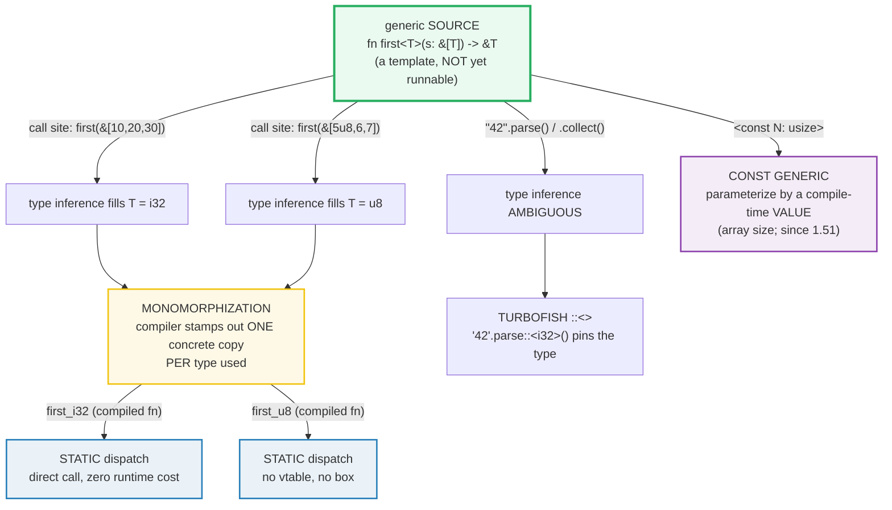

# GENERICS — Type Parameters, Monomorphization, and Const Generics

> **One-line goal:** a **generic** item (`fn first<T>`, `struct Stack<T>`, `enum
> Opt<T>`) is a **compile-time template** parameterized by one or more type
> parameters; the compiler **monomorphizes** it — stamping out one concrete copy
> per type used (**static dispatch**, zero runtime cost, at the price of code-size
> growth); the **turbofish `::<>`** disambiguates type inference; and **const
> generics** (`<const N: usize>`) parameterize by a *compile-time value* (e.g.
> an array's length).
>
> **Run:** `just run generics` (== `cargo run --bin generics`)
> **Member:** `core` (stdlib-only — no `[dependencies]`).
> **Prerequisites:** [STRUCTS_ENUMS](./STRUCTS_ENUMS.md) (you need `struct`/`enum`
> + `impl` first), [OWNERSHIP](./OWNERSHIP.md) (generic `push` takes `T` *by
> value* — a move).
> **Ground truth:** [`generics.rs`](./generics.rs); captured stdout:
> [`generics_output.txt`](./generics_output.txt).

---

## Why this exists (lineage)

Every language with a type system faces the same problem: *"I wrote this
`largest` function for `i32`; now I need the identical logic for `char`, and
again for `f64`."* The naive fix is **copy-paste** — one specialized function per
type. That works until the logic changes and you forget to update copy #3.

The languages differ in *how* they abstract over "the type doesn't matter here":

| Model | Mechanism | Cost / trade-off |
|---|---|---|
| **Java/C# generics (erasure)** | One compiled `List<E>`, `E` erased to `Object`; casts on the way out | Runtime cast + a heap box for primitives (`Integer`); can't do `new E()`. |
| **C++ templates** | Code is **generated per type** at instantiation; "concepts" constrain them | Zero-cost, but errors surface deep in generated code; no shared ABI; Turing-complete metaprogramming. |
| **Go** | No user generics story for years; added in 1.18 (also monomorphized) | Late arrival; interface-based code predates it everywhere. |
| **Rust generics** | A generic item is a **compile-time template**; the compiler **monomorphizes** one concrete copy per type *actually used* → **static dispatch**, zero runtime cost; **trait bounds** constrain `T` (no "concepts" footgun); **const generics** parameterize by values too | Binary **grows** per instantiation (code-size, not speed); compile time rises with the number of monomorphized types. |

Rust's bet: generics are **zero-cost at runtime** because they **cease to exist
at runtime** — by the time the binary runs, every `first::<T>` has been replaced
by a concrete `first_i32` / `first_u8` / `first_str`. The generic source is a
*compile-time fiction* the compiler specializes away. You trade binary size and
compile time for **runtime speed equal to hand-written per-type code** — and you
keep a single source of truth.



---

## The mental model (memorize these)

1. A **generic item** declares its type parameters in angle brackets right after
   the name: `fn first<T>(...)`, `struct Stack<T>`, `enum Opt<T>`,
   `impl<T> Stack<T>`. The same `T` is then usable in parameters, return types,
   fields, and variant payloads.
2. At each **call site**, the compiler either **infers** `T` from the arguments
   or you spell it out with the **turbofish** `name::<T>(...)` when inference is
   ambiguous.
3. **Monomorphization:** for every distinct concrete `T` the generic is used
   with, the compiler generates **one specialized copy**. The result is **static
   dispatch** — a direct call with **zero runtime cost** and **no runtime type
   information**. The price is **binary size** (one copy per type) and compile
   time.
4. Generic items live **entirely in the type system at compile time**. There is
   no boxing, no vtable, no `typeof` — *that* is **trait objects** (`dyn Trait`),
   which opt into dynamic dispatch deliberately (🔗 [TRAIT_OBJECTS]).
5. **`impl<T> Stack<T>`** applies methods to **every** `Stack<T>`; **`impl
   Stack<u8>`** (no `<T>` after `impl`) adds methods **only** to the `Stack<u8>`
   instantiation. They compose.
6. **Const generics** (`<const N: usize>`) add a **compile-time value**
   parameter, so `Arr<T, const N: usize>` can wrap a fixed `[T; N]` and abstract
   over the length. Stabilized in **Rust 1.51** (RFC 2000).

Everything below is a consequence of those six lines.

---

## Section A — A generic function works for ANY `T`

```rust
fn first<T>(slice: &[T]) -> &T {
    &slice[0]
}
```

`<T>` *after the function name* **declares** the type parameter; the same name
is then usable in the parameter (`&[T]`) and return (`&T`) types. Read it as:
"`first` is generic over some type `T`." This `first` works for **any** `T`
because it only borrows element 0 — it needs **no trait bound** on `T` (contrast
the Book's `largest<T>`, which must compare and therefore needs `T: PartialOrd`;
🔗 [TRAIT_BOUNDS]).

> **From generics.rs Section A:**
> ```
> ======================================================================
> SECTION A — a generic fn: fn first<T>(slice: &[T]) -> &T works for any T
> ======================================================================
>   fn first<T>(slice: &[T]) -> &T { &slice[0] }
>   let nums  = [10, 20, 30];
>   let words = ["alpha", "bravo", "charlie"];
>     [first::<i32> called]
>     [first::<&str> called]
>     first(&nums)  -> 10   (T inferred as i32)
>     first(&words) -> "alpha"  (T inferred as &str)
> [check] first(&[10,20,30]) == 10 (instantiated for i32): OK
> [check] first(["alpha","bravo","charlie"]) == "alpha" (instantiated for &str): OK
> ```

**What.** One source definition of `first<T>` serves two unrelated types. At
`first(&nums)` the compiler **infers** `T = i32` (because `nums: [i32; 3]`); at
`first(&words)` it infers `T = &str`. Both return the correct first element,
checked at `10` and `"alpha"`.

**Why (internals).** The `[first::<i32> called]` / `[first::<&str> called]`
diagnostic lines are printed by `std::any::type_name::<T>()` **inside** the
generic function. The fact that the *same source text* prints *different* type
names is the visible fingerprint of monomorphization (Section C makes this the
focus). By convention type parameters are short, often a single letter, and use
`UpperCamelCase`; `T` (short for *type*) is the default choice — the Book:
"we'll use `T` because, by convention, type parameter names in Rust are short,
often just one letter" ([Book ch10.1][book-generics]).

> **Name them well, and in order.** Generic parameters appear in a fixed order:
> **lifetimes, then types, then consts**. You may use multiple type params
> (`struct Point<T, U>`) but the Book warns "using more than a few makes your
> code hard to read" ([Book ch10.1][book-generics]).

---

## Section B — A generic struct (and enum), with a generic `impl`

```rust
struct Stack<T> {
    items: Vec<T>,
}

impl<T> Stack<T> {
    fn push(&mut self, item: T) { self.items.push(item); }  // item: T moves in
    fn pop(&mut self) -> Option<T> { self.items.pop() }
}

enum Opt<T> { Some(T), None }   // exactly the shape of std Option<T>
```

> **From generics.rs Section B:**
> ```
> ======================================================================
> SECTION B — a generic struct: Stack<T> used with i32 AND String
> ======================================================================
>   let mut s = Stack::<i32>::new();  s.push(1);  s.push(2);
>     s.pop() -> Some(2)   (LIFO: last pushed comes out first)
>     s.len() -> 1
> [check] Stack::<i32> push 1,2 then pop == Some(2): OK
> [check] after pop, Stack len == 1: OK
>   let mut names = Stack::new();  push "ada";  push "grace";
>     names.pop() -> Some("grace")
> [check] Stack<String> reuses the same push/pop source (T = String): OK
>   Opt::Some(7) -> Some(7)   Opt::None  -> None
> [check] generic enum Opt<i32>::Some(7) == Some(7): OK
> [check] generic enum Opt<i32>::None is the None variant: OK
> ```

**What.** `Stack<T>` is parameterized by its element type; its single field is a
`Vec<T>`. The **same** `push`/`pop` source stores `i32`s (first check: push 1, 2
→ pop returns `Some(2)`, LIFO) **and** owns `String`s (second check: `push`
takes the `String` *by value*, so the stack owns it — the move is why a
`Stack<String>` can hold heap data). A generic **enum** is identical in shape:
`Opt<T>` carries a `T` in its `Some` variant, exactly mirroring the stdlib's
`Option<T>`.

**Why (internals).**
- **`impl<T> Stack<T>`** declares `T` again *after `impl`* so the methods apply
  to **every** `Stack<T>`. The Book: "we have to declare `T` just after `impl`
  so that we can use `T` to specify that we're implementing methods on the type
  `Point<T>`" ([Book ch10.1][book-generics]). Omitting it (`impl Stack<T>`)
  would be a different (error-prone) meaning — see Section F.
- **`push(item: T)` is a move for non-`Copy` `T`.** That is the ownership hook:
  `push(String)` moves the `String` into the stack; the caller's binding is dead
  afterwards (🔗 [OWNERSHIP]). This is *why* generics and ownership compose for
  free — the type parameter carries the same move/copy rules as any value.
- **Generic enums are the stdlib's null/error story.** `Option<T>` and
  `Result<T, E>` are *just* generic enums ([Book ch10.1][book-generics]); there
  is no special-case `null` (🔗 [STRUCTS_ENUMS]).

> **One type param means one type.** `struct Point<T> { x: T, y: T }` forces `x`
> and `y` to be the **same** type. Mixing them (`Point { x: 5, y: 4.0 }`) is a
> compile error `E0308`. To allow two types, declare two params:
> `struct Point<T, U> { x: T, y: U }` ([Book ch10.1][book-generics]).

---

## Section C — Monomorphization: one source, many compiled copies

This is the load-bearing concept. The Rust Book defines it precisely:

> "*Monomorphization* is the process of turning generic code into specific code
> by filling in the concrete types that are used when compiled. In this process,
> the compiler does the opposite of the steps we used to create the generic
> function... The compiler looks at all the places where generic code is called
> and generates code for the concrete types the generic code is called with."
> ([Book ch10.1][book-generics])

> **From generics.rs Section C:**
> ```
> ======================================================================
> SECTION C — monomorphization: first::<u8> and first::<u32> are TWO fns
> ======================================================================
>   first(&[5u8,6,7])  and  first(&[5u32,6,7])  (same source):
>     [first::<u8> called]
>     [first::<u32> called]
>     -> first::<u8>  returned 5
>     -> first::<u32> returned 5
> [check] first::<u8> and first::<u32> print DISTINCT type names (mono evidence): OK
> [check] first::<u8> returns the u8 5: OK
> [check] first::<u32> returns the u32 5: OK
> ```

**What.** The **same** `fn first<T>` source is called with `T = u8` and
`T = u32`. The diagnostic print inside `first` emits a **distinct** type name per
call — `[first::<u8> called]` vs `[first::<u32> called]`. That is the observable
evidence: the single source produced **two** different runtime behaviors because
the compiler generated **two** different compiled functions (`first_u8` and
`first_u32`, conceptually).

**Why (internals).**
- **Static dispatch, zero runtime cost.** Because each instantiation is a
  separate concrete function, the call is a **direct** jump — no vtable lookup,
  no indirection, no box. The Book: "we pay no runtime cost for using generics.
> When the code runs, it performs just as it would if we had duplicated each
> definition by hand. The process of monomorphization makes Rust's generics
> extremely efficient at runtime" ([Book ch10.1][book-generics]). The Book's
> canonical illustration is `Option<T>`: `Some(5)` and `Some(5.0)` become two
> enums, `Option_i32` and `Option_f64`, as if you had written them by hand.
- **The trade-off is binary size + compile time.** Every new concrete `T` you use
> `first` with adds a compiled copy. For a tiny `first` this is negligible; for
> a large generic over many types it can bloat the binary and slow compilation.
> (C++ calls this the same thing; Java's erasure avoids it but pays with runtime
> casts and boxes.)
- **No runtime type info.** Generics carry their type at **compile** time only.
> `type_name::<T>()` is a *diagnostic* reflection — the std docs stress it is
> "intended for diagnostic use" and "must not be considered to be a unique
> identifier of a type" ([std::any::type_name][std-type-name]). If you need to
> branch on type *at runtime*, that is **trait objects** (`dyn Trait`, vtable) —
> a deliberately different, paid-for mechanism (🔗 [TRAIT_OBJECTS]).
- **`type_name` output is deterministic for primitives.** For built-in scalars
> the name is the bare type (`"u8"`, `"u32"`, `"i32"`, `"&str"`); for library
> types it is the **fully qualified path** (e.g.
> `type_name::<Option<String>>()` → `"core::option::Option<alloc::string::String>"`
> per the std example ([std::any::type_name][std-type-name])). That path form is
> why this bundle sticks to primitives for the verbatim callouts — it keeps the
> output stable across compiler versions.

> **How to *see* monomorphization in your own binary.** `cargo rustc --bin
> generics -- --emit asm -C codegen-units=1` then search the assembly: you'll
> find two distinct symbols for `first` (their mangled names encode the concrete
> `T`). We don't print that here (it is non-portable and the mangled names are
> not stable); `type_name::<T>()` is the portable, deterministic fingerprint.

🔗 [TRAITS_BASICS](./TRAITS_BASICS.md) — `impl Trait` in argument/return
position is *syntactic sugar* for an anonymous generic parameter `<T: Trait>`:
it **also** monomorphizes into static dispatch. 🔗 [TRAIT_OBJECTS](./TRAIT_OBJECTS.md)
— `dyn Trait` is the **opposite** choice: one compiled function, a vtable, runtime
indirection. Know which one you are reaching for.

---

## Section D — Turbofish: disambiguating type inference

Type inference usually fills `T` from the arguments. But some methods are
generic over their **return** type, and the compiler cannot pick a type from
nothing. The **turbofish** `::<...>` spells the type out **at the call site**.

```rust
"42".parse::<i32>()                       // parse is generic over its OUTPUT
[1,2,3].iter().map(|x| x*2).collect::<Vec<i32>>()   // so is collect
```

> **From generics.rs Section D:**
> ```
> ======================================================================
> SECTION D — turbofish ::<> disambiguates when type inference cannot
> ======================================================================
>   "42".parse::<i32>()  -> 42
> [check] "42".parse::<i32>() == 42: OK
> [check] "x".parse::<i32>() falls back to 0 (unwrap_or): OK
>   [1,2,3].iter().map(|x| x*2).collect::<Vec<i32>>() -> [2, 4, 6]
> [check] collect::<Vec<i32>>() on doubled [1,2,3] == [2,4,6]: OK
>   parse each of ["10","20","30"], collect::<Vec<_>>() -> [10, 20, 30]
> [check] collect::<Vec<_>> infers the element type -> [10,20,30]: OK
> ```

**What.** `"42".parse()` is ambiguous — `42` could become `i32`, `u64`, `f64`...
`::<i32>` pins it. Likewise `.collect()` could build a `Vec`, a `HashSet`, a
`String`... `collect::<Vec<i32>>()` (or the turbofish with inference
`collect::<Vec<_>>()`, which fixes the container and lets inference fill the
element) resolves it. Without the annotation the compiler errors
`type annotations needed`.

**Why (internals).**
- The turbofish exists because `::` is needed to disambiguate `<` as "generic
> arguments" rather than "less-than" in expression position. Writing
> `"42".parse<i32>()` would parse `<` as a comparison; `parse::<i32>()` removes
> the ambiguity. (This is exactly why the operator is nicknamed the *turbofish*
> — `::<>` looks like a fish.)
- **Two places it's NOT a turbofish.** On a *type* path (`Vec::<i32>::new()`)
> the `::` is optional (`Vec::<i32>` and `Vec<i32>` both work at the type level);
> it's in *expression*/method-call position that `::<...>` (the turbofish) is
> required. You can also annotate via a **binding type** instead: `let v: Vec<i32>
> = iter.collect();` — clippy's `unused`/style lints sometimes prefer one form;
> both compile to identical monomorphized code.

---

## Section E — Const generics: parameterize by a compile-time VALUE

So far every parameter has been a **type**. Const generics add a parameter that
is a **value** known at compile time — most commonly an array's length.

```rust
struct Arr<T, const N: usize> {
    buf: [T; N],
}
```

`<const N: usize>` is a **const parameter**: a compile-time `usize`, not a type.
It lets `Arr` wrap a genuine fixed-size `[T; N]` and abstract over `N`.

> **From generics.rs Section E:**
> ```
> ======================================================================
> SECTION E — const generics: Arr<T, const N: usize> is parameterized by N
> ======================================================================
>   let arr = Arr::<u8, 4>::full_default();
>     arr.as_slice() -> [0, 0, 0, 0]
>     arr.len()      -> 4  (== the const param N)
> [check] Arr::<u8, 4> buffer is a 4-element zero-filled array: OK
> [check] Arr::<u8, 4>.len() == 4 (the const param N is baked in): OK
>   let bigger = Arr::<u8, 8>::full_default();
>     bigger.len() -> 8  (distinct type from Arr<_, 4>)
> [check] Arr::<u8, 8>.len() == 8 — different N means a different type: OK
>   size_of::<Arr<u8,4>>() = 4,  size_of::<Arr<u8,8>>() = 8
> [check] N changes layout: size_of::<Arr<u8,4>>() == 4 and <...,8> == 8: OK
> ```

**What.** `Arr::<u8, 4>` fixes **both** `T = u8` and `N = 4`. The inner buffer is
a real `[u8; 4]` — fixed size, no heap. `full_default()` fills it with
`u8::default()` (zero), and `.len()` returns `4` because `N` is baked in. The
`size_of` checks prove `N` is part of the **layout**: `Arr<u8,4>` is 4 bytes,
`Arr<u8,8>` is 8 bytes — **different `N` means a different type**.

**Why (internals).**
- **Const generics were stabilized in Rust 1.51** (released 2021-03-25), the
> MVP of RFC 2000. The announcement: "Const generics are generic arguments that
> range over constant values, rather than types or lifetimes. This allows, for
> instance, types to be parameterized by integers" ([const-generics blog][const-generics]).
> Before it, even the stdlib could only implement traits for arrays up to length
> 32 by hand; the feature "finally lifted in Rust 1.47" behind the scenes.
- **`N` is a compile-time constant, so `.len()` can be a `const fn`.** There is
> no stored length field — `N` lives in the *type*, so `Arr<u8,4>::len()` returns
> the literal `4` with no runtime tracking. That is also why `Arr<_, 4>` and
> `Arr<_, 8>` are **non-interchangeable types**: the compiler treats the length
> as part of the type identity.
- **MVP restrictions (still mostly true).** The const-arg type is limited to
> integer types (`usize`, `i32`, ...), `bool`, and `char` — *not* arbitrary
> `&str` or user types yet; and a const argument must be a standalone param, a
> literal, or a concrete `{}`-block expression (no `{ M + 1 }` involving another
> generic) ([const-generics blog][const-generics]). Lifting these is ongoing work
> (`const_evaluatable_checked`, `adt_const_params`).
- **Parameter order is fixed: lifetimes, types, consts.** `Arr<'a, T, N>` — you
> cannot reorder const params ahead of type params in the stable MVP, which is
> why default arguments interact awkwardly with const params ([const-generics blog][const-generics]).

🔗 The canonical pre-const-generics workaround was the `generic-array` crate; the
feature exists largely to retire it and to let you `impl Trait for [T; N]` once
for all `N`.

---

## Section F — Generic `impl<T>` vs concrete `impl`

You can implement methods on **every** instantiation, or on **one** specific
instantiation. They compose.

```rust
impl<T> Stack<T> { fn pop(&mut self) -> Option<T> { ... } }   // every Stack<T>
impl Stack<u8> { fn byte_sum(&self) -> u8 { ... } }           // ONLY Stack<u8>
```

> **From generics.rs Section F:**
> ```
> ======================================================================
> SECTION F — generic impl<T> vs concrete impl (methods only on Stack<u8>)
> ======================================================================
>   let mut bytes = Stack::<u8>::new();  push 10, 20, 5;
>     bytes.byte_sum() -> 35   (method from the CONCRETE impl)
> [check] concrete impl Stack<u8>::byte_sum sums the bytes (10+20+5 == 35): OK
>     bytes.pop() -> Some(5)   (generic impl<T> method)
> [check] Stack<u8> still has the GENERIC impl's pop() (== Some(5)): OK
>   let mut ints = Stack::<i32>::new();  push 100, 200;
>     ints.pop() -> Some(200)   (ints.byte_sum() would NOT compile)
> [check] generic impl methods apply to Stack<i32> too (pop -> Some(200)): OK
> ```

**What.** `Stack<u8>` has **both** the generic `impl<T>` methods (`pop`, from
Section B) **and** the concrete `impl Stack<u8>` method (`byte_sum`). `Stack<i32>`
has the generic ones but **not** `byte_sum` — calling `ints.byte_sum()` would not
compile. The first check confirms `byte_sum` sums the bytes (`10+20+5 == 35`); the
last two confirm the generic methods still work on both instantiations.

**Why (internals).**
- **`impl<T> Stack<T> { ... }`** declares `T` after `impl`, so the block applies
> to **all** `Stack<T>`. The methods can use `T` in their own signatures
> (independently of the struct's `T`, even under different names — the Book's
> `mixup<X2,Y2>` example, Listing 10-11 ([Book ch10.1][book-generics])).
- **`impl Stack<u8> { ... }`** (no `<T>` after `impl`) is a **concrete impl**:
> it adds methods that exist **only** on the `Stack<u8>` instantiation. The Book's
> example is `impl Point<f32> { fn distance_from_origin(&self) -> f32 { ... } }`,
> "other instances of `Point<T>` where `T` is not of type `f32` will not have this
> method defined" ([Book ch10.1][book-generics]). Use it to give a specific
> instantiation extra, type-specific behavior.
- **They compose freely.** A given instantiation can receive methods from one
> generic `impl<T>` block **plus** any number of concrete `impl` blocks whose
> type it matches. This is how you give `Stack<u8>` a `byte_sum` without forcing
> a meaningless `byte_sum` onto `Stack<String>`.

> **The compile error** (calling a concrete-only method on the wrong
> instantiation) cannot live in the runnable `.rs` — it would not build. It is:
> ```console
> error[E0599]: no method named `byte_sum` found for struct `Stack<i32>` in the current scope
>   |
>   |     ints.byte_sum();
>   |          ^^^^^^^^ method not found in `Stack<i32>`
> ```
> The fix is either restrict the call to a `Stack<u8>`, or (if every `T` should
> have it) move the method into the generic `impl<T>` block with an appropriate
> trait bound (🔗 [TRAIT_BOUNDS]).

---

## Pitfalls (the expert payoff)

| Trap | Symptom | Fix / why |
|---|---|---|
| **Forgetting to declare `T` after `impl`** | `impl Stack<T> { ... }` compiles but means "implement for the *specific* type `Stack<T>` where `T` is some external type" — methods vanish | Write `impl<T> Stack<T>` to implement for **all** instantiations. The `<T>` between `impl` and the type is what makes it generic ([Book ch10.1][book-generics]). |
| **Concrete-only method on the wrong type** | `error[E0599]: no method named \`byte_sum\` found for \`Stack<i32>\`` | The method lives in `impl Stack<u8>` only. Move it to `impl<T> Stack<T>` (with a bound) if every `T` needs it, or call it on the matching instantiation. |
| **`struct Point<T> { x: T, y: T }` then mixing field types** | `error[E0308]: mismatched types` on `Point { x: 5, y: 4.0 }` | One `T` forces both fields to the same type. Use two params: `Point<T, U>` ([Book ch10.1][book-generics]). |
| **Type inference can't pick the type** | `error[E0282]: type annotations needed` on `.parse()` / `.collect()` | Add the **turbofish** `::<T>` at the call site, or annotate the binding (`let v: Vec<i32> = ...`). |
| **Expecting a runtime type check** | "Why can't I `match` on `T` inside a generic fn?" | Generics carry their type at **compile** time only; `T` is erased to its concrete type per instantiation. For runtime type branching use `dyn Trait` (🔗 [TRAIT_OBJECTS]) or `std::any::Any`. |
| **Binary bloat from too many instantiations** | Large `.rlib`/binary, slow link | Every distinct `T` monomorphizes a new copy. If a generic is instantiated across hundreds of types, consider a trait-object version for the cold paths (one copy, vtable) and keep monomorphization for hot paths. |
| **Treating `type_name::<T>()` as a unique ID** | "Two different types printed the same name" / code breaks across compiler versions | The std docs: it's "for diagnostic use", "must not be considered to be a unique identifier", and "may change between versions" ([std::any::type_name][std-type-name]). Never key logic on it. |
| **Const generic `N` you can't compute** | `error: generic parameters may not be used in const arguments` for `{ M + 1 }` | MVP restriction: a const arg must be a standalone param, a literal, or a concrete `{}`-block with no other generics ([const-generics blog][const-generics]). Use `min_const_generics`-friendly forms; complex exprs need nightly. |
| **Expecting `Arr<_, 4>` and `Arr<_, 8>` to interoperate** | Type-mismatch errors when passing one where the other is expected | `N` is part of the **type**. Different `N` ⇒ different type ⇒ no implicit conversion. That's the feature (length-checked at compile time), not a bug. |
| **Parameter order confusion** | `<'a, const N, T>` rejected | Fixed order: **lifetimes, types, consts**. Const params come last in the MVP ([const-generics blog][const-generics]). |

---

## Cheat sheet

```rust
// GENERIC FN: <T> after the name DECLARES the param; usable in sig + body.
fn first<T>(slice: &[T]) -> &T { &slice[0] }

// GENERIC STRUCT / ENUM: <T> after the name; T usable in fields / variants.
struct Stack<T> { items: Vec<T> }
enum Opt<T> { Some(T), None }                       // == std Option<T>

// GENERIC IMPL (all instantiations)  vs  CONCRETE IMPL (one instantiation):
impl<T> Stack<T> { fn pop(&mut self) -> Option<T> { ... } }   // every Stack<T>
impl Stack<u8>  { fn byte_sum(&self) -> u8 { ... } }          // ONLY Stack<u8>

// TYPE INFERENCE fills T at the call site; TURBOFISH ::<> when ambiguous.
first(&[10, 20]);                  // T inferred = i32
"42".parse::<i32>();               // parse is generic over OUTPUT -> turbofish
iter.collect::<Vec<_>>();          // collect too; _ lets inference fill element

// MONOMORPHIZATION: one concrete compiled copy PER type used.
//   first::<i32> and first::<u8> are TWO distinct fns -> static dispatch,
//   zero runtime cost, no vtable. Price: binary size + compile time.
//   Portable fingerprint: std::any::type_name::<T>() (diagnostic ONLY).

// CONST GENERICS (since 1.51, RFC 2000): parameterize by a compile-time VALUE.
struct Arr<T, const N: usize> { buf: [T; N] }
let a = Arr::<u8, 4>::full_default();              // T=u8, N=4 (value, not type)
//   N is part of the TYPE: Arr<_,4> != Arr<_,8>. Order: lifetimes, types, consts.
```

---

## Sources

Every claim above was web-verified in at least two authoritative places.

- **The Rust Programming Language, ch10.1 "Generic Data Types"** — declaring
  `fn largest<T>`, `struct Point<T>`, `enum Option<T>`/`Result<T,E>`, `impl<T>
  Point<T>` vs `impl Point<f32>`, multiple type params, the definition of
  monomorphization, the `Option_i32`/`Option_f64` expansion, "we pay no runtime
  cost for using generics", naming convention for `T`:
  https://doc.rust-lang.org/book/ch10-01-syntax.html
- **`std::any::type_name` docs** — returns `&'static str`, "intended for
  diagnostic use", "must not be considered to be a unique identifier of a type",
  "output may change between versions", the `Option<String>` example printing
  `"core::option::Option<alloc::string::String>"`:
  https://doc.rust-lang.org/std/any/fn.type_name.html
- **Rust Blog — "Const generics MVP hits beta!" (2021-02-26)** — stabilized for
  Rust 1.51 (released 2021-03-25); "generic arguments that range over constant
  values, rather than types or lifetimes"; MVP restrictions (only integral/bool/
  char types; no complex `{ M + 1 }` expressions); the `ArrayPair<T, const N:
  usize>` example; fixed parameter order lifetimes→types→consts:
  https://blog.rust-lang.org/2021/02/26/const-generics-mvp-beta/
- **The Rust RFC Book — RFC 2000 "const generics"** — the original accepted RFC:
  parameterize types by constant values, structural equality (`StructuralEq`)
  requirement, motivating array-trait example:
  https://rust-lang.github.io/rfcs/2000-const-generics.html
- **Tracking issue for const generics (RFC 2000) #44580** — stabilization
  history, the `min_const_generics` MVP scope:
  https://github.com/rust-lang/rust/issues/44580
- **The Rust Reference — "Items" / Generic parameters** — parameter kinds
  (lifetimes, types, consts), declaration and ordering, default parameters:
  https://doc.rust-lang.org/reference/items.html
