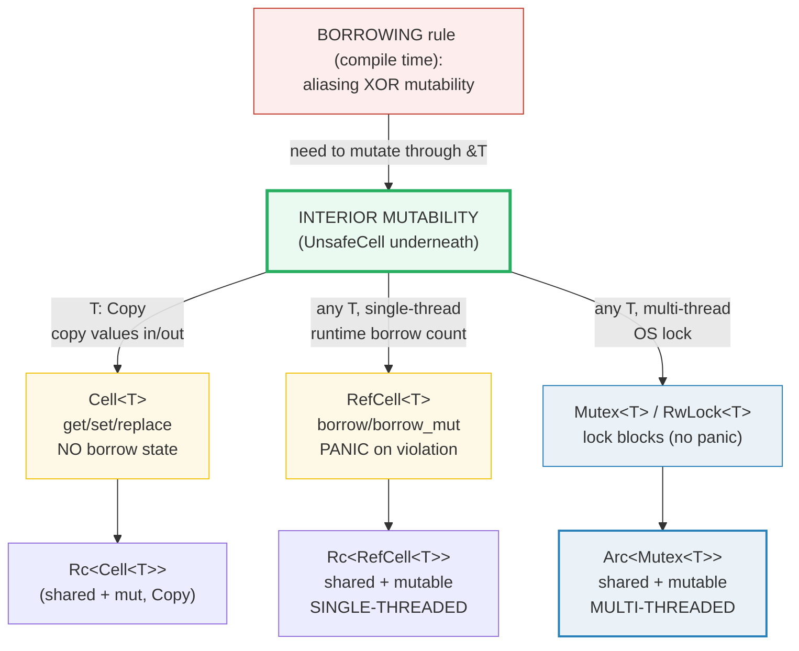

# INTERIOR_MUTABILITY — Mutating Through a Shared `&T`

> **One-line goal:** the **interior-mutability** pattern lets you **mutate** a
> value through a **shared `&T`** (which the borrow checker normally treats as
> read-only) by re-asserting the *aliasing-XOR-mutability* rule **elsewhere** —
> on a `Copy` value (`Cell`), at **runtime** (`RefCell`, which **panics** on a
> violation), or behind a **blocking lock** (`Mutex`/`RwLock`, thread-safe).
> Every one of them is built on the same `unsafe` primitive: `UnsafeCell`.
>
> **Run:** `just run interior_mutability` (== `cargo run --bin interior_mutability`)
> **Member:** `core` (stdlib-only — no `[dependencies]`).
> **Prerequisites:** 🔗 [BORROWING](./BORROWING.md) (the compile-time rule this
> evades), 🔗 [OWNERSHIP](./OWNERSHIP.md) (moves / `Drop`), 🔗
> [COPY_CLONE](./COPY_CLONE.md) (why `Cell` needs `T: Copy`).
> **Ground truth:** [`interior_mutability.rs`](./interior_mutability.rs);
> captured stdout: [`interior_mutability_output.txt`](./interior_mutability_output.txt).

---

## Why this exists (lineage)

Rust's whole memory-safety story rests on one rule, stated verbatim by the
`std::cell` module docs ([std::cell][std-cell]):

> Given an object `T`, it is only possible to have one of the following:
> - Several immutable references (`&T`) to the object (**aliasing**).
> - One mutable reference (`&mut T`) to the object (**mutability**).

🔗 [BORROWING](./BORROWING.md) enforces this **statically**, at compile time.
That is the default — "inherited mutability" — and it is almost always what you
want. But a few legitimate designs *cannot* be expressed under it:

- A shared smart pointer (`Rc<T>` / `Arc<T>`) hands out many `&T` clones. To
  mutate the shared value you must mutate **through** one of those `&T`s.
- A `Clone` impl must take `&self` (the trait fixes the signature), yet `Rc`'s
  clone needs to bump a refcount — i.e. mutate behind `&self`.
- A trait method declared `fn f(&self)` must mutate internal state (a cache, a
  mock recorder) without changing the public, immutable-looking signature.

The interior-mutability types solve all three: they wrap an `unsafe`
`UnsafeCell` and expose a **safe** API that re-establishes the aliasing rule
**dynamically** instead of statically. The compiler still sees only `&T`
flowing around; the cell itself takes responsibility for never handing out an
aliased `&mut T`.



The rest of this guide walks the four sections of that diagram in order.

---

## Section A — `Cell<T>`: interior mutability for `Copy` types

```rust
use std::cell::Cell;

let cell = Cell::new(5i32);   // cell is NOT declared `mut`
let r: &Cell<i32> = &cell;
r.set(7);                     // mutate through an & !
assert_eq!(cell.get(), 7);
```

> **From interior_mutability.rs Section A:**
> ```
> ======================================================================
> SECTION A — Cell<T>: interior mutability for COPY types (get/set)
> ======================================================================
>   let cell = Cell::new(5i32);   cell.get() = 5
>   let r: &Cell<i32> = &cell;  r.set(7);   // mutate via an & !
>   cell.get() = 7
> [check] Cell: set(7) through &cell => get() == 7: OK
>   cell.replace(42) -> old = 7;  cell.get() = 42
> [check] Cell::replace returns the old value (7) and installs 42: OK
>   size_of::<Cell<i32>>() = 4, size_of::<i32>>() = 4  (identical)
> [check] Cell<i32> shares i32's layout (no borrow state — needs T: Copy): OK
> ```

**What.** `Cell<T>` lets you mutate through a shared `&Cell<T>` by **copying
values in and out** — `get()` (requires `T: Copy`), `set()`, `replace()`,
`take()` (requires `T: Default`). The output proves `set(7)` through `&cell`
changes the value to `7`, and `replace(42)` returns the *old* value `7` while
installing `42`.

**Why (internals).** The `std::cell` docs define `Cell<T>` precisely: it
"implements interior mutability by moving values in and out of the cell. That
is, **a `&T` to the inner value can never be obtained**" ([std::cell][std-cell]).
Because no borrow ever points *into* the interior, two `&Cell<T>` aliases can
never produce two `&mut T` to the same byte — the aliasing rule is trivially,
structurally upheld, so `Cell` needs **no borrow counter**. The size check makes
this concrete: `size_of::<Cell<i32>>() == size_of::<i32>() == 4` — `Cell<T>`
adds zero bytes of bookkeeping (it is `repr(transparent)` over `UnsafeCell<T>`).
The price is the **`T: Copy` bound**: you can only ever move whole values
through the cell, never borrow a piece of them. 🔗 [COPY_CLONE](./COPY_CLONE.md)
covers which types are `Copy`.

> **Real-world use.** `Rc<T>` keeps its strong/weak refcounts in `Cell<usize>`
> precisely so `Clone` (which is `&self`) can bump them — the canonical
> "mutation behind an immutable API" case ([std::cell][std-cell]).

---

## Section B — `RefCell<T>`: borrow / borrow_mut, checked at RUNTIME

```rust
use std::cell::RefCell;

let logs = RefCell::new(Vec::<&str>::new());
logs.borrow_mut().push("hello");   // RefMut<Vec> — DerefMut to push through
let len = logs.borrow().len();     // Ref<Vec> — many shared at once
```

> **From interior_mutability.rs Section B:**
> ```
> ======================================================================
> SECTION B — RefCell<T>: borrow / borrow_mut, checked at RUNTIME
> ======================================================================
>   let logs = RefCell::new(Vec::<&str>::new());
>   logs.borrow_mut().push("hello");
>   logs.borrow().len() = 1   logs.borrow()[0] = "hello"
> [check] RefCell<Vec>: borrow_mut().push then borrow().len() == 1: OK
>   two borrow() at once: r1[0] = "hello", r2[0] = "hello"
> [check] RefCell allows multiple simultaneous borrow() guards: OK
> ```

**What.** `RefCell<T>` works for **any** `T` (not just `Copy`). It hands out two
smart-pointer guards: `borrow()` → `Ref<T>` (shared, many at once) and
`borrow_mut()` → `RefMut<T>` (exclusive, one at a time). Both `Deref`/`DerefMut`
to the interior, so `logs.borrow_mut().push(...)` mutates the inner `Vec`
directly. The two `borrow()` guards held simultaneously confirm the shared-borrow
rule works exactly like `&T`.

**Why (internals).** Unlike `Cell`, `RefCell` *does* let you borrow the
interior — so it must actually **track** borrows. It keeps a signed borrow
state: "positive values represent the number of `Ref` active. Negative values
represent the number of `RefMut` active" ([core/src/cell.rs][src-cell]). The
`Ref`/`RefMut` guards implement `Drop`: dropping them decrements the count,
releasing the borrow. This is **dynamic borrowing** — the very same
aliasing-XOR-mutability rule, but checked at the moment you call
`borrow`/`borrow_mut` rather than by the compiler ([std::cell][std-cell]).

> **Single-threaded only.** The `std::cell` docs are explicit: `Cell`,
> `RefCell`, and `OnceCell` "allow doing this in a single-threaded way — **they
> do not implement `Sync`**" ([std::cell][std-cell]). The borrow counter is a
> plain integer with no synchronization; if two threads raced on it the
> tracking itself would be a data race. (They *are* `Send` when `T: Send`, so
> you can move one into another thread — you just can't share a `&RefCell`
> across threads.)

---

## Section C — A second `borrow_mut` PANICS (caught, not fatal)

This is the load-bearing difference from compile-time borrowing: a violation is
not a build error, it is a **runtime panic**.

```rust
let cell = RefCell::new(5i32);
let _b1 = cell.borrow_mut();
let _b2 = cell.borrow_mut();   // <-- PANIC at runtime: "already borrowed"
```

> **From interior_mutability.rs Section C:**
> ```
> ======================================================================
> SECTION C — RefCell: a second borrow_mut PANICS (caught, not fatal)
> ======================================================================
>   let cell = RefCell::new(5i32);
>   two borrow_mut() in one scope -> catch_unwind caught a panic = true
> [check] double borrow_mut is caught as Err (not fatal to the program): OK
>   panic message: "RefCell already borrowed"
> [check] the RefCell panic message mentions 'borrowed': OK
>   after the panic, cell.borrow() = 5  (cell still usable)
> [check] after a caught panic the RefCell is usable (RefMut dropped on unwind): OK
> ```

**What.** Two `borrow_mut()` calls in the same scope is an exclusive-borrow
conflict. The program **does not abort**: it is wrapped in
`std::panic::catch_unwind`, which catches the panic and returns `Err(Box<dyn
Any>)`. The actual panic message — downcast from the payload — is the verbatim
`"RefCell already borrowed"`. After the catch the cell reads `5` again: it is
fully usable.

**Why (internals).**
- **The panic is the runtime enforcement.** The Book: "if you try to violate
  these rules, rather than getting a compiler error as we would with
  references, the implementation of `RefCell<T>` will panic at runtime"
  ([Book ch15.5][book-15-5]). The panic message comes straight from the stdlib
  source: `const_panic!("RefCell already borrowed", …)` for a second
  `borrow_mut`, and `"already mutably borrowed"` for a `borrow()` while a
  `borrow_mut` is live ([core/src/cell.rs][src-cell]). All variants contain the
  word `"borrowed"`, which is what the check verifies.
- **`catch_unwind` works because the default strategy is `unwind`.** Rust's
  panic strategy defaults to unwinding the stack (not `abort`). Unwinding runs
  destructors of locals in the panicking frame — so `_b1` (the first `RefMut`)
  is **dropped during the unwind**, which decrements the borrow count back to
  `0`. That is why the cell is clean and readable afterwards. (If you compiled
  with `panic = "abort"`, `catch_unwind` could not catch anything — there is no
  unwinding to catch.)
- **The panic hook is silenced here** (`panic::set_hook(Box::new(|_| {}))` then
  restored) so the deliberate panic does not spam stderr — a common pattern when
  you *expect* a panic and want to assert on it without noise.

> **The Book's verdict on this trade-off:** runtime checking "means you'd
> potentially be finding mistakes in your code later in the development process:
> possibly not until your code was deployed to production. Also, your code would
> incur a small runtime performance penalty" ([Book ch15.5][book-15-5]). That is
> why interior mutability is a *last resort*, not a default — see the pitfalls
> table.

---

## Section D — `Rc<RefCell<T>>`: multiple owners that can MUTATE

```rust
use std::cell::RefCell;
use std::rc::Rc;

let shared = Rc::new(RefCell::new(0));
let a = Rc::clone(&shared);
let b = Rc::clone(&shared);
*a.borrow_mut() += 99;          // mutate through one clone
assert_eq!(*b.borrow(), 99);     // ...seen by the other clone
```

> **From interior_mutability.rs Section D:**
> ```
> ======================================================================
> SECTION D — Rc<RefCell<T>>: multiple owners that can MUTATE
> ======================================================================
>   let shared = Rc::new(RefCell::new(0));
>   let owner_a = Rc::clone(&shared);  let owner_b = Rc::clone(&shared);
>   Rc strong_count = 3
> [check] two clones + original => Rc strong_count == 3: OK
>   *owner_a.borrow_mut() += 99;   // mutate through one clone
>   owner_a.borrow() = 99   owner_b.borrow() = 99
> [check] Rc<RefCell<T>>: a mutation via one clone is seen by all (== 99): OK
> ```

**What.** `Rc<T>` gives **multiple owners** but only shared (`&`) access to the
value. `RefCell<T>` adds **mutation** behind that `&`. Stacked, `Rc<RefCell<T>>`
is the classic "graph node" type: several handles own one value and any of them
can mutate it. The output shows `strong_count == 3`, then a mutation through
`owner_a` is visible to `owner_b` (`99`) — they point at the *same* `RefCell`
interior.

**Why (internals).** `Rc<T>`'s `clone` only bumps the refcount (a `Cell<usize>`,
per Section A); it never copies the data, so all clones alias one heap
allocation. Without a cell inside, that aliasing would make the data immutable
for good (🔗 [BOX_RC_ARC](./BOX_RC_ARC.md)). The `std::cell` docs call stacking
the two "the" standard idiom: "It's very common then to put a `RefCell<T>`
inside shared pointer types to reintroduce mutability" ([std::cell][std-cell]),
with the explicit warning that an out-of-scope borrow "would cause a dynamic
thread panic. This is the major hazard of using `RefCell`."

> **`Rc<RefCell<T>>` is single-threaded.** Both halves are `!Sync` (`Rc` is
> `!Sync`, `RefCell` is `!Sync`). The **multi-threaded twin is
> `Arc<Mutex<T>>`** — `Arc` for shared atomic ownership, `Mutex` for the
> thread-safe interior mutability. The two combos are a matched pair.

---

## Section E — `Mutex` / `RwLock`: thread-safe interior mutability

```rust
use std::sync::{Arc, Mutex};
use std::thread;

let counter = Arc::new(Mutex::new(0i32));
let mut handles = Vec::new();
for _ in 0..4 {
    let counter = Arc::clone(&counter);
    handles.push(thread::spawn(move || { *counter.lock().unwrap() += 10; }));
}
for h in handles { h.join().unwrap(); }
assert_eq!(*counter.lock().unwrap(), 40);   // deterministic
```

> **From interior_mutability.rs Section E:**
> ```
> ======================================================================
> SECTION E — Mutex / RwLock: thread-safe interior mutability (block, not panic)
> ======================================================================
>   let m = Mutex::new(0i32);
>   inside lock(): *guard = 42
>   after block: *m.lock().unwrap() = 42
> [check] Mutex lock + mutate -> 42: OK
>   RwLock: two read() guards at once: 100 and 100
> [check] RwLock allows multiple simultaneous read() guards: OK
>   RwLock: write() guard mutates 100 -> 101
> [check] RwLock write() guard mutates -> 101: OK
>   4 threads * (+10) under Arc<Mutex> -> total = 40
> [check] Arc<Mutex<i32>>: 4 threads * 10 = 40 (lock serializes, deterministic): OK
> ```

**What.** `Mutex<T>` and `RwLock<T>` are the **`Sync`** versions of the
interior-mutability cell. `lock()` returns a `MutexGuard` (a `DerefMut` smart
pointer, like `RefMut`); if another thread holds the lock, the caller **blocks
(waits)** instead of panicking. `RwLock` splits the API: many `read()` guards
at once, or one exclusive `write()` guard. The four-thread demo proves real
thread-safety: each thread adds `10` under the lock, and after `join` the total
is **deterministically `40`** no matter how the OS scheduled them.

**Why (internals).**
- **They are interior-mutability types too.** `lock(&self)` takes `&self`, so a
  `Mutex` can be mutated behind a shared reference — the same trick as `RefCell`,
  but the bookkeeping is an **OS lock** (a futex/`pthread_mutex`) instead of an
  integer count. The `std::cell` docs map the two families directly: "The
  corresponding `Sync` version of `RefCell<T>` is `RwLock<T>`" ([std::cell][std-cell]).
- **Why they are `Sync` where `RefCell` is not.** `Mutex<T>: Send` and
  `Mutex<T>: Sync` whenever `T: Send` (compile-checked in this bundle); `RwLock`
  likewise. The lock guarantees mutual exclusion at the hardware level, so two
  threads sharing a `&Mutex<T>` cannot produce aliased `&mut T`. `RefCell`'s
  plain integer count cannot offer that guarantee, so it is `!Sync` and the
  compiler refuses to share one across threads (🔗 [THREADS](./THREADS.md)).
- **Blocking, not panicking.** Contention is the *normal* state for a `Mutex`;
  it would be absurd to panic every time a lock is held. So `lock()` waits.
  The only panic is **poisoning**: if a thread panics *while holding the lock*,
  the `Mutex` is marked poisoned and later `lock()` calls return `Err` (the
  `.unwrap()` in the demo handles that `Result`).
- **Determinism preserved.** The increment order across threads is
  non-deterministic, but the *sum* after all `join`s is not — the lock
  serializes the `+= 10`s. We print only the post-join total, never per-thread
  order (see the DETERMINISM rule, `HOW_TO_RESEARCH.md` §4.2).

> 🔗 [THREADS](./THREADS.md) covers `Mutex`/`RwLock`, `Send`/`Sync`, and poisoning
> in depth (Phase 4). This bundle only recaps them as the thread-safe branch of
> interior mutability.

---

## Section F — `UnsafeCell`: the primitive beneath all of them

```rust
use std::cell::UnsafeCell;

let uc = UnsafeCell::new(5i32);
let _ptr: *mut i32 = uc.get();   // the ONLY core-legal door to mutable &T
// *_ptr;   // <- UNSAFE: dereferencing is the programmer's responsibility
```

> **From interior_mutability.rs Section F:**
> ```
> ======================================================================
> SECTION F — UnsafeCell: the primitive beneath Cell / RefCell / Mutex
> ======================================================================
>   let uc = UnsafeCell::new(5i32);
>   size_of::<UnsafeCell<i32>>() = 4, size_of::<i32>>() = 4  (identical)
> [check] UnsafeCell<T> shares T's layout (repr(transparent), zero-cost wrapper): OK
> [check] UnsafeCell::get() yields a non-null raw pointer to the interior: OK
>   uc.get() -> *mut i32  (raw ptr; dereferencing it is `unsafe`)
> ```

**What.** `UnsafeCell<T>` is the **only** core-language-legal way to have a
`&T` whose interior may be mutated. `get(&self)` returns a `*mut T` raw pointer
to the interior; the `size_of` check confirms it shares `T`'s layout
(`repr(transparent)`, zero cost). This bundle only *constructs* it and reads
structural facts — it never dereferences the pointer.

**Why (internals).** The docs title `UnsafeCell` "the core primitive for
interior mutability in Rust" and state the load-bearing invariant: "**The
`UnsafeCell<T>` type is the only legal way to obtain aliasable data that is
considered mutable.**" ([std::cell][std-cell-unsafe]). Its `get()` is the single
door through which `Cell`, `RefCell`, `Mutex`, and `RwLock` all reach the
interior — they wrap an `UnsafeCell` and add the bookkeeping (none / borrow
count / OS lock) that turns raw aliasing back into *safe* aliasing. `UnsafeCell`
itself does **nothing** at runtime: it is a zero-cost marker that tells the
compiler "this `&T` may change, so do not apply aliasing-based optimizations
(niche-filling, `noalias`) to it." Using it correctly is `unsafe` and is the
subject of 🔗 [DROP_UNSAFE](./DROP_UNSAFE.md) — the golden rule is that *you*
must uphold aliasing-XOR-mutability by hand, or the result is **undefined
behavior**, not a panic.

---

## The decision table

| You have… | and want… | Use | Violation → | `Sync`? |
|---|---|---|---|---|
| `T: Copy`, single-thread | mutate via `&` | `Cell<T>` | impossible (no borrows out) | **no** |
| any `T`, single-thread | mutate via `&` | `RefCell<T>` | **panic** | **no** |
| any `T`, single-thread + multi-owner | mutate via `&` | `Rc<RefCell<T>>` | panic | **no** |
| any `T`, multi-thread | mutate via `&` | `Mutex<T>` / `RwLock<T>` | **blocks** | **yes** |
| any `T`, multi-thread + multi-owner | mutate via `&` | `Arc<Mutex<T>>` | blocks | **yes** |
| — (the escape hatch) | build your own cell | `UnsafeCell<T>` | **UB** if you get it wrong | **no** |

---

## Pitfalls (the expert payoff)

| Trap | Symptom | Fix / why |
|---|---|---|
| **Holding a `borrow()` across a `borrow_mut()`** | `thread 'main' panicked at 'already borrowed'` (or `'already mutably borrowed'`) | The first guard is still live. Scope the guard tightly (`drop(guard)` or a `{}` block) before the conflicting borrow — exactly the "major hazard of `RefCell`" the docs warn about ([std::cell][std-cell]). |
| **`RefCell` panic in production** | a panic that only shows under a rare call pattern, post-deploy | Runtime checks catch violations *late*. Keep `RefCell` to mock objects / caches / single-threaded graphs; for shared state prefer `Mutex`/`RwLock`. Default to compile-time borrowing. |
| **`Cell<T>` with a non-`Copy` type** | `error: T does not implement Copy` on `.get()` | `Cell` copies values through; use `RefCell<T>` for non-`Copy` types, or `Cell::replace`/`take` (needs `T: Default`) which work for any `T`. |
| **`RefCell` across threads** | `error: \`RefCell<i32>\` cannot be shared between threads safely` (`Rc<RefCell>` is `!Sync`) | That is the type system **forcing** you to `Mutex`/`RwLock`. Use `Arc<Mutex<T>>`. The error is a feature, not a bug. |
| **`panic = "abort"` + `catch_unwind`** | a `RefCell` (or any) panic aborts instead of being caught | `catch_unwind` only works under the default `unwind` strategy. Under `abort` there is no unwinding to catch. Don't rely on catching a `RefCell` panic in an `abort` build. |
| **`Mutex` lock poisoning** | `lock().unwrap()` panics with `PoisonError` after a thread panicked while holding the lock | A panic mid-lock leaves the data possibly inconsistent; the `Mutex` refuses further access. Decide a policy: `.unwrap()` (propagate) or recover via `PoisonError::into_inner()`. |
| **`RwLock` writer starvation** | writers never acquire under heavy read load (some implementations) | `RwLock` favors readers on some platforms. If write latency matters, prefer `Mutex`, which has no reader preference. |
| **`Cell`/`RefCell` are `!Sync`** | "cannot be shared between threads" even though `T` is `Send`/`Sync` | The cell's own bookkeeping is unsynchronized. They *are* `Send`, so you may **move** one to another thread — just not share a `&` to one. |
| **Expecting `Cell` to borrow the interior** | "I want a `&mut Vec` inside my `Cell`" | `Cell` never exposes `&T`/`&mut T`; it only moves whole values. For interior borrows you need `RefCell`. |
| **Treating `UnsafeCell` as "just a struct"** | silent UB from aliasing-based miscompilation | `UnsafeCell` is what tells the optimizer "this `&T` may mutate." A plain `&T` you mutate via raw pointers is **UB**. Use `UnsafeCell` (and uphold the aliasing rule) or reach for a safe cell. |

---

## Cheat sheet

```rust
use std::cell::{Cell, RefCell, UnsafeCell};
use std::rc::Rc;
use std::sync::{Arc, Mutex, RwLock};

// ── Cell<T> : Copy types, copy values in/out, NO borrow of interior ──
let c = Cell::new(5i32);          // c is NOT mut
(&c).set(7);                      // mutate through &Cell — legal
let _old = c.replace(42);         // returns old (7), installs 42
c.get();                          // needs T: Copy. size_of::<Cell<T>>() == size_of::<T>()

// ── RefCell<T> : any T, borrow tracked at RUNTIME (panic on conflict) ──
let r = RefCell::new(vec![1, 2]);
r.borrow_mut().push(3);           // RefMut — DerefMut
let _n = r.borrow().len();        // Ref   — many at once;  r.borrow() == &[T]
// r.borrow_mut(); while a borrow() lives  => PANIC "already mutably borrowed"

// ── The combos ──
let single = Rc::new(RefCell::new(0));   // shared + mutable, SINGLE-threaded (!Sync)
let multi  = Arc::new(Mutex::new(0));    // shared + mutable, MULTI-threaded  (Sync)

// ── Mutex / RwLock : the Sync cells. lock() BLOCKS (does not panic) ──
let m = Mutex::new(0i32);
*m.lock().unwrap() = 42;          // MutexGuard: DerefMut, released on Drop
let rw = RwLock::new(0i32);
{ let _r1 = rw.read().unwrap(); let _r2 = rw.read().unwrap(); } // many readers
{ *rw.write().unwrap() = 7; }                                       // OR one writer

// ── UnsafeCell<T> : the ONLY legal &T-that-can-mutate; unsafe to use ──
//   Cell / RefCell / Mutex / RwLock all wrap one. get() -> *mut T (deref = UB
//   unless YOU uphold aliasing-XOR-mutability).  See DROP_UNSAFE.
```

**One sentence:** interior mutability trades a **static** guarantee (`&T` is
read-only) for a **dynamic** one (the cell re-checks aliasing — by being
copy-only, by panicking, or by blocking) so you can mutate through `&T` when the
borrow checker cannot prove safety; the whole edifice stands on the `unsafe`
`UnsafeCell`.

---

## Sources

Every claim above was web-verified against at least two authoritative sources.

- **The Rust Programming Language, ch15.5 "RefCell<T> and the Interior
  Mutability Pattern"** — the definition of interior mutability, the
  borrow-rules-at-runtime trade-off ("your program will panic and exit"),
  single-threaded-only, `Rc<RefCell<T>>` for "multiple owners of mutable data",
  the cons-list example (5 → 15 seen by all), and "`Mutex<T>` is the
  thread-safe version of `RefCell<T>`":
  https://doc.rust-lang.org/book/ch15-05-interior-mutability.html
- **`std::cell` module docs** — the aliasing-XOR-mutability rule quoted
  verbatim; "Cell, RefCell, OnceCell … do not implement `Sync`"; `Cell` "a `&T`
  to the inner value can never be obtained"; `RefCell` "Borrows … are tracked at
  runtime … If a borrow is attempted that would violate these rules, the thread
  will panic"; "The corresponding `Sync` version of `RefCell<T>` is
  `RwLock<T>`"; the `Rc<RefCell<…>>` example and "this is the major hazard of
  using `RefCell`"; `Rc` refcounts in a `Cell`:
  https://doc.rust-lang.org/std/cell/index.html
- **`std::cell::Cell` docs** — `get()` requires `T: Copy`, `set`/`replace`/`take`
  semantics, "Cell<T> has the same memory layout and caveats as UnsafeCell<T>":
  https://doc.rust-lang.org/std/cell/struct.Cell.html
- **`std::cell::RefCell` docs** — `borrow()`/`borrow_mut()` → `Ref`/`RefMut`,
  "Panics if the value is currently [mutably] borrowed", `try_borrow`/`try_borrow_mut`
  non-panicking variants:
  https://doc.rust-lang.org/std/cell/struct.RefCell.html
- **`std::cell::UnsafeCell` docs** — "The core primitive for interior
  mutability in Rust"; "The `UnsafeCell<T>` type is the only legal way to obtain
  aliasable data that is considered mutable":
  https://doc.rust-lang.org/std/cell/struct.UnsafeCell.html
- **`std::sync::Mutex` / `RwLock` docs** — `lock()` blocks (does not panic),
  poisoning, `Send`/`Sync` impls (`Mutex<T>: Sync` when `T: Send`):
  https://doc.rust-lang.org/std/sync/struct.Mutex.html
  https://doc.rust-lang.org/std/sync/struct.RwLock.html
- **Rust standard-library source `core/src/cell.rs`** — the verbatim panic
  messages (`"RefCell already borrowed"`, `"RefCell already mutably borrowed"`)
  and the borrow-state representation ("Positive values represent the number of
  `Ref` active. Negative values represent the number of `RefMut` active"):
  https://github.com/rust-lang/rust/blob/master/library/core/src/cell.rs
- **Ralf Jung, "Rust-101 Part 15: Mutex, Interior Mutability, RwLock, Sync"** —
  independent corroboration that `RefCell` is `!Sync` but `Send`, and that
  `Mutex` is the multi-threaded interior-mutability primitive:
  https://www.ralfj.de/projects/rust-101/part15.html
