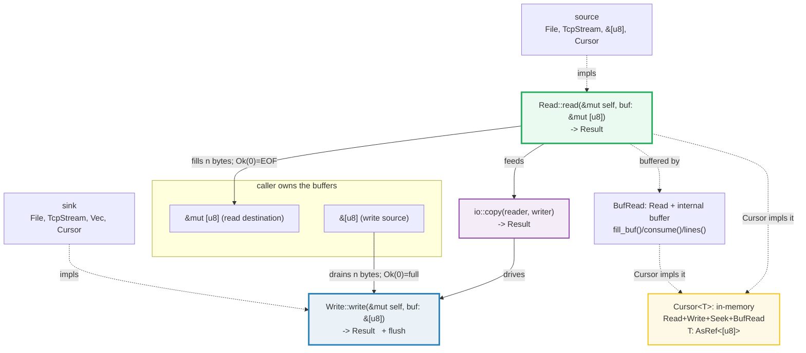

# IO — `Read`, `Write`, `BufRead`, `io::copy`, `Cursor`, and `io::Result`

> **One-line goal:** `std::io` is the **byte-stream abstraction** of the standard
> library — a `Read`er **pulls bytes into a caller-owned buffer**, a `Write`r
> **drains a caller-owned buffer into a sink**, `io::copy` **streams** one into
> the other, `BufRead` **buffers** so line parsing is cheap, `Cursor` is an
> **in-memory** reader/writer over `&[u8]`/`Vec<u8>`, and every fallible call
> returns **`io::Result<T>` = `Result<T, io::Error>`** so `?` can propagate it.
>
> **Run:** `just run io` (== `cargo run --bin io`)
> **Member:** `core` (stdlib-only — no `[dependencies]`).
> **Prerequisites:** [OWNERSHIP](./OWNERSHIP.md), [BORROWING](./BORROWING.md),
> [TRAITS_BASICS](./TRAITS_BASICS.md), [ERROR_HANDLING](./ERROR_HANDLING.md).
> **Ground truth:** [`io.rs`](./io.rs); captured stdout:
> [`io_output.txt`](./io_output.txt).

---

## Why this exists (lineage)

An I/O library has to solve one tension: **the caller owns the buffers, but the
implementation must work for *any* source/sink** — a file, a socket, a pipe, a
gzip decoder, an in-memory `Vec`. Most languages resolve this with either an
object model (Java's `InputStream`/`OutputStream` — every byte boxed, every call
virtual) or an interface with hidden buffering (Go's `io.Reader`/`Writer`, which
 famously trips newcomers because `Read` may return *fewer* bytes than asked).

Rust resolves it with **two single-method traits** and **caller-owned buffers**:

| Concept | Signature (the whole contract) | What it guarantees |
|---|---|---|
| **`Read`** | `fn read(&mut self, buf: &mut [u8]) -> io::Result<usize>` | Fills *your* buffer with `n` bytes, `0 <= n <= buf.len()`. **`Ok(0)` = EOF** (or empty buffer), *not* an error. |
| **`Write`** | `fn write(&mut self, buf: &[u8]) -> io::Result<usize>` and `fn flush(&mut self) -> io::Result<()>` | Accepts *some prefix* of your buffer, returns how many. `Ok(0)` = sink full. |

That is the **entire** I/O surface. Everything else — `read_to_string`,
`read_exact`, `write_all`, `io::copy`, `BufReader::lines` — is a **provided
method** built on top of those two, so an implementor only ever writes `read`
(and `write`/`flush`). This is the same "small core, large surface" philosophy as
[`Iterator`](./ITERATORS.md): one required method, a dozen free adapters.



> **Why `Cursor` is the star of this bundle.** A real `File`/`TcpStream` is
> non-deterministic (filesystem state, network timing) and would make this
> guide's outputs non-reproducible. `Cursor<T>` wraps an in-memory buffer and
> implements `Read` + `BufRead` + `Seek` + (for `Vec<u8>`/`&mut [u8]`) `Write`,
> so **every example here is a pure function of its bytes** — byte-identical on
> every run. The std docs themselves use `Cursor` for exactly this reason
> ([BufRead examples][std-bufread], [Cursor examples][std-cursor]). This is the
> DETERMINISM discipline from `HOW_TO_RESEARCH.md` §4.2 applied to I/O.

---

## Section A — `Read`: pull bytes into a caller-owned buffer; `Ok(0)` is EOF

```rust
use std::io::{Cursor, Read};

let mut reader = Cursor::new(b"hi");
let mut buf = [0u8; 2];
let n = reader.read(&mut buf)?;   // n == 2, buf == b"hi"
let zero = reader.read(&mut buf)?; // zero == 0  (EOF — NOT an error)
```

> **From io.rs Section A:**
> ```
> ======================================================================
> SECTION A — Read: pull bytes into a caller buffer; Ok(0) is EOF
> ======================================================================
>   Cursor::new(b"hi");  position = 0
>   reader.read(&mut [0u8;2]) -> n = 2, buf = [104, 105]
> [check] read fills the 2-byte buffer with b"hi": OK
>   reader.read(&mut buf) again -> n = 0  (0 == end of stream)
> [check] read returns Ok(0) at EOF, not an Err: OK
>   let mut bytes: &[u8] = b"hello";  read 2 -> [104, 101]; bytes left = [108, 108, 111]
> [check] &[u8] Read advances the slice to the unread remainder: OK
> ```

**What.** `read(&mut buf)` copies up to `buf.len()` bytes from the source into
**your** array and returns the count. After the 2-byte `"hi"` is drained, a
second `read` returns `Ok(0)` — that is the **EOF signal**, and it is explicitly
*not* an `Err`. The third check shows `&[u8]` itself implementing `Read`: after
reading 2 bytes, the slice reference `bytes` has **advanced** to `b"llo"`.

**Why (internals).**
- **The buffer is caller-owned, never reader-owned.** `read` takes `&mut [u8]`,
  so the reader can neither allocate for you nor retain a pointer into your
  buffer after the call. This is zero-allocation I/O: you reuse one `[0u8; N]`
  across thousands of reads (a `BufReader` is just a big version of this).
  Contrast Java's `read()` returning `int` per byte, or `read(byte[])` which
  still hands you a byte at a time conceptually.
- **`Ok(0)` ≠ `Err`.** The contract ([std::Read][std-read]) says `Ok(n)` always
  satisfies `0 <= n <= buf.len()`, and `Ok(0)` "can indicate one of two
  scenarios: the reader has reached EOF, or the buffer was 0 bytes." Returning
  `0` at EOF is *normal flow*, so `read_to_end`/`io::copy` know to **stop**.
  This is the single most misunderstood rule in the API — see the pitfalls
  table.
- **Short reads are legal.** `read` "is not an error if the returned value `n`
  is smaller than the buffer size" ([std::Read][std-read]) — a source may hand
  back 1 byte when you asked for 4096. `read_exact` and `write_all` exist to
  loop past this; raw `read` does **not**. If you loop on `read` yourself and
  treat `n < buf.len()` as complete, you'll silently truncate.
- **`&[u8]` is a `Read`.** The std impl "is implemented for `&[u8]` by copying
  from the slice... reading updates the slice to point to the yet unread part.
  The slice will be empty when EOF is reached" ([std::Read impls][std-read]).
  This works because `read(&mut self)` reborrows the `&[u8]` binding as
  `&mut &[u8]` and mutates *the reference itself* — a borrowed cursor. It is why
  any function taking `impl Read` accepts `b"..."` for free (no `Cursor`
  needed).

🔗 [ERROR_HANDLING](./ERROR_HANDLING.md) — `Ok(0)`-vs-`Err` is the same
"absence is not failure" distinction as `Option::None`-vs-`Result::Err`.

---

## Section B — `Write`: drain a buffer into a sink; `Vec<u8>` is a `Writer`

```rust
use std::io::Write;

let mut out: Vec<u8> = Vec::new();
let n = out.write(b"data")?;        // n == 4
out.write_all(b"-more")?;           // loops write() until all 5 bytes are in
out.flush()?;                       // no-op for Vec; vital for BufWriter
```

> **From io.rs Section B:**
> ```
> ======================================================================
> SECTION B — Write: drain a buffer into a caller buffer; Vec<u8> is a Writer
> ======================================================================
>   out.write(b"data") -> wrote 4 byte(s); out = [100, 97, 116, 97]
> [check] write() returns the count of bytes accepted: OK
>   out.write_all(b"-more"); out = [100, 97, 116, 97, 45, 109, 111, 114, 101]
> [check] Vec<u8> Writer appends bytes via write_all: OK
> [check] flush on Vec is a no-op; contents unchanged: OK
> ```

**What.** `write(b"data")` returns `4` (the bytes accepted) and the `Vec` now
holds `[100, 97, 116, 97]` (the ASCII for `data`). `write_all(b"-more")` appends
the next 5 bytes — note `out` **grew** to 9 bytes, because the `Write` impl for
`Vec<u8>` appends ([std::Write impls][std-write]: "Write is implemented for
`Vec<u8>` by appending to the vector. The vector will grow as needed.").
`flush()` is a no-op here.

**Why (internals).**
- **Two required methods, `write` + `flush`.** `Write` is defined by both
  ([std::Write][std-write]); `write` accepts *some prefix* of your buffer and
  `flush` "ensures that all intermediately buffered contents reach their
  destination." For a `Vec` (which writes straight to its own heap) there is
  nothing to flush, so it's `Ok(())` immediately. For a `BufWriter<W>` wrapping
  a `File`, `flush` is what actually performs the syscall — **forgetting it** is
  the classic "my last 4 KB vanished" bug (covered in [drop](./DROP_UNSAFE.md):
  a `BufWriter`'s `Drop` tries to flush, but errors there are swallowed).
- **`write` may short-write; `write_all` won't return until done.** The contract
  says `write` "will attempt to write the entire contents of `buf`, but the
  entire write might not succeed" ([std::Write][std-write]). `write_all` "will
  continuously call `write` until there is no more data to be written"
  ([std::Write][std-write]) — so in practice you almost always want
  `write_all`, and you only call raw `write` when implementing a sink.
- **`Ok(0)` from `write` means the sink is full/closed.** "A return value of
  `Ok(0)` typically means that the underlying object is no longer able to accept
  bytes" ([std::Write][std-write]) — symmetric to `Read`'s EOF. For `&mut [u8]`
  as a `Writer`, once the slice is full it returns `Ok(0)` and `write_all`
  reports `ErrorKind::WriteZero`.

🔗 [VEC_COLLECTIONS](./VEC_COLLECTIONS.md) — `Vec<u8>`'s `Write` impl is just
`extend_from_slice` under the hood, the same append path that collection
growth uses.

---

## Section C — `io::copy`: stream every byte reader→writer, return the total

```rust
use std::io;

let mut reader = Cursor::new(b"hello");
let mut writer: Vec<u8> = Vec::new();
let copied = io::copy(&mut reader, &mut writer)?;   // copied == 5u64
```

> **From io.rs Section C:**
> ```
> ======================================================================
> SECTION C — io::copy: stream reader -> writer; returns total bytes (u64)
> ======================================================================
>   io::copy(Cursor(b"hello"), &mut Vec) -> copied = 5
>   writer == [104, 101, 108, 108, 111]
> [check] io::copy returns the total bytes streamed: OK
> [check] io::copy reproduces the source bytes in the writer: OK
> ```

**What.** `io::copy(&mut reader, &mut writer)` transfers the entire stream and
returns `5` (the count, as `u64`). The `Vec` ends up exactly equal to `b"hello"`.

**Why (internals).**
- **Signature:** `pub fn copy<R, W>(reader: &mut R, writer: &mut W) -> Result<u64>
  where R: Read + ?Sized, W: Write + ?Sized` ([std::io::copy][std-copy]). It
  takes `&mut` borrows of both (so it doesn't consume them), requires only the
  two traits, and returns `u64` because a stream can exceed `usize` on a 32-bit
  target.
- **It is a `read`/`write` loop with `Interrupted` handling.** "This function
  will continuously read data from `reader` and then write it into `writer` in a
  streaming fashion until `reader` returns EOF... All instances of
  `ErrorKind::Interrupted` are handled by this function and the underlying
  operation is retried" ([std::io::copy][std-copy]). The `Interrupted` retry is
  exactly the non-fatal error case from the `Read` contract — `copy` folds it
  away for you, which is why it's preferred over hand-writing the loop.
- **On Linux it can splice kernel-side.** "On Linux this function uses
  `copy_file_range(2)`, `sendfile(2)` or `splice(2)` to move data directly
  between file descriptors if possible" ([std::io::copy][std-copy]) — i.e. the
  same source code is zero-copy on `File`→`File` and a userspace loop on
  `Cursor`→`Vec`. The trait abstraction buys you platform optimization for free.

---

## Section D — `BufRead`: buffered reads; `.lines()` yields `io::Result<String>`

```rust
use std::io::{BufRead, BufReader, Cursor};

let lines: Vec<String> = BufReader::new(Cursor::new(b"a\nb\nc"))
    .lines()
    .collect::<io::Result<Vec<_>>>()?;   // ["a", "b", "c"]
```

> **From io.rs Section D:**
> ```
> ======================================================================
> SECTION D — BufRead: .lines() yields io::Result<String>, strips newlines
> ======================================================================
>   BufReader over b"a\nb\nc" -> lines = ["a", "b", "c"]
> [check] lines() splits the stream into N newline-free strings: OK
> [check] lines() strips the trailing newline byte: OK
> ```

**What.** Wrapping the `Cursor` in a `BufReader` and calling `.lines()` produces
an iterator yielding `io::Result<String>`; collected, it's `["a", "b", "c"]` —
**three** strings, each **without** the `\n`.

**Why (internals).**
- **`BufRead: Read` adds an internal buffer.** It is defined by two required
  methods — `fill_buf(&mut self) -> io::Result<&[u8]>` and
  `consume(&mut self, amt: usize)` ([std::BufRead][std-bufread]) — and everything
  else (`read_line`, `read_until`, `lines`, `split`) is built on them. The point:
  "reading line-by-line is inefficient without using a buffer, so if you want to
  read by line, you'll need `BufRead`" ([std::BufRead][std-bufread]). A raw
  `Read` over a `File` would do **one syscall per byte**; `BufReader` (default 8
  KiB) does one syscall per buffer-full.
- **`.lines()` returns `Iterator<Item = io::Result<String>>`.** Each item is a
  `Result` because a line could fail (invalid UTF-8, or an I/O error). "The
  iterator... will yield instances of `io::Result<String>`. Each string returned
  will *not* have a newline byte (the `0xA` byte) or `CRLF` at the end"
  ([std::BufRead][std-bufread]). That newline-stripping is why `lines[1] == "b"`
  rather than `"b\n"`.
- **`collect::<io::Result<Vec<_>>>()` short-circuits on the first bad line.**
  This is the idiomatic way to "collect all lines or bail": the `FromIterator`
  impl for `Result` stops at the first `Err` and returns it. It's the `?`-style
  propagation lifted into iterator land.
- **`Cursor` implements `BufRead` directly.** `impl<T> BufRead for Cursor<T>
  where T: AsRef<[u8]>` ([std::Cursor][std-cursor]) — so the `BufReader` here is
  slightly redundant (a `Cursor` already *is* buffered, trivially). We wrap it
  anyway to show the **real-world pattern**: you wrap a `File` (which is `Read`
  but *not* `BufRead`) in a `BufReader` to gain `lines()`. 🔗 [FS_PATHS](./FS_PATHS.md).

🔗 [ITERATORS](./ITERATORS.md) — `.lines()` is a lazy `Iterator<Item = Result>`;
`collect::<Result<_, _>>()` is the `FromIterator<Result>` short-circuit.

---

## Section E — `read_to_string` (whole stream) vs `read_exact` (fill a fixed buffer)

```rust
use std::io::Read;
use std::io::Cursor;

let mut s = String::new();
Cursor::new(b"hello").read_to_string(&mut s)?;   // s == "hello"

let mut fixed = [0u8; 4];
Cursor::new(b"WXYZ").read_exact(&mut fixed)?;    // fixed == *b"WXYZ"
```

> **From io.rs Section E:**
> ```
> ======================================================================
> SECTION E — read_to_string (whole stream -> String) / read_exact (fill buf)
> ======================================================================
>   read_to_string -> 5 byte(s); s = "hello"
> [check] read_to_string consumes the whole stream into a String: OK
>   read_exact(&mut [0u8;4]) <- Cursor(b"WXYZ") -> buf = [87, 88, 89, 90]
> [check] read_exact fills the fixed buffer byte-for-byte: OK
> ```

**What.** `read_to_string` drains the entire source into a `String` (and returns
`5`, the byte count). `read_exact` fills the 4-byte `fixed` array completely, or
fails.

**Why (internals).**
- **`read_to_string` validates UTF-8.** "If the data in this stream is *not*
  valid UTF-8 then an error is returned and `buf` is unchanged"
  ([std::Read][std-read]). So this is the bridge from the **byte** world (`Read`)
  to the **text** world (`String`) — it's where I/O meets UTF-8 decoding. 🔗
  [STRINGS_STR](./STRINGS_STR.md). Contrast `read_to_end`, which appends raw
  bytes to a `Vec<u8>` with no decoding.
- **`read_exact` is the "fill completely or fail" read.** "Reads the exact
  number of bytes required to fill `buf`... If this function encounters an 'end
  of file' before completely filling the buffer, it returns an error of the kind
  `ErrorKind::UnexpectedEof`. The contents of `buf` are unspecified in this case"
  ([std::Read][std-read]). That "unspecified contents on failure" is a real trap
  (see pitfalls) — never assume `buf` is untouched after an `Err` from
  `read_exact`. It's the right tool for **fixed-size binary frames** (a 4-byte
  length prefix, a 16-byte UUID) where a short read is a protocol violation.
- **Both are provided methods built on `read`.** Neither requires the source to
  implement anything extra — `read_to_string` loops `read` into a `Vec` then
  validates; `read_exact` loops `read` until the buffer is full. This is the
  "small core" payoff again.

---

## Section F — `io::Result` + `?`: propagate `io::Error`; build one three ways

```rust
use std::io::{self, Read};

fn read_two<R: Read>(reader: &mut R) -> io::Result<[u8; 2]> {
    let mut buf = [0u8; 2];
    reader.read_exact(&mut buf)?;   // ? : on Err, return Err(io::Error) NOW
    Ok(buf)
}
// read_two(Cursor(b"hi"))  -> Ok([b'h', b'i'])
// read_two(Cursor(b""))    -> Err(UnexpectedEof)
```

> **From io.rs Section F:**
> ```
> ======================================================================
> SECTION F — io::Result + ?: propagate io::Error; Error::new / kind() / Display
> ======================================================================
>   read_two(Cursor(b"hi")) -> Ok([104, 105])
> [check] ? propagates the success value on a full read: OK
>   read_two(Cursor(b"")) -> Err: kind = UnexpectedEof, display = "failed to fill whole buffer"
> [check] ? propagates io::Error out of the function on a short read: OK
>   Error::new(InvalidInput, "boom").kind() = InvalidInput   |   Error::from(NotFound) = "entity not found"   |   Error::other("oops").kind() = Other
> [check] Error::new carries the assigned ErrorKind: OK
> [check] Error: From<ErrorKind> maps NotFound to its Display string: OK
> [check] Error::other is Error::new(ErrorKind::Other, msg): OK
> ```

**What.** `read_two` is a thin wrapper around `read_exact` that uses `?`. With a
full `Cursor(b"hi")` it returns `Ok([104, 105])`; with an empty `Cursor` the
`read_exact` returns `UnexpectedEof` and `?` **propagates it** straight out. The
section also constructs three custom errors: `Error::new(InvalidInput, "boom")`
keeps its kind; `Error::from(NotFound)` prints `"entity not found"`; and
`Error::other("oops")` is the `ErrorKind::Other` shortcut.

**Why (internals).**
- **`io::Result<T>` is a type alias, not a new type.** `pub type Result<T> =
  Result<T, Error>` ([std::io::Result][std-ioresult]) — so `?` works on it for
  free (it's `Try`), and it interconverts with `Result<T, io::Error>` with no
  friction. The alias exists only so call sites read `io::Result<String>` rather
  than `Result<String, io::Error>` ([std::io::Result][std-ioresult]: "this type
  alias is generally used to avoid writing out `io::Error` directly").
- **`?` is desugared propagation.** On `Ok(v)`, it unwraps `v`; on `Err(e)`, it
  does `return Err(From::from(e))`. Because the function returns
  `io::Result<_>` and `read_exact` returns `io::Result<()>`, the `From` is the
  identity — `e` (an `io::Error`) flows out unchanged. This is *exactly* the
  mechanism from [ERROR_HANDLING](./ERROR_HANDLING.md), specialized to `io::Error`.
- **Three ways to build a non-OS `io::Error`** ([std::io::Error][std-ioerror]):
  1. `Error::new(kind, payload)` — kind + arbitrary message (heap-allocates a
     `Box<dyn Error + Send + Sync>`). **Note:** clippy's `io_other_error` lint
     reroutes `Error::new(ErrorKind::Other, msg)` to `Error::other(msg)`, so this
     bundle uses `InvalidInput` to keep `Error::new` explicit.
  2. `Error::from(ErrorKind)` — kind only, **no allocation** ("Intended for use
     for errors not exposed to the user, where allocating... is too costly"
     [std::io::Error][std-ioerror]). Each `ErrorKind` has a fixed `Display`
     string; `NotFound` → `"entity not found"` (verified by the output).
  3. `Error::other(msg)` (1.74+) — shortcut for `Error::new(ErrorKind::Other,
     msg)`.
- **`kind()` is how you branch on an I/O failure.** `Error` is opaque (private
  fields), so you recover the category via `err.kind() -> ErrorKind`
  ([std::io::Error][std-ioerror]) and match on it — e.g. retry on `Interrupted`,
  surface `NotFound` as 404. `Error` also implements `Display` and `Debug`, so
  `format!("{err}")` and `{err:?}` both work for logging.

---

## Pitfalls (the expert payoff)

| Trap | Symptom | Fix / why |
|---|---|---|
| **Treating `Ok(0)` as an error** | A read loop spins forever, or you `panic!` on a normal EOF | `Ok(0)` **is** EOF (or an empty buffer) — it is `Ok`, not `Err`. Stop your loop on it. ([std::Read][std-read]) |
| **Truncating on a short `read`** | You get only the first chunk of a stream, no error | `read` may return `n < buf.len()` legally. Either loop it yourself, or use `read_exact`/`read_to_end`/`io::copy` which loop internally. |
| **Trusting `buf` after `read_exact` fails** | Garbage bytes in a "partial" header | "The contents of `buf` are unspecified" on `Err` from `read_exact` ([std::Read][std-read]). Don't read it; treat the whole read as failed. |
| **Forgetting to `flush` a `BufWriter`** | The last few KB of output never lands | `BufWriter` stages bytes; `flush()` (or `Drop`) pushes them. `Drop` swallows flush errors, so **call `flush()?` explicitly** before the writer goes out of scope. 🔗 [DROP_UNSAFE](./DROP_UNSAFE.md) |
| **`Cursor::new(vec![...])` then writing — data "overwritten"** | Writes clobber the start instead of appending | `Cursor`'s position starts at `0` even for a non-empty `Vec`, so "writing to cursor starts with overwriting `Vec` content, not with appending" ([std::Cursor][std-cursor]). Seek to `End(0)` first, or write to the bare `Vec` (whose `Write` impl appends). |
| **`read_to_string` on binary** | `Err(InvalidData)` / "stream did not contain valid UTF-8" | It enforces UTF-8. For raw bytes use `read_to_end` into a `Vec<u8>`. 🔗 [STRINGS_STR](./STRINGS_STR.md) |
| **`lines()` panics on invalid UTF-8** | `.unwrap()` on an `io::Result<String>` blows up mid-file | Each line is a `Result`; a non-UTF-8 line yields `Err`. Use `collect::<io::Result<Vec<_>>>()?` or `read_until(b'\n', &mut Vec<u8>)` for bytes. |
| **`read_to_end` / `read_to_string` blocking forever** | Program hangs on `stdin` or a socket | These read "until EOF", but interactive streams may never EOF. The docs warn: "many sources are continuous streams that do not send EOF" ([std::Read][std-read]). Use `.take(N)` or `.lines()`. |
| **`Error::new(ErrorKind::Other, msg)`** | clippy `io_other_error` fails under `-D warnings` | Use `Error::other(msg)` (1.74+) — it's the documented shortcut. Use a *different* `ErrorKind` if you need `Error::new` explicitly. |
| **Printing `&dyn Read` addresses** | Non-reproducible output | Readers/writers are traits; their concrete address is ASLR-random. Assert structural facts (bytes, lengths, `kind()`), never addresses — see DETERMINISM (`HOW_TO_RESEARCH.md` §4.2). |
| **Confusing `Read` for `Iterator`** | Expecting `.next()` to yield bytes lazily | `Read` is **pull into a buffer** (caller-owned, batched); `Iterator` is yield-one-at-a-time. Bridge with `Read::bytes()` (slow!) or `BufRead::lines()` (the good bridge). 🔗 [ITERATORS](./ITERATORS.md) |

---

## Cheat sheet

```rust
use std::io::{self, BufRead, BufReader, Cursor, Read, Write};

// ── The two contracts (the WHOLE I/O surface) ──────────────────────────────
trait Read  { fn read(&mut self, buf: &mut [u8]) -> io::Result<usize>; /* +provided */ }
trait Write { fn write(&mut self, buf: &[u8]) -> io::Result<usize>;
              fn flush(&mut self) -> io::Result<()>; /* +provided */ }
// read:  Ok(n), 0<=n<=buf.len(); Ok(0) == EOF (NOT Err); short reads ARE legal.
// write: Ok(n) bytes accepted;   Ok(0) == sink full;    write_all loops it.

// ── Cursor: in-memory reader+writer+seeker (deterministic, no files) ───────
let mut r = Cursor::new(b"hi");            // Cursor<&[u8;2]> : Read+BufRead+Seek
let mut buf = [0u8; 2];
let n = r.read(&mut buf)?;                  // n==2, buf==b"hi"
let zero = r.read(&mut buf)?;               // zero==0  (EOF)

let mut w: Vec<u8> = Vec::new();            // Vec<u8> : Write (APPENDS)
w.write_all(b"data")?;                       // w == b"data"
w.flush()?;                                  // no-op for Vec

// ── io::copy: stream reader->writer, return total u64 ──────────────────────
let copied = io::copy(&mut Cursor::new(b"hello"), &mut Vec::new())?; // 5u64

// ── BufRead: buffered; .lines() -> Iterator<Item = io::Result<String>> ─────
let lines: Vec<String> = BufReader::new(Cursor::new(b"a\nb\nc"))
    .lines().collect::<io::Result<Vec<_>>>()?;   // ["a","b","c"] (no \n)

// ── whole-stream vs fixed-size reads ───────────────────────────────────────
let mut s = String::new();
Cursor::new(b"hello").read_to_string(&mut s)?;   // s=="hello" (UTF-8 validated)
let mut fixed = [0u8; 4];
Cursor::new(b"WXYZ").read_exact(&mut fixed)?;     // filled, or UnexpectedEof

// ── io::Result + ?: propagate io::Error ────────────────────────────────────
type R<T> = io::Result<T>;                    // == Result<T, io::Error>
fn two<R: Read>(r: &mut R) -> R<[u8;2]> {     // ? returns Err(io::Error) early
    let mut b = [0u8; 2]; r.read_exact(&mut b)?; Ok(b)
}
let e = io::Error::new(io::ErrorKind::InvalidInput, "boom"); // kind + msg
let k: io::Error = io::ErrorKind::NotFound.into();           // no alloc
let o = io::Error::other("oops");                            // == new(Other,_)
e.kind();                       // -> ErrorKind   (how you branch)
format!("{e}");                  // Display       (how you log)
```

---

## Sources

Every signature and contract above was web-verified against the official Rust
standard library documentation (stable 1.96.0).

- **`std::io::Read` trait** — the single required method
  `fn read(&mut self, buf: &mut [u8]) -> Result<usize>`, the `Ok(0)`/EOF rule,
  short-read legality, provided methods (`read_to_string` UTF-8 enforcement,
  `read_exact` `UnexpectedEof` + "buf unspecified"), and the `&[u8]` impl
  ("reading updates the slice to point to the yet unread part"):
  https://doc.rust-lang.org/std/io/trait.Read.html
- **`std::io::Write` trait** — the two required methods `write` + `flush`, the
  partial-write contract, `write_all` loops `write`, and the `Vec<u8>` impl
  ("by appending to the vector"):
  https://doc.rust-lang.org/std/io/trait.Write.html
- **`std::io::BufRead` trait** — `fill_buf`/`consume` required methods,
  `read_line`/`lines`/`split` provided, "lines yields `io::Result<String>`,
  without the newline byte or CRLF":
  https://doc.rust-lang.org/std/io/trait.BufRead.html
- **`std::io::copy`** — `pub fn copy<R, W>(reader: &mut R, writer: &mut W) ->
  Result<u64>`, "streams until EOF", `ErrorKind::Interrupted` retry, Linux
  `copy_file_range`/`sendfile`/`splice` specialization:
  https://doc.rust-lang.org/std/io/fn.copy.html
- **`std::io::Cursor`** — "wraps an in-memory buffer and provides it with a
  `Seek` implementation", `Read`/`BufRead` for `T: AsRef<[u8]>`, `Write` for
  `Vec<u8>`/`&mut [u8]`, position starts at 0 ("writing overwrites, not
  appends"):
  https://doc.rust-lang.org/std/io/struct.Cursor.html
- **`std::io::Result`** — `pub type Result<T> = Result<T, Error>`; the alias
  rationale:
  https://doc.rust-lang.org/std/io/type.Result.html
- **`std::io::Error`** — `Error::new(kind, payload)`, `Error::other`
  (ErrorKind::Other shortcut, 1.74), `Error: From<ErrorKind>` (no allocation),
  `kind() -> ErrorKind`, `Display` impl, the `NotFound → "entity not found"`
  example:
  https://doc.rust-lang.org/std/io/struct.Error.html
