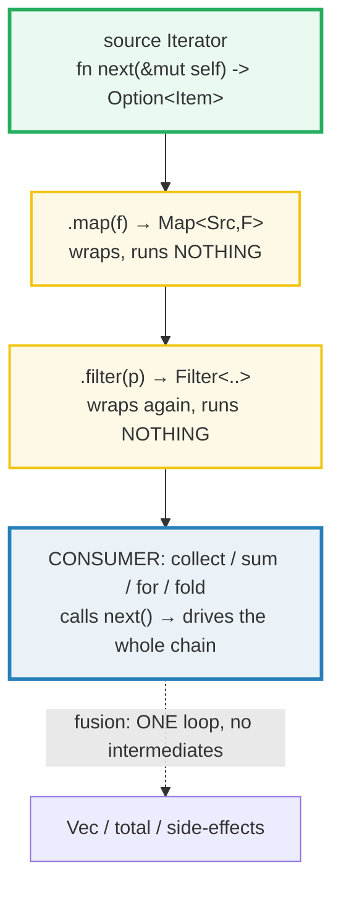

# ITERATORS — Lazy Adapters, Consuming Adapters, and Zero-Cost Fusion

> **One-line goal:** a Rust iterator is a **lazy** sequence driven by ONE required
> method (`fn next(&mut self) -> Option<Self::Item>`); adapter chains like
> `.map(..).filter(..)` do **no work** until a **consuming** op (`collect` /
> `sum` / `for` / `fold`) pulls values through them, and fusion +
> monomorphization compile the whole chain into **one tight loop** — a
> zero-cost abstraction.
>
> **Run:** `just run iterators` (== `cargo run --bin iterators`)
> **Member:** `core` (stdlib-only — no `[dependencies]`).
> **Prerequisites:** 🔗 [CLOSURES](./CLOSURES.md) (adapters take closures),
> 🔗 [TRAITS_BASICS](./TRAITS_BASICS.md) (the `Iterator` trait + associated
> type), 🔗 [OWNERSHIP](./OWNERSHIP.md) (`into_iter`/`iter`/`iter_mut` differ
> only in ownership).
> **Ground truth:** [`iterators.rs`](./iterators.rs); captured stdout:
> [`iterators_output.txt`](./iterators_output.txt).

---

## Why this exists (lineage)

Most languages give you a `for` loop and a `map`/`filter`/`reduce` library and
call it a day. Two things usually go wrong:

| Style | Problem |
|---|---|
| **Eager `map`/`filter`** (Java streams-ish, Python list comps) | Each stage allocates an **intermediate collection** — `O(n)` memory and `O(stages × n)` passes over the data. |
| **Hand-written `for` loop with an accumulator** | Fast, but inexpressive: you re-implement the same plumbing for every transform, and you can't compose stages. |

Rust's iterators reject both tradeoffs. They are **lazy** (like Haskell/Java
streams): `.map(f).filter(p)` merely *describes* a computation — it builds a
nested wrapper type and **runs nothing**. But unlike those languages, the
chain compiles — through **inlining + loop fusion + monomorphization** — to the
*exact same machine code* a hand-written `for` loop would produce, with **no
intermediate allocations** ([Book ch13.4][book-perf]). The Rust Book states it
flatly: *"Iterators are one of Rust's **zero-cost abstractions**, by which we
mean that using the abstraction imposes no additional runtime overhead."*



---

## The `Iterator` trait — one method, everything else derived

The entire trait ([std docs][std-iterator]) has **one** required method:

```rust
pub trait Iterator {
    type Item;                                      // associated type
    fn next(&mut self) -> Option<Self::Item>;       // the ONLY thing you must write

    // ~70 provided methods (map, filter, collect, sum, fold, zip, ...),
    // EVERY one implemented in terms of `next`.
}
```

`next` advances the iterator and returns either `Some(item)` or `None` (when
finished). Because every adapter is built on top of `next`, **implementing
`next` on your own type gives you the whole adapter library for free** (Section
F). The associated type `Item` is what the iterator yields — set once, used in
`next`'s return type.

---

## Section A — The trait and the `next` method

> **From iterators.rs Section A:**
> ```
> ======================================================================
> SECTION A — the Iterator trait: one required method, `next`
> ======================================================================
>   pub trait Iterator {
>       type Item;
>       fn next(&mut self) -> Option<Self::Item>;
>       // ~70 provided methods (map, filter, collect, sum, fold, ...)
>   }
>   // Implement ONLY next(); every adapter is derived from it.
>   let a = [1, 2, 3];  let mut it = a.iter();   // Item = &i32
>   it.next() x5 -> [Some(1), Some(2), Some(3), None, None]
> [check] next() yields Some(&1), Some(&2), Some(&3), then None (fused: stays None): OK
> ```

**What.** `[1,2,3].iter()` returns a `std::slice::Iter` whose `Item` is `&i32`.
Calling `next()` five times yields `Some(&1), Some(&2), Some(&3)`, then `None`,
then `None` again. The iterator must be `mut` because `next(&mut self)` mutates
its internal cursor ([Book ch13.2][book-iter]).

**Why (internals).**
- **`Option` is the protocol.** `None` means "iteration finished" — there is no
  null, no exception, no sentinel. The Book's example is exactly this shape:
  `assert_eq!(Some(1), iter.next()); ... assert_eq!(None, iter.next());`
  ([Book ch13.2][book-iter]).
- **Fused iterators stay done.** The fifth call returns `None` too. The
  stdlib's common iterators (`slice::Iter`, `vec::IntoIter`, `Range`, `Map`,
  `Filter`, ...) all implement the marker trait [`FusedIterator`][std-fused],
  whose contract is "once `next` returns `None`, it will **always** return
  `None`." This lets consumers call `next` defensively without special-casing
  "already exhausted". (The raw `Iterator` trait does *not* guarantee this —
  some exotic iterators may resume; fused ones promise they won't.)
- **`for x in it` is sugar for this.** The loop desugars to repeatedly calling
  `next` (via `IntoIterator` — Section D), so the `seq` array above is literally
  what a `for` loop does, unrolled.

---

## Section B — Lazy adapters: wrap the source, run NOTHING until consumed

```rust
let v1: Vec<i32> = vec![1, 2, 3];
v1.iter().map(|x| x + 1);   // builds a Map<..>; the closure NEVER RUNS
```

> **From iterators.rs Section B:**
> ```
> ======================================================================
> SECTION B — LAZY adapters: wrap the source; NOTHING runs until consumed
> ======================================================================
>   [1..6].iter().inspect(..).map(|x| x*2).filter(|x| x>4)  // built, NOT consumed
>   inspect-calls so far = 0  (the chain did ZERO work)
> [check] lazy: an unconsumed chain runs no closures (inspect saw 0 items): OK
>   (1..=10).skip(7).take(2).collect() = [8, 9]  (skip+take are lazy adapters)
> [check] skip(7).take(2) on 1..=10 -> [8,9]: OK
>   chain.collect::<Vec<_>>() = [6, 8, 10, 12]  (now it ran)
> [check] after collect: map(x*2).filter(>4) produced [6,8,10,12]: OK
> [check] fusion (semantic): inspect saw all 6 source items in a SINGLE pass: OK
> ```

**What.** A chain `.inspect(..).map(|x| x*2).filter(..)` is built but **not
consumed**. The `inspect` closure (which bumps a `Cell<u32>` counter) records
**0 calls** — proof the chain did nothing. Only after `.collect()` drives it
does `inspect` run, and it sees all **6** source items in **one pass**, yielding
`[6, 8, 10, 12]` (`[1..6] → *2 → [2,4,6,8,10,12] → >4 → [6,8,10,12]`).

**Why (internals).**
- **Each adapter returns a *new* iterator struct that wraps the previous one.**
  `.map(f)` returns `Map<I, F>`; `.filter(p)` returns `Filter<I, P>`; `.take(n)`
  returns `Take<I>`; `.skip(n)` returns `Skip<I>`. The Book calls these
  *iterator adapters*: they "produce different iterators by changing some aspect
  of the original iterator" ([Book ch13.2][book-iter]). The chain is a **nested
  type**, not a sequence of calls.
- **The closures are stored, not called.** `Map<I, F>` holds `F` by value; it is
  only invoked when `Map::next` is called, which only happens when something
  drives the chain. That is why the `inspect` counter reads `0` before
  `collect`.
- **The compiler warns if you forget to consume.** The exact warning from the
  Book (this *cannot* live in a runnable `.rs` — it would be a build warning):

  ```console
  warning: unused `Map` that must be used
   --> src/main.rs:4:5
    |
  4 |     v1.iter().map(|x| x + 1);
    |     ^^^^^^^^^^^^^^^^^^^^^^^^
    |
    = note: iterators are lazy and do nothing unless consumed
    = note: `#[warn(unused_must_use)]` on by default
  help: use `let _ = ...` to ignore the resulting value
    |
  4 |     let _ = v1.iter().map(|x| x + 1);
    |             +++++++
  ```

  `unused_must_use` fires because `Iterator` is annotated `#[must_use]` — the
  compiler refuses to silently drop a computation you described but never ran.

- **`skip` / `take` / `enumerate` / `zip` are the same shape** — lazy wrappers.
  `skip(7).take(2)` on `1..=10` yields `[8, 9]`: `skip` drops 1–7, `take` keeps
  the next 2 and then returns `None`.

> **The "fusion" payoff (semantic proof here, asm proof in the docs).** The last
> check shows `inspect` saw **all 6 items in a single pass** — the `map` and
> `filter` did not first build `[2,4,6,8,10,12]` and then scan it. There were no
> intermediate `Vec`s. The compiler fuses the whole chain into one loop (see
> "Why: zero-cost" below for the LLVM story).

---

## Section C — Consuming adapters: `collect` / `sum` / `fold` / `any` / `all`

> **From iterators.rs Section C:**
> ```
> ======================================================================
> SECTION C — CONSUMING adapters: sum/product/count/fold/any/all drive the chain
> ======================================================================
>   (1..=5).sum::<i32>() = 15
> [check] sum consumes the range: 1+2+3+4+5 = 15: OK
>   (1..=4).product::<i32>() = 24
> [check] product consumes: 1*2*3*4 = 24: OK
>   [10,20,30].iter().count() = 3
> [check] count consumes: 3 elements: OK
>   (1..=5).fold((0, MIN), |(s,m),x| (s+x, m.max(x))) -> sum=15, max=5
> [check] fold threads a tuple seed: one pass yields sum=15 AND max=5: OK
>   [1,3,5,6].any(|x| x%2==0) = true  (short-circuits at 6)
>   [1,2,3].all(|x| x>0)     = true
> [check] any drives until first true (found 6 -> true): OK
> [check] all drives until first false (none here -> true): OK
>   [1,2,3].iter().map(|x| x*2).collect::<Vec<_>>() = [2, 4, 6]
> [check] collect into Vec: [2,4,6]: OK
> ```

**What.** Consuming adapters take the iterator **by value** (consuming it) and
drive `next()` to completion — or until they short-circuit. After the call the
iterator is gone (using it again is a move error).

| Adapter | Returns | Drives until |
|---|---|---|
| `collect::<B>()` | `B` (any `FromIterator`: `Vec`, `HashMap`, `String`, `HashSet`…) | exhaustion |
| `sum::<S>()` / `product::<P>()` | the running total / product | exhaustion |
| `count()` | `usize` (number of items) | exhaustion |
| `fold(init, f)` | the final accumulator | exhaustion |
| `any(p)` / `all(p)` | `bool` | **short-circuits** at first `true` / `false` |
| `for_each(f)` / `try_fold` / `find` / `position` / `max` / `min` | various | various (many short-circuit) |

**Why (internals).**
- **`sum` is the Book's canonical consuming adapter.** "Methods that call `next`
  are called *consuming adapters* ... `sum` takes ownership of the iterator and
  iterates through the items by repeatedly calling `next`, thus consuming the
  iterator." — [Book ch13.2][book-iter]. That is why `(1..=5).sum()` returns
  `15` and you may not reuse the range afterwards.
- **`fold` is the universal consumer.** `sum` *is* `fold(0, |a, x| a + x)`;
  `product` *is* `fold(1, |a, x| a * x)`. The tuple-seed example
  (`fold((0, MIN), |(s, m), x| (s + x, m.max(x)))`) computes **two aggregates
  (sum + max) in a single pass** — something no single built-in adapter can do,
  which is why clippy's `unnecessary_fold` does not flag it.
- **`any`/`all` short-circuit.** `[1,3,5,6].any(|x| x%2==0)` stops at `6` (the
  first even) and never inspects later elements — crucial when the predicate is
  expensive or the iterator has side effects.
- **`collect` is generic over its *target*.** `collect::<Vec<_>>()` collects to
  a `Vec`; the same iterator `.collect::<HashMap<K,V>>()` builds a map;
  `.collect::<String>()` joins chars. This works via the `FromIterator` trait:
  `collect<B>(self) where B: FromIterator<Self::Item>`.

---

## Section D — The three forms: `into_iter` (`T`), `iter` (`&T`), `iter_mut` (`&mut T`)

> **From iterators.rs Section D:**
> ```
> ======================================================================
> SECTION D — into_iter (T) vs iter (&T) vs iter_mut (&mut T)
> ======================================================================
>   vec![1,2,3].into_iter().collect::<Vec<i32>>() = [1, 2, 3]
> [check] into_iter yields OWNED T (the Vec is consumed): OK
>   vec![1,2,3].iter().collect::<Vec<&i32>>() = [1, 2, 3]
>   (nums still owned by caller: [1, 2, 3])
> [check] iter yields &T; caller retains ownership (nums still usable): OK
>   for n in v.iter_mut() { *n *= 2; } -> [2, 4, 6]
> [check] iter_mut yields &mut T; doubles each element to [2,4,6]: OK
>   for x in [1,2,3] { total += x; } -> 6  (desugars to .into_iter())
> [check] `for x in v` desugars to IntoIterator::into_iter (total = 6): OK
> ```

**What.** Three iteration modes differ only in **ownership** of the items. The
Book ([ch13.2][book-iter]): *"The `iter` method produces an iterator over
immutable references. If we want to create an iterator that takes ownership of
`v1` and returns owned values, we can call `into_iter` instead of `iter`.
Similarly, if we want to iterate over mutable references, we can call
`iter_mut` instead of `iter`."*

| Form | Yields | Borrows the source? | Source usable after? |
|---|---|---|---|
| `v.into_iter()` | `T` (owned) | **moves** (consumes `v`) | **no** (E0382 to touch `v`) |
| `v.iter()` | `&T` | shared `&v` | yes (read-only) |
| `v.iter_mut()` | `&mut T` | mutable `&mut v` | yes (after the borrow ends) |

**Why (internals).**
- **`for x in v` calls `IntoIterator::into_iter(v)`.** The `for` loop is defined
  by the [`IntoIterator`][std-intoiter] trait: *"By implementing `IntoIterator`
  for a type, you define how it will be converted to an iterator ... your type
  will work with Rust's `for` loop syntax."* For an **owned** `Vec<T>`/`[T; N]`,
  `into_iter` yields `T` (consuming the collection); for `&v` it yields `&T`;
  for `&mut v` it yields `&mut T`. That is why `for x in [1,2,3]` hands you
  owned `i32`s.
- **`IntoIterator` is reflexive.** There is a blanket impl
  `impl<I: Iterator> IntoIterator for I` that just returns `self` — so any
  `Iterator` *is* an `IntoIterator`. This is why `for x in some_iterator` works
  directly.
- **`iter_mut` lets you mutate in place.** The check doubles `[1,2,3]` to
  `[2,4,6]` by dereferencing each `&mut i32`. The `&mut v` borrow lasts for the
  loop, so you cannot alias `v` during it (🔗 [BORROWING](./BORROWING.md)).

---

## Section E — `zip` pairs two iterators; `enumerate` tags each with its index

> **From iterators.rs Section E:**
> ```
> ======================================================================
> SECTION E — zip pairs two iters; enumerate tags each item with its index
> ======================================================================
>   [1,2,3].into_iter().zip(["a","b"]).collect() = [(1, "a"), (2, "b")]
> [check] zip stops at the SHORTER iterator (length 2): [(1,"a"),(2,"b")]: OK
>   (100..=102).enumerate().collect::<Vec<_>>() = [(0, 100), (1, 101), (2, 102)]
> [check] enumerate yields (index, item) pairs from 0: [(0,100),(1,101),(2,102)]: OK
>   (10..).zip([5,6,7]).enumerate().map(|(i,(a,b))| (i,a*b)).collect() = [(0, 50), (1, 66), (2, 84)]
> [check] zip+enumerate+map fused: [(0,50),(1,66),(2,84)]: OK
> ```

**What.** `zip` pairs items from two iterators into `(a, b)` tuples and
**stops when either returns `None`** (`[1,2,3].zip(["a","b"])` stops at length
2). `enumerate` prepends a `usize` index to each item, starting at 0. Both are
lazy wrappers, so they compose for free — the third example zips an **infinite**
range `(10..)` against a finite array, enumerates the pairs, maps them, and
collects three results.

**Why (internals).**
- **`zip`'s argument is `IntoIterator`**, so you can pass a `Vec`, an array, or
  another iterator directly. `Zip<A, B>::next` calls `A::next` then `B::next`
  and returns `None` if either is `None` ([std docs][std-iterator]).
- **Zipping with `(0..)` ≈ `enumerate`.** The std docs note this equivalence:
  `(0..).zip("foo".chars())` produces the same `(index, char)` pairs as
  `"foo".chars().enumerate()`. `enumerate` is just the common case.
- **An infinite iterator is safe as long as a *consumer* is finite.** `(10..)` is
  infinite, but `zip([5,6,7])` ends after 3 items, and `collect` stops there.
  This is laziness paying off — nothing pre-materializes the infinite range.

---

## Section F — A custom iterator: impl `Iterator` once, get every adapter free

> **From iterators.rs Section F:**
> ```
> ======================================================================
> SECTION F — custom iterator: impl Iterator once, get ALL adapters free
> ======================================================================
>   Counter::new(3): next() x4 -> [Some(0), Some(1), Some(2), None]
> [check] custom Counter yields Some(0),Some(1),Some(2),None: OK
>   Counter::new(3).map(|x| x+10).collect::<Vec<_>>() = [10, 11, 12]
> [check] custom iterator gets map+collect free: [10,11,12]: OK
>   Counter::new(6).filter(|x| x%2==0).sum() = 6  (0+2+4)
> [check] custom iterator gets filter+sum free: 0+2+4 = 6: OK
>   Counter::new(2).zip(Counter::new(3)).collect() = [(0, 0), (1, 1)]
> [check] zip of two custom iters stops at the shorter (2): [(0,0),(1,1)]: OK
> ```

```rust
struct Counter { current: u32, limit: u32 }

impl Iterator for Counter {
    type Item = u32;
    fn next(&mut self) -> Option<Self::Item> {
        if self.current < self.limit {
            let v = self.current;
            self.current += 1;
            Some(v)
        } else {
            None
        }
    }
}
```

**What.** `Counter::new(3)` yields `0, 1, 2`, then `None`. Because we wrote the
*one* required method, `Counter` instantly gains `map`, `filter`, `sum`,
`zip`, `enumerate`, `fold`, `collect`, ... — all used above without writing a
line of adapter code.

**Why (internals).**
- **Adapters are *default methods* on the trait.** `Iterator::map`, `filter`,
  `collect`, etc. are *provided* methods with default implementations expressed
  in terms of `next`. Implementing `next` satisfies the trait, so every default
  method is available. There is nothing special about `Counter` — it just
  fulfills the one-method contract.
- **Static dispatch, no vtable.** `Counter::new(3).map(|x| x+10)` has the
  concrete type `Map<Counter, impl FnMut(u32)->u32>`. Each adapter is
  monomorphized into a distinct static type, so calling `.next()` on the chain
  is a series of **direct, inlinable** calls — no dynamic dispatch, no trait
  object. (🔗 [TRAIT_OBJECTS](./TRAIT_OBJECTS.md) for when you *do* want
  `dyn Iterator`.)
- **This is the doorway to library design.** Implementing `Iterator` (and
  optionally `ExactSizeIterator` / `DoubleEndedIterator` / `FusedIterator` for
  extra capabilities) is how `Vec`, `HashMap`, `Range`, channels, `Option`, and
  your own collections all become `for`-loopable and adapter-composable.

---

## Why: zero-cost — fusion, inlining, monomorphization

The headline claim — *an iterator chain compiles to the same code as a hand
loop* — is a **release-mode** property. It is **not** observable from debug
stdout (this file runs in debug), so it is documented here rather than asserted
in `iterators.rs`. The evidence:

1. **The Book's benchmark** ([ch13.4][book-perf]). A `search` function written
   with an explicit `for` loop and one written with iterators were benchmarked
   over the full text of *The Adventures of Sherlock Holmes*:

   ```text
   test bench_search_for  ... bench:  19,620,300 ns/iter
   test bench_search_iter ... bench:  19,234,900 ns/iter
   ```

   *"The two implementations have similar performance!"* — the iterator version
   was marginally **faster**. The Book concludes: *"Iterators ... get compiled
   down to roughly the same code as if you'd written the lower-level code
   yourself. ... Optimizations such as loop unrolling and eliminating bounds
   checking on array access apply and make the resultant code extremely
   efficient."*

2. **The mechanism** (independent corroboration, [mayorana.ch][fusion-blog]):
   - **Inlining.** Each adapter is a struct with a `next()` method; LLVM inlines
     the whole nested chain, eliminating every call frame.
   - **Loop fusion.** After inlining, the compiler sees one stream of `next()`
     calls and fuses `.map(..).filter(..).collect(..)` into **a single loop**
     with no intermediate allocations — exactly the `inspect saw 6 items in one
     pass` result Section B proves at the semantic level.
   - **`size_hint` → preallocation.** Iterators report their length bounds;
     `collect::<Vec<_>>()` uses this to `Vec::with_capacity` once, avoiding
     reallocation growth.
   - **Monomorphization.** Each concrete `Map<Filter<Slice,..>, ..>` is its own
     static type, so the fused loop is fully specialized and bounds checks are
     provably eliminable.

3. **Bjarne Stroustrup's "zero-overhead" definition** (quoted by the Book):
   > *"What you don't use, you don't pay for. And further: what you do use, you
   > couldn't hand code any better."*

> **To see it yourself:** run `cargo rustc --release --bin iterators -- --emit
> asm` (or paste the chain into <https://godbolt.org> with `-O`) and look for a
> single tight loop with no function calls and no intermediate buffer allocs.

---

## Pitfalls (the expert payoff)

| Trap | Symptom | Fix / why |
|---|---|---|
| **Building a chain and forgetting to consume** | `warning: unused \`Map\` that must be used` / nothing happens | Adapters are lazy — they return a *value* describing work. Add a consumer (`collect`, `for_each`, `sum`, ...) or `let _ =` to silence intentionally. |
| **Reusing an iterator after a consuming adapter** | `error[E0382]: use of moved value` | `sum`/`count`/`collect`/`for_each` take `self` **by value** — they consume it. Re-build the chain, or `.by_ref()` to borrow. |
| **`for x in &v` vs `for x in v`** | Surprise move / wrong item type | `for x in v` uses `IntoIterator::into_iter` — for an owned `Vec<T>` that **moves** it and yields `T`. Use `for x in &v` (`&T`) or `&mut v` (`&mut T`) to borrow. |
| **`.collect()` type ambiguity** | `error[E0282]: type annotations needed` | `collect` is generic over its target. Write `collect::<Vec<_>>()` (turbofish) or annotate the binding `let v: Vec<_> = ...`. |
| **`.map(..)` that returns `()` when you wanted side-effects** | "my map did nothing" | `map` is for transforming values; if you want side-effects, use `for_each` (or `inspect` mid-chain). A `map` returning `()` builds a `Map<.., _>` you then must consume. |
| **Confusing `iter()` (`&T`) with `into_iter()` (`T`)** | `&&T` / can't move out / `&i32` where `i32` needed | For `Vec<T>`: `iter`→`&T`, `iter_mut`→`&mut T`, `into_iter`→`T`. Add `.copied()` (`&T: Copy`→`T`) or `.cloned()` (`&T: Clone`→`T`) to deref. |
| **Mutable borrow held by `iter_mut` blocks the owner** | `error[E0502]` / can't read `v` while iterating `&mut v` | The `&mut v` borrow lasts for the loop's scope. Collect results into a separate `Vec` first, or restructure so the aliasing doesn't overlap. |
| **Custom iterator that never returns `None`** | infinite loop / hang in `collect`/`sum` | `next` MUST eventually return `None` for finite consumers. `take(n)` bounds an infinite iterator explicitly. |
| **Expecting `HashMap`/`HashSet` iteration order** | non-deterministic `_output.txt` | Map/set iteration order is randomized (SipHash seed). When capturing output, collect + sort keys, or use `BTreeMap` (🔗 [VEC_COLLECTIONS](./VEC_COLLECTIONS.md) determinism rule). |
| **`fold` that could be a built-in** | clippy `unnecessary_fold` | `fold(0,\|a,x\| a+x)` → `sum()`; `fold(1,\|a,x\| a*x)` → `product()`. Use `fold` only when no built-in fits (multi-aggregate, custom accumulator). |
| **Calling `next` in `loop { match }` / `while let` on an iterator** | clippy `while_let_on_iterator` / `while_let_loop` | Clippy wants a `for` loop. Drive iterators with `for`; reserve manual `next` for teaching/peeking (or justify `#[allow]`). |

---

## Cheat sheet

```rust
// The trait — ONE required method; ~70 adapters derive from it:
//   pub trait Iterator {
//       type Item;
//       fn next(&mut self) -> Option<Self::Item>;
//   }

// LAZY adapters (return a NEW iterator; run NOTHING until consumed):
//   .map(f)  .filter(p)  .take(n)  .skip(n)  .enumerate()  .zip(other)
//   .chain(other)  .flat_map(f)  .flatten()  .step_by(n)  .rev()  .peekable()
let _ = [1,2,3].iter().map(|x| x*2);   // <-- BUILT, the closure never ran

// CONSUMING adapters (take self BY VALUE; drive next() to end/short-circuit):
//   .collect::<B>()  .sum()  .product()  .count()  .fold(init, f)
//   .any(p)  .all(p)  .find(p)  .position(p)  .max()  .min()  .for_each(f)
let v: Vec<i32> = [1,2,3].iter().map(|&x| x*2).collect();   // [2,4,6]
let s: i32      = (1..=5).sum();                            // 15

// THREE forms — only ownership differs:
//   v.into_iter() -> T       (consumes v; v unusable after)
//   v.iter()      -> &T      (borrows; caller keeps v)
//   v.iter_mut()  -> &mut T  (borrows mutably; mutate in place)
for n in v.iter_mut() { *n *= 2; }                          // [4,8,12]
//   `for x in v` desugars to IntoIterator::into_iter(v).

// CUSTOM iterator — impl next() once, get every adapter free (static dispatch):
struct Counter { cur: u32, lim: u32 }
impl Iterator for Counter {
    type Item = u32;
    fn next(&mut self) -> Option<u32> {
        (self.cur < self.lim).then(|| { let v = self.cur; self.cur += 1; v })
    }
}
let mapped: Vec<u32> = Counter{cur:0,lim:3}.map(|x| x+10).collect(); // [10,11,12]

// ZERO-COST: a .map(..).filter(..).collect() chain fuses (inlining + loop
// fusion + monomorphization) into ONE loop with no intermediate Vecs — same
// asm as a hand-written for loop (Book ch13.4; verify: --release --emit asm).
```

---

## Sources

Every claim above was web-verified in at least two authoritative places.

- **The Rust Programming Language, ch13.2 "Processing a Series of Items with
  Iterators"** — the `Iterator` trait definition (`type Item; fn next(&mut self)
  -> Option<Self::Item>`), laziness ("iterators are lazy ... they have no effect
  until you call methods that consume the iterator"), the `next()` example,
  *consuming adapters* (`sum`), *iterator adapters* (`map`/`filter`), the three
  forms (`iter`/`into_iter`/`iter_mut`), and the `unused_must_use` warning
  ("iterators are lazy and do nothing unless consumed"):
  https://doc.rust-lang.org/book/ch13-02-iterators.html
- **The Rust Programming Language, ch13.4 "Performance in Loops vs. Iterators"**
  — the `search` benchmark (for-loop vs iterator ≈ identical speed), the
  zero-cost-abstraction definition, the Stroustrup quote, loop unrolling /
  bounds-check elimination:
  https://doc.rust-lang.org/book/ch13-04-performance.html
- **`std::iter::Iterator` docs** — the full trait signature, the required
  `next` method ("Advances the iterator and returns the next value. Returns
  `None` when iteration is finished"), the complete adapter list (`map`,
  `filter`, `take`, `skip`, `enumerate`, `zip`, `collect`, `sum`, `product`,
  `count`, `fold`, `any`, `all`, `for_each`, ...):
  https://doc.rust-lang.org/std/iter/trait.Iterator.html
- **`std::iter::IntoIterator` docs** — `for` loops use `IntoIterator`
  ("By implementing `IntoIterator` for a type ... your type will work with
  Rust's `for` loop syntax"), the blanket `impl<I: Iterator> IntoIterator for I`
  (reflexivity), and the `IntoIterator`/`Item`/`into_iter` signature:
  https://doc.rust-lang.org/std/iter/trait.IntoIterator.html
- **`std::iter::FusedIterator` docs** — the contract "once `next` returns
  `None`, it will always return `None`, forever", which is why slice/range/map/
  filter iterators stay exhausted (Section A's fused check):
  https://doc.rust-lang.org/std/iter/trait.FusedIterator.html
- **mayorana.ch — "Zero-Cost Abstractions: How Rust Optimizes Iterator Chains"**
  — independent corroboration of the fusion mechanism: *inlining* of each
  adapter's `next()`, *loop fusion* into a single loop with no intermediate
  allocations, `size_hint`-driven preallocation, monomorphization, and the
  resulting tight-loop assembly:
  https://mayorana.ch/en/blog/zero-cost-abstractions-rust
