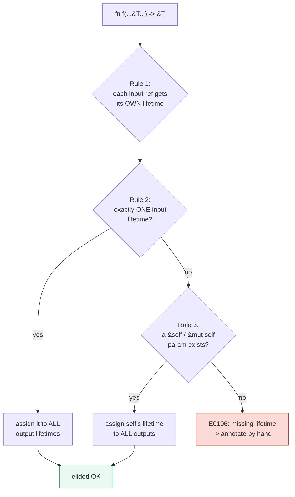
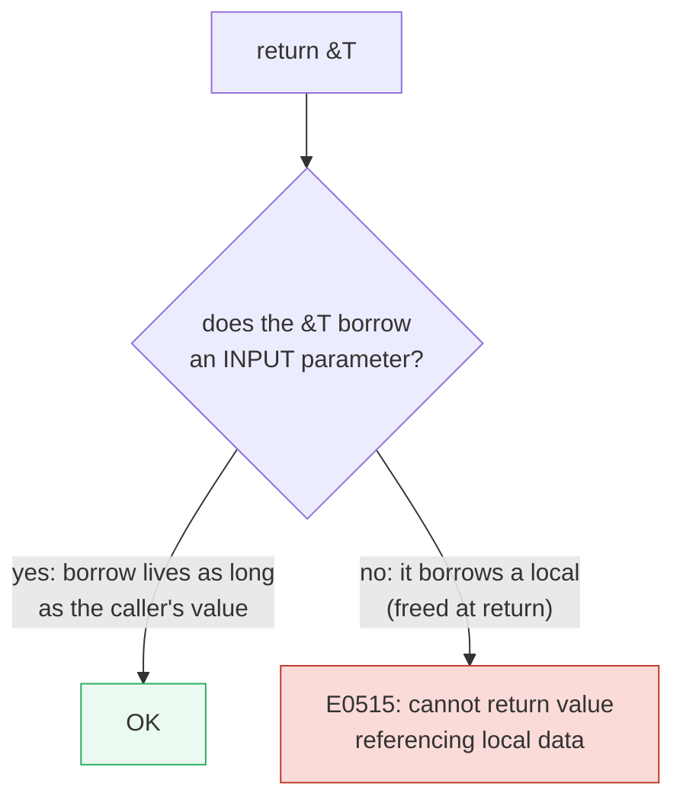
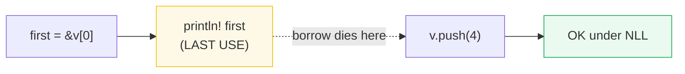

# LIFETIMES — Validating References with Lifetimes

> **Goal (one line):** every reference carries a *lifetime* — the code region it
> is valid for — and the borrow checker uses lifetimes (plus three elision
> rules) to prove references never outlive the data they point at.
>
> **Run:** `just run lifetimes`  (= `cargo run --bin lifetimes`)
>
> **Member:** `core` (stdlib-only — no `[dependencies]`).
>
> **Prerequisites:** 🔗 [OWNERSHIP](./OWNERSHIP.md) — owned data has *no*
> lifetime (it is dropped at scope end, not borrowed). 🔗 [BORROWING](./BORROWING.md)
> — `&`/`&mut` are *permissions*; lifetimes are the **time axis** the borrow
> checker rides on to enforce those permissions.

---

## Lineage — why this exists

Ownership gave values **one owner**; borrowing split that owner's right to use a
value into **shared** (`&`) and **exclusive** (`&mut`) permissions. But a
permission is useless without a **deadline**: *how long* may this reference be
used? That question is the lifetime. The borrow checker's central job is to
compare lifetimes — does the **referent live at least as long as the
reference?** — and reject any program where the answer is no (a *dangling
reference*). This bundle is the bridge from "I can borrow" to "the compiler
**proves** my borrows are sound."


---

## 1. What is a lifetime?

A **lifetime** is a compile-time label for *the region of code in which a
reference is valid (may be used)*. Every reference — `&i32`, `&str`,
`&'a mut Vec<T>` — has one. Most are **inferred**; you only write them down when
the compiler cannot unambiguously relate a returned reference to its source.

```mermaid
graph TD
    subgraph "a lifetime = a code region"
        A["let r;"]:::decl -.->|'a starts (r declared)| B
        B["let x = 5;"] -.->|'b starts| C["r = &x;"]
        C --> D["println!(&#123;r&#125;;"] -.->|last use of r| E
        E["} x drops"]:::drop -.->|'b ends BEFORE 'a -> ERROR| F
    end
    classDef decl fill:#eaf2f8,stroke:#2980b9;
    classDef drop fill:#fadbd8,stroke:#c0392b;
```

The borrow checker compares the **scope of the value** (`'b`, when `x` is freed)
against the **lifetime of the reference** (`'a`, where `r` is used). If `'a`
would extend past `'b`, the program is rejected — you would be reading freed
memory.

---

## 2. Lifetime elision — the three rules

Annotating every reference is noisy. Rust applies **three deterministic rules**
so you rarely write lifetimes by hand. They run in order; if ambiguity remains
after rule 3, you **must** annotate (or you get `E0106`).



1. **Each input reference** gets its own lifetime parameter:
   `fn f(x: &i32, y: &i32)` → `fn f<'a, 'b>(x: &'a i32, y: &'b i32)`.
2. **If exactly one input lifetime**, it is assigned to every output:
   `fn f(x: &i32) -> &i32` → `fn f<'a>(x: &'a i32) -> &'a i32`.
3. **If multiple inputs but one is `&self`/`&mut self`** (a method), `self`'s
   lifetime is assigned to all outputs.

> **From lifetimes.rs Section A — elision in action:**
>
> ```text
> Written signature (no annotations):  fn first(slice: &[i32]) -> &i32
> Desugared by elision rules 1 + 2:     fn first<'a>(slice: &'a [i32]) -> &'a i32
> first(&[1, 2, 3]) -> 1  (returns a reference to the 1st element)
> [check] first(&[1,2,3]) dereferences to 1: OK
> ```
>
> One input reference → rule 1 names it `'a` → rule 2 copies `'a` to the single
> output. No annotation needed, and the returned reference provably comes from
> the (only) input.

---

## 3. Explicit annotation — `longest<'a>`

When a function takes **two** input references and returns one, no elision rule
can decide *which* input the output borrows from. You must state the
relationship with a named lifetime:

```rust
fn longest<'a>(x: &'a str, y: &'a str) -> &'a str {
    if x.len() > y.len() { x } else { y }
}
```

`'a` ties all three references together: the returned slice is valid for **the
shorter** of `x` and `y`'s lifetimes. The compiler then rejects any call where
the result outlives one of the inputs.

> **From lifetimes.rs Section B — explicit annotation:**
>
> ```text
> fn longest<'a>(x: &'a str, y: &'a str) -> &'a str
> longest("abc", "wxyz") -> "wxyz"
> [check] longest("abc", "wxyz") returns "wxyz": OK
> longest("ab", "cd")   -> "cd"  (equal length -> returns y)
> [check] equal-length tie returns the second argument (y): OK
> ```
>
> **Tie behavior is real:** with `if x.len() > y.len() { x } else { y }`, equal
> lengths fall to the `else` arm, so `longest("ab", "cd")` returns `"cd"`
> (the second argument). Document such ties — they are a silent source of
> off-by-one expectations.

### Why the lifetime must come from an input

A function may only return a reference whose lifetime was **handed to it** by a
caller. The output lifetime is a *constraint the caller must satisfy*, so it
must be a parameter the caller controls. Any reference created *inside* the
function would be freed on return — returning it would dangle.



---

## 4. The `'static` lifetime

`'static` is the lifetime that **lasts the entire program**. All string literals
(`"hi"`) are `&'static str` — their bytes are baked into the compiled binary,
which is never freed, so the reference is valid forever.

> **From lifetimes.rs Section C — 'static:**
>
> ```text
> let literal: &'static str = "literal";   (annotation accepted => it is 'static)
> std::any::type_name::<&str>() = "&str"
> string literals are baked into the binary, so they live for the whole program
> [check] string literal value == "literal": OK
> [check] std::any::type_name::<&str>() == "&str" (lifetimes are omitted in the name): OK
> ```
>
> The annotation `let literal: &'static str = "literal";` **compiling** is the
> proof: the compiler accepted a `'static` requirement, so the literal must be
> `'static`. `takes_static("literal")` (which demands `&'static str`) likewise
> compiles. Note `std::any::type_name` prints `"&str"` — it **omits lifetime
> specifiers**; the `'static` is a property of the type, invisible in the name.

> **Expert caveat:** when the compiler *suggests* `'static` in an error, that is
> usually a **symptom** of a dangling reference or a mismatched lifetime — not a
> fix. Reaching for `'static` to silence the error often hides the real bug
> (or forces data to live forever). Fix the lifetime relationship instead.

---

## 5. Structs holding references

A struct that stores a reference must declare a lifetime parameter so the
compiler knows the struct **cannot outlive** the borrowed data:

```rust
struct Excerpt<'a> {
    part: &'a str,
}
```

There is **no elision for struct fields** — every `&` in a struct demands an
explicit `'a` on the type. An `Excerpt<'a>` may not be moved anywhere that
outlives the `'a` of its `part`.

> **From lifetimes.rs Section D — struct holding a ref:**
>
> ```text
> struct Excerpt<'a> { part: &'a str }
> Excerpt { part: "hi" }.part -> "hi"
> [check] Excerpt holding "hi" reads "hi": OK
> ```

---

## 6. Non-lexical lifetimes (NLL)

Before Rust 2018, a borrow lived until the **end of its lexical scope** (the
closing `}`). That made innocent code like "read `v[0]`, print it, then push to
`v`" fail — the shared borrow was deemed alive until the block ended, clashing
with `push`'s `&mut v`. **NLL** (RFC 2094) changed the rule: **a borrow ends at
its LAST USE**, not the scope boundary.

> **From lifetimes.rs Section E — NLL:**
>
> ```text
> NLL: a borrow ends at its LAST USE, not the end of the lexical scope.
> borrowed &v[0] = 1          <- last use of the borrow
> v.push(4) after the borrow compiles & runs -> v.len() = 4
> [check] NLL lets the &mut push run after the shared borrow's last use: OK
> ```
>
> `first = &v[0]` is last used by the `println!`. By the time `v.push(4)`
> needs `&mut v`, the shared borrow is dead, so the mutation is legal. Under the
> old lexical checker this was a hard error.



---

## 7. Returning a reference to a local — a compile error (NOT shipped runnable)

You **cannot** return a reference to data created inside the function — it would
be dropped the instant the function returns, dangling the reference. No lifetime
annotation can rescue this; the only fix is to **return owned data**. This is a
compile error, so it lives here (documentation), not in the runnable `.rs`.

```rust
// ❌ does NOT compile — E0515
fn longest<'a>(x: &str, y: &str) -> &'a str {
    let result = String::from("really long string");
    result.as_str()   // `result` is dropped here -> dangling reference
}
```

**Exact compiler output (rustc, edition 2024):**

```text
error[E0515]: cannot return value referencing local variable `result`
 --> src/main.rs:3:5
  |
3 |     result.as_str()
  |     ------^^^^^^^^^
  |     |
  |     returns a value referencing data owned by the current function
  |     `result` is borrowed here
```

The sibling error appears when you **omit** a needed lifetime on a *legitimate*
two-input return:

```rust
// ❌ does NOT compile — E0106 (elision rules can't decide which input)
fn longest(x: &str, y: &str) -> &str {
    if x.len() > y.len() { x } else { y }
}
```

```text
error[E0106]: missing lifetime specifier
 --> src/main.rs:1:33
  |
1 | fn longest(x: &str, y: &str) -> &str {
  |               ----     ----     ^ expected named lifetime parameter
  |
  = help: this function's return type contains a borrowed value, but the signature
          does not say whether it is borrowed from `x` or `y`
help: consider introducing a named lifetime parameter
  |
1 | fn longest<'a>(x: &'a str, y: &'a str) -> &'a str {
  |           ++++     ++          ++          ++
```

> `E0106` = "I cannot infer the output lifetime" (annotate it). `E0515` =
> "the output *does* point at local data" (no annotation can help — return owned).

---

## The "why" — internals (layer 2)

- **Lifetimes vs scopes.** A *scope* is how long a **value** lives (until drop /
  `StorageDead`). A *lifetime* is how long a **reference** is *used*. The
  invariant the checker enforces: **a reference's lifetime ⊆ its referent's
  scope.** NLL made lifetimes finer than scopes.
- **Elision is not inference.** The three rules are a fixed, deterministic
  rewriting — if they leave any output lifetime unknown, the compiler stops and
  demands an annotation. It never *guesses*; a guessed lifetime could be wrong,
  and Rust prefers a clear `E0106` over a silent dangling pointer.
- **`'a` is covariant (for `&T`).** A `&'long T` can be used where a `&'short T`
  is expected (you may always *shorten* a shared reference's visible lifetime).
  `&mut T` is **invariant** in `'a` — you cannot lengthen or shorten it — because
  a shorter-lived `&mut` could otherwise smuggle a write back into dead memory.
  (🔗 LIFETIMES_ADVANCED, P3, covers variance and HRTBs.)
- **`'static` is the longest lifetime.** It outlives `'a` for every other `'a`,
  so a `&'static T` satisfies *any* lifetime demand — which is why error messages
  so often *suggest* it (and why following that suggestion blindly is a smell).
- **Why structs have no field elision.** A struct type is *named* and *stored* in
  fields/containers of arbitrary lifetimes; the compiler cannot rewrite the type
  at each use site the way it can a function signature. So `'a` must be explicit
  on the definition.

---

## 🔗 Cross-references

- 🔗 [OWNERSHIP](./OWNERSHIP.md) — owned data has **no lifetime**: it is dropped
  at scope end, never borrowed. Lifetimes only constrain *references*.
- 🔗 [BORROWING](./BORROWING.md) — `&`/`&mut` are the permissions; lifetimes are
  the **time axis** the checker uses to enforce them.
- 🔗 **LIFETIMES_ADVANCED** (P3) — higher-ranked trait bounds (`for<'a>`), named
  lifetimes in `impl` blocks, and **variance** (why `&mut T` is invariant).
- 🔗 **STRINGS_STR** — `&'static str` (a literal, in the binary) vs `String`
  (owned, heap-allocated, dropped at scope end).

---

## Pitfalls

| Trap | Symptom | Fix |
|---|---|---|
| Return a reference to a local | `E0515: cannot return value referencing local variable` | Return **owned** data (`String`, not `&str`), or borrow from an input. |
| Two inputs, one `&` output, no annotation | `E0106: missing lifetime specifier` | Add `<'a>` and tie the output to the relevant input(s). |
| Struct with a `&` field, no lifetime | `E0106` on the struct definition | Add `<'a>` to the struct and the field: `struct S<'a> { f: &'a T }`. |
| Blindly adding `'static` to silence an error | Code "works" but data is forced to live forever / leaks | Fix the actual lifetime mismatch; `'static` in an error is a *clue*, not a fix. |
| Expecting `longest("ab","cd")` to return the first arg | Logic bug on ties | Document/decide the tie arm explicitly (`if x.len() > y.len()` → ties go to `else`). |
| `&mut` "borrowed mutably" after an NLL last-use still errors | Usually because the borrow's last use is later than you think (e.g. a `Drop`/`dbg!`, or the value is used in a closure) | Move the last use earlier, add an explicit block, or `drop()` the borrow. |
| Thinking `type_name::<&str>()` shows `'static` | It prints `"&str"` — lifetime specifiers are **omitted** | Don't rely on `type_name` to prove lifetimes; use a `'static`-demanding signature instead. |
| Lexical-lifetime mental model | "Why does this compile now?" surprise on code that failed pre-2018 | Remember NLL: borrows die at **last use**, not the closing brace. |

---

## Cheat sheet

```rust
// Elision (rules 1-3) — usually no annotation needed:
fn first(slice: &[i32]) -> &i32 { &slice[0] }          // 1 input  -> rule 2

// Two inputs, one &-output -> annotate:
fn longest<'a>(x: &'a str, y: &'a str) -> &'a str {     // tie output to inputs
    if x.len() > y.len() { x } else { y }
}

// Struct holding a ref -> lifetime on the type:
struct Excerpt<'a> { part: &'a str }

// 'static: lives for the whole program (string literals):
let s: &'static str = "hi";

// NEVER: returning a ref to a local -> E0515. Return owned instead:
fn owned(x: &str) -> String { x.to_owned() }            // OK
```

| Need | Rule |
|---|---|
| One `&` input → `&` output | Elision rule 2 fills it in |
| Multiple `&` inputs → `&` output | Annotate `<'a>` tying inputs + output |
| Method `&self` + other `&` input → `&` output | Elision rule 3 (self's lifetime) |
| Struct field is `&T` | Always annotate `struct S<'a>` |
| Reference must outlive everything | `'static` (string literals, leaked `Box`) |
| Borrow ends before a `&mut` | NLL — it ends at **last use** |

---

## Sources

- The Rust Programming Language, ch10.3 "Validating References with Lifetimes"
  (borrow checker, `longest`, elision rules 1-3, `ImportantExcerpt`, `'static`):
  <https://doc.rust-lang.org/book/ch10-03-lifetime-syntax.html>
- RFC 2094 "Non-lexical lifetimes" (NLL: lifetimes from the control-flow graph,
  borrows end at last use): <https://rust-lang.github.io/rfcs/2094-nll.html>
- `std::any::type_name` (returns `&'static str`; lifetime specifiers may be
  omitted from the printed name):
  <https://doc.rust-lang.org/std/any/fn.type_name.html>
- Rust error codes `E0106` (missing lifetime specifier) and `E0515` (cannot
  return value referencing local data): <https://doc.rust-lang.org/error_codes/>
- The Rust Reference, "Lifetimes":
  <https://doc.rust-lang.org/reference/lifetime-elision.html>
