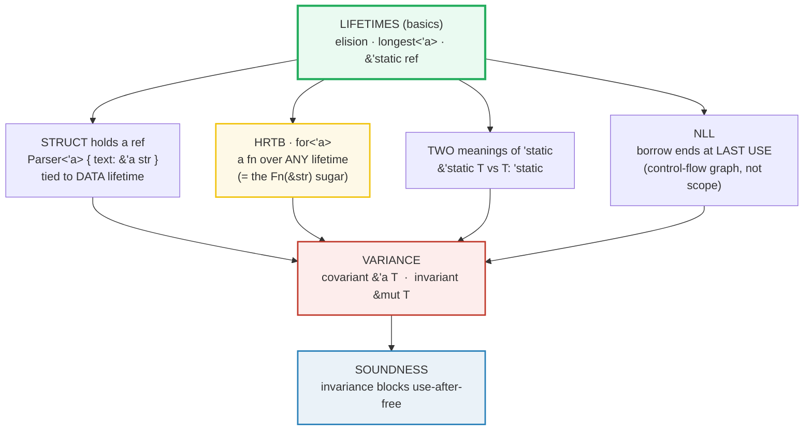

# LIFETIMES_ADVANCED — Structs, HRTB, `'static`, NLL, and Variance

> **One-line goal:** go past the lifetime **basics** (elision, one-lifetime
> functions) into the five things working Rust engineers actually fight:
> **structs that hold references**, **higher-ranked trait bounds** (`for<'a>`),
> the two meanings of **`'static`** (a reference *and* a `T: 'static` bound),
> **non-lexical lifetimes** (NLL), and **variance** (covariance / invariance /
> contravariance).
>
> **Run:** `just run lifetimes_advanced` (== `cargo run --bin lifetimes_advanced`)
> **Member:** `core` (stdlib-only — no `[dependencies]`).
> **Prerequisites:** 🔗 [LIFETIMES](./LIFETIMES.md) (the basics: elision rules,
> the `'static` reference, a one-field `Excerpt<'a>`), 🔗 [BORROWING](./BORROWING.md).
> **Ground truth:** [`lifetimes_advanced.rs`](./lifetimes_advanced.rs); captured
> stdout: [`lifetimes_advanced_output.txt`](./lifetimes_advanced_output.txt).

---

## Why this exists (lineage)

[LIFETIMES](./LIFETIMES.md) covered the floor: the three elision rules, an
explicit `longest<'a>`, the `'static` *reference*, a one-field `Excerpt<'a>`,
and a single NLL demo. This bundle is the **ceiling** — the moment lifetimes
stop being "annotations the compiler wants" and start being a **type system**
with subtyping, a quantifier (`for<'a>`), and a soundness-critical property
(variance) that is *invisible* in safe code but *load-bearing* in `unsafe`.



The unifying idea: a lifetime is a **region of code**, and Rust's job is to
prove no reference outlives the data it points at. Every feature below is a
tool for stating or checking that invariant.

---

## Section A — A struct holding a reference: `Parser<'a>`

```rust
struct Parser<'a> {
    text: &'a str,
}

impl<'a> Parser<'a> {
    fn word(&self, n: usize) -> Option<&'a str> {
        self.text.split_whitespace().nth(n)
    }
}
```

> **From lifetimes_advanced.rs Section A:**
> ```
> ======================================================================
> SECTION A — a struct holding a reference: Parser<'a>
> ======================================================================
> struct Parser<'a> { text: &'a str }
> impl<'a> Parser<'a> { fn word(&self, n) -> Option<&'a str> }
> Parser{text:"rust lifetimes are not magic"}.word(0) -> Some("rust")
>                                    .word(2) -> Some("are")
> [check] Parser::word(0) returns the 1st word, tied to the data lifetime: OK
> [check] Parser::word(2) returns the 3rd word: OK
> after the Parser dropped, the source String is still usable (len = 28)
> [check] the source outlives the Parser that borrowed it: OK
> ```

**What.** A struct that *stores a reference* must declare a lifetime parameter
and thread it onto the field: `struct Parser<'a> { text: &'a str }`. That `'a`
ties the **entire struct** to the borrowed data's validity — a `Parser<'a>` may
not outlive the `&'a str` it points at. `word` then returns `Option<&'a str>`:
the slice is tied to the **data** lifetime `'a`, *not* to the borrow of `&self`.

**Why (internals).**
- **The struct is a borrowing type, so it carries the borrow's deadline.**
  Without `'a` the compiler could not answer "when is a `Parser` safe to drop?"
  — it would have no way to know the `text` field is still alive. The lifetime
  parameter is exactly that deadline, exposed in the type. The Book ([ch10.3]
  [book-ch103]) is blunt: "this annotation means an instance of `ImportantExcerpt`
  can't outlive the reference to the first field."
- **`-> &'a str` is tied to the data, not to `&self`.** Lifetime **elision** for
  methods assigns an elided output lifetime to the `&self` receiver. By writing
  `&'a str` *explicitly* we override that: the returned slice lives as long as the
  *borrowed text*, so it stays valid even after the `Parser` binding itself is
  dropped. The output proves it — after the inner block closes (dropping `p`),
  the source `String` is still usable (`len = 28`). This is the maximally flexible
  signature; elision (`-> &str`) would have been correct but *more restrictive*
  (tying the slice to the borrow of `p`).
- **`impl<'a> Parser<'a>`** brings `'a` into scope so the method can name it.
  The borrow checker then only needs `self.text: &'a str` ⇒ every sub-slice is
  `&'a str`, which is exactly what `str::split_whitespace` yields.

> **If the field were owned (`text: String`), there would be no lifetime at
> all.** Lifetimes appear only where there is *borrowing*. Owned data has no
> lifetime parameter — that is the whole story of Section B's `T: 'static`.
> 🔗 [OWNERSHIP](./OWNERSHIP.md), 🔗 [STRUCTS_ENUMS](./STRUCTS_ENUMS.md).

---

## Section B — `'static`: a forever reference, AND a `T: 'static` bound

`'static` is **overloaded**: it means one thing as a *reference* and a subtly
different thing as a *bound*. Conflating them is the #1 source of `'static`
confusion.

> **From lifetimes_advanced.rs Section B:**
> ```
> ======================================================================
> SECTION B — 'static: a forever reference, AND a `T: 'static` bound
> ======================================================================
> let s: &'static str = "literal";   (a string literal IS 'static)
> [check] a &'static str literal holds "literal": OK
> fn needs_static<T: 'static>(tag: &str, _val: &T)
>   needs_static("&'static str", &..): accepted  (T: 'static satisfied)
>   needs_static("String (owned)", &..): accepted  (T: 'static satisfied)
> [check] an OWNED String satisfies T: 'static and stays usable: OK
> ```

**What.** Two distinct uses, both verified:
1. **`&'static str`** — the *reference* form. A string literal is baked into the
   read-only data of the binary, so the reference is valid for the **entire
   program**. `let s: &'static str = "literal";` is accepted and `s == "literal"`.
2. **`T: 'static`** — the *bound* form. `needs_static::<T>` accepts **both** an
   `&'static str` **and** an owned `String`. The bound asks *"can `T` survive
   forever?"*, **not** *"is `T` a static reference?"*. An owned `String` holds
   only heap bytes it controls (no borrowed data), so it can live forever: hence
   `String: 'static` holds.

**Why (internals).**
- **String literals live in the binary.** The compiler stores `"literal"` in the
  `.rodata` section; the `&str` is a pointer into that never-freed memory, so its
  lifetime really is the whole process. The Book ([ch10.3][book-ch103]): "the
  lifetime of all string literals is `'static`."
- **`T: 'static` is the "owns-or-borrows-forever" bound.** Formally, `T: 'static`
  holds when `T` contains **no non-`'static` references**. That includes every
  owned type (`String`, `Vec`, `i32`, `Box`, …) *and* `&'static T`. This is why
  `std::thread::spawn` requires `T: 'static` + `Send`: the child thread may
  outlive the parent, so the closure must not borrow anything shorter-lived than
  the program. The Book ([ch10.3][book-ch103]) spells it out: "`'static` as a
  bound … `T: 'static` … means that the type `T` can live for the entire
  lifetime of the program. … an owned type like `String` … satisfies the `'static`
  lifetime bound."
- **"Owned" ≠ "`'static`".** An owned value has **no lifetime at all** — it has
  an *owner* whose scope determines when it drops. `String: 'static` is a
  *trivially-true* bound (it contains no borrows to constrain), not a statement
  that the `String` value literally lives forever. Confusing the two is the pitfall
  in the table below.

**The compile error (passing a short-lived ref where `T: 'static` is required):**

```console
error[E0597]: `local` does not live long enough
  --> src/main.rs:3:17
   |
2  |     let local = String::from("short");
3  |     needs_static("short ref", &local);
   |                               ^^^^^^ borrowed value does not live long enough
   |
   = note: `local` must be borrowed for `'static` ...
```

> Here `T = &'local str`, and `&'local str: 'static` is **false** (`'local`
> doesn't outlive the function), so the bound rejects it. 🔗 [THREADS](./THREADS.md)
> — where `T: 'static + Send` is the most common place this bound bites.

---

## Section C — Higher-Ranked Trait Bounds: `for<'a>`

Some functions must say "this callback works for **any** lifetime of its
argument", but the exact lifetime isn't known until the call. That quantifier is
`for<'a>`.

```rust
fn apply_any<F>(s: &str, f: F) -> bool
where
    F: for<'a> Fn(&'a str) -> bool,   // f works for ANY lifetime
{
    f(s)
}
```

> **From lifetimes_advanced.rs Section C:**
> ```
> ======================================================================
> SECTION C — Higher-Ranked Trait Bounds: for<'a>
> ======================================================================
> fn apply_any<F>(s: &str, f: F) -> bool  where  F: for<'a> Fn(&'a str) -> bool
>   (the sugar `F: Fn(&str) -> bool` desugars to that `for<'a>` bound)
> apply_any("rust forever", |w| w.contains("rust")) -> true
> [check] HRTB callback (closure) matches a substring: OK
> apply_any("hi", is_short as fn(&str) -> bool) -> true
> [check] HRTB callback (plain fn) sees len < 5: OK
> higher_order_any(&["hi","world","x"], is_short) -> true
> [check] the `Fn(&str)` sugar IS the `for<'a> Fn(&'a str)` HRTB: OK
> ```

**What.** `apply_any` accepts a callback `F` that must be callable on a `&str`
of **any** lifetime — `for<'a> Fn(&'a str) -> bool`. The same `F` is exercised
three ways: a **closure** (`true`), a **plain `fn`** (`is_short` → `true`), and
through the **sugar** form `impl Fn(&str) -> bool` (`higher_order_any` → `true`).
All three agree, proving the sugar and the explicit `for<'a>` are identical.

**Why (internals).**
- **`for<'a>` is a universal quantifier over lifetimes.** The Rustonomicon
  ([HRTB][nomicon-hrtb]) reads it as "for all choices of `'a`", producing "an
  *infinite list* of trait bounds that `F` must satisfy." Contrast with a named
  generic lifetime `<'a>`, which is chosen **once** at the call site. HRTB is what
  you need when the lifetime is decided *inside* the function (at the `f(s)` call),
  not by the caller.
- **`Fn(&str)` is sugar for `for<'a> Fn(&'a str)`.** Every time you write a
  closure/trait bound `F: Fn(&T) -> R` with an *elided* reference argument, the
  compiler silently inserts the `for<'a>`. The third check (`higher_order_any`,
  declared `impl Fn(&str) -> bool`) accepting the very same `is_short` callback
  is the proof: the two forms are the same type.
- **Where it appears in the wild.** The `Fn`/`FnMut`/`FnOnce` traits are the main
  site; you rarely write `for<'a>` by hand because the sugar covers it. But the
  moment you abstract over a callback that takes a *reference of unknown
  lifetime*, HRTB is what's happening under the hood.

> **HRTB vs higher-ranked *types*.** `for<'a>` in a *bound* (compile-time
> generic) is stable and common. `for<'a>` as a first-class *type* (e.g. a local
> variable of type `for<'a> fn(&'a str)`) is more limited but does work — the
> Reference ([subtyping][ref-subtyping]) shows `for<'a> fn(&'a i32)` coercing to
> `fn(&'static i32)`. 🔗 [CLOSURES](./CLOSURES.md), 🔗 [ITERATORS](./ITERATORS.md).

---

## Section D — Non-Lexical Lifetimes (NLL): a borrow ends at its LAST USE

```rust
let mut x = 1;
let r = &x;          // shared borrow starts
println!("{r}");     // <- LAST USE of r
x = 5;               // OK: r's borrow already ended (would error pre-NLL)
```

> **From lifetimes_advanced.rs Section D:**
> ```
> ======================================================================
> SECTION D — Non-Lexical Lifetimes: a borrow ends at its LAST USE
> ======================================================================
> NLL: the borrow of `r` ends at `println!("{r}"), not at the `}`.
>   let r = &x;            r = 1      <- last use of the borrow
>   x = 5;   (mutate AFTER the borrow's last use) -> x = 5
> [check] NLL: mutating x after the shared borrow's last use succeeds: OK
> ```

**What.** `r` borrows `x` immutably; then `x = 5` mutates `x`. This **compiles
and runs** (`x` becomes `5`) — because the borrow of `r` is considered dead after
its **last use** (the `println!`), which is *before* the mutation. The check
proves `x` actually changed.

**Why (internals).**
- **Pre-NLL, borrows were *lexical* — they lasted to the binding's closing `}`.**
  Under the old rules `r` would be alive until the end of scope, overlapping the
  `x = 5` mutation, so the program was **rejected**. RFC 2094 ([NLL][rfc-nll])
  changed the model: "lifetimes that are based on the **control-flow graph**,
  rather than lexical scopes." The borrow checker now computes the **smallest**
  region that covers all *uses* of the reference — not the syntactic block.
- **NLL is a *liveness* analysis.** RFC 2094 ([NLL][rfc-nll]): "a variable is
  **live** if the current value that it holds may be used later." A borrow's
  lifetime is the set of program points where the reference is live. Once `r` is
  no longer used, it is dead, its borrow ends, and `x` is free to mutate. This is
  exactly RFC 2094's "Problem case #1: references assigned into a variable,"
  solved.
- **NLL landed on stable in Rust 2018** (Edition-independent; it's the only
  borrow checker now). It removed a large class of "artificial block"
  workarounds. The remaining borrow-checker friction is about *aliasing across
  function calls* and *disjoint borrows*, not about lexical scope.

> **NLL is not a relaxation of soundness.** It accepts strictly more *correct*
> programs; it never accepts a program that could dangle. The liveness region is
> always chosen large enough to cover every real use. 🔗 [LIFETIMES](./LIFETIMES.md)
> Section E shows the Vec `push` variant of the same idea.

---

## Section E — Variance: covariance lets a longer lifetime satisfy a shorter one

Variance is the rule for **how subtyping of a lifetime flows through a type**.
It is the feature that makes `&'static str` usable as `&'short str` (covariance)
while *forbidding* the same for `&mut` (invariance) — and that prohibition is
what stops a classic use-after-free.

```rust
fn debug_two<'a>(a: &'a str, b: &'a str) -> usize { /* ... */ a.len() + b.len() }

let hello: &'static str = "hello";
let world = String::from("world");
let n = debug_two(hello, &world);   // hello silently downgrades &'static -> &'short
```

> **From lifetimes_advanced.rs Section E:**
> ```
> ======================================================================
> SECTION E — Variance: a longer lifetime can satisfy a shorter one
> ======================================================================
> rule: 'long <: 'short  <=>  'long outlives 'short  (so 'static <: 'b)
> let s: &'static str = "hi";  let r: &str = s;   // OK via covariance
> [check] covariant assignment: &'static str fits a &str binding: OK
> debug_two("hello" [&'static], &world [&'short]):
>   debug_two: a = "hello", b = "world"
> [check] covariance lets &'static and &'short share one lifetime param: OK
>   -> &'static str was downgraded to &'short; no error, no data lost
> note: &mut T is INVARIANT — it CANNOT be downgraded this way.
>       that is what blocks the classic use-after-free (see .md E0597).
> ```

**What.** Two covariance facts are checked:
1. **Covariant assignment:** `let s: &'static str = "hi"; let r: &str = s;`
   compiles. A longer lifetime (`'static`) silently satisfies a shorter one (`'b`).
2. **Covariance across mismatched args:** `debug_two<'a>(a: &'a str, b: &'a str)`
   is called with a `&'static str` and a `&'short str`. The `&'static` is
   *downgraded* to `'short` so both share one `'a`; the call returns `10`
   (`"hello"`+`"world"`). No error, no data lost.

**Why (internals).** Rust defines subtyping **only** for lifetimes: `'long <:
'short` when `'long` outlives `'short` ([Reference — subtyping][ref-subtyping]).
*Variance* is how that lifetime subtyping passes through a type constructor `F`:

| Variance of `F` over the lifetime | Means | Example |
|---|---|---|
| **covariant** | `F<'long> <: F<'short>` — flows through | `&'a T`, `Box<T>`, `Vec<T>`, `*const T` |
| **contravariant** | flipped — `F<'short> <: F<'long>` | `fn(&'a T) -> ()` (the *argument*) |
| **invariant** | no subtyping — lifetimes must be **equal** | `&'a mut T`, `Cell<T>`, `*mut T`, `UnsafeCell<T>` |

(The table is the [Reference — variance][ref-subtyping] / [Nomicon —
subtyping][nomicon-subtyping] table.)

- **`&'a T` is covariant** — so a `&'static str` *is* a `&'short str` (it
  satisfies at least the shorter region). That is the "free downgrade" Section E
  relies on, and it's safe: shortening a *shared* reference's promised lifetime
  can never create a dangling pointer.
- **`&'a mut T` is INVARIANT in `T`** — and this is the load-bearing safety
  mechanism. The Nomicon ([subtyping][nomicon-subtyping]) shows exactly why: if
  `&mut T` were covariant, you could store a short-lived reference into a slot
  typed `'static`, let the short data drop, then read a dangling pointer:

```rust
fn assign<T>(input: &mut T, val: T) { *input = val; }

let mut hello: &'static str = "hello";
{
    let world = String::from("world");
    assign(&mut hello, &world);   // would store &'short into a &'static slot
}                                 // world dropped here
println!("{hello}");              // use-after-free!  😿
```

  Because `&mut T` is **invariant over `T`**, the compiler **cannot** downgrade
  `&mut &'static str` to match `&mut &'short str`, so it forces `T` to be exactly
  `&'static str`, and `&world` (`&'short str`) fails the bound:

```console
error[E0597]: `world` does not live long enough
  --> src/main.rs:7:24
   |
4  |     let mut hello: &'static str = "hello";
   |                    ------------ type annotation requires that `world` is borrowed for `'static`
...
7  |         assign(&mut hello, &world);
   |                            ^^^^^^ borrowed value does not live long enough
8  |     }
   |     - `world` dropped here while still borrowed
```

> **Invariance is the safety net you never see in safe code.** You don't write
> it; the compiler infers it from the `&mut`/`Cell`/`UnsafeCell` in your types.
> It only becomes *visible* (as E0597) when you fight it. The only source of
> **contravariance** in the language is function *arguments* ([Nomicon][nomicon-subtyping]):
> `fn(&'static str)` is *not* a subtype of `fn(&'short str)`, but `fn(&'short str)`
> **is** a subtype of `fn(&'static str)` — a function that accepts any ref surely
> accepts a static one. 🔗 [INTERIOR_MUTABILITY](./INTERIOR_MUTABILITY.md) (`Cell`
> is invariant), 🔗 [BOX_RC_ARC](./BOX_RC_ARC.md) (`Box`/`Rc`/`Arc` are covariant).

---

## Section F — Compile errors: E0515 (ref to local), E0621 (mismatched lifetimes)

Two lifetime errors cannot live in a runnable file — the binary wouldn't build.
They are documented verbatim here, with their **fixes shown running**.

> **From lifetimes_advanced.rs Section F:**
> ```
> ======================================================================
> SECTION F — compile errors E0515 / E0621 (documented) + their fixes (running)
> ======================================================================
> E0515 — returning a reference to a local variable (dangling ref):
>     fn dangle() -> &'static i32 { let x = 0; &x }   // E0515
>     fix: return owned data -> no_dangle() = "ok"
> [check] E0515 fix: return owned data instead of a ref to a local: OK
> E0621 — mismatched lifetimes (body returns data the signature omits):
>     fn foo<'a>(x: &'a i32, y: &i32) -> &'a i32 {
>         if x > y { x } else { y }   // y has no lifetime -> E0621
>     }
>     fix: give y the same 'a -> longest(&3, &7) = 7
> [check] E0621 fix: both args share 'a, returns the larger (7): OK
> ```

### E0515 — cannot return reference to local variable

```rust
fn dangle() -> &'static i32 {   // E0515
    let x = 0;
    &x                           // x is dropped at `}` -> dangling ref
}
```

```console
error[E0515]: cannot return reference to local variable `x`
 --> src/main.rs:2:5
  |
1 | fn dangle() -> &'static i32 {
2 |     &x
  |     ^^--
  |     |
  |     returns a reference to data owned by the current function
```

> The error index ([E0515][e0515]): "Local variables, function parameters and
> temporaries are all dropped before the end of the function body. A returned
> reference … to such a dropped value would immediately be invalid."
> **Fix:** return **owned** data instead of borrowing a local — the running
> `no_dangle() -> String` returns `"ok"` (first check).

### E0621 — explicit lifetime required (mismatched lifetimes)

```rust
fn foo<'a>(x: &'a i32, y: &i32) -> &'a i32 {   // E0621
    if x > y { x } else { y }                   // returns y, but y has no lifetime
}
```

```console
error[E0621]: explicit lifetime required required in the type of `y`
 --> src/main.rs:1:30
  |
1 | fn foo<'a>(x: &'a i32, y: &i32) -> &'a i32 {
  |                          ^^^^^^
  = note: lifetime `'a` required for this
```

> The error index ([E0621][e0621]): "this error code indicates a mismatch
> between the lifetimes appearing in the function signature … and the data-flow
> found in the function body." The signature claims the return borrows only `x`
> (`'a`), but the body may return `y`. **Fix:** give `y` the **same** `'a` — the
> running `longest<'a>(x: &'a i32, y: &'a i32) -> &'a i32` returns `7` (second
> check). 🔗 [LIFETIMES](./LIFETIMES.md) Section B is the basic `longest<'a>`.

---

## Pitfalls (the expert payoff)

| Trap | Symptom | Fix / why |
|---|---|---|
| **"`'static` means owned"** | Confused why `T: 'static` accepts a `String` | `'static` is a *reference* OR a *bound*. As a bound, `T: 'static` means "no non-`'static` borrows inside `T`" — every owned type qualifies. Owned ≠ `'static`. |
| **Forgetting a lifetime on a struct field** | `error[E0106]: missing lifetime specifier` | A struct that stores a reference *must* declare `<'a>` and tag the field `&'a`. There is no elision for struct fields. |
| **Tying a method return to `&self` instead of the data** | Returned slice dies too early (can't outlive the borrow of the struct) | Write the return as `&'a T` explicitly (tied to the data lifetime), not the elided `&T` (tied to `&self`). See Section A. |
| **Trying to use HRTB where a named lifetime suffices** | Over-complicated `for<'a>` bounds | `for<'a>` is for "any lifetime, chosen inside the fn". If the caller picks the lifetime, a plain generic `<'a>` is enough. The `Fn(&str)` sugar already inserts `for<'a>` for you. |
| **"Why did my borrow end early?"** | A reference is invalid "before the `}`" | NLL: borrows end at **last use**, not scope end. This is correct & sound; re-borrow after the last use is allowed. |
| **Expecting `&mut T` to be covariant** | `error[E0597]: does not live long enough` when stuffing a short ref into a `&mut &'static` slot | `&mut T` is **invariant** — lifetimes must match exactly. That invariance is what prevents the use-after-free; it's a feature, not a bug. |
| **Returning a ref to a local** | `error[E0515]: cannot return reference to local variable` | Return **owned** data (`String`, `Vec`), or take the data as an input `&'a` and return `&'a`. |
| **Signature omits a lifetime the body needs** | `error[E0621]: explicit lifetime required` | If the body can return data from input `y`, `y` must carry the output lifetime too. Give all returned-from inputs the same `'a`. |
| **`'static` from `thread::spawn`** | Closure must be `'static + Send`; a captured `&local` is rejected | The child may outlive the parent. Capture by **move** (own the data) or use a scoped thread (`crossbeam`/`std::thread::scope`). |
| **Thinking contravariance matters day-to-day** | Rare confusion over `fn` arg lifetimes | The **only** contravariant position is `fn` *arguments*. You almost never reason about it in safe code; subtyping mostly does the right thing automatically. |

---

## Cheat sheet

```rust
// STRUCT holding a reference -> must carry a lifetime, tied to the DATA.
struct Parser<'a> { text: &'a str }
impl<'a> Parser<'a> {
    fn word(&self, n: usize) -> Option<&'a str> {  // 'a, NOT &self's borrow
        self.text.split_whitespace().nth(n)
    }
}

// 'static has TWO meanings:
//   &'static str   -> a reference valid for the whole program (string literals).
//   T: 'static     -> a BOUND: "T holds no non-'static refs". Owned types qualify.
let s: &'static str = "literal";          // reference form
fn needs_static<T: 'static>(_: &T) {}     // bound form  (String: 'static  ✓)

// HRTB: for<'a> = "for ANY lifetime". The Fn(&str) sugar IS for<'a> Fn(&'a str).
fn apply_any<F: for<'a> Fn(&'a str) -> bool>(s: &str, f: F) -> bool { f(s) }

// NLL: a borrow ends at LAST USE, not the closing }. Sound; accepts more programs.
let mut x = 1; let r = &x; println!("{r}"); x = 5;   // OK

// VARIANCE (lifetime subtyping:  'long <: 'short):
//   &'a T         COVARIANT   -> &'static str is a &'short str  (free downgrade)
//   &'a mut T     INVARIANT   -> lifetimes must MATCH (blocks use-after-free)
//   fn(&'a T)     CONTRAVARIANT (the only contravariance; rare in safe code)
let s: &'static str = "hi"; let r: &str = s;        // OK: covariance

// COMPILE ERRORS (documented, not runnable):
//   E0515  returning a ref to a local      -> return OWNED data instead
//   E0621  mismatched lifetimes (sig/body) -> give every returned-from input 'a
//   E0597  invariance of &mut blocks a short-into-static store (a SAFETY win)
```

---

## Sources

Every claim above was web-verified in at least two authoritative places.

- **The Rust Programming Language, ch10.3 "Validating References with Lifetimes"
  / "Lifetime Annotations in Struct Definitions" / "The Static Lifetime" (incl.
  `T: 'static` includes owned types like `String`):**
  https://doc.rust-lang.org/book/ch10-03-lifetime-syntax.html
- **The Rustonomicon — "Higher-Rank Trait Bounds (HRTBs)"** — `for<'a>` as "for
  all choices of `'a`", the `Fn(&'a T)` desugar, the infinite-list-of-bounds
  reading:
  https://doc.rust-lang.org/nomicon/hrtb.html
- **The Rustonomicon — "Subtyping and Variance"** — `'long <: 'short`,
  covariance of `&'a T`, invariance of `&mut T`/`Cell`/`UnsafeCell`, the
  use-after-free that invariance prevents (E0597), contravariance of `fn`
  arguments, the full variance table:
  https://doc.rust-lang.org/nomicon/subtyping.html
- **The Rust Reference — "Subtyping and variance"** — `'static` outlives any
  `'a` ⇒ `&'static str` is a subtype of `&'a str`, higher-ranked subtyping, and
  the official variance table (`&'a T` covariant, `&'a mut T` invariant,
  `fn(T)` contravariant, `UnsafeCell`/`Cell` invariant, `PhantomData`
  covariant):
  https://doc.rust-lang.org/reference/subtyping.html
- **RFC 2094 — "Non-Lexical Lifetimes"** — lifetimes based on the control-flow
  graph (not lexical scope); the liveness definition ("a variable is live if the
  current value may be used later"); "Problem case #1: references assigned into a
  variable"; location-aware subtyping:
  https://rust-lang.github.io/rfcs/2094-nll.html
- **Error index — E0515** ("cannot return reference to local variable"; "Local
  variables, function parameters and temporaries are all dropped before the end
  of the function body"; fix = return owned data):
  https://doc.rust-lang.org/error_codes/E0515.html
- **Error index — E0621** ("mismatch between the lifetimes appearing in the
  function signature … and the data-flow found in the function body"; fix = give
  every returned-from input the same `'a`):
  https://doc.rust-lang.org/error_codes/E0621.html
- **Rust by Example / Reference — struct lifetimes** ("an instance of a struct
  that stores a reference can't outlive the reference's lifetime"), corroborating
  Section A and ch10.3:
  https://doc.rust-lang.org/reference/types/struct.html
