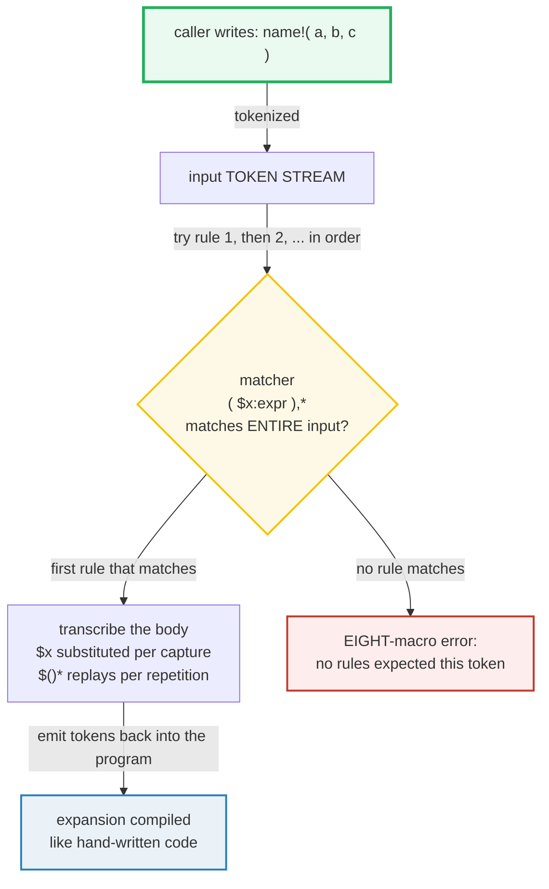
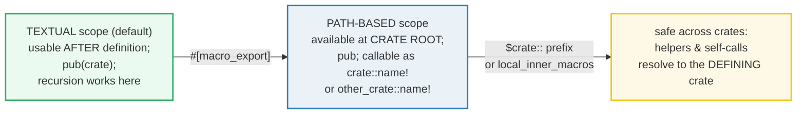

# MACRO_RULES — Declarative Macros (`macro_rules!`)

> **One-line goal:** a `macro_rules!` macro **pattern-matches on input tokens at
> compile time** and **emits substituted code** — `match` over *syntax*, not
> values — driven by fragment specifiers (`$x:expr`), repetitions (`$()*`),
> mixed-site **hygiene**, **recursion**, and `#[macro_export]`.
>
> **Run:** `just run macro_rules` (== `cargo run --bin macro_rules`)
> **Member:** `core` (stdlib-only — no `[dependencies]`).
> **Prerequisites:** [GENERICS](./GENERICS.md) (compile-time code generation),
> [TRAITS_BASICS](./TRAITS_BASICS.md) — `macro_rules!` is another flavor of
> compile-time codegen, sibling to monomorphization.
> **Ground truth:** [`macro_rules.rs`](./macro_rules.rs); captured stdout:
> [`macro_rules_output.txt`](./macro_rules_output.txt).

---

## Why this exists (lineage)

Rust has **two** macro systems. This bundle covers the simpler, more common one:

| System | Defined with | How it works | When you reach for it |
|---|---|---|---|
| **Declarative** (`macro_rules!`) | `macro_rules! name { (pattern) => { body }; }` | **Pattern-match** on input tokens, **substitute** into the body. No AST manipulation. | `vec!`, `println!`, `assert_eq!`, `format!` — variadic, DSL-free codegen. |
| **Procedural** | a `proc-macro = true` crate + `#[proc_macro_derive/attribute/macro]` | A **Rust function** receives a `TokenStream`, returns a `TokenStream`. Arbitrary AST surgery. | `#[derive(Serialize)]`, attribute macros (`#[tokio::main]`), function-like (`sql!`). |

A declarative macro is, at heart, a `match` over **source code structure**. The
Rust Book: "In this situation, the value is the *literal Rust source code* passed
to the macro; the patterns are compared with the structure of that source code;
and the code associated with each pattern, when matched, replaces the code passed
to the macro. This all happens during compilation." ([Book ch20.5][book-macros]).



Two consequences make macros *unlike functions* (Book ch20.5 [book-macros]):

1. **Variadic arity.** A function signature fixes the number and type of
   parameters; `println!("hi")` and `println!("{} + {}", 1, 2)` are both legal.
   Repetitions (`$($x:expr),*`) are how a macro accepts "any number of args."
2. **Pre-type-check codegen.** Macros expand **before** the compiler interprets
   meaning, so a macro can implement a trait or generate a `struct` — a function
   cannot (it runs at runtime; a trait must be implemented at compile time).

---

## The anatomy of one rule

```rust
macro_rules! name {                  // `name` is registered WITHOUT the `!`
    ($pattern) => { $transcriber };   // one rule; many rules separated by `;`
}
```

- **`$pattern`** (the *matcher*): literal tokens plus **metavariables**
  `$name:frag` and **repetitions** `$( ... )sep rep`. It must match the
  **entire** input token tree.
- **`$transcriber`** (the *body*): literal tokens plus `$name` (substituted)
  and `$()*` (replayed per repetition). A metavariable "can be transcribed more
  than once or not at all" ([Reference — Metavariables][ref-mbe]).
- The expander "tries each macro rule in turn. It transcribes the **first**
  successful match; if this results in an error, then future matches are **not**
  tried" ([Reference][ref-mbe]) — i.e. **no backtracking**.

---

## Section A — The simplest macro: match, substitute, repeat

```rust
macro_rules! say {
    ($($x:expr),* $(,)?) => {            // zero+ comma-separated exprs + opt trailing comma
        {
            let mut printed = 0usize;
            $( println!("  say: {}", $x); printed += 1; )*   // $()* replays per $x
            printed
        }
    };
}
```

> **From macro_rules.rs Section A:**
> ```
> ======================================================================
> SECTION A — the simplest macro: match tokens, substitute, repeat
> ======================================================================
>   say!(1, 2):
>   say: 1
>   say: 2
>   say!("hello", "macros", 3 * 4):
>   say: hello
>   say: macros
>   say: 12
> [check] say!(1,2) prints 2 lines (the repetition expands twice): OK
> [check] say!("hello","macros",3*4) prints 3 lines: OK
> ```

**What.** `say!(1, 2)` matches the matcher with `$x` bound to `1` then `2`; the
body's `$( ... )*` emits the `println!`/increment pair **twice**, returning `2`.
`say!("hello", "macros", 3 * 4)` binds `$x` three times — note `3 * 4` is ONE
`:expr` and prints **`12`**: the fragment is a complete expression, evaluated by
the `println!`.

**Why (internals).**
- **`$($x:expr),*`** is "zero or more (`*`) `$x:expr`, separated (`,`) by commas."
  The separator may be "any token other than a delimiter or one of the
  repetition operators, but `;` and `,` are the most common"
  ([Reference — Repetitions][ref-mbe]).
- **`$(,)?`** is the "zero or one" operator `?`. It **cannot take a separator**
  ([Reference][ref-mbe]); it is there to swallow an *optional trailing comma*,
  so both `say!(1, 2)` and `say!(1, 2,)` parse.
- **`$()*` in the body** drives replay: "the repeated fragment both matches and
  transcribes to the specified number of the fragment, separated by the
  separator token" ([Reference][ref-mbe]). Each captured `$x` is substituted as
  a complete AST node, never re-parsed textually.

---

## Section B — Fragment specifiers: what class of syntax a `$name:` binds

A **fragment specifier** after `$name:` tells the compiler's parser how much
input to consume and as what. Captures are substituted as whole AST nodes.

```rust
macro_rules! typed_let {
    ($i:ident, $t:ty, $e:expr) => { let $i: $t = $e; };
}
typed_let!(answer, i32, 6 * 7);   // -> let answer: i32 = 6 * 7;
```

> **From macro_rules.rs Section B:**
> ```
> ======================================================================
> SECTION B — fragment specifiers: ident / ty / expr / literal / tt / block
> ======================================================================
>   typed_let!(answer, i32, 6 * 7)  -> answer = 42
> [check] ident+ty+expr build `let answer: i32 = 6*7;` -> 42: OK
>   double_lit!(21)        via :literal -> 42
> [check] :literal matches a single literal; 21 + 21 = 42: OK
>   first_tt!(hello world 123) via :tt -> "hello"
> [check] :tt captures one token tree -> "hello": OK
>   run_block!({ let z = 5; z * z }) via :block -> 25
> [check] :block matches a braced block; 5 * 5 = 25: OK
> ```

**What.** Four specifiers are exercised:
- `:ident` binds `answer`; `:ty` binds `i32`; `:expr` binds `6 * 7` (a full
  expression) — the three assemble a typed `let`. `answer == 42`.
- `:literal` matches exactly **one** literal token; `double_lit!(21)` → `21+21`.
- `:tt` matches **one token tree** (a single token, or `(...)`/`[...]`/`{...}`
  with balanced contents) — the most permissive single matcher. `first_tt!`
  grabs `hello` and ignores the rest.
- `:block` matches a brace-delimited **block expression**.

**Why (internals).** The full specifier set, verbatim from the Reference
([MacroFragSpec][ref-mbe]): `block | expr | expr_2021 | ident | item | lifetime |
literal | meta | pat | pat_param | path | stmt | tt | ty | vis`. The ones you
meet daily:

| Specifier | Matches | Notes |
|---|---|---|
| `expr` | a complete expression | Edition 2024 also matches `_` and const blocks at top level. |
| `ty` | a type (`i32`, `Vec<u8>`, `&'a str`) | |
| `ident` | an identifier (or keyword; not `_`, not raw) | |
| `literal` | a single literal (optionally negated) | |
| `tt` | one token tree | The escape hatch for TT munchers (Section F). |
| `stmt` | a statement **without** its trailing `;` | |
| `block` | a brace block | |
| `pat` / `pat_param` | a pattern | `pat` accepts top-level or-patterns (2021+). |
| `meta` | the contents of an attribute (`#[...]`) | |
| `item` / `vis` / `lifetime` / `path` | item / visibility / `'a` / path | |

> **Follow-set ambiguity (the trap that makes `expr` picky).** After certain
> fragments the matcher can only be followed by specific tokens, or the parse
> would be ambiguous in *future* Rust. `expr` and `stmt` may **only** be
> followed by `=>`, `,`, or `;` ([Reference — Follow-set][ref-mbe]). That is why
> `say!` separates `$x:expr` with `,` and never writes `$x:expr $y:expr`
> back-to-back. `tt`, `ident`, `literal`, `lifetime`, and `block` have **no**
> restrictions — which is exactly why TT munchers use `:tt`.

---

## Section C — Repetition in the BODY: a `vec!`-clone

```rust
macro_rules! mk_vec {
    ($($x:expr),* $(,)?) => {
        {
            let mut v = Vec::new();
            $( v.push($x); )*        // emitted once PER captured $x
            v
        }
    };
}
```

> **From macro_rules.rs Section C:**
> ```
> ======================================================================
> SECTION C — repetition in the BODY: a vec!-clone
> ======================================================================
>   mk_vec![10, 20, 30] -> [10, 20, 30]
> [check] mk_vec![$($x:expr),*] expands to the same Vec as the std vec! macro: OK
> [check] the body repetition emitted push() exactly 3 times: OK
>   mk_vec![]            -> []
> [check] `*` permits zero repetitions -> empty Vec: OK
> ```

**What.** `mk_vec![10, 20, 30]` expands to `{ let mut v = Vec::new();
v.push(10); v.push(20); v.push(30); v }` — three pushes — and equals
`vec![10, 20, 30]`. `mk_vec![]` matches **zero** repetitions (the `*` allows
zero), so the body's `$()*` emits nothing and you get an empty `Vec`.

**Why (internals).** This is the Book's **simplified `vec!` definition, almost
verbatim** (Listing 20-35 [book-macros]) — the canonical "variadic builder"
macro. Three things to internalize:
- **`*` matches zero or more; `+` one-or-more; `?` zero-or-one.** Choosing `*`
  is why `mk_vec![]` (and the real `vec![]`) is legal; `+` would require at least
  one element.
- **Transcription arity must match.** "A metavariable must appear in exactly the
  same number, kind, and nesting order of repetitions in the transcriber as it
  did in the matcher" ([Reference][ref-mbe]). `$x` is captured in one
  `$(...),*` repetition, so the body's `$x` must sit inside exactly one
  `$(...)*`.
- **Zero reps ⇒ no type info.** With no elements the element type is unknowable,
  so `mk_vec![]` needs an explicit `let empty: Vec<i32> = mk_vec![];` — a real,
  everyday consequence of a variadic macro that can match zero times. The
  populated call infers `Vec<i32>` from its first element.

> **Why `#[allow(clippy::vec_init_then_push)]` at the call site?** Clippy flags
> `let mut v = Vec::new(); v.push(..)` as "use `vec![..]` instead" — but that
> *is* what we are teaching (the std `vec!` is built this way; it isn't flagged
> only because it lives in an external crate). The allow is local and justified
> in [`macro_rules.rs`](./macro_rules.rs). The `unused_mut` allow inside the
> macro covers the zero-repetition expansion, where `mut` is required by the
> populated case but spuriously unused for `mk_vec![]`.

🔗 [VEC_COLLECTIONS](./VEC_COLLECTIONS.md) — the runtime `Vec` this macro builds.
🔗 [ITERATORS](./ITERATORS.md) — the real `vec!` builds via
`[$( $x ),+]`→`into_iter`→`collect` in some stdlib variants.

---

## Section D — A reducing macro: two arms, recursion via self-call

```rust
macro_rules! sum {
    () => { 0 };                                    // arm 1: base case
    ($first:expr $(, $rest:expr)* $(,)?) => {       // arm 2: peel + recurse
        $first + sum!($($rest,)*)
    };
}
// sum!(1, 2, 3)  -> 1 + sum!(2, 3)
//               -> 1 + (2 + sum!(3))
//               -> 1 + (2 + (3 + sum!()))
//               -> 1 + (2 + (3 + 0)) = 6
```

> **From macro_rules.rs Section D:**
> ```
> ======================================================================
> SECTION D — a reducing macro: two arms, the second recurses
> ======================================================================
>   sum!(1, 2, 3) -> 6   (expands to 1 + (2 + (3 + 0)))
> [check] sum! folds with `a + sum!(rest...)`; 1 + 2 + 3 = 6: OK
>   sum!(42)      -> 42   (arm 2 with empty rest -> 42 + sum!())
> [check] sum!(42): single-element recursion bottoms out at sum!() = 0: OK
>   sum!()        -> 0   (arm 1, the base case)
> [check] sum!(): the empty base-case arm evaluates to 0: OK
> ```

**What.** Two arms. Arm 2 matches one-or-more expressions, substitutes `$first`
and recurses on the rest (`sum!($($rest,)*)`); arm 1 is the empty base case
returning `0`. The expansion of `sum!(1,2,3)` is a *nested* arithmetic
expression, **not** a loop.

**Why (internals).** A macro can invoke **itself**: "names are looked up from
the invocation site," and the macro is textually in scope for its own body, so
`sum!` can call `sum!` ([Reference — Textual scope][ref-mbe]). The recursion is
bounded by the **macro recursion limit** (`recursion_limit`, default **128**);
exceeding it yields `recursion limit reached` — so a TT-muncher over a long list
needs the chunked-counting idiom rather than O(n) recursion. (See the Little
Book's Counting chapter [tlborm-count] for the bounded techniques.)

---

## Section E — Hygiene: a macro's local `x` is NOT the caller's `x`

```rust
macro_rules! hygienic_x {
    ($v:expr) => {
        { let x = $v; x }   // this `x` carries the macro's syntax context
    };
}
let x = 999;                  // the CALLER's `x`
let from_macro = hygienic_x!(7);
// x == 999 (untouched); from_macro == 7 (the macro's own `x`)
```

> **From macro_rules.rs Section E:**
> ```
> ======================================================================
> SECTION E — hygiene: a macro's local `x` does NOT collide with a caller's `x`
> ======================================================================
>   caller `x` = 999;   hygienic_x!(7) returned = 7
> [check] hygiene: the caller's `x` is UNTOUCHED by the macro's `let x`: OK
> [check] hygiene: the macro's `x` is a separate binding with its own value: OK
> ```

**What.** The caller owns `x = 999`. The macro introduces its **own** `let x = 7`
and returns it. After the call the caller's `x` is still `999` and the returned
value is `7`. The two `x`'s **do not collide** despite identical names.

**Why (internals).** Macros have **mixed-site hygiene** ([Reference —
Hygiene][ref-mbe]): "loop labels, block labels, and local variables are looked up
at the **macro definition site** while other symbols are looked up at the
**macro invocation site**." Each identifier introduced by an expansion is tagged
with a **syntax context** (the macro's "color"), so the macro's `x` and the
caller's `x` are *different bindings* even though they share a name. This is
what makes `mk_vec!`'s internal `v` safe to expand anywhere: it can never
accidentally capture or shadow a caller variable named `v`.

> **The "other symbols at invocation site" half is the famous gotcha.** Because
> *items/functions/types* resolve at the **call** site, a macro body that names a
> helper item can be silently hijacked if the caller has a same-named item in
> scope. The Reference's remedy is the `$crate` metavariable: "a special case is
> the `$crate` metavariable. It refers to the crate defining the macro, and can
> be used at the start of the path to look up items or macros which are not in
> scope at the invocation site" ([Reference][ref-mbe]). Always write
> `$crate::helper!(...)` (not bare `helper!(...)`) in exported macros.

---

## Section F — Recursion + `#[macro_export]`: a counting (TT-muncher) macro

```rust
#[macro_export]
macro_rules! count {
    () => { 0usize };                                     // base case
    ($head:tt $(, $tail:tt)* $(,)?) => {                  // peel one tt, recurse
        1usize + count!($($tail,)*)
    };
}
// count!(1,2,3) -> 1 + count!(2,3,) -> 1 + (1 + count!(3,)) -> 1 + (1 + (1 + count!())) = 3
```

> **From macro_rules.rs Section F:**
> ```
> ======================================================================
> SECTION F — recursion + #[macro_export]: a counting (TT-muncher) macro
> ======================================================================
>   count!()        = 0
>   count!(7)       = 1
>   count!(1, 2, 3) = 3
> [check] recursion base case: count!() peels zero tts -> 0: OK
> [check] recursion: count!(7) peels one tt off the front -> 1: OK
> [check] recursion: count!(1,2,3) peels three tts -> 3: OK
>   crate::count!(10, 20, 30, 40) = 4   (path-based call)
> [check] #[macro_export] enables path-based resolution crate::count!(...) -> 4: OK
> ```

**What.** Arm 2 peels the **first token tree** (`$head:tt`) off the front,
discards its comma, and recurses on the rest; arm 1 returns `0`. So
`count!(1,2,3) = 1 + (1 + (1 + 0)) = 3`, and the four-element `crate::count!(10,
20, 30, 40) = 4`. The `$(,)?` absorbs the trailing comma that the recursive
transcription `count!($($tail,)*)` produces.

**Why (internals).**
- **This is the "incremental TT muncher" pattern** — process the input one `:tt`
  at a time, recursing on the remainder ([tlborm][tlborm-rules]). It works
  because `:tt` is unrestricted (no follow-set limit) and can stand
  back-to-back. It is the backbone of nearly every non-trivial declarative macro
  (parsing, counting, accumulation).
- **`#[macro_export]` grants PATH-BASED scope.** By default a `macro_rules!`
  macro has only **textual** scope — it is usable *after* its definition, up to
  the end of its module — and is `pub(crate)` ([Reference — Path-based
  scope][ref-mbe]). `#[macro_export]` "exports the macro from the crate and makes
  it available in the **root of the crate** for path-based resolution" and sets
  visibility to `pub` ([Reference][ref-mbe]). That is why `crate::count!(...)`
  resolves even though `count!` was defined mid-file. In another crate you would
  call it as `my_crate::count!(...)` after a `use`.



---

## Pitfalls (the expert payoff)

| Trap | Symptom | Fix / why |
|---|---|---|
| **`$x:expr $y:expr` back-to-back** | `error: no rules expected the token` / follow-set error | `expr` may **only** be followed by `=>`, `,`, `;`. Separate captures with a separator or wrap each in a `:tt` muncher. |
| **Forgetting the base case in recursion** | `recursion limit reached` (default 128) | A recursive macro needs an arm that does **not** recurse (e.g. `() => { 0 }`). For long lists, use bounded chunked counting, not O(n) recursion. |
| **Macro used before its definition** | `cannot find macro` (textual scope) | Macros are in scope only **after** their `macro_rules!`. Unlike functions (define-anywhere), textual scope is order-sensitive. |
| **`#[macro_export]` forgotten** | `self::m!()` / `crate::m!()` / `other_crate::m!()` all fail | Without it the macro has only textual scope, no path-based scope. Add `#[macro_export]` to expose it at the crate root. |
| **Bare helper name in an exported macro** | Works in your crate, breaks (or is hijacked) in downstream crates | Items/functions resolve at the **invocation** site. Prefix with `$crate::` (`$crate::helper!(...)`) so helpers resolve in the defining crate. |
| **Expecting macro locals to capture caller locals** | The macro's `x` doesn't see a caller's `x` (and vice-versa) | **Mixed-site hygiene**: locals/labels resolve at the definition site. Pass data in via `$x`, don't rely on ambient names. |
| **`?` with a separator** | `error: the `?` macro repetition operator cannot have a separator` | `?` is "zero or one" and "cannot be used with a separator" ([Reference][ref-mbe]). Use `*`/`+` if you need separators. |
| **`$x` captured once but transcribed in a different repetition depth** | `attempted to repeat an expression containing no syntax variables` / arity error | A metavariable's repetition nesting in the body must **exactly** match the matcher ([Reference][ref-mbe]). |
| **Forwarding an `expr` fragment to an inner macro that matches literals** | `no rules expected this token` | An `expr` capture is opaque to a downstream matcher except via the same specifier; only `ident`, `lifetime`, `tt` can be re-matched by literals ([Reference — Forwarding][ref-mbe]). Forward `:tt` if you must re-parse. |
| **Zero-repetition call can't infer types** | `type annotations needed for Vec<_>` (e.g. `vec![]`, `mk_vec![]`) | With no elements the element type is unknown. Annotate: `let v: Vec<i32> = mk_vec![];`. |
| **Thinking macros are type-checked at definition** | Macro compiles but the expansion errors at the call site | The body is only checked **after** expansion. A typo inside `=> { ... }` surfaces at the call site, not the definition. |
| **Macro expansion lints fire at the call site** | clippy `vec_init_then_push` etc. on a local teaching macro | Clippy lints local-macro expansions (external crates are skipped). Allow at the call site with a justification, or restructure the body. |

---

## Cheat sheet

```rust
// DEFINITION: a `match` over TOKENS. name has no `!`. Rules tried in order;
// FIRST full match transcribes; NO backtracking.
macro_rules! name {
    ($pattern) => { $transcriber };
    // ... more arms, separated by `;`
}

// FRAGMENT SPECIFIERS — what `$name:` binds (substituted as whole AST nodes):
//   $e:expr  $t:ty  $i:ident  $l:literal  $tt:tt  $s:stmt  $b:block
//   $p:pat  $m:meta  $it:item  $v:vis  $lt:lifetime  $pa:path
//   FOLLOW-SET: expr/stmt may ONLY be followed by  =>  ,  ;

// REPETITION:  $( ... ) sep rep   |  sep = any token (not delim/op)  |  op:
//   *  zero or more   +  one or more   ?  zero or one (NO separator allowed)
//   matcher:  $($x:expr),*            body:  $( ...code using $x... )*

// A vec!-clone (Book Listing 20-35):
macro_rules! mk_vec {
    ($($x:expr),* $(,)?) => {{ let mut v = Vec::new(); $( v.push($x); )* v }};
}
let v = mk_vec![1, 2, 3];        // [1, 2, 3]
let e: Vec<i32> = mk_vec![];     // []  (zero reps -> needs a type)

// RECURSION: a macro may call itself (textual scope includes its own body).
macro_rules! sum {
    () => { 0 };
    ($f:expr $(, $r:expr)* $(,)?) => { $f + sum!($($r,)*) };
}                                  // sum!(1,2,3) == 6

// HYGIENE (mixed-site): macro-introduced locals never collide with caller locals;
// items/functions resolve at the CALL site -> use $crate:: for helpers.
macro_rules! m { ($v:expr) => {{ let x = $v; x }}; }   // caller's `x` untouched

// EXPORT: #[macro_export] -> path-based scope at crate root, pub visibility.
#[macro_export]
macro_rules! public { () => {} }   // callable as crate::public!() / krate::public!()
```

---

## Sources

Every claim above was web-verified in at least two authoritative places.

- **The Rust Programming Language, ch20.5 "Macros"** (was ch19.5; renumbered in
  the 2024 edition) — declarative vs procedural macros, macros-vs-functions
  (variadic arity, pre-type-check expansion), the simplified `vec!` definition
  (Listing 20-35), `#[macro_export]`, recursion via `vec_strs!`:
  https://doc.rust-lang.org/book/ch20-05-macros.html
- **The Rust Reference — "Macros by Example"** — the authoritative grammar
  (`macro_rules! name { rule; }`), first-match-no-backtracking, no-lookahead,
  the full **fragment specifier** list (`block|expr|expr_2021|ident|item|
  lifetime|literal|meta|pat|pat_param|path|stmt|tt|ty|vis`), repetitions (`*`
  `+` `?`; `?` takes no separator), metavariable transcription rules,
  **mixed-site hygiene** (locals/labels at definition site, other symbols at
  invocation site), `$crate`, textual vs path-based scope, `#[macro_export]`
  (crate-root, `pub`), and the **follow-set ambiguity restrictions**
  (`expr`/`stmt` ⇒ `=> , ;`):
  https://doc.rust-lang.org/reference/macros-by-example.html
- **The Little Book of Rust Macros (TLBoRM)** — D. Keep / L. Wirth — `macro_rules!`
  form, rule = `($pattern) => {$expansion}`, "tries each rule one by one in
  lexical order... a pattern must match the *entirety* of the input," captures
  substituted "as complete AST nodes," repetitions `$( ... ) sep rep`, and the
  incremental **TT muncher** pattern used by `count!`:
  https://veykril.github.io/tlborm/book/mbe-macro-rules.html
- **The Little Book of Rust Macros — Counting** — bounded/chunked counting
  techniques to avoid the `recursion_limit` (default 128) trap:
  https://veykril.github.io/tlborm/book/blk-counting.html
