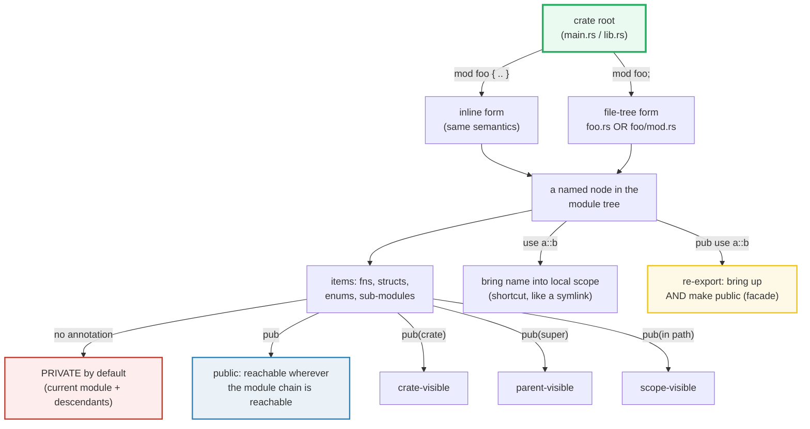

# MODULES — Packages, Crates, Modules, Paths, and Visibility

> **One-line goal:** as code grows it needs ORGANIZATION. Rust's **module
> system** controls **namespaces** and **visibility** — and every resolution is
> done **statically at compile time**, with **zero runtime cost** (no symbol
> table, no dynamic lookup, no import at runtime).
>
> **Run:** `just run modules` (== `cargo run --bin modules`)
> **Member:** `core` (stdlib-only — no `[dependencies]`).
> **Prerequisites:** 🔗 [OWNERSHIP](./OWNERSHIP.md) (modules are how you *scope*
> ownership), 🔗 [STRUCTS_ENUMS](./STRUCTS_ENUMS.md) (struct-field vs
> enum-variant visibility).
> **Ground truth:** [`modules.rs`](./modules.rs); captured stdout:
> [`modules_output.txt`](./modules_output.txt).

---

## Why this exists (lineage)

A 20-line program fits in one file. A 20 000-line program does not. Every
language answers the same two questions, and Rust's answers are unusually strict:

| Question | Go / Python | Rust |
|---|---|---|
| **Where does a name live?** (namespacing) | package / `__init__.py` / `import` | **module tree** rooted at the crate; `mod` inserts a named node |
| **Who may use it?** (visibility) | convention (uppercase = "exported") or `__all` | **checked by the compiler**; `pub` / `pub(crate)` / `pub(super)` / `pub(in path)`; everything else is **private** |
| **Cost at runtime** | Python resolves `import` at runtime | **none** — name resolution is a *compile-time* pass; a fully-qualified path lowers to a direct call |

Rust's bet: **hide implementation by default, expose only what you mark, and let
the compiler prove every path is legal.** The result is that refactoring a
module's internals can never silently break an external caller — if you forgot
to `pub` something, the compiler says so at build time (`E0603`), not in
production.



This bundle demonstrates every shape above **runnable** in one file via inline
`mod foo { .. }` blocks (which are real modules). The cross-file form (`mod foo;`
loading `foo.rs`) cannot run inside a single `[[bin]]`, so it is **documented**
in Section F with a concrete directory tree.

---

## The two ways to define a module

```rust
// (1) INLINE — a body in braces. Used throughout this file.
mod foo {
    pub fn bar() {}
}

// (2) FILE-TREE — no body; pulls foo's contents from a FILE. See Section F.
//     mod foo;     //  -> foo.rs  (edition 2018+)  OR  foo/mod.rs
```

Both forms insert an **identically-named node** into the crate's module tree.
The Rust Reference fixes the semantics: "A *module item* is a module, surrounded
in braces, named, and prefixed with the keyword `mod`. A module item introduces
a new, named module into the tree of modules making up a crate. Modules can nest
arbitrarily." ([Reference — Modules][ref-modules]).

---

## Section A — Inline `mod`: private by default; `pub` exposes

```rust
mod inner {
    fn private_greet() -> &'static str { "(inner secret)" }   // PRIVATE
    pub fn public_greet() -> &'static str { "hello from inner::public" }
    pub fn leak_via_sibling() -> &'static str { private_greet() } // descendant
}
```

> **From modules.rs Section A:**
> ```
> ======================================================================
> SECTION A — inline `mod`: items PRIVATE by default; `pub` exposes
> ======================================================================
>   mod inner {
>       fn private_greet() -> "(inner secret)"   // private: only inner + descendants
>       pub fn public_greet() -> "hello from inner::public"
>       pub fn leak_via_sibling() -> private_greet()   // descendant reaches private
>   }
>   inner::public_greet() -> "hello from inner::public"
>   inner::leak_via_sibling() -> "(inner secret)"  (sibling inside inner calls the private fn)
> [check] inner::public_greet() callable from the crate root (parent of inner): OK
> [check] a sibling inside `inner` CAN call the private fn (privacy = outside-only): OK
> ```

**What.** `inner::public_greet()` is callable from the crate root (the parent of
`inner`); `inner::private_greet()` is **not** — but a *sibling* function inside
`inner` (`leak_via_sibling`) calls it freely and returns its result.

**Why (internals).** The Rust Reference pins the two privacy rules
([Reference — Visibility][ref-visibility]):

1. **A public item** can be accessed from some module `m` if you can access all
   its **ancestor modules** from `m`. (So `pub` on an item inside a *private*
   module is reachable from the parent/descendants but not from outside — see
   Section B.)
2. **A private item** may be accessed by **the current module and its
   descendants**.

Rule 2 is the load-bearing one: privacy is **outside-only**. The Book's metaphor:
"items in child modules can use the items in their ancestor modules … think of
the privacy rules as being like the back office of a restaurant: What goes on in
there is private to restaurant customers, but office managers can see and do
everything in the restaurant they operate" ([Book ch7.3][book-paths]). That is
why `leak_via_sibling` reaches the private fn — it lives *inside* `inner`.

**The compile error** (calling the private fn from the crate root) is **E0603**
for a free function or **E0624** for a method/associated function:

```console
error[E0603]: function `private_greet` is private
 --> src/main.rs:9:13
  |
9 |     inner::private_greet();
  |             ^^^^^^^^^^^^^ private function
  |
note: the function `private_greet` is defined here
 --> src/main.rs:3:5
  |
3 |     fn private_greet() -> &'static str { "(inner secret)" }
  |     ^^^^^^^^^^^^^^^^^
```

> **`pub` on a module does NOT `pub` its contents.** Marking `pub mod hosting`
> lets ancestors *name* the module, but its items are still private until each
> is individually marked `pub` (the Book walks this exact two-step in Listing
> 7-5 → 7-7, [ch7.3][book-paths]). There is no recursive `pub`.

---

## Section B — The visibility ladder: `pub` / `pub(crate)` / `pub(super)` / `pub(in path)` / private

```rust
mod outer {
    pub mod vis {
        pub          fn pub_anywhere() -> u32 { 1 }
        pub(crate)   fn pub_crate()   -> u32 { 2 }
        pub(super)   fn pub_parent()  -> u32 { 3 }       // super of vis = outer
        pub(in crate::outer) fn pub_scope() -> u32 { 4 } // restricted to outer subtree
                       fn private_fn()  -> u32 { 5 }
    }
    pub fn call_from_parent() -> [u32; 4] { /* calls all four reachable items */ }
}
```

> **From modules.rs Section B:**
> ```
> ======================================================================
> SECTION B — visibility ladder: pub / pub(crate) / pub(super) / pub(in path) / private
> ======================================================================
>   mod outer { pub mod vis {
>       pub          fn pub_anywhere() -> 1;   // visible everywhere reachable
>       pub(crate)   fn pub_crate()   -> 2;   // visible in this whole crate
>       pub(super)   fn pub_parent()  -> 3;   // visible to `outer` (the parent)
>       pub(in crate::outer) fn pub_scope() -> 4;  // visible in the `outer` subtree
>                      fn private_fn()  -> 5;   // visible only inside `vis`
>   } }
> 
>   crate-root calls outer::vis::pub_anywhere() -> 1
>   crate-root calls outer::vis::pub_crate()   -> 2  (crate root is in the crate)
>   vis::call_all_from_inside() -> [1, 2, 3, 4, 5]  (a module sees ALL its own items)
>   outer::call_from_parent()   -> [1, 2, 3, 4]  (parent reaches pub(super) + pub(in outer))
> [check] pub: outer::vis::pub_anywhere() == 1 from the crate root: OK
> [check] pub(crate): outer::vis::pub_crate() == 2 from the crate root: OK
> [check] from inside `vis`, all 5 items are callable: [1,2,3,4,5]: OK
> [check] from `outer` (parent), pub+pub(crate)+pub(super)+pub(in outer) reachable: [1,2,3,4]: OK
> ```

**What.** Five items, five visibilities, one nested module tree. The output
proves exactly **who can call what**:

| Caller site | `pub` | `pub(crate)` | `pub(super)` | `pub(in crate::outer)` | private |
|---|:---:|:---:|:---:|:---:|:---:|
| **inside `vis`** | ✅ | ✅ | ✅ | ✅ | ✅ |
| **`outer` (the parent)** | ✅ | ✅ | ✅ | ✅ | ❌ |
| **crate root** (sibling of `outer`) | ✅ | ✅ | ❌ | ❌ | ❌ |
| **external crate** | ✅ (if ancestors reachable) | ❌ | ❌ | ❌ | ❌ |

**Why (internals).** The Rust Reference fixes the grammar and meaning
([Reference — `pub(in path)`, `pub(crate)`, `pub(super)`, `pub(self)`][ref-visibility]):

- **`pub`** — "can be thought of as being accessible to the outside world", *if*
  every ancestor module is also reachable.
- **`pub(crate)`** — "visible within the current crate." The workhorse for
  internal APIs that should not leak to dependents (most of a typical library).
- **`pub(super)`** — "visible to the parent module. This is equivalent to
  `pub(in super)`." Useful when a submodule is an implementation detail of its
  parent and should move with it.
- **`pub(in path)`** — "visible within the provided `path`. `path` must be a
  simple path which resolves to an **ancestor module**." Edition 2018+ requires
  the path to start with `crate`, `self`, or `super`.
- **`pub(self)`** — "visible to the current module. Equivalent to … not using
  `pub` at all" — i.e. private.

> **The two "free" public-by-default cases.** The Reference calls out exactly
> two situations where items are public *without* a `pub` annotation:
> "Associated items in a `pub` Trait are public by default; **Enum variants in a
> `pub` enum are also public by default**" ([Reference][ref-visibility]). That is
> why `pub enum Appetizer { Soup, Salad }` exposes both variants with no per-
> variant `pub`, while `pub struct` keeps its fields private unless each is
> annotated. 🔗 [STRUCTS_ENUMS](./STRUCTS_ENUMS.md).

**The compile error** for reaching a `pub(super)` / `pub(in path)` / private item
from outside its scope is the same **`E0603`** as Section A:

```console
error[E0603]: function `pub_parent` is private
 --> src/main.rs:5:25
  |
5 |     outer::vis::pub_parent();
  |                         ^^^^^^^^^^^ private function
```

---

## Section C — `use`: single, grouped, alias (and the function-vs-type idiom)

```rust
use warehouse::ship;              // single
use warehouse::{audit, stock};    // grouped (shared prefix, one use)
use warehouse::Parcel as Box;     // alias -> local name `Box`
```

> **From modules.rs Section C:**
> ```
> ======================================================================
> SECTION C — `use`: single / grouped / alias  (idiom: module for fns, full path for types)
> ======================================================================
>   use warehouse::ship;                  // single
>   use warehouse::{audit, stock};         // grouped (shared prefix)
>   use warehouse::Parcel as Box;         // alias -> local name `Box`
>   ship()="shipped", stock()="stocked", audit()="audited", Parcel{id:1} via `Box`
> [check] use warehouse::ship; brings ship() into scope: OK
> [check] use warehouse::{audit, stock}; groups imports (both callable): OK
> [check] use warehouse::Parcel as Box; aliases the struct (Box.id == 1): OK
> ```

**What.** Three `use` shapes, all callable with no `warehouse::` prefix: a single
import, a grouped import (one shared prefix, several tails), and an alias
(`as Box` rebinds the local name).

**Why (internals).**
- **`use` is a scope-local shortcut, like a filesystem symlink** — the Book:
  "Adding `use` and a path in a scope is similar to creating a symbolic link in
  the filesystem. By adding `use crate::front_of_house::hosting` … `hosting` is
  now a valid name in that scope" ([Book ch7.4][book-use]). It does **not** move,
  copy, or re-export — and it checks privacy exactly like a spelled-out path.
- **It is scoped.** A `use` in module `A` is **not** visible in `A`'s child `B`;
  `B` must write its own `use` (Book Listing 7-12, [ch7.4][book-use]).
- **The function-vs-type idiom** ([Book ch7.4][book-use]):
  - For **functions**, bring the **parent module** in and call `module::fn()` —
    it signals "not locally defined" while staying short. (`use warehouse;` then
    `warehouse::ship()`.)
  - For **structs/enums/traits**, bring the **full path** to the type —
    `use std::collections::HashMap;` then `HashMap::new()`.
- **Grouped + `self`.** Two shared-prefix imports merge with braces, and `self`
  pulls in the prefix itself: `use std::io::{self, Write};` brings both `io` and
  `Write`.
- **Glob `use foo::*;`** imports every *public* item — powerful but "can make it
  harder to tell what names are in scope" ([Book ch7.4][book-use]); reserve it
  for preludes and `#[cfg(test)]` test modules.

> **Name clash?** Two same-named imports are illegal in one scope. Either import
> the **parent modules** (`use std::fmt; use std::io;` then `fmt::Result` /
> `io::Result`), or rename one with **`as`** (`use std::io::Result as IoResult;`).
> Both are idiomatic ([Book ch7.4][book-use]). 🔗 [TRAITS_BASICS](./TRAITS_BASICS.md)
> — bringing a trait into scope with `use` is what makes its methods callable.

---

## Section D — Path keywords: `self::` / `super::` / `crate::` (relative vs absolute)

```rust
// crate root:        fn crate_root_helper() { .. }
mod network {
    pub fn net_fn() { .. }
    pub mod server {
        fn handler() { .. }
        pub fn via_self()        -> self::handler();                   // current module
        pub fn via_super()       -> super::net_fn();                   // parent = network
        pub fn via_super_super() -> super::super::crate_root_helper(); // 2 levels up
        pub fn via_crate()       -> crate::crate_root_helper();        // ABSOLUTE
    }
}
```

> **From modules.rs Section D:**
> ```
> ======================================================================
> SECTION D — path keywords: self:: / super:: / crate::  (relative vs absolute)
> ======================================================================
>   fn crate_root_helper() -> "crate_root_helper"   // lives at the CRATE ROOT
>   mod network { pub fn net_fn(){...}
>       pub mod server { fn handler(){...}
>           pub fn via_self()       -> self::handler();
>           pub fn via_super()      -> super::net_fn();
>           pub fn via_super_super()-> super::super::crate_root_helper();
>           pub fn via_crate()      -> crate::crate_root_helper();
>   } }
>   network::server::via_self()        -> "server::handler"  (self = current module)
>   network::server::via_super()       -> "network::net_fn"  (super = parent = network)
>   network::server::via_super_super() -> "crate_root_helper"  (super::super = crate root)
>   network::server::via_crate()       -> "crate_root_helper"  (crate:: = absolute from root)
> [check] self::handler() reaches a sibling in the SAME module: OK
> [check] super::net_fn() reaches an item in the PARENT module: OK
> [check] crate::crate_root_helper() is an ABSOLUTE path to the crate root: OK
> [check] super::super:: reaches TWO levels up (also the crate root): OK
> ```

**What.** From deep inside `network::server`, four path keywords reach four
different targets — and `super::super::` and `crate::` happen to land on the
*same* item (the crate root is two levels up).

**Why (internals).** The Book fixes the two path families ([Book ch7.3][book-paths]):

- **Absolute** — starts at the crate root: `crate::a::b` (for the current crate)
  or `<crate-name>::a::b` (for an external crate, e.g. `std::collections::HashMap`).
  Like starting a shell path with `/`.
- **Relative** — starts at the current module: `self::`, `super::`, or a bare
  identifier. Like a path with no leading `/`.

| Keyword | Means | FS analogue |
|---|---|---|
| `crate::` | the crate root | `/` |
| `self::` | the current module | `.` |
| `super::` | the parent module | `..` |

> **When to use which?** The Book's guidance ([ch7.3][book-paths]): "our
> preference in general is to specify **absolute paths** because it's more likely
> we'll want to move code definitions and item calls independently." Use
> `super::` when a submodule is **coupled** to its parent and the two will move
> together — Listing 7-8's `fix_incorrect_order` calling `super::deliver_order`.

---

## Section E — `pub use` re-export: the facade pattern

```rust
mod base  { pub fn x() -> &'static str { "base::x" } }   // private module
mod other { pub fn z() -> &'static str { "other::z" } }  // private module

pub use base::x;                 // lift x() up to HERE, and make it public
pub use other::z as facade_z;    // lift + rename under a clean public name
```

> **From modules.rs Section E:**
> ```
> ======================================================================
> SECTION E — `pub use` re-export: bring an item up AND make it public (facade)
> ======================================================================
>   mod base  { pub fn x() -> "base::x" }    // private module
>   mod other { pub fn z() -> "other::z" }    // private module
>   pub use base::x;                 // re-export: x() now public FROM HERE
>   pub use other::z as facade_z;    // re-export + alias under a clean name
>   x()         -> "base::x"  (called directly; no base:: prefix)
>   facade_z()  -> "other::z"  (re-exported with an alias)
> [check] pub use base::x; -> x() callable at the re-export site: OK
> [check] pub use other::z as facade_z; -> callable under the alias: OK
> ```

**What.** `x()` and `facade_z()` are callable with **no** `base::` / `other::`
prefix — the private modules are hidden, and selected items surface at the
re-export site under (optionally) a cleaner name.

**Why (internals).** `use` alone is **private to its scope**; `pub use` makes the
shortcut itself public. The Reference ([Re-exporting and visibility][ref-visibility]):
"Rust allows publicly re-exporting items through a `pub use` directive … It
essentially allows public access into the re-exported item … any external crate
referencing `implementation::api::f` would receive a privacy violation, while the
path `api::f` would be allowed." The Book calls this the **facade** pattern
([ch7.4][book-use]): "Re-exporting is useful when the **internal structure of
your code is different from how programmers calling your code would think about
the domain**." You write one tree, expose another.

> **Real-world facades.** `tokio` re-exports `tokio::sync::Mutex` from a deeply
> nested source; `std::io::Error` is re-exported across modules. The Book returns
> to this in [ch14.2 "Exporting a Convenient Public API"][book-use] — a flat
> public API hides a deep implementation tree.

---

## Section F — The file-tree mod system (multi-file crates)

A single `[[bin]]` cannot demonstrate cross-file modules, so this section
**documents** the form and uses `module_path!()` to prove the inline and
file-tree forms build the **same** module tree.

> **From modules.rs Section F (runnable half):**
> ```
> ======================================================================
> SECTION F — file-tree mod system + module_path!() (ties inline to multi-file form)
> ======================================================================
>   module_path!() inside `demo_path::nested` -> "modules::demo_path::nested"
> [check] module_path!() ends with "demo_path::nested" (nested mods form a path): OK
> ```

`module_path!()` expands to the **dotted path of the current module** —
`modules::demo_path::nested`. This is exactly the path that
`src/demo_path/nested.rs` would occupy in a multi-file crate. The inline `mod
demo_path { pub mod nested { .. } }` and the file-tree `mod demo_path; mod
nested;` are **indistinguishable** once compiled.

> **From modules.rs Section F (documented half — the directory tree):**
> ```
>   In a MULTI-FILE crate, `mod foo;` (NO body) loads foo's items from a FILE:
> 
>     src/
>     +- main.rs            // crate root:  `mod network;`
>     +- network.rs         // edition 2018+ PREFERRED form  (== network/mod.rs)
>     |   +-- declares `pub mod server;`
>     +- network/
>         +- server.rs      // item lives at crate::network::server::*
> 
>     // src/main.rs  (crate root):
>     mod network;              // -> loads network.rs  (OR network/mod.rs)
> 
>     // src/network.rs:
>     pub mod server;           // -> loads network/server.rs
>     pub fn connect() {}        // crate::network::connect
> 
>     // src/network/server.rs:
>     pub fn listen() {}        // crate::network::server::listen
> 
>   Rust Reference rules (items/modules -> Module source filenames):
>     - `mod foo;` loads from foo.rs  OR  foo/mod.rs  -- NOT both (hard error).
>     - rustc >= 1.30 (edition 2018+): prefer foo.rs over foo/mod.rs.
>     - `#[path = "alt.rs"] mod foo;` overrides the filename.
>     - E0432: unresolved import / module file not found on disk.
>     - The INLINE `mod foo { .. }` used in Sections A-E and the
>       file-tree `mod foo;` form build the SAME module tree.
> ```

**Why (internals).** The Reference's "Module source filenames" table
([Reference — Modules][ref-modules]) fixes the resolution: an ancestor module
path component is a **directory**, and the module's contents live in a file named
`<module>.rs`. So `crate::util::config` corresponds to `util/config.rs` (when
`util` is declared as `mod util;` in `lib.rs`). Crucially:

- **`foo.rs` OR `foo/mod.rs` — not both.** Having both is a hard error.
- **Edition 2018+ prefers `foo.rs`.** The Reference: "Prior to `rustc` 1.30, using
  `mod.rs` files was the way to load a module with nested children. It is
  encouraged to use the new naming convention as it is more consistent, and
  avoids having many files named `mod.rs` within a project."
- **`#[path = "..."]`** overrides the filename entirely (used by `include!`-based
  layouts and some proc-macro crates).
- **The crate root** is `src/lib.rs` (library) or `src/main.rs` (binary). A
  package may have **both**; the Book's best practice ([ch7.3][book-paths]) is to
  put the module tree in `lib.rs` and have `main.rs` be a thin client of the
  library — "the binary crate becomes a user of the library crate just like a
  completely external crate."

> **This very workspace** is the multi-file story at scale: `rust/Cargo.toml`
> declares `[workspace] members = [ "core", "serde", "async", "web", "db", ... ]`,
> each member is a crate, and each `[[bin]]` is a single-file crate root. See
> [`HOW_TO_RESEARCH.md`](../HOW_TO_RESEARCH.md) §1 for the layout.

**The compile error** for a missing module file is **E0432**:

```console
error[E0432]: unresolved import `crate::network`
 --> src/main.rs:1:5
  |
1 | mod network;
  |     ^^^^^^^ no `network` module or file found on disk
  |
  = help: create a file `src/network.rs` or `src/network/mod.rs`
```

---

## Pitfalls (the expert payoff)

| Trap | Symptom | Fix / why |
|---|---|---|
| **`pub mod` doesn't `pub` contents** | `E0603: function \`x\` is private` despite `pub mod` | Mark **each** item `pub` individually; there is no recursive `pub`. (Book Listing 7-5 → 7-7.) |
| **`pub` in a private module** | `pub fn` unreachable from outside | The whole ancestor chain must be reachable. Use `pub(crate)` for internal APIs, or `pub use` to lift the item out (Section E). |
| **`use` is not inherited by child modules** | `E0433: unresolved module \`hosting\`` in a child | A `use` in `A` is invisible to `A::b`. Repeat the `use` in `b`, or call via `super::hosting`. (Book Listing 7-12.) |
| **Confusing `pub(super)` with `pub(crate)`** | `E0603` from a sibling of the parent | `pub(super)` = the **parent only** (+ its descendants); `pub(crate)` = the whole crate. Nest deeper (Section B) to see the difference. |
| **Two same-named imports** | `E0252: the name \`Result\` is defined multiple times` | Import the **parent modules** (`use std::fmt; use std::io;`) or `as`-rename one (`use std::io::Result as IoResult;`). |
| **Expecting `use` to re-export** | External crate can't see your `use`d name | `use` is private to its scope. To expose it, write **`pub use`** (Section E). |
| **`pub struct` with private fields** | `E0451: field \`x\` of struct \`S\` is private` at construction | A `pub struct`'s fields stay private unless each is `pub`. (Contrast: `pub enum` variants are ALL public.) 🔗 [STRUCTS_ENUMS](./STRUCTS_ENUMS.md) |
| **Both `foo.rs` and `foo/mod.rs`** | `E0761: file for module \`foo\` found at both` | Delete one. Edition 2018+ wants `foo.rs`. |
| **Wrong file location for nested mod** | `E0432: unresolved import` | A `mod server;` inside `network.rs` loads `network/server.rs`, **not** `src/server.rs`. (Reference path-mirroring rule.) |
| **`mod.rs` everywhere** | Clutter; many files named `mod.rs` | Prefer the `foo.rs` + `foo/` directory form (rustc ≥ 1.30, edition 2018+). |
| **Relative path breaks on move** | Refactor of one fn breaks a sibling's `super::` call | Use **absolute** `crate::` paths when the call site and definition move independently (Book ch7.3). |
| **Glob `use foo::*`** | "Where did this name come from?" | Reserve for preludes and `#[cfg(test)]` test modules; it also breaks silently if the source adds a clashing name (Book ch7.4). |

---

## Cheat sheet

```rust
// ── DEFINE a module ──────────────────────────────────────────────────────
mod foo { /* inline body, real module */ }   // inline form
// mod foo;                                   // file-tree form: foo.rs OR foo/mod.rs

// ── VISIBILITY (everything else is PRIVATE) ─────────────────────────────
//   private            -> current module + descendants (default)
pub fn a() {}            // reachable wherever the module chain is reachable
pub(crate) fn b() {}     // whole crate (the workhorse for internal APIs)
pub(super) fn c() {}     // the parent module only   (== pub(in super))
pub(in crate::outer) fn d() {}  // restricted to an ancestor subtree
//   pub(self) == private.  pub enum variants are ALL public by default.

// ── PATHS ───────────────────────────────────────────────────────────────
crate::a::b              // ABSOLUTE  (from crate root)         like /a/b
self::sibling            // current module                      like ./sibling
super::parent_item       // parent module                       like ../item

// ── `use` (scope-local shortcut; checks privacy; NOT inherited by children)
use foo::bar;            // single
use foo::{baz, qux};     // grouped (shared prefix)
use foo::Bar as Local;   // alias
use std::io::{self, Write};  // self pulls in the prefix itself
use foo::*;              // glob (prefer only for preludes / tests)

// ── RE-EXPORT (facade: bring up AND make public) ────────────────────────
pub use foo::Bar;            // Bar now public FROM HERE
pub use foo::Bar as Facade;  // lift + rename under a clean public name

// IDIOM: functions -> bring the parent MODULE in (`use foo;` -> `foo::f()`);
//        structs/enums/traits -> bring the FULL path (`use foo::Bar;`).
```

---

## Sources

Every claim above was web-verified in at least two authoritative places.

- **The Rust Programming Language, ch7 "Managing Growing Projects with Packages,
  Crates, and Modules"** — packages/crates/modules definitions, the module
  system overview:
  https://doc.rust-lang.org/book/ch07-00-managing-growing-projects-with-packages-crates-and-modules.html
- **The Rust Book ch7.3 "Paths for Referring to an Item in the Module Tree"** —
  absolute vs relative paths, `crate::` / `self::` / `super::`, the two privacy
  rules, `pub` on modules vs items, `pub struct` fields vs `pub enum` variants,
  E0603, the binary+library best practice:
  https://doc.rust-lang.org/book/ch07-03-paths-for-referring-to-an-item-in-the-module-tree.html
- **The Rust Book ch7.4 "Bringing Paths into Scope with the `use` Keyword"** —
  single/grouped/glob/alias `use`, the symlink analogy, scope-locality (not
  inherited by children), the function-vs-type idiom, `pub use` re-export /
  facade pattern, E0433:
  https://doc.rust-lang.org/book/ch07-04-bringing-paths-into-scope-with-the-use-keyword.html
- **The Rust Reference — Modules** (`§items/modules`): module item definition,
  "modules can nest arbitrarily", **Module source filenames** (`mod foo;` →
  `foo.rs` OR `foo/mod.rs`, not both; rustc 1.30 / edition 2018+ preference; the
  `#[path]` attribute; the path-mirroring table):
  https://doc.rust-lang.org/reference/items/modules.html
- **The Rust Reference — Visibility and privacy** (`§visibility-and-privacy`):
  the grammar `pub | pub(crate) | pub(self) | pub(super) | pub(in path)`, the two
  privacy rules (public reachable-through-ancestors; private = current module +
  descendants), the two public-by-default exceptions (`pub` trait items, `pub`
  enum variants), `pub use` re-export semantics:
  https://doc.rust-lang.org/reference/visibility-and-privacy.html
- **`std::module_path!` docs** — expands to the dotted module path of the current
  location, used in Section F to tie inline mods to the file-tree form:
  https://doc.rust-lang.org/std/macro.module_path.html
- **The Rust Reference — Crates and source files** (`§crates-and-source-files`) —
  the crate root (`lib.rs` / `main.rs`) and how `mod` declares submodules:
  https://doc.rust-lang.org/reference/crates-and-source-files.html
