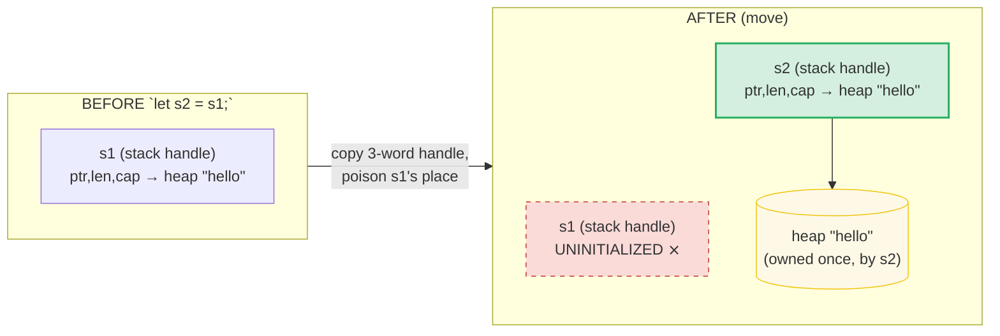
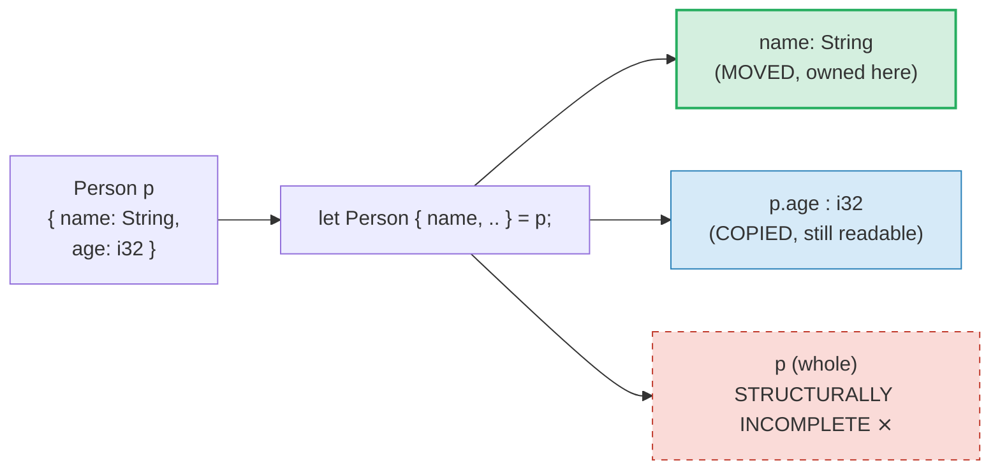
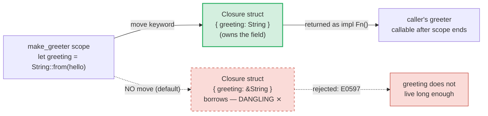
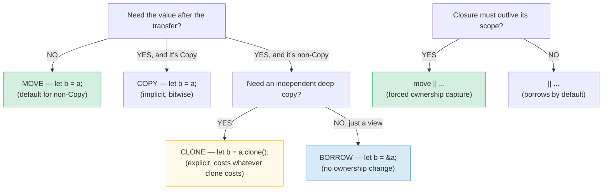

# MOVE_SEMANTICS — The Shapes a Move Can Take

> **Goal (one line):** master every form a *move* takes — on assignment, into a
> function, as a *partial* move out of a struct, and inside a `move ||` closure —
> and learn how a moved binding can be re-initialized, plus where move, copy, and
> clone diverge.
>
> **Run:** `just run move_semantics`  (= `cargo run --bin move_semantics`)
>
> **Member:** `core` (stdlib-only).
>
> **Prerequisites:** read [OWNERSHIP](./OWNERSHIP.md) first — it defines the
> move and the single-owner rule this bundle drills into.

---

## Lineage — why this bundle exists

[OWNERSHIP](./OWNERSHIP.md) (P1.1) introduced the move: *assignment of a
non-`Copy` value transfers ownership and invalidates the source.* That is the
whole rule, but it hides a lot of surface area. A move is not one syntax — it is
a **family** of operations that all share one mechanism (transfer ownership of a
place) yet show up in five different shapes:

1. **On assignment** — `let s2 = s1;`
2. **Into a function** — `fn take(v: Vec<i32>) { ... }`
3. **As a partial move out of a struct** — `let Person { name, .. } = p;`
4. **Inside a `move ||` closure** — forced ownership capture
5. **Followed by re-initialization** — reusing a moved binding's storage slot

This bundle walks each shape with a runnable example, then contrasts move with
the two *non-moving* alternatives (`Copy` implicit, `Clone` explicit). The
payoff is the **pitfalls table** — the places working engineers actually trip.

---

## The mental model — "transfer of a place, not of bytes"

A move is a compile-time *rebinding of ownership*, not a runtime copy of data.
For a heap-owning type like `String`, the on-stack *handle* (pointer, length,
capacity — three words) is bitwise-copied into the destination, and the **source
place is marked uninitialized**. No heap allocation happens, no bytes on the heap
move. The borrow checker simply refuses any later read of the source place. At
the end of the destination's scope, its `Drop` runs once and frees the heap
buffer — exactly once, which is the entire reason moves exist (double-free is
impossible by construction).



Two consequences fall out of this model and are the source of every gotcha in
this guide:

- **The source is *uninitialized*, not zeroed or nulled.** It is a hole the type
  system refuses to read until you fill it again (re-initialization, §E).
- **Moving is shallow for the handle but exclusive for the resource.** A
  `String`'s three-word handle is copied; the heap buffer is *not* — it now has
  exactly one owner.

---

## Section A — Move on assignment (recap)

```rust
let mut s1 = String::from("hello");
let s2 = s1;                  // MOVE: s1 is now uninitialized
s1 = String::from("world");   // re-initialize the SAME slot
```

> From `move_semantics.rs` Section A:
> ```
> after `let s2 = s1;`:
>   s2 = "hello"   (owns the heap buffer now)
>   s1           -> uninitialized; reading it is a compile error
> after `s1 = String::from("world");`:
>   s1 = "world"   (a fresh value in the reused slot)
> [check] moved String travelled to s2; s2 == "hello": OK
> [check] re-initialized binding holds the NEW value; s1 == "world": OK
> ```

**What this proves.** The move transferred `"hello"` to `s2`; `s1`'s slot was
reusable, and assigning a *new* `String` to it (note the required `mut`) filled
it with `"world"`. The re-assignment is **not** "un-moving" `"hello"` — that
value still lives in `s2` and is unaffected.

Reading `s1` between the move and the re-init is rejected at compile time. The
exact message (documented, not run):

> ```
> error[E0382]: borrow of moved value: `s1`
>  --> src/main.rs:X:Y
>   |
> 2 | let s1 = String::from("hello");
>   |     -- move occurs because `s1` has type `String`,
>   |        which does not implement the `Copy` trait
> 3 | let s2 = s1;
>   |          -- value moved here
> 4 | println!("{}", s1);
>   |                ^^ value borrowed here after move
> ```

---

## Section B — Move into a function

A function that takes a non-`Copy` type **by value** moves the argument in; the
caller's binding is unusable afterwards. Borrowing (`&T` / `&mut T`) is the
no-move alternative.

```rust
fn take_vec(v: Vec<i32>) -> usize { v.len() }       // moves the Vec
fn borrow_sum(slice: &[i32]) -> i32 { slice.iter().sum() }  // borrows a view
```

> From `move_semantics.rs` Section B:
> ```
> take_vec(vec![1,2,3,4]) returned len = 4
>   v is now uninitialized in the caller
> [check] moved Vec had 4 elements: OK
> DOCUMENTED (not run): `println!("{:?}", v);` after the call yields:
>   error[E0382]: borrow of moved value: `v`
>    move occurs because `v` has type `Vec<i32>`,
>    which does not implement the `Copy` trait
>
> alternative: borrow_sum(&v2) keeps v2 usable
>   sum = 60; v2.len() = 3 (still owned)
> [check] borrow keeps caller usable; sum == 60 and v2.len() == 3: OK
> ```

**Why the rule is the same.** Passing `v` to `take_vec` is desugared to the same
ownership transfer as `let v2 = v;` — the callee's parameter *is* a fresh
binding initialized by move. The function's drop scope owns the value while it
runs and drops it on return. Taking `&[i32]` instead sidesteps the move entirely:
the slice is a fat pointer (pointer + length) that *borrows* the Vec's buffer; no
ownership changes hands, so the caller keeps `v2`.

> 🔗 See [BORROWING](./BORROWING.md) for the full `&T`/`&mut T` permission model
> and why the borrow checker is what makes the move-vs-borrow choice safe.

---

## Section C — Partial move out of a struct

Destructuring a struct can move **individual fields** out. Non-`Copy` fields
move; `Copy` fields copy. The remaining fields stay usable **individually**, but
the **whole struct** becomes unusable (it is structurally incomplete).

```rust
struct Person { name: String, age: i32 }
let p = Person { name: String::from("Ada"), age: 36 };
let Person { name, .. } = p;   // moves `name` (String); copies nothing else
// p.age   -> still readable (i32 is Copy, not moved)
// p.name  -> ERROR: moved
// p       -> ERROR: partially moved
```

> From `move_semantics.rs` Section C:
> ```
> after `let Person { name, .. } = p;`:
>   name    = "Ada"   (moved OUT of p; this binding owns it)
>   p.age   = 36       (still readable: i32 is Copy and was not moved)
> [check] String field moved out; name == "Ada": OK
> [check] Copy field still readable after partial move; p.age == 36: OK
> DOCUMENTED (not run): using the WHOLE `p` (e.g. `let q = p;`) yields:
>   error[E0382]: use of partially moved value: `p`
>    value used here after partial move
>    partial move occurs because `p.name` has type `String`,
>    which does not implement the `Copy` trait
> DOCUMENTED (not run): using `p.name` again yields:
>   error[E0382]: borrow of moved value: `p.name`
> ```



**Why the whole struct is poisoned.** A `String` field is non-`Copy`; once it
leaves, the struct no longer holds a valid value of its declared type. Rust
refuses to use `p` as a whole (pass it, return it, `drop` it) because that would
require every field to be present. The remaining *individual* fields are fine on
their own — `p.age` is a fresh `i32` (copied), and the borrow checker tracks each
field's initialization state independently. This **field-level move tracking**
is what lets destructuring be expressive without leaks.

**The drop-order subtlety.** When a partially-moved struct goes out of scope, the
[Rust Reference (destructors)](https://doc.rust-lang.org/reference/destructors.html)
guarantees: *"If a variable has been partially initialized, only its initialized
fields are dropped."* So `p` at end of scope drops `age` (a no-op for `i32`) and
silently skips the already-moved `name` — exactly once, no double-free.

---

## Section D — `move ||` closure

`move` **in front of a closure** forces it to take **ownership** of every
captured variable, instead of the default (borrow by reference). This is required
whenever the closure must outlive the capturing scope: returning it from a
function, or handing it to `thread::spawn`.

```rust
fn make_greeter() -> impl Fn() -> String {
    let greeting = String::from("hello");
    move || greeting.clone()   // owns greeting; outlives this frame
}
```

> From `move_semantics.rs` Section D:
> ```
> returned closure outlives its capturing scope:
>   greeter() call #1 = "hello"
>   greeter() call #2 = "hello"
> [check] move closure outlives the capturing scope; call #1 == "hello": OK
> [check] move closure is Fn, callable repeatedly; call #2 == "hello": OK
>
> in-scope: `let owns = move || data.len();` -> owns() = 7
> [check] move closure owns data; len == 7: OK
> DOCUMENTED (not run): returning `|| data.len()` (NO `move`) yields:
>   error[E0597]: `data` does not live long enough
>    value captured here
>    borrowed value does not live long enough
>    `data` dropped here while still borrowed
> ```



**How a closure becomes a struct.** A closure is syntactic sugar for an anonymous
struct whose fields are the captured variables, plus an `impl Fn`/`FnMut`/`FnOnce`
that reads those fields. The default capture mode (since Rust 2018, refined by
disjoint-capture in 2021) picks the *least* privilege needed: `&T`, then `&mut T`,
then by-value only when the body consumes the variable. `move` overrides that
analysis and captures **everything by ownership** (copying `Copy` captures,
moving the rest) — so the closure struct is self-contained and `'static`-able.

**Why `Fn`, not `FnOnce`, here.** The body `greeting.clone()` only *borrows* the
captured field (it does not consume it), so the closure implements `Fn` and is
callable many times. If the body had been `greeting` (returning the owned
`String`), it would consume the captured field and the closure would degrade to
`FnOnce` — callable exactly once.

> 🔗 See [CLOSURES](./CLOSURES.md) (P3) for the `Fn`/`FnMut`/`FnOnce` trait
> hierarchy and the capture-mode desugaring; and [THREADS](./THREADS.md) (P4) for
> `thread::spawn`, which *requires* `move` because the spawned thread must own
> its captured data (`'static` + `Send`).

---

## Section E — Re-initialize after move

A moved binding is **not** destroyed — its storage slot is reusable. Assigning a
*new* value re-initializes it. This is **not** "un-moving" the old value (that
value is wherever it was moved to, unaffected).

```rust
let mut x = String::from("a");
let _y = x;                  // MOVE: x's slot is now a hole
x = String::from("b");       // fill the hole with a brand-new String
// x == "b", _y == "a"
```

> From `move_semantics.rs` Section E:
> ```
> after `_y = x; x = String::from("b");`:
>   x  = "b"   (re-initialized; the NEW value)
>   _y = "a"   (the OLD value travelled here)
> [check] re-initialized binding holds the NEW value; x == "b": OK
> [check] the OLD value travelled to _y; _y == "a": OK
> ```

**Why this works.** The borrow checker models each binding as a place that is
either *initialized* or *uninitialized* at every program point. A move flips the
place to uninitialized; an assignment flips it back. The `mut` is required
because re-assignment is a mutation of the binding. The old value (now in `_y`)
is completely independent — re-initializing `x` does not touch it.

This is the rule that makes patterns like *move-then-rebuild* cheap and natural:
drain a `Vec`, rebind it to `Vec::new()`; take a field out of a struct, then
assign a replacement to that field to make the struct whole again.

---

## Section F — Clone vs Move (summary)

| Operation | Syntax | Source after? | Cost | Triggered by |
|---|---|---|---|---|
| **Move** | `let m = s;` | unusable | copies the handle (cheap) | implicit — always, for non-`Copy` |
| **Copy** | `let c = s;` | still usable | bitwise copy of the value | implicit — only for `Copy` types |
| **Clone** | `let c = s.clone();` | still usable | whatever `.clone()` does | **explicit** — never inserted |

> From `move_semantics.rs` Section F:
> ```
> move:  `let moved = original;` -> moved = "seed"; original is gone
> [check] move transfers ownership; moved == "seed": OK
> clone: `let cloned = source.clone();` -> cloned = "seed"; source = "seed" (BOTH usable)
> [check] clone keeps source usable; source == "seed": OK
> [check] clone yields an equal independent value; cloned == "seed": OK
> ```

**The defining difference.** A move and a clone both leave you with a value in
the destination, but:

- **Move** transfers ownership of the *existing* resource — the source is
  poisoned. Free.
- **Clone** allocates a *new, independent* resource — the source stays usable.
  Costs whatever the type's `Clone` impl costs (a heap allocation + memcpy for
  `String`).
- **Copy** is "implicit clone for bitwise-copyable types" (`i32`, `f64`, `bool`,
  fixed-size arrays of `Copy`, raw pointers, ...). It is mutually exclusive with
  `Drop`: a type with a destructor can never be `Copy`.

> 🔗 See [COPY_CLONE](./COPY_CLONE.md) for the full `Copy`-XOR-`Drop` rule, the
> `#[derive(Clone, Copy)]` mechanics, and which stdlib types are `Copy`.

---

## Pitfalls — the expert payoff

| # | Trap | Symptom | Fix |
|---|---|---|---|
| 1 | **Using the whole struct after a partial move** | `error[E0382]: use of partially moved value: \`p\`` | Either use only the remaining individual fields, or borrow in the pattern: `let Person { ref name, .. } = p;` (keeps `p` whole). |
| 2 | **Using the moved field again** | `error[E0382]: borrow of moved value: \`p.name\`` | The field is gone; reach for `.clone()` before the move, or borrow it. |
| 3 | **Returning a non-`move` closure** | `error[E0597]: \`x\` does not live long enough` | Add `move` so the closure owns its captures and can outlive the frame. |
| 4 | **Forgetting `move` on `thread::spawn`** | `error[E0373]: closure may outlive the current function, but it borrows ...` | `thread::spawn(move || ...)`. The `'static` bound on the closure *requires* owned captures. |
| 5 | **Re-assigning a non-`mut` binding after a move** | `error[E0384]: cannot assign twice to immutable variable` | Declare it `let mut`. A move-out is fine on an immutable binding; re-filling it is not. |
| 6 | **`..rest` in struct update moves the non-`Copy` fields** | `let user2 = User { email: new, ..user1 };` — `user1` unusable even though you "only changed email" | One of `user1`'s `String` fields (e.g. `username`) was moved by `..user1`. Clone the moved fields, or accept the move. |
| 7 | **Expecting `.clone()` to be inserted automatically** | `error[E0382]: borrow of moved value` where you "just wanted a copy" | The compiler never inserts `Clone` silently — it only auto-copies `Copy` types. Write `.clone()` explicitly. |
| 8 | **`FnOnce` vs `Fn` surprise** | A closure that returns an owned captured value can be called only *once* | Returning the captured `String` (not a clone) consumes it → the closure is `FnOnce`. Use `.clone()` in the body to stay `Fn`. |
| 9 | **Partial-move drop order is per-field** | A moved field is *not* dropped again at the struct's end-of-scope | This is correct (no double-free). If you relied on a destructor side-effect, capture the field explicitly. |
| 10 | **Moving out of a `&` or `&mut`** | `error[E0507]: cannot move out of ... which is behind a shared reference` | You can't move through a borrow. Clone, or take the value by ownership. |

---

## Cheat sheet

```rust
// A — move on assign
let s2 = s1;            // s1 poisoned (non-Copy)

// B — move into a fn (caller poisoned) vs borrow
fn take(v: Vec<i32>) { /* owns v */ }
fn borrow(s: &[i32]) { /* views; caller keeps it */ }

// C — partial move out of a struct
let Person { name, .. } = p;   // name moved; p.age still readable; p (whole) NOT

// D — move closure (forced ownership capture; required for spawn / return)
let f = move || greeting.clone();

// E — re-initialize a moved binding (needs mut)
let mut x = String::from("a");
let _y = x;                     // x now a hole
x = String::from("b");          // x re-filled; _y unchanged

// F — move vs clone
let m = s;          // MOVE — s poisoned
let c = s.clone();  // CLONE — both usable (explicit; never auto-inserted)
```

**Decision tree:**



---

## Cross-references

- 🔗 [OWNERSHIP](./OWNERSHIP.md) — the move is *defined* here (single-owner
  rule, drop at end of scope). This bundle is its deeper drill-down.
- 🔗 [BORROWING](./BORROWING.md) — references (`&T`/`&mut T`) are how you *use*
  a value without moving it; the aliasing-XOR-mutability rule is what makes moves
  safe to skip.
- 🔗 [COPY_CLONE](./COPY_CLONE.md) — the `Copy` (implicit bitwise) vs `Clone`
  (explicit) split, and the `Copy`-XOR-`Drop` rule that decides which.
- 🔗 [LIFETIMES](./LIFETIMES.md) — the E0597 "does not live long enough" error
  in Section D is a *lifetime* failure of a borrowing closure; `move` is the
  ownership-side fix.
- 🔗 [CLOSURES](./CLOSURES.md) (P3) — `Fn`/`FnMut`/`FnOnce` capture modes and
  how `move` interacts with the trait hierarchy.
- 🔗 [THREADS](./THREADS.md) (P4) — `thread::spawn` *requires* `move` because the
  closure must be `'static` + `Send`.

---

## Sources

All error messages below were reproduced locally with `rustc 1.96.0` (edition
2024) and pasted verbatim; the semantics are anchored to the Rust Reference and
the Rust Book.

- **The Rust Reference — Destructors** (partial moves, drop of remaining fields):
  <https://doc.rust-lang.org/reference/destructors.html>
- **The Rust Book, ch4.1 — Variables and Data Interacting with Move**:
  <https://doc.rust-lang.org/book/ch04-01-what-is-ownership.html>
- **The Rust Book, ch5.1 — Ownership of Struct Data / Struct Update Syntax**
  (the `..user1` partial-move example): <https://doc.rust-lang.org/book/ch05-01-defining-structs.html>
- **The Rust Book, ch13.1 — Closures: Capturing the Environment with Closures**
  (`move` keyword, `FnOnce`/`FnMut`/`Fn`): <https://doc.rust-lang.org/book/ch13-01-closures.html>
- **The Rust Reference — Types: Closures** (closure-as-struct desugaring):
  <https://doc.rust-lang.org/reference/types/closure.html>
- **`rustc` error codes — E0382** (use of moved / partially moved value):
  <https://doc.rust-lang.org/error_codes/E0382.html>
- **`rustc` error codes — E0597** (borrowed value does not live long enough):
  <https://doc.rust-lang.org/error_codes/E0597.html>
- **Rust By Example — Partial moves**: <https://doc.rust-lang.org/rust-by-example/scope/move/partial_move.html>
