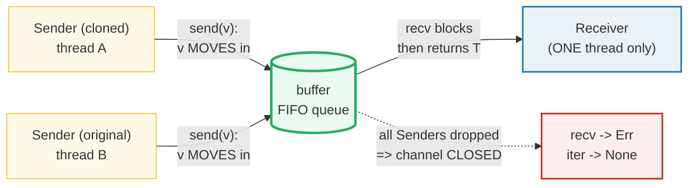

# MPSC_CHANNELS — Message Passing: One Receiver, Many Senders, Owned Messages

> **One-line goal:** `std::sync::mpsc` channels let threads talk by **moving**
> values to each other through a queue — one `Receiver`, many cloned `Sender`s —
> so "share memory by **communicating**" instead of communicating by sharing
> memory.
>
> **Run:** `just run mpsc_channels` (== `cargo run --bin mpsc_channels`)
> **Member:** `core` (stdlib-only — no `[dependencies]`).
> **Prerequisites:** 🔗 [OWNERSHIP](./OWNERSHIP.md) (`send` *moves* the value),
> 🔗 [BORROWING](./BORROWING.md), and the threads model from Phase 4.1.
> **Ground truth:** [`mpsc_channels.rs`](./mpsc_channels.rs); captured stdout:
> [`mpsc_channels_output.txt`](./mpsc_channels_output.txt).

---

## Why this exists (lineage)

Two threads that need to share data have a classic fork in the road:

| Model | How they share | The Rust angle |
|---|---|---|
| **Shared memory** (`Mutex<T>`, atomics) | Both threads *see* one cell; lock/arbitrate access | Phase 4.3/4.4. Works, but you reason about races. |
| **Message passing** (channels) | One thread *sends* a value; another *receives* it | `std::sync::mpsc` — the value physically **moves**. |

The Book opens this chapter with the Go slogan: *"Do not communicate by sharing
memory; instead, share memory by communicating"* ([Book ch16.2][book-mpsc]).
The trick is that a Rust channel **moves ownership** of each message, so once a
thread sends a `String` it cannot touch it again — the type system hands the
data safely to the receiver with no lock and no copy. That is the lineage from
OWNERSHIP to concurrency: the move is the synchronization.



`mpsc` stands for **multiple producer, single consumer** ([Book ch16.2][book-mpsc]):
many senders feed one receiver. The two flavors are a single function each:

| Constructor | Returns | Buffer | `send` behavior |
|---|---|---|---|
| `channel()` | `(Sender, Receiver)` | **asynchronous, unbounded** ("conceptually infinite") | **never blocks** ([std mpsc][std-mpsc]) |
| `sync_channel(bound)` | `(SyncSender, Receiver)` | **synchronous, bounded** (`bound` slots) | **blocks** until space frees; `bound=0` = rendezvous ([std mpsc][std-mpsc]) |

---

## Section A — The basic handshake: `send` moves, `recv` blocks

```rust
use std::sync::mpsc::channel;
let (tx, rx) = channel();   // async, UNBOUNDED
tx.send(42).unwrap();       // 42 MOVES into the channel; tx is still usable
let got = rx.recv();        // blocks until a value arrives
assert_eq!(got, Ok(42));
```

> **From mpsc_channels.rs Section A:**
> ```
> ======================================================================
> SECTION A — basic send/recv: send MOVES the value, recv blocks
> ======================================================================
>   let (tx, rx) = channel();   // async, UNBOUNDED, send never blocks
>   tx.send(42);   // 42 moved into the channel; tx still usable
>   rx.recv() -> Ok(42)
> [check] tx.send(42) then rx.recv() yields Ok(42): OK
> ```

**What.** `channel()` returns a `(Sender, Receiver)` tuple. `tx.send(v)` takes
`v` **by value** (so `v` is moved in), takes `&self` (so the same `tx` can send
again), and on an async channel *returns immediately* — "This method will never
block the current thread" ([`Sender::send`][std-sender]). `rx.recv()` blocks the
calling thread until a value arrives, returning `Result<T, RecvError>`.

**Why (internals).**
- **`recv` vs `try_recv`.** The Book: *"the receiver has two useful methods:
  `recv` and `try_recv`. ... `recv`, short for receive, which will block the main
  thread's execution and wait until a value is sent down the channel. ... The
  `try_recv` method doesn't block, but will instead return a `Result` ... an
  `Ok` value holding a message if one is available and an `Err` value if there
  aren't any messages this time"* ([Book ch16.2][book-mpsc]). Use `try_recv` for
  event-loop–style polling; use `recv` when waiting is the right thing.
- **Why `send` returns `Result`.** It succeeds only if "the other end of the
  channel has not hung up already" ([`Sender::send`][std-sender]). If the
  `Receiver` was dropped, `send` returns `Err(SendError(v))` (Section G).
- **`send` never blocks on an async channel** because the buffer is unbounded.
  This is convenient but a **memory hazard**: a fast producer can grow the queue
  without bound. The bounded `sync_channel` (Section E) is the backpressure fix.

---

## Section B — `send` MOVES the value: ownership crosses the channel (E0382)

```rust
let msg = String::from("hello");
tx.send(msg).unwrap();    // msg MOVED into the channel
// println!("{msg}");     // E0382: borrow of moved value `msg`
let received = rx.recv().unwrap();   // receiver now OWNS the String
```

> **From mpsc_channels.rs Section B:**
> ```
> ======================================================================
> SECTION B — send MOVES: ownership crosses the channel (E0382 if reused)
> ======================================================================
>   let msg = String::from("hello");  (msg owns the heap buffer)
>   tx.send(msg);   // msg MOVED into the channel; the binding is poisoned
>   rx.recv() -> "hello"  (receiver now OWNS the String; len 5)
> [check] ownership transferred through the channel: receiver owns the String: OK
> ```

**What.** A non-`Copy` value (`String`, `Vec`, your structs) is **moved** into
`send`; the receiver takes full ownership — it may mutate, drop, or forward the
value. No deep copy of the heap payload is ever made.

**Why (internals).** The Book states the rule directly: *"The `send` function
takes ownership of its parameter, and when the value is moved the receiver takes
ownership of it. This stops us from accidentally using the value again after
sending it; the ownership system checks that everything is okay"*
([Book ch16.2][book-mpsc]). Mechanically this is exactly the move from
🔗 [OWNERSHIP](./OWNERSHIP.md) Section A — a bitwise copy of the value's handle
into the channel's queue, with the sender's binding poisoned. The concurrency
safety is *free* because the move discipline is already enforced at compile time.

**The compile error (cannot live in the runnable `.rs` — it would not build):**

```console
error[E0382]: borrow of moved value: `val`
  --> src/main.rs:10:20
   |
 8 |         let val = String::from("hi");
   |             --- move occurs because `val` has type `String`,
   |                 which does not implement the `Copy` trait
 9 |         tx.send(val).unwrap();
   |                 --- value moved here
10 |         println!("val is {val}");
   |                    ^^^ value borrowed here after move
```

([Book ch16.2, Listing 16-9][book-mpsc]) — the very same `E0382` you met in
OWNERSHIP, now surfaced by a concurrency mistake. If you must keep using the
value, `.clone()` before `send` (or send a `&T` through a different design — but
a channel's whole point is to hand off ownership).

---

## Section C — `rx.iter()` drains the channel until every `Sender` drops

```rust
tx.send(1).unwrap();
tx.send(2).unwrap();
tx.send(3).unwrap();
drop(tx);                         // CLOSE the channel
let v: Vec<i32> = rx.iter().collect();
assert_eq!(v, vec![1, 2, 3]);     // FIFO from a single producer
```

> **From mpsc_channels.rs Section C:**
> ```
> ======================================================================
> SECTION C — rx.iter(): drain the channel until every Sender drops
> ======================================================================
>   let (tx, rx) = channel();
>   tx.send(1); tx.send(2); tx.send(3);
>   drop(tx);   // closes the channel -> rx.iter() will terminate
>   collected via rx.iter() -> [1, 2, 3]
> [check] rx.iter() yields [1, 2, 3] in FIFO order from one producer: OK
> ```

**What.** Treating `rx` as an iterator gives you a blocking drain loop: each
`next()` calls `recv` under the hood; the iterator returns `None` (and the loop
ends) once the channel has hung up. The Book: *"we're treating `rx` as an
iterator. ... When the channel is closed, iteration will end"* ([Book ch16.2][book-mpsc]).

**Why (internals).**
- **You MUST drop all senders** for the loop to terminate. The std docs are
  emphatic: *"all senders (the original and its clones) need to be dropped for
  the receiver to stop blocking"* ([`Sender`][std-sender]). Forget the `drop(tx)`
  in this section and the program **deadlocks** in `iter()` forever — `recv`
  keeps waiting because a sender is still alive. See the pitfalls table.
- **FIFO per channel.** `sync_channel` guarantees ordering: *"All data sent on
  the `SyncSender` will become available on the `Receiver` in the same order as
  it was sent"* ([`sync_channel`][std-sync-channel]). With a **single** producer
  that means `[1, 2, 3]` comes out as `[1, 2, 3]` — deterministic. With
  **multiple** producers the *interleaving* is nondeterministic (Section D).
- `iter()` *"will block waiting for messages, but never panic. It will return
  `None` when the channel has hung up"* ([`Receiver::iter`][std-receiver]). The
  non-blocking sibling `try_iter()` drains only what's already buffered.

---

## Section D — Multiple producers: `clone tx`; collect; **SORT** (determinism)

```rust
let (tx, rx) = channel();
for v in [10, 20, 30] {
    let tx = tx.clone();                 // each thread gets its own Sender
    thread::spawn(move || { tx.send(v).unwrap(); });
}
drop(tx);                                // close once all clones are gone
// (join threads, then:)
let mut got: Vec<i32> = rx.iter().collect();
got.sort_unstable();                     // reception order is NONDETERMINISTIC
assert_eq!(got, vec![10, 20, 30]);
```

> **From mpsc_channels.rs Section D:**
> ```
> ======================================================================
> SECTION D — multiple producers: clone tx per thread; collect and SORT
> ======================================================================
>   let (tx, rx) = channel();
>   spawned 3 threads, each cloned tx and sent one of [10, 20, 30]
>   collected (sorted) -> [10, 20, 30]
> [check] 3 cloned senders delivered exactly {10, 20, 30} (as a set): OK
> ```

**What.** `Sender: Clone`, so `tx.clone()` hands each spawned thread an
independent producer feeding the *same* receiver. Three threads each send one
value; the receiver collects `{10, 20, 30}`. The check passes on the **sorted
set**, never on the raw order.

**Why (internals).**
- **`mpsc` = many producers.** The Book: *"we call `clone` on the transmitter.
  This will give us a new transmitter we can pass to the first spawned thread ...
  This gives us two threads, each sending different messages to the one
  receiver"* ([Book ch16.2][book-mpsc]).
- **Reception order is nondeterministic.** Each clone writes into the same FIFO
  queue, but *when* each thread runs is up to the scheduler. The Book again:
  *"You might see the values in another order, depending on your system. This is
  what makes concurrency interesting as well as difficult"* ([Book ch16.2][book-mpsc]).
  This is **why this bundle never prints in scheduling order** — collect into a
  `Vec`, **sort**, then print from `main` after `join` (see DETERMINISM,
  `HOW_TO_RESEARCH.md` §4.2 rule 3). Do that and `_output.txt` is byte-stable.
- **`Sender` is `Sync` (since 1.72.0).** Since Rust 1.72 you can in principle
  share `&Sender` across threads instead of cloning ([`Sender` trait impls][std-sender]).
  The idiomatic, Book-recommended pattern is still `clone()` — one owned `Sender`
  per thread, no shared reference to manage — and that is what this bundle shows.
  The **receiver** is the opposite: see Section F.

---

## Section E — Bounded `sync_channel`: `send` BLOCKS when full (backpressure)

```rust
let (tx, rx) = sync_channel(1);          // 1-slot buffer
tx.send(1).unwrap();                     // fills the slot, returns immediately
assert!(matches!(tx.try_send(2), Err(TrySendError::Full(2)))); // full!
let _ = rx.recv();                       // drain -> a slot opens
tx.send(2).unwrap();                     // now accepted
```

> **From mpsc_channels.rs Section E:**
> ```
> ======================================================================
> SECTION E — bounded sync_channel: send BLOCKS when the buffer is full
> ======================================================================
>   let (tx, rx) = sync_channel(1);   // bounded buffer of size 1
>   tx.send(1).unwrap();   (slot now FULL)
>   tx.try_send(2) -> Err(TrySendError::Full(..))   (Full == backpressure: send would block)
> [check] bounded(1) channel is full after 1 send -> try_send returns Full(2): OK
>   rx.recv() -> Ok(1)   (freed the slot)
>   tx.send(2); rx.recv() -> Ok(2)
> [check] after draining, the bounded channel accepts the queued value: OK
>   let (tx0, rx0) = sync_channel(0);   // rendezvous: 0-buffer
>   spawned send(7) handed off -> rx0.recv() = Ok(7)
> [check] sync_channel(0) rendezvous: recv returns the handed-off value: OK
> ```

**What.** `sync_channel(1)` has a one-slot buffer. The first `send` fills it and
returns; a second `send` would **block** until a `recv` frees a slot. The bundle
*observes* that full state deterministically with `try_send` — which never
blocks and instead returns `Err(TrySendError::Full(v))`, handing the value back.
After draining, the slot reopens and the value is accepted. Then `sync_channel(0)`
("rendezvous") forces a direct handoff: each `send` blocks until a `recv` is
paired with it.

**Why (internals).**
- **Backpressure is the whole point of `sync_channel`.** The std docs: *"A
  synchronous, bounded channel. ... All sends will be synchronous by blocking
  until there is buffer space available"* and *"a bound of 0 is allowed, causing
  the channel to become a 'rendezvous' channel where each sender atomically hands
  off a message to a receiver"* ([std mpsc][std-mpsc]). A slow consumer thus
  *throttles* a fast producer — the unbounded `channel()` cannot do this.
- **`SyncSender::send` blocks; `try_send` reports.** *"This function will block
  until space in the internal buffer becomes available or a receiver is available
  to hand off the message to"* ([`SyncSender::send`][std-syncsender]). `try_send`
  is the non-blocking probe: two failure modes (`Full` vs `Disconnected`) instead
  of one.
- **Debug redacts the payload.** Note the output shows `Err(TrySendError::Full(..))`
  — the std `Debug` impl for `TrySendError`/`SendError` **does not print the inner
  value**. The `[check]` still proves it's `Full(2)` via a pattern match. To
  *read* the bounced value in real code, use `matches!`, `.0`, or `.into_inner()`
  — never `{:?}`. See the pitfalls table.

> **`send` would block — how do we know?** We cannot `print!` "I am blocked"
> from a thread without making the output nondeterministic. `try_send` is the
> clean, deterministic witness: returning `Full` *is* the proof that `send`
> would block here. That keeps Section E's output byte-reproducible.

---

## Section F — Channel close: drop ALL `Sender`s → `recv` returns `Err`

```rust
let (tx, rx) = channel::<i32>();
drop(tx);                       // no Senders remain -> channel CLOSED
assert_eq!(rx.recv(), Err(RecvError));
assert_eq!(rx.iter().collect::<Vec<_>>(), vec![]);   // iter ends at once
```

> **From mpsc_channels.rs Section F:**
> ```
> ======================================================================
> SECTION F — channel close: drop ALL Senders -> recv returns Err
> ======================================================================
>   let (tx, rx) = channel::<i32>();
>   drop(tx);   // no Senders remain -> channel is CLOSED
>   rx.recv() -> Err(RecvError)
> [check] recv returns Err(RecvError) once all Senders are dropped: OK
>   rx.iter().collect::<Vec<_>>() -> []
> [check] rx.iter() over a closed channel yields nothing: OK
> ```

**What.** Once every `Sender` is dropped the channel is closed; `recv` wakes and
returns `Err(RecvError)`, and `iter()` immediately yields `None`.

**Why (internals).**
- **Closing is symmetric and `Result`-shaped.** *"The send and receive operations
  on channels will all return a `Result` ... An unsuccessful operation is
  normally indicative of the other half of a channel having 'hung up' by being
  dropped"* ([std mpsc — Disconnection][std-mpsc]). `recv` has one error
  (`RecvError`); `send` has one (`SendError`).
- **The single-consumer rule is enforced by `!Sync`.** The std docs: the
  `Receiver` *"can only be owned by one thread"* ([`Receiver`][std-receiver]),
  and the type system backs that up with `impl<T> !Sync for Receiver<T>` — you
  **cannot** share `&Receiver` across threads at all, so there is provably one
  consumer. (You can still *move* it to one thread: `Receiver: Send`.) This is
  the structural meaning of "single consumer" in `mpsc`.
- **Buffered messages still arrive.** *"since channels are buffered, messages
  sent before the disconnect will still be properly received"* ([`Receiver::recv`][std-receiver]).
  Closing only promises *no future* messages, not that in-flight ones are lost.

---

## Section G — Send error: drop the `Receiver` → `send` returns `Err(SendError)`

```rust
let (tx, rx) = channel();
drop(rx);                                  // consumer gone
let bounced = tx.send(99);                 // Err(SendError(99)) — value returns
assert_eq!(bounced.unwrap_err().0, 99);
```

> **From mpsc_channels.rs Section G:**
> ```
> ======================================================================
> SECTION G — send error: drop the Receiver -> send returns Err(SendError)
> ======================================================================
>   let (tx, rx) = channel();
>   drop(rx);   // consumer gone
>   tx.send(99) -> Err(SendError { .. })   (value bounced back to the sender)
> [check] send returns the value (99) when the Receiver was dropped: OK
> ```

**What.** The mirror image of Section F: dropping the `Receiver` makes further
sends pointless, so `send` returns `Err(SendError(v))` — and crucially **hands
the value back** to the caller. The `[check]` recovers `99` from `SendError(pub
T).0`, proving the bounced payload survived.

**Why (internals).** `send` *"returns it back if it could not be sent ... a
return value of `Err` means that the data will never be received"* ([`Sender::send`][std-sender]).
This is the producer's shutdown signal: if your consumer dies, your `send`
errors out and you keep ownership, so the value is not silently leaked. In real
code you usually branch on this (log, re-queue, or `unwrap` if a dead consumer
is a bug). The std authors note most examples just `.unwrap()` because
*"an unsuccessful send would be ... indicative of the other half ... having hung
up"* ([std mpsc][std-mpsc]).

> Again, the `Debug` output `Err(SendError { .. })` redacts the inner `99`. The
> std `Debug` impl hides the payload — read it with `.0` / `.into_inner()`.

---

## Pitfalls (the expert payoff)

| Trap | Symptom | Fix / why |
|---|---|---|
| **Forgetting `drop(tx)` before `rx.iter()`** | program **deadlocks** — `iter()`/`recv()` blocks forever | *"all senders need to be dropped for the receiver to stop blocking"* ([`Sender`][std-sender]). Explicitly `drop(tx)` once production is done, or move every clone into threads that finish. |
| **Printing from receive-scheduling order** | `_output.txt` differs every run | Multi-producer interleaving is **nondeterministic**. Collect into a `Vec`, **sort**, print from `main` after `join`. Never `println!` inside the producer threads. |
| **Reusing a value after `send`** | `error[E0382]: borrow of moved value` | `send` *moves* non-`Copy` values. `.clone()` first if you must keep it. 🔗 [OWNERSHIP](./OWNERSHIP.md) |
| **Expecting `{:?}` to show a bounced value** | `Err(SendError { .. })`, `Err(TrySendError::Full(..))` — payload hidden | The std `Debug` impls **redact** the inner `T`. Use `matches!`, `.0`, or `.into_inner()` to read it. The `[check]`s in this bundle pattern-match for exactly this reason. |
| **Unbounded `channel()` OOM** | fast producer, slow consumer → queue grows without limit → memory blowup | Use `sync_channel(n)` for **backpressure**; `send` then blocks when full. |
| **`sync_channel(n)` producer deadlock** | all senders blocked, receiver gone or also blocked | A bounded channel with no receiver (or a receiver that stopped draining) deadlocks producers. Always handle `SendError`; size `n` for your throughput. |
| **`.unwrap()` on every `send`/`recv`** | panics when the other half drops — kills the thread | In production, match on the `Result`. `unwrap` is fine for examples/tests where a hangup is a bug. |
| **Trying to share one `Receiver` across threads** | `error: Receiver<T>` cannot be shared between threads safely (`!Sync`) | The single-consumer rule is a type-system guarantee. To fan out, drain in one thread and dispatch, or use `crossbeam`/`tokio` mpsc which differ here. |
| **Confusing `recv` (blocks) with `try_recv` (polls)** | blocking the UI thread / busy-spinning a CPU | `recv` blocks; `try_recv` returns immediately with `Empty`/`Disconnected`. Pick by whether you have other work to do. |
| **Thinking `sync_channel(0)` is useless** | "why a zero-size buffer?" | It's a **rendezvous** — a direct send/recv handshake, the tightest possible synchronization. Great for "ack" patterns. |
| **`tx.send(...)` ignored `Result`** | `unused_must_use` warning / silent drop on disconnect | `Result` is `#[must_use]`. Bind it, `.unwrap()`, or `let _ =`. |
| **Holding the original `tx` while collecting** | `iter()` never ends even though threads finished | The original `Sender` keeps the channel open. `drop(tx)` the original after spawning clones (Section D). |

---

## Cheat sheet

```rust
use std::sync::mpsc::{channel, sync_channel, SendError, RecvError, TrySendError};

// UNBOUNDED, async: send never blocks.
let (tx, rx) = channel();
tx.send(v).unwrap();          // v MOVES in (E0382 to reuse v). Returns Result.
let v = rx.recv().unwrap();   // BLOCKS; Err(RecvError) when all tx drop.

// BOUNDED, sync: send BLOCKS when full (backpressure). bound=0 = rendezvous.
let (stx, srx) = sync_channel(N);
stx.send(v)                   // blocks for room
match stx.try_send(v) {       // never blocks: Ok | Err(Full(v)) | Err(Disconnected(v))
    Err(TrySendError::Full(v)) => /* would block */ ,
    _ => (),
}

// MULTI-PRODUCER: clone the Sender (one per thread).
for v in items {
    let tx = tx.clone();
    thread::spawn(move || tx.send(v).unwrap());
}
drop(tx);                                    // REQUIRED: closes the channel
let mut got: Vec<_> = rx.iter().collect();   // iter ends when all Senders drop
got.sort_unstable();                         // reception order is NONDETERMINISTIC

// CLOSE / DISCONNECT (both halves are Result-shaped):
drop(tx); assert_eq!(rx.recv(), Err(RecvError));      // no more producers
drop(rx); assert!(tx.send(x).is_err());               // no more consumer
// SendError(pub T) / TrySendError hand the value BACK — Debug hides it; use .0.

// Trait facts: Sender/SyncSender: Send + Sync (Sender: Sync since 1.72).
//              Receiver: Send but !Sync -> exactly ONE owning consumer thread.
```

---

## Sources

Every claim above was web-verified against the official Rust documentation.

- **The Rust Programming Language, ch16.2 "Using Message Passing to Transfer Data
  Between Threads"** — the Go slogan, `mpsc` = multiple producer/single consumer,
  `tx`/`rx`, `send` takes ownership, `recv`/`try_recv`, `rx` as iterator,
  "iteration will end" on close, cloning the transmitter for multiple producers,
  the nondeterministic-order note, and the `E0382` Listing 16-9:
  https://doc.rust-lang.org/book/ch16-02-message-passing.html
- **`std::sync::mpsc` module docs** — "Multi-producer, single-consumer FIFO
  queue communication primitives", the two channel flavors (async unbounded vs
  sync bounded, rendezvous at bound 0), the Disconnection section (`Result`
  returns, hang-up):
  https://doc.rust-lang.org/std/sync/mpsc/index.html
- **`std::sync::mpsc::Sender`** — `send` "never block[s]", `Err(SendError)` on
  hang-up, *"all senders ... need to be dropped for the receiver to stop
  blocking"*, and the trait impls `Send` (1.0) + `Sync` (1.72.0), `Clone`:
  https://doc.rust-lang.org/std/sync/mpsc/struct.Sender.html
- **`std::sync::mpsc::SyncSender`** — `send` *"will block until space in the
  internal buffer becomes available or a receiver is available to hand off the
  message to"*, `try_send` (Full vs Disconnected), `Send`+`Sync`, `Clone`:
  https://doc.rust-lang.org/std/sync/mpsc/struct.SyncSender.html
- **`std::sync::mpsc::Receiver`** — `recv` "always block[s] ... returns an error
  if the channel has hung up", *"can only be owned by one thread"*, `iter`
  *"will block waiting for messages ... return None when the channel has hung
  up"*, `try_recv`/`try_iter`, the explicit `impl<T> !Sync for Receiver<T>` and
  `impl<T: Send> Send for Receiver<T>`:
  https://doc.rust-lang.org/std/sync/mpsc/struct.Receiver.html
- **`std::sync::mpsc::sync_channel`** — bounded channel, *"When the internal
  buffer becomes full, future sends will block"*, *"buffer size of 0 ... becomes
  rendezvous channel"*, FIFO ordering, *"only one Receiver is supported"*:
  https://doc.rust-lang.org/std/sync/mpsc/fn.sync_channel.html
