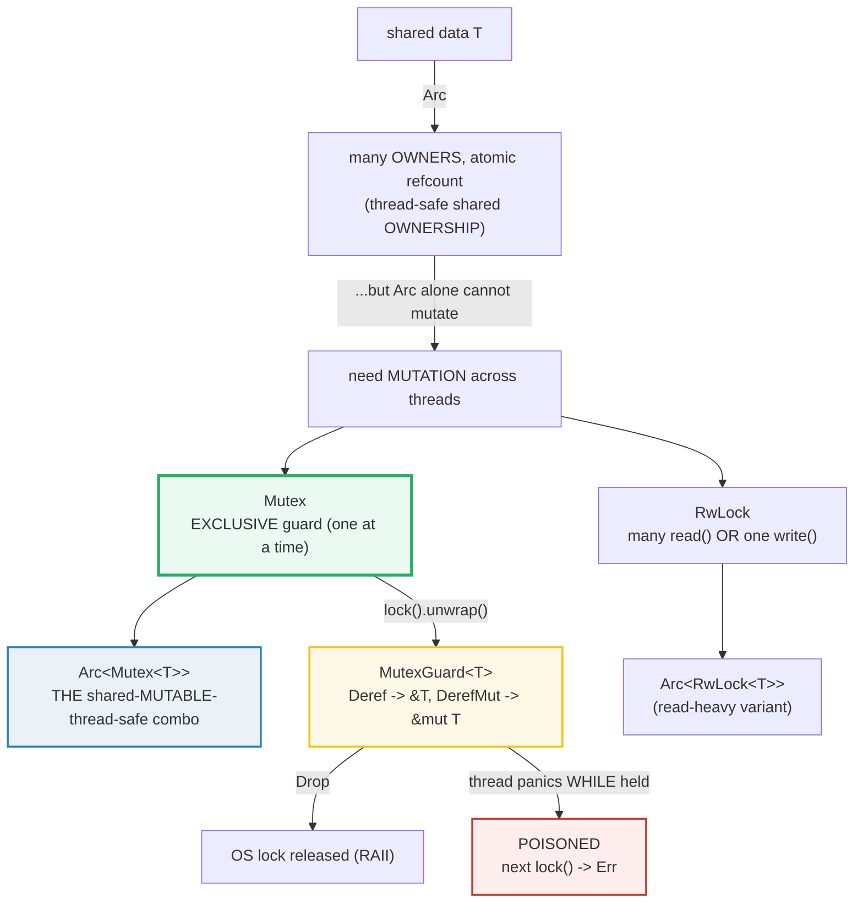
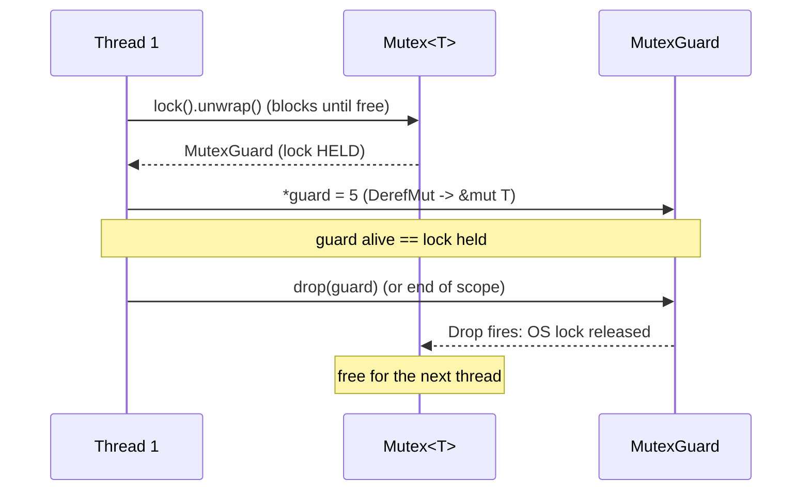

# MUTEX_RWLOCK — Shared-State Concurrency: the Lock, the Guard, the Poison

> **One-line goal:** `Mutex<T>` and `RwLock<T>` guard shared data behind an RAII
> **borrow** — the guard `Deref`s to `&mut T` and **unlocks on `Drop`**; the
> killer combo `Arc<Mutex<T>>` makes data **shared, mutable, and thread-safe**,
> and a **panic while holding a lock *poisons*** it so the next `lock()` returns
> `Err` and *forces* you to decide: propagate or recover.
>
> **Run:** `just run mutex_rwlock` (== `cargo run --bin mutex_rwlock`)
> **Member:** `core` (stdlib-only — no `[dependencies]`).
> **Prerequisites:** 🔗 [INTERIOR_MUTABILITY](./INTERIOR_MUTABILITY.md) (Mutex as
> *thread-safe* interior mutability) and 🔗 [BOX_RC_ARC](./BOX_RC_ARC.md) (`Arc`).
> **Ground truth:** [`mutex_rwlock.rs`](./mutex_rwlock.rs); captured stdout:
> [`mutex_rwlock_output.txt`](./mutex_rwlock_output.txt).

---

## Why this exists (lineage)

Concurrency has exactly two ways to keep data consistent across threads:

| Model | Mechanism | Rust primitive | Analogy |
|---|---|---|---|
| **Message passing** | Send data *between* threads; each value has ONE owner | `mpsc` channels | a conveyor belt between workers |
| **Shared state** | Many threads *look at the same memory*; a **lock** serializes access | `Mutex` / `RwLock` | one microphone, passed around a panel |

Channels (🔗 [MPSC_CHANNELS](./MPSC_CHANNELS.md)) are *single ownership moved
between threads*. Shared-state concurrency is **multiple ownership of one memory
location** — which, as the Book puts it, "is like multiple ownership: Multiple
threads can access the same memory location at the same time" ([Book
ch16.3][book-shared]). Multiple ownership is exactly what `Arc<T>` provides
(🔗 [BOX_RC_ARC](./BOX_RC_ARC.md)). But `Arc` alone only shares *ownership*
atomically — it does **not** make mutation safe. To mutate shared data you wrap
it in a lock. The Book states the lineage verbatim:

> "Mutex&lt;T&gt; provides interior mutability, as the `Cell` family does. In the
> same way we used `RefCell<T>` ... to allow us to mutate contents inside an
> `Rc<T>`, we use `Mutex<T>` to mutate contents inside an `Arc<T>`."
> — [Book ch16.3][book-shared]

So the family tree is: `Cell`/`RefCell` (single-threaded interior mutability,
🔗 [INTERIOR_MUTABILITY](./INTERIOR_MUTABILITY.md)) → `Mutex`/`RwLock` (the
**thread-safe** interior mutability, this bundle). `Rc<RefCell<T>>` is the
single-threaded shared-mutable pair; **`Arc<Mutex<T>>` is its thread-safe twin.**



---

## The guard IS a borrow (the single most important idea)

A lock in C is a manual `pthread_mutex_lock`/`unlock` pair — forget the unlock,
or return early between them, and you deadlock the program. Rust's `Mutex`
**cannot forget**. `lock()` does not hand you `&mut T` directly; it hands you a
**`MutexGuard<T>`** — a smart pointer that *is* the borrow for the lock's
lifetime:

> "The data protected by the mutex can be accessed through this guard via its
> `Deref` and `DerefMut` implementations." — [`MutexGuard` docs][std-mutexguard]

`MutexGuard<'a, T>` implements `Deref<Target = T>` and `DerefMut`, and — crucially
— `Drop`. The `Drop` impl releases the OS lock. So the **scope of the guard is
the duration of the lock**: it can never be held without being released, exactly
once. This is RAII ("OBRM — Ownership Based Resource Management") applied to a
lock, the same discipline `Box`/`String` apply to heap memory (🔗
[OWNERSHIP](./OWNERSHIP.md) Section C/D).



---

## Section A — `Mutex<T>`: lock blocks; the guard unlocks on Drop

```rust
let m = Mutex::new(0);
{
    let mut guard = m.lock().unwrap();   // blocks until free; returns MutexGuard
    *guard = 5;                          // DerefMut -> &mut i32
}                                        // <- guard Drop unlocks
*m.lock().unwrap()                       // == 5
```

> **From mutex_rwlock.rs Section A:**
> ```
> ======================================================================
> SECTION A — Mutex<T>: lock() blocks; the guard unlocks on Drop
> ======================================================================
>   let m = Mutex::new(0i32);
>   let mut guard = m.lock().unwrap();  *guard = 5;
>   (guard alive: value inside the mutex is now 5, lock HELD)
>   after the guard dropped: *m.lock().unwrap() = 5
> [check] the guard's mutation survives its Drop (value == 5 after re-lock): OK
> ```

**What.** `Mutex::new(0)` wraps the `i32`. `lock()` **blocks** the calling thread
until the lock is free, then returns a `MutexGuard` (wrapped in a `Result`, see
Section E). `*guard = 5` mutates through `DerefMut`. When the inner scope's `}`
runs, the guard drops and the OS lock is released. A **fresh** `lock()` then
sees the value the dropped guard left behind — `5`.

**Why (internals).**
- **The type is the discipline.** The data lives *inside* `Mutex<i32>`, so the
  *only* way to reach the `i32` is to call `lock()`/`try_lock()` and get a guard.
  The Book: "The type of `m` is `Mutex<i32>`, not `i32`, so we *must* call `lock`
  to be able to use the `i32` value. We can't forget; the type system won't let
  us access the inner `i32` otherwise." ([Book ch16.3][book-shared])
- **`lock()` returns `LockResult<MutexGuard>`.** A `Result`, not a bare guard,
  because of poisoning — a panic-while-locked means the data may be inconsistent,
  so Rust refuses to hand you a guard without you acknowledging the possibility
  (Section E). `.unwrap()` is the idiomatic "I'm not expecting a panic here;
  propagate it if one occurred".
- **`Drop` is the unlock.** There is no `unlock()` method you can call. The
  guard's `Drop` impl is the *only* way the lock is released — so it can never
  leak (provided the guard itself isn't `mem::forget`'d).

---

## Section B — The guard IS a borrow: `Deref`/`DerefMut` + `Drop`

> **From mutex_rwlock.rs Section B:**
> ```
> ======================================================================
> SECTION B — the guard IS a borrow: Deref/DerefMut + Drop = RAII unlock
> ======================================================================
>   guard alive; m.try_lock().is_err() = true
> [check] while the guard is alive, try_lock() is Err (the lock is held): OK
>   std::mem::drop(guard);   // RAII: lock released immediately
>   after drop; m.try_lock().is_ok() = true
> [check] after the guard is dropped, try_lock() is Ok (the lock is free): OK
> [check] RAII: std::mem::drop releases the lock early; re-lock sees the mutation (== 7): OK
> ```

**What.** A guard is created (`*guard = 7`); while it is alive a `try_lock()` is
**`Err`** — the lock is provably held. Then `std::mem::drop(guard)` releases it
*immediately* (not at the scope's `}`), after which `try_lock()` is **`Ok`** and
the value `7` survives.

**Why (internals).**
- **The guard's lifetime *is* the lock.** `MutexGuard<'a, T>` borrows the mutex
  for `'a`. There is no way to hold the lock longer than the guard, or to drop
  the guard without releasing the lock (the guard is `!Send` precisely so you
  cannot move it to another thread and drop it there — see the `MutexGuard`
  `!Send` note below).
- **`std::mem::drop(guard)` = early unlock.** This is the *same* `std::mem::drop`
  from 🔗 [OWNERSHIP](./OWNERSHIP.md) Section D (`pub fn drop<T>(_x: T) {}`). It
  moves the guard into a function and drops it there — releasing the lock *right
  now*. This matters when a critical section is short but the surrounding scope
  is long: holding a guard idle blocks other threads for no reason. The std docs'
  own example annotates this: "We drop the `data` explicitly because ... if we
  had not dropped the mutex guard, a thread could be waiting forever for it,
  causing a deadlock" ([`Mutex` examples][std-mutex]).
- **Re-locking on the *same* thread is "left unspecified".** The `lock()` docs
  warn: "The exact behavior on locking a mutex in the thread which already holds
  the lock is left unspecified. However, this function will not return on the
  second call (it might panic or deadlock)." That is why this section probes with
  the **non-blocking** `try_lock()` rather than a second `lock()` — the latter
  would deadlock deterministically on a non-reentrant mutex.

> **`MutexGuard` is `!Send`.** A `MutexGuard` deliberately does *not* implement
> `Send`: "On platforms that use POSIX threads ... there is a requirement to
> release mutex locks on the same thread they were acquired. For this reason,
> `MutexGuard` must not implement `Send` to prevent it being dropped from another
> thread." ([`MutexGuard` docs][std-mutexguard]) — the guard must be unlocked by
> the thread that locked it.

---

## Section C — `Arc<Mutex<T>>`: shared MUTABLE state across threads

```rust
let counter = Arc::new(Mutex::new(0));
for _ in 0..4 {
    let counter = Arc::clone(&counter);
    thread::spawn(move || {
        for _ in 0..1000 { *counter.lock().unwrap() += 1; }
    });
}
// after join: *counter.lock().unwrap() == 4000   (deterministic)
```

> **From mutex_rwlock.rs Section C:**
> ```
> ======================================================================
> SECTION C — Arc<Mutex<T>>: shared MUTABLE state across threads
> ======================================================================
>   Arc::new(Mutex::new(0));  4 threads each +1000 under the lock
>   after join: total = 4000  (== 4 x 1000)
> [check] Arc<Mutex<i32>>: final total == N*K (lock serializes; deterministic): OK
> ```

**What.** Four threads each increment a shared counter 1000 times. After all
join, the total is **4000** — *exactly* `N × K`, every single run, despite the
threads running concurrently with arbitrary OS scheduling.

**Why (internals).**
- **Why `Arc` and not `Rc`?** Each thread must *own* a handle to the shared
  value, and `thread::spawn` requires its closure to be `Send + 'static`. `Rc`
  uses a **non-atomic** refcount; if two threads cloned it the count increments
  would race (the Book: "it doesn't use any concurrency primitives to make sure
  that changes to the count can't be interrupted by another thread ... could lead
  to wrong counts" [Book ch16.3][book-shared]). `Rc` is therefore `!Send` (🔗
  [BOX_RC_ARC](./BOX_RC_ARC.md) Section E). `Arc` uses **atomic** refcount ops,
  so `Arc<T>: Send + Sync` when `T: Send + Sync`, and `Arc::clone` is a cheap
  atomic increment. The Book: "`Arc<T>` is a type like `Rc<T>` that is safe to
  use in concurrent situations. The *a* stands for *atomic*." ([Book
  ch16.3][book-shared]).
- **Why `Mutex` *inside* `Arc`?** `Arc` alone shares ownership but **not**
  mutation — `Arc<RefCell<T>>` is *not* `Sync` (🔗 [BOX_RC_ARC](./BOX_RC_ARC.md)
  pitfalls). Wrapping the value in `Mutex<T>` makes the *whole* `Arc<Mutex<T>>`
  both `Send` and `Sync` (since `Mutex<T>: Send + Sync` when `T: Send`), so it
  crosses the `spawn` boundary and many threads can lock-mutate it safely.
- **DETERMINISM.** The per-thread interleaving is nondeterministic — you must
  **never** print from threads in scheduling order or assert an order (see
  `HOW_TO_RESEARCH.md` §4.2 rule 3). But the **final total is deterministic**:
  every increment is a complete lock→read-modify-write→unlock cycle, so the OS
  serializes them; `N × K` increments always sum to `N × K`. This bundle asserts
  that total (`4000`), never the order.

> **When is `Mutex` overkill?** For a bare counter, `std::sync::atomic::AtomicI32`
> does the same job without a lock — faster and lock-free. The Book's own caveat:
> "if you are doing simple numerical operations, there are types simpler than
> `Mutex<T>` ... `std::sync::atomic` ... provide safe, concurrent, atomic access
> to primitive types." ([Book ch16.3][book-shared]). Reach for `Mutex` when the
> critical section is a *compound* operation (multiple fields, a map insert,
> etc.); reach for atomics for a single primitive. 🔗 [ATOMICS](./ATOMICS.md).

---

## Section D — `RwLock<T>`: many readers OR one writer

```rust
let rw = RwLock::new(100);
let r1 = rw.read().unwrap();   // shared read guard  ┐ both alive at once
let r2 = rw.read().unwrap();   // shared read guard  ┘ (readers don't block)
let mut w = rw.write().unwrap(); // EXCLUSIVE — blocks readers & other writers
```

> **From mutex_rwlock.rs Section D:**
> ```
> ======================================================================
> SECTION D — RwLock<T>: many read() OR one write()
> ======================================================================
>   let rw = RwLock::new(100i32);
>   two read() guards at once: *r1 = 100, *r2 = 100
> [check] RwLock allows multiple simultaneous read() guards (shared access): OK
>   write() guard held; rw.try_read().is_err() = true
> [check] while a write() guard is held, try_read() is Err (write is exclusive): OK
>   3 writers * +5 each -> final = 115
> [check] RwLock writers serialize: final == base + N*ADD (deterministic): OK
> ```

**What.** Two `read()` guards coexist at once (both read `100`). But while a
`write()` guard is held, even a `try_read()` is refused. Three writer threads
each add `5`; after join the value is `115` (`100 + 3×5`), deterministic.

**Why (internals).**
- **The `&T`/`&mut T` rule, made concurrent.** `RwLock` maps the borrow-checker's
  aliasing-XOR-mutability rule onto *threads*: `read()` is the shared `&T`
  analogue (any number may coexist), `write()` is the exclusive `&mut T`
  analogue (at most one, and no readers). The std docs: "This type of lock allows
  a number of readers or at most one writer at any point in time ... An `RwLock`
  will allow multiple readers to acquire the lock as long as a writer is not
  holding the lock." ([`RwLock` docs][std-rwlock]).
- **Pick `RwLock` for read-heavy workloads.** A `Mutex` serializes *every* access
  (readers block readers). `RwLock` lets readers proceed in parallel, which wins
  when reads vastly outnumber writes (e.g. a shared config/cache read often,
  written rarely). The guards (`RwLockReadGuard`/`RwLockWriteGuard`) `Deref` /
  `DerefMut` just like `MutexGuard`.
- **No fairness guarantee.** "The priority policy of the lock is dependent on the
  underlying operating system's implementation, and this type does not guarantee
  that any particular policy will be used" ([`RwLock` docs][std-rwlock]). A
  waiting writer may or may not block new readers — so reader-heavy loads can
  *starve* writers on some platforms. Do not build correctness on an ordering
  assumption.
- **`RwLock<T>: Sync` requires `T: Send + Sync`** (vs `Mutex<T>: Sync` requiring
  only `T: Send`), because `RwLock` hands out `&T` to *many threads at once* —
  that is only sound if `T: Sync`. 🔗 [SEND_SYNC](./SEND_SYNC.md).

---

## Section E — Poisoning: a panic while holding a lock taints it

> **From mutex_rwlock.rs Section E:**
> ```
> ======================================================================
> SECTION E — poisoning: a panic WHILE locked makes lock() return Err
> ======================================================================
> [check] join() propagates the thread's panic as Err: OK
> [check] the mutex is now poisoned (is_poisoned() == true): OK
>   after the panic, m.lock().is_err() = true
> [check] a poisoned Mutex: lock() returns Err (you must handle it): OK
>   recovered via into_inner(): *guard = 50
> [check] recovery: PoisonError::into_inner() yields the guard (data preserved == 50): OK
> ```

**What.** A spawned thread locks the mutex, sets the value to `50`, and then
**panics while still holding the lock**. Its `join()` returns `Err` (the panic
propagated). The mutex is now **poisoned** (`is_poisoned() == true`); the next
`lock()` returns **`Err`**, not a block. We recover via
`PoisonError::into_inner()`, which hands back the guard anyway — the data (`50`)
is still there.

**Why (internals).**
- **The guard's `Drop` runs on the unwind path and *releases the OS lock*.** Even
  though the thread panicked, unwinding still runs `Drop` for the guard, so the
  lock is *not* held forever (no deadlock). But the `Drop` impl *also* checks
  `thread::panicking()` and, if true, sets a **poison flag** on the mutex.
- **Poisoning is *advisory*, not a hard block.** The std docs: "The mutexes in
  this module implement a strategy called 'poisoning' where a mutex becomes
  poisoned if it recognizes that the thread holding it has panicked. Once a mutex
  is poisoned, all other threads are unable to access the data by default as it
  is likely tainted (some invariant is not being upheld)." ([`Mutex`
  docs][std-mutex]) The mechanism is that `lock()`/`try_lock()` return a `Result`
  whose `Err` variant carries a `PoisonError` — but "Poisoning is only advisory:
  the `PoisonError` type has an `into_inner` method which will return the guard
  that would have otherwise been returned on a successful lock." ([`Mutex`
  docs][std-mutex]).
- **Why bother?** A panic mid-critical-section likely left the data
  *inconsistent* (half a multi-field update). Poisoning *forces* every later
  locker to acknowledge that possibility — you cannot accidentally read
  half-mutated state. matklad frames the design intent: these APIs "convert panics
  to recoverable results ... `Mutex::lock`; `thread::JoinHandle::join`;
  `mpsc::Sender::send`. All those APIs return a `Result` when the other thread
  panicked." ([matklad][matklad-poison]). The idiom `.lock().unwrap()` then means
  *"propagate the panic to me too"* — failing fast rather than touching suspect
  data.
- **Recovery.** If you can repair the invariant (or know the data is fine), use
  `PoisonError::into_inner()` (this section) or the helper
  `lock().unwrap_or_else(|e| e.into_inner())` (common in real codebases), then
  optionally `Mutex::clear_poison()` ([`Mutex` docs][std-mutex]) to mark the mutex
  healthy again.

> **`RwLock` poisoning is asymmetric.** "An `RwLock` ... may only be poisoned if
> a panic occurs while it is locked exclusively (write mode). If a panic occurs
> in any reader, then the lock will not be poisoned." ([`RwLock` docs][std-rwlock])
> — a reader panic can't have mutated anything, so there is nothing to taint.

---

## Section F — `try_lock()`: the non-blocking attempt

```rust
let m = Mutex::new(0);
let ok = m.try_lock();            // free  -> Ok(guard)
let _held = m.lock().unwrap();
let blocked = m.try_lock();       // held  -> Err(TryLockError::WouldBlock)
```

> **From mutex_rwlock.rs Section F:**
> ```
> ======================================================================
> SECTION F — try_lock(): non-blocking (Ok | Err(WouldBlock))
> ======================================================================
>   unlocked mutex: m.try_lock().is_ok() = true
> [check] try_lock() on a free Mutex returns Ok: OK
>   held mutex: m.try_lock() -> Err(WouldBlock)
> [check] try_lock() on a held Mutex returns Err(WouldBlock): OK
> ```

**What.** On a free mutex, `try_lock()` returns `Ok(guard)`. On a held mutex it
returns `Err(TryLockError::WouldBlock)` — *immediately*, without waiting.

**Why (internals).**
- **`try_lock()` is `lock()` without the wait.** "Attempts to acquire this lock.
> ... This function does not block." ([`Mutex::try_lock` docs][std-mutex]) Use it
  when you would rather *skip* the critical section (or do something else and
  retry) than stall — e.g. a latency-sensitive thread that must not be parked, or
  a polling loop.
- **Three outcomes, two error variants.** `try_lock()` returns `TryLockResult`,
  which is `Result<MutexGuard, TryLockError<MutexGuard>>`. The two `Err`
  variants: `WouldBlock` (someone else holds it — try later) and
  `Poisoned(PoisonError)` (a previous holder panicked — Section E). Section B uses
  `try_lock()` precisely because a *blocking* `lock()` on the same thread would
  deadlock.
- **`try_lock()` is a hint, not a synchronization primitive.** Spinning on
  `try_lock()` in a busy loop is a performance anti-pattern (it burns a core and
  fights cache lines). Prefer blocking `lock()`, or an
  `AtomicBool`/channel to signal readiness.

---

## Pitfalls (the expert payoff)

| Trap | Symptom | Fix / why |
|---|---|---|
| **Forgetting to drop a guard** | Other threads stall / deadlock; throughput collapses | The guard holds the lock for its whole scope. Wrap the critical section in an inner `{}` block or call `std::mem::drop(guard)` early (Section B). Never hold a lock across `.await` either (🔗 [ASYNC](./ASYNC.md)). |
| **Re-locking on the same thread** | hang / panic, nondeterministically | `Mutex` is not reentrant; locking twice on one thread is "left unspecified" (panic or deadlock). Probe with `try_lock()` instead. |
| **`Rc<Mutex<T>>` across threads** | `E0277: Rc<...> cannot be sent between threads safely` | `Rc`'s refcount is non-atomic → `!Send`. Use `Arc<Mutex<T>>` (Section C). |
| **`Arc<T>` expecting mutation to "just work"** | `!Sync` error / data race | `Arc` shares *ownership*, not *mutation*. Wrap the data in `Mutex`/`RwLock`, or use `Atomic*` for a single primitive (🔗 [ATOMICS](./ATOMICS.md)). |
| **`lock().unwrap()` everywhere then a real panic kills the program** | a worker panic cascades to all readers | That `.unwrap()` is *propagating* the poison on purpose. If recovery is valid, use `.unwrap_or_else(\|e\| e.into_inner())` or `clear_poison()` (Section E). |
| **Deadlock from lock ordering** | two threads each hold one lock and wait forever for the other | `Mutex` can't prevent it: "Mutex&lt;T&gt; comes with the risk of creating *deadlocks*" ([Book ch16.3][book-shared]). Always acquire multiple locks in a fixed global order. |
| **`RwLock` writer starvation** | writers never make progress under heavy reads | `RwLock` makes no fairness guarantee ([`RwLock` docs][std-rwlock]). For write-biased policies consider `parking_lot::RwLock` or restructure. |
| **`mem::forget(guard)`** | lock leaked forever (no `Drop`, no unlock) | `Drop` is the *only* unlock path. `mem::forget` defeats it. (This is also why `unsafe` code cannot rely on poisoning for soundness — see [`Mutex` poisoning notes][std-mutex].) |
| **`try_lock()` busy-loop** | 100% CPU, no progress | `try_lock()` is a non-blocking probe, not a spinlock. Block with `lock()`, or signal readiness another way (Section F). |
| **Holding `MutexGuard` across `.await`** | compile error (`!Send` guard) or deadlock | A `MutexGuard` is `!Send` and ties up a runtime thread. Use `tokio::sync::Mutex` for async, and keep guards short-lived. 🔗 [ASYNC](./ASYNC.md). |

---

## Cheat sheet

```rust
use std::sync::{Arc, Mutex, RwLock};

// ── Mutex<T>: EXCLUSIVE access (one at a time) ────────────────────────────────
let m = Mutex::new(0);
{
    let mut g = m.lock().unwrap();   // blocks until free; LockResult (poisoning)
    *g = 5;                          // DerefMut -> &mut T
}                                    // <- guard Drop UNLOCKS (RAII)
*m.lock().unwrap()                   // == 5

// EARLY unlock: std::mem::drop(guard) — same as dropping a Box (OWNERSHIP §D).

// ── Arc<Mutex<T>>: shared MUTABLE across threads (THE combo) ──────────────────
let counter = Arc::new(Mutex::new(0i32));
for _ in 0..4 {
    let c = Arc::clone(&counter);            // atomic refcount bump (Send+Sync)
    std::thread::spawn(move || {
        for _ in 0..1000 { *c.lock().unwrap() += 1; }
    });
}
// final == 4 * 1000  (DETERMINISTIC total; never assert thread ORDER)

// ── RwLock<T>: many read() OR one write() (read-heavy workloads) ──────────────
let rw = RwLock::new(100);
let r1 = rw.read().unwrap();   let r2 = rw.read().unwrap();  // both alive at once
let mut w = rw.write().unwrap();                               // EXCLUSIVE
// RwLock: Sync needs T: Send + Sync (many &T at once). Poison only on write-panic.

// ── try_lock(): non-blocking probe (Ok | Err(WouldBlock | Poisoned)) ──────────
let probe = m.try_lock();       // never blocks; safe on a possibly-held lock

// ── POISONING: panic while locked -> next lock() is Err ───────────────────────
let g = m.lock().unwrap_or_else(|pe| pe.into_inner());  // recover the guard anyway
m.is_poisoned();   // m.clear_poison();  // mark healthy once invariant restored
```

---

## Sources

Every claim above was web-verified against the authoritative Rust documentation
(and at least one independent source).

- **The Rust Programming Language, ch16.3 "Shared-State Concurrency"** — mutex =
  mutual exclusion, the two rules of mutexes, the `Mutex<T>` API & `MutexGuard`,
  why `Rc<Mutex<T>>` fails (`!Send`) and `Arc<Mutex<T>>` is the fix ("atomically
  reference-counted"), the `RefCell`/`Mutex` interior-mutability lineage, the
  deadlock warning, the atomics caveat:
  https://doc.rust-lang.org/book/ch16-03-shared-state.html
- **`std::sync::Mutex` docs** — "block threads waiting for the lock"; "data can
  only be accessed through the RAII guards"; `lock()` "blocks the current thread
  until it is able to do so ... an RAII guard is returned"; `try_lock()` "does
  not block"; the poisoning section ("a mutex becomes poisoned if it recognizes
  that the thread holding it has panicked", "Poisoning is only advisory",
  `into_inner` recovery, `clear_poison`); `Mutex<T>: Sync` requires `T: Send`:
  https://doc.rust-lang.org/std/sync/struct.Mutex.html
- **`std::sync::MutexGuard` docs** — "An RAII implementation of a 'scoped lock'
  ... When this structure is dropped ... the lock will be unlocked"; "accessed
  through this guard via its `Deref` and `DerefMut` implementations"
  (`type Target = T`); the `!Send` rationale (POSIX threads must unlock on the
  acquiring thread):
  https://doc.rust-lang.org/std/sync/struct.MutexGuard.html
- **`std::sync::RwLock` docs** — "allows a number of readers or at most one
  writer at any point in time"; "will allow multiple readers to acquire the lock
  as long as a writer is not holding the lock"; "priority policy ... is dependent
  on the underlying operating system's implementation"; `RwLock<T>: Sync`
  requires `T: Send + Sync`; "may only be poisoned if a panic occurs while it is
  locked exclusively (write mode). If a panic occurs in any reader, then the lock
  will not be poisoned":
  https://doc.rust-lang.org/std/sync/struct.RwLock.html
- **`std::sync::PoisonError` docs** — "A type of error which can be returned
  whenever a lock is acquired. Both `Mutex`es and `RwLock`s are poisoned whenever
  a thread fails while the lock is held"; `into_inner` returns the would-be guard:
  https://doc.rust-lang.org/std/sync/struct.PoisonError.html
- **matklad — "Notes On Lock Poisoning"** (independent corroboration of the
  poisoning design): "`Mutex::lock`; `thread::JoinHandle::join`;
  `mpsc::Sender::send`. All those APIs return a `Result` when the other thread
  panicked":
  https://matklad.github.io/2020/12/12/notes-on-lock-poisoning.html
