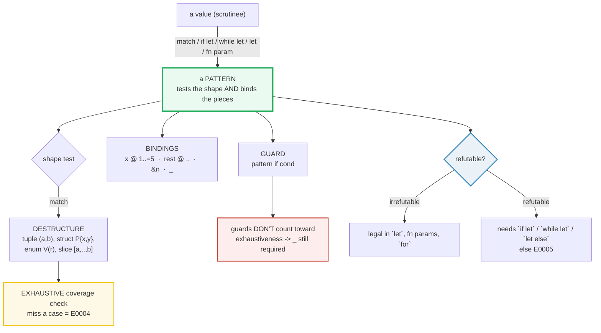

# PATTERN_MATCHING — Destructuring, Exhaustiveness, and Refutability

> **One-line goal:** a Rust *pattern* both **tests** a value's shape (variant?
> length? range?) and **destructures** it (binding the pieces it matched);
> `match` is **exhaustive** (every value must be covered or the program will not
> compile — `E0004`); and the **refutability** rule decides which construct a
> pattern may legally appear in (`let` needs irrefutable; `if let`/`while let`/
> `let else` accept refutable).
>
> **Run:** `just run pattern_matching` (== `cargo run --bin pattern_matching`)
> **Member:** `core` (stdlib-only — no `[dependencies]`).
> **Prerequisites:** [CONTROL_FLOW](./CONTROL_FLOW.md) — `match`/`if let`/`while
> let` recap (this guide goes deeper on **destructuring + bindings + slices +
> `@` + refutability**); [STRUCTS_ENUMS](./STRUCTS_ENUMS.md) (enums as tagged
> unions, the data shapes patterns match against).
> **Ground truth:** [`pattern_matching.rs`](./pattern_matching.rs); captured
> stdout: [`pattern_matching_output.txt`](./pattern_matching_output.txt).

---

## Why this exists (lineage)

In a C/Java `switch`, a forgotten case **silently does nothing** — that is the
classic source of "why did my state machine ignore input?" bugs. Rust replaces
`switch` with `match`, and the difference is not cosmetic:

| Construct | What a missing case does | What data you can pull out |
|---|---|---|
| `switch (x)` (C/Java) | falls through to nothing (silent bug) | nothing — `case 3:` only *tests* a literal |
| `match x` (Rust) | **compile error `E0004`** — refuses to build | **destructures**: binds fields, sub-slices, enum payloads |

A pattern is therefore two things at once — a **predicate** ("does the value
have this shape?") and a **binder** ("if so, name its pieces"). That duality is
why `let Point { x, y } = pt;` reads almost like the expression that *built* the
value (the Reference calls this "almost the same as when creating such values").
And because a `match` is an **expression that must produce a value for every
input**, the compiler forces you to cover every case — adding a variant to an
enum and recompiling points you at every `match` you forgot to update.



The two pillars to internalize: **patterns test-and-bind simultaneously**, and
**`match` is exhaustive**. Everything else (`@`, `..`, guards, `if let`,
`let else`, refutability) is a consequence.

---

## The anatomy of a pattern (memorize the grammar)

The Rust Reference enumerates the pattern forms ([Reference — Patterns][ref-pat]).
The mental model: every pattern is one of these, possibly with `|` (or-patterns)
between several and `@` binding a sub-result:

| Form | Example | Tests | Binds |
|---|---|---|---|
| **Literal** | `3`, `'a'`, `true` | exact value | — |
| **Wildcard** | `_` | anything | nothing (discards) |
| **Rest** | `..` | "and the rest" (in tuple/struct/slice) | — |
| **Identifier** | `x`, `mut x` | anything | `x` = value |
| **Binding** | `n @ 1..=5` | the subpattern | `n` = matched value |
| **Reference** | `&n`, `&mut n` | a `&T`/`&mut T` | `n` = dereffed value |
| **Tuple** | `(a, b)`, `(1, .., z)` | shape by position | each element |
| **Struct** | `Point { x, y }`, `Point { x, .. }` | field names | each field |
| **Tuple struct / enum** | `Color(r,g,b)`, `Shape::Circle(r)` | constructor + arity | each slot |
| **Slice** | `[a, b, c]`, `[first, rest @ ..]` | length + elements | each element / subslice |
| **Range** | `1..=5`, `'a'..='z'`, `1..` | value in interval | — |
| **Or-pattern** | `1 \| 2 \| 3` | any of several | shared bindings |
| **Path** | `Shape::Dot`, `CONST` | a unit variant / constant | — |

Two universal rules from the Reference:
- **`_` matches a *single* field; `..` matches *all remaining* fields** of a
  tuple/struct/slice variant ([ref-pat] §destructuring). A struct pattern
  without `..` must name **all** fields.
- **A pattern is either *refutable* (can fail) or *irrefutable* (always
  matches).** Where each is legal is the subject of Section G ([ref-pat]
  §refutability).

---

## Section A — Destructuring tuples and structs (pull fields apart)

```rust
let (a, b)          = (3, 4);                 // tuple, by position
let Point { x, y }  = Point { x: 3, y: 4 };   // struct, by name (shorthand)
let Point { x: only_x, .. } = Point { x: 7, y: 9 }; // .. ignores the rest
let Color(r, g, b)  = Color(16, 32, 48);      // tuple struct, by position
let Person { name, ref age } = person;        // move one field, borrow another
```

> **From pattern_matching.rs Section A:**
> ```
> ======================================================================
> SECTION A — destructuring tuples and structs (pull fields apart)
> ======================================================================
>   let (a, b) = (3, 4);   -> a = 3, b = 4
> [check] tuple destructure: (a,b)=(3,4) -> a==3 && b==4: OK
>   let ((p,q), Point{x,y}) = ((1,2), Point{x:3,y:4});  -> p=1, q=2, x=3, y=4
> [check] nested destructure binds every leaf: p==1, q==2, x==3, y==4: OK
>   let Point { x, y } = Point{x:3,y:4};  -> x = 3, y = 4
> [check] struct shorthand `Point{x,y}` binds x==3, y==4: OK
>   let Point { x: only_x, .. } = Point{x:7,y:9};  -> only_x = 7 (y ignored)
> [check] `..` ignores remaining fields: only_x == 7: OK
>   let Color(r, g, b) = Color(16, 32, 48);  -> r=16, g=32, b=48
> [check] tuple-struct destructure by position: r==16, g==32, b==48: OK
>   let Person { name, ref age } = Person{name:"ada",age:36};
>     name (moved out)  = "ada"
>     *age (borrowed)   = 36
> [check] `ref` borrows a field while another is moved: name=="ada", *age==36: OK
> ```

**What.** Six destructuring shapes, each pinned by a check: a tuple `(a,b)`, a
**nested** `(tuple, struct)`, struct **shorthand** (`Point { x, y }` means
`Point { x: x, y: y }`), `..` to ignore fields, a **tuple struct** by position,
and a **partial move** with `ref`.

**Why (internals).**
- **"Almost the same as when creating such values."** The Reference's phrasing
  ([ref-pat] §destructuring): the syntax to *take apart* a `Point { x: 3, y: 4 }`
  mirrors the syntax to *build* it. That symmetry is what makes patterns
  readable at a glance — `Point { x, y }` looks like construction, so it reads
  as construction-in-reverse.
- **`..` vs `_`.** `..` is the **rest pattern**: "all the fields I didn't name."
  It is required-allowed only in tuple, struct, and slice patterns, and at most
  **once** per pattern ([ref-pat] §rest). Without `..`, a struct pattern must
  name **every** field — the Reference states this as a hard rule
  ([ref-pat] §struct). `_` instead matches a **single** field and discards it.
- **`ref` borrows while another field moves.** `Person` owns a heap `String`, so
  it is non-`Copy`. `let Person { name, ref age } = person;` **moves** `name`
  out (the `String`'s owner is now the `name` binding — `person.name` is dead)
  while **borrowing** `age` by reference. The Reference uses exactly this
  example to explain why `ref` exists: inside a struct pattern you cannot write
  `&person.name` (the `&` operator can't be applied to a value's fields *in a
  pattern position*), so `ref` is the only way to say "bind this field by
  reference" ([ref-pat] §identifier). After the move, `person` is **partially
  moved** — the whole struct can't be used, but the still-owned fields can.
  🔗 [MOVE_SEMANTICS](./MOVE_SEMANTICS.md) covers partial moves in depth.

> **Match ergonomics (binding modes).** When you match a **reference** with a
> non-reference pattern, Rust auto-inserts `ref`/`ref mut` so you don't have to
> write it. The Reference: "When a reference value is matched by a non-reference
> pattern, it will be automatically treated as a `ref` or `ref mut` binding"
> ([ref-pat] §binding-modes). That is why `match &shape { Shape::Circle(r) =>
> ... }` gives you `r: &i32` with no `&` anywhere. The explicit `ref` in this
> section is for the partial-move case where you want one field by-reference and
> another moved — a mix ergonomics alone can't express.

---

## Section B — Enum match with payload: exhaustive, every variant named

```rust
enum Shape {
    Circle(i32),               // tuple variant: payload by position
    Rect { w: i32, h: i32 },   // struct variant: payload by name
    Square(i32),               // tuple variant
    Dot,                       // unit variant: no payload
}

fn area(shape: Shape) -> i32 {
    match shape {                       // EXHAUSTIVE: all four variants named
        Shape::Circle(r) => 3 * r * r,  // pi ~= 3 -> exact integer areas
        Shape::Rect { w, h } => w * h,
        Shape::Square(s) => s * s,
        Shape::Dot => 0,
    }
}
```

> **From pattern_matching.rs Section B:**
> ```
> ======================================================================
> SECTION B — enum match with payload: exhaustive, every variant named
> ======================================================================
>   area(Shape::Circle(2))        = 12  (pi ~= 3)
>   area(Shape::Rect{w:2,h:3})  = 6
>   area(Shape::Square(4))        = 16
>   area(Shape::Dot)              = 0  (unit variant)
> [check] match Shape::Circle(r) payload binds r: Circle(2) area == 12: OK
> [check] match Shape::Rect{w,h} struct payload binds fields: Rect{2,3} area == 6: OK
> [check] match Shape::Square(s) payload binds s: Square(4) area == 16: OK
> [check] match Shape::Dot (unit variant, no payload): area == 0: OK
> ```

**What.** One `match` over an enum with **every variant shape** — unit (`Dot`),
tuple (`Circle`/`Square`), struct (`Rect`) — and the payload is bound and used
in each arm. Because all four variants are named explicitly, **no `_` catch-all
is needed**, and the four checks confirm the bound payloads produce the right
areas (`Circle(2)`→12, `Rect{2,3}`→6, `Square(4)`→16, `Dot`→0).

> **Why π ≈ 3?** Pure determinism: integer areas avoid float-equality checks
> (which clippy's `float_cmp` lint flags as inexact). The point of this section
> is the **pattern**, not the geometry.

**Why (internals).**
- **An enum is a tagged union; a variant pattern tests the tag and binds the
  payload in one step.** At runtime the discriminant (the tag) selects the arm;
  the payload fields are then available by position or name. There is no
  "default case" silently swallowing an unknown tag — if you add a fifth variant
  to `Shape` and recompile, **`area` stops compiling** until you handle it.
- **First-match-wins, top-down.** Arms are tried in order; the first matching
  arm wins (relevant when ranges / or-patterns overlap — see CONTROL_FLOW §C).
- **Exhaustiveness without `_` is the goal.** A `_` arm makes the match
  compile, but it also **silently catches a new variant you forgot to handle**.
  Naming every variant turns "add a variant" into a compile error at every site
  that should care — the Rust Book calls this the chief benefit of `match` over
  `if let` ([ch6.3][book-iflet]). Prefer named variants over `_` whenever a
  missed variant would be a bug.

**The compile error (a missing variant) is `E0004`:**

```console
error[E0004]: non-exhaustive patterns: `None` not covered
   --> src/main.rs:3:11
    |
  3 |     match x {
    |           ^ pattern `None` not covered
    |
note: `Option<i32>` defined here
   --> .../core/src/option.rs:600:1
    |
600 | pub enum Option<T> {
    | ^^^^^^^^^^^^^^^^^^
...
604 |     None,
    |     ---- not covered
    = note: the matched value is of type `Option<i32>`
help: ensure that all possible cases are being handled by adding a match arm with a wildcard pattern or an explicit pattern as shown
    |
  4 ~         Some(v) => println!("{v}"),
  5 ~         None => todo!(),
    |

For more information about this error, try `rustc --explain E0004`.
```

> **`E0004`** is *the* exhaustiveness signature. The error names the **exact
> uncovered value** (`None` / `i32::MIN..=i32::MAX` / a variant) and even links
> to the enum's definition. That is the leverage: the compiler enumerates every
> `match` site that needs updating when a type changes. 🔗 [CONTROL_FLOW](./CONTROL_FLOW.md)
> introduces `E0004`; this guide returns to it for guards (Section E) and
> refutability (Section G).

---

## Section C — Slice patterns: `[first, rest @ ..]`, `[first, .., last]`

```rust
let [a0, a1, a2] = [1, 2, 3];                 // FIXED array: exact length is exhaustive
let slice: &[i32] = &[10, 20, 30];            // DYNAMIC slice: length unknown
match slice {
    [first, rest @ .., last] => (*first, rest.len(), *last), // >= 2 elements
    [single] => (*single, 0, *single),
    [] => (0, 0, 0),                           // a `_`/[] catch-all is REQUIRED
}
```

> **From pattern_matching.rs Section C:**
> ```
> ======================================================================
> SECTION C — slice patterns: [first, rest @ ..], [first, .., last]
> ======================================================================
>   let [a0, a1, a2] = [1, 2, 3];  -> a0=1, a1=2, a2=3
> [check] array of known length 3 destructure positionally: 1, 2, 3: OK
>   match &[10,20,30] { [first, rest @ .., last] => .. }  -> first=10, rest.len=1, last=30
> [check] slice [first, rest@.., last]: first==10, last==30, middle rest.len()==1: OK
> [check] the whole slice has length 3: OK
>   match &[10,20,30] { [head, tail @ ..] => .. }  -> head=10, tail.len=2
> [check] slice [head, tail@..]: head==10, tail.len()==2: OK
> ```

**What.** Two flavors, both pinned:
- A **fixed-size array** `[i32; 3]` — the length is part of the type, so
  `[a0, a1, a2]` is exhaustive with **no** catch-all.
- A **dynamic-length slice** `&[i32]` — the length is unknown at compile time,
  so the match must cover **every** possible length. `[first, rest @ .., last]`
  binds the first element, the **last** element, and the **middle subslice** as
  `rest`; `[head, tail @ ..]` binds the head and the rest.

**Why (internals).**
- **`..` is variable-length in slices.** The Reference: the rest pattern "acts
  as a variable-length pattern which matches zero or more elements that haven't
  been matched already" ([ref-pat] §rest). In `[first, rest @ .., last]` the
  `rest @ ..` binds that variable-length middle as a subslice (here `[20]`,
  `len == 1`).
- **`rest @ ..` is the binding form of `..`.** A bare `..` *ignores* the rest;
  `name @ ..` *captures* it as a `&[T]`. This `@` works for slices specifically
  ([ref-pat] §rest: "It is also allowed in an identifier pattern for slice
  patterns only").
- **Array vs slice refutability.** Matching an **array** of known length with an
  exact pattern is **irrefutable** (it always fits — `[i32; 3]` always has 3
  elements). Matching a **slice** is refutable unless the pattern is a lone `..`
  or `name @ ..`, because the length might differ. That is why the slice match
  needs the `[]`/`[single]`/catch-all arms but the array one does not
  ([ref-pat] §slice).
- **Slice patterns match `&[T]` and `[T; N]` alike**, and the matched subslice
  (`rest`, `tail`) is itself a `&[T]` — no allocation. This is the zero-cost way
  to peel head/tail off a sequence (a building block of recursive parsers and
  iterator internals).

---

## Section D — `@` bindings: capture a value that a subpattern matched

```rust
match n {
    b @ 1..=5 => ...          // bind n==3 as b WHILE testing 1..=5
    b @ 6..=9 => ...,
    b => ...,                 // bare name: binds anything
}
match pt {
    p @ Point { x: 1..=5, .. } => ...  // bind the WHOLE Point while testing a field
}
let &n = &7;                  // reference pattern: bind the dereffed value
```

> **From pattern_matching.rs Section D:**
> ```
> ======================================================================
> SECTION D — `@` bindings: capture a value that a subpattern matched
> ======================================================================
>   n = 3;  match { b @ 1..=5, b @ 6..=9, b }  -> "small: 3"
> [check] `@ 1..=5` binds the matched value: n==3 matches, bound b==3: OK
>   match Point{x:4,y:50} { p @ Point{x:1..=5,..} => .. }  -> "near (x=4, y=50)"
> [check] `@` binds whole Point while a field range test passes: x==4 caught by 1..=5: OK
>   let &n = &7;  -> n = 7  (the `&` pattern dereferences for you)
> [check] reference pattern `&n` binds the dereffed value: n == 7: OK
> ```

**What.** Three binding forms:
1. **`name @ subpattern`** — test the value against `subpattern` AND bind it to
   `name`. `b @ 1..=5` binds `b = 3` (the **value**, not the range).
2. **`p @ Point { x: 1..=5, .. }`** — bind the **whole** struct while a **field**
   is tested against a range. `p.x`, `p.y` are both available in the arm.
3. **`&n`** — a **reference pattern**: match through a `&T` and bind the
   **dereffed** value. `let &n = &7;` gives `n: i32 == 7`.

**Why (internals).**
- **`@` binds what was matched, not the matcher.** The Reference: "to bind the
  matched value of a pattern to a variable, use the syntax `variable @
  subpattern`" — and the bound value is "2" (the value), "not the entire range"
  ([ref-pat] §identifier). The classic use is `size @ binary::MEGA..=binary::GIGA`
  (Reference example) — you want to know both "is it in range?" *and* "what is
  it?".
- **`p @ Point { .. }` keeps the whole struct.** Without `@`, `Point { x: 1..=5,
  .. }` would let you use `x` but not the whole point. With `p @ ...`, `p` is
  the entire matched `Point` (here moved/copied into `p`), so `p.y` is also
  available even though only `x` was tested.
- **`&n` is the inverse of `&` in expressions.** Where `&x` takes a reference,
  `&n` in a pattern **strips** one: it matches a `&T` and binds `n: T`. The
  Reference notes `&&` is a single token (so `&&n` matches a `&&T`). Reference
  patterns are always **irrefutable** ([ref-pat] §reference) — which is why
  `let &n = r;` compiles in a bare `let`.
- **`ref` vs `&`.** They look similar but operate in opposite directions.
  `&n` is a **pattern** (matches a reference, binds the value); `ref n` is a
  **binding mode annotation** (matches a value, binds a *reference* to it).
  Reach for `&` patterns when you already have a reference; reach for `ref`
  when you're destructuring a value by field and want one field borrowed.

---

## Section E — Match guards: `pattern if cond` (a runtime clause)

```rust
fn classify(n: i32) -> &'static str {
    match n {
        x if x % 2 == 0 => "even",
        _ => "odd",          // `_` STILL REQUIRED: a guard can fail
    }
}
```

> **From pattern_matching.rs Section E:**
> ```
> ======================================================================
> SECTION E — match guards: `pattern if cond` (a runtime clause)
> ======================================================================
>   classify(4) = "even"   classify(9) = "odd"
> [check] guard `x if x%2==0` matches: classify(4) == "even": OK
> [check] guarded arm can fail -> `_` still required: classify(9) == "odd": OK
>   match Point{x:5,y:5} { Point{x,y} if x==y => "diagonal", _ => .. }  -> "diagonal"
> [check] guard on two bound struct fields: Point{x:5,y:5} -> "diagonal": OK
> ```

**What.** A guard is an extra boolean clause after a pattern (`pattern if
cond`). The arm matches only if **both** the pattern matches **and** `cond` is
true. `classify(4)` matches the guarded arm ("even"); `classify(9)` does not
(the guard `9 % 2 == 0` is false), so it falls through to `_` ("odd"). A guard
can also inspect **multiple** bound fields at once (`Point { x, y } if x == y`).

**Why (internals) — the expert trap: guards do NOT count toward exhaustiveness.**
Because a guard is a **runtime** check, the compiler cannot prove it will ever
match, so it treats a guarded arm as **refutable**. This code *looks* exhaustive
but does not compile:

```rust
fn sign(n: i32) -> &'static str {
    match n {
        x if x > 0  => "+",
        x if x <= 0 => "-",
    }
}
```

```console
error[E0004]: non-exhaustive patterns: `i32::MIN..=i32::MAX` not covered
 --> src/main.rs:2:11
  |
2 |     match n {
  |           ^ pattern `i32::MIN..=i32::MAX` not covered
  |
  = note: the matched value is of type `i32`
  = note: match arms with guards don't count towards exhaustivity
help: ensure that all possible cases are being handled by adding a match arm with a wildcard pattern or an explicit pattern as shown
  |
4 ~         x if x <= 0 => "-",
5 ~         i32::MIN..=i32::MAX => todo!(),
  |

For more information about this error, try `rustc --explain E0004`.
```

The compiler states the rule verbatim: **"match arms with guards don't count
towards exhaustivity."** The fix is always a trailing unguarded arm (a `_` or a
pattern with no guard) that *is* exhaustive on its own — which is exactly why
`classify` carries `_ => "odd"`. The Book makes the same point: a guarded arm is
"treated as potentially never matching" ([ch19-03][book-patsyn]).

> **Guards are not `if` conditions on the scrutinee.** The guard runs **after**
> the pattern binds variables, so it can use the bound names (`x % 2 == 0`
> where `x` came from the pattern). That is also why a guard can express things
> a pattern alone cannot — inequality (`x > y`), modulo, calls to `Vec::contains`,
> etc. The cost: the compiler loses static coverage info for that arm.

---

## Section F — `if let` / `while let` / `let else` (single-pattern control flow)

```rust
// LET-CHAIN: peel Option<Option<T>> in one conditional (stable since 1.88)
if let Some(inner) = nested && let Some(v) = inner { found = Some(v); }

// LET ELSE: destructure-or-diverge; bindings survive into the rest of the block
let Some(x) = maybe else { return; };

// WHILE LET: re-evaluate each iteration; stop when the pattern fails
while let Some(item) = stack.pop() { ... }
```

> **From pattern_matching.rs Section F:**
> ```
> ======================================================================
> SECTION F — if let / while let / let else (single-pattern control flow)
> ======================================================================
>   let-chain on Option<Option<i32>> = Some(Some(7))  -> found = Some(7)
> [check] let-chain `if let .. && let Some(v) = inner` peels Option<Option<7>> -> Some(7): OK
>   let Some(x) = Some(42) else { return };  -> x = 42
> [check] `let else` binds x on the success path: x == 42: OK
>   drained Vec<Option<i32>> via while let + if let  -> somes = [30, 20, 10], nones = 2
> [check] `while let` drains the Vec in LIFO order: somes == [30, 20, 10]: OK
> [check] `while let` counted the Nones on the way: nones == 2: OK
> [check] `while let` stops when pop() returns None: stack now empty: OK
> ```

**What.** Three constructs that each care about **one** pattern (vs `match`'s
exhaustive set), deepened past the CONTROL_FLOW recap:
- A **let-chain** `if let A = a && let B = b` combines several `let` patterns —
  the modern replacement for a nesting tower of `if let`s. It peels
  `Some(Some(7))` down to `7` in a single conditional.
- **`let else`** destructures on the success path and **diverges** (`return` /
  `break` / `panic`) on the miss; the bound names survive into the rest of the
  block, keeping the happy path flat.
- **`while let`** re-evaluates the scrutinee each iteration and stops when the
  pattern fails — here draining a `Vec<Option<i32>>` via `pop()` (LIFO, so the
  collected order `[30, 20, 10]` is deterministic).

**Why (internals).**
- **Let-chains lower the nesting tax.** Before let-chains, peeling nested
  `Option`s forced a rightward-drifting tower of `if let`s. `if let A = a && let
  B = b { ... }` is exactly the conjunction — both patterns must match, and both
  bind — without a new scope per layer. (Clippy's `collapsible_if` actively
  rewrites the nested form into this one, which is why this file uses it.)
- **`let else` is the flat error-handling shape.** The Book describes it as "the
  natural counterpart to `if let`": where `if let` handles the match in an inner
  block, `let else` handles the **miss** and lets the match path continue
  un-indented ([ch19-03][book-patsyn]). The `else` block **must diverge** (the
  compiler enforces this — it must have type `!`), which guarantees the
  bindings are definitely initialized on the fall-through path.
- **`while let` is sugar for `loop { match ... { _ => break } }`.** The
  Reference gives the lowering ([§expr.while.let][ref-loop]):
  `while let PATS = EXPR { body }` desugars to a `loop` that `match`es `EXPR`
  — if `PATS` match, run `body`; otherwise `break`. So `while let Some(item) =
  stack.pop()` is a `loop` that breaks the moment `pop()` returns `None`.
- **Determinism note.** `Vec::pop` is LIFO and allocation-stable, so draining
  into a `Vec` and printing it is byte-reproducible (no HashMap, no thread
  scheduling, no addresses — see `HOW_TO_RESEARCH.md` §4.2). That is why the
  `[30, 20, 10]` order can be asserted verbatim.

> **`if let`/`let else` trade exhaustiveness for brevity.** Unlike `match`,
> these do **not** force you to handle every case — convenient, but a missed
> variant then compiles silently. The Book: "the compiler doesn't check
> exhaustiveness" for `if let` ([ch6.3][book-iflet]). Reach for `match` when a
> missed case would be a bug; reach for `if let`/`let else` when you genuinely
  care about one shape.

🔗 [ERROR_HANDLING](./ERROR_HANDLING.md) — `?` is the `let else`-shaped operator
for `Result`, and `let else` is its generalization over any refutable pattern.

---

## Section G — Refutability: refutable patterns cannot go in a bare `let`

```rust
let Some(x) = opt;   // COMPILE ERROR E0005: Some(x) is REFUTABLE
// fixes:
if let Some(x) = opt { ... }              // handle the match (and the miss)
let Some(x) = opt else { return; };       // destructure-or-diverge
```

> **From pattern_matching.rs Section G:**
> ```
> ======================================================================
> SECTION G — refutability: refutable patterns cannot go in a bare `let`
> ======================================================================
>   if let Some(x) = Some(5)  -> x = 5
> [check] fix #1 `if let` carries the refutable pattern: x == 5: OK
>   let Some(y) = Some(5) else { return };  -> y = 5
> [check] fix #2 `let else` carries the refutable pattern: y == 5: OK
>   irrefutable `let` patterns: (a,b) = (1,2);  Point{x,y} = (3,4)
> [check] irrefutable patterns bind in plain `let`: a==1, b==2, x==3, y==4: OK
> ```

**What.** The refutability rule in action: `Some(x)` is **refutable** (it fails
on `None`), so it cannot go in a bare `let` — the program would have nowhere to
go if the value were `None`. The two fixes (`if let`, `let else`) both provide a
"miss path"; an **irrefutable** pattern like `(a, b)` or `Point { x, y }` is
fine in `let` because it matches every value of its type.

**Why (internals).** The Reference defines it crisply: a pattern is **refutable**
"when it has the possibility of not being matched"; **irrefutable** patterns
"always match" ([ref-pat] §refutability). The rule that follows:

| Construct | Accepts refutable? | Why |
|---|---|---|
| `let P = e;`, fn/closure params, `for` | **No** (irrefutable only) | there is nothing meaningful to do if `P` fails mid-statement |
| `if let P = e`, `while let P = e`, `let P = e else { diverge; }`, `match` arms | **Yes** | each has a defined "miss path" (the `else`, loop exit, or next arm) |

Put a refutable pattern where an irrefutable one is required and you get the
**`E0005`** signature — verbatim from the current toolchain (rustc 1.96):

```console
error[E0005]: refutable pattern in local binding
 --> src/main.rs:3:9
  |
3 |     let Some(x) = some_option_value;
  |         ^^^^^^^ pattern `None` not covered
  |
  = note: `let` bindings require an "irrefutable pattern", like a `struct` or an `enum` with only one variant
  = note: for more information, visit https://doc.rust-lang.org/book/ch19-02-refutability.html
  = note: the matched value is of type `Option<i32>`
help: you might want to use `let...else` to handle the variant that isn't matched
  |
3 |     let Some(x) = some_option_value else { todo!() };
  |                                     ++++++++++++++++

For more information about this error, try `rustc --explain E0005`.
```

> **`E0005`** is *the* refutability signature. The message names the uncovered
> pattern (`None`), states the rule (`let bindings require an "irrefutable
> pattern"`), and machine-suggests the **exact fix** — append `else { ... }` to
> turn it into a `let else`. The Book ([ch19-02][book-refut]) walks through this
> same example; the compiler's suggestion now automates the fix.

> **Which patterns are which?** Quick reference ([ref-pat] §refutability):
> **Irrefutable** — `_`, a bare name, `&n`, `..`, tuples/structs (unless they
> contain a refutable subpattern), an enum variant when the enum has only **one**
> variant. **Refutable** — literals (`3`, `'a'`), ranges (`1..=5`), any enum
> variant of a multi-variant enum (`Some(x)`, `Shape::Circle(_)`), slice patterns
> with a fixed length on a dynamic slice. The compiler's decision is per-construct:
> `if let` will **warn** if you give it an *irrefutable* pattern (the `if` is
> pointless), and `let` will **error** if you give it a *refutable* one.

---

## Pitfalls (the expert payoff)

| Trap | Symptom | Fix / why |
|---|---|---|
| **Missing a `match` arm** | `error[E0004]: non-exhaustive patterns: \`X\` not covered` | Add the variant, a range that covers it, or a `_` arm. Prefer naming the variant — `_` silently hides future variants. |
| **`let Some(x) = opt;`** | `error[E0005]: refutable pattern in local binding` | `Some(x)` is refutable. Use `if let`, `let … else`, or a full `match`. |
| **Guards break exhaustiveness** | `E0004` even though your guarded arms "look total" | A guarded arm is runtime-checked, so the compiler ignores it for coverage. Always keep one **unguarded** trailing arm (`_`). |
| **`if let x = opt { }` (irrefutable pattern in `if let`)** | warning `irrefutable_let_patterns` | `if` on a pattern that always match is pointless; the body always runs. Use a plain `let`. |
| **Struct pattern without `..`** | `error: missing fields` | Without `..` you must name **every** field. Add `..` to ignore the rest, or name them all. |
| **`_` vs `..`** | wrong number of elements ignored | `_` matches **one** field; `..` matches **all remaining**. `(_, _)` and `(..)` are different on a 3-tuple. |
| **`&n` vs `ref n`** | "cannot move out" / borrow errors | `&n` is a *pattern* (strips a reference); `ref n` is a *binding mode* (creates one). Match a `&T` with `&n`; destructure a value with `ref n`. |
| **`name @ pattern` binds the value, not the matcher** | expecting `b` to be the range | `b @ 1..=5` makes `b` the **matched value** (e.g. `3`), not the `1..=5` range. |
| **Slice pattern on `Vec`** | type error | Slice patterns need a **slice** (`&[T]` / `[T; N]`), not a `Vec`. Match `&vec[..]` or deref first. |
| **Two arms with overlapping ranges** | second arm silently never runs | Arms are tried **top-down**; put the more specific/narrower range first. Clippy's `unreachable_patterns` catches the dead arm. |
| **`let else` that doesn't diverge** | "``else` clause does not diverge`" | The `else` block must `return`/`break`/`continue`/`panic`/have type `!`. A bare `else { 0 }` is a compile error. |
| **Binding mode surprises under `&`** | `n` is `&i32`, not `i32` | Matching a reference with a non-reference pattern enters **`ref` binding mode** (match ergonomics). Print the type or add explicit `*` if you need the value. |
| **Floats in patterns** | not allowed | Range/literal patterns are for `char`/integer/`bool`/`str`/paths only — not `f64`. Use `if` guards with a tolerance for floats. |

---

## Cheat sheet

```rust
// DESTRUCTURE — same syntax you'd use to BUILD the value:
let (a, b)            = (3, 4);              // tuple
let Point { x, y }    = pt;                  // struct (shorthand: x == x: x)
let Point { x, .. }   = pt;                  // `..` = ignore the REST
let Color(r, g, b)    = color;               // tuple struct (by position)
let &n                = &7;                  // reference pattern: bind dereffed
let Person { name, ref age } = person;       // move one field, borrow another

// ENUM MATCH — exhaustive; name every variant (no `_` if you want upgrade-safety):
match shape {
    Shape::Circle(r)      => 3 * r * r,      // tuple variant payload
    Shape::Rect { w, h }  => w * h,          // struct variant payload
    Shape::Dot            => 0,              // unit variant (no payload)
}   // add a variant to Shape -> this stops compiling until you handle it (E0004)

// SLICE PATTERNS — `..` is variable-length; `name @ ..` binds the subslice:
let [a, b, c] = arr;                         // [i32; 3] -> exhaustive
match slice {
    []                       => "empty",
    [single]                 => "one",
    [first, rest @ .., last] => "many",      // rest: &[i32] middle
    [head, tail @ ..]        => "non-empty", // tail: &[i32]
}

// BINDINGS — `name @ subpattern` captures the matched value:
match n {
    b @ 1..=5  => ...,                       // b == the value (e.g. 3)
    p @ Point { x: 1..=5, .. } => ...,       // p == whole Point
    _          => ...,
}

// GUARDS — runtime clause; DO NOT count toward exhaustiveness (keep a `_`):
match n { x if x % 2 == 0 => "even", _ => "odd" }

// SINGLE-PATTERN CONTROL FLOW:
if let Some(x) = opt { .. }                          // match + miss
let Some(x) = opt else { return; };                  // destructure-or-diverge
while let Some(item) = stack.pop() { .. }            // stop when pattern fails
if let Some(a) = x && let Some(b) = a { .. }         // let-chain (1.88+)

// REFUTABILITY:
//  irrefutable -> `let`, fn params, `for`   (tuples, structs, `_`, names, `&n`)
//  refutable   -> `if let`/`while let`/`let else`/`match`  (literals, ranges,
//                 enum variants, fixed-length slice patterns on a slice)
//  `let Some(x) = opt;` -> E0005  (use `if let` / `let else` / `match`)
```

---

## Sources

Every claim above was web-verified against at least two authoritative sources;
the verbatim compiler messages (`E0004`, `E0005`, and the guards variant) were
reproduced from the local toolchain (**rustc 1.96.0**) to match what a reader
running `cargo` today will see.

- **The Rust Reference — Patterns** — the grammar and the rules this bundle is
  built on: destructuring ("almost the same as when creating such values"), `_`
  vs `..`, struct patterns requiring all fields without `..`, identifier
  patterns `@`/`ref` and binding modes, reference patterns, rest patterns
  ("variable-length... zero or more elements"), slice patterns (irrefutable only
  for a lone `..`/`name @ ..` on a dynamic slice), range patterns, refutability:
  https://doc.rust-lang.org/reference/patterns.html
- **The Rust Reference — `while let` lowering** — `while let PATS = EXPR` as
  sugar for `loop { match EXPR { PATS => body, _ => break } }`:
  https://doc.rust-lang.org/reference/expressions/loop-expr.html#while-let-patterns
- **The Rust Programming Language, ch6.2 "The `match` Control Flow Construct"**
  — first-match-wins, exhaustiveness, `E0004`, `_` vs a named binding, the
  "patterns run top to bottom" rule:
  https://doc.rust-lang.org/book/ch06-02-match.html
- **The Rust Programming Language, ch6.3 "Concise Control Flow with `if let`"**
  — `if let`/`while let` as single-pattern sugar, the loss of exhaustive
  checking vs `match`:
  https://doc.rust-lang.org/book/ch06-03-if-let.html
- **The Rust Programming Language, ch19.2 "Refutability"** — irrefutable vs
  refutable patterns, where each is legal, the verbatim `E0005` message and the
  `let else` fix:
  https://doc.rust-lang.org/book/ch19-02-refutability.html
- **The Rust Programming Language, ch19.3 "Pattern Syntax"** — destructuring
  structs/enums/tuples, `@` bindings, `..`, or-patterns, guards (and the note
  that a guarded arm is "treated as potentially never matching"):
  https://doc.rust-lang.org/book/ch19-03-pattern-syntax.html
- **`rustc --explain E0004`** and **`rustc --explain E0005`** — the canonical
  explanations of the exhaustiveness and refutable-pattern-in-`let` errors,
  reproduced verbatim above from rustc 1.96.0:
  https://doc.rust-lang.org/error_codes/E0004.html ·
  https://doc.rust-lang.org/error_codes/E0005.html
