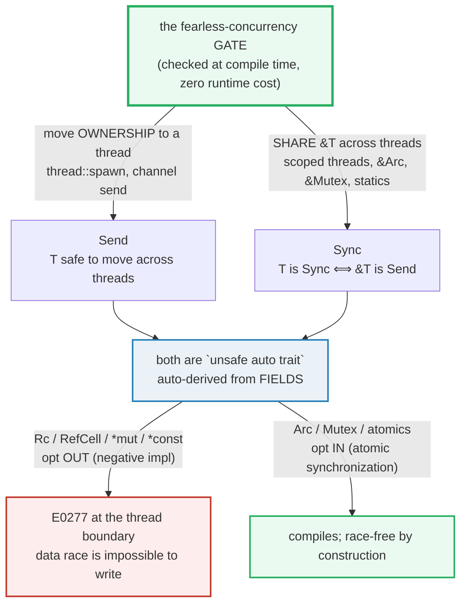

# SEND_SYNC — The Marker Traits That Prove Thread-Safety

> **One-line goal:** `Send` means a type's ownership can be **moved** to another
> thread; `Sync` means its shared reference `&T` can be **shared** across threads
> (`T: Sync` ⟺ `&T: Send`). Both are **`unsafe auto` marker traits** the compiler
> uses to *prove* — at compile time, with zero runtime cost — that a type is safe
> in concurrent code. That static proof is the whole of Rust's "fearless
> concurrency."
>
> **Run:** `just run send_sync` (== `cargo run --bin send_sync`)
> **Member:** `core` (stdlib-only — no `[dependencies]`).
> **Prerequisites:** 🔗 [OWNERSHIP](./OWNERSHIP.md) (move semantics — `Send` *is* a
> move across a thread boundary), 🔗 [THREADS](./THREADS.md) (`thread::spawn`
> requires `F: Send + 'static`), 🔗 [BOX_RC_ARC](./BOX_RC_ARC.md) (`Rc` vs `Arc`).
> **Ground truth:** [`send_sync.rs`](./send_sync.rs); captured stdout:
> [`send_sync_output.txt`](./send_sync_output.txt).

---

## Why this exists (lineage)

`thread::spawn` hands a closure to a *different* OS thread. The closure may
outlive the function that created it, so it must own its data (`'static`) and be
safe to relocate (`Send`). Once two threads exist, they may also need to *look at
the same data* through shared references — that requires `Sync`. These two
traits are the **type-system gate** the compiler closes over *every* value that
crosses a thread boundary:



The bet ([Rustnomicon — Send and Sync][nomicon]): "Send and Sync are fundamental
to Rust's concurrency story… they're unsafe traits… Send and Sync are also
automatically derived traits… if a type is composed entirely of Send or Sync
types, then it is Send or Sync. Almost all primitives are Send and Sync." A
non-`Send`/non-`Sync` type is rejected **at the thread boundary with `E0277`** —
the data race is not merely discouraged, it is *uncompilable*.

---

## The two definitions (memorize these)

From `std::marker` ([`Send`][std-send], [`Sync`][std-sync]) and the
[Rustnomicon][nomicon]:

```rust
pub unsafe auto trait Send { }   // "Types that can be transferred across thread boundaries."
pub unsafe auto trait Sync { }   // "Types for which it is safe to share references between threads."
```

- **`Send`** — a type `T` is `Send` if it is safe to **move** ownership of `T` to
  another thread. The move is *exclusive* (no sharing) — the same ownership rule
  as 🔗 [OWNERSHIP](./OWNERSHIP.md), just across a thread boundary.
- **`Sync`** — the precise definition: **`T` is `Sync` if and only if `&T` is
  `Send`**. I.e. it is safe for *many* threads to hold `&T` at the same time.

Four things make them special (all from the [Nomicon][nomicon]):

1. **`unsafe`** — implementing them by hand is `unsafe`, because *other* unsafe
   code is allowed to *assume* they are correct. Getting it wrong is UB.
2. **`auto`** — unlike every other trait, they are **derived automatically** from
   a type's fields (a struct is `Send`/`Sync` if all its fields are). You almost
   never write `impl Send`.
3. **marker traits** — they have **no methods / no associated items**. To have
   the trait *is* the promise; there is nothing to call.
4. **opt-out / opt-in** — you can `impl !Send`/`!Sync` (negative impls) to leave
   an auto-trait, or `unsafe impl Send`/`Sync` to join one the compiler can't
   prove.

### The witness-function technique (used throughout this bundle)

Because `Send`/`Sync` are compile-time properties, the bundle **proves** them
with an empty generic fn — a *witness*:

```rust
fn assert_send<T: Send + ?Sized>() {}
fn assert_sync<T: Sync + ?Sized>() {}

assert_send::<Arc<i32>>();   // compiles  -> Arc<i32>: Send is PROVEN
assert_sync::<Mutex<i32>>(); // compiles  -> Mutex<i32>: Sync is PROVEN
// assert_send::<Rc<i32>>(); // E0277      -> Rc<i32> is NOT Send (documented below)
```

The call has no runtime effect (the body is empty; it is monomorphized away).
**If it compiles, the bound holds — that is the proof.** Calling a witness that
fails is exactly the `E0277` a real thread boundary would produce, which is how
this bundle documents the negative cases without breaking the build.

---

## Section A — `Send`: ownership can be MOVED to another thread

```rust
fn assert_send<T: Send + ?Sized>() {}
assert_send::<i32>();      // primitives are Send
assert_send::<String>();   // composite of Send fields -> auto Send
```

> **From send_sync.rs Section A:**
> ```
> ======================================================================
> SECTION A — Send: ownership can be MOVED to another thread
> ======================================================================
>   assert_send::<i32/bool/String/Vec<u8>>() all compiled -> these types are Send
> [check] primitives + String + Vec<u8> are Send (witness compiled): OK
> [check] a type is auto-Send when ALL its fields are Send (the auto-trait rule): OK
> ```

**What.** Each witness call compiles, proving `i32`, `bool`, `String`, `Vec<u8>`
are all `Send`. `Send` is the trait `thread::spawn`'s closure must satisfy (along
with `'static`) so that moving the captured value to the new thread is sound.

**Why (internals).** The Nomicon: "Almost all primitives are Send and Sync, and
as a consequence pretty much all types you'll ever interact with are Send and
Sync." The mechanism is the **auto-trait cascade**: a struct/enum is `Send` when
*every* field is `Send`. `String` is `{ Vec<u8> }` internally; `Vec<u8>` is a
`(ptr, len, cap)` of `Send` primitives; so all three are `Send` for free. There
is no runtime check — the proof is entirely in the types.

> **`Send` ≠ "can be read on another thread".** It means *ownership* can be
> *moved* there. After the move, the source binding is poisoned exactly as in
> 🔗 [OWNERSHIP](./OWNERSHIP.md) Section A. The thread now exclusively owns the
> value. Sharing — many readers — is `Sync`'s job (Section B).

---

## Section B — `Sync`: `&T` can be SHARED (`T: Sync` ⟺ `&T: Send`)

```rust
fn assert_sync<T: Sync + ?Sized>() {}
assert_sync::<String>();    // &String can cross threads

// the three reference rules (verbatim from std::marker::Sync):
assert_send::<&String>();       //  &T       is Send  iff T: Sync
assert_send::<&mut String>();   //  &mut T   is Send  iff T: Send
assert_sync::<&mut String>();   //  &mut T   is Sync  iff T: Sync
```

> **From send_sync.rs Section B:**
> ```
> ======================================================================
> SECTION B — Sync: &T can be SHARED across threads (T is Sync iff &T is Send)
> ======================================================================
>   assert_sync::<i32/bool/String/str>() all compiled -> these types are Sync
> [check] primitives + String + str are Sync (witness compiled): OK
>   &String, &mut String: Send/Sync witnesses all compiled (the reference rules)
> [check] &T is Send iff T: Sync; &mut T is Send iff T: Send; both refs Sync iff T: Sync: OK
> [check] &mut T is Sync (when T: Sync): a & &mut T is read-only, so no race: OK
> ```

**What.** `assert_sync::<str>()` compiles (note `str` is unsized — the witness is
`?Sized` so it can prove `str`, slices, and `dyn Trait`). The four reference
witnesses all compile, confirming the three rules the `std::marker::Sync` docs
state verbatim:

| Expression | Is `Send`/`Sync` iff |
|---|---|
| `&T`       | `Send` iff `T: Sync` |
| `&mut T`   | `Send` iff `T: Send` |
| `&T`, `&mut T` | `Sync` iff `T: Sync` |

**Why (internals).** The surprising one is `&mut T` being `Sync`. Mutation
through a shared reference sounds like a data race waiting to happen. The
[Nomicon][nomicon]/std resolution: a mutable reference **behind** a shared
reference — `& &mut T` — collapses to read-only, "as if it were a `& &T`". You
can copy the `&mut T` itself (it's a `Copy` pointer), but you cannot *reborrow
it mutably* through that `&`, so there is no unsynchronized write. Hence
`&mut T: Sync` whenever `T: Sync` is sound.

> **The one-liner to hold in your head:** *`Sync` is `Send` applied to `&T`.*
> If you can move a `&T` to another thread (`&T: Send`), then `T` is `Sync`. The
> witness `assert_send::<&T>()` *is* the test for `T: Sync`.

---

## Section C — Why `Rc` is `!Send` and `!Sync` (the non-atomic refcount)

`Rc<T>` is the *single-threaded* reference-counted pointer. On one thread it is
correct and fast; across threads it is **undefined behavior**, so the compiler
forbids it.

> **From send_sync.rs Section C:**
> ```
> ======================================================================
> SECTION C — Rc is !Send and !Sync: the refcount is NOT atomic
> ======================================================================
>   let rc = Rc::new(42i32);  let rc2 = Rc::clone(&rc);
>     Rc::strong_count(&rc) = 2  (two owners)
> [check] two Rc clones share one allocation (strong_count == 2): OK
>   drop(rc2);  Rc::strong_count(&rc) = 1
> [check] dropping a clone decrements the count back to 1: OK
>   Rc<i32> is !Send/!Sync: moving it to a thread would be E0277 (use Arc)
> [check] Rc's non-atomic refcount is WHY it is !Send/!Sync; Arc is the fix: OK
>   Cell<i32> and RefCell<i32> are Send (T: Send) but !Sync
> [check] Cell/RefCell are Send iff T: Send, but always !Sync (no synchronization): OK
> ```

**What.** `Rc::clone` bumps a counter to `2`; dropping a clone brings it back to
`1`. That counter is a **plain integer**. The `std::marker::Send` docs say
exactly why `Rc` is opted out: *"If two threads attempt to clone `Rc`s that point
to the same reference-counted value, they might try to update the reference count
at the same time, which is undefined behavior because `Rc` doesn't use atomic
operations."* The [Nomicon][nomicon] lists `Rc` as one of the three fundamental
non-thread-safe types (with `UnsafeCell` and raw pointers): *"`Rc` isn't Send or
Sync (because the refcount is shared and unsynchronized)."*

**The compile error — `E0277` at the thread boundary (cannot live in the runnable
`.rs`, shown verbatim):**

```console
//   assert_send::<Rc<i32>>();      // a witness call
//   let h = thread::spawn(move || { let _ = rc; });

error[E0277]: `Rc<i32>` cannot be sent between threads safely
  --> src/main.rs:3:20
   |
 3 |     let h = thread::spawn(move || {
   |                    ^^^^^^^^^^^^^ `Rc<i32>` cannot be sent between threads safely
   |
   = help: within `[closure@src/main.rs:3:34: 3:36]`, the trait `Send` is not
           implemented for `Rc<i32>`
```

And the witness variant is the same `E0277`:

```console
error[E0277]: the trait bound `Rc<i32>: Send` is not satisfied
 --> src/main.rs:2:5
  |
1 | fn assert_send<T: Send + ?Sized>() {}
|    ---------------------------------  required by this bound
2 |     assert_send::<Rc<i32>>();
|     ^^^^^^^^^^^^^^^^^^^^^ the trait `Send` is not implemented for `Rc<i32>`
```

**Why (internals).** A lost increment in the refcount means the count drifts: one
clone thinks it is the last owner and frees the allocation while another clone
still reads it — a **double-free / use-after-free**. The fix is `Arc`
(**A**tomically `Rc`): identical API, but the counter uses atomic `fetch_add`/
`fetch_sub`, so concurrent clones/drops are race-free (at a small perf cost — see
🔗 [ATOMICS](./ATOMICS.md) and 🔗 [BOX_RC_ARC](./BOX_RC_ARC.md)). `Arc<T>` is then
`Send + Sync` (Section D).

**The interior-mutability cousins — `Cell`/`RefCell` are `!Sync`.** The same
logic opts them out of `Sync` (though not `Send`): they let you mutate through a
*shared* `&T` using only a single-threaded borrow flag, with **no
synchronization**. The `std::marker::Sync` docs: *"`Cell::set` takes `&self`…
performs no synchronization, thus `Cell` cannot be `Sync`."* They *are* `Send`
when `T: Send` (the witness `assert_send::<Cell<i32>>()` compiles) — you may
**move** one to a thread; you just may not **share** `&` to it. 🔗
[INTERIOR_MUTABILITY](./INTERIOR_MUTABILITY.md).

---

## Section D — `Arc<T>` is `Send + Sync` iff `T: Send + Sync` (atomic refcount)

```rust
assert_send::<Arc<i32>>();
assert_sync::<Arc<i32>>();

// runtime proof of Send: move an Arc clone to a thread, read it there
let a  = Arc::new(42i32);
let a2 = Arc::clone(&a);                       // atomic strong_count -> 2
let (v, c) = thread::spawn(move || (*a2, Arc::strong_count(&a2)))
    .join().unwrap();                          // a2 moved across the boundary
// after join, a2 dropped in the worker -> a's count back to 1
```

> **From send_sync.rs Section D:**
> ```
> ======================================================================
> SECTION D — Arc<T> is Send + Sync iff T: Send + Sync (atomic refcount)
> ======================================================================
>   assert_send::<Arc<i32>>() and assert_sync::<Arc<i32>>() both compiled
> [check] Arc<i32> is Send + Sync (witness compiled): OK
>   let a = Arc::new(42i32);  let a2 = Arc::clone(&a);  count = 2
> [check] cloning an Arc bumps the atomic strong_count to 2: OK
>   moved a2 to a thread; thread read value=42, strong_count=2
>   after join (a2 dropped in worker): strong_count(&a) = 1
> [check] Arc moved to a thread: value preserved (42), count seen there was 2: OK
> [check] the moved Arc clone dropped in the worker; main's count fell to 1: OK
> ```

**What.** Both witnesses compile. Then a runtime demo *uses* `Send`: an `Arc`
clone is **moved** into a spawned thread, which reads `42` and observes the
strong count is `2` (it + main). After `join`, the worker's clone is dropped
there and main's count returns to `1`.

**Why (internals).** The std `impl`s for `Arc` are (from [`Send`][std-send] and
[`Sync`][std-sync]):

```rust
impl<T: ?Sized + Sync + Send, A: Allocator + Send> Send for Arc<T, A> {}
impl<T: ?Sized + Sync + Send, A: Allocator + Sync> Sync for Arc<T, A> {}
```

So **`Arc<T>: Send + Sync` requires `T: Send + Sync`** — not just `Send`. The
`Sync` half of the requirement on `T` exists because handing out `&T` through
`&Arc<T>` (via `Deref`) must be sound for many threads at once. The atomic
counter is what makes the *pointer itself* safe; the `T: Send + Sync` bound is
what makes the *pointee* safe. 🔗 [BOX_RC_ARC](./BOX_RC_ARC.md) for the full
`Rc`-vs-`Arc` cost comparison.

> **`Arc` makes things *shareable*, not *mutable*.** `&Arc<T>` only gives out
> `&T`. To mutate shared data you wrap it: `Arc<Mutex<T>>` or `Arc<RwLock<T>>`
> (Section E, 🔗 [MUTEX_RWLOCK](./MUTEX_RWLOCK.md)). `Arc::get_mut` works only
> when you hold the *sole* `Arc`.

---

## Section E — `Mutex<T>: Sync` iff `T: Send` (interior mutability *with* sync)

```rust
assert_send::<Mutex<i32>>();
assert_sync::<Mutex<i32>>();   // note: needs only i32: Send, NOT i32: Sync

// runtime proof of Sync: SHARE &Mutex across two scoped threads
let m = Mutex::new(0i32);
thread::scope(|s| {
    s.spawn(|| *m.lock().unwrap() += 10);   // borrows &m
    s.spawn(|| *m.lock().unwrap() += 5);    // borrows &m
});                                          // both join before we read
assert_eq!(*m.lock().unwrap(), 15);
```

> **From send_sync.rs Section E:**
> ```
> ======================================================================
> SECTION E — Mutex<T>: Sync iff T: Send; runtime proof with two sharers
> ======================================================================
>   assert_send::<Mutex<i32>>() and assert_sync::<Mutex<i32>>() both compiled
> [check] Mutex<i32> is Send + Sync (witness compiled; needs only i32: Send): OK
>   let m = Mutex::new(0i32);  two scoped threads each lock and add
>   before=0 -> after=15  (10 + 5 added under the lock)
> [check] two threads shared &Mutex and added 10+5 == 15 (Mutex: Sync, race-free): OK
> [check] MutexGuard is !Send but lets you read &T here safely: OK
> ```

**What.** Both witnesses compile. The runtime demo is the *operational* meaning
of `Sync`: two scoped threads hold **`&Mutex<i32>` simultaneously** (each
`.lock()` takes `&self`), mutate the protected `i32` one at a time, and the
result is exactly `15` — no lost update, even though the OS may interleave the
threads arbitrarily.

**Why (internals).** The std `impl`s (with the note attached to them in
[`Sync`][std-sync]):

```rust
impl<T: ?Sized + Send> Send for Mutex<T> {}
impl<T: ?Sized + Send> Sync for Mutex<T> {}
// "T must be Send for Mutex<T> to be Sync... it is not necessary for T to be Sync
//  as &T is only made available to ONE thread at a time."
```

The key insight: `Mutex` makes a type `Sync` even when `T` is only `Send`. It can
do this because the lock guarantees only **one** thread holds the data at a time
— `&T` is never *truly* shared unsynchronized. That is exactly why
`Mutex<Rc<_>>` is a trap (see pitfalls): the mutex guards one `Rc` but not the
others it is linked to.

**The guard subtlety (expert payoff).** `MutexGuard<'_, T>` is **`!Send`** but
`Sync` iff `T: Sync`. From the [Nomicon][nomicon]: *"notice how `MutexGuard` is
not `Send`… you don't try to free a lock that you acquired in a different
thread."* On pthreads the lock must be **released on the thread that acquired
it**, so the guard's `Drop` must run locally; making it `!Send` enforces that. It
*can* be `Sync` because dropping an `&MutexGuard` does nothing — you only get
`&T` out of `&guard` via `Deref`. 🔗 [MUTEX_RWLOCK](./MUTEX_RWLOCK.md).

---

## Section F — A struct is auto `Send`/`Sync` iff ALL fields are; one `Rc` field opts out

```rust
struct Good { n: i32, s: String }      // every field Send+Sync -> Good is auto Send+Sync
assert_send::<Good>();
assert_sync::<Good>();

struct NotThreadSafe { _marker: PhantomData<*const ()> }  // STABLE opt-out
// assert_send::<NotThreadSafe>();      // E0277: *const () is !Send -> the struct is !Send
```

> **From send_sync.rs Section F:**
> ```
> ======================================================================
> SECTION F — a struct is auto Send/Sync iff ALL fields are; one Rc field opts out
> ======================================================================
>   struct Good { n: i32, s: String } -> assert_send/sync::<Good>() compiled
> [check] Good (all fields Send+Sync) is auto Send + auto Sync; values intact: OK
>   adding an Rc<String> field -> the whole struct becomes !Send/!Sync
> [check] one !Send field (Rc) opts the WHOLE struct out of Send (auto-cascade): OK
>   NotThreadSafe(PhantomData<*const ()>) is !Send/!Sync on STABLE Rust
> [check] stable opt-out: PhantomData<*const ()> makes a struct !Send/!Sync: OK
> [check] opt-IN: `unsafe impl Send/Sync` asserts thread-safety the compiler can't prove: OK
> ```

**What.** `Good { n: i32, s: String }` has only `Send`+`Sync` fields, so the
auto-trait cascade makes it `Send` and `Sync` **with zero code from you** — both
witnesses compile. Add one `Rc` field and the **entire** struct becomes
`!Send`/`!Sync`.

**The compile error — adding an `Rc` field opts the whole struct out (cannot live
in the runnable `.rs`, verbatim):**

```console
//     struct Bad { n: i32, r: Rc<String> }
//     assert_send::<Bad>();

error[E0277]: the trait bound `Rc<String>: Send` is not satisfied
 --> src/main.rs:3:5
  |
1 |   struct Bad { n: i32, r: Rc<String> }
  |                          ----------- required because it's used within `Bad`
2 |   fn assert_send<T: Send + ?Sized>() {}
3 |     assert_send::<Bad>();
  |     ^^^^^^^^^^^^^^^^^^ the trait `Send` is not implemented for `Rc<String>`
```

**Why (internals).** The auto-trait rule is a **short-circuit over fields**: *all
fields must qualify, or none of it does*. One `Rc` (or `*const`, or `Cell`)
field is enough to poison a 50-field struct — which is almost always what you
want (the conservative default is "not thread-safe until proven"). The [Nomicon]
[nomicon] notes this is why raw pointers are `!Send`/`!Sync` *as a lint*: it
stops types built on them from being silently auto-marked thread-safe.

### Opt-out (stable) vs opt-out (nightly) vs opt-in

| Goal | Mechanism | Stable? |
|---|---|---|
| **Opt OUT** of an auto-trait on stable | add a `PhantomData<*const ()>` (or `PhantomData<Rc<T>>`) field — `*const` is `!Send`+`!Sync`, so the cascade opts the struct out | ✅ stable |
| **Opt OUT** explicitly | `impl !Send for MyType {}` / `impl !Sync` (negative impls) | ⛔ nightly (`#![feature(negative_impls)]`) |
| **Opt IN** when the compiler can't prove it | `unsafe impl Send for MyType {}` / `unsafe impl Sync` | ✅ stable (but `unsafe` — *you* own the soundness proof) |

The `PhantomData<*const ()>` trick is how stable Rust has always opted out of
auto-traits "via lack-of-auto-trait-impl structural infection from Phantom types"
(see the [`negative` crate][negative-crate] writeup). The nightly `negative_impls`
feature is the explicit spelling the [Nomicon][nomicon] shows:

```rust
#![feature(negative_impls)]
struct SpecialThreadToken(u8);
impl !Send for SpecialThreadToken {}
impl !Sync for SpecialThreadToken {}
```

**Opt-in** (`unsafe impl Send/Sync`) is for when *you* know a type is thread-safe
but the compiler can't see it — typically a type wrapping a raw pointer that is
in fact uniquely owned (the Nomicon's hand-rolled `Box`-alike, `Carton`).
Crucially, the [Nomicon][nomicon] warns: *"in and of itself it is impossible to
incorrectly derive Send and Sync. Only types that are ascribed special meaning by
other unsafe code can possibly cause trouble."* Get an `unsafe impl` wrong and
you invite UB that the type system can no longer catch.

---

## Pitfalls (the expert payoff)

| Trap | Symptom | Fix / why |
|---|---|---|
| **`thread::spawn` with an `Rc` capture** | `E0277: \`Rc<T>\` cannot be sent between threads safely` | `Rc`'s refcount is non-atomic. Swap `Rc`→`Arc` (atomic). The error is the gate *working*. |
| **Sharing `&Rc` across threads** | same `E0277` (Rc is `!Sync` too) | `&Rc<T>` is `!Send` because `Rc` is `!Sync`. Use `Arc`. |
| **`RefCell`/`Cell` behind a shared `static`/`&`** | `E0277: the trait \`Sync\` is not implemented for \`RefCell<T>\`` | Interior mutability with no synchronization. Use `Mutex`/`RwLock`/`Atomic*`. 🔗 [INTERIOR_MUTABILITY](./INTERIOR_MUTABILITY.md) |
| **`Mutex<Rc<T>>` is NOT thread-safe** | compiles, but races anyway | The mutex guards *one* `Rc`; other clones of it are unguarded. `Rc` is `!Send`, so `Mutex<Rc<_>>` ends up `!Send`/`!Sync` — but `Rc`-like *logic* (a non-atomic shared thing) wrapped in a mutex is still wrong. Use `Arc` for sharing. |
| **Sending a `MutexGuard` to another thread** | `E0277` — `MutexGuard` is `!Send` | Must drop the guard on the thread that locked it (pthread requirement). Send the *value* out, or do the work under the lock locally. |
| **Struct silently becomes `!Send`** | a type that "should" cross threads now fails `E0277` | One field (`Rc`/`Cell`/`*mut`/`PhantomData<*const ()>`) opts the whole struct out. Audit fields; the error names the offending type. |
| **`impl !Send` won't compile on stable** | `negative impls are unstable` | Use the stable `PhantomData<*const ()>` field instead (this bundle's `NotThreadSafe`). Nightly has `#![feature(negative_impls)]`. |
| **Wrong `unsafe impl Send/Sync`** | silent UB (no compiler help) | `Send`/`Sync` are `unsafe` *traits*: other unsafe code assumes them correct. Only `unsafe impl` when you can write the soundness proof (unique ownership, no aliased mutation). |
| **Expecting `&mut T` to be `!Sync`** | "but it's mutation through a shared ref!" | `&mut T` is `Sync` when `T: Sync`: `& &mut T` collapses to read-only. The mutation requires `&mut` to the guard, which the borrow checker keeps exclusive. |
| **Treating `Send`/`Sync` as runtime checks** | "where do I call `.send()`?" | They are **marker traits** with no methods — compile-time proofs only. The "check" is that the code compiles. Use a witness fn (`fn assert_send<T: Send>() {}`). |
| **`Arc` makes data mutable** | `&Arc<T>` won't let you mutate `T` | `Arc` only *shares*; to mutate wrap in `Mutex`/`RwLock` (`Arc<Mutex<T>>`). `Arc::get_mut` needs the sole `Arc`. |

---

## Cheat sheet

```rust
// DEFINITIONS (std::marker — unsafe auto marker traits, no methods):
//   T: Send   -> ownership of T can be MOVED to another thread
//   T: Sync   -> &T can be SHARED across threads   (T: Sync  <=>  &T: Send)

// AUTO-DERIVE: a struct/enum is Send/Sync iff ALL its fields are.
//   primitives (i32, bool, f64, &T...) are Send+Sync -> "almost everything" is.

// THE WITNESS TECHNIQUE (compile-time proof, zero runtime cost):
fn assert_send<T: Send + ?Sized>() {}
fn assert_sync<T: Sync + ?Sized>() {}
assert_send::<Arc<i32>>();      // compiles  -> Arc<i32>: Send PROVEN
assert_sync::<Mutex<i32>>();    // compiles  -> Mutex<i32>: Sync PROVEN
// assert_send::<Rc<i32>>();    // E0277      -> Rc<i32> is NOT Send

// REFERENCE RULES (std::marker::Sync):
//   &T       is Send  iff T: Sync
//   &mut T   is Send  iff T: Send
//   &T, &mut T are Sync iff T: Sync

// WHO IS WHAT:
//   i32/String/Vec/Box    : Send + Sync            (plain ownership)
//   Rc<T>                 : !Send + !Sync          (non-atomic refcount)
//   Cell<T>/RefCell<T>    : Send (iff T:Send), !Sync (unsynchronized interior mut)
//   Arc<T>                : Send + Sync  iff T: Send + Sync   (atomic refcount)
//   Mutex<T>              : Send + Sync  iff T: Send          (Sync needs only T:Send)
//   RwLock<T>             : Send + Sync  iff T: Send + Sync
//   *const T / *mut T     : !Send + !Sync          (lint: stop auto-derive)
//   MutexGuard<'_, T>     : !Send; Sync iff T: Sync (drop on the locking thread)

// OPT-OUT  (stable): put a  PhantomData<*const ()>  field in your struct.
// OPT-OUT  (nightly): impl !Send for MyType {}   (needs #![feature(negative_impls)])
// OPT-IN   (stable):  unsafe impl Send for MyType {}   // YOU own the soundness proof
```

---

## Sources

Every claim above was web-verified in at least two authoritative places.

- **The Rustonomicon — "Send and Sync"** — the canonical deep reference: `Send`
  = safe to send to another thread; `Sync` = `&T` is `Send`; they are `unsafe`
  marker traits; *automatically derived* (a type composed entirely of Send/Sync
  types is Send/Sync); primitives are Send+Sync; the three exceptions
  (`UnsafeCell`/`Cell`/`RefCell` is `!Sync`; `Rc` is `!Send`/`!Sync` because the
  refcount is shared and unsynchronized; raw pointers are `!Send`/`!Sync` as a
  lint); `unsafe impl Send/Sync` to opt in; `impl !Send`/`!Sync` to opt out
  (nightly `negative_impls`); `MutexGuard` is `!Send` but may be `Sync`:
  https://doc.rust-lang.org/nomicon/send-and-sync.html
- **`std::marker::Send` docs** — `pub unsafe auto trait Send {}`; "Types that can
  be transferred across thread boundaries"; the `Rc` non-atomic-refcount example
  and the `Arc` (atomic) fix; the `impl Send for &T where T: Sync` rule;
  `Cell<T>`/`RefCell<T>` are `Send` iff `T: Send`; raw pointers/`NonNull` are
  `!Send`:
  https://doc.rust-lang.org/std/marker/trait.Send.html
- **`std::marker::Sync` docs** — `pub unsafe auto trait Sync {}`; the precise
  definition `T: Sync <=> &T: Send`; the three reference rules (`&T` Send iff
  `T: Sync`; `&mut T` Send iff `T: Send`; both refs Sync iff `T: Sync`); why
  `&mut T` can be `Sync`; `Cell`/`RefCell`/`Rc` are `!Sync` via interior
  mutability / non-atomic counts; `Mutex<T>: Sync iff T: Send` with the
  "only one thread at a time" note; `Arc<T>: Sync iff T: Send+Sync`:
  https://doc.rust-lang.org/std/marker/trait.Sync.html
- **The Rust Programming Language, ch16.1 "Using Threads to Run Simultaneously"**
  — `thread::spawn` requires `F: FnOnce() + Send + 'static`; the `move` closure
  transfers ownership into the thread (the runtime meaning of `Send`); the
  `E0373`/`E0382` ownership errors at the thread boundary:
  https://doc.rust-lang.org/book/ch16-01-threads.html
- **The `negative` crate docs.rs description** — independent corroboration that
  "the way stable Rust traditionally opts out of auto-traits is via
  lack-of-auto-trait-impl structural infection from Phantom types" (the
  `PhantomData<*const ()>` stable technique vs nightly `negative_impls`):
  https://docs.rs/negative
