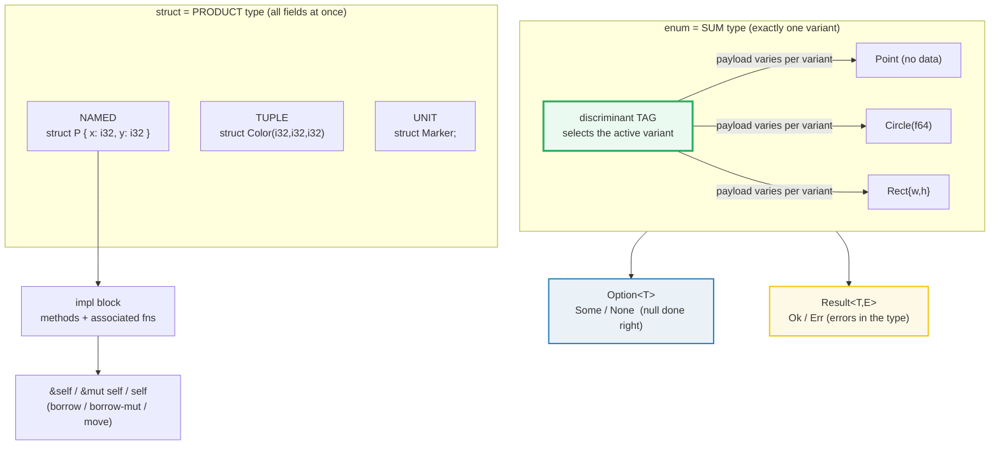
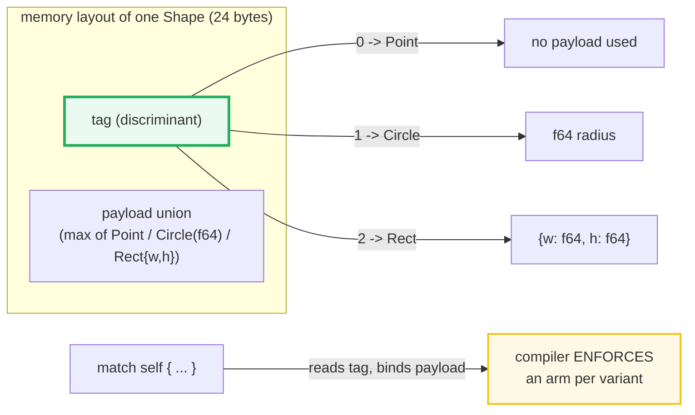

# STRUCTS_ENUMS — Named/Tuple/Unit Structs, Tagged-Union Enums, and the `Option`/`Result` Stdlib Enums

> **One-line goal:** a **struct** bundles fields (named, tuple, or none) into one
> type; an **enum** is a *tagged union* (one discriminant tag + a per-variant
> payload, only one active at a time); the stdlib `Option<T>` and `Result<T,E>`
> enums are Rust's answer to *null* and to *errors*.
>
> **Run:** `just run structs_enums` (== `cargo run --bin structs_enums`)
> **Member:** `core` (stdlib-only — no `[dependencies]`).
> **Prerequisites:** [OWNERSHIP](./OWNERSHIP.md) — `self` by value *moves*; `&self`
> borrows; you cannot read Section A's `&mut self` vs Section F's `Copy` without
> the move/copy distinction. Then [CONTROL_FLOW](./CONTROL_FLOW.md) for `match`.
> **Ground truth:** [`structs_enums.rs`](./structs_enums.rs); captured stdout:
> [`structs_enums_output.txt`](./structs_enums_output.txt).

---

## Why this exists (lineage)

Most languages pick **one** product-type (record/struct) and bolt a nullable
reference onto every type for "absence" and exceptions for "errors". Rust does
both jobs with **sum types** and a pair of ubiquitous stdlib enums:

| Need | C / Java / Go | Rust |
|---|---|---|
| **Group related fields** | `struct` / `class` / `struct` | `struct` — three flavors (named, tuple, unit) |
| **"One of N shapes" of data** | `union` (unsafe) + a hand-rolled tag, or class hierarchies | `enum` — a *tagged union*; the compiler tracks the tag |
| **"A value that may be absent"** | `NULL` / `null` / `nil` pointers (Tony Hoare's billion-dollar mistake) | `Option<T>` — `Some(T)` / `None`, never a raw null |
| **"An operation that may fail"** | exceptions / `(value, error)` tuples / `err != nil` | `Result<T,E>` — `Ok(T)` / `Err(E)`, the error is in the type |

The unifying idea: **make impossible states unrepresentable.** An `enum` value
is *exactly one* variant, and `match` is *exhaustive* — the compiler refuses to
let you forget a variant. `Option` and `Result` push null and errors out of the
runtime and into the type system, so "did you handle the absent/failed case?" is
checked at compile time, not discovered at 3 a.m. in production.



---

## Section A — A named struct + `impl`: methods, associated fns, `&self`/`&mut self`

```rust
#[derive(Debug, Clone, Copy, PartialEq)]
struct Point { x: i32, y: i32 }

impl Point {
    fn new(x: i32, y: i32) -> Self { Point { x, y } }   // associated fn (no self)
    fn manhattan(&self) -> i32 { self.x.abs() + self.y.abs() }   // borrows immutably
    fn translate(&mut self, dx: i32, dy: i32) { self.x += dx; self.y += dy; } // &mut
}

let p = Point::new(3, 4);
let r = Point { y: 100, ..p };   // struct update syntax: ..p fills the rest
```

> **From structs_enums.rs Section A:**
> ```
> ======================================================================
> SECTION A — named struct + impl: &self, &mut self, associated fn, update
> ======================================================================
>   Point::new(3, 4)        -> Point { x: 3, y: 4 }
>   p.manhattan() = |3|+|4| = 7
> [check] Point{x:3,y:4}.manhattan() == 7: OK
>   q.translate(2, 5)       -> Point { x: 3, y: 6 }
> [check] &mut self mutates in place: (1,1)+(2,5) == (3,6): OK
>   Point { y: 100, ..p } -> Point { x: 3, y: 100 }
> [check] update syntax copies x: Point{y:100,..P{3,4}} == (3,100): OK
> [check] source p still usable after `..p` (Point is Copy): OK
> ```

**What.** Four facts are pinned. `Point::new(3,4)` is an **associated function**
(no `self`) — a constructor, called as `Type::name(...)` exactly like `Vec::new`.
`manhattan(&self)` borrows immutably and returns `7`. `translate(&mut self)`
mutates the receiver in place: `(1,1)+(2,5)` becomes `(3,6)`. Struct-update
syntax `Point { y: 100, ..p }` copies every field you didn't name from `p`, and
because `Point` is `Copy` the source `p` is still usable afterwards.

**Why (internals).**
- **Field init shorthand.** Inside `new`, `{ x, y }` is shorthand for
  `{ x: x, y: y }` — legal whenever a parameter has the same name as the field
  ([Book ch5.1][book-structs]).
- **`self` is a receiver with ownership meaning.** `&self` = borrow a shared
  reference (caller keeps ownership, many readers allowed); `&mut self` = borrow
  a unique reference (caller keeps ownership, exclusive writer); `self` (by
  value) = **move** (or copy, if `Copy`) the receiver *into* the method, so the
  caller can't use it afterwards. This is exactly [OWNERSHIP](./OWNERSHIP.md)
  applied to method receivers — the three forms are three borrowing choices.
- **`Self` is the implementing type.** `fn new(...) -> Self` returns `Point`
  without spelling it; refactoring the struct name doesn't break the impl.
- **Struct update = move/copy per field.** `..p` moves (or, for `Copy` fields,
  copies) each remaining field out of `p`. The Book: "the struct update syntax
  uses `=` like an assignment; this is because it moves the data" — so if `p`
  had a non-`Copy` `String` field that `r` inherited, `p` would be **partially
  moved** and unusable. Here every field is `i32` (`Copy`), so `p` survives whole
  ([Book ch5.1][book-structs]).
- **Methods are free functions with sugar.** `p.manhattan()` desugars to
  `Point::manhattan(&p)`. The `impl` block just collects functions under the
  type's namespace; there is no vtable unless you ask for one via `dyn`
  (🔗 [TRAITS_BASICS](./TRAITS_BASICS.md)).

> **Tuple structs and unit structs use the same `impl`.** Section B shows them;
  `impl` works identically. You can even `impl` an enum (Section C).

---

## Section B — Tuple struct (positional fields) + unit struct (no fields)

```rust
struct Color(i32, i32, i32);   // tuple struct: .0 .1 .2
struct Marker;                 // unit struct: no fields at all

let red = Color(255, 0, 0);
let Color(r, g, b) = red;      // destructure (must name the type)
let _m = Marker;               // instantiate by name, no parens
```

> **From structs_enums.rs Section B:**
> ```
> ======================================================================
> SECTION B — tuple struct (.0/.1 access) + unit struct (0 bytes)
> ======================================================================
>   let red = Color(255, 0, 0);
>     red.0 = 255, red.1 = 0, red.2 = 0
> [check] tuple struct fields are positional: red.0 == 255: OK
>   let Color(r, g, b) = red; -> (255, 0, 0)
> [check] tuple struct destructures by position: (r,g,b)==(255,0,0): OK
>   let _m = Marker;   // unit struct: no data
> [check] unit struct Marker occupies 0 bytes: OK
> ```

**What.** A **tuple struct** wraps an anonymous tuple and gives it a *new
nominal type*: `Color(255,0,0)` and a plain `(i32,i32,i32)` are **not** the same
type, and neither is a hypothetical `Point3d(255,0,0)` — the name *is* the type.
Fields are accessed positionally (`red.0`) and destructured with the type name
(`let Color(r,g,b) = red`). A **unit struct** (`struct Marker;`) has **zero**
fields and **zero bytes** (`size_of::<Marker>() == 0`).

**Why (internals).**
- **Newtypes via tuple structs.** The classic Rust pattern `struct Meters(f64)`
  gives `Meters` a distinct type from `f64`, so the compiler stops you adding
  `Meters` to `Seconds` — zero-cost type safety. This is called the *newtype
  pattern* and it costs nothing at runtime (the wrapper is free under
  `#[repr(transparent)]`).
- **Unit structs are markers / trait targets.** With no data, a unit struct's
  only job is to *carry behavior* — you `impl Trait for Marker` without storing
  anything (🔗 [TRAITS_BASICS](./TRAITS_BASICS.md)). Famous example: `std::marker::PhantomData`
  is a zero-sized type used to "declare" a type parameter without storing it.
- **Visibility of tuple fields.** Tuple-struct fields inherit the struct's
  visibility, but you can write `pub struct Foo(pub i32, i32)` to expose `.0`
  while hiding `.1` — a finer-grained control than named structs offer.

---

## Section C — An enum is a tagged union: one tag, a per-variant payload

```rust
enum Shape {
    Point,                  // unit-like variant: no data
    Circle(f64),            // tuple variant: positional payload
    Rect { w: f64, h: f64 },// struct variant: named-field payload
}

impl Shape {
    fn area(&self) -> f64 {            // match is EXHAUSTIVE
        match self {
            Shape::Point        => 0.0,
            Shape::Circle(r)    => PI * r * r,
            Shape::Rect { w, h } => w * h,
        }
    }
}
```

> **From structs_enums.rs Section C:**
> ```
> ======================================================================
> SECTION C — enum = tagged union (tag + payload); exhaustive match
> ======================================================================
>   Point: label=point, area=0.000
>   Circle(2.0): label=circle, area=12.566
>   Rect { w: 3.0, h: 4.0 }: label=rect, area=12.000
> [check] Shape::Point.area() == 0.0: OK
> [check] Shape::Circle(2.0).area() == pi*r^2 == 12.566...: OK
> [check] Shape::Rect{w:3,h:4}.area() == 12.0: OK
>   size_of::<Shape>() = 24 bytes  (max payload + tag + padding)
> [check] same variant -> equal discriminant (tag independent of payload): OK
> [check] different variant -> unequal discriminant: OK
> ```

**What.** `Shape` is one type whose value is *exactly one* of `Point`,
`Circle(r)`, or `Rect { w, h }`. `match` dispatches on the active variant and
binds the payload (`r`, or `w`/`h`). The areas are pinned: `Point` → `0.0`,
`Circle(2.0)` → `π·2² = 12.566…`, `Rect{3,4}` → `12.0`. And the runtime layout is
visible: `size_of::<Shape>() = 24 bytes`.

**Why (internals).** This is the load-bearing section.
- **An enum value = discriminant + payload.** The Rust Reference: "Each enum
  instance has a *discriminant*: an integer logically associated to it that is
  used to determine which variant it holds" ([Reference —
  Enumerations][ref-enum]). The payload's *shape* depends on the tag; only one
  variant's payload is meaningful at a time.
- **`std::mem::discriminant` proves the tag is separate from the payload.** Two
  checks confirm `Shape::Circle(1.0)` and `Shape::Circle(9.0)` have **equal**
  discriminants (same tag) even though their payloads differ, while
  `Shape::Circle(1.0)` and `Shape::Point` have **unequal** discriminants. The tag
  identifies *which* variant; the payload is everything after it.
  `std::mem::discriminant` returns an opaque, comparable handle to exactly that
  tag ([Reference — Enumerations][ref-enum]).
- **Layout = max payload + tag + padding.** `Shape` is 24 bytes because the
  largest payload (`Rect` = two `f64` = 16 bytes) plus a discriminant plus
  alignment padding round up to 24. Pat Shaughnessy's assembly-level writeup
  confirms the layout: Rust "saves an integer value, the tag, indicating which
  variant this instance of the enum uses. Then Rust saves the enum variant's
  payload in the memory that follows" ([Shaughnessy][shaughnessy]). The unused
  payload space is simply wasted — the price of one tag fitting all variants.
- **`match` is exhaustive — a compile-time guarantee.** Remove the `Rect` arm and
  the program will not build (`error[E0004]: non-exhaustive patterns`). Unlike a C
  `switch` with no `default`, Rust *forces* you to handle every variant (or write
  `_ =>` to opt out explicitly). 🔗 [PATTERN_MATCHING](./PATTERN_MATCHING.md).
- **`&self` in `area` borrows.** The match binds the payload **by reference**
  (`r: &f64`, `w: &f64`), so the caller keeps owning the `Shape`. `impl` on an
  enum is identical to `impl` on a struct — methods are just namespaced fns.
- **Niche optimization.** For enums where a variant has no data and another holds
  a type with an invalid bit pattern (e.g. `Option<&T>` — references are
  non-null), Rust **reuses** the invalid pattern as the `None` tag, so
  `Option<&T>` is the same size as `&T` (8 bytes, not 16). This is why `Option`
  is effectively free for pointer types. (🔗 [COPY_CLONE](./COPY_CLONE.md).)



---

## Section D — `Option<T>`: `Some`/`None`, the `null` replacement

```rust
enum Option<T> { None, Some(T) }   // the actual stdlib definition

fn find_even(xs: &[i32]) -> Option<i32> {
    xs.iter().find(|&&x| x % 2 == 0).copied()   // .find() returns Option<&T>
}

fn first_even_doubled(xs: &[i32]) -> Option<i32> {
    let e = find_even(xs)?;   // ? early-returns None if find_even is None
    Some(e * 2)
}
```

> **From structs_enums.rs Section D:**
> ```
> ======================================================================
> SECTION D — Option<T>: Some/None, match, if let, and ?
> ======================================================================
>   find_even([1,2,3]) = Some(2)
>   find_even([1,3,5]) = None
> [check] find_even([1,2,3]) == Some(2): OK
> [check] find_even([1,3,5]) is None: OK
>   match Some: first even = 2
>   if let None  -> else branch
>   first_even_doubled([1,2,3]) = Some(4)
>   first_even_doubled([1,3,5]) = None
> [check] ? propagates None: doubled([1,2,3]) == Some(4): OK
> [check] ? propagates None: doubled([1,3,5]) == None: OK
> ```

**What.** `find_even` returns `Some(2)` for `[1,2,3]` and `None` for `[1,3,5]`.
You consume an `Option` four ways: an exhaustive `match` (both arms), an `if let`
(single-arm sugar), the `?` operator (propagate `None` upward), or the combinator
methods (`unwrap`, `map`, `and_then`, …). `first_even_doubled` uses `?` so the
absence flows through automatically: `[1,2,3]` → `Some(4)`, `[1,3,5]` → `None`.

**Why (internals).**
- **`Option` exists because Rust has no `null`.** The Book devotes a section to
  this: "Rust does not have nulls, but it does have an enum that can encode the
  concept of a value being present or absent. This enum is `Option<T>`"
  ([Book ch6.1][book-enum]). Tony Hoare, the inventor of null, calls it his
  "billion-dollar mistake"; Rust makes you *opt in* to absence by writing
  `Option<T>` in the type, instead of having every reference silently nullable.
- **`Option<T>` and `T` are different types.** You cannot do `x + some_option` —
  the compiler demands you turn the `Option<T>` into a `T` first (via `match`,
  `?`, or `unwrap`). This is what makes "forgot to check for null" a *compile
  error* instead of a runtime crash ([Book ch6.1][book-enum], [std::option][std-option]).
- **`?` is early-return sugar for the absence case.** `let e = find_even(xs)?;`
  desugars roughly to: "if `find_even` is `None`, return `None` now; otherwise
  bind the inner value to `e`." It requires the enclosing function to return an
  `Option` (or `Result`) — the types must line up. This is the same `?` you'll
  meet on `Result` in Section E.
- **`.find()` returns `Option` directly.** Iterator methods like `find`, `max`,
  `min`, `nth` return `Option<T>` because the sequence might be empty — absence
  is in the return type, not a sentinel like `-1`.

> **Idiom: prefer `?` / combinators over `unwrap`.** `unwrap()` panics on `None`;
> fine for examples, an `#[allow]`-worthy smell in production. Reach for `?`,
> `unwrap_or`, `unwrap_or_else`, or `ok_or` (to turn an `Option` into a `Result`).

---

## Section E — `Result<T,E>`: `Ok`/`Err`, errors in the type

```rust
enum Result<T, E> { Ok(T), Err(E) }   // the actual stdlib definition

fn parse_i32(s: &str) -> Result<i32, &'static str> {
    s.parse::<i32>().map_err(|_| "not a valid i32")
}

fn sum_parsed(fields: &[&str]) -> Result<i32, &'static str> {
    let mut total = 0;
    for f in fields {
        total += parse_i32(f)?;   // ? early-returns Err on the first failure
    }
    Ok(total)
}
```

> **From structs_enums.rs Section E:**
> ```
> ======================================================================
> SECTION E — Result<T,E>: Ok/Err, match, and ? propagation
> ======================================================================
>   parse_i32("42") = Ok(42)
>   parse_i32("x")  = Err("not a valid i32")
> [check] parse "42" -> Ok(42): OK
> [check] parse "x"  -> Err: OK
>   match Ok("42")  -> 42
>   match Err("x") -> not a valid i32
>   sum_parsed(["10","20","30"]) = Ok(60)
>   sum_parsed(["10","oops","30"]) = Err("not a valid i32")
> [check] ? propagates Err: sum of clean inputs == Ok(60): OK
> [check] ? propagates Err: sum with a bad input is Err: OK
> ```

**What.** `parse_i32("42")` is `Ok(42)`; `parse_i32("x")` is
`Err("not a valid i32")`. `sum_parsed` adds a slice of strings, stopping at the
first unparseable field: `["10","20","30"]` → `Ok(60)`, `["10","oops","30"]` →
`Err(...)` (the `"30"` is never reached). `?` propagates the first `Err` upward
just as it propagates `None` for `Option`.

**Why (internals).**
- **`Result` is the error enum.** `Ok(T)` is success; `Err(E)` is failure, and
  `E` is a *value* describing what went wrong. The Book: "the `Result` enum …
  encodes error-handling situations" ([Book ch9.2][book-result], [std::result][std-result]).
- **`?` works on `Result` exactly as on `Option`** — but it propagates `Err`,
  and the `Err` type is converted via `From` so `?` bridges different error
  types (e.g. `io::Error` → your custom `AppError`) at the propagation site.
- **`?` is `match` sugar, not magic.** `parse_i32(f)?` desugars to a `match` that
  returns the `Err` early and unwraps the `Ok`. Because the early-return type is
  `Result`, the enclosing function must return `Result` (the `?` operand type
  must be compatible). This is why `sum_parsed`'s signature is `Result<...>`.
- **Errors are values, not jumps.** There are no exceptions; control flow is
  visible in the signatures. A function that can fail *says so* in its return
  type, and you cannot ignore an `Err` silently (the `#[must_use]` annotation on
  `Result` makes `let _ = fallible();` warn). 🔗 [ERROR_HANDLING](./ERROR_HANDLING.md).

---

## Section F — `#[derive(...)]`: `Debug`, `PartialEq`, `Clone`, `Copy`

```rust
#[derive(Debug, Clone, PartialEq)]           // String is NOT Copy -> no Copy here
struct Person { name: String, age: u32 }

#[derive(Debug, Clone, Copy, PartialEq)]     // f64 is Copy -> Copy is valid
struct Vec2 { x: f64, y: f64 }
```

> **From structs_enums.rs Section F:**
> ```
> ======================================================================
> SECTION F — #[derive(...)]: Debug, PartialEq, Clone, Copy
> ======================================================================
>   let p = Person { name: "ada", age: 36 };
>   format!("{:?}", p) = Person { name: "ada", age: 36 }
> [check] #[derive(Debug)] -> debug string contains the type name "Person": OK
> [check] #[derive(PartialEq)] -> field-wise equal structs compare ==: OK
>   let r = p.clone();   -> Person { name: "ada", age: 36 }
> [check] #[derive(Clone)] -> clone yields an equal, independent value: OK
>   let a = Vec2::new(1.0,2.0); let b = a;  (Copy)
>     a = Vec2 { x: 1.0, y: 2.0 }, b = Vec2 { x: 1.0, y: 2.0 }  (both usable)
> [check] #[derive(Copy)] (all-Copy fields) -> source stays usable after assign: OK
> ```

**What.** `format!("{:?}", p)` prints `Person { name: "ada", age: 36 }` —
`Debug` was derived for free. `p == q` compares field-by-field — `PartialEq` was
derived. `p.clone()` makes an independent equal copy — `Clone` was derived
(genuinely needed here because `Person` holds a non-`Copy` `String`). And for
`Vec2` (all `Copy` fields), `let b = a;` **copies** — both `a` and `b` stay
usable — because `Copy` was derived.

**Why (internals).**
- **Derive generates trait impls mechanically.** `#[derive(Debug)]` writes an
  `impl Debug` that recurses into each field's `Debug`; `#[derive(PartialEq)]`
  writes an `==` that compares every field; `#[derive(Clone)]` writes a `clone`
  that clones every field; `#[derive(Copy)]` marks the type `Copy` (a marker
  trait with no methods). It's just code generation — you could write the impls
  by hand.
- **`Copy` is only legal when every field is `Copy`.** `f64`, `i32`, `&T` are
  `Copy`; `String`, `Vec`, `Box` are **not** (they own heap and have nontrivial
  `Clone`). So `Vec2` (two `f64`) can be `Copy`, but `Person` (a `String`)
  cannot — and `#[derive(Copy)]` on `Person` would be a compile error. This is
  why `Person` derives `Clone` only. 🔗 [COPY_CLONE](./COPY_CLONE.md) for the full
  rule, including why `Drop` forbids `Copy`.
- **`Clone` is explicit; `Copy` is implicit.** `.clone()` is an *explicit*
  function call — a visual signal of a possible deep copy, exactly as
  [OWNERSHIP](./OWNERSHIP.md) showed for `String`. `Copy` is *implicit*: `let b =
  a;` just bitwise-copies with no method call and no move, so both bindings stay
  valid. That implicitness is why `Copy` is restricted to cheap, bitwise-safe
  types.
- **`Debug` (`{:?}`) vs `Display` (`{}`).** `Debug` is for developers and is
  derivable; `Display` is for end-users and must be handwritten (you can't
  derive it). `{:#?}` pretty-prints with newlines.

---

## Pitfalls (the expert payoff)

| Trap | Symptom | Fix / why |
|---|---|---|
| **Forgetting a `match` arm** | `error[E0004]: non-exhaustive patterns` | `match` must cover every variant. Add the arm, or write `_ =>` to opt out *explicitly* (which then silently matches future variants — usually you want the explicit arm). |
| **`if let` that should be `match`** | a new enum variant is silently mishandled | `if let Some(x) = ...` ignores every other variant without warning. If exhaustiveness matters, use `match`. |
| **Expecting `..` update to copy** | `user1` unusable after `User { ..user1 }` | Update syntax *moves* the inherited non-`Copy` fields. It only copies when the fields are `Copy`. Clone the source first if you need both. |
| **`#[derive(Copy)]` on a heap-owning type** | `error[E0204]: the trait Copy may not be implemented for this type` | A type with a `String`/`Vec`/`Box` field cannot be `Copy`. Drop `Copy`, keep `Clone`, and pass `&T` instead of `T`. |
| **`impl` for a type in another crate** | `error[E0117]: only traits defined in the current crate can be implemented for types defined outside of the crate` (the orphan rule) | Either define a newtype wrapper (`struct MyVec(Vec<i32>)`) and impl on that, or impl a trait *you* own on the foreign type. 🔗 [TRAITS_BASICS](./TRAITS_BASICS.md). |
| **Confusing `self` / `&self` / `&mut self`** | value moved into the method, caller can't reuse it | `self` moves (or copies); `&self` borrows read-only; `&mut self` borrows exclusively. Pick the most permissive receiver that does the job (usually `&self`). |
| **`fn f(x: &String)`-style over-specific params** | clippy `ptr_arg` / needless ownership | Take `&str` / `&[T]` so deref-coercion makes the fn work with `&String`, `&str`, string literals, etc. (See [OWNERSHIP](./OWNERSHIP.md) pitfalls.) |
| **`unwrap()` in real code** | panics on `None`/`Err` in production | Use `?`, `unwrap_or`, `unwrap_or_else`, or `match`. Reserve `unwrap`/`expect` for "provably impossible" cases, and document why. |
| **Two `enum` variants you think are "the same value"** | `Shape::Circle(1.0) == Shape::Circle(2.0)` is false | Variants carry data; equality compares payloads. Only the *discriminant* (the tag) is shared — use `std::mem::discriminant` to compare tags alone. |
| **`?` on `Option` inside a `Result` fn** (or vice-versa) | `error[E0277]: the trait bound ... is not satisfied` | `?` converts via `From`. To bridge `Option` → `Result`, use `.ok_or(error)?`; to go the other way, `.ok()?` (drops the error). |
| **Expecting `Option<&T>` to cost extra bytes** | "won't this double my struct size?" | Niche optimization: `Option<&T>`, `Option<Box<T>>`, `Option<NonNull<T>>` are the *same size* as the inner type (the null pointer pattern *is* `None`). No 8-byte tax. |
| **Unit struct vs unit value** | confusion between `struct Marker;` and `let m = Marker;` | The definition ends in `;`; instantiation is just the name (no `()`, no `{}`). Both are zero-sized. |

---

## Cheat sheet

```rust
// ── STRUCTS: three flavors ───────────────────────────────────────────
struct P { x: i32, y: i32 }     // named fields: p.x, p.y
struct Color(i32, i32, i32);    // tuple struct: c.0, c.1, c.2
struct Marker;                  // unit struct: 0 bytes

let p = P { x: 3, y: 4 };       // field init shorthand: { x, y } == { x: x, y: y }
let r = P { y: 100, ..p };      // update syntax: ..p fills the rest (moves non-Copy fields)

impl P {                        // methods + associated fns live in impl
    fn new(x: i32, y: i32) -> Self { Self { x, y } }   // associated fn (no self)
    fn area(&self) -> i32 { self.x + self.y }          // borrow read-only
    fn grow(&mut self, n: i32) { self.x += n; }        // borrow exclusive
    fn into_tuple(self) -> (i32, i32) { (self.x, self.y) } // move/copy by value
}

// ── ENUMS: a tagged union (one tag + per-variant payload) ────────────
enum Shape {
    Point,                      // unit-like variant
    Circle(f64),                // tuple variant
    Rect { w: f64, h: f64 },    // struct variant
}
match shape {                   // EXHAUSTIVE — every variant needs an arm
    Shape::Point        => 0.0,
    Shape::Circle(r)    => PI * r * r,          // bind payload
    Shape::Rect { w, h } => w * h,              // bind named payload
    // Shape::Rect { .. } => ...                // discard payload with ..
}
std::mem::discriminant(&Shape::Circle(1.0))     // the TAG, comparable, payload-blind

// ── STDLIB ENUMS ─────────────────────────────────────────────────────
enum Option<T> { None, Some(T) }    // absence (no null)
enum Result<T, E> { Ok(T), Err(E) } // failure (no exceptions)

let x: Option<i32> = find_even(&xs);            // Some(2) or None
let e = find_even(&xs)?;                        // ? early-returns None
let n: Result<i32, E> = "42".parse();           // Ok(42) or Err
let v: i32 = "42".parse::<i32>()?;              // ? early-returns Err

// ── DERIVES (only legal when the fields allow it) ────────────────────
#[derive(Debug, Clone, PartialEq)]              // Debug -> {:?} ; PartialEq -> ==
struct Person { name: String, age: u32 }        // NO Copy: String is not Copy
#[derive(Debug, Clone, Copy, PartialEq)]
struct Vec2 { x: f64, y: f64 }                  // Copy OK: f64 is Copy
```

---

## Sources

Every claim above was web-verified in at least two authoritative places.

- **The Rust Programming Language, ch5.1 "Defining and Instantiating Structs"** —
  named/tuple/unit structs, field init shorthand, struct update syntax (and that
  it *moves* non-`Copy` fields), tuple-struct destructuring, unit-like structs,
  ownership of struct data:
  https://doc.rust-lang.org/book/ch05-01-defining-structs.html
- **The Rust Programming Language, ch5.3 "Method Syntax"** — `impl` blocks,
  methods vs associated functions, `&self`/`&mut self`/`self`, the `-> Self`
  constructor idiom:
  https://doc.rust-lang.org/book/ch05-03-method-syntax.html
- **The Rust Programming Language, ch6.1 "Defining an Enum"** — enums as a way
  to say "a value is one of a possible set", attaching data to variants, the
  `Option<T>` definition (`enum Option<T> { None, Some(T) }`), why Rust has no
  null, Tony Hoare's "billion-dollar mistake" quote:
  https://doc.rust-lang.org/book/ch06-01-defining-an-enum.html
- **The Rust Programming Language, ch6.2 "The `match` Control Flow Construct"** —
  exhaustive matching, binding values from variants, the `_` wildcard, matching
  on `Option<T>`:
  https://doc.rust-lang.org/book/ch06-02-match.html
- **The Rust Reference — Enumerations** — the discriminant ("an integer logically
  associated to it that is used to determine which variant it holds"), unit-only
  vs field-less enums, implicit/explicit discriminant values, and
  `std::mem::discriminant` as the opaque comparable handle to the tag:
  https://doc.rust-lang.org/reference/items/enumerations.html
- **`std::option::Option` docs** — the `Option<T>` enum, `Some`/`None`, the
  combinator methods (`map`, `and_then`, `unwrap_or`, …), and `?` on `Option`:
  https://doc.rust-lang.org/std/option/
- **`std::result::Result` docs** — the `Result<T,E>` enum, `Ok`/`Err`, `?`
  propagation, `#[must_use]`, `map_err`, and error-conversion via `From`:
  https://doc.rust-lang.org/std/result/
- **The Rust Programming Language, ch9.2 "Recoverable Errors with `Result`"** —
  the `?` operator, propagating errors, matching on `Result`:
  https://doc.rust-lang.org/book/ch09-02-recoverable-errors-with-result.html
- **Pat Shaughnessy — "How Rust Implements Tagged Unions"** — assembly-level
  proof (via `--emit asm` and LLDB) that a Rust enum is a C tagged union: "Rust
  saves an integer value, the tag, indicating which variant this instance of the
  enum uses. Then Rust saves the enum variant's payload in the memory that
  follows" (independent corroboration of the Reference's discriminant model):
  https://patshaughnessy.net/2018/3/15/how-rust-implements-tagged-unions
- **The Rust Reference — Deriving trait implementations** — `#[derive(...)]`
  generates `impl` blocks for `Debug`, `Clone`, `Copy`, `PartialEq`, etc.; the
  full list of derivable traits and what each expands to:
  https://doc.rust-lang.org/reference/attributes/derive.html
