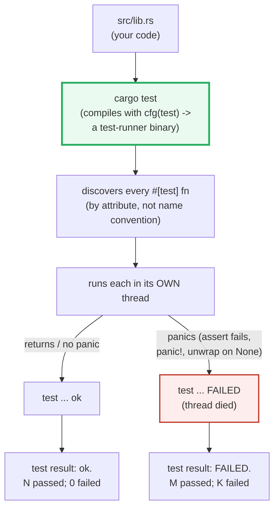
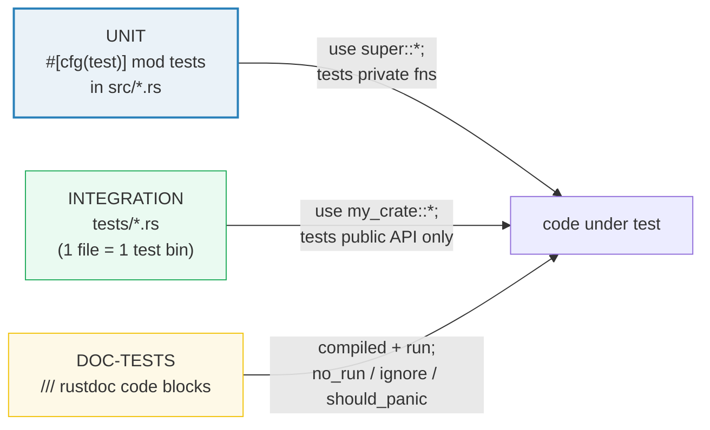

# TESTING — `#[test]`, `assert_eq!`, `#[should_panic]` & `cargo test`

> **One-line goal:** show, by RUNNING table-driven cases, a panic-expecting
> case via `std::panic::catch_unwind`, and a `Result<T, E>` case from `main`,
> how Rust's **built-in** test framework (`#[test]`, `assert_eq!`,
> `#[should_panic]`, `cargo test`) actually works.
>
> **Run:** `just run testing` (== `cargo run --bin testing`)
> **Member:** `core` (stdlib-only — no `[dependencies]`).
> **Prerequisites:** 🔗 [ERROR_HANDLING](./ERROR_HANDLING.md) (`Result`/`?` and
> `panic!` are the two failure modes tests assert on), 🔗 [CONTROL_FLOW](./CONTROL_FLOW.md)
> (`match`/`if let` drive assertions and payload inspection), 🔗 [MACRO_RULES](./MACRO_RULES.md)
> (`assert!`/`assert_eq!` are declarative macros; `vec!` builds a case table).
> **Ground truth:** [`testing.rs`](./testing.rs); captured stdout:
> [`testing_output.txt`](./testing_output.txt).

---

## Why this exists (lineage)

Rust ships its test framework **in the standard library**, not as a third-party
runner. There is no `pytest` to install and no JUnit DSL to learn: a test is any
function annotated with the `#[test]` attribute, and `cargo test` is the
zero-config harness that discovers and runs them.



> From [The Rust Book ch11.1][book-111] (verbatim): *"Tests are Rust functions
> that verify that the non-test code is functioning in the expected manner."*
> And on the failure mechanism: *"Each test is run in a new thread, and when the
> main thread sees that a test thread has died, the test is marked as failed."*
> A test **fails** iff its thread **panics** — which is exactly what the
> `assert!`/`assert_eq!`/`assert_ne!` macros do on a false condition, and what a
> bare `panic!`/`unwrap` does. **No panic ⇒ pass; panic ⇒ fail.**

### This is a META bundle (read this first)

A `[[bin]]` in a workspace of ~50 standalone `main` programs **cannot itself be a
test suite** — its body is `main`, and you `cargo run` it, not `cargo test` it.
So, exactly like the 🔗 Go and 🔗 Python `TESTING` siblings, this bundle
*teaches* `cargo test` but *runs* via `cargo run --bin testing`. The same test
logic is driven from `main` through the house `check()` idiom:

| Real `cargo test` concept | Runnable analog in this bundle's `main` |
|---|---|
| `#[test] fn foo() { assert_eq!(...) }` | a table-driven loop calling `check(desc, got == want)` |
| `#[should_panic]` | `std::panic::catch_unwind` → assert `is_err()` |
| `fn foo() -> Result<(), E>` test | call the `Result`-returning fn, assert `Ok`/`Err` |

The **canonical** `#[test] fn foo()` signature and **every** `cargo test`
invocation live in [§6 — The `cargo test` workflow](#6-the-cargo-test-workflow),
clearly labeled, **not** under a `.rs` callout. As a bonus, a **real**
`#[cfg(test)] mod tests` block sits at the bottom of [`testing.rs`](./testing.rs)
— run it with `cargo test --bin testing` and watch the genuine harness execute
it (proof in §6).



---

## 1. The three building blocks

Everything in this guide is a combination of three primitives. Memorize them:

| Primitive | What it does | Failure mode |
|---|---|---|
| `#[test]` attribute | marks a function as a test; `cargo test` discovers it by this attribute | a test fn that doesn't panic **passes** |
| `assert!(cond)` / `assert_eq!(l,r)` / `assert_ne!(l,r)` | the assertion macros; panic on a false condition | `assert!(false)` ⇒ `panic!` ⇒ thread dies ⇒ **FAILED** |
| `#[should_panic]` / `#[should_panic(expected = "substr")]` | inverts the pass condition: the test passes **only if** it panics | no panic, or a panic whose message lacks `substr` ⇒ **FAILED** |

> From [The Rust Book ch11.1][book-111]: *"`#[should_panic]` ... the test passes
> if the code inside the function panics; the test fails if the code inside the
> function doesn't panic."* And on precision: *"we can add an optional `expected`
> parameter ... the test harness will make sure that the failure message contains
> the provided text."*

---

## Section A — Table-driven test: a slice of `(input, want)` + a loop

The single most important Rust testing idiom. There is no `rstest`/`#[parameterized]`
in stdlib, so you parametrize **by hand**: store cases as a `&[(input, want)]`
slice and loop, asserting each row with the same macro.

> **From testing.rs Section A:**
> ```
> ======================================================================
> SECTION A — Table-driven test: a slice of (input, want) + a loop
> ======================================================================
> A table-driven test stores cases as DATA: a `&[(input, want)]` slice
> ranged in a loop, each row checked with the SAME assert. Adding a case
> means adding a ROW, not copy-pasting a whole test function.
> 
>     pub fn add_two(a: u64) -> u64 { a + 2 }
> 
>                  input                     want
> ────────────────────────────────────────────────
>                      0                        2   got = 2
>                      2                        4   got = 4
>                     40                       42   got = 42
>                    100                      102   got = 102
>   18446744073709551613     18446744073709551615   got = 18446744073709551615
> 
> [check] table row: add_two(0) == 2: OK
> [check] table row: add_two(2) == 4: OK
> [check] table row: add_two(40) == 42: OK
> [check] table row: add_two(100) == 102: OK
> [check] table row: add_two(18446744073709551613) == 18446744073709551615: OK
> [check] ALL table-driven rows passed (the runner's summary assertion): OK
> ```

**What.** Five rows — including the Book's `add_two(2) == 4` ([ch11.1][book-111])
and its `one_hundred` case ([ch11.2][book-112]) — are stored as a `&[(u64, u64)]`
slice and ranged in a loop. Each row is checked with the *same* `check(...)`. A
boundary row (`u64::MAX - 2` → `u64::MAX`) proves the table can hold the awkward
edges a hand-written test would skip.

**Why (internals).**
- **Adding coverage = adding a row.** The whole point of the table is that the
  assertion logic is written **once**; new cases are pure data. Compare this to
  copy-pasting a whole `#[test] fn add_two_40() { ... }` per case — the table
  scales, the copy-paste does not. This is what crates like `rstest` automate
  with `#[rstest]` + `#[case]`, but stdlib gets you there with a `for` loop.
- **The `want` column is the oracle.** Table-driven testing only works when the
  expected output is cheap to state. When the *property* is easier than the
  *exact value* (e.g. "reverse twice == identity"), write a property check over
  the table instead of pinning values — see the pitfalls table.
- **The real `#[test]` form is in §6.** The runner here calls `check()` (which
  panics on a false row, mirroring `assert!`); the canonical `#[test]` version
  calls `assert_eq!(add_two(input), want)` — identical logic, shown verbatim in
  the `mod tests` block at the bottom of [`testing.rs`](./testing.rs).

🔗 [CONTROL_FLOW](./CONTROL_FLOW.md) — `for ... in` iteration drives the table;
🔗 [MACRO_RULES](./MACRO_RULES.md) — `vec!` is the usual table constructor (a
slice literal is used here for fixed data).

---

## Section B — The assertion macros: `assert!` / `assert_eq!` / `assert_ne!`

Three macros, all in the std prelude, all **panic on failure**. They are the
entire assertion vocabulary of a plain Rust test.

> **From testing.rs Section B:**
> ```
> ======================================================================
> SECTION B — The assertion macros: assert! / assert_eq! / assert_ne!
> ======================================================================
> Three macros back every test. All PANIC on failure (the test thread
> dies -> the harness marks the test FAILED). `assert_eq!` and
> `assert_ne!` require `PartialEq` + `Debug`; on failure they print the
> two values. Rust names them 'left'/'right' (NOT 'expected'/'actual').
> 
>     assert!(true);                       // passes: nothing happens
> [check] assert!(cond) backs every test; underlying check is a bool: OK
>     assert_eq!(add_two(2), 4);            // passes: 4 == 4
> [check] assert_eq! uses == (order-independent): add_two(2) == 4: OK
>     assert_ne!(add_two(0), 99);           // passes: 2 != 99
> [check] assert_ne! uses != : add_two(0) != 99: OK
>     assert_eq!(Point{1,2}, Point{1,2}); // needs #[derive(PartialEq, Debug)]
> [check] custom types need #[derive(PartialEq, Debug)] for the equality macros: OK
>     assert!(val > 0, "val must be positive, got {val}");  // custom message
> [check] custom messages take format args after the required ones: OK
> ```

**What.** Four demonstrations: `assert!(bool)` checks any boolean; `assert_eq!`
checks equality with `==`; `assert_ne!` checks inequality with `!=`; and a
custom-deriving `Point` struct proves the `PartialEq` + `Debug` requirement.
Every macro here passes (this bundle never panics on purpose in Section B), so
the failure output is shown below, pasted from the Book.

**Why (internals).**
- **`assert_eq!`/`assert_ne!` need `PartialEq` AND `Debug`.** They desugar to
  `==`/`!=` for the check and to `{:?}` for the failure message ([Book
  ch11.1][book-111]: *"the values being compared must implement the `PartialEq`
  and `Debug` traits"*). A `#[derive(PartialEq, Debug)]` is the usual fix — the
  `Point` row compiles only because of that derive. 🔗 [STRUCTS_ENUMS](./STRUCTS_ENUMS.md)
  / [TRAITS_BASICS](./TRAITS_BASICS.md) cover derivable traits.
- **The args are `left`/`right`, NOT `expected`/actual`.** [Book ch11.1][book-111]:
  *"in Rust, they're called `left` and `right`, and the order ... doesn't
  matter."* This trips up people from JUnit/pytest where order is meaningful.
- **Custom messages are trailing `format!` args.** `assert!(cond, "got {x}")`
  passes everything after the condition to `format!`. On failure the message
  appears in the panic, which is what the harness prints.

**The failure output (pasted from [Book ch11.1][book-111], NOT from this `.rs` —
a failing assert would panic the bundle):**

```console
$ cargo test
running 1 test
test tests::it_adds_two ... FAILED

---- tests::it_adds_two stdout ----
thread 'tests::it_adds_two' panicked at src/lib.rs:12:9:
assertion `left == right` failed
  left: 5
 right: 4
note: run with `RUST_BACKTRACE=1` environment variable to display a backtrace
```

Note `left: 5, right: 4` — the two values printed by `{:?}`, and the exact
location (`src/lib.rs:12:9`) the panic originated from.

---

## Section C — `#[should_panic]` analog: `catch_unwind` catches a panic

`#[should_panic]` makes a test **pass only if it panics** — essential for
asserting that a function rejects bad input. A `[[bin]]` body can't carry that
attribute, so this bundle reproduces it programmatically with
`std::panic::catch_unwind`.

> **From testing.rs Section C:**
> ```
> ======================================================================
> SECTION C — #[should_panic] analog: catch_unwind catches a panic
> ======================================================================
> `#[should_panic]` makes a test PASS only if it panics. A `[[bin]]`
> cannot show that attribute directly (its body is `main`), so the
> runner uses `std::panic::catch_unwind` — the PROGRAMMATIC analog: it
> runs a closure and returns Ok(result) or Err(panic payload).
> 
>     catch_unwind(|| Guess::new(50))  -> Ok (no panic)
> [check] valid Guess: catch_unwind returns Ok: OK
> [check] valid Guess: the Ok value is the built Guess (value 50): OK
>     catch_unwind(|| Guess::new(200)) -> Err (panic caught)
> [check] invalid Guess: catch_unwind returns Err (panic caught): OK
>     panic payload message: "Guess value must be between 1 and 100, got 200."
> [check] panic payload contains the expected substring (the expected= analog): OK
>     AssertUnwindSafe: count after caught panic = 1 (mutation before panic persists)
> [check] AssertUnwindSafe wraps a closure capturing &mut: OK
> [check] a mutation made before the panic is observable after catch_unwind: OK
> ```

**What.** Four checks pin the contract of `catch_unwind` (the [std
docs][std-catch]): a closure that doesn't panic returns `Ok(result)`; a closure
that panics returns `Err(payload)`. The `Guess::new` function panics on
out-of-range input (the Book's [ch9/ch11][book-111] `Guess`), so `Guess::new(50)`
yields `Ok` and `Guess::new(200)` yields `Err`. The runner then **downcasts the
payload** to a `String` and checks it contains `"between 1 and 100"` — the exact
mechanism `#[should_panic(expected = "...")]` uses.

**Why (internals).**
- **`catch_unwind` signature** ([std docs][std-catch]):
  `pub fn catch_unwind<F: FnOnce() -> R + UnwindSafe, R>(f: F) -> Result<R>`.
  It returns `Ok(R)` on success or `Err(Box<dyn Any + Send>)` — the panic
  **payload** (what was passed to `panic!`). The payload is opaque (`Any`), so
  you recover the message with `downcast_ref::<String>()` (for `panic!` with
  format args) or `downcast_ref::<&'static str>()` (for `panic!("literal")`).
- **`UnwindSafe` encodes exception safety.** A closure that captures `&mut` does
  **not** satisfy `UnwindSafe`, because after a panic the partially-mutated state
  could be observed. The bundle's `AssertUnwindSafe` row demonstrates the escape
  hatch — and the *last* check proves the concern is real: `count` was
  incremented to `1` *before* the panic, and that mutation **survives** the
  caught unwind. That observable-but-inconsistent state is precisely what
  `UnwindSafe` exists to forbid by default.
- **`catch_unwind` is NOT a general try/catch.** The [std docs][std-catch] warn:
  *"It is not recommended to use this function for a general try/catch
  mechanism. The `Result` type is more appropriate."* Two reasons: (1) with
  `panic = "abort"` (common in production binaries and FFI) panics **abort the
  process** and `catch_unwind` cannot catch them at all; (2) for recoverable
  failures `Result`/`?` is the idiomatic path (🔗 [ERROR_HANDLING](./ERROR_HANDLING.md)).
  Use `#[should_panic]` in tests, `Result` in production code.

> **The real `#[should_panic]` form (in the `mod tests` block at the bottom of
> [`testing.rs`](./testing.rs), run by `cargo test --bin testing`):**
> ```rust
> #[test]
> #[should_panic(expected = "between 1 and 100")]
> fn guess_too_large_panics() {
>     Guess::new(200);
> }
> ```

---

## Section D — `Result<T, E>` tests: Ok value + Err propagation

A test function may **return** `Result<(), E>` instead of panicking. Then `?`
propagates any `Err` as a test failure — cleaner than `unwrap()` when the code
under test already returns a `Result`.

> **From testing.rs Section D:**
> ```
> ======================================================================
> SECTION D — Result<T,E> tests: Ok value + Err propagation
> ======================================================================
> A test fn may RETURN `Result<(), E>` instead of panicking. Then `?`
> propagates any `Err` as a test failure. To assert an `Err`, use
> `assert!(r.is_err())` — you CANNOT combine `#[should_panic]` with a
> `Result`-returning test. (Rust Book ch11.1.)
> 
>     parse_hex("ff")  -> Ok(255)
> [check] Result Ok case: parse_hex("ff") == Ok(255): OK
>     parse_hex("nope") -> Err (propagated ParseIntError)
> [check] Result Err case: parse_hex("nope") is Err: OK
>     double_hex("ff")  -> Ok(510)   (parse_hex then *2, via `?`)
> [check] `?` propagation: double_hex("ff") == Ok(510): OK
>     double_hex("zz")  -> Err (the parse Err propagated by `?`)
> [check] `?` propagation: double_hex("zz") is Err (parse error short-circuited): OK
> ```

**What.** `parse_hex` (a thin wrapper over `u64::from_str_radix`) returns
`Result<u64, ParseIntError>`. The runner asserts the `Ok` case holds `255`, the
`Err` case is an error, and `double_hex` — which uses `?` to propagate — doubles
the `Ok` value (`ff` → `510`) but short-circuits the `Err` (`zz`).

**Why (internals).**
- **`?` in a test = fail-on-Err.** When a test fn returns `Result<(), E>`, the
  harness treats `Ok(())` as pass and an early-returned `Err` as fail ([Book
  ch11.1][book-111]: *"Writing tests so that they return a `Result<T, E>`
  enables you to use the question mark operator ... which can be a convenient
  way to write tests that should fail if any operation within them returns an
  `Err` variant."*). This avoids a chain of `.unwrap()` calls.
- **`#[should_panic]` is incompatible with `Result` tests.** [Book ch11.1][book-111]:
  *"You can't use the `#[should_panic]` annotation on tests that use
  `Result<T, E>`. To assert that an operation returns an `Err` variant, don't
  use the question mark operator on the `Result<T, E>` value. Instead, use
  `assert!(value.is_err())`."* The runner does exactly that for `parse_hex("nope")`.
- **`Result` is preferred over `panic!` for *expected* failures.** A function
  that can fail in normal operation should return `Result`, not `panic!` — then
  it's testable with `?`/`is_err()` instead of needing `#[should_panic]`. Reserve
  `panic!`/`#[should_panic]` for genuine invariants (the `Guess` range
  contract). 🔗 [ERROR_HANDLING](./ERROR_HANDLING.md).

---

## Section E — Test organization: unit / integration / doc-tests

Rust has **three** kinds of tests, each discovered differently by `cargo test`.

> **From testing.rs Section E:**
> ```
> ======================================================================
> SECTION E — Test organization: unit (mod tests) / integration (tests/) / doc-tests
> ======================================================================
> Rust has THREE kinds of tests, discovered differently by `cargo test`:
> 
>     KIND          WHERE                         cfg(test)?  NOTES
>     ────────────────────────────────────────────────────────────────────
>     unit          src/*.rs #[cfg(test)] mod tests   yes     `use super::*;`, lives next to code
>     integration   tests/*.rs (each file = 1 bin)    no      `use my_crate::...`, tests the public API
>     doc-tests     /// code blocks in rustdoc        n/a     compiled & run; no_run/ignore/should_panic
> 
> A REAL #[cfg(test)] mod tests block lives at the BOTTOM of this file.
> Run it with `cargo test --bin testing` to see the genuine harness.
> 
>     cfg!(test) under `cargo run` = false  (mod tests is compiled OUT here)
> [check] unit-test #[cfg(test)] mod tests is excluded from `cargo run` builds: OK
> [check] unit tests live in #[cfg(test)] mod tests { use super::*; ... }: OK
> [check] integration tests live in tests/ and do NOT need #[cfg(test)]: OK
> [check] doc-tests come from /// rustdoc code blocks, run by `cargo test`: OK
> ```

**What.** The `cfg!(test)` check prints `false` under `cargo run` — proving the
unit-test module is **compiled out** of a normal build. That is the whole reason
`#[cfg(test)]` exists: test code ships at zero cost to your release binary.

**Why (internals).**
- **Unit tests: `#[cfg(test)] mod tests { use super::*; ... }`.** The module
  lives *in the same file* as the code, an inner module that glob-imports the
  parent (`use super::*;`) so it can test **private** functions too. The
  `#[cfg(test)]` attribute means the module is only compiled when `cargo test`
  sets `cfg(test)` — [Book ch11.3][book-113]: *"because unit tests go in the
  same files as the code, we use `#[cfg(test)]` to specify that they shouldn't
  be included in the compiled result."* The `mod tests` block at the bottom of
  this very file is exactly this shape.
- **Integration tests: the `tests/` directory.** Each file in `tests/` is a
  separate test binary that links your crate as an **external** dependency
  (`use my_crate::...`). It can only see the **public** API — so it tests your
  crate the way a downstream user would. It does **not** need `#[cfg(test)]`
  because the whole directory is only compiled under `cargo test` ([Book
  ch11.3][book-113]). 🔗 [MODULES](./MODULES.md).
- **Doc-tests: `///` rustdoc code blocks.** Any ```rust ``` code block inside a
  `///` doc comment is compiled and run by `cargo test`, keeping docs and code
  in sync. Annotate a block with `#`-prefixed hidden lines, or with `no_run`
  (compile, don't execute), `ignore` (don't compile), or `should_panic`
  ([Book ch14.2][book-142]). Note: `cfg(test)` is **not** set during doc-tests,
  so a doc-test cannot call `#[cfg(test)]`-gated helpers.

---

## 6. The `cargo test` workflow

> This section is **documentation**, not a `.rs` callout. The commands below are
> what you run in a real crate; their outputs are pasted from the genuine
> `cargo test --bin testing` run on this bundle's `mod tests` block (and from the
> [Book][book-111] where noted). The META runner in `main` mirrors all of this
> logic through `check()`.

### The canonical test function

```rust
// src/lib.rs — `cargo new --lib` generates this skeleton.
pub fn add(left: u64, right: u64) -> u64 {
    left + right
}

#[cfg(test)]
mod tests {
    use super::*;

    #[test]
    fn it_works() {
        let result = add(2, 2);
        assert_eq!(result, 4);
    }
}
```

The `mod tests` block at the bottom of [`testing.rs`](./testing.rs) is this exact
shape (with a table test, a `should_panic`, and a `Result` test). Run it:

```console
$ cargo test --bin testing
running 4 tests
test tests::add_two_table ... ok
test tests::guess_valid_is_ok ... ok
test tests::guess_too_large_panics - should panic ... ok
test tests::parse_hex_ok_and_err ... ok

test result: ok. 4 passed; 0 failed; 0 ignored; 0 measured; 0 filtered out; finished in 0.00s
```

That output is **verbatim** from running the real harness on this bundle's
`#[cfg(test)] mod tests`. Note `guess_too_large_panics - should panic ... ok` —
the `should panic` suffix marks a `#[should_panic]` test that panicked as
expected.

### Running, filtering, and showing output

| Command | Effect |
|---|---|
| `cargo test` | build with `cfg(test)`, run **all** tests in parallel, capture `println!` output |
| `cargo test <name>` | run only tests whose **fully-qualified path** contains `<name>` (substring match) |
| `cargo test -- --nocapture` | show `println!` output **inline** as tests run (the classic libtest flag) |
| `cargo test -- --show-output` | show captured output of **passing** tests in a `successes:` section ([Book ch11.2][book-112]) |
| `cargo test -- --test-threads=1` | run tests **serially** (no parallelism) — for tests that share state/files |
| `cargo test -- --ignored` | run **only** `#[ignore]`-d tests |
| `cargo test -- --include-ignored` | run all tests, ignored or not |
| `cargo test -- --list` | list discovered tests without running them |

> The `--` separator splits `cargo test`'s own flags (left) from flags passed to
> the test-runner binary (right). [Book ch11.2][book-112]: *"Some command line
> options go to `cargo test`, and some go to the resultant test binary."* The
> full set of right-side flags is documented in [the rustc book's Tests
> section][rustc-tests].

**Ignoring slow tests** ([Book ch11.2][book-112]):
```rust
#[test]
#[ignore = "slow: runs the full corpus"]
fn expensive_test() { /* ... */ }
```
A plain `cargo test` skips it (printed as `ignored`); `cargo test -- --ignored`
runs only it; `cargo test -- --include-ignored` runs everything.

**`--nocapture` vs `--show-output`.** By default the harness swallows `println!`
from passing tests (failing tests' output is always shown). `--nocapture`
disables capture entirely so output streams inline (and interleaves with
parallel tests — noisy but live). `--show-output` keeps capture but replays each
passing test's captured output in a tidy `successes:` summary. Prefer
`--show-output` for readability; reach for `--nocapture` when you need to see
output *as it happens* (e.g. a hanging test).

---

## 🔗 Cross-references

- 🔗 [ERROR_HANDLING](./ERROR_HANDLING.md) — tests assert on the two failure
  modes: `Result`/`?` (Section D) and `panic!` (Section C). `Result`-returning
  tests are the idiomatic way to assert recoverable failure.
- 🔗 [CONTROL_FLOW](./CONTROL_FLOW.md) — `for ... in` drives the table-driven
  loop; `if let` / `match` destructure the `catch_unwind` payload.
- 🔗 [MACRO_RULES](./MACRO_RULES.md) — `assert!`/`assert_eq!`/`assert_ne!` are
  declarative macros; `vec!`/slice literals build the case table.
- 🔗 [MODULES](./MODULES.md) — the `#[cfg(test)] mod tests { use super::*; }`
  inner module and the `tests/` integration-test directory are module-tree
  concepts.
- 🔗 [STRUCTS_ENUMS](./STRUCTS_ENUMS.md) / [TRAITS_BASICS](./TRAITS_BASICS.md) —
  `#[derive(PartialEq, Debug)]` is what makes a custom type usable with
  `assert_eq!`/`assert_ne!`.
- 🔗 `../go/TESTING.md` & `../python/TESTING_LINTING.md` — the sibling META
  testing bundles (Go's `testing` package, Python's `pytest`/`unittest`); the
  table-driven idiom is identical across all three.

---

## Pitfalls (the expert payoff)

| Trap | Symptom | Fix / why |
|---|---|---|
| **`#[should_panic]` without `expected=`** | a test passes for the *wrong* panic (an unrelated bug panics too) | add `#[should_panic(expected = "the specific message")]`; the harness checks the message contains the substring. |
| **`#[should_panic]` on a `Result` test** | compile error / confusion | `Result`-returning tests can't use `#[should_panic]`; assert the error with `assert!(r.is_err())` instead ([Book ch11.1][book-111]). |
| **`assert_eq!` on a type without `Debug`** | `error[E0277]: the trait Debug is not implemented` | `#[derive(Debug)]` (and `PartialEq`) on the type; both are required by the equality macros. |
| **`unwrap()` in a test instead of `?`** | noisy `.unwrap()` chains, poor failure messages | make the test return `Result<(), E>` and use `?` — the `Err` becomes a clean test failure. |
| **`catch_unwind` + `panic = "abort"`** | the process **aborts**; `catch_unwind` can't catch it | `catch_unwind` only catches **unwinding** panics ([std docs][std-catch]). Don't rely on it in `abort` binaries; use `Result` for recoverable failure. |
| **`catch_unwind` closure capturing `&mut`** | `error: the type ... may not be safely transferred` | wrap in `AssertUnwindSafe(|| {...})` — and double-check the captured state is still consistent after a panic (it may be half-mutated). |
| **Tests that share state/files run in parallel** | flaky failures — one test clobbers another's file/env | run serially: `cargo test -- --test-threads=1`, or give each test its own temp file/dir. |
| **Doc-test can't see `#[cfg(test)]` code** | `cannot find function` in a doc example | `cfg(test)` is **not** set for doc-tests; don't gate public examples behind it. Mark the block `ignore` or `no_run` if it can't run standalone. |
| **`cargo test` builds nothing new** | "did my test even run?" | check the `running N tests` line and `0 filtered out`; a too-broad `cargo test <name>` filter can silently match zero tests. |
| **Printing in a passing test shows nothing** | "where did my `println!` go?" | output is **captured** by default; use `cargo test -- --show-output` (or `--nocapture`) to see it. |
| **`left`/`right` vs `expected`/`actual`** | reading failure output backwards | Rust names them `left`/`right` and **order doesn't matter** ([Book ch11.1][book-111]); don't impose expected/actual semantics. |
| **Ignoring a test and forgetting it** | `#[ignore]`d tests silently rot, never run in CI | run `cargo test -- --include-ignored` in CI (or nightly) so ignored tests don't bitrot. |

---

## Cheat sheet

```rust
// ── The canonical unit-test module (in src/lib.rs or src/main.rs) ──────────
#[cfg(test)]                              // compiled ONLY under `cargo test`
mod tests {
    use super::*;                         // bring the parent module into scope

    #[test]                               // marks a test fn (discovered by cargo test)
    fn it_adds_two() {
        assert_eq!(add_two(2), 4);        // == ; needs PartialEq + Debug
    }

    #[test]
    #[should_panic(expected = "between 1 and 100")]  // pass ONLY if it panics
    fn guess_too_large_panics() { Guess::new(200); }

    #[test]
    #[ignore = "slow"]                    // skipped unless --ignored/--include-ignored
    fn expensive() { /* ... */ }

    #[test]
    fn result_test() -> Result<(), String> {  // Err = fail; use ? to propagate
        if add_two(2) == 4 { Ok(()) } else { Err("nope".into()) }
    }
}

// ── Table-driven (the workhorse idiom) ─────────────────────────────────────
#[test]
fn add_two_table() {
    for &(input, want) in &[(0_u64, 2), (2, 4), (100, 102)] {
        assert_eq!(add_two(input), want);
    }
}

// ── catch_unwind (programmatic should_panic; NOT a general try/catch) ──────
let r = std::panic::catch_unwind(|| Guess::new(200));   // -> Err(payload)
assert!(r.is_err());
// capturing &mut needs:  std::panic::catch_unwind(std::panic::AssertUnwindSafe(|| { .. }))

// ── Three test kinds ───────────────────────────────────────────────────────
//   unit        : src/*.rs  #[cfg(test)] mod tests { use super::*; .. }  (private fns)
//   integration : tests/*.rs   use my_crate::*;                          (public API)
//   doc-tests   : /// rustdoc ```rust``` blocks                           (no_run/ignore/should_panic)
```

```bash
# ── cargo test invocations ─────────────────────────────────────────────────
cargo test                       # run all tests (parallel, output captured)
cargo test add                   # filter: run tests whose path contains "add"
cargo test -- --show-output      # show captured output of PASSING tests
cargo test -- --nocapture        # stream output inline (interleaves)
cargo test -- --test-threads=1   # run serially (shared-state tests)
cargo test -- --ignored          # run ONLY #[ignore] tests
cargo test -- --include-ignored  # run ALL tests, ignored or not
cargo test -- --list             # list discovered tests, don't run
```

---

## Sources

Every signature, attribute, and behavioral claim above was web-verified against
the authoritative Rust documentation and corroborated by secondary sources.

- **The Rust Programming Language, ch11.1 "How to Write Tests"** — `#[test]`,
  `assert!`/`assert_eq!`/`assert_ne!` and their `PartialEq`+`Debug` requirement,
  the `left`/`right` (not expected/actual) naming, custom messages,
  `#[should_panic]` + `expected = "..."`, `Result<T,E>` tests and the rule that
  they cannot use `#[should_panic]` (use `assert!(v.is_err())`), the "test thread
  dies ⇒ FAILED" mechanism, the generated `mod tests` skeleton:
  https://doc.rust-lang.org/book/ch11-01-writing-tests.html
- **The Rust Programming Language, ch11.2 "Controlling How Tests Are Run"** —
  the `--` separator, `--show-output`, `--test-threads=N`, parallel execution and
  shared-state caveats, name filtering (`cargo test <name>`), `#[ignore]` +
  `--ignored` / `--include-ignored`:
  https://doc.rust-lang.org/book/ch11-02-running-tests.html
- **The Rust Programming Language, ch11.3 "Test Organization"** — unit tests in
  `#[cfg(test)] mod tests`, `use super::*;`, integration tests in `tests/` (no
  `#[cfg(test)]` needed), the public-API-only rule:
  https://doc.rust-lang.org/book/ch11-03-test-organization.html
- **The Rust Programming Language, ch14.2 "Documentation Comments as Tests"** —
  doc-tests compiled from `///` blocks, `no_run`/`ignore`/`should_panic`
  annotations:
  https://doc.rust-lang.org/book/ch14-02-publishing-to-crates-io.html#documentation-comments-as-tests
- **`std::panic::catch_unwind`** — the signature
  `pub fn catch_unwind<F: FnOnce() -> R + UnwindSafe, R>(f: F) -> Result<R>`,
  "returns `Ok` ... if the closure does not panic, and `Err(cause)` if the
  closure panics", the `UnwindSafe` bound and the `AssertUnwindSafe` escape
  hatch, the explicit "not recommended ... for a general try/catch mechanism"
  warning, and "might not catch all Rust panics" (abort-based panics):
  https://doc.rust-lang.org/std/panic/fn.catch_unwind.html
- **`std::panic::UnwindSafe` / `AssertUnwindSafe`** — exception-safety as a type
  bound, the wrapper for closures capturing `&mut`:
  https://doc.rust-lang.org/std/panic/trait.UnwindSafe.html
- **The Rust Reference — "Testing attributes"** — `#[test]`, `#[should_panic]`
  with optional `expected =`, and `#[ignore]` as formally-specified attributes
  ("the `should_panic` attribute may optionally take an input string that must
  appear within the panic message"):
  https://doc.rust-lang.org/reference/attributes/testing.html
- **`std::assert_eq!` macro** — "asserts that two expressions are equal to each
  other (using `PartialEq`)", "on panic, will print the values ... with their
  debug representations", `left`/`right`:
  https://doc.rust-lang.org/std/macro.assert_eq.html
- **The rustc Book — "Tests"** — the complete set of libtest flags after `--`
  (`--nocapture`, `--show-output`, `--test-threads`, `--ignored`,
  `--include-ignored`, `--list`, ...):
  https://doc.rust-lang.org/rustc/tests/index.html
- **Rust By Example — "Unit testing"** — the `#[should_panic]` with optional
  `expected =` parameter, independent corroboration of the unit-test shape:
  https://doc.rust-lang.org/rust-by-example/testing/unit_testing.html
- **Effective Rust, Item 30 "Write more than unit tests"** — why a test suite
  needs unit + integration + (property) tests; the `#[cfg(test)]` conditional
  compilation rationale (independent corroboration of the Book's organization):
  https://effective-rust.com/testing.html

**Facts that could not be verified by running** (documented, not executed,
because they are compile errors or tool behavior by design): the exact `assert!
failed` panic message format and line/column reporting (pasted from [Book
ch11.1][book-111]); the `cfg(test)` is-not-set-during-doc-tests behavior (a
compile-gate, confirmed by the [rust-lang/rust issue #45599][doc-cfg] and the
Reference); and `catch_unwind`'s inability to catch abort-based panics (a
profile-dependent runtime behavior, confirmed by the [std docs][std-catch]).
The verbatim `cargo test --bin testing` output in §6, however, **is** reproduced
from a real run of this bundle's `mod tests` block.

[doc-cfg]: https://github.com/rust-lang/rust/issues/45599
