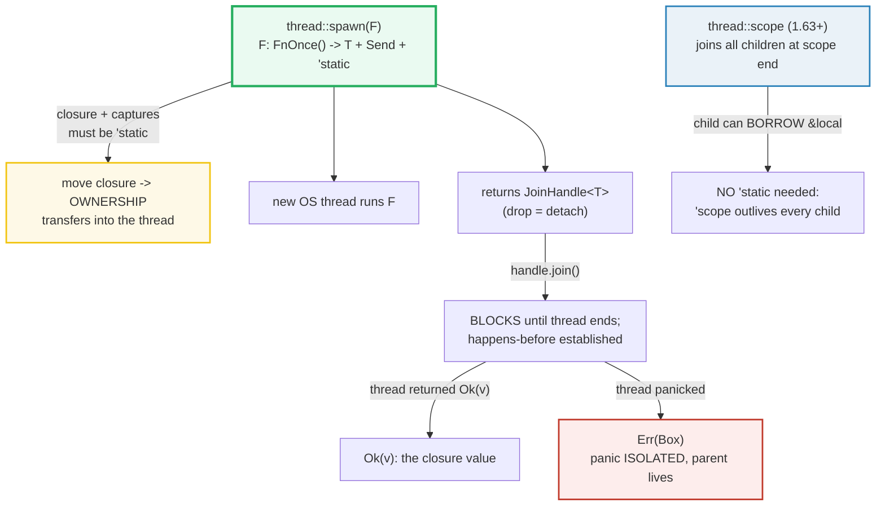

# THREADS — Spawning OS Threads, `move` Closures, Isolated Panics, Scoped Threads

> **One-line goal:** `thread::spawn` runs a closure on a **new OS thread** and
> hands back a `JoinHandle`; the closure must be `'static + Send` (use `move` to
> give it owned data); `join()` blocks until the thread ends and yields its
> return value **or** its boxed panic — so a panicking thread never crashes its
> parent; `thread::scope` (1.63+) lifts the `'static` bound so scoped threads can
> **borrow** local data.
>
> **Run:** `just run threads` (== `cargo run --bin threads`)
> **Member:** `core` (stdlib-only — no `[dependencies]`).
> **Prerequisites:** 🔗 [OWNERSHIP](./OWNERSHIP.md) (a `move` closure is an
> ownership transfer into the thread), 🔗 [CLOSURES](./CLOSURES.md) (`move ||
> {}`), 🔗 [BOX_RC_ARC](./BOX_RC_ARC.md) (`Arc` vs `Rc`, why `Rc` is `!Send`).
> **Ground truth:** [`threads.rs`](./threads.rs); captured stdout:
> [`threads_output.txt`](./threads_output.txt).

---

## Why this exists (lineage)

Ownership (Phase 1) describes a **single-threaded** program — one owner, one
scope, one `Drop` at the `}`. The moment you call `thread::spawn`, the closure
**moves to another OS thread** with its own stack and its own timeline. That
raises two questions the borrow checker must answer *at compile time*:

1. **Lifetime** — the new thread might outlive the function that spawned it. So
   the closure (and anything it captures) must be valid for `'static`.
2. **Sharing** — multiple threads may touch the same memory. So whatever crosses
   the thread boundary must be `Send` (movable between threads) and, if shared
   by reference, `Sync` (safe for `&T` on many threads).

Rust answers both with the **`Send`/`Sync` marker traits** — a *compile-time*
data-race guarantee, not a runtime lock. There is no `.race()` test to run; the
program either compiles (race-free) or it doesn't (with a precise diagnostic).



---

## Section A — `thread::spawn` → `JoinHandle`; `join()` returns the value

The std signature is exactly:

```rust
pub fn spawn<F, T>(f: F) -> JoinHandle<T>
where
    F: FnOnce() -> T + Send + 'static,
    T: Send + 'static,
```

> **From threads.rs Section A:**
> ```
> ======================================================================
> SECTION A — thread::spawn -> JoinHandle; join() returns the closure's value
> ======================================================================
>   let handle = thread::spawn(|| fib(20));   (runs on another thread)
>   handle.join().unwrap() -> 6765
>   fib(20) on this thread   -> 6765  (identical)
> [check] spawned thread returns its closure value via join: fib(20) == 6765: OK
> ```

**What.** `spawn` schedules the closure on a **new OS thread** and returns
**immediately** with a `JoinHandle<T>` — the child runs concurrently with the
caller. `handle.join()` blocks the caller until the child finishes, then yields
its return value as `Result<T, …>`. Here both the child and the parent compute
`fib(20) == 6765`.

**Why (internals).**
- **`'static` bound.** Threads can outlive the function that spawned them — the
  Book puts it plainly: "the closure and its return value must have a lifetime
  of the whole program execution" because "threads can outlive the lifetime they
  have been created in" ([std::thread::spawn docs][std-spawn]). A closure that
  merely *borrowed* a stack local would point at freed memory if the parent
  returned first; `'static` rules that out.
- **`Send` bound.** The closure is passed **by value** from the spawning thread
  to the new one, and its return value comes back the same way. `Send` is "safe
  to move between threads" — that is the whole safety contract ([std-spawn]).
- **`join` establishes a happens-before edge.** The std docs spell it out: "the
  completion of the associated thread synchronizes with this function returning.
  In other words, all operations performed by that thread happen before all
  operations that happen after `join` returns." ([JoinHandle::join][std-join]).
  That is why, after `join`, the parent can safely read anything the child wrote
  — no extra fence needed.
- **Dropping a `JoinHandle` detaches the thread.** There is no implicit join at
  scope end for non-scoped threads: dropping the handle "means that there is no
  longer any handle to the thread and no way to `join` on it" ([JoinHandle][std-joinhandle]).
  The thread keeps running; if it outlives `main`, the process still exits when
  `main` returns (a detached thread is simply not joined).

🔗 [OWNERSHIP](./OWNERSHIP.md) — `spawn(move || …)` is an ownership transfer;
🔗 [CLOSURES](./CLOSURES.md) — `FnOnce` is the trait bound `spawn` uses.

---

## Section B — `move` closure: transfer ownership into the thread

```rust
let secret = String::from("bismuth");
let handle = thread::spawn(move || {
    format!("len({}) = {}", secret, secret.len())   // OWNS secret now
});
```

> **From threads.rs Section B:**
> ```
> ======================================================================
> SECTION B — `move` closure: transfer ownership of a captured value
> ======================================================================
>   let secret = String::from("bismuth");  (len 7)
>   thread (moved secret) -> "len(bismuth) = 7"
> [check] `move` closure owned the String; thread read it correctly: OK
> ```

**What.** Without `move`, the closure would borrow `secret` — a `&String` into a
local of `section_b`. That violates the `'static` bound, since `secret` is gone
when `section_b` returns while the thread might still be running. Adding `move`
tells the closure to **take ownership** of every captured variable, so the
closure becomes self-contained (`'static`) and `Send`. After the spawn, `secret`
is unusable in the caller — a move, mechanically identical to `let s2 = s1;`
(E0382 if you try).

**Why (internals).** The Book's Chapter 16.1 example — moving a `Vec` into a
thread with `move ||` — exists precisely to teach this: `move` "forces the
closure to take ownership of the values it's using rather than allowing Rust to
infer that it should borrow the values" ([Book ch16.1][book-threads]). The
compiler will not promote a borrow to a `'static` borrow for you; `move` is the
explicit, opt-in ownership transfer.

> **Pitfall — forgetting `move`.** Without it the closure borrows; with
> non-`'static` captures you get `error[E0374]: captured variable ... does not
> have the 'static lifetime` (see the pitfalls table). `move` is the *default*
> you should reach for in `thread::spawn` unless you specifically need shared
> borrowing via `thread::scope`.

🔗 [MOVE_SEMANTICS](./MOVE_SEMANTICS.md) — partial moves, `move` on structs.

---

## Section C — A thread panic is ISOLATED: `join()` yields `Err`

```rust
let handle = thread::spawn(|| panic!("boom: worker fault"));
let joined = handle.join();              // Err(Box<dyn Any + Send>)
```

> **From threads.rs Section C:**
> ```
> ======================================================================
> SECTION C — a thread panic is ISOLATED: join() yields Err, main continues
> ======================================================================
>   spawned `panic!("boom: worker fault")`;
>   handle.join() -> Err (main thread still alive)
>   joined.is_err() -> true
>   payload.downcast_ref::<&str>() -> Some("boom: worker fault")
> [check] a panicking thread -> join().is_err() (panic contained, parent unharmed): OK
> [check] panic payload is Box<dyn Any + Send>: downcast recovers "boom: worker fault": OK
> ```

**What.** A `panic!` in a spawned thread does **not** unwind into the parent.
The panic is caught at the thread boundary, the payload is boxed into a
`Box<dyn Any + Send + 'static>`, and `join` returns `Err(payload)`. The parent
thread keeps running — proven here by the second check after `join().unwrap()`
on the (Ok) handle from Section A, and by the downcast recovering the literal
panic message.

**Why (internals).**
- **Each thread has its own panic boundary.** `panic!` unwinds the *current*
  thread's stack only. At the thread root, the runtime captures the payload and
  signals completion; the joiner observes that as `Err`. This is the Book's
  "Threads and Panics" point: "a panic in a thread will not normally propagate
  to other threads" ([Book ch16.1][book-threads]).
- **The payload type is `Box<dyn Any + Send + 'static>`.** `panic!` takes
  `T: Any + Send + 'static`, so almost anything can be put in there. The Rust
  users forum confirms: "The error returned is `Box<dyn Any + Send + 'static>`
  which contains the panic's argument" ([users.rust-lang.org][users-panic]).
  Downcasting with `downcast_ref::<&'static str>()` recovers it when you know
  the type the macro put in.
- **`join().expect("…")` re-panics in the joiner.** That is the idiomatic way to
  make a worker failure crash the program: `expect` calls `resume_unwind` on the
  payload after printing its own message. Sections A, B, E, F use this pattern.
- **`thread::scope` is stricter.** If a *scoped* thread panics **and** you let
  `scope` join it implicitly, the scope itself panics — so within a scope you
  should `join` panicking children yourself to convert the panic into a
  `Result` ([scope docs][std-scope]).

> **Pitfall — silently ignoring `Err` from `join`.** If you `let _ =
> handle.join();`, a worker panic becomes invisible. Always `.expect(msg)` or
> match on the `Result` so failures surface.

---

## Section D — Scoped threads (`thread::scope`, 1.63+) can BORROW local data

```rust
let data: Vec<i32> = vec![10, 20, 30, 40];          // NOT 'static
thread::scope(|s| {
    s.spawn(|| { let _half: i32 = data[..2].iter().sum(); /* borrows data */ });
    s.spawn(|| { let _half: i32 = data[2..].iter().sum(); /* borrows data */ });
});                                                  // <-- joins both before return
```

> **From threads.rs Section D:**
> ```
> ======================================================================
> SECTION D — scoped threads (thread::scope, 1.63+) BORROW non-'static data
> ======================================================================
>   let data = [10, 20, 30, 40];   sum = 100
>   collected (sorted) = [30, 70]  (each child summed half of `data`)
> [check] scoped threads borrowed `data` (no 'static, no clone): partial sums present: OK
> [check] sum of the two partial sums == the whole sum (correctness): OK
>   after scope: data still owned by parent, len = 4
> [check] borrow ends at scope exit: parent keeps `data` (len 4): OK
> ```

**What.** Two scoped threads share-borrow `&data[..2]` and `&data[2..]` — no
`move`, no `clone`, no `'static`. The scope guarantees all children are joined
before it returns, so `data` (a plain `Vec<i32>` local) outlives every borrow.
After the scope, the parent still owns `data` (the final check). The two partial
sums (`30 + 70`) total `100`, the whole sum — the borrow never invalidated the
parent's view.

**Why (internals).** `thread::scope`'s signature carries **two lifetimes**:

```rust
pub fn scope<'env, F, T>(f: F) -> T
where
    F: for<'scope> FnOnce(&'scope Scope<'scope, 'env>) -> T,
```

- **`'scope`** — the lifetime of the scope itself; new threads may be spawned,
  and existing ones may still run, for as long as `'scope` lasts. It ends "after
  `f` returns and all scoped threads have been joined, but before `scope`
  returns" ([scope docs][std-scope]).
- **`'env`** — the lifetime of whatever the children borrow. The bound
  `'env: 'scope` (inside `Scope`) forces `'env` to outlive `'scope`. That is the
  trick: because `'scope` ⊆ `'env`, any `&'env T` the child captures is still
  valid for the entire scope — so `'static` is unnecessary.

The pre-1.63 workaround was the **`crossbeam` crate's** scoped threads, which
themselves date back to the (flawed, then withdrawn) `std::thread::scoped` of
Rust 1.0. RFC 3151 reintroduced them soundly into `std` by encoding the join
guarantee in the lifetime bounds rather than in a guard type ([RFC 3151][rfc-scoped]).
The 1.63 release post announced it as a headline ([1.63 release][rel-163]).

🔗 [MPSC_CHANNELS](./MPSC_CHANNELS.md) — for actual *results* flowing back, use
a channel; scoped threads are about borrowing inputs, not returning outputs.

---

## Section E — N workers → collect → SORT → print (determinism)

```rust
const N: u32 = 6;
let results = Arc::new(Mutex::new(Vec::<(u32, u64)>::new()));
let mut handles = Vec::new();
for id in 0..N {
    let results = Arc::clone(&results);
    handles.push(thread::spawn(move || {
        results.lock().unwrap().push((id, fib(id + 4)));
    }));
}
handles.into_iter().for_each(|h| h.join().expect("panic"));
let mut got = Arc::try_unwrap(results).unwrap().into_inner().unwrap();
got.sort_unstable();                         // <-- sort, then print
```

> **From threads.rs Section E:**
> ```
> ======================================================================
> SECTION E — N workers: collect via Mutex<Vec>, SORT, print from main
> ======================================================================
>   spawned 6 workers; joined 6 (all returned Ok)
>   collected then sorted by worker id:
>     worker 0 -> fib(4) = 3
>     worker 1 -> fib(5) = 5
>     worker 2 -> fib(6) = 8
>     worker 3 -> fib(7) = 13
>     worker 4 -> fib(8) = 21
>     worker 5 -> fib(9) = 34
> [check] all N workers joined cleanly (no panic): OK
> [check] collected+sorted worker results == expected sorted set: OK
> [check] the SET of fib values is exactly {3,5,8,13,21,34}: OK
> ```

**What.** Six workers each push `(id, fib(id+4))` into a shared
`Mutex<Vec<…>>`. After joining them all, main **sorts** the Vec by `id` and only
*then* prints. The output is identical on every run even though the arrival
order of pushes is whatever the OS scheduler decided — and `just out threads`
captured byte-identical files across two runs.

**Why (internals).**
- **The race-free guarantee is structural.** There is no `cargo run -race`
  equivalent here: the `Mutex` makes the push critical sections non-overlapping,
  and `Send + Sync` are checked at compile time. There is simply no shared
  mutable state without synchronization — by construction.
- **`join` is the memory fence.** The last `handle.join()` returning establishes
  a happens-before with everything the workers did, so reading `results` after
  all joins is safe without an extra lock (Section A). `Arc::try_unwrap` then
  extracts the inner `Vec` cleanly because every clone has been dropped inside
  the joined threads.
- **The DETERMINISM rule.** HOW_TO_RESEARCH §4.2 rule 3 says: "Thread
  interleaving is nondeterministic … never print directly from threads in
  scheduling order. Collect results into a `Vec` … **sort**, then print from
  `main` after `join`." This section is the canonical example: the worker order
  is nondeterministic, the sorted output is not.

> **Pitfall — printing from inside threads.** `println!` from many threads
> interleaves arbitrarily. The fix is exactly this section's discipline:
> collect, join, sort, print from one thread only.

🔗 [INTERIOR_MUTABILITY](./INTERIOR_MUTABILITY.md) — `Mutex<T>` is the
thread-safe interior-mutability primitive; 🔗 [MUTEX_RWLOCK](./MUTEX_RWLOCK.md)
covers it in depth.

---

## Section F — Channel (mpsc) collect; `Arc` works, `Rc` cannot cross (E0277)

```rust
// (channel collect — same discipline, different rendezvous)
let (tx, rx) = mpsc::channel::<(u32, u64)>();
for id in 0..N {
    let tx = tx.clone();
    thread::spawn(move || { tx.send((id, fib(id + 5))).expect("recv gone"); });
}
drop(tx);                                       // close after all senders done
for h in handles { h.join().expect("panic"); }
let mut got: Vec<_> = rx.iter().collect();      // drain remaining, then sort
got.sort_unstable();
```

> **From threads.rs Section F:**
> ```
> ======================================================================
> SECTION F — channel (mpsc) collect; Arc works, Rc cannot cross (E0277)
> ======================================================================
>   via mpsc, collected+sorted:
>     worker 0 -> fib(5) = 5
>     worker 1 -> fib(6) = 8
>     worker 2 -> fib(7) = 13
>     worker 3 -> fib(8) = 21
> [check] mpsc collected {5,8,13,21} (sorted), all 4 workers delivered: OK
>   is_send_sync::<Arc<i32>>() and is_send_sync::<Mutex<i32>>() both compiled.
>   (is_send_sync::<Rc<i32>>() would be E0277: Rc is !Send/!Sync; Arc is not.)
> [check] Arc<i32> + Mutex<i32> are Send + Sync (compile-proved); Rc<i32> is not: OK
> ```

**What.** Same as Section E, but the rendezvous is an `mpsc` channel rather than
a `Mutex<Vec>`. After joining all workers and dropping the original sender, `rx`
drains into a `Vec`, which is sorted before printing. Then a *compile-time
witness* — `is_send_sync::<Arc<i32>>()` — proves that `Arc<i32>` and
`Mutex<i32>` are both `Send + Sync` (the line simply would not compile
otherwise).

**Why `Rc<T>` cannot cross (the E0277).** The following does **not** compile, so
it cannot live in the runnable `.rs` (the bin would not build):

```console
error[E0277]: `Rc<{integer}>` cannot be sent between threads safely
 --> src/main.rs:3:22
  |
3 |     std::thread::spawn(move || { let _ = r; });
  |                      ^^^^^^^^^^  `Rc<{integer}>` cannot be sent between threads safely
  |
  = help: the trait `Send` is not implemented for `Rc<{integer}>`
  = note: required because it appears within the type `[closure@...]`
```

**Why.** `Rc<T>` keeps its refcount in a **plain (non-atomic) integer**. If two
threads did `Rc::clone` or dropped an `Rc` at the same instant, the increment /
decrement would race: a lost increment makes the count too low (premature free →
use-after-free); a lost decrement makes it too high (leak). The compiler forbids
the move statically by **not** implementing `Send` for `Rc`. `Arc<T>` is the
thread-safe twin — same API, but its refcount is updated with atomic `fetch_add`
/ `fetch_sub` operations, so the count stays correct under concurrent access;
that is why `Arc<T>: Send + Sync` whenever `T: Send + Sync`. The Rustonomicon
puts `Rc` in its "too dangerous to implement `Send`/`Sync`" list precisely for
this reason ([Nomicon — Send and Sync][nomicon-send-sync]).

> **Pitfall — "just use `Rc` everywhere, switch to `Arc` later".** You will not
> remember. `Arc` has the same call sites; reach for `Arc` the moment a value
> might cross a thread. The single-threaded `Rc` is a premature optimization.

🔗 [BOX_RC_ARC](./BOX_RC_ARC.md) — `Arc`'s atomic refcount in depth;
🔗 [MPSC_CHANNELS](./MPSC_CHANNELS.md) — channels are the *correct* way for
threads to send each other data; 🔗 [MUTEX_RWLOCK](./MUTEX_RWLOCK.md) for the
shared-mutable-state story.

---

## Pitfalls (the expert payoff)

| Trap | Symptom | Fix / why |
|---|---|---|
| **Closure borrows a local** | `error[E0374]: captured variable ... does not have the 'static lifetime` | Add `move` to take ownership (works if the captures are owned), OR use `thread::scope` (Section D) to borrow within a scope. |
| **Forgetting `move` with `&` capture** | `error[E0597]: borrowed value does not live long enough` | Same as above: `'static` requires ownership. `move` transfers it; `scope` relaxes the bound. |
| **`Rc<T>` across threads** | `error[E0277]: \`Rc<T>\` cannot be sent between threads safely` | Use `Arc<T>` — same API, atomic refcount. `Rc`'s non-atomic counter would race. |
| **Ignoring `join()`'s `Err`** | `let _ = handle.join();` — a worker panic vanishes silently | `.expect(msg)` to re-panic in the joiner, or `match` on the `Result` and recover. |
| **`RefCell<T>` shared between threads** | `error[E0277]: \`RefCell<T>\` cannot be shared between threads safely` | `RefCell` is `!Sync` (its borrow flag is non-atomic). Wrap in `Mutex<T>` (`lock()`-based borrow) for thread-shared interior mutability. |
| **Detaching a thread by dropping the handle** | "Why isn't my worker's effect visible by the time `main` returns?" | A dropped `JoinHandle` **detaches** the thread — it keeps running, but you can no longer wait on it. Hold the handle and `join` it (or use a scope) before relying on its effect. |
| **Printing from inside many threads** | `_output.txt` differs run-to-run (interleaved `println!`) | Collect results (Mutex/Vec or channel), join, **sort**, print from one thread only (Section E). |
| **Deadlock from lock ordering** | Two threads each hold one of two `Mutex`es and wait forever | Always acquire locks in a single global order; or combine data into one `Mutex`. |
| **`Mutex` poisoning** | `lock().unwrap()` panics after a thread panicked while holding the lock | `Mutex::lock` returns `Err(PoisonError)` if a holder panicked. `.unwrap()` propagates; `.expect` or `into_inner()` to recover the data. |
| **`thread::scope` panics if an auto-joined child panics** | `scope` itself panics at scope end | `join` the panicking child inside the scope (returning its `Err`) rather than letting `scope` join it implicitly ([scope docs][std-scope]). |

---

## Cheat sheet

```rust
use std::sync::{Arc, Mutex};
use std::thread;

// 1. spawn runs a closure on a NEW OS thread; returns JoinHandle<T>.
//    F: FnOnce() -> T + Send + 'static, T: Send + 'static.
let h: thread::JoinHandle<u64> = thread::spawn(|| 42u64);
let v: u64 = h.join().expect("worker panic");          // blocks; re-panics on Err

// 2. `move` transfers ownership of captured vars INTO the thread -> 'static OK.
let s = String::from("hi");
let h = thread::spawn(move || s.len());                // s moved; unusable here
let n = h.join().unwrap();

// 3. A panic in a child is ISOLATED: join -> Err(Box<dyn Any + Send + 'static>).
let h = thread::spawn(|| panic!("boom"));
let r = h.join();                                      // Err(payload)
let msg = r.err().and_then(|p| p.downcast_ref::<&'static str>().copied());

// 4. Dropping a JoinHandle DETACHES the thread — hold it & join.
// 5. thread::scope (1.63+) lets children BORROW local (non-'static) data.
let data = vec![1, 2, 3];
thread::scope(|s| {
    s.spawn(|| println!("{}", data[0]));               // borrows `data`, no 'static
});                                                    // joins both before return

// 6. N workers -> Mutex<Vec> or mpsc -> SORT -> print from main (DETERMINISM).
let out = Arc::new(Mutex::new(Vec::new()));
let hs: Vec<_> = (0..4)
    .map(|i| {
        let out = Arc::clone(&out);
        thread::spawn(move || out.lock().unwrap().push(i))
    })
    .collect();
hs.into_iter().for_each(|h| h.join().unwrap());        // last join = memory fence
let mut got = Arc::try_unwrap(out).unwrap().into_inner().unwrap();
got.sort_unstable();                                   // <-- sort before printing

// 7. Rc<T> is !Send (non-atomic refcount -> data race). Use Arc<T> across threads.
//    RefCell<T> is !Sync. Wrap in Mutex<T> for thread-shared interior mutability.
```

---

## Sources

Every claim above was web-verified in at least two authoritative places.

- **The Rust Programming Language, ch16.1 "Using Threads to Run Code
  Simultaneously"** — `spawn`/`join`/`move`, thread panics do not propagate, the
  `'static` and `Send` constraints explained for beginners:
  https://doc.rust-lang.org/book/ch16-01-threads.html
- **`std::thread::spawn` docs** — the verbatim signature
  `F: FnOnce() -> T + Send + 'static, T: Send + 'static`; the `'static` and
  `Send` explanations; detached-on-drop behavior; the `move` + `JoinHandle`
  example:
  https://doc.rust-lang.org/std/thread/fn.spawn.html
- **`std::thread::JoinHandle` and `JoinHandle::join` docs** — "owned permission
  to join"; "the completion of the associated thread synchronizes with this
  function returning" (the happens-before); "If the associated thread panics,
  `Err` is returned with the parameter given to `panic!`"; dropping detaches:
  https://doc.rust-lang.org/std/thread/struct.JoinHandle.html
- **`std::thread::scope` docs (stabilized 1.63.0)** — verbatim signature with
  the `'scope` / `'env` lifetime story; "scoped threads can borrow non-`'static`
  data, as the scope guarantees all threads will be joined at the end of the
  scope"; panic-propagation note (join panicking children yourself):
  https://doc.rust-lang.org/std/thread/fn.scope.html
- **Rust 1.63.0 release post** — announced the stabilization of
  `std::thread::scope` (RFC 3151) as a headline feature:
  https://blog.rust-lang.org/2022/08/11/Rust-1.63.0.html
- **RFC 3151 "scoped threads"** — the sound lifetime-based design that replaced
  the unsound `std::thread::scoped` of Rust 1.0; the `'scope: 'env` bound:
  https://rust-lang.github.io/rfcs/3151-scoped-threads.html
- **The Rustonomicon — "Send and Sync"** — `Send`/`Sync` as auto traits, why
  `Rc<T>` is `!Send`/`!Sync` (non-atomic refcount → data race), the list of
  stdlib types that are not `Send`/`Sync`:
  https://doc.rust-lang.org/nomicon/send-and-sync.html
- **Rust users forum — "What does `join` return as an error on a panic?"** —
  "The error returned is `Box<dyn Any + Send + 'static>` which contains the
  panic's argument" (independent corroboration of the payload type):
  https://users.rust-lang.org/t/what-does-join-return-as-an-error-on-a-panic/123962
