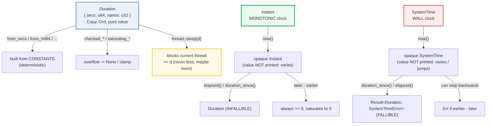

# TIME — Two Clocks, One Span: `Instant`, `SystemTime`, `Duration`, `sleep`

> **One-line goal:** Rust ships **two clocks** that are **not interchangeable** —
> `Instant` (a **monotonic** clock, for *measuring intervals*) and `SystemTime`
> (the **wall** clock, for *timestamps*) — connected by `Duration` (a span of
> seconds + nanoseconds) and used by `std::thread::sleep` (a blocking pause).
>
> **Run:** `just run time` (== `cargo run --bin time`)
> **Member:** `core` (stdlib-only — no `[dependencies]`).
> **Prerequisites:** 🔗 [THREADS](./THREADS.md) (`sleep` blocks a thread);
> 🔗 [ERROR_HANDLING](./ERROR_HANDLING.md) (the `Result`/`SystemTimeError` story).
> **Ground truth:** [`time.rs`](./time.rs); captured stdout:
> [`time_output.txt`](./time_output.txt).
>
> **Determinism note:** `Instant::now()` / `SystemTime::now()` return values that
> vary every run, so the `.rs` **never prints or asserts such a value**. It asserts
> only (a) arithmetic on `Duration`s built from **constants**, and (b) the
> **structural bound** that `start.elapsed()` after a fixed `sleep(d)` is `>= d`.
> Hence two `just out time` runs are byte-identical.

---

## Why this exists (lineage)

Almost every language conflates "what time is it?" with "how long did that
take?" Rust does not — it splits them into two types with deliberately different
guarantees, because the two questions have different failure modes:

| Question | Rust type | Guarantee | Failure mode |
|---|---|---|---|
| "How long did this take?" | **`Instant`** | **Monotonic** — a later `Instant` is never *before* an earlier one (barring OS bugs) | None — `elapsed()` returns an infallible `Duration` |
| "What time is it now?" | **`SystemTime`** | **Wall clock** — reflects the OS's notion of civil time | **Can jump** (NTP step, manual change, leap-second smear); `elapsed()` returns `Result<_, SystemTimeError>` |

The trap is real: the `SystemTime` docs warn that *"an operation that happens
after another operation in real time may have an earlier `SystemTime`"* — e.g.
write file A, write file B, and B's mtime is *before* A's because the clock got
stepped backwards in between. Measuring an interval with `SystemTime` therefore
risks a **negative** elapsed time. `Instant`, reading `CLOCK_MONOTONIC` on Unix,
is immune. Spanning both clocks is `Duration` — a pure, `Copy`, `Ord` value of
`{ seconds: u64, nanos: u32 (< 1e9) }` — and `thread::sleep(d)`, the only way to
park a thread for a span.



---

## Section A — `Duration`: a span built from constants

```rust
let min = Duration::from_secs(60);
assert_eq!(min, Duration::from_millis(60_000));
assert_eq!(min, Duration::from_micros(60_000_000));
assert_eq!(min, Duration::from_nanos(60_000_000_000));
```

> **From time.rs Section A:**
> ```
> ======================================================================
> SECTION A — Duration: a span built from constants (equality & arithmetic)
> ======================================================================
>   Duration::from_secs(60)  ==  60s
>     also == from_millis(60_000) ?  true
>     also == from_micros(60_000_000) ?  true
>     also == from_nanos(60_000_000_000) ?  true
> [check] Duration::from_secs(60) == from_millis(60_000) (units normalize): OK
> [check] Duration::from_secs(60) == from_micros(60_000_000): OK
> [check] Duration::from_secs(60) == from_nanos(60_000_000_000): OK
>   from_secs(60) + from_secs(60) == 120s
> [check] from_secs(60) + from_secs(60) == from_secs(120): OK
>   from_secs(90) + from_millis(500) == 90.5s
> [check] from_secs(90) + from_millis(500) == from_millis(90_500): OK
> ```

**What.** A `Duration` is a normalized `{ secs: u64, subsec_nanos: u32 }` pair.
Every `from_*` constructor divides the input into those two fields, so the
**same span built through different units is equal** — `from_secs(60) ==
from_millis(60_000) == from_micros(60_000_000) == from_nanos(60_000_000_000)`
(this is literally the example in the [`std::time` module docs][std-time-mod]).
Addition carries across the seconds/nanos boundary: `from_secs(90) +
from_millis(500) == from_millis(90_500)`.

**Why (internals).** A `Duration` carries **no clock** — it is a pure value, a
*quantity* of time, not a *point* in time. That is what lets one `Duration`
serve both clocks (`Instant + Duration -> Instant`, `SystemTime + Duration ->
SystemTime`) and `thread::sleep`. Internally the `u64` seconds counter tops out
near `u64::MAX` seconds with `< 1e9` nanos left over — about **584 billion
years** (`Duration::MAX`, see Section F). Because it is pure and `Copy`,
`Duration` arithmetic never touches the OS, never blocks, and is fully
deterministic: the four equalities above hold on every machine, every run. That
purity is also why this bundle can assert on `Duration`s while scrupulously
*not* printing `now()`-values (see the DETERMINISM rule).

---

## Section B — `Duration` parts, comparisons, and the float views

```rust
let d = Duration::from_millis(5_432);
assert_eq!(d.as_secs(), 5);          // whole seconds only
assert_eq!(d.subsec_millis(), 432);  // fractional part

assert_eq!(Duration::from_secs(90).as_secs_f64(), 90.0);  // includes fraction
```

> **From time.rs Section B:**
> ```
> ======================================================================
> SECTION B — Duration: parts (as_secs/subsec_*), comparisons, floats
> ======================================================================
>   Duration::from_millis(5_432):
>     as_secs()       = 5
>     subsec_millis() = 432
> [check] from_millis(5_432).as_secs() == 5 (whole seconds only): OK
> [check] from_millis(5_432).subsec_millis() == 432 (fractional part): OK
>   Duration::from_secs(90).as_secs_f64() = 90
> [check] from_secs(90).as_secs_f64() == 90.0 (exact, whole seconds): OK
> [check] from_secs(90).as_secs() == 90: OK
>   Duration::new(1, 500_000_000)  (1.5s):
>     as_millis() = 1500
>     as_micros() = 1500000
>     as_nanos()  = 1500000000
> [check] 1.5s.as_millis() == 1500 and as_micros() == 1_500_000 and as_nanos() == 1_500_000_000: OK
> [check] from_secs(60) > from_secs(30) (Duration is Ord): OK
> [check] from_millis(1) < from_secs(1): OK
>   Duration::ZERO == 0ns,  Duration::default() == 0ns
> [check] Duration::ZERO == Duration::default(): OK
> [check] Duration::ZERO.is_zero() == true: OK
> ```

**What.** Two families of accessors split a `Duration` differently:
- **`as_secs()` + `subsec_nanos()`/`subsec_millis()`/`subsec_micros()`** — the
  *decomposition*: whole seconds, plus a *fractional slice of one second*
  (always `< 1_000` / `< 1_000_000` / `< 1_000_000_000`). `from_millis(5_432)`
  → `as_secs() == 5`, `subsec_millis() == 432`.
- **`as_millis()` / `as_micros()` / `as_nanos()`** — the *total width* (return
  `u128`). `Duration::new(1, 500_000_000)` → `1500` ms / `1_500_000` µs /
  `1_500_000_000` ns.
- **`as_secs_f64()`** — the whole span including the fraction, as an `f64`.

`Duration` is `Ord`, so `<`/`>`/`>=` work directly. `Duration::default()` is a
zero-length span, identical to `Duration::ZERO` (stabilized 1.53.0).

**Why (internals).**
- **The decomposition vs. total distinction is the #1 source of `Duration`
  bugs.** `subsec_millis()` is *not* "the duration in milliseconds" — it is
  *only the part below one second*. `from_secs(90).subsec_millis() == 0`, not
  `90_000`. For the total, use `as_millis()`.
- **`Duration` deliberately has no `Display`.** The docs: *"there are a variety
  of ways to format spans of time for human readability."* Only `Debug` exists
  (hence the `60s`, `90.5s`, `0ns` output above). For human formatting, reach
  for a crate (`humantime`, `chrono`) or roll your own from `as_secs()`.
- **Float comparison caveat.** `as_secs_f64()` for a *whole* number of seconds
  is exact (`90.0`), but fractional spans like `2.7` are not exactly
  representable in `f64`. The `.rs` therefore compares with an `EPSILON`
  band — bare `==` on `f64` is rejected by clippy's `float_cmp` lint under
  `-D warnings`. The std docs' own `assert_eq!(dur.as_secs_f64(), 2.7)` only
  happens to pass because the rounding lines up; do not rely on it.

---

## Section C — `Instant`: the MONOTONIC clock for measuring intervals

```rust
use std::thread::sleep;
use std::time::{Duration, Instant};

let start = Instant::now();           // opaque; value NEVER printed
sleep(Duration::from_millis(2));
assert!(start.elapsed() >= Duration::from_millis(2));   // the BOUND only
```

> **From time.rs Section C:**
> ```
> ======================================================================
> SECTION C — Instant: the MONOTONIC clock (measure intervals, never print now())
> ======================================================================
> [check] after sleep(2ms), start.elapsed() >= 2ms (bound only; nanos not printed): OK
> [check] elapsed.is_zero() == false (something measurable passed): OK
>   OK: slept >= 2ms (elapsed bound holds; value intentionally not shown)
> [check] b.duration_since(a) >= 1ms (monotonic: later - earlier is positive): OK
> [check] a.checked_duration_since(b) == None (earlier - later is not representable): OK
> ```

**What.** `Instant::now()` returns an **opaque** point on a monotonically
nondecreasing clock. You cannot ask "how many seconds is this Instant?" — there
is no such method. You may only *subtract two `Instant`s* (`duration_since` /
`elapsed`) to get a `Duration`, or compare them. After a fixed `sleep(2ms)`,
`start.elapsed() >= 2ms` holds — but the **exact** nanos are scheduling-dependent,
so the `.rs` asserts only the bound and prints no measured value.

**Why (internals).**
- **Monotonic ≠ steady.** The [`Instant` docs][std-instant] are precise: *"an
  instant may jump forwards or experience time dilation (slow down or speed
  up), but it will never go backwards."* The guarantee is *ordering*, not
  uniform tick length. On Unix `now()` reads `clock_gettime(CLOCK_MONOTONIC)`,
  on Darwin `CLOCK_UPTIME_RAW`, on Windows `QueryPerformanceCounter`.
- **Underflow is saturated, not panicked.** Subtracting an *earlier* from a
  *later* `Instant` is fine; subtracting *later* from *earlier`* used to panic.
  Since the monotonicity bugs documented below, `duration_since`/`elapsed`/`sub`
  **saturate to zero** instead ([`Instant` → Monotonicity][std-instant]). Use
  `checked_duration_since` to *detect* the inversion — it returns `None`.
  Future Rust versions may reintroduce panics in some cases, so don't rely on
  silent saturation.
- **Platform monotonicity bugs exist.** Under rare circumstances (hardware,
  virtualization, OS bugs) even a "monotonic" clock can go backwards on
  non-tier-1 platforms; std saturates to zero as a workaround, which *"obscures
  programming errors where earlier and later instants are accidentally
  swapped"* ([`Instant` → Monotonicity][std-instant]).
- **`Instant + Duration` may panic** if the result is outside the underlying
  range. The docs show `now + Duration::new(31_556_952_000, 0)` (~1 millennium)
  panics on macOS but is fine on Linux. For cross-platform code, *"you can
  comfortably use durations of up to around one hundred years."* Use
  `checked_add`/`checked_sub` to be safe.

> **Determinism rule applied.** `Instant::now()` is *used* (we need a real
> point to measure from) but its value is *never printed or asserted*. Two
> `just out time` runs therefore produce identical stdout even though the
> underlying counter advanced.

---

## Section D — `SystemTime`: the WALL clock (jumpable)

```rust
use std::time::{Duration, SystemTime};

// Constructed from the UNIX_EPOCH anchor — fully deterministic.
let t1 = SystemTime::UNIX_EPOCH + Duration::from_secs(1_000);
let t2 = SystemTime::UNIX_EPOCH + Duration::from_secs(2_000);

assert_eq!(t2.duration_since(t1).unwrap(), Duration::from_secs(1_000)); // Ok
assert!(t1.duration_since(t2).is_err());                                // Err
```

> **From time.rs Section D:**
> ```
> ======================================================================
> SECTION D — SystemTime: the WALL clock (jumpable; use for timestamps, NOT intervals)
> ======================================================================
>   SystemTime::now() obtained (value NOT printed: wall clock varies)
> [check] a SystemTime can be obtained from SystemTime::now() (type proved): OK
>   t1 = UNIX_EPOCH + 1000s;  t2 = UNIX_EPOCH + 2000s  (constructed, deterministic)
> [check] t2.duration_since(t1) is Ok  (later - earlier succeeds): OK
> [check] t2.duration_since(t1) carries Ok(1000s): OK
> [check] t1.duration_since(t2) is Err  (earlier - later -> SystemTimeError): OK
> [check] the SystemTimeError carries the magnitude: .duration() == 1000s: OK
>   Instant     : monotonic, infallible Duration   -> USE for intervals
>   SystemTime  : wall,     Result<_, SystemTimeError> -> USE for timestamps
> ```

**What.** The `.rs` proves a `SystemTime` can be obtained from `now()` (type
only — the value is discarded, never printed), then demonstrates the
**fallible** subtraction API on two `SystemTime`s **constructed** from the
`UNIX_EPOCH` anchor. Because they are constructed, not measured, the result is
deterministic: forward subtraction is `Ok(1000s)`; reversed subtraction is
`Err(SystemTimeError)`, whose `.duration()` carries the magnitude back as
`1000s`.

**Why (internals).**
- **`SystemTime` is not monotonic.** The docs state it plainly: *"this time
  measurement **is not monotonic**... an operation that happens after another
  operation in real time may have an earlier `SystemTime`!"* ([`SystemTime`][std-systemtime]).
  It reads `clock_gettime(CLOCK_REALTIME)` on Unix / `GetSystemTimePreciseAsFileTime`
  on Windows — the OS's civil clock, which NTP or an admin can step. It also
  **does not count leap seconds**.
- **That is why `duration_since`/`elapsed` return `Result`.** Unlike `Instant`'s
  infallible `Duration`, `SystemTime::duration_since` returns
  `Result<Duration, SystemTimeError>`. The `Err` arm exists precisely because
  the wall clock can move backwards between the two samples. `SystemTimeError`
  notably does **not** implement `PartialEq` (it wraps an opaque `Duration`),
  which is why the `.rs` compares via `as_ref().ok() == Some(&...)` rather than
  `result == Ok(...)`.
- **`UNIX_EPOCH` is the anchor.** *"1970-01-01 00:00:00 UTC"* on all systems.
  `duration_since(UNIX_EPOCH).unwrap().as_secs()` is a POSIX `time_t` as a
  `u64`. Any `SystemTime` you can reason about deterministically you build as
  `UNIX_EPOCH + Duration` — that is exactly what the `.rs` does.
- **Use `SystemTime` for *stamps*, never for *intervals*.** File mtimes, cache
  expiry deadlines, log timestamps, certificate validity — yes. "How long did
  the request take?" — no; the clock can jump mid-request and hand you a
  negative or wildly wrong elapsed time.

🔗 [ERROR_HANDLING](./ERROR_HANDLING.md) — `SystemTimeError` and the
`Result<Duration, _>` pattern are the canonical "fallible because the world is
messy" example.

---

## Section E — `thread::sleep`: blocks the current thread for at least `d`

```rust
use std::thread::sleep;
use std::time::{Duration, Instant};

let before = Instant::now();
sleep(Duration::from_millis(1));   // blocks the CURRENT thread for >= 1ms
assert!(Instant::now().duration_since(before) >= Duration::from_millis(1));
```

> **From time.rs Section E:**
> ```
> ======================================================================
> SECTION E — thread::sleep: blocks the current thread for AT LEAST d
> ======================================================================
> [check] control resumes after sleep(1ms) (the () call returned): OK
> [check] sleep(1ms) blocks for >= 1ms (never less; may be more): OK
>   OK: thread blocked then resumed; >= 1ms elapsed (value not shown)
> [check] sleep(Duration::ZERO) does not meaningfully block (>= 0s trivially holds): OK
> ```

**What.** `sleep(d)` returns `()` — there is no value to inspect, so the
observable contract is purely *"control resumed AND at least `d` elapsed."*
The `.rs` confirms both: a flag set after the call (proving it returned), and a
monotonic bound `after.duration_since(before) >= 1ms`.

**Why (internals).**
- **"At least" is a guarantee, "exactly" is not.** The [`sleep` docs][std-sleep]:
  *"The thread may sleep longer than the duration specified due to scheduling
  specifics or platform-dependent functionality. It will never sleep less."*
  So `sleep(1ms)` may take 1.1ms or 3ms under load — never 0.9ms. That is why
  the assert is `>=`, not `==`.
- **It is a BLOCKING call — forbidden in `async`.** *"This function is
  blocking, and should not be used in `async` functions."* Blocking a thread
  inside an async runtime starves the executor's worker; in `async` use
  `tokio::time::sleep` (a future that yields) instead. 🔗 [ASYNC_BASICS](./ASYNC_BASICS.md).
- **`Duration::ZERO` is special-cased per platform.** On Unix it returns
  immediately without invoking `nanosleep`; on Windows it still calls the
  `Sleep` syscall. To *yield* the time-slice rather than sleep, use
  `std::thread::yield_now` ([`sleep` → Platform-specific behavior][std-sleep]).
- **Spurious wakeups are handled.** On Unix the underlying `nanosleep` can be
  interrupted by a signal; `sleep` re-invokes it to honor the full duration.

🔗 [THREADS](./THREADS.md) — `sleep` is the simplest OS-thread primitive; it
pairs with `spawn`/`join` (🔗 [MPSC_CHANNELS](./MPSC_CHANNELS.md),
🔗 [BARRIER_ONCE](./BARRIER_ONCE.md)) for timing in concurrent code.

---

## Section F — `Duration` edge cases: overflow, `checked_*`, `saturating_*`

```rust
use std::time::Duration;

assert_eq!(Duration::MAX.checked_add(Duration::from_secs(1)), None);
assert_eq!(Duration::MAX.saturating_add(Duration::from_secs(1)), Duration::MAX);
assert_eq!(Duration::ZERO.checked_sub(Duration::from_nanos(1)), None);
assert_eq!(Duration::ZERO.saturating_sub(Duration::from_nanos(1)), Duration::ZERO);
```

> **From time.rs Section F:**
> ```
> ======================================================================
> SECTION F — Duration edge cases: overflow, checked_*, saturating_*
> ======================================================================
>   Duration::MAX (approx 584,942,417,355 years): 18446744073709551615.999999999s
> [check] Duration::MAX.checked_add(from_secs(1)) == None (overflow detected): OK
> [check] Duration::MAX.saturating_add(from_secs(1)) == Duration::MAX (clamped): OK
> [check] ZERO.checked_sub(from_nanos(1)) == None (negative is not representable): OK
> [check] ZERO.saturating_sub(from_nanos(1)) == Duration::ZERO (clamps at zero): OK
> [check] from_millis(500).checked_mul(3) == Some(from_millis(1_500)): OK
> [check] Duration::MAX.checked_mul(2) == None (scalar overflow): OK
> [check] from_secs(100).abs_diff(from_secs(80)) == from_secs(20)  (order-independent): OK
> ```

**What.** `Duration` cannot be negative (its `secs` are `u64`), so subtraction
that would go below zero **underflows**. The `+`/`-` operators **panic on
overflow in debug builds** (the build `cargo run` uses), so for untrusted
inputs use the four `checked_*`/`saturating_*` variants on `add`/`sub`/`mul`:
- `checked_add` → `Option<Duration>` (`None` on overflow).
- `saturating_add` → clamps at `Duration::MAX`.
- `checked_sub` → `None` if the result would be negative.
- `saturating_sub` → clamps at `Duration::ZERO`.

**Why (internals).**
- **`Duration::MAX` ≈ 584 billion years** — the printed `Debug` shows
  `18446744073709551615.999999999s` (`u64::MAX` seconds + 999_999_999 nanos).
  You will not hit it by accident, but **`checked_mul` of a `Duration` by a
  runtime `u32` scalar** can overflow well before `MAX` (e.g. `from_secs(1) *
  u32::MAX`), which is why the `.rs` exercises both `checked_mul` and the
  `MAX.checked_mul(2)` overflow.
- **`abs_diff` is symmetric** (stabilized 1.81.0): `a.abs_diff(b) ==
  b.abs_diff(a)` and is never negative — handy when you do not know which
  operand is larger.
- **Why no `Duration` can be negative.** The type is `secs: u64` + `nanos: u32`.
  There is no sign bit. This is the deep reason `Instant - Instant` *saturates
  to zero* rather than returning a negative — `Duration` simply cannot express
  "−5ms." `SystemTime` expresses the same impossibility *as an `Err`* because
  losing the information silently would be worse for timestamps.

---

## Pitfalls (the expert payoff)

| Trap | Symptom | Fix / why |
|---|---|---|
| **Measuring an interval with `SystemTime`** | Elapsed is sometimes negative / wildly wrong after an NTP step | Use `Instant` for *any* "how long did this take?". `SystemTime` is for timestamps (file mtimes, deadlines) and returns `Result` precisely because it can jump. |
| **Printing/asserting `Instant::now()` or `SystemTime::now()` values** | Tests are flaky; captured `_output.txt` differs every run | Never print or assert the value. Assert only arithmetic on `Duration`s built from constants, and *bounds* (`elapsed() >= d`), never the measured nanos. |
| **`subsec_millis()` returns 0, not the total** | "My 90-second duration reports 0 milliseconds" | `subsec_*` is the *fractional slice below one second*. For the total use `as_millis()`/`as_micros()`/`as_nanos()` (returns `u128`). |
| **`sleep(d)` taking longer than `d`** | A timing test asserts `==` and fails intermittently | `sleep` guarantees **at least** `d`, never exactly. Assert `>=`. On a loaded machine it can be much longer. |
| **`sleep` inside an `async fn`** | Runtime stalls, latency spikes, "thread blocked" warnings | `sleep` blocks the OS thread. In async use `tokio::time::sleep` (a yielding future). The std docs forbid `sleep` in `async`. |
| **`a.duration_since(b)` silently returns `0ns`** | A swapped-argument bug is hidden; you measure zero elapsed | `Instant` subtraction *saturates to zero* when `b > a`. Use `checked_duration_since` to detect the inversion (`None`). |
| **`Duration + Duration` panics in debug** | `attempt to add with overflow` near `Duration::MAX` | The `+`/`-` operators panic on overflow in debug builds. Use `checked_add`/`saturating_add` for untrusted magnitudes. |
| **`as_secs_f64() == 2.7`** | Clippy `float_cmp` fails under `-D warnings`; or a flaky equality | Fractional seconds are not exactly representable in `f64`. Compare with an `EPSILON` band, or stick to integer `as_secs()`/`as_millis()` for exact equality. |
| **`Duration` has no `Display`** | `{}` format fails to compile | Only `Debug` (`{:?}`) is implemented, by design. Use a crate (`humantime`) or format from `as_secs()` yourself. |
| **`SystemTimeError` does not impl `PartialEq`** | `result == Ok(duration)` fails to compile | Compare the inner `Duration` instead: `result.as_ref().ok() == Some(&duration)`, or `result.is_ok()` then `result.unwrap()`. |
| **`Instant + Duration` panics on macOS** | Adding ~1 millennium to `now()` panics on Darwin, works on Linux | The underlying range is platform-specific. *"For cross-platform code, you can comfortably use durations of up to around one hundred years."* Use `checked_add`. |

---

## Cheat sheet

```rust
use std::thread::sleep;
use std::time::{Duration, Instant, SystemTime};

// Duration: a pure { secs: u64, nanos: u32 } span. No clock. Copy + Ord.
let min = Duration::from_secs(60);
assert_eq!(min, Duration::from_millis(60_000));          // units normalize
assert_eq!(Duration::from_secs(60) + Duration::from_secs(60), Duration::from_secs(120));

// Parts: as_secs()+subsec_* (decomposition) vs as_millis()/as_nanos() (total, u128).
let d = Duration::from_millis(5_432);
assert_eq!((d.as_secs(), d.subsec_millis()), (5, 432)); // not (5, 5432)!
assert_eq!(d.as_millis(), 5_432);                        // the TOTAL

// Instant: MONOTONIC. Use ONLY for measuring intervals. Never print now().
let start = Instant::now();
sleep(Duration::from_millis(2));
assert!(start.elapsed() >= Duration::from_millis(2));    // bound only

// SystemTime: WALL clock. Can jump (NTP). Returns Result. Use for stamps.
let now: SystemTime = SystemTime::now();                 // value varies — don't assert
let t2 = SystemTime::UNIX_EPOCH + Duration::from_secs(2_000);   // deterministic
assert!(t2.duration_since(SystemTime::UNIX_EPOCH).is_ok());     // Ok(2000s)

// sleep: blocks the CURRENT thread for >= d (never less, maybe more). NOT in async.
sleep(Duration::from_millis(1));

// Overflow: + panics in debug. Use checked_* / saturating_*.
assert_eq!(Duration::MAX.checked_add(Duration::from_secs(1)), None);
assert_eq!(Duration::MAX.saturating_add(Duration::from_secs(1)), Duration::MAX);
assert_eq!(Duration::ZERO.checked_sub(Duration::from_nanos(1)), None);  // no negatives
```

---

## Sources

Every claim above was web-verified against the authoritative Rust documentation
(fetched live from `doc.rust-lang.org`, std 1.96.0).

- **`std::time` module docs** — the four structs (`Duration`, `Instant`,
  `SystemTime`, `SystemTimeError`), the `from_secs(5) == from_millis(5_000)`
  constructor-equality example, and the `Instant::elapsed` benchmark idiom:
  https://doc.rust-lang.org/std/time/index.html
- **`std::time::Instant`** — "a measurement of a monotonically nondecreasing
  clock. Opaque and useful only with Duration"; "it will never go backwards";
  the OS-specific system calls (`CLOCK_MONOTONIC` / `CLOCK_UPTIME_RAW` /
  `QueryPerformanceCounter`); the Monotonicity section (saturate-to-zero
  workaround, `checked_duration_since`); the macOS-millennium panic example;
  the `elapsed() >= three_secs` assert idiom:
  https://doc.rust-lang.org/std/time/struct.Instant.html
- **`std::time::SystemTime`** — "is not monotonic... an operation that happens
  after another operation in real time may have an earlier SystemTime"; the
  fallible `duration_since`/`elapsed` returning `Result<Duration,
  SystemTimeError>`; `UNIX_EPOCH` = "1970-01-01 00:00:00 UTC"; "does not count
  leap seconds"; the "Great Scott!" clock-went-backwards example; Unix realtime
  `clock_gettime` / Windows `GetSystemTimePreciseAsFileTime`:
  https://doc.rust-lang.org/std/time/struct.SystemTime.html
- **`std::time::Duration`** — "composed of a whole number of seconds and a
  fractional part represented in nanoseconds"; `Default` returns a zero-length
  span; `ZERO`/`MAX` (≈584,942,417,355 years); `from_secs`/`from_millis`/
  `from_micros`/`from_nanos`/`new`; `as_secs`/`subsec_*` vs `as_millis`/
  `as_micros`/`as_nanos` (`u128`); `as_secs_f64`; `checked_add`/`saturating_add`
  (with the `Duration::new(1,0).checked_add(Duration::new(u64::MAX,0)) == None`
  example); no `Display` impl by design:
  https://doc.rust-lang.org/std/time/struct.Duration.html
- **`std::thread::sleep`** — "Puts the current thread to sleep for at least the
  specified amount of time. The thread may sleep longer... It will never sleep
  less. This function is blocking, and should not be used in `async`
  functions"; the `Instant::now()` + `assert!(now.elapsed() >= ten_millis)`
  example; the `Duration::ZERO` Unix-vs-Windows behavior and `yield_now` hint:
  https://doc.rust-lang.org/std/thread/fn.sleep.html
- **`std::time::SystemTimeError`** — the error type returned by
  `SystemTime::duration_since`/`elapsed`, wrapping the magnitude `.duration()`;
  (does not implement `PartialEq`, motivating the `.as_ref().ok()` comparison in
  the `.rs`):
  https://doc.rust-lang.org/std/time/struct.SystemTimeError.html
