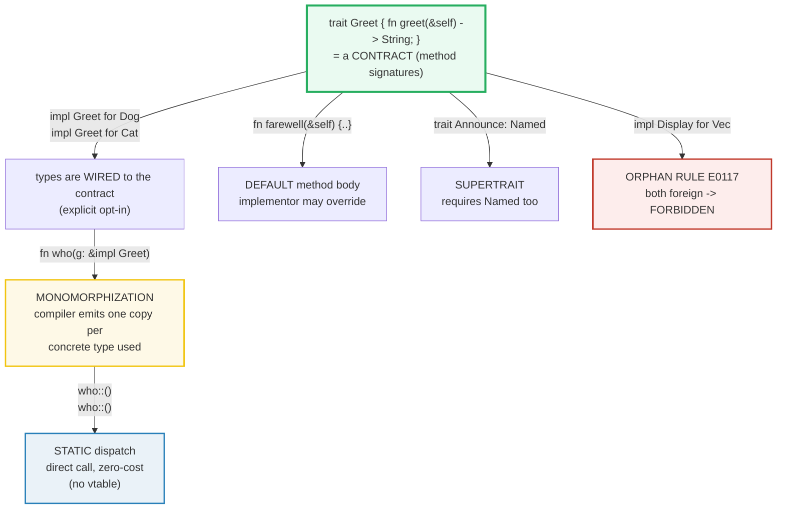

# TRAITS_BASICS — Contracts, Default Methods, and Static Dispatch

> **One-line goal:** a **trait** defines a *contract* of behavior (method
> signatures, optionally with **default bodies**); types **implement** it;
> `impl Trait` in argument/return position selects **static dispatch** via
> **monomorphization** (one compiled copy per concrete type — zero runtime cost);
> **supertraits** compose contracts; the **orphan rule** forbids implementing a
> foreign trait for a foreign type.
>
> **Run:** `just run traits_basics` (== `cargo run --bin traits_basics`)
> **Member:** `core` (stdlib-only — no `[dependencies]`).
> **Prerequisites:** [OWNERSHIP](./OWNERSHIP.md), [BORROWING](./BORROWING.md),
> [STRUCTS_ENUMS](./STRUCTS_ENUMS.md) (you need `impl` blocks and `&self` first).
> **Ground truth:** [`traits_basics.rs`](./traits_basics.rs); captured stdout:
> [`traits_basics_output.txt`](./traits_basics_output.txt).

---

## Why this exists (lineage)

Most languages let you say "these unrelated types share an ability." They differ
in *how*, and Rust's choice is decisive:

| Model | Mechanism | Cost / problem |
|---|---|---|
| **Interfaces** (Java, C#, TypeScript) | A type *declares* it implements an interface; dispatch is **virtual** (vtable lookup) | Runtime indirection on every call; a class can be forced to fit a hierarchy. |
| **Go interfaces** | *Structural* — if your type has the right methods, it satisfies the interface automatically | Convenient, but **implicit** (no compile-time proof at the definition site) and still virtual dispatch. |
| **C++ templates / concepts** | Code is generated per type; "concepts" constrain them | Zero-cost, but error messages are legendarily bad and there is no shared ABI. |
| **Rust traits** | A type **explicitly** opts in via `impl Trait for Type`; generics + `impl Trait` are **monomorphized** (static dispatch); trait *objects* opt into dynamic dispatch when you ask for it | Zero-cost *by default*, explicit, with **coherence** (one impl anywhere) preventing conflicts. |

Rust's bet: a trait is a **compile-time contract**. The compiler generates a
specialized copy of generic code for each concrete type used (monomorphization),
so trait-dispatched code runs **as fast as hand-written per-type code** — no
vtable, no box, no indirection. When you *want* runtime polymorphism, you reach
for a trait object (`dyn Trait`) and pay for it explicitly (🔗 [TRAIT_OBJECTS]).



---

## The mental model (memorize these)

1. A **trait** is a set of method signatures (the *contract*). A method may have
   no body (required) or a body (a **default** an implementor may override).
2. A type **implements** a trait with `impl Trait for Type { ... }` — an explicit,
   named opt-in (unlike Go's implicit satisfaction).
3. `impl Trait` in a parameter or return position means *"some concrete type that
   implements Trait"*. The compiler **monomorphizes**: one compiled copy per
   concrete type → **static dispatch**, zero runtime cost.
4. The trait must be **in scope** (`use crate::Greet;`) to call its methods.
5. **Coherence / orphan rule:** you may `impl T for X` only if you own `T` **or**
   `X` (or both). Two foreign things → `E0117`.

Everything below is a consequence of those five lines.

---

## Section A — Define a trait and implement it for types

```rust
trait Greet {
    fn greet(&self) -> String; // required: no body, ends in `;`
}

impl Greet for Dog {
    fn greet(&self) -> String { format!("Woof! (says {})", self.name) }
}
```

> **From traits_basics.rs Section A:**
> ```
> ======================================================================
> SECTION A — define a trait, implement it for types
> ======================================================================
>   trait Greet { fn greet(&self) -> String; }
>   impl Greet for Dog   /   impl Greet for Cat
>     dog.greet() = "Woof! (says Rex)"
>     cat.greet() = "Meow! (says Mia)"
> [check] Dog implements Greet: greet() == "Woof! (says Rex)": OK
> [check] Cat implements Greet: greet() == "Meow! (says Mia)": OK
> ```

**What.** `trait Greet { fn greet(&self) -> String; }` declares a contract: any
type that wants to be `Greet` must provide a `greet(&self) -> String` method with
exactly that signature. `Dog` and `Cat` are then *wired* to the contract with two
separate `impl Greet for ...` blocks. The two checks confirm each type's method
returns the pinned string.

**Why (internals).**
- A trait definition lives in the **type namespace** of its module and defines an
  implicit type parameter `Self` — "the type implementing this interface" ([The
  Rust Reference — Traits][ref-traits]). A method *signature* with no body
  (ending in `;`) is **required**: "the implementation must define the function"
  ([Reference][ref-traits]). If you `impl Greet for Dog` but forget `greet`, the
  compiler refuses to compile.
- **Explicit, not structural.** Unlike Go, merely having a method called `greet`
  with a matching signature does *not* make a type `Greet` — you must write the
  `impl` block. The Book: "Implementing a trait on a type is similar to
  implementing regular methods" but "the user must bring the trait into scope as
  well as the types" ([Book ch10.2][book-traits]).
- **The trait must be in scope.** To call `dog.greet()`, `Greet` must be visible.
  In a single-file binary every item is in the same module and thus in scope; in
  a multi-module crate you write `use crate::Greet;` (or `use aggregator::Summary;`
  as in the Book) before the method call resolves. Forgetting this is the most
  common "method not found" confusion for newcomers.

> **`Self` note.** Inside a trait, `Self` means "the implementing type." A trait
> may also be generic (`trait Seq<T>`) and constrain `Self` with other traits
> (supertraits — Section E). The Reference fixes all of this ([Reference —
> Traits][ref-traits]).

🔗 [STRUCTS_ENUMS](./STRUCTS_ENUMS.md) — `impl` blocks and `&self`/`Self` are
introduced there; a trait impl is just a *named* `impl` block that fulfills a
contract.

---

## Section B — Default methods: override or accept as-is

A trait method may carry a **body**. That body is the **default** — an implementor
that does *not* redefine the method gets it for free; one that *does* overrides it.

```rust
trait Greet {
    fn greet(&self) -> String;                    // required
    fn farewell(&self) -> String {                // DEFAULT body
        String::from("(waves goodbye)")
    }
}

impl Greet for Dog {}        // Dog: no farewell -> uses the DEFAULT
impl Greet for Cat {
    fn farewell(&self) -> String { format!("{} stalks off", self.name) } // override
}
```

> **From traits_basics.rs Section B:**
> ```
> ======================================================================
> SECTION B — default method: one type overrides, one uses the default
> ======================================================================
>   trait Greet {
>       fn greet(&self) -> String;                 // required
>       fn farewell(&self) -> String {             // DEFAULT body
>           String::from("(waves goodbye)")
>       }
>   }
>     dog.farewell() = "(waves goodbye)"   (Dog: empty impl, uses DEFAULT)
>     cat.farewell() = "Mia stalks off"   (Cat: OVERRIDES farewell)
> [check] Dog uses the DEFAULT farewell (no override in its impl): OK
> [check] Cat OVERRIDES the default farewell with its own body: OK
> [check] override vs default produce DISTINCT outputs: OK
> ```

**What.** `Dog`'s impl block omits `farewell`, so `dog.farewell()` returns the
default `"(waves goodbye)"`. `Cat` redefines `farewell`, so `cat.farewell()`
returns `"Mia stalks off"`. The third check pins that the two outputs differ.

**Why (internals).**
- The Reference is precise: "If the trait function defines a body, this
  definition acts as a **default** for any implementation which does not override
  it" ([Reference — Traits][ref-traits]). Overriding uses *exactly the same
  syntax* as implementing a required method — there is no `override` keyword.
- **A default method may call other (possibly required) trait methods.** This lets
  a trait ship a lot of behavior and ask the implementor for only a small part.
  The Book's pattern: require `summarize_author`, then give `summarize` a default
  that calls it ([Book ch10.2][book-traits]). We use the same idea in Section E,
  where `Announce`'s default calls the (required) supertrait method `name()`.
- **You cannot call the default from the override.** The Book: "it isn't possible
  to call the default implementation from an overriding implementation of that
  same method" ([Book ch10.2][book-traits]). If `Cat::farewell` wanted the default
  text it would have to re-type it; there is no `super::farewell()`.

---

## Section C — `impl Trait` as a parameter: static dispatch via monomorphization

```rust
fn who(g: &impl Greet) -> String { g.greet() }
// who(&dog) -> "Woof! (says Rex)"   who(&cat) -> "Meow! (says Mia)"
```

> **From traits_basics.rs Section C:**
> ```
> ======================================================================
> SECTION C — impl Trait param: fn who(g: &impl Greet), static dispatch
> ======================================================================
>   fn who(g: &impl Greet) -> String { g.greet() }
>     who(&dog) = "Woof! (says Rex)"
>     who(&cat) = "Meow! (says Mia)"
>   (compiler emits ONE copy of `who` per concrete type -> zero-cost)
> [check] who(&Dog) dispatches statically to Dog::greet: OK
> [check] who(&Cat) dispatches statically to Cat::greet: OK
> ```

**What.** `g: &impl Greet` means "a reference to *some* type that implements
`Greet`." `who` accepts both a `&Dog` and a `&Cat`. The two checks confirm the
correct per-type method runs.

**Why (internals) — this is the load-bearing idea.**
- **`impl Trait` is sugar for a trait bound.** The Book is explicit: "The `impl
  Trait` syntax works for straightforward cases but is actually syntax sugar for
  a longer form known as a *trait bound*":

  ```rust
  fn who(g: &impl Greet) -> String { g.greet() }      // shorthand
  fn who<T: Greet>(g: &T) -> String { g.greet() }     // desugared trait bound
  ```

  🔗 [TRAIT_BOUNDS](./TRAIT_BOUNDS.md) covers the `<T: Trait>` form, `+`, and
  `where` clauses in depth; this bundle stays on the shorthand.
- **Monomorphization = zero runtime cost.** When the compiler sees `who` called
  with `&Dog` *and* `&Cat`, it **generates two specialized copies** of the
  function — effectively `who_dog(g: &Dog)` and `who_cat(g: &Cat)` — and each
  call site jumps directly to the right one. The Book: "Rust accomplishes this by
  performing monomorphization of the code using generics at compile time...
  turning generic code into specific code by filling in the concrete types" and
  "we pay **no runtime cost** for using generics" ([Book ch10.1][book-generics]).
  The canonical illustration is `Option<T>` being expanded into `Option_i32` and
  `Option_f64` ([Book ch10.1][book-generics]).
- **Static dispatch, not virtual.** Because the concrete type is known at each
  call site, there is **no vtable lookup, no pointer indirection**. This is the
  defining difference from a trait object (`&dyn Greet`), which *does* go through
  a vtable at runtime. 🔗 [TRAIT_OBJECTS](./TRAIT_OBJECTS.md) — dynamic dispatch
  is the explicit, opt-in alternative; this bundle is the zero-cost default.
- **Two params, same type vs. independent types.** `&impl Greet, &impl Greet`
  allows the two arguments to be *different* types; `<T: Greet>(a: &T, b: &T)`
  forces them to be the *same* type ([Book ch10.2][book-traits]). The shorthand
  trades expressiveness for readability — reach for the bound form when you need
  the constraint.

---

## Section D — `impl Trait` as a return type: a concrete type hidden behind the trait

```rust
fn make_greeter() -> impl Greet { Dog { name: "Bot" } }
// callers see only `impl Greet`; the concrete `Dog` is an implementation detail
```

> **From traits_basics.rs Section D:**
> ```
> ======================================================================
> SECTION D — impl Trait return: a concrete type hidden behind the trait
> ======================================================================
>   fn make_greeter() -> impl Greet { Dog { name: "Bot" } }
>     make_greeter().greet() = "Woof! (says Bot)"
>   (caller sees only `impl Greet`; the concrete Dog is hidden)
> [check] a value returned as `impl Greet` is greetable (concrete type = Dog): OK
> ```

**What.** `make_greeter` returns `impl Greet`, so the caller knows only that the
result is *greetable* — not that it is a `Dog`. The check confirms the returned
value behaves as expected.

**Why (internals).**
- **It returns exactly one concrete type.** Behind `impl Trait` there is always a
  single, concrete type the compiler can see (here `Dog`). The Book: "By using
  `impl Summary` for the return type, we specify that the function returns some
  type that implements the `Summary` trait without naming the concrete type"
  ([Book ch10.2][book-traits]).
- **The single-type restriction.** You **cannot** return `Dog` *or* `Cat` from
  one `-> impl Greet` function — that is a compile error, not a runtime choice:

  ```console
  error[E0308]: `if` and `else` have incompatible types
   --> src/lib.rs:2:5
    |
  2 | /     if switch { NewsArticle { .. } }
  3 | |     else       { SocialPost { .. } }
    | |_____________________^ expected `NewsArticle`, found `SocialPost`
  ```

  Returning *different* concrete types behind one `impl Trait` requires a **trait
  object** (`Box<dyn Greet>`) — i.e. dynamic dispatch. The Book points readers to
  Chapter 18 for exactly this ([Book ch10.2][book-traits]); 🔗 [TRAIT_OBJECTS].
- **Why it exists at all: iterators and closures.** The killer use case is
  returning iterator/closure types "that only the compiler knows or types that
  are very long to specify" ([Book ch10.2][book-traits]). `fn nums() -> impl
  Iterator<Item = i32> { (0..10).map(|x| x * 2) }` would otherwise require naming
  an unholy nested type like `Map<Range<i32>, [closure@...]>`. `impl Trait` hides
  it while keeping static dispatch. (🔗 a future ITERATORS bundle covers this in
  depth.)

---

## Section E — Supertraits and multiple bounds (`+`)

A trait can **require** other traits. A **supertrait** bound says "to implement
me, you must also implement these."

```rust
trait Named { fn name(&self) -> &str; }

trait Announce: Named {                       // Named is Announce's SUPERTRAIT
    fn announce(&self) -> String {            // default that calls the supertrait method
        format!(">> {} <<", self.name())
    }
}

fn tag(x: &(impl Named + fmt::Display)) -> String { format!("[{}] {}", x.name(), x) }
```

> **From traits_basics.rs Section E:**
> ```
> ======================================================================
> SECTION E — supertrait (trait Announce: Named) + multiple bounds (+)
> ======================================================================
>   trait Named { fn name(&self) -> &str; }
>   trait Announce: Named { fn announce(&self) -> String { ... } }
>     robot.name()    = "R2"
>     robot.announce()= ">> R2 <<"
>     announce_for(&robot) = "R2 says: >> R2 <<"
>   fn tag(x: &(impl Named + fmt::Display)) -> String  // multiple bounds
>     tag(&robot)     = "[R2] Robot#R2"
> [check] subtrait's default method calls the SUPERTRAIT method (self.name()): OK
> [check] a subtrait bound grants the supertrait's methods (a.name() legal): OK
> [check] multiple bounds `Named + Display` let one fn use both behaviors: OK
> ```

**What.** `trait Announce: Named` makes `Named` a **supertrait** of `Announce`.
`Robot` implements *both* (it must — otherwise `impl Announce for Robot` is a
compile error). Three checks pin: the default `announce` calls the supertrait
`name()`; a function bounded by `impl Announce` may also call `name()`; and
`&(impl Named + fmt::Display)` lets one function use both `name()` and `{}`.

**Why (internals).**
- **Supertrait = a bound on `Self`.** The Reference: "Supertraits are traits that
  are required to be implemented for a type to implement a specific trait...
  Supertraits are declared by trait bounds on the `Self` type" ([Reference —
  Traits][ref-traits]). The canonical form is `trait Circle: Shape` ([Reference —
  Traits][ref-traits]); our `trait Announce: Named` is identical in shape, and
  the brief's `trait Greet: Named` is the same pattern.
- **The subtrait may call supertrait methods.** Because every `Announce` is
  guaranteed to be `Named`, `Announce`'s default body may freely call
  `self.name()`. The Reference's `Circle` does the same — it gives `radius` a
  default that calls `area` from the `Shape` supertrait ([Reference — Traits]
  [ref-traits]).
- **Implementing the subtrait requires implementing the supertrait.** If you write
  `impl Announce for Robot {}` without also `impl Named for Robot`, you get a
  "the trait bound `Robot: Named` is not satisfied" error (E0277). You satisfy it
  by adding the `Named` impl, exactly as the `.rs` does.
- **`+` composes bounds; `impl Trait` is sugar either way.** `&(impl Named +
  Display)` requires both; the long form is `<T: Named + fmt::Display>`; when
  there are many bounds a `where` clause is cleaner ([Book ch10.2][book-traits]).
  Parens are required when `+` sits behind `&` — without them you hit *"ambiguous
  `+` in a type"* (the compiler helpfully suggests `&(impl A + B)`).

> **Supertrait vs. trait object.** A supertrait bound is a **compile-time**
> requirement that monomorphizes away. A trait *object* (`dyn Announce`) also
  requires its supertraits be satisfied, *and* that the trait be **dyn-safe**
  (formerly "object safe") — no `Self`-returning methods, no generics, etc. ([The
  Rust Reference — Traits][ref-traits]). 🔗 [TRAIT_OBJECTS](./TRAIT_OBJECTS.md).

---

## Section F — The orphan rule: own the trait **or** the type

You may `impl Trait for Type` only if **at least one** of them is local to your
crate. This is **coherence** / the **orphan rule**.

> **From traits_basics.rs Section F:**
> ```
> ======================================================================
> SECTION F — orphan rule: own the trait OR the type (else E0117)
> ======================================================================
>   Direction 1 (allowed): FOREIGN trait on a LOCAL type
>     impl fmt::Display for Version  ->  format!("{}", v) = "1.2"
>   Direction 2 (allowed): LOCAL trait on a FOREIGN type
>     impl SumExt for Vec<i32>       ->  nums.total() = 10
>   Direction 3 (FORBIDDEN -> E0117):
>     // impl fmt::Display for Vec<i32> { .. }   // both foreign
> [check] Direction 1 OK: impl Display (foreign) for Version (local): OK
> [check] Direction 2 OK: impl SumExt (local) for Vec<i32> (foreign): OK
> ```

**What.** The runnable code shows the two **allowed** directions: implementing the
stdlib `Display` on our local `Version` (foreign trait + local type), and
implementing our local `SumExt` on the stdlib `Vec<i32>` (local trait + foreign
type). Both compile and the checks confirm their behavior. The third direction —
foreign trait on a foreign type — is a compile error and so appears only as a
comment.

**Why (internals).**
- **The rule prevents conflicts.** Without it, two crates could each `impl
  Display for Vec<T>` and the compiler could not decide which to use. The Book:
  "This rule ensures that other people's code can't break your code and vice
  versa. Without the rule, two crates could implement the same trait for the same
  type, and Rust wouldn't know which implementation to use" ([Book ch10.2]
  [book-traits]). The property is called **coherence**; the specific clause is
  the **orphan rule**, "so named because the parent type is not present."
- **"Local" = defined in the current crate.** `Display` and `Vec` are defined in
  `std` (foreign to this crate). `Version`, `SumExt`, `Greet` are defined here
  (local). Owning **one** side is enough; owning **neither** is forbidden:

  ```console
  error[E0117]: only traits defined in the current crate can be implemented
                for types defined outside of the crate
   --> src/main.rs:1:1
    |
  1 | impl std::fmt::Display for Vec<i32> {}
    | ^^^^^^^^^^^^^^^^^^^^^^^^^^^^^^^-----
    | |                            |
    | |                            `Vec` is not defined in the current crate
    | `std::fmt::Display` is not defined in the current crate
    |
    = note: define and implement a trait or new type instead
  ```

  This is the canonical **E0117** message: *"only traits defined in the current
  crate can be implemented for types defined outside of the crate"* ([Error index
  E0117][e0117]). The error index's own example is `impl Drop for u32 {}` — same
  shape, both foreign ([E0117][e0117]).

- **The two standard escape hatches** (both from [E0117][e0117]):
  1. **Wrap the foreign type in a local newtype.** `struct MyVec(Vec<i32>);` then
     `impl Display for MyVec`. Now the type is local → allowed. This is the
     aptly-named **newtype pattern**.
  2. **Define your own trait** and impl *that* for the foreign type (exactly
     Direction 2 here: `SumExt` for `Vec<i32>`). This is an **extension trait**.

  The design rationale is documented in [RFC 1023 "Rebalancing Coherence"]
  [rfc-1023], which the E0117 page cites.

> **Scope rule recap.** Notice that to call `format!("{}", v)` on our `Version`,
> the `Display` trait must be **in scope**. It lives in `std::fmt` and is re-exported
> by the prelude, so it is always available — but a *custom* trait from another
> module requires an explicit `use` before its methods resolve (see Section A).

🔗 [ERROR_HANDLING](./ERROR_HANDLING.md) — the `std::error::Error` and `Display`
traits are the canonical reason you `impl Display` for your own types: it is the
foreign-trait-on-local-type direction (allowed), and it unlocks `?` and `{}`
formatting. 🔗 [GENERICS](./GENERICS.md) — traits are the bounds that make
generics useful; monomorphization is shared machinery.

---

## Pitfalls (the expert payoff)

| Trap | Symptom | Fix / why |
|---|---|---|
| **Forgetting to bring the trait into scope** | `error[E0599]: no method named \`greet\` found` | `use crate::Greet;` (or `use aggregator::Summary;`). The method exists but is unreachable until the trait is in scope — even though the *type* is. |
| **Required method not implemented** | `error[E0046]: missing \`greet\` in implementation of \`Greet\`` | A method with no body is **required**. Either provide it, or give it a default body in the trait. |
| **Overriding expects to call the default** | you re-implement `farewell` but can't reach the default text | There is **no `super::method()`** in Rust. Re-type the default body, or factor the shared logic into a separate free function. |
| **Returning two types from `-> impl Trait`** | `error[E0308]: \`if\` and \`else\` have incompatible types` | `impl Trait` return permits exactly **one** concrete type. Return a `Box<dyn Trait>` (dynamic dispatch) to vary the type at runtime. |
| **`+` behind `&` without parens** | `error: ambiguous \`+\` in a type` | Write `&(impl A + B)`, not `&impl A + B`. The compiler suggests the parens. |
| **Subtrait without the supertrait** | `error[E0277]: the trait bound \`Robot: Named\` is not satisfied` | `trait B: A` **requires** implementors to also impl `A`. Add the missing `impl A for ...`. |
| **Foreign trait for foreign type** | `error[E0117]: only traits defined in the current crate...` | Orphan rule. Wrap in a **newtype** (`struct W(Vec<i32>);`) or define your own **extension trait**. |
| **Conflicting impls across crates** | would be `E0117`/`E0210` | Coherence guarantees **one** impl of a trait for a type *anywhere*. The orphan rule is what makes that enforceable without a central registry. |
| **Thinking `impl Trait` is dynamic dispatch** | surprise at "why can't I return either type?" | `impl Trait` is **static** (monomorphized, one concrete type). Dynamic dispatch is `dyn Trait` — opt-in and vtable-based. |
| **Expecting Go-style implicit satisfaction** | "my type has the method, why isn't it `Greet`?" | Rust requires an **explicit** `impl Greet for Type`. Structural typing is deliberately not how Rust works. |

---

## Cheat sheet

```rust
// 1. DEFINE a contract (signatures; a body = a DEFAULT method).
trait Greet {
    fn greet(&self) -> String;                 // required (no body)
    fn farewell(&self) -> String {             // default (has a body)
        String::from("(waves goodbye)")
    }
}

// 2. IMPLEMENT it (explicit opt-in; override or accept defaults).
impl Greet for Dog { fn greet(&self) -> String { "Woof".into() } } // uses default farewell
impl Greet for Cat {
    fn greet(&self) -> String { "Meow".into() }
    fn farewell(&self) -> String { "stalks off".into() }           // overrides
}

// 3. impl Trait PARAM  ==  sugar for <T: Trait>  ->  STATIC dispatch.
fn who(g: &impl Greet) -> String { g.greet() }      // fn who<T: Greet>(g: &T)
//   two params, SAME type     ->  <T: Greet>(a: &T, b: &T)
//   two params, INDEPENDENT   ->  (a: &impl Greet, b: &impl Greet)

// 4. impl Trait RETURN hides ONE concrete type ( iterators/closures use this).
fn make_greeter() -> impl Greet { Dog }   // returning Dog OR Cat -> E0308; use Box<dyn>

// 5. SUPERTRAIT (bound on Self) + MULTIPLE bounds with +.
trait Named { fn name(&self) -> &str; }
trait Announce: Named { fn announce(&self) -> String { format!("<{}>", self.name()) } }
fn tag(x: &(impl Named + std::fmt::Display)) -> String { format!("[{}]{}", x.name(), x) }

// 6. ORPHAN RULE: own the trait OR the type (else E0117).
impl std::fmt::Display for Version { .. }   // OK: foreign trait + LOCAL type
impl SumExt for Vec<i32> { .. }             // OK: LOCAL trait + foreign type
// impl std::fmt::Display for Vec<i32> {}   // E0117: BOTH foreign -> newtype instead

// RULE: the trait must be IN SCOPE to call its methods (use crate::Greet;).
// DEFAULT methods cannot be called from their own override (no super::method()).
```

---

## Sources

Every claim above was web-verified against the primary Rust documentation.

- **The Rust Programming Language, ch10.2 "Defining Shared Behavior with Traits"**
  — define/impl a trait, default implementations (and overriding), `impl Trait`
  as a parameter, the trait-bound desugaring `<T: Summary>`, the `+` syntax, the
  `where` clause, returning `impl Trait` (and the single-type restriction),
  blanket implementations, and the orphan rule / coherence explanation:
  https://doc.rust-lang.org/book/ch10-02-traits.html
- **The Rust Programming Language, ch10.1 "Generic Data Types"** —
  monomorphization defined as "turning generic code into specific code by filling
  in the concrete types," the `Option<T>` → `Option_i32` / `Option_f64`
  expansion, and "we pay no runtime cost for using generics":
  https://doc.rust-lang.org/book/ch10-01-syntax.html
- **The Rust Reference — "Traits"** — trait syntax, associated items, the
  verbatim rule "if the trait function defines a body, this definition acts as a
  default for any implementation which does not override it," `Self`, supertraits
  (`trait Circle: Shape`, the subtrait-calls-supertrait example), and
  dyn-(object-)safety:
  https://doc.rust-lang.org/reference/items/traits.html
- **Rust error index — E0117** — "Only traits defined in the current crate can
  be implemented for arbitrary types," the `impl Drop for u32 {}` example, the
  two foreign-things prohibition, and the newtype / define-your-own-trait fixes:
  https://doc.rust-lang.org/error_codes/E0117.html
- **RFC 1023 "Rebalancing Coherence"** — the design rationale for the orphan rule
  / coherence (cited by the E0117 page):
  https://github.com/rust-lang/rfcs/blob/master/text/1023-rebalancing-coherence.md
- **"100 Exercises To Learn Rust" — Orphan rule** — independent corroboration
  that you may implement a trait for a type only if you own one of them, and the
  "extension trait" idiom for attaching methods to foreign types:
  https://rust-exercises.com/100-exercises/04_traits/02_orphan_rule.html
