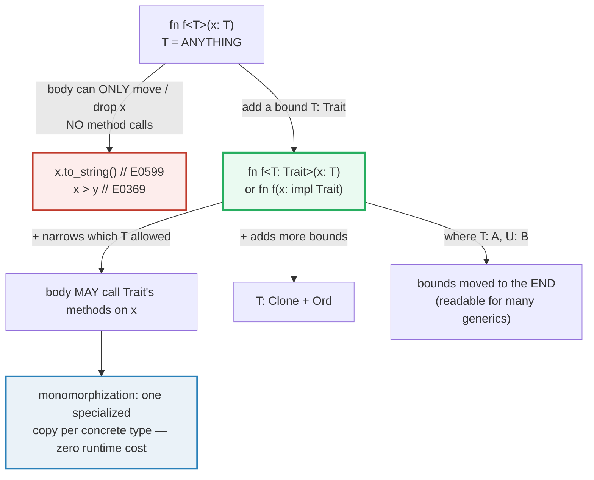
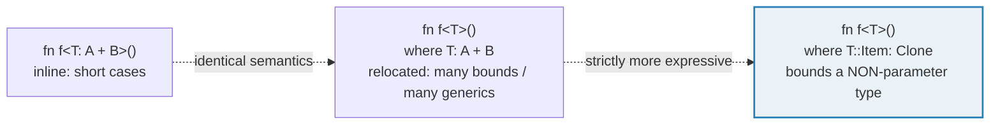
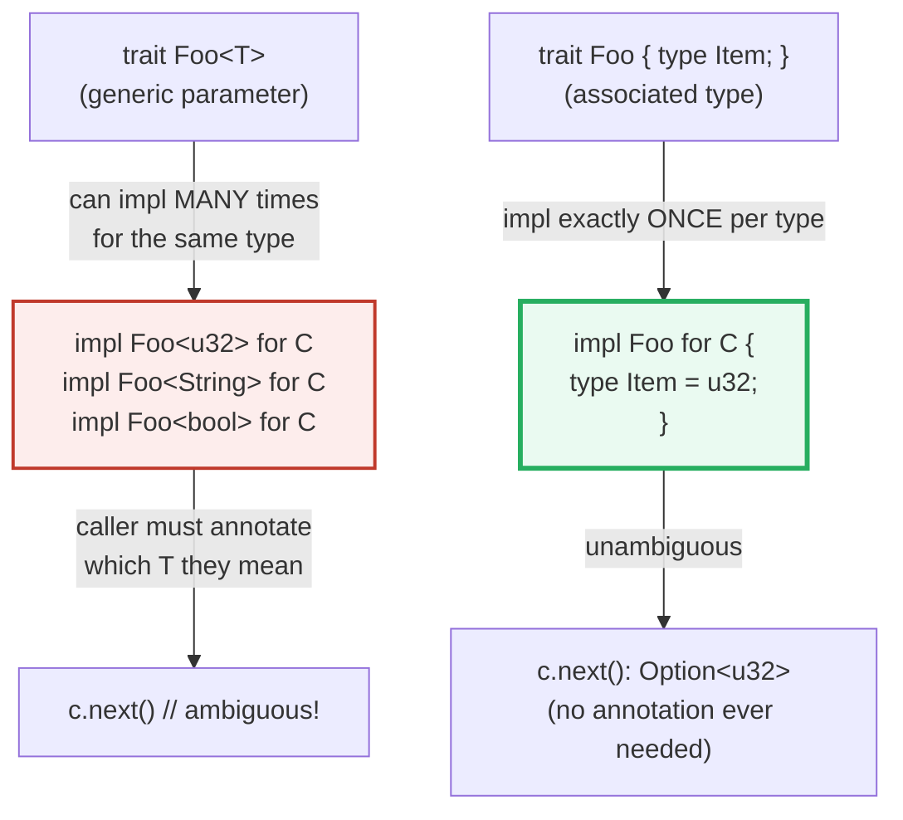

# TRAIT_BOUNDS — Constrain a Generic So Its Methods Are Usable

> **One-line goal:** a generic type `T` starts out as "anything"; a **trait
> bound** (`T: PartialOrd`, `T: Clone + Ord`, `impl Display`, a `where` clause)
> **narrows** `T` to types with specific behavior, which is the *only* way the
> function body may **call** that behavior on `T`. Associated types,
> supertraits, and blanket impls are all consequences of this mechanism.
>
> **Run:** `just run trait_bounds` (== `cargo run --bin trait_bounds`)
> **Member:** `core` (stdlib-only — no `[dependencies]`).
> **Prerequisites:** 🔗 [GENERICS](./GENERICS.md) (the `T` being bounded) and
> 🔗 [TRAITS_BASICS](./TRAITS_BASICS.md) (the traits you write in bounds).
> **Ground truth:** [`trait_bounds.rs`](./trait_bounds.rs); captured stdout:
> [`trait_bounds_output.txt`](./trait_bounds_output.txt).

---

## Why this exists (lineage)

🔗 [GENERICS](./GENERICS.md) showed that `fn f<T>(x: T)` lets one function work
on **any** type — but the price of "any" is that the body can do **almost
nothing** with `x`: you may move it, return it, or `drop` it, but you cannot
call **any** method, because the compiler has no idea what `T` is. A plain
`x.to_string()` or `x > y` inside `fn f<T>(x: T)` is a compile error.

A **trait bound** is the escape hatch. Writing `fn f<T: Display>(x: T)` (or the
equivalent sugar `fn f(x: impl Display)`) is a *promise to the compiler*: "T
will be some type that implements `Display`". In return, the compiler lets the
body call **every** `Display` method on `x`. The bound is what turns "I have a
value of unknown type" into "I have a value I can actually use."

| Era | Tool | What you could do with `T` |
|---|---|---|
| **Generics only** (`fn f<T>(x: T)`) | nothing bounded | move, return, drop. **No method calls.** |
| **+ one bound** (`T: Display`) | call `Display` methods | `format!("{x}")`, `x.to_string()`, ... |
| **+ multiple bounds** (`T: Clone + Ord`) | call methods of **both** | clone, compare, sort |
| **+ `where` clause** | same as above, readable | move complex bounds off the signature line |
| **+ associated types** (`type Item`) | pin ONE type per impl | `<T as Emitter>::Item` resolves uniquely |
| **+ supertrait** (`trait G: Named`) | require a trait to require another | Greet may call `self.name()` |
| **+ bound on `impl`** | blanket impl | `impl<T: Display> Quoted for T` covers *all* Display types |



---

## The four bound shapes (memorize these)

The Rust Book (ch10.2) defines them all as equivalent ways to constrain a
generic ([Book ch10.2][book-traits]):

```rust
// 1. inline bound on the generic parameter
fn f<T: Trait>(x: T) { /* ... */ }

// 2. `impl Trait` SUGAR in argument position — exactly equivalent to <T: Trait>
fn f(x: impl Trait) { /* ... */ }

// 3. multiple bounds with `+`  (T must impl BOTH)
fn f<T: A + B>(x: T) { /* ... */ }
fn f(x: impl A + B) { /* ... */ }            // sugar form

// 4. `where` clause — moves bounds to AFTER the signature (same semantics)
fn f<T, U>(t: T, u: U)
where T: A + B, U: C { /* ... */ }
```

> **Crucial subtlety:** `impl Trait` lets each argument be a **different**
> concrete type (`f(a: impl Trait, b: impl Trait)` — `a` and `b` may differ),
> while a single `<T: Trait>` forces two arguments to be the **same** type
> ([Book ch10.2][book-traits]). Pick the syntax that matches your intent.

---

## Section A — A basic bound lets the body compare

```rust
fn largest<T: PartialOrd>(slice: &[T]) -> &T {
    let mut biggest = &slice[0];
    for x in &slice[1..] {
        if x > biggest {            // <- `>` requires T: PartialOrd
            biggest = x;
        }
    }
    biggest
}
```

> **From trait_bounds.rs Section A:**
> ```
> ======================================================================
> SECTION A — basic bound: fn largest<T: PartialOrd>(slice) -> &T
> ======================================================================
>   fn largest<T: PartialOrd>(slice: &[T]) -> &T
>   let nums = [3, 1, 2];
>   largest(&nums) -> 3   (bound lets the body use `>`)
> [check] largest(&[3,1,2]) == 3  (T: PartialOrd enables the comparison): OK
>   largest(&["apple","zebra","mango"]) -> "zebra"
> [check] one generic fn, by-virtue-of PartialOrd, also finds the largest &str: OK
> ```

**What.** `largest` returns a reference to the biggest element of any slice.
The bound `T: PartialOrd` is what makes `x > biggest` legal: `>` for `&T`
desugars to `PartialOrd::partial_cmp`, which exists only for types implementing
`PartialOrd`. The same one generic works for `[i32; 3]` and `[&str; 3]`.

**Why (internals).**
- **Without the bound the body is helpless.** A bare `fn largest<T>(slice:
  &[T]) -> &T` cannot mention `>` at all — the compiler emits `E0369` ("binary
  operation `>` cannot be applied to type `&T`"). The bound is *not* a runtime
  check; it is a **compile-time promise** that opens up method resolution.
- **Monomorphization makes the bound zero-cost.** Each *call site* with a new
  concrete `T` produces a fresh specialized copy of `largest` (`largest::<i32>`,
  `largest::<&str>`, ...), each calling the right `partial_cmp` directly — no
  vtable, no indirection. This is the **static dispatch** path; the dynamic
  counterpart is `dyn Trait` (🔗 [TRAIT_OBJECTS](./TRAIT_OBJECTS.md)).
- **Why `PartialOrd` and not `Ord`?** `largest` only needs "is `x > biggest`?",
  i.e. a strict ordering — `PartialOrd::gt`. `Ord` (total order) would be a
  stronger bound than necessary and would wrongly exclude types like `f64`
  (which is only `PartialOrd` because of `NaN`). Asking for the *weakest* bound
  that suffices is the idiom.

> 🔗 [GENERICS](./GENERICS.md) — `T` is the generic the bound narrows. Without
> a generic there is nothing to bound.

---

## Section B — `impl Trait` is SUGAR for `<T: Trait>`

```rust
fn shout(x: impl fmt::Display) -> String {
    x.to_string()          // legal ONLY because `impl Display` is in the sig
}
```

> **From trait_bounds.rs Section B:**
> ```
> ======================================================================
> SECTION B — impl Trait SUGAR: fn shout(x: impl Display) -> String
> ======================================================================
>   fn shout(x: impl fmt::Display) -> String { x.to_string() }
>   shout(42u8)   -> "42"
>   shout("hi")   -> "hi"
>   (impl Display in arg position == <T: Display>; both calls monomorphize)
> [check] impl Display sugar: shout(42u8) == "42": OK
> [check] impl Display sugar: shout("hi") == "hi": OK
> ```

**What.** `shout` takes "anything that is `Display`" and stringifies it. The
body calls `x.to_string()` — which exists *because* the stdlib has a **blanket
implementation** `impl<T: Display> ToString for T` ([Book ch10.2][book-traits]).
That blanket is itself a bound-on-impl; see Section F below.

**Why (internals).**
- **`impl Trait` in argument position is exactly `<T: Trait> with the T
  elided.** The Book is explicit: "`impl Trait` ... is actually syntax sugar
  for a longer form known as a *trait bound*" ([Book ch10.2][book-traits]).
  `fn shout(x: impl Display)` and `fn shout<T: Display>(x: T)` generate
  identical code — both monomorphize per concrete type.
- **Why use the sugar?** Readability for one-parameter-one-bound cases. The
  long form wins once you need (a) two arguments of the **same** type, or (b)
  more than one or two bounds — then `<T: Bound>` or a `where` clause is
  clearer.
- **`impl Trait` in *return* position is different** (it is an *existential*,
  not a generic): `fn make() -> impl Display` means "I return ONE fixed
  concrete type that implements Display; the caller does not get to choose".
  Returning two different concrete types from one `-> impl Trait` is a compile
  error (🔗 [TRAITS_BASICS](./TRAITS_BASICS.md) Section D).

> 🔗 [TRAITS_BASICS](./TRAITS_BASICS.md) — covers `impl Trait` in argument and
> return position as static dispatch; this bundle focuses on the **bound** it
> desugars to.

---

## Section C — Multiple bounds (`+`) and `where` clauses

```rust
// (1) multiple bounds with `+`: T must impl BOTH Clone AND Ord.
fn max_of<T: Clone + Ord>(a: T, b: T) -> T {
    if a >= b { a } else { b }      // >= from Ord
}

// (2) a `where` clause moves the bounds to AFTER the signature.
fn join_display<T, U>(a: T, b: U) -> String
where T: fmt::Display, U: fmt::Display,
{
    format!("{a} & {b}")            // {} from Display on EACH generic
}
```

> **From trait_bounds.rs Section C:**
> ```
> ======================================================================
> SECTION C — multiple bounds (T: Clone + Ord) AND a where clause
> ======================================================================
>   fn max_of<T: Clone + Ord>(a: T, b: T) -> T   // +  =  BOTH bounds
>     max_of(3, 7)             -> 7
>     max_of("zebra","apple")  -> "zebra"
>   fn join_display<T, U>(a: T, b: U) -> String
>   where T: Display, U: Display                // bounds moved to end
>     join_display(1, "two")  -> "1 & two"
> [check] multiple bounds `Clone + Ord`: max_of(3,7) == 7: OK
> [check] multiple bounds work for any Ord type: max_of words == "zebra": OK
> [check] where clause applies Display to BOTH generics: join_display -> "1 & two": OK
> ```

**What.** `+` stacks bounds on one type; the body then sees the union of their
methods. `max_of` uses `>=` (from `Ord`) — `Clone` is there to demonstrate a
two-bound signature (and is what you would need if you later returned a
**copy** of the winner by value instead of a reference).

**Why (internals).**
- **`where` is pure relocation.** The Rust Reference: "`where` clauses provide
  another way to specify bounds on type and lifetime parameters as well as a
  way to specify bounds on types that **aren't type parameters**"
  ([Reference — Generic parameters][ref-generics]). So
  `fn f<T: A + B, U: C + D>(...)` and
  `fn f<T, U>(...) where T: A + B, U: C + D` are semantically identical; the
  `where` form just keeps the signature readable.
- **`where` is *strictly more powerful* than inline bounds** in one case:
  bounding a type that is **not** a generic parameter — e.g. bounding an
  *associated type* of `T`, like `where T::Item: Clone`. Inline `<T: ...>`
  syntax cannot express that. This is the real reason `where` exists, not just
  readability ([Reference — Trait and lifetime bounds][ref-bounds]).
- **`+` reads as "and".** `T: A + B + C` means T must implement all three; this
  is the same `+` used in `impl A + B` sugar and in `Box<dyn A + B>` (the
  multi-trait object, 🔗 [TRAIT_OBJECTS](./TRAIT_OBJECTS.md)).



---

## Section D — Associated types: ONE concrete type per impl

```rust
trait Emitter {
    type Item;                                      // placeholder
    fn next(&mut self) -> Option<Self::Item>;
}

impl Emitter for Counter {
    type Item = u32;                                // fixed to u32 ONCE
    fn next(&mut self) -> Option<Self::Item> { /* ... */ }
}
```

> **From trait_bounds.rs Section D:**
> ```
> ======================================================================
> SECTION D — associated types: type Item; one concrete type per impl
> ======================================================================
>   trait Emitter { type Item; fn next(&mut self) -> Option<Self::Item>; }
>   impl Emitter for Counter { type Item = u32; ... }
>     c.next() -> Some(0)
>     c.next() -> Some(1)
>     c.next() -> Some(2)
>     c.next() -> None
>   <Counter as Emitter>::Item resolves to u32 (size = 4 bytes)
> [check] associated-type Emitter: Counter.next() first  == Some(0): OK
> [check] associated-type Emitter: Counter.next() second == Some(1): OK
> [check] Counter stops at 3: third is Some(2), fourth is None: OK
> [check] <Counter as Emitter>::Item is fixed to u32 (4 bytes): OK
> ```

**What.** `Emitter` declares an associated **type** placeholder `Item`; the impl
for `Counter` pins it to exactly `u32`. The body of `next` returns
`Option<Self::Item>` — i.e. `Option<u32>` once the impl is chosen. `Counter`'s
`next` is therefore unambiguously `Option<u32>`; callers write
`<Counter as Emitter>::Item` to name that concrete type (the `.rs` binds
`first: <Counter as Emitter>::Item` to prove it resolves to `u32`, 4 bytes).

**Why (internals) — associated type vs generic trait.**
This is *the* distinction the Book stresses in ch20.2 ([Book ch20.2][book-adv]).
Suppose `Emitter` were generic instead:

```rust
// HYPOTHETICAL generic-trait form (NOT what the stdlib Iterator does):
trait Emitter<T> { fn next(&mut self) -> Option<T>; }
```

Then `Counter` could implement `Emitter` **multiple times** — once as
`Emitter<u32>`, again as `Emitter<String>`, again as `Emitter<bool>` — and every
call `c.next()` would need a **type annotation** to disambiguate *which* `next`
you meant. The Book: "when a trait has a generic parameter, it can be
implemented for a type multiple times, changing the concrete types of the
generic type parameters each time" ([Book ch20.2][book-adv]).

An **associated type** forbids that: there can be **only one** `impl Emitter
for Counter`, so `Item` is decided exactly once. The Book again: "with
associated types, we don't need to annotate types, because we can't implement a
trait on a type multiple times" ([Book ch20.2][book-adv]). That is why the
canonical trait, `std::iter::Iterator`, uses `type Item` and not a generic:

```rust
pub trait Iterator {
    type Item;
    fn next(&mut self) -> Option<Self::Item>;
}
```

> 🔗 [ITERATORS](./ITERATORS.md) (Phase 3) — `Iterator` is *the* associated-type
> trait; this bundle's `Emitter` mirrors it on purpose.



> **The compile error** for impl'ing a trait with an associated type twice for
> the same type is `E0119` ("conflicting implementations of trait"). It cannot
> live in the runnable `.rs` — this binary would not build. The exact message
> is in the pitfalls table below.

---

## Section E — Supertraits: `trait Greet: Named` requires `Named`

```rust
trait Named {
    fn name(&self) -> &str;
}

trait Greet: Named {                                // <- Named is a SUPERTRAIT
    fn greet(&self) -> String {
        format!("Hello, {}!", self.name())          // legal: Named is required
    }
}

impl Named for Person { /* ... */ }
impl Greet for Person {}                            // empty: default greet()
```

> **From trait_bounds.rs Section E:**
> ```
> ======================================================================
> SECTION E — supertrait: trait Greet: Named  (Greet REQUIRES Named)
> ======================================================================
>   trait Named { fn name(&self) -> &str; }
>   trait Greet: Named { fn greet(&self) -> String { ... } }
>   impl Named for Person  /  impl Greet for Person {}
>     p.name()  -> "Ada"
>     p.greet() -> "Hello, Ada!"
>   (Greet's default body calls self.name() — legal ONLY via the supertrait)
> [check] supertrait satisfied: Person impls BOTH Named and Greet: OK
> [check] Greet's default greet() composes the supertrait's name(): OK
> ```

**What.** `Greet: Named` is a **bound on `Self`**, written in the trait header:
any type implementing `Greet` **must** also implement `Named`. Because of that
promise, `Greet`'s default `greet` body may freely call `self.name()`. To make
`Person` greetable you impl *both*; forgetting `Named` is a compile error.

**Why (internals).**
- **A supertrait is just a `where Self: Super` bound.** The Book: "This
  technique is similar to adding a trait bound to the trait" ([Book
  ch20.2][book-adv]). `trait Greet: Named` is sugar for "this trait requires
  `Self: Named`". The compiler enforces it: impl'ing `Greet` for a type that
  doesn't impl `Named` is `E0277` ("`X` doesn't implement `Named`").
- **This is NOT class inheritance.** There is no field reuse, no vtable
  chaining, no "is-a" subtype. `Greet: Named` means only "to have Greet you
  must also have Named". A `&dyn Greet` does not automatically coerce to
  `&dyn Named` without the upcasting RFC (see pitfalls).
- **Stacking is allowed.** `trait C: A + B { ... }` requires both `A` and `B`
  — multiple supertraits use the same `+` syntax as bounds. Don't overdo it:
  deep supertrait chains make types hard to implement and harder to read.

> 🔗 [TRAITS_BASICS](./TRAITS_BASICS.md) — also demonstrates a supertrait
> (`Announce: Named`) with a default method that calls the supertrait; this
> bundle isolates the *bound* mechanism.

---

## Section F — A bound on `impl`: the BLANKET implementation

```rust
trait Quoted {
    fn quoted(&self) -> String;
}

impl<T: fmt::Display> Quoted for T {                // <- BLANKET impl
    fn quoted(&self) -> String {
        format!("\"{self}\"")
    }
}
// Now EVERY Display type (u8, String, f64, your types, ...) is Quoted.
```

> **From trait_bounds.rs Section F:**
> ```
> ======================================================================
> SECTION F — bound on impl: BLANKET  impl<T: Display> Quoted for T
> ======================================================================
>   trait Quoted { fn quoted(&self) -> String; }
>   impl<T: fmt::Display> Quoted for T { ... }   // every Display type
>     42u8.quoted()           -> "\"42\""
>     String::from("hi").quoted() -> "\"hi\""
>   (u8 and String are UNRELATED types; both get Quoted via Display)
> [check] blanket impl: a u8 (impl Display) gets Quoted: OK
> [check] blanket impl: a String (impl Display) ALSO gets Quoted: OK
> ```

**What.** Putting a bound on the `impl` block instead of the trait/method
implements the trait for **every** type satisfying the bound — a **blanket
implementation** ([Book ch10.2][book-traits]). `42u8.quoted()` and
`String::from("hi").quoted()` both work, even though `u8` and `String` are
unrelated, because *both* impl `Display`.

**Why (internals).**
- **This is how the stdlib wires up `to_string`.** The Book shows the exact
  pattern: `impl<T: Display> ToString for T { ... }` — and notes "because the
  standard library has this blanket implementation, we can call the
  `to_string` method ... on any type that implements the `Display` trait"
  ([Book ch10.2][book-traits]). Section B's `shout` relied on it; Section F
  builds the same shape from scratch.
- **The bound on the impl is also how you conditionally provide methods.** The
  Book's `Pair<T>` example: `impl<T: Display + PartialOrd> Pair<T> { fn
  cmp_display(&self) { ... } }` gives `Pair` the `cmp_display` method *only*
  when its `T` impls both traits ([Book ch10.2][book-traits]). For types whose
  `T` lacks those traits, the method simply does not exist.
- **Blanket impls must obey the orphan rule.** You may write `impl<T: Display>
  Quoted for T` here because `Quoted` is **local** to this crate. You may *not*
  write `impl<T: Display> fmt::Display for T` — both `Display` and the blanket
  target are foreign → the orphan rule (E0117) forbids it (🔗
  [TRAITS_BASICS](./TRAITS_BASICS.md) Section F).

---

## Pitfalls (the expert payoff)

| Trap | Symptom | Fix / why |
|---|---|---|
| **Calling a method the bound doesn't grant** | `E0599` / `E0369`: "method `f` not found for `T`" / "binary op `>` cannot be applied to `&T`" | Add the bound that provides the method (`T: Display`, `T: PartialOrd`). The bound is the *only* way method resolution works on a generic. |
| **`impl Trait` vs `<T: Trait>` for two args** | You wanted both args to be the SAME type but `impl Trait` lets them differ (or vice versa) | `f(a: impl Trait, b: impl Trait)` allows differing types; `f<T: Trait>(a: T, b: T)` forces them equal. Pick the form matching your intent ([Book ch10.2][book-traits]). |
| **Returning two types from `-> impl Trait`** | `E0308`: "`if` and `else` have incompatible types" | `-> impl Trait` returns ONE concrete type. For "this OR that", use `Box<dyn Trait>` (🔗 [TRAIT_OBJECTS](./TRAIT_OBJECTS.md)) or an enum. |
| **Impl'ing a trait-with-associated-type twice** | `E0119`: "conflicting implementations of trait" for the same type | An associated type gives ONE impl per type. To have many, the trait must be generic (`Foo<T>`) — but then callers annotate the type. |
| **Forgetting the supertrait** | `E0277`: "`X` doesn't implement `Named`" when you `impl Greet for X` | A supertrait (`trait Greet: Named`) is a bound on `Self`: you must impl the supertrait too. The compiler names the missing trait in the message. |
| **Over-bounding** | Your function rejects types it could perfectly handle (e.g. `T: Ord` excludes `f64`) | Ask for the *weakest* bound that works: `PartialOrd` for `>`, `Display` for printing, `Clone` only when you actually need a copy. Don't reflexively pile on `Clone + Default + Debug`. |
| **Bounds on the `struct` vs on the method** | `struct Foo<T: Clone> { ... }` — every use of `Foo` drags the bound along, and you often can't even construct it | Prefer bounds on `impl` blocks / methods, not on the `struct`. The struct should hold any `T`; only the methods that need `Clone` add `T: Clone`. (Struct bounds are rarely right; the stdlib puts them on methods.) |
| **`where` vs inline — same power?** | You tried `fn f<T>(x: T) where T::Item: Clone` and wondered why `<T: ...>` can't say it | `where` is **strictly more expressive**: it can bound *non-parameter* types (associated types, `&T`, etc.). Inline `<T: Bound>` can only bound the parameter itself ([Reference — bounds][ref-bounds]). |
| **Thinking supertrait = inheritance** | "Can I upcast `&dyn Greet` to `&dyn Named`?" | No — not without RFC 3324 (`dyn` upcasting, stabilized in Rust 1.86). A supertrait is a bound on `Self`, not subtype polymorphism. |
| **Blanket impl surprises** | Adding `impl<T: MyTrait> MyOtherTrait for T` suddenly makes a type impl a trait you didn't expect | Blanket impls are viral and can cause `E0119` conflicting-impl errors when a downstream crate also impls `MyOtherTrait` for a concrete type. Use them sparingly and document them. |
| **`dyn Trait` with a `Self`-returning method** | `E0038` when you try `Box<dyn Foo>` | A bound does not make a trait object-safe; `Self`-returning / generic methods break `dyn`. See 🔗 [TRAIT_OBJECTS](./TRAIT_OBJECTS.md) Section E. |

---

## Cheat sheet

```rust
// 1. inline bound — narrow T so the body may call Trait's methods
fn largest<T: PartialOrd>(slice: &[T]) -> &T { /* x > y is legal now */ }

// 2. `impl Trait` is SUGAR for <T: Trait> in ARGUMENT position (identical codegen)
fn shout(x: impl fmt::Display) -> String { x.to_string() }
//    fn shout<T: fmt::Display>(x: T) -> String { ... }   // <- same thing

// 3. multiple bounds with `+`;  `where` moves them to the end (identical)
fn max_of<T: Clone + Ord>(a: T, b: T) -> T { if a >= b { a } else { b } }
fn join<T, U>(a: T, b: U) -> String where T: fmt::Display, U: fmt::Display { format!("{a}{b}") }
//    NOTE: `where` can bound NON-parameter types (T::Item: Clone) — `<T:..>` cannot.

// 4. associated type: ONE concrete type per impl (no caller annotation ever)
trait Emitter { type Item; fn next(&mut self) -> Option<Self::Item>; }
impl Emitter for Counter { type Item = u32; fn next(&mut self) -> Option<u32> { /*..*/ } }
let v: <Counter as Emitter>::Item = counter.next().unwrap();   // resolves to u32

// 5. supertrait: a bound on Self in the trait header
trait Greet: Named { fn greet(&self) -> String { format!("Hi {}", self.name()) } }
//    -> impl'ing Greet REQUIRES impl'ing Named too (else E0277).

// 6. bound on `impl` = BLANKET impl (the stdlib `impl<T: Display> ToString for T`)
impl<T: fmt::Display> Quoted for T { fn quoted(&self) -> String { format!("\"{self}\"") } }
//    -> every Display type is now Quoted.

// RULE: without a bound, a generic body can ONLY move / return / drop x.
//       The bound is what unlocks method calls. Ask for the WEAKEST bound that works.
```

---

## Sources

Every claim above was web-verified in at least two authoritative places.

- **The Rust Programming Language, ch10.2 "Defining Shared Behavior with
  Traits"** — `impl Trait` as syntax sugar for `<T: Trait>`, the `+` syntax for
  multiple bounds, `where` clauses for readability, returning `impl Trait`
  (one type only), conditional/blanket impls
  (`impl<T: Display> ToString for T`):
  https://doc.rust-lang.org/book/ch10-02-traits.html
- **The Rust Programming Language, ch20.2 "Advanced Traits"** — associated
  types (`type Item`), the canonical `Iterator` trait definition, the contrast
  "associated type = one impl per type vs generic trait = many impls",
  supertraits (`trait OutlinePrint: fmt::Display`), the E0277 supertrait-missing
  error:
  https://doc.rust-lang.org/book/ch20-02-advanced-traits.html
- **The Rust Reference — Trait and lifetime bounds** — "Bounds can be provided
  on any type in a `where` clause. There are also shorter forms for certain
  common cases: Bounds written after declaring a generic parameter":
  https://doc.rust-lang.org/reference/trait-bounds.html
- **The Rust Reference — Generic parameters (where clauses)** — "`where`
  clauses provide another way to specify bounds on type and lifetime parameters
  as well as a way to specify bounds on types that **aren't type parameters**":
  https://doc.rust-lang.org/reference/items/generics.html
- **The Rust Reference — Associated items** — associated types are part of the
  trait contract; one impl per type; resolution via `<T as Trait>::Item`:
  https://doc.rust-lang.org/reference/items/associated-items.html
- **The Rust RFC Book — RFC 0135 (`where` clauses)** — original motivation:
  `where` provides "a more expressive means of specifying trait parameter
  bounds" (bounding associated types / non-parameter types that inline bounds
  cannot express):
  https://rust-lang.github.io/rfcs/0135-where.html
- **The Rust RFC Book — RFC 3324 (dyn upcasting)** — confirms that supertraits
  are NOT automatic subtyping for trait objects; `dyn` upcasting
  (`&dyn Sub` → `&dyn Super`) required a dedicated RFC stabilized in Rust 1.86:
  https://rust-lang.github.io/rfcs/3324-dyn-upcasting.html
