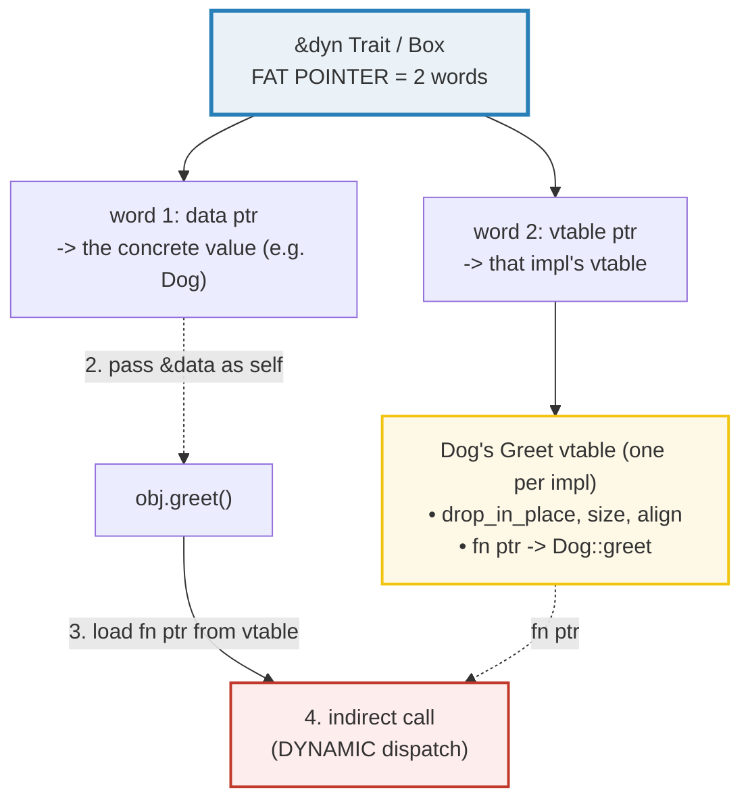
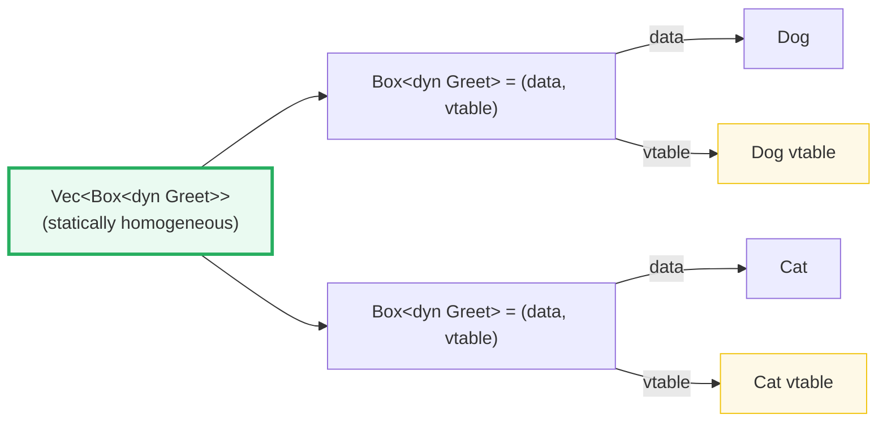
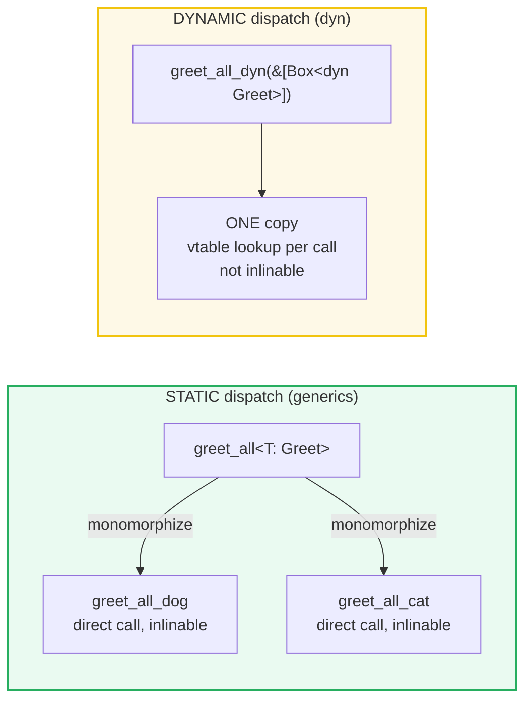

# TRAIT_OBJECTS — `dyn Trait`, the Fat Pointer, and Dynamic Dispatch

> **One-line goal:** `dyn Trait` is a **dynamically-sized trait object** you handle
> behind a pointer (`&dyn Trait`, `Box<dyn Trait>`, `Rc<dyn Trait>`); each pointer
> is a **fat pointer** = (data ptr + vtable ptr), and calling a method does a
> **runtime vtable lookup** (dynamic dispatch) — the dynamic counterpart to the
> **static, monomorphized** `impl Trait` of [TRAITS_BASICS](./TRAITS_BASICS.md).
>
> **Run:** `just run trait_objects` (== `cargo run --bin trait_objects`)
> **Member:** `core` (stdlib-only — no `[dependencies]`).
> **Prerequisites:** [TRAITS_BASICS](./TRAITS_BASICS.md) (static dispatch,
> `impl Trait`) and [OWNERSHIP](./OWNERSHIP.md) (moves / `Box` / drop on
> reassign). Read those first.
> **Ground truth:** [`trait_objects.rs`](./trait_objects.rs); captured stdout:
> [`trait_objects_output.txt`](./trait_objects_output.txt).

---

## Why this exists (lineage)

[TRAITS_BASICS](./TRAITS_BASICS.md) showed that a generic `fn f<T: Trait>(x: T)`
or `fn f(x: impl Trait)` resolves the trait's methods **at compile time** — the
compiler stamps out a separate copy of `f` for each concrete type used
(*monomorphization*). That is **static dispatch**: zero-cost, inlinable, but it
forces **one concrete type per call site / per collection**. A `Vec<T: Greet>`
holds *only* `Dog`s, or *only* `Cat`s — never both.

What if you genuinely need one collection to hold **different** types that share
a behavior — a GUI list of `Button`s and `TextField`s, a list of plugins, a
vector of boxed errors? That is exactly what **trait objects** buy you:

```rust
let zoo: Vec<Box<dyn Greet>> = vec![Box::new(Dog), Box::new(Cat)]; // two types, one Vec
```

The price is a small **runtime cost**: the call goes through a **vtable**
(virtual method table) instead of being a direct, inlinable call. This is the
classic **static-vs-dynamic-dispatch** tradeoff, and Rust lets you pick **per
call site** — you are not forced into one model for the whole program.

> **Naming.** This concept was long called *"object safety"*; the official term
> is now **"dyn compatibility"** ([Reference][ref-dyn-compat]). Both names are in
> wide use; the compiler today says *"not dyn compatible"*. This guide uses both.



---

## Section A — `Box<dyn Greet>`: one owned slot, any concrete type

```rust
let mut b: Box<dyn Greet> = Box::new(Dog);   // concrete type is ERASED
println!("{}", b.greet());                    // Dog's impl, via vtable
b = Box::new(Cat);                            // old Dog dropped; same type
println!("{}", b.greet());                    // Cat's impl now
```

> **From trait_objects.rs Section A:**
> ```
> ======================================================================
> SECTION A — Box<dyn Greet>: ONE owned slot, ANY concrete type (type erasure)
> ======================================================================
>   let b: Box<dyn Greet> = Box::new(Dog);
>     b.greet() = "Woof!"   <- Dog's impl, chosen at RUNTIME via vtable
> [check] Box<dyn Greet> dispatches to Dog::greet at runtime: OK
>   b = Box::new(Cat);    // old Dog dropped; SAME type `Box<dyn Greet>`
>     b.greet() = "Meow!"   <- Cat's impl now
> [check] after reassign, the trait object dispatches to Cat::greet: OK
> ```

**What.** A single binding `b: Box<dyn Greet>` first holds a `Dog`, then a `Cat`.
The `greet()` call dispatches to whichever concrete `impl` is behind the pointer,
chosen **at runtime**. The first check shows it starts as `Dog`; the second
check shows that after reassignment it is `Cat` — *the static type `Box<dyn
Greet>` never changed*, only the concrete payload did.

**Why (internals).**
- **Type erasure.** `Box<dyn Greet>` throws away the concrete type at compile
  time — the slot only remembers "something that can `greet()`", plus a vtable
  pointer that says *how*. The Book: a trait object "points to both an instance of
  a type implementing our specified trait and a table used to look up trait
  methods on that type at runtime" ([Book ch18.2][book-trait-objects]).
- **`Box<dyn Trait>` is an *owned, sized* handle to an *unsized* `dyn Trait`.**
  The `dyn Greet` type itself is a **dynamically-sized type (DST)** — its size
  is "opaque to code working with it, and different trait objects with the same
  trait object type may have different sizes" ([E0038][e0038]). That is why you
  can never have a bare `dyn Greet` value; it must live **behind a pointer**
  (`&`, `Box`, `Rc`, `Arc`) that carries the extra vtable word (Section C).
- **Reassignment drops the old value** — the *exact* rule from [OWNERSHIP](./OWNERSHIP.md)
  Section D. `b = Box::new(Cat)` runs the **old** value's drop glue first, then
  stores the new one. There is no double-free: `Box`'s heap free is a `Drop`
  impl, and drop runs exactly once. 🔗 See [BOX_RC_ARC](./BOX_RC_ARC.md) for
  `Box` in depth (heap allocation, `Drop`, `Deref`).

---

## Section B — `&dyn Trait`: a borrowed trait object (no move)

```rust
fn loud(g: &dyn Greet) -> String {            // borrows ANY greeter
    format!("{}!!", g.greet().to_uppercase())
}
loud(&Dog);   // works
loud(&Cat);   // works — same function, late binding at runtime
```

> **From trait_objects.rs Section B:**
> ```
> ======================================================================
> SECTION B — &dyn Greet: a borrowed trait object (no ownership moves)
> ======================================================================
>   loud(&Dog) = "WOOF!!!"
>   loud(&Cat) = "MEOW!!!"
> [check] &dyn Greet works for Dog: OK
> [check] &dyn Greet works for Cat: OK
> [check] borrowing a trait object does NOT move the owner's value: OK
> ```

**What.** One function `loud(&dyn Greet)` serves both `Dog` and `Cat`, and the
caller's values survive the call (`dog` is still usable afterwards).

**Why (internals).** A function parameter `&dyn Trait` is a **borrowed fat
pointer**. Passing `&dog` performs a **deref-coercion**: `&Dog` (a thin, 1-word
pointer) is widened into `&dyn Greet` (a fat, 2-word pointer = data + vtable) at
the call site, for free. No ownership moves; the caller retains its value, just
like an ordinary `&` borrow (🔗 [BORROWING](./BORROWING.md)). The same
late-binding machinery powers `Box<dyn Trait>` — only the ownership differs
(`&dyn` = shared borrow; `Box<dyn>` = owned heap). `&dyn` is the right choice
when you want to **use** the value polymorphically without taking it.

> **Signature idiom (mirrors OWNERSHIP's `&str`-over-`&String` rule).** Prefer
> `&dyn Trait` / `&mut dyn Trait` for short-lived borrows (no allocation,
> caller keeps the value) and `Box<dyn Trait>` only when you need to **store or
> return** an owned trait object (e.g. building a `Vec<Box<dyn Trait>>`, or
> returning `Box<dyn Error>` — see [ERROR_HANDLING](./ERROR_HANDLING.md)).

---

## Section C — The fat pointer: `(data ptr) + (vtable ptr)` = 2 words

> **From trait_objects.rs Section C:**
> ```
> ======================================================================
> SECTION C — the FAT pointer: (data ptr) + (vtable ptr) = 2 words
> ======================================================================
>   size_of::<&Dog>()       = 8 bytes = 1 word   (thin pointer: just the address)
>   size_of::<&dyn Greet>() = 16 bytes = 2 words  (fat pointer: data + vtable)
> [check] &Dog is a thin pointer: size == 1 * size_of::<usize>(): OK
> [check] &dyn Greet is a fat pointer: size == 2 * size_of::<usize>() (data + vtable): OK
>   size_of::<Box<dyn Greet>>() = 16 bytes = 2 words  (holds the fat pointer)
> [check] Box<dyn Greet> == 2 words too (it stores the fat pointer): OK
> ```

**What.** `&Dog` is **8 bytes** (1 word); `&dyn Greet` is **16 bytes** (2 words);
`Box<dyn Greet>` is **also 16 bytes**. The two checks confirm the thin-vs-fat
ratio against `size_of::<usize>()` (we print *sizes*, never addresses — addresses
vary per run under ASLR, see the DETERMINISM rule in
[`HOW_TO_RESEARCH.md`](../HOW_TO_RESEARCH.md) §4.2).

**Why (internals).** The Rust Reference fixes the representation exactly
([Reference — Trait objects][ref-trait-object]):

> "Each instance of a pointer to a trait object includes:
> - a pointer to an instance of a type `T` that implements `SomeTrait`
> - a *virtual method table*, often just called a *vtable*, which contains, for
>   each method of `SomeTrait` and its supertraits that `T` implements, a pointer
>   to `T`'s implementation (i.e. a function pointer)."

So a trait-object pointer is a **fat pointer** of **two words**:
1. **data pointer** — to the concrete value (`Dog`/`Cat`/...);
2. **vtable pointer** — to that impl's vtable. The vtable itself is a static,
   read-only structure (one **per `impl Trait for T`**) holding function
   pointers to `T`'s methods, plus `drop_in_place`, size and alignment.

`Box<dyn Trait>` is **not** three words — a `Box` "just owns the fat pointer
verbatim" (plus the heap allocation it points at). It does not add a third word.

> **EXPERT PITFALL — the field *order* is unspecified.** The Reference guarantees
> the two-word *size* but **not** which word is the data pointer and which is the
> vtable pointer. **Never** transmute `&dyn Trait` to `(usize, usize)` and assume
> `tuple.0` is the data or the vtable — that relies on unspecified layout and is a
> soundness landmine. If you need the concrete type back, use `std::any::Any`
> (`Box<dyn Any>`) for safe downcasting, or design the trait with an explicit
> accessor. (See the pitfalls table.)

---

## Section D — Heterogeneous `Vec<Box<dyn Greet>>`: two types in one collection

This is the headline use case — the thing **static generics cannot do**.

```rust
let zoo: Vec<Box<dyn Greet>> = vec![Box::new(Dog), Box::new(Cat)];  // Dog AND Cat
for a in &zoo { println!("{}", a.greet()); }
```

> **From trait_objects.rs Section D:**
> ```
> ======================================================================
> SECTION D — heterogeneous Vec<Box<dyn Greet>>: TWO types in ONE collection
> ======================================================================
>   let zoo: Vec<Box<dyn Greet>> = vec![Box::new(Dog), Box::new(Cat)];
>     zoo[0].greet() = "Woof!"   (concrete type erased)
>     zoo[1].greet() = "Meow!"   (concrete type erased)
> [check] heterogeneous Vec holds exactly 2 elements: OK
> [check] zoo[0] greets as Dog (Woof!): OK
> [check] zoo[1] greets as Cat (Meow!): OK
> [check] every element is greetable regardless of its (erased) concrete type: OK
> ```

**What.** One `Vec` holds a `Dog` and a `Cat`. Iterating and calling `greet()`
hits the right `impl` for each element, even though the elements are **different
concrete types**.

**Why (internals).** A generic `Vec<T>` (or `fn f<T: Greet>(&[T])`) admits **one**
`T`. Trying to mix `Dog` and `Cat` there is a compile error:

```console
error[E0308]: mismatched types
  |     greet_all(&[Dog, Cat]);
  |                      ^^^ expected `Dog`, found `Cat`
```

`Box<dyn Greet>` solves this by **erasing** the concrete type: every element has
the *same* static type `Box<dyn Greet>` (a 2-word fat pointer), and the
per-element concrete type lives only in the vtable each fat pointer carries. So
the `Vec` is homogeneous *statically* (all `Box<dyn Greet>`) while being
*heterogeneous dynamically* (Dog's vtable vs Cat's vtable). This is the Book's
central distinction: "A generic type parameter can be substituted with only one
concrete type at a time, whereas trait objects allow for multiple concrete types
to fill in for the trait object at runtime" ([Book ch18.2][book-trait-objects]).



---

## Section E — Object safety (dyn compatibility): what *cannot* be `dyn`

Not every trait can be turned into a trait object. A trait is **dyn-compatible**
(formerly *object-safe*) only if a vtable can be built for it. The rules
([Reference — Dyn compatibility][ref-dyn-compat], [E0038][e0038]):

- **All supertraits** must be dyn-compatible.
- **`Sized` must not be a supertrait** (no `Self: Sized`).
- **No associated constants.**
- **No generic associated types.**
- **Every method** must be dispatchable: no generic type params (lifetimes OK),
  `Self` only in the receiver, a receiver of `&self` / `&mut self` / `Box<Self>`
  / `Rc<Self>` / `Arc<Self>` / `Pin<P>`, no opaque return (`async fn`,
  `-> impl Trait`), no `where Self: Sized`.

Two traits in the `.rs` deliberately **violate** these rules. Defining them
**compiles fine** — they're used via static dispatch on concrete types. What
fails is trying to make them into `dyn`:

```rust
trait Transformer {
    fn apply<T: std::fmt::Display>(&self, x: T) -> String;   // GENERIC param -> not dyn-compatible
}
trait Duplicator {
    fn duplicate(&self) -> Self;                             // returns Self -> not dyn-compatible
}
```

> **From trait_objects.rs Section E:**
> ```
> ======================================================================
> SECTION E — object safety (dyn compatibility): what CANNOT be `dyn`
> ======================================================================
>   Transformer: seed.apply::<u8>(7) = "applied to 7 with seed 42"
> [check] a trait with a generic method still works via STATIC dispatch: OK
>   Duplicator: Mark(5).duplicate() = Mark(5)
> [check] returning Self works statically, just not as a trait object: OK
> ```

**Why.** Both checks pass because the **call sites are fully concrete** —
`seed.apply::<u8>(7)` monomorphizes `apply::<u8>`, and `Mark(5).duplicate()`
knows the return is `Mark`. The trouble is the **vtable**, which would have to
be enumerated *before* knowing which types a caller will feed in:

- A generic method `fn apply<T>(&self, x: T)` would need **one vtable entry per
  concrete `T` ever used** — unbounded, so impossible to build. As [E0038][e0038]
  puts it: "we don't just need to create a table of all implementations of all
  methods … we need to create such a table, for each different type fed to
  `foo()`."
- `fn duplicate(&self) -> Self` returns a value of the concrete type — but at a
  `dyn` call site "the compiler cannot predict the return type" ([E0038][e0038]),
  so it can't size or store the result.

**The compile error (`E0038`) — cannot live in the runnable `.rs` (it would not
build).** Attempting `Box<dyn Transformer>` / `Box<dyn Duplicator>`:

```console
error[E0038]: the trait `Transformer` is not dyn compatible
  --> e0038_test.rs:18:20
   |
18 |     let a: Box<dyn Transformer> = Box::new(42u64);
   |                    ^^^^^^^^^^^ `Transformer` is not dyn compatible
   |
note: for a trait to be dyn compatible it needs to allow building a vtable
      for more information, visit <https://doc.rust-lang.org/reference/items/traits.html#dyn-compatibility>
  --> e0038_test.rs:3:8
   |
 2 | trait Transformer {
   |       ----------- this trait is not dyn compatible...
 3 |     fn apply<T: std::fmt::Display>(&self, x: T) -> String;
   |        ^^^^^ ...because method `apply` has generic type parameters
   = help: consider moving `apply` to another trait

error[E0038]: the trait `Duplicator` is not dyn compatible
  --> e0038_test.rs:19:20
   |
19 |     let b: Box<dyn Duplicator> = Box::new(Mark(5));
   |                    ^^^^^^^^^^ `Duplicator` is not dyn compatible
   |
note: for a trait to be dyn compatible it needs to allow building a vtable
  --> e0038_test.rs:7:28
   |
 6 | trait Duplicator {
   |       ---------- this trait is not dyn compatible...
 7 |     fn duplicate(&self) -> Self;
   |                            ^^^^ ...because method `duplicate` references the `Self` type in its return type
   = help: consider moving `duplicate` to another trait
   = help: only type `Mark` implements `Duplicator`; consider using it directly instead.

error: aborting due to 2 previous errors

For more information about this error, try `rustc --explain E0038`.
```

> **The escape hatch — `where Self: Sized`.** If only *some* methods break
> object safety, bound them with `where Self: Sized`; they become **explicitly
> non-dispatchable** (callable on concrete types, absent from the vtable) and the
> trait becomes dyn-compatible again ([Reference][ref-dyn-compat], [E0038][e0038]).
> `Clone` does this: `fn clone(&self) -> Self where Self: Sized`, which is why
> `Clone` itself isn't object-safe even though you can call `.clone()` on a
> concrete type behind a `Box<dyn Trait>` *if* `Box<dyn Trait>: Clone` is
> separately implemented.

---

## Section F — Static (generics) vs dynamic (`dyn`): same result, different codegen

```rust
// STATIC — monomorphized into greet_all::<Dog>, greet_all::<Cat>, ...
fn greet_all<T: Greet>(items: &[T]) -> Vec<String> { items.iter().map(|x| x.greet()).collect() }
// DYNAMIC — one copy; each .greet() is an indirect vtable call
fn greet_all_dyn(items: &[Box<dyn Greet>]) -> Vec<String> { items.iter().map(|x| x.greet()).collect() }
```

> **From trait_objects.rs Section F:**
> ```
> ======================================================================
> SECTION F — static (generics) vs dynamic (dyn): same result, different codegen
> ======================================================================
>   static   greet_all(&[Dog, Dog])   = ["Woof!", "Woof!"]
>   dynamic  greet_all_dyn(&zoo)      = ["Woof!", "Meow!"]
> [check] static dispatch gives identical results for the homogeneous Dog case: OK
> [check] dynamic dispatch handles the HETEROGENEOUS case (Dog+Cat) that static generics cannot: OK
> ```

**What.** Both functions produce identical `greet()` strings for the same inputs.
The first check confirms static and dynamic agree on the homogeneous case; the
second confirms only dynamic can carry the **mixed** `Dog`+`Cat` slice.

**Why (internals).** The **observable behavior** is the same; the **generated
machine code** is not:

| | **Static** (`impl Trait` / generics) | **Dynamic** (`dyn Trait`) |
|---|---|---|
| **Codegen** | One monomorphized copy **per concrete type** (`greet_all::<Dog>`, `greet_all::<Cat>`, …) | **One** copy, shared by all types |
| **Call** | **Direct** call (the address is known) | **Indirect**: load fn ptr from vtable, then call |
| **Inlining** | ✅ the compiler can inline the body | ❌ the call is opaque to the optimizer |
| **Collection** | Homogeneous (`Vec<T>`, one `T`) | **Heterogeneous** (`Vec<Box<dyn Trait>>`) |
| **Binary size** | Grows with the number of types (code bloat) | Constant |
| **Runtime cost** | Zero (monomorphization is zero-cost) | One vtable lookup per call (small) |

The Book: static dispatch is "when the compiler knows what method you're calling
at compile time"; dynamic dispatch is "when the compiler can't tell at compile
time which method you're calling … at runtime, Rust uses the pointers inside the
trait object to know which method to call. This lookup incurs a runtime cost that
doesn't occur with static dispatch. Dynamic dispatch also prevents the compiler
from choosing to inline a method's code, which in turn prevents some
optimizations" ([Book ch18.2][book-trait-objects]).



> **Which to choose?** Default to **static** (generics / `impl Trait`) — it is
> zero-cost and the borrow-checker-friendly choice ([TRAITS_BASICS](./TRAITS_BASICS.md),
> [GENERICS](./GENERICS.md)). Reach for **`dyn`** only when you need its specific
> power: a **heterogeneous collection**, an **open-ended set of types** (plugins,
> GUI components), **type erasure** for ABI/storage, or a **boxed error**
> (`Box<dyn Error>`, 🔗 [ERROR_HANDLING](./ERROR_HANDLING.md)). For shared
> ownership of a trait object use `Rc<dyn Trait>` / `Arc<dyn Trait>` (🔗
> [BOX_RC_ARC](./BOX_RC_ARC.md)); combining `dyn` with `RefCell`/`Mutex` is
> common (🔗 [INTERIOR_MUTABILITY](./INTERIOR_MUTABILITY.md)).

---

## Pitfalls (the expert payoff)

| Trap | Symptom | Fix / why |
|---|---|---|
| **Transmuting `&dyn Trait` to `(usize, usize)`** | UB / relies on data-vs-vtable word **order**, which the Reference does **not** guarantee | Never assume field order. Use `std::any::Any` (`Box<dyn Any>` + `downcast`) to recover the concrete type, or expose an explicit accessor. The **size** (2 words) is guaranteed; the **order** is not. |
| **`Box<dyn Clone>` / `Box<dyn Sized>` fails (E0038)** | `error[E0038]: the trait \`Clone\` is not dyn compatible` | `Clone` returns `Self`; `Sized` as a supertrait forbids `dyn`. Bound the offending methods with `where Self: Sized`, or redesign. |
| **Trait with a generic method can't be `dyn` (E0038)** | `...because method \`apply\` has generic type parameters` | A vtable entry per concrete `T` is unbounded. Add `where Self: Sized` to the method, or replace the type param with a `Box<dyn OtherTrait>`. |
| **`async fn` / `-> impl Trait` in a trait method breaks object safety** | `...because this method's return type ... is opaque` | `async fn`/RPIT hide an unnameable type. Use `Pin<Box<dyn Future>>` as the return (the legacy `async_trait` crate does this), or keep the method off the object-safe trait. |
| **`dyn Trait + Trait2`** (two non-auto traits) | `only auto traits can be used as composite traits` | A trait object allows **one** non-auto base trait plus **auto traits** (`Send`, `Sync`, `Unpin`, …). Combine behaviors via a single trait that groups them (supertraits), or via composition. |
| **Forgetting the `dyn` (pre-2021) or a lifetime bound** | lifetime errors, or `dyn Trait` not living long enough | On edition 2021+ `dyn` is required. If the trait can contain references, add a lifetime: `Box<dyn Trait + 'a>` (the elision default is `'static` for owned trait objects — see the Reference's *default trait object lifetimes*). |
| **Expecting `dyn` to be zero-cost** | a hot loop with indirect calls, missed inlining | Each call is a vtable lookup. Hoist the polymorphic call out of the inner loop, or switch that hot path to static dispatch (generics). |
| **Downcasting with `as`** | "non-primitive cast" error | `dyn Trait` cannot be `as`-cast to a concrete type. Use `Any::downcast_ref`/`downcast` on a `dyn Any`, or `std::any::type_name_of_val` only for *names*. |
| **Trait object of a non-`Send` type shared across threads** | `Rc<dyn Trait>` is `!Send` | Use `Arc<dyn Trait + Send + Sync>` for thread-shared trait objects (🔗 [BOX_RC_ARC](./BOX_RC_ARC.md), 🔗 [THREADS](./THREADS.md)). Auto traits like `Send` are the legal way to extend a trait object. |
| **Code bloat from over-monomorphizing vs over-dyn'ing** | binary too big (too many generics) *or* too slow (too much `dyn`) | Measure. Generics specialize per type (fast, larger); `dyn` shares code (smaller, slightly slower). The right mix is a deliberate engineering call, not a rule. |

---

## Cheat sheet

```rust
// A trait object = DYNAMIC dispatch via a vtable. Handle it behind a pointer.
let b:   Box<dyn Greet> = Box::new(Dog);   // OWNED trait object (heap)
let r:   &dyn Greet      = &dog;            // BORROWED trait object (&Dog coerces)
let zoo: Vec<Box<dyn Greet>> = vec![Box::new(Dog), Box::new(Cat)]; // heterogeneous!

// Representation (2 words = FAT pointer):
//   size_of::<&Dog>()        == 1 * size_of::<usize>()   // thin
//   size_of::<&dyn Greet>()  == 2 * size_of::<usize>()   // fat: (data, vtable)
//   size_of::<Box<dyn Greet>>() == 2 words too.   Field ORDER is UNSPECIFIED.

// Dynamic dispatch = indirect call through the vtable (small runtime cost,
// NOT inlinable). Static dispatch (generics / impl Trait) = monomorphized,
// direct call, inlinable, but HOMOGENEOUS (one type per call site/Vec).

// OBJECT SAFETY (now "dyn compatibility") — a trait is `dyn`-able only if:
//   * all supertraits are dyn-compatible;
//   * NOT `Self: Sized`;
//   * no associated consts; no generic associated types;
//   * every method: no generic type params (lifetimes OK), Self only in the
//     receiver (&self/&mut self/Box<Self>/Rc<Self>/Arc<Self>/Pin<P>),
//     no opaque return (no async fn, no -> impl Trait).
// Violating it -> error E0038 "the trait `T` is not dyn compatible".
// Escape hatch: `where Self: Sized` marks a method non-dispatchable (off the vtable).
```

---

## Sources

Every claim above was web-verified in at least two authoritative places.

- **The Rust Programming Language, ch18.2 "Using Trait Objects to Abstract over
  Shared Behavior"** — the `Draw`/`Screen` example, `Box<dyn Draw>` for
  heterogeneous collections, generics-vs-trait-objects contrast, and the
  verbatim definition of *static vs dynamic dispatch* ("a runtime cost that
  doesn't occur with static dispatch … prevents the compiler from choosing to
  inline a method's code"):
  https://doc.rust-lang.org/book/ch18-02-trait-objects.html
- **The Rust Reference — "Trait object types"** — the fat-pointer definition
  ("a pointer to an instance of a type T … and a virtual method table … which
  contains, for each method … a pointer to T's implementation"), "virtual
  dispatch at runtime: a function pointer is loaded from the trait object vtable
  and invoked indirectly", and the `dyn` keyword / auto-trait / lifetime rules:
  https://doc.rust-lang.org/reference/types/trait-object.html
- **The Rust Reference — "Dyn compatibility" (formerly object safety)** — the
  complete dyn-compatibility rules (supertraits, `Self: Sized`, associated
  consts/types, dispatchable-method receiver types, no `async fn`/`-> impl
  Trait`), with the `TraitMethods` / `NonDispatchable` / `DynIncompatible`
  examples:
  https://doc.rust-lang.org/reference/items/traits.html#dyn-compatibility
- **Error code E0038** — "the trait `T` is not dyn compatible"; the exact
  sub-causes (`Self: Sized`; method references `Self` in params/return; method
  has generic type parameters; method has no receiver; associated constants;
  `Self` as a supertrait type parameter); the `where Self: Sized` escape hatch;
  and the vtable-monopolization explanation for why generic methods are
  forbidden:
  https://doc.rust-lang.org/error_codes/E0038.html
- **The Rust Book ch10.1 "Performance of Code Using Generics"** (referenced by
  ch18.2) — monomorphization: the compiler "generates nongeneric implementations
  of functions and methods for each concrete type", i.e. static dispatch:
  https://doc.rust-lang.org/book/ch10-01-syntax.html#performance-of-code-using-generics
- **The Rust Reference — Dynamically Sized Types** — why trait objects are DSTs
  and must be used behind a pointer (`&dyn`, `Box<dyn>`, …), the `Sized?` story
  underpinning the `Self: Sized` object-safety rule:
  https://doc.rust-lang.org/reference/dynamically-sized-types.html
- **Laurielle Tratt — "A Quick Look at Trait Objects in Rust"** — independent
  corroboration that a trait-object reference "is a fat pointer … at least two
  machine words big":
  https://tratt.net/laurie/blog/2019/a_quick_look_at_trait_objects_in_rust.html
- **Geo — "Rust dyn trait objects & fat pointers"** — confirms the two-word
  (data + vtable) layout and that "there is one global vtable instance" per
  trait implementation:
  https://geo-ant.github.io/blog/2023/rust-dyn-trait-objects-fat-pointers/
