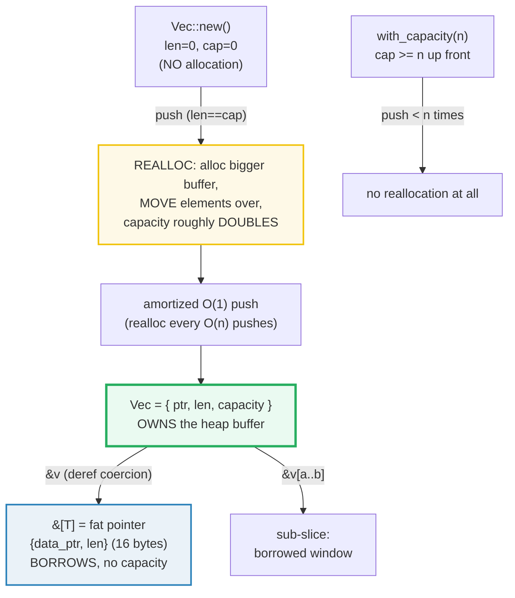

# VEC_COLLECTIONS — `Vec<T>` (owning, growable) and `&[T]` (borrowed view)

> **One-line goal:** a `Vec<T>` **owns** a growable heap buffer described by the
> triple `{ptr, len, capacity}`; `push` grows it with **amortized-O(1) doubling
> reallocs**; a **slice** `&[T]` is merely a **borrowed fat-pointer view** of
> contiguous `T`s that a `&Vec` **deref-coerces** into for free.
>
> **Run:** `just run vec_collections` (== `cargo run --bin vec_collections`)
> **Member:** `core` (stdlib-only — no `[dependencies]`).
> **Prerequisites:** [OWNERSHIP](./OWNERSHIP.md) (a value has exactly one owner;
> `Vec` *is* that owner for its heap buffer) and [BORROWING](./BORROWING.md)
> (a slice `&[T]` is a *borrowed reference* to someone else's `T`s).
> **Ground truth:** [`vec_collections.rs`](./vec_collections.rs); captured stdout:
> [`vec_collections_output.txt`](./vec_collections_output.txt).

---

## Why this exists (lineage)

🔗 [OWNERSHIP](./OWNERSHIP.md) shows that a `String` is a 3-word handle
`{ptr, len, cap}` that **owns** a heap buffer. A `Vec<T>` is the **general**
version of that idea: the same owning `{ptr, len, capacity}` triple, but for
**any** element type `T`, and **growable** — it can acquire more heap room at
runtime. It is Rust's "growable array" and the workhorse sequential collection.

The companion idea is the **slice** `[T]` (used as `&[T]` / `&mut [T]`): a
**borrowed view** of a contiguous run of `T`s with *no ownership* and *no*
capacity — just a pointer and a length. The crucial fact is that **`Vec<T>`
derefs to `[T]`**: any code you write against `&[T]` works on `&Vec<T>` for
free (deref coercion), which is *why* idiomatic Rust takes `&[T]` not `&Vec<T>`
as a parameter type. So this bundle is really two concepts in one: the **owning,
growable** container and the **borrowing, fixed** view it coerces into.



The std documentation draws the heap layout exactly (a `Vec` of `['a','b']` with
capacity 4) — the top box is the on-stack `{ptr,len,cap}` handle, the bottom is
the contiguous heap allocation with `capacity - len` logically-uninitialized
slots ready to be filled ([std::vec::Vec — Guarantees][std-vec]):

```
            ptr      len  capacity
       +--------+--------+--------+
       | 0x0123 |      2 |      4 |        <- the Vec (24 bytes, on the stack)
       +--------+--------+--------+
            |
            v
Heap   +--------+--------+--------+--------+
       |    'a' |    'b' | uninit | uninit |   <- contiguous owned buffer
       +--------+--------+--------+--------+
```

---

## Section A — Create: `Vec::new` (no alloc) vs `with_capacity` (pre-alloc)

```rust
let empty: Vec<i32> = Vec::new();      // len=0, capacity=0 — NO heap allocation
let pre   = Vec::with_capacity(3);     // len=0, capacity>=3 — room for 3, no realloc
```

> **From vec_collections.rs Section A:**
> ```
> ======================================================================
> SECTION A — create: Vec::new (no alloc) vs with_capacity (pre-alloc)
> ======================================================================
>   let empty: Vec<i32> = Vec::new();
>     empty.len = 0, empty.capacity = 0  (no allocation yet)
> [check] Vec::new() allocates nothing until the first push: len == 0 AND capacity == 0: OK
>   let pre = Vec::with_capacity(3);
>     pre.len = 0, pre.capacity = 3  (capacity >= requested)
> [check] with_capacity(3): length is 0 but capacity >= 3: OK
>   push 1, 2, 3 into with_capacity(3): len = 3, capacity = 3
> [check] 3 pushes fit within the pre-allocated capacity: capacity UNCHANGED (no realloc): OK
> ```

**What.** `Vec::new()` reports `capacity == 0` because it has **not allocated
anything** — there is no heap buffer yet (the pointer is valid-but-non-dereferable
and null-pointer-optimized). `Vec::with_capacity(3)` *has* allocated room for at
least 3 elements but still reports `len == 0`; pushing 3 elements into it
**does not reallocate** (the third check proves `capacity` is unchanged across
the three pushes).

**Why (internals).**
- A `Vec` is, and per the std docs "always will be," a **`(pointer, capacity,
  length)` triplet** — 24 bytes on a 64-bit target (the same 3-word handle
  `String` uses; see [OWNERSHIP](./OWNERSHIP.md) Section E). "Most fundamentally,
  `Vec` is and always will be a (pointer, capacity, length) triplet. No more, no
  less." ([std::vec::Vec — Guarantees][std-vec]).
- `Vec::new()` deliberately **defers** allocation: "The vector will not allocate
  until elements are pushed onto it" ([`Vec::new` docs][std-vec]). A capacity-0
  `Vec` built by `new`, `vec![]`, or `with_capacity(0)` does not allocate at all.
- `with_capacity(n)` requests *exactly* `n` elements' worth from the allocator
  (no power-of-two rounding on the request itself); the allocator may return
  more, so `capacity()` is **guaranteed `>= n`** ([`with_capacity` docs][std-vec]).
- **Why pre-allocate?** If you will push a known number of items, one
  `with_capacity(n)` call replaces `log2(n)` reallocations. The Book: "it's more
  efficient to use `Vec::with_capacity`" when you know the size in advance
  ([Book ch8.1][book-vec]).
- **`Vec` never auto-shrinks**, even when emptied — `clear()` leaves `capacity`
  untouched, so emptying and refilling to the same length calls the allocator
  *zero* times ([std::vec::Vec — Guarantees][std-vec]). Use `shrink_to_fit` to
  release the excess.

---

## Section B — `push`: amortized-O(1) growth via capacity doubling

```rust
let mut v: Vec<i32> = Vec::new();
for i in 1..=5 { v.push(i); }   // capacities observed: [4, 4, 4, 4, 8]
```

> **From vec_collections.rs Section B:**
> ```
> ======================================================================
> SECTION B — push: amortized O(1) via capacity doubling on realloc
> ======================================================================
>   let mut v: Vec<i32> = Vec::new();  (len = 0, capacity = 0)
>   push 1..=5, recording capacity after each push:
>     capacities = [4, 4, 4, 4, 8]
>     final: v.len = 5, v.capacity = 8
> [check] capacity is always >= length (the load-bearing invariant): OK
> [check] push grew the vec: after 5 pushes capacity >= 5: OK
> [check] pushing never panicked: v == [1, 2, 3, 4, 5]: OK
> ```

**What.** Pushing into an empty `Vec` allocates a buffer of capacity **4** (for
this element type); pushes 2–4 stay at capacity 4; the **5th** push (when
`len == capacity`) triggers a **reallocation** that grows capacity to **8**. The
whole sequence `[4, 4, 4, 4, 8]` is reproduced verbatim from the run.

**Why (internals).**
- `push`/`insert` **never reallocate if capacity is sufficient, and *will*
  reallocate exactly when `len == capacity`** — "the reported capacity is
  completely accurate, and can be relied on" ([std::vec::Vec — Guarantees][std-vec]).
- The **growth strategy is not API-guaranteed**: "Vec does not guarantee any
  particular growth strategy when reallocating when full... Whatever strategy is
  used will of course guarantee *O*(1) amortized `push`" ([std::vec::Vec —
  Guarantees][std-vec]). The **doubling** you see here (`4 → 8 → 16 → ...`) is
  the *current* implementation, and is what makes `push` amortized O(1): each
  realloc is O(n) but happens only once per O(n) pushes, so the average cost per
  push is constant. **Do not hard-code the `[4,4,4,4,8]` numbers** — assert only
  the invariant `capacity >= len` (as the checks do).
- A reallocation **moves** every element to the new buffer (hence the `move`
  semantics: `T` need not be `Copy`, because the move is the compiler doing its
  normal move per element, which is sound for any `T`). This is *why* holding a
  `&v[i]` across a `push` is a soundness hazard — see Section G.

---

## Section C — Indexing: `v[i]` PANICS out-of-bounds; `v.get(i)` returns `Option`

```rust
let v = vec![10, 20, 30];
v[1]           // -> 20            (Index trait, in-bounds)
v.get(1)       // -> Some(&20)     (safe, returns Option<&T>)
v.get(5)       // -> None          (out-of-bounds -> no panic)
v[5]           // PANICS: "index out of bounds: the len is 3 but the index is 5"
```

> **From vec_collections.rs Section C:**
> ```
> ======================================================================
> SECTION C — indexing: v[i] PANICS out-of-bounds; v.get(i) returns Option
> ======================================================================
>   let v = vec![10, 20, 30];  (len = 3)
>     v[1] = 20
> [check] in-bounds indexing returns the element: v[1] == 20: OK
> [check] v.get(1) yields Some(20): OK
> [check] v.get(5) yields None on an out-of-bounds index: OK
>     v[5] -> CAUGHT panic: "index out of bounds: the len is 3 but the index is 5"
> [check] out-of-bounds panic prints the canonical slice message: OK
> ```

**What.** Indexing `v[i]` uses the `Index` trait: in-bounds it returns the
element, **out-of-bounds it panics**. `v.get(i)` is the safe alternative — it
returns `Option<&T>`, so an out-of-range index yields `None` instead of a crash.
The `.rs` deliberately **triggers** `v[5]` inside `std::panic::catch_unwind`,
**captures the panic payload**, and asserts it equals the exact canonical
message — so the panic behavior is now a *reproducible, verbatim* fact rather
than a "trust me."

**Why (internals).**
- **Bounds checks are mandatory and run in BOTH debug and release builds.** This
  is not an assertion stripped by optimizations — it is the `Index` impl's
  contract. The std docs: "if you try to access an index which isn't in the
  `Vec`, your software will panic!... Use `get` and `get_mut` if you want to
  check whether the index is in the `Vec`" ([std::vec::Vec — Indexing][std-vec]).
- The panic message format — `index out of bounds: the len is {len} but the
  index is {index}` — comes from the `slice` indexing code path; it is identical
  for `Vec`, arrays, and slices because **`Vec::index` derefs to the slice
  impl**. This is corroborated by many independent reproductions (e.g. a 3-element
  vec giving "the len is 3 but the index is 7" ([users.rust-lang.org][ul-oob]),
  and "the len is 5 but the index is 10" ([Stack Overflow][so-oob])).
- The caught payload is a **`String`** (the panic is built with `panic!` +
  formatting), so `catch_unwind`'s `Box<dyn Any>` is downcast to `String` to
  read it. The `.rs` silences the default panic hook (`take_hook`/`set_hook`)
  around the deliberate panic so `cargo run` shows no scary traceback — the run
  exits **0**.
- 🔗 [CONTROL_FLOW](./CONTROL_FLOW.md) covers `panic!`/`catch_unwind`/`Result`
  vs panic in depth.

---

## Section D — Slices `&[T]`: a borrowed view; `&Vec` derefs to `&[T]` for free

```rust
fn sum_slice(s: &[i32]) -> i32 { s.iter().sum() }

let v = vec![10, 20, 30];
sum_slice(&v);        // &Vec<i32>  -> deref-coerced to &[i32] at the call
let s: &[i32] = &v;   // explicit slice-typed binding (same coercion)
let mid = &v[1..3];   // sub-slice: [20, 30]   (half-open range [a, b))
```

> **From vec_collections.rs Section D:**
> ```
> ======================================================================
> SECTION D — slices &[T]: a borrowed view; &Vec derefs to &[T] for free
> ======================================================================
>   let v = vec![10, 20, 30];
>   sum_slice(&v) -> 60   (passed &Vec, coerced to &[i32])
> [check] a &Vec argument deref-coerces to &[T] and sums to 60: OK
>   let s: &[i32] = &v;   // same coercion at the binding
> [check] &[i32] = &v binds a slice reference spanning the whole vec: OK
>   let mid = &v[1..3];   // mid = [20, 30]
> [check] sub-slice &v[1..3] == [20, 30]: OK
>   size_of::<&[i32]>() = 16 bytes (fat pointer: data_ptr + len)
>   size_of::<&i32>()  = 8 bytes (thin pointer: data_ptr only)
> [check] slice reference &[T] is a fat pointer: 16 bytes = ptr(8) + len(8): OK
> [check] plain reference &T is a thin pointer: 8 bytes: OK
> ```

**What.** A function taking `&[i32]` accepts `&v` (a `&Vec<i32>`) with no
conversion — the compiler inserts the coercion. A sub-slice `&v[1..3]` borrows
the window `[20, 30]`. And the headline size facts: a **slice reference
`&[i32]` is 16 bytes** while a plain **`&i32` is 8 bytes**.

**Why (internals).**
- **A slice is a fat pointer.** `&[T]` carries two words — a data pointer **and
  a length** — because `[T]` is a *dynamically-sized type* (DST): its size is not
  known at compile time, so the reference must carry the length alongside the
  pointer. "Rust has two built-in fat pointer types: slices and trait objects.
  These are types that act as pointers but hold additional information about the
  thing they are pointing to" ([Effective Rust, Item 8][eff-rust]). The run
  proves it: `size_of::<&[i32]>() == 16` (ptr 8 + len 8) vs
  `size_of::<&i32>() == 8` (ptr only).
- **Deref coercion** is the mechanism that turns `&Vec<T>` into `&[T]`:
  `Vec<T>` implements `Deref<Target = [T]>` (and `DerefMut`), so wherever a
  `&[T]` is expected, a `&Vec<T>` is accepted and the compiler inserts the
  deref for free. The std docs demonstrate exactly this: "you can also do it
  like this: `let u: &[usize] = &v;`" ([std::vec::Vec — Slicing][std-vec]).
  This is *why* the signature idiom is `&[T]` not `&Vec<T>`: clippy's `ptr_arg`
  lint (`-D warnings`) flags `&Vec<T>` parameters precisely because `&[T]` is
  more general (it also accepts `&[T; N]` arrays and raw slices) and costs
  nothing. 🔗 [BORROWING](./BORROWING.md) — a slice *is* a shared reference.
- **Sub-slicing** `&v[a..b]` reuses the same fat-pointer machinery; the range is
  half-open (`[a, b)`), matching the Book's slice examples ([Book ch4.3][book-slice]).
- A slice **has no capacity** — it borrows someone else's buffer, so it cannot
  `push`. That is the entire owning-vs-borrowing distinction in one sentence.

---

## Section E — Mutation methods: push / pop / insert / remove / extend / retain / clear

```rust
v.push(x);          // append,              amortized O(1)
v.pop();            // remove+return last,  O(1), -> Option<T>
v.insert(i, x);     // insert at i,         O(n) (shifts tail right)
v.remove(i);        // remove at i,         O(n) (shifts tail left)
v.extend(iter);     // append a sequence
v.retain(f);        // drop elements where f is false
v.clear();          // drop all, len=0, capacity UNCHANGED
```

> **From vec_collections.rs Section E:**
> ```
> ======================================================================
> SECTION E — mutation methods: push/pop/insert/remove/extend/retain/clear
> ======================================================================
>   push 20, 30; insert(0, 10) -> [10, 20, 30]
> [check] insert(0, 10) prepends (O(n) shift): v == [10, 20, 30]: OK
>   extend([40, 50]) -> [10, 20, 30, 40, 50]
> [check] extend appends a sequence: v == [10, 20, 30, 40, 50]: OK
>   v.pop() -> Some(50); v now [10, 20, 30, 40]
> [check] pop removes and returns the LAST element: Some(50): OK
>   v.remove(0) -> 10; v now [20, 30, 40]
> [check] remove(0) takes index 0 and shifts left (O(n)): removed = 10, v == [20, 30, 40]: OK
>   v.retain(|x| x >= 30) -> [30, 40]
> [check] retain keeps only matching elements: v == [30, 40]: OK
>   v.clear() -> len = 0, v = []
> [check] clear empties the vec (length 0): v == []: OK
> ```

**What.** Each method's effect is pinned by a check: `insert`/`remove` are
**O(n)** (they shift the tail to make/fill a gap), while `push`/`pop` touch only
the end and are **amortized O(1)**. `pop` returns `Option<T>` (it cannot panic on
an empty vec — it returns `None`). `retain` filters in place; `extend` appends an
iterator; `clear` empties but **keeps capacity**.

**Why (internals).**
- The **O(n) cost of `insert`/`remove`** is the contiguous-buffer trade-off: to
  keep elements contiguous, inserting/removing in the middle means physically
  shifting every later element by one slot (a `memmove`). This is the price of
  cache-friendly contiguous storage — the same trade-off as C++ `std::vector`.
- `swap_remove(i)` is the O(1) alternative when you do **not** care about order:
  it moves the last element into slot `i` and shortens — no shift. Prefer it in
  hot paths where order is irrelevant.
- `retain`/`extend`/`clear` all drop removed elements through normal `Drop`
  glue. 🔗 [OWNERSHIP](./OWNERSHIP.md) — `Vec` owns its elements, so removing one
  runs its `Drop` exactly once.

---

## Section F — Iteration: by reference (`&v` / `.iter`) vs by value (`into_iter`)

```rust
for x in &v { /* x: &i32 — BORROWS, v lives on */ }
for x in v.iter() { /* same: &i32 */ }
for x in v { /* x: i32 — CONSUMES v (into_iter), v is dead after */ }
```

> **From vec_collections.rs Section F:**
> ```
> ======================================================================
> SECTION F — iteration: by reference (&v / .iter) vs by value (into_iter)
> ======================================================================
>   for x in &v { sum } -> 60; v still owned: [10, 20, 30]
> [check] for x in &v borrows (yields &i32): sum == 60 AND v stays usable: OK
>   v.iter().map(|x| x * 2).collect() -> [20, 40, 60]
> [check] .iter() borrows and yields &i32: doubled == [20, 40, 60]: OK
>   v.into_iter().sum() -> 60  (v consumed; unusable hereafter)
> [check] into_iter consumes the Vec by value: sum == 60: OK
> ```

**What.** Three flavors, each a different ownership consequence:
`for x in &v` (and `v.iter()`) **borrow** — they yield `&i32` and leave `v`
owned and usable; `v.into_iter()` (spelled `for x in v`) **consumes** the `Vec`,
moving each element out, after which `v` is unusable.

**Why (internals).**
- These are the three `IntoIterator` impls: `impl IntoIterator for &Vec<T>`
  (yields `&T`), `impl IntoIterator for &mut Vec<T>` (yields `&mut T`, via
  `.iter_mut()`), and `impl IntoIterator for Vec<T>` (yields `T` by value, via
  `.into_iter()`). Which one runs depends on whether the loop head is `&v`,
  `&mut v`, or `v` — a single syntax that selects the ownership mode.
- This is the doorway to the iterator ecosystem (`map`/`filter`/`collect`), which
  is zero-cost via monomorphization. 🔗 **ITERATORS** (Phase 3) covers that in
  depth.

---

## Section G — The alias trap: `&v[i]` held across `v.push()` is `E0502`

```rust
let mut v = vec![10, 20, 30];
let first = &v[0];     // immutable borrow of `v` starts here
v.push(40);            // ERROR E0502: mutable borrow while immutable is live
println!("{first}");   // immutable borrow used here
```

This **does not compile**, so it cannot live in the runnable `.rs` — the bundle
documents it and instead demonstrates the **fix** (copy the `Copy` element out
first, ending the borrow before the `push`).

> **From vec_collections.rs Section G:**
> ```
> ======================================================================
> SECTION G — the alias trap: &v[i] held across v.push() is E0502 (compile error)
> ======================================================================
>   copy-out fix: first = 10, after push v = [10, 20, 30, 40]
> [check] copying the Copy element out before push lets push run: v.len == 4: OK
> ```

**Why (internals).**
- `push` **may reallocate** (moving the whole buffer to a new address) when
  `len == capacity` (Section B). If the borrow checker allowed an outstanding
  `&v[0]` to survive across a `push` that reallocates, `first` would become a
  **dangling pointer** — a classic use-after-free. The borrow checker therefore
  forbids a mutable borrow (`push` takes `&mut self`) while any immutable borrow
  of the same `v` is live. This is the **aliasing-XOR-mutability** rule from
  🔗 [BORROWING](./BORROWING.md) protecting you at compile time.
- The exact diagnostic (reproduced with `rustc --edition 2024`):

```console
error[E0502]: cannot borrow `v` as mutable because it is also borrowed as immutable
 --> alias.rs:4:5
  |
3 |     let first = &v[0];
  |                  - immutable borrow occurs here
4 |     v.push(40);
  |     ^^^^^^^^^^ mutable borrow occurs here
5 |     println!("{first}");
  |                ----- immutable borrow later used here
```

- **Fixes:** (a) if `T` is `Copy`, read the value out first (`let first = v[0];`
  — the borrow ends at the read, as the `.rs` shows); (b) otherwise end the
  borrow before the mutation (`drop` or scope the reference); (c) or restructure
  so you do not need the element and the mutation simultaneously. The error code
  reference is `rustc --explain E0502` ([error index][err-e0502]).

---

## Pitfalls (the expert payoff)

| Trap | Symptom | Fix / why |
|---|---|---|
| **Holding `&v[i]` across `v.push()`** | `error[E0502]: cannot borrow \`v\` as mutable because it is also borrowed as immutable` | `push` may reallocate and dangle the reference. Copy the `Copy` element out first, or scope/end the borrow before the mutation. |
| **`v[i]` out-of-bounds** | runtime `panic` "index out of bounds: the len is N but the index is M" | Bounds are checked in **debug and release**. Use `v.get(i)` (returns `Option`) when the index may be invalid. |
| **Hard-coding the growth sequence** | Code breaks when the allocator/growth strategy changes | `Vec` does **not** guarantee a growth factor — only amortized O(1). Assert `capacity >= len`, never a specific capacity after N pushes. |
| **`fn f(v: &Vec<T>)`** | clippy `ptr_arg` fails under `-D warnings` | Take `&[T]`; `&Vec<T>` deref-coerces to `&[T]` for free and `&[T]` also accepts arrays/slices. |
| **Expecting `Vec` to shrink** | "I `clear()`'d it but memory isn't freed" | `Vec` **never auto-shrinks**. Call `shrink_to_fit()` to actually release capacity. |
| **`insert`/`remove` in a hot loop** | accidental O(n²) | They shift the tail (O(n)). Use `swap_remove` (O(1)) when order doesn't matter, or build a new `Vec`. |
| **Confusing `len` and `capacity`** | over-allocating or under-allocating | `len` = elements present; `capacity` = slots allocated. Pre-size with `with_capacity` when the count is known. |
| **`for x in v` "moves" the vec** | "why is `v` dead after the loop?" | `for x in v` = `v.into_iter()`, which **consumes** `v`. Use `for x in &v` to borrow instead. |
| **Thinking a slice can grow** | "I have a `&mut [T]`, why no `push`?" | A slice has **no capacity** — it only borrows. Only `Vec`/`VecDeque` (owners) can grow. |
| **ZST surprises** | `Vec::<()>::with_capacity(10).capacity() == usize::MAX` | Zero-sized types need no allocation, so capacity is reported as `usize::MAX` ([std::vec::Vec][std-vec]). |

---

## Cheat sheet

```rust
// Vec<T> OWNS a heap buffer; the handle is {ptr, len, capacity} = 24 bytes.
// &[T]  BORROWS a view;     it is a fat pointer {data_ptr, len} = 16 bytes.

let mut v: Vec<i32> = Vec::new();      // len=0, cap=0, NO allocation yet
let big = Vec::with_capacity(1000);    // len=0, cap>=1000, one alloc up front

v.push(1);                             // amortized O(1); reallocs (doubling) when len==cap
v.pop();                               // -> Option<T>, O(1), never panics
v.insert(0, x);                        // O(n) — shifts tail right
v.remove(0);                           // O(n) — shifts tail left
v.swap_remove(0);                      // O(1) — order not preserved
v.extend([2, 3]);                      // append a sequence
v.retain(|&x| x > 0);                  // filter in place
v.clear();                             // len=0, capacity UNCHANGED
v.shrink_to_fit();                     // actually release spare capacity

v[i]      // -> T        PANICS if i >= len   (checked in debug AND release)
v.get(i)  // -> Option<&T>   safe — None if out of bounds
&v[a..b]  // -> &[T]     half-open sub-slice [a, b)

fn sum(s: &[i32]) -> i32 { s.iter().sum() }   // idiomatic: take &[T], not &Vec<T>
sum(&v);                                       // &Vec -> &[T] via deref coercion

for x in &v         { /* &T   — borrows, v lives on */ }
for x in v.iter()   { /* &T   — explicit borrow      */ }
for x in v.into_iter() { /* T — CONSUMES v            */ }

// INVARIANTS: capacity >= len always; push reallocs only when len == cap;
// growth factor is NOT guaranteed (only amortized O(1)).
// Vec never auto-shrinks; it never does a "small"/stack optimization.
```

---

## Sources

Every claim above was web-verified in at least two authoritative places; the
panic message and the `E0502` diagnostic were additionally reproduced locally
with `rustc --edition 2024`.

- **The Rust Programming Language, ch8.1 "Vectors"** — `Vec::new`, storing
  values, updating, reading (`get`/`Index` panic), iterating, `with_capacity`:
  https://doc.rust-lang.org/book/ch08-01-vectors.html
- **The Rust Programming Language, ch4.3 "Slices"** — `&[T]` as a borrowed view,
  half-open ranges, why slices avoid dangling-pointer bugs:
  https://doc.rust-lang.org/book/ch04-03-slices.html
- **`std::vec::Vec`** — the `(pointer, capacity, length)` triplet guarantee, the
  heap-layout diagram, Capacity & Reallocation, Indexing (panic on OOB),
  Slicing (deref to `&[T]`, `let u: &[usize] = &v`), `Vec::new`/`with_capacity`,
  "never auto-shrinks", ZST capacity `usize::MAX`:
  https://doc.rust-lang.org/std/vec/struct.Vec.html
- **`std::slice` / primitive type `[T]`** — slices as DSTs, `get`/`get_mut`,
  sub-slicing, `Index` bounds checks:
  https://doc.rust-lang.org/std/primitive.slice.html
- **Effective Rust, Item 8 "Familiarize yourself with reference and pointer
  types"** — slices (and trait objects) are the two built-in **fat pointers**
  carrying metadata (the slice length) beyond the data pointer:
  https://effective-rust.com/references.html
- **Rust error index — `E0502`** — "cannot borrow `v` as mutable because it is
  also borrowed as immutable" (the alias-trap compile error):
  https://doc.rust-lang.org/error_codes/E0502.html
- **Out-of-bounds panic message (independent reproductions)** — the canonical
  message `index out of bounds: the len is N but the index is M`, confirming the
  exact payload format across toolchains: "the len is 3 but the index is 7"
  (https://users.rust-lang.org/t/why-compiler-do-not-check-index-out-of-bounds-for-vec/76840)
  and "the len is 5 but the index is 10"
  (https://stackoverflow.com/questions/24898579/why-does-the-rust-compiler-allow-index-out-of-bounds).
