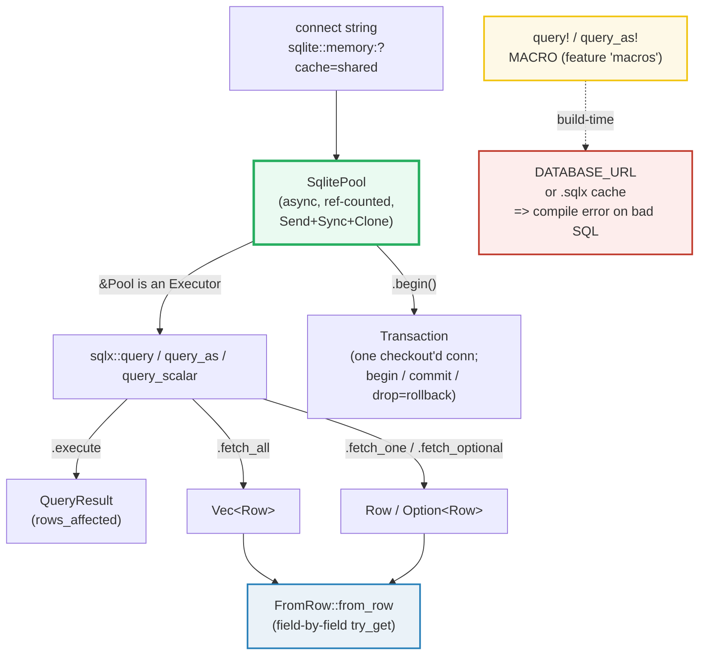

# SQLX_BASICS — Async SQL with a Pool, `query_as`/`FromRow`, and Transactions

> **One-line goal:** sqlx is Rust's **async** SQL toolkit — you **write SQL as
> SQL**, send it through a connection **`Pool`**, map result rows into structs with
> **`query_as` + `FromRow`**, group writes in **transactions**, and (optionally)
> get your queries **checked at compile time** by the `query!` macro.
>
> **Run:** `just run sqlx_basics` (== `cargo run --bin sqlx_basics`)
> **Member:** `db` (deps: `sqlx` `runtime-tokio`+`sqlite`, `tokio`, `serde`,
> `serde_json`).
> **Prerequisites:** 🔗 [TOKIO_RUNTIME](../async/TOKIO_RUNTIME.md) (every sqlx
> call is `async`), 🔗 [STRUCTS_ENUMS](../core/STRUCTS_ENUMS.md) (deriving
> `FromRow` is just derive on a struct), 🔗 [ERROR_HANDLING](../core/ERROR_HANDLING.md)
> (`?` over `sqlx::Error`).
> **Ground truth:** [`sqlx_basics.rs`](./sqlx_basics.rs); captured stdout:
> [`sqlx_basics_output.txt`](./sqlx_basics_output.txt).
>
> **No live database required.** The whole bundle runs against a fresh
> **in-memory SQLite** DB created per `cargo run`. See Section A for the one
> connect-string detail that matters.

---

## Why this exists (lineage)

Rust's ecosystem gives you three increasing layers of database abstraction:

| Layer | What you write | Who checks the SQL | Rust analogue |
|---|---|---|---|
| **Driver / raw SQL** | `"SELECT ..."` strings | nobody (runtime) | this bundle: `sqlx::query` / `query_as` |
| **Compile-time checked SQL** | `"SELECT ..."` *string literal* | **the compiler**, against a live DB or an offline cache | `sqlx::query!` / `query_as!` macros |
| **ORM** | structs/relations, no SQL | the ORM generates SQL | SeaORM, Diesel |

sqlx's bet is the middle: **you still write real SQL** (no DSL to learn, full
engine power, easy to paste into a DB shell), but an *optional* macro can
**verify every query against your schema at build time** — a typo'd column name
becomes a *compile error*, not a 3 AM production crash. This bundle covers the
**runtime-checked** `query`/`query_as` API end to end (so the file compiles with
**no DB at build time**), and **documents** the compile-time `query!` workflow in
Section F.



🔗 This is the Rust sibling of the Go **[DATABASE_SQL](../../go/DATABASE_SQL.md)**
guide — same mental model (`*sql.DB` pool ~ `Pool`; `db.QueryRow` ~ `fetch_one`;
`?` args ~ `$1`/`?` binds), here in async Rust with `FromRow` mapping and the
compile-time option Go lacks. The deep-dive library walkthroughs in
[`../sqlx/`](../sqlx/README.md) (per-DB examples, `query_file!`, listen/notify,
SQLite extensions) are the companion material; this bundle is the **concept**
anchor.

---

## Section A — A `Pool` over a *shared* in-memory database

```rust
let pool = SqlitePoolOptions::new()
    .max_connections(5)
    .connect("sqlite::memory:?cache=shared")
    .await?;
sqlx::query("CREATE TABLE widgets (id INTEGER PRIMARY KEY, name TEXT NOT NULL)")
    .execute(&pool)
    .await?;
```

> **From sqlx_basics.rs Section A:**
> ```
> ======================================================================
> SECTION A — POOL + shared in-memory DB + CREATE TABLE
> ======================================================================
>   SqlitePoolOptions::new().max_connections(5)
>     .connect("sqlite::memory:?cache=shared").await  -> POOL
>   pool.size() = 1,  num_idle() = 0
>   query("CREATE TABLE widgets (id INTEGER PRIMARY KEY, name TEXT NOT NULL)")
>     .execute(&pool).await  -> DDL applied (ok)
> [check] shared in-memory pool connects and applies DDL: OK
> ```

**What.** `SqlitePoolOptions::new().connect(url)` returns a `Pool<Sqlite>` — a
cheap, `Clone`-able, `Send`+`Sync` handle to a pool of async connections ([Pool
docs][pool-docs]). You then run **any** SQL — including DDL like `CREATE TABLE` —
through `sqlx::query(sql).execute(&pool)`. The `&pool` is accepted directly
because `&Pool<DB>` implements `Executor`: the pool checks out a connection for
you and returns it when the future completes ([Pool docs — "pass `&Pool` directly
anywhere an `Executor` is required"][pool-docs]).

**Why `?cache=shared` (the load-bearing detail).** SQLite has two in-memory modes:

- **Bare `:memory:`** — *each connection gets its own private, empty database*
  ([SQLite docs — "a separate in-memory database is created for each
  connection"][sqlite-inmem]). With a `Pool` that opens several connections, or
  **recycles** an idle one past its timeout, a later query can land on a
  connection whose database has *no tables* — the classic silent failure
  documented in [sqlx issue #2510][sqlx-2510] ("new connections returned by the
  connection pool are to new different empty databases").
- **`?cache=shared`** — SQLite **shared-cache** mode: *all* connections that use
  the same in-memory name talk to **one** database ([SQLite docs — "shared by all
  connections that specify the same database name"][sqlite-inmem]). The pool may
  open and recycle connections freely; they all see the same schema and rows.

This bundle's `make_pool()` therefore uses `"sqlite::memory:?cache=shared"`. (For
a *file* database you would instead pass `"sqlite:app.db"` and add
`.create_if_missing(true)` via `SqliteConnectOptions`; in-memory needs neither.)

> **`pool.size() = 1`?** Connections are created **lazily** — `size()` grows as
> the pool opens more, up to `max_connections(5)`. After Section A only one
> connection exists; later sections may open more. `Pool` is reference-counted,
> so cloning it is cheap and the pool lives until the last handle drops — but the
> docs recommend an explicit `pool.close().await` for graceful shutdown, which
> `main` does ([Pool docs — "Note: Drop Behavior"][pool-docs]).

---

## Section B — Parameterized `INSERT` (bind, never concatenate)

```rust
for name in ["alpha", "bravo", "charlie"] {
    sqlx::query("INSERT INTO widgets (name) VALUES (?)")
        .bind(name)            // <- the value goes in as a PARAMETER, not text
        .execute(&pool)
        .await?;
}
```

> **From sqlx_basics.rs Section B:**
> ```
> ======================================================================
> SECTION B — parameterized INSERT (bind values, never concatenate SQL)
> ======================================================================
>   3 x query("INSERT INTO widgets (name) VALUES (?)").bind(name)
>     .execute(&pool).await   (the `?` is a prepared-statement bind)
>   total rows_affected = 3
> [check] 3 parameterized inserts affected exactly 3 rows: OK
>   SELECT COUNT(*) FROM widgets  -> 3
> [check] table holds exactly 3 rows after the inserts: OK
> ```

**What.** `sqlx::query(sql)` builds a **prepared statement**; `.bind(value)`
fills its `?` placeholders in order; `.execute(&pool).await` runs it and returns a
`QueryResult` whose `.rows_affected()` is `1` per insert. The check confirms the
total is `3`, and a `SELECT COUNT(*)` agrees.

**Why (internals).**
- **SQL-injection safety.** The value never touches the SQL string — it is sent
  to SQLite *separately* as a typed bind parameter. `format!("... VALUES ('{name}')")`
  would be a textbook injection hole; `.bind(name)` cannot be. This is the same
  contract as Go's `db.Query("... VALUES (?)", name)`.
- **Placeholder syntax is backend-specific.** SQLite and MySQL use `?` (positional);
  Postgres uses `$1, $2, ...` (numbered). The `query!` macro normalizes this; the
  runtime `query` does not, so you write the placeholder your DB expects
  ([query! docs — "Bind parameters ... are specific to the database backend"][query-doc]).
- **Prepared statements are cached per connection.** Re-running the same SQL on a
  reused connection skips re-parsing/re-planning — one of the three reasons sqlx
  pushes a `Pool` over one-off connections ([Pool docs — "Resource Reuse"][pool-doc]).

> **`rows_affected` vs `last_insert_rowid`.** For an `INTEGER PRIMARY KEY` column
> SQLite auto-assigns the id; `.execute` returns the count, not the id. Use
> `query_scalar("SELECT last_insert_rowid()")` if you need it. Here the ids come
> out `1, 2, 3` (proven in Section C).

---

## Section C — `query_as` + `FromRow`: rows become structs

```rust
#[derive(Debug, FromRow)]
struct Widget { id: i64, name: String }

let widgets: Vec<Widget> =
    sqlx::query_as("SELECT id, name FROM widgets ORDER BY id")
        .fetch_all(&pool)
        .await?;
```

> **From sqlx_basics.rs Section C:**
> ```
> ======================================================================
> SECTION C — query_as + FromRow: map rows into Vec<Widget>
> ======================================================================
>   query_as::<_, Widget>("SELECT id, name FROM widgets ORDER BY id")
>     .fetch_all(&pool).await  -> Vec<Widget> (3 rows):
>     { id: 1, name: "alpha" }
>     { id: 2, name: "bravo" }
>     { id: 3, name: "charlie" }
> [check] query_as mapped all 3 rows: OK
> [check] ORDER BY id yields the deterministic sequence 1,2,3: OK
> [check] FromRow mapped names in id order: alpha, bravo, charlie: OK
> ```

**What.** `sqlx::query_as::<_, T>(sql).fetch_all(&pool)` returns `Vec<T>` instead
of raw rows. The mapping is driven by the **`FromRow`** trait: "a record that can
be built from a row returned by the database. In order to use `query_as` the
output type must implement `FromRow`" ([FromRow docs][fromrow-docs]).

**Why (internals).**
- **Derived `FromRow` = a sequence of `Row::try_get` by field name.** The derive
  reads each struct field and calls `row.try_get("field_name")`, so **field names
  must match column names** (use `#[sqlx(rename = "col")]` to diverge; see the
  pitfalls table and the [FromRow field-attributes docs][fromrow-docs]). The
  `id: i64` matches SQLite's `INTEGER` (sqlx decodes it as `i64`); `name: String`
  matches `TEXT`.
- **Each column type must `Decode + Type`.** sqlx decodes a SQLite `INTEGER` into
  any Rust type that implements `sqlx::Type` + `sqlx::Decode` for SQLite — `i64`
  is the natural one; `i32`, `bool`, `Option<T>` all work too. A mismatch (e.g.
  decoding a `TEXT` column into `i64`) is a *runtime* `DecodeFailed` error with
  the runtime API, but a *compile* error with the `query_as!` macro.
- **`ORDER BY` is determinism, not cosmetics.** SQL makes **no row-order promise**
  without `ORDER BY`. This bundle's hard rule (see `HOW_TO_RESEARCH.md` §4.2) is
  byte-stable output, so every multi-row SELECT here sorts explicitly — `ORDER BY
  id` pins the sequence to `1, 2, 3`. (See also the pitfalls: a bare `SELECT`
  would still be ordered *today* but is not guaranteed.)

> **`FromRow` vs the `query_as!` macro.** With the **runtime** `query_as` you
> declare the struct and derive `FromRow` yourself (as above). With the
> **`query_as!`** macro, sqlx *generates* the struct from your schema at compile
> time — you don't write `FromRow` at all (Section F).

---

## Section D — One row: `fetch_one` vs `fetch_optional`

```rust
// exactly one expected -> fetch_one (errors if none)
let one: Widget = sqlx::query_as("SELECT id, name FROM widgets WHERE id = ?")
    .bind(1i64).fetch_one(&pool).await?;

// zero-or-one expected -> fetch_optional (None if no row)
let missing: Option<Widget> = sqlx::query_as("SELECT id, name FROM widgets WHERE id = ?")
    .bind(999i64).fetch_optional(&pool).await?;
```

> **From sqlx_basics.rs Section D:**
> ```
> ======================================================================
> SECTION D — single row: fetch_one vs fetch_optional
> ======================================================================
>   query_as(...WHERE id = 1).fetch_one(&pool).await  -> { id: 1, name: "alpha" }
> [check] fetch_one found id 1 == alpha: OK
>   query_as(...WHERE id = 999).fetch_optional(&pool).await  -> None
> [check] fetch_optional on a missing id returns None: OK
> ```

**What.** sqlx picks the fetch method from **how many rows you expect** ([query!
docs method table][query-doc]):

| Expect | Method | Returns |
|---|---|---|
| none (`INSERT`/`UPDATE`/`DELETE`) | `.execute()` | `QueryResult` |
| zero **or** one | `.fetch_optional()` | `Result<Option<T>>` |
| **exactly** one | `.fetch_one()` | `Result<T>` (**errors** if none) |
| at least one (streaming) | `.fetch()` | `impl Stream<Item = Result<T>>` |
| all (collected) | `.fetch_all()` | `Result<Vec<T>>` |

`fetch_one` on a missing row is an **error** (`RowNotFound`), not `None` — so use
`fetch_optional` whenever "no row" is a normal case (lookups by id, optional
relations). Here `id = 999` correctly yields `None`.

---

## Section E — A transaction: `begin` / `commit`, and `drop` ⇒ rollback

```rust
// COMMIT path
let mut tx = pool.begin().await?;
sqlx::query("INSERT INTO widgets (name) VALUES (?)").bind("delta").execute(&mut *tx).await?;
sqlx::query("INSERT INTO widgets (name) VALUES (?)").bind("echo").execute(&mut *tx).await?;
tx.commit().await?;          // <- both inserts persist atomically

// ROLLBACK path
{
    let mut tx = pool.begin().await?;
    sqlx::query("INSERT INTO widgets (name) VALUES (?)").bind("foxtrot").execute(&mut *tx).await?;
    // no commit -> tx dropped at `}` -> rolled back
}
```

> **From sqlx_basics.rs Section E:**
> ```
> ======================================================================
> SECTION E — TRANSACTION: begin + commit (kept), and drop => rollback (discarded)
> ======================================================================
>   pool.begin() -> insert delta, echo -> tx.commit().await  (kept)
>   SELECT COUNT(*) FROM widgets  -> 5  (3 base + 2 committed)
> [check] committed transaction added 2 rows -> total 5: OK
>   pool.begin() -> insert foxtrot -> DROP tx (no commit) => rollback
>   SELECT name ... WHERE name = 'foxtrot'  -> None
> [check] rolled-back row 'foxtrot' is absent: OK
> ```

**What.** `pool.begin().await?` checks out **one** connection and starts a
transaction on it, returning a `Transaction<'static, Sqlite>` ([Pool::begin
docs][pool-doc]). Inside it, `delta` and `echo` are inserted; `tx.commit()`
makes both visible **atomically** (the count jumps `3 → 5`). In the second block,
`foxtrot` is inserted but the transaction is **dropped without `commit`** — and a
follow-up query confirms `foxtrot` is **absent**: dropping a `Transaction` rolls
it back.

**Why (internals).**
- **A transaction pins one connection.** All queries on the *same* `tx` run on the
  *same* underlying connection — that is what makes them a transaction. Passing
  `&pool` inside a transaction would check out a *different* connection and escape
  the transaction entirely.
- **`&mut *tx`, not `&mut tx`.** `Transaction` does **not** implement `Executor`
  directly; it `Deref`s to the connection (`SqliteConnection`), which does. So you
  write `execute(&mut *tx)` to hand the executor a `&mut SqliteConnection`. (This
  is the same deref dance `PoolConnection` needs.) The high-level rule from the
  docs — "all methods accept `&mut {connection}`, `&mut Transaction`, or `&Pool`"
  ([query! docs][query-doc]) — refers to the deref'd form.
- **`commit()` is explicit; rollback is implicit-on-drop.** Because Rust has no
  async `Drop`, sqlx rolls a dropped transaction back **synchronously /
  fire-and-forget** on drop. That is fine for correctness (the rollback is issued),
  but for a *long-lived* transaction you should `commit().await`/handle the error
  explicitly rather than relying on drop, so you don't lose an error. Using `?` to
  bail out of a `tx` block drops it → rollback, which is usually exactly what you
  want ("all-or-nothing on error").
- **Atomicity = the point.** The classic use is "transfer between two accounts":
  debit one, credit the other; if either fails, `?` drops `tx` and **neither**
  change persists. A `SELECT COUNT(*)` after the rollback proving `foxtrot` gone
  is the evidence the rollback truly undid the insert.

---

## Section F — Compile-time checking: the `query!` / `query_as!` macros

> **From sqlx_basics.rs Section F:**
> ```
> ======================================================================
> SECTION F — compile-time `query!` macro (DOCUMENTED, not used here)
> ======================================================================
>   sqlx offers TWO query APIs:
>     * runtime-checked : sqlx::query(..) / query_as(..)   <- THIS file
>     * compile-time    : sqlx::query!(..) / query_as!(..)  <- macro,
>                         checks SQL against a DB at BUILD time.
>   The macros need DATABASE_URL (or a committed `.sqlx` offline cache
>   from `cargo sqlx prepare`) at build time. This runnable bundle uses
>   the RUNTIME forms so it compiles with NO database at build time.
>   [check] bundle uses runtime-checked query/query_as (compiles offline): OK
> ```

This bundle deliberately uses the **runtime-checked** `query` / `query_as`
*functions* so it compiles anywhere with **no database at build time**. sqlx's
headline feature is the **`query!` macro** ([docs][query-doc]), which checks your
SQL string **at compile time**:

```rust
// REQUIRES: DATABASE_URL set at build time, OR a committed `.sqlx/` cache.
// (Not used in this bundle — shown for reference.)
let w = sqlx::query_as!(
    Widget,
    "SELECT id, name FROM widgets WHERE id = ?",
    1i64
)
.fetch_one(&pool)
.await?;
// a typo like "SELECT id, nah FROM widgets" is a COMPILE ERROR, not a runtime bug.
```

**Requirements** ([query! docs — "Requirements"][query-doc]):
1. At build time, either `DATABASE_URL` points at a database whose schema matches
   your queries (`.env` is read via `dotenvy`), **or** a `.sqlx/` directory of
   cached query metadata exists at the workspace root.
2. The SQL must be a **string literal** (so the macro can introspect it) — it
   cannot be a runtime-built `String`.

**The offline workflow** (so CI / fresh clones build without a live DB)
([query! docs — "Offline Mode"][query-doc]):
```bash
cargo install sqlx-cli                     # once
export DATABASE_URL="sqlite:app.db"        # a DB with your schema
cargo sqlx prepare                         # writes .sqlx/ (commit this dir!)
# now unset DATABASE_URL; the project builds offline from the cache.
cargo sqlx prepare --check                 # in CI: fails if cache is stale
```

**`query!` vs `query_as!` vs `query_as`:**

| Form | Output type | When |
|---|---|---|
| `query!(..)` | an **anonymous** struct sqlx generates | quick ad-hoc selects |
| `query_as!(Type, ..)` | your **named** `Type` (no `FromRow` derive needed) | reusable models |
| `query_as::<_, Type>(..)` (this bundle) | your `Type` with `#[derive(FromRow)]` | runtime-checked; compiles offline |

The macros also **infer nullability and column types** from the schema (e.g. a
`NOT NULL` column maps to `T`, a nullable one to `Option<T>`), and support
overrides like `"col!"` (force not-null) and `"col?: T"` ([query! docs —
"Nullability" / "Type Overrides"][query-doc]). None of that exists for the
runtime functions — there the types are entirely what *you* bind and decode.

---

## Pitfalls (the expert payoff)

| Trap | Symptom | Fix / why |
|---|---|---|
| **`sqlite::memory:` with a `Pool`** | tables/data vanish; later queries see an *empty* DB | Bare `:memory:` gives **each connection its own DB**; when the pool opens/recycles a connection you lose everything ([#2510][sqlx-2510]). Use **`sqlite::memory:?cache=shared`** (shared cache) — see Section A. |
| **`execute(&mut tx)` won't compile** | `the trait Executor is not implemented for &mut Transaction` | `Transaction` doesn't impl `Executor` directly; it derefs to the connection. Write **`execute(&mut *tx)`** to pass a `&mut SqliteConnection`. Same for `PoolConnection`. |
| **Quering via `&pool` *inside* a transaction** | the write "didn't happen" / isn't rolled back | `&pool` checks out a **different** connection, escaping the transaction. Run transaction statements on `&mut *tx` only. |
| **Field name ≠ column name** | `ColumnNotFound` / `ColumnDecode` at runtime | Derived `FromRow` maps **by name**. Rename with `#[sqlx(rename = "col")]`, or `#[sqlx(rename_all = "camelCase")]` ([FromRow attrs][fromrow-docs]). |
| **Decoding the wrong type** | runtime `DecodeFailed` (e.g. `TEXT` into `i64`) | Use the right Rust type for the column (`i64` for `INTEGER`, `String`/`&str` for `TEXT`, `Option<T>` for nullable). The `query!` macro would make this a **compile** error. |
| **No `ORDER BY` on multi-row SELECT** | output / test order flaps between runs | SQL gives **no order guarantee** without `ORDER BY`. Always sort (SQL or Rust) before printing — a determinism hard rule. |
| **`fetch_one` on a missing row** | unexpected `RowNotFound` error | `fetch_one` **errors** if zero rows; use **`fetch_optional`** when "no row" is normal (lookups, optional relations). |
| **Forgetting `?` inside a transaction** | panic propagates, `tx` drops → rollback (often fine) | Dropping rolls back, so `?`-bail gives all-or-nothing — usually desired. But for long-lived transactions, `commit().await?` explicitly so you don't swallow an error. |
| **`query!` won't build in CI** | `DATABASE_URL` must be set, or "no `.sqlx` directory" | Run `cargo sqlx prepare` and **commit `.sqlx/`**; build offline. Re-run `cargo sqlx prepare --check` in CI to catch a stale cache. |
| **`query!` with a dynamic `String`** | "expected a string literal" | The macro can only check a **literal**. For dynamic SQL, drop to the runtime `query`/`query_as` functions (no compile-time check). |
| **Not closing the pool** | "too many connections" across many tests / processes | `Pool` has no async `Drop`; call **`pool.close().await`** on shutdown so connections close gracefully ([Pool docs — "Drop Behavior"][pool-doc]). For tests, `#[sqlx::test]` manages the pool for you. |
| **Integer column vs `i32`** | works for small values, truncates/overflows for large | SQLite `INTEGER` is 64-bit; decode as **`i64`**. `i32` only if you know the range. |

---

## Cheat sheet

```rust
use sqlx::sqlite::{SqlitePool, SqlitePoolOptions};
use sqlx::FromRow;

// POOL — shared in-memory so every connection sees one DB (bare ":memory:" does NOT share).
let pool = SqlitePoolOptions::new().max_connections(5)
    .connect("sqlite::memory:?cache=shared").await?;

// DDL / writes — .execute -> QueryResult (rows_affected). `?` placeholders (Postgres: $1).
sqlx::query("CREATE TABLE widgets (id INTEGER PRIMARY KEY, name TEXT NOT NULL)").execute(&pool).await?;
sqlx::query("INSERT INTO widgets (name) VALUES (?)").bind("alpha").execute(&pool).await?; // injection-safe

// MAPPED reads — derive FromRow; field names == column names.
#[derive(FromRow)] struct Widget { id: i64, name: String }
let all: Vec<Widget> = sqlx::query_as("SELECT id, name FROM widgets ORDER BY id").fetch_all(&pool).await?;
let one: Widget     = sqlx::query_as("SELECT id, name FROM widgets WHERE id=?").bind(1i64).fetch_one(&pool).await?;      // errors if none
let opt: Option<Widget> = sqlx::query_as("SELECT id, name FROM widgets WHERE id=?").bind(999i64).fetch_optional(&pool).await?; // None if none
let n: i64          = sqlx::query_scalar("SELECT COUNT(*) FROM widgets").fetch_one(&pool).await?;

// TRANSACTION — pins ONE connection; run on `&mut *tx`; commit() keeps, drop() rolls back.
let mut tx = pool.begin().await?;
sqlx::query("INSERT INTO widgets (name) VALUES (?)").bind("delta").execute(&mut *tx).await?;
tx.commit().await?;

// COMPILE-TIME checks (NOT used above) — query!/query_as! verify SQL at BUILD time:
//   needs DATABASE_URL OR a committed `.sqlx` dir (`cargo sqlx prepare`).
//   SQL must be a literal; bad column = compile error. SQL string must be a literal.

pool.close().await; // graceful shutdown (no async Drop).
```

---

## Sources

Every signature and claim above was web-verified in authoritative docs.

- **sqlx `query!` macro docs** — the method table (`execute`/`fetch_optional`/
  `fetch_one`/`fetch`/`fetch_all`), bind-parameter placeholders (`?` vs `$N`),
  the `DATABASE_URL`/`.env` build-time requirement, and the full **Offline Mode**
  workflow (`cargo install sqlx-cli`, `cargo sqlx prepare`, commit `.sqlx/`,
  `cargo sqlx prepare --check`):
  https://docs.rs/sqlx/latest/sqlx/macro.query.html
- **sqlx `FromRow` trait docs** — "In order to use `query_as` the output type must
  implement `FromRow`", the derive (`Row::try_get` by field name), and field
  attributes (`rename`, `rename_all`, `default`, `flatten`, `skip`):
  https://docs.rs/sqlx/latest/sqlx/trait.FromRow.html
- **sqlx `Pool` docs** — `Send`/`Sync`/`Clone`, "pass `&Pool` directly anywhere an
  `Executor` is required", `begin()` returns a `Transaction`, `size()`/`num_idle()`,
  the Drop-Behavior note (call `.close().await`), and why a pool amortizes
  connection/prepared-statement cost:
  https://docs.rs/sqlx/latest/sqlx/struct.Pool.html
- **SQLite — "In-Memory Databases"** — bare `:memory:` gives each connection its
  own database; `cache=shared` (via a URI) makes all connections with the same name
  share one in-memory database:
  https://sqlite.org/inmemorydb.html
- **sqlx issue #2510 "sqlite in-memory databases do not seem to work with
  connection pools"** — the bare-`:memory:` pool bug ("new connections ... are to
  new different empty databases") that `?cache=shared` avoids:
  https://github.com/launchbadge/sqlx/issues/2510
- **sqlx `query_as` (runtime-checked function)** — "Execute a single SQL query as
  a prepared statement ... Maps rows to Rust types using `FromRow`" (the runtime
  counterpart to `query_as!`):
  https://docs.rs/sqlx/latest/sqlx/fn.query_as.html
- 🔗 Companion library walkthroughs in [`../sqlx/`](../sqlx/README.md)
  (`02-postgres-todos.md`, `06-postgres-transactions.md`, `07-postgres-query-files.md`)
  — per-database deep dives, `query_file!`, and the full compile-time workflow in
  real apps.
