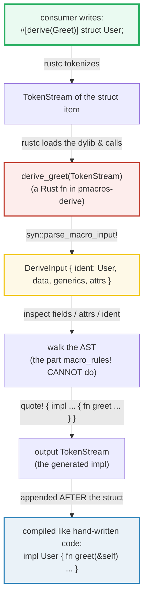

# PROC_MACROS — Procedural Macros (Derive)

> **One-line goal:** a **procedural derive macro** is an ordinary Rust FUNCTION
> that receives the compiler's `TokenStream`, inspects it as a typed AST via
> **`syn`**, and returns a new `TokenStream` built with **`quote!`** — adding an
> `impl` to the annotated type. This bundle implements two real derives
> (`Greet`, `FieldNames`) in a `proc-macro = true` crate and consumes them.
>
> **Run:** `just run proc_macros` (== `cargo run --bin proc_macros`)
> **Members:** spans **two** workspace crates — `pmacros-derive` (the
> `proc-macro = true` library: [`pmacros-derive/src/lib.rs`](../pmacros-derive/src/lib.rs))
> and `pmacros-demo` (the consumer bin).
> **Prerequisites:** [MACRO_RULES](../core/MACRO_RULES.md) (the declarative
> sibling — read it first for the compile-time-codegen framing),
> [TRAITS_BASICS](../core/TRAITS_BASICS.md) (derives commonly generate trait
> impls), [STRUCTS_ENUMS](../core/STRUCTS_ENUMS.md) (derive targets).
> **Ground truth:** [`proc_macros.rs`](./proc_macros.rs); captured stdout:
> [`proc_macros_output.txt`](./proc_macros_output.txt).

---

## Why this exists (lineage)

[MACRO_RULES](../core/MACRO_RULES.md) covered **declarative** macros
(`macro_rules!`): pattern-match on tokens, substitute, repeat. They are powerful
but **blind** — the matcher sees `$x:expr`, never the *meaning* of those tokens.
A macro cannot answer "what are this struct's field names?" because that requires
a **parsed AST**, not a token sequence.

**Procedural macros** close that gap. A proc macro is a plain Rust function that
runs at compile time, receives the compiler's `TokenStream`, and returns a new
one. The Rust Reference: "Procedural macros allow you to run code at compile time
that operates over Rust syntax, both consuming and producing Rust syntax. You can
sort of think of procedural macros as functions from an AST to another AST."
([Reference — Procedural macros][ref-pm]).

There are **three flavors** ([Reference][ref-pm]):

| Flavor | Attribute | Signature | Replaces or appends? | Example |
|---|---|---|---|---|
| **Function-like** | `#[proc_macro]` | `fn(TokenStream) -> TokenStream` | **replaces** the `name!(...)` invocation | `sql!(SELECT ...)` |
| **Derive** | `#[proc_macro_derive(Name)]` | `fn(TokenStream) -> TokenStream` | **appends** new items after the annotated type | `#[derive(Debug)]` |
| **Attribute** | `#[proc_macro_attribute]` | `fn(attr: TokenStream, item: TokenStream) -> TokenStream` | **replaces** the whole annotated item | `#[tokio::main]` |

This bundle implements the **derive** flavor — the most common one, the engine
behind `#[derive(Debug, Clone, Serialize, ...)]`.



Two structural facts make proc macros different from any other Rust code
([Reference — Procedural macros][ref-pm]):

1. **A separate crate.** "Procedural macros must be defined in the root of a
   crate with the crate type of `proc-macro`." In Cargo that is
   `[lib] proc-macro = true` (see `pmacros-derive/Cargo.toml`). The crate is
   **compiled as a dynamic library** and loaded by rustc when it encounters the
   `#[derive(..)]`.
2. **Not usable in its own crate.** "The macros may not be used from the crate
   where they are defined, and can only be used when imported in another crate."
   That is *why* this bundle spans two members: `pmacros-derive` (provider) and
   `pmacros-demo` (consumer).

---

## The two derives this bundle ships

Both live in [`pmacros-derive/src/lib.rs`](../pmacros-derive/src/lib.rs):

```rust
// pmacros-derive/src/lib.rs  (a proc-macro = true crate)
use proc_macro::TokenStream;
use quote::quote;
use syn::{Data, DeriveInput, Fields, LitStr, parse_macro_input};

#[proc_macro_derive(Greet, attributes(greet))]            // <- the entry point
pub fn derive_greet(input: TokenStream) -> TokenStream {
    let DeriveInput { ident, generics, attrs, .. } =
        parse_macro_input!(input as DeriveInput);         // syn parses -> AST
    let (impl_g, ty_g, where_g) = generics.split_for_impl();
    // ... read #[greet(prefix = "..")] helper attribute ...
    let expanded = quote! {                                // quote! builds output
        impl #impl_g #ident #ty_g #where_g {
            pub fn greet(&self) -> ::std::string::String {
                ::std::format!("{}, {}!", #prefix, ::core::stringify!(#ident))
            }
        }
    };
    expanded.into()
}
```

- **`#[proc_macro_derive(Name, attributes(..))]`** marks the entry fn. It "may
  only be applied to a `pub` function ... of type `fn(TokenStream) ->
  TokenStream` ... located in the root of the crate" ([Reference][ref-pm]).
- **`parse_macro_input!(input as DeriveInput)`** — `syn` parses the compiler's
  token stream into a typed `DeriveInput` (fields: `ident`, `generics`, `data`,
  `attrs`). On parse failure it emits a compile error and aborts.
- **`quote! { ... }`** — builds a `proc_macro2::TokenStream` by splicing `#var`
  (any `ToTokens`) into a quasi-Rust template. `#( ... ),*` is the repetition
  operator (one expansion per element).
- **`.into()`** — converts `proc_macro2::TokenStream` back to the compiler's
  `proc_macro::TokenStream`.

---

## Section A — The simplest derive: `#[derive(Greet)]` adds a method

```rust
#[derive(Greet)]
struct User;
// expands (conceptually) to:
//   impl User { pub fn greet(&self) -> String { format!("Hello, {}!", "User") } }
let g = User.greet();   // "Hello, User!"
```

> **From proc_macros.rs Section A:**
> ```
> ======================================================================
> SECTION A — the simplest derive: #[derive(Greet)] adds a method
> ======================================================================
>   #[derive(Greet)] struct User;
>   User.greet() -> "Hello, User!"
> [check] Greet generates greet() whose output contains the type name "User": OK
> [check] the default prefix is "Hello" -> output is "Hello, User!": OK
> ```

**What.** `#[derive(Greet)]` on a unit struct `User` causes `derive_greet` to
run at compile time. It reads the type's ident (`User`), emits an `impl User {
fn greet(..) }`, and that method is then callable at runtime. `User.greet()`
returns `"Hello, User!"`.

**Why (internals).**
- **The ident is captured, not hardcoded.** `#ident` in `quote!` splices the
  `syn::Ident` for `User` into the template; `::core::stringify!(#ident)` turns
  it into the literal `"User"` *inside the generated code* — so the same derive
  produces a different string per type.
- **Derive output is APPENDED, not substituted.** "The output `TokenStream` must
  be a (possibly empty) set of items. These items are appended following the
  input item" ([Reference — derive][ref-pm]). The struct `User` passes through
  unchanged; the macro only *adds* the `impl`. (Contrast: an **attribute** macro
  *replaces* the item — see the table above.)
- **Absolute paths (`::std::format!`, `::core::stringify!`).** Proc macros are
  **unhygienic**: "they behave as if the output token stream was simply written
  inline" ([Reference — hygiene][ref-pm]). A bare `format!` would resolve at the
  *consumer's* call site and could be shadowed. Absolute paths are the safe
  habit — the Reference itself recommends "using absolute paths to items in
  libraries (for example, `::std::option::Option` instead of `Option`)"
  ([Reference][ref-pm]).

---

## Section B — Derive helper attributes: `#[greet(prefix = "...")]`

```rust
#[derive(Greet)]
#[greet(prefix = "Welcome")]          // <- a derive HELPER attribute
struct Admin;
let g = Admin.greet();   // "Welcome, Admin!"
```

> **From proc_macros.rs Section B:**
> ```
> ======================================================================
> SECTION B — derive helper attribute: #[greet(prefix = "...")]
> ======================================================================
>   #[derive(Greet)] #[greet(prefix = "Welcome")] struct Admin;
>   Admin.greet() -> "Welcome, Admin!"
> [check] the helper attribute overrides the prefix to "Welcome": OK
> [check] User (no helper) keeps the default "Hello" prefix: OK
> ```

**What.** The `greet` word in `#[greet(prefix = "Welcome")]` is a **derive macro
helper attribute** — declared by listing it in `attributes(greet)` on the
`#[proc_macro_derive(Greet, attributes(greet))]` line. Without that declaration,
`#[greet(..)]` would be an unknown attribute and a compile error. With it, the
attribute becomes **inert** (ignored by the compiler) and the macro reads it
itself via `syn`'s `attr.parse_nested_meta`.

**Why (internals).**
- **Helper attributes are INERT.** "Derive macros can declare *derive macro
  helper attributes* ... These attributes are inert. While their purpose is to be
  used by the macro that declared them, they can be seen by any macro"
  ([Reference — helper attributes][ref-pm]). "Inert" means the compiler does not
  act on them — they are passed through for the declaring macro (or any other
  macro) to consume.
- **Per-invocation, not global.** `User` (no `#[greet(..)]`) keeps the default
  `"Hello"`; `Admin` (with `#[greet(prefix = "Welcome")]`) gets `"Welcome"`. The
  check confirms the helper attribute is read per-struct, not baked into the
  macro. The `parse_nested_meta` closure returns `Err(meta.error(..))` for an
  unknown key, which becomes a spanned compile error via
  `syn::Error::to_compile_error()`.

---

## Section C — Parsing fields: `#[derive(FieldNames)]` inspects the AST

```rust
#[derive(FieldNames)]
struct Point { x: i32, y: i32, label: String }
let names = Point::field_names();   // ["x", "y", "label"]
```

```rust
// the AST walk inside derive_field_names (pmacros-derive/src/lib.rs):
let field_idents: Vec<_> = match &data {
    Data::Struct(s) => match &s.fields {
        Fields::Named(named) => named.named.iter()
            .filter_map(|f| f.ident.clone()).collect(),
        _ => /* compile error */,
    },
    _ => /* compile error */,
};
// quote! repetition — one stringify! per field:
quote! { pub fn field_names() -> &'static [&'static str] {
    &[ #( ::core::stringify!(#field_idents) ),* ]
} }
```

> **From proc_macros.rs Section C:**
> ```
> ======================================================================
> SECTION C — parsing fields: #[derive(FieldNames)] lists field names
> ======================================================================
>   struct Point { x: i32, y: i32, label: String }
>   Point::field_names() -> ["x", "y", "label"]
> [check] FieldNames returns the 3 field names in declaration order: OK
> [check] the field-name list length equals the number of named fields (3): OK
> [check] Greet works on a unit struct (uses the ident, not the fields): OK
> ```

**What.** `FieldNames` walks `DeriveInput.data` → `Data::Struct` →
`Fields::Named`, collects each field's `ident`, and emits an associated function
returning `&'static [&'static str]`. `Point::field_names()` returns exactly
`["x", "y", "label"]` — the names, in declaration order.

**Why (internals).**
- **This is the capability `macro_rules!` lacks.** A declarative macro matches
  on token *fragments* (`$x:expr`); it cannot introspect "what fields does this
  struct have?" because it never builds an AST. `syn` hands the proc macro a real
  `DeriveInput` it can match, filter, and transform. That is the whole reason
  proc macros exist ([Reference][ref-pm]).
- **`#( ... ),*` is `quote!` repetition.** `#field_idents` is a `Vec<Ident>`;
  `#( ::core::stringify!(#field_idents) ),*` emits
  `stringify!(x), stringify!(y), stringify!(label)` — one per element, comma-
  separated. The outer `&[ ... ]` is then **rvalue-promoted** to `'static`
  because every element is a `&'static str` (compile-time constant), so the slice
  lives in read-only memory.
- **Two derives coexist.** `Point` derives **both** `FieldNames` and `Greet` —
  each appends its own `impl` independently. Multiple `#[derive(..)]` names run
  in order, each producing its own appended items.

> **`#[allow(dead_code)]` on `Point`.** The field *values* are never read at
> runtime: `FieldNames` inspects names at compile time and `Greet` only
> stringifies the type ident. The fields exist purely so `FieldNames` has named
> fields to enumerate. The allow is local and justified in
> [`proc_macros.rs`](./proc_macros.rs) — this is the §4.2 rule-5 exception.

🔗 [STRUCTS_ENUMS](../core/STRUCTS_ENUMS.md) — the structs/enums/unions a derive
can target (the `DeriveInput.data` variants).

---

## Section D — Derive on a generic struct: `generics.split_for_impl()`

```rust
#[derive(Greet)]
struct Pair<A, B> { _first: A, _second: B }
// the macro emits:  impl<A, B> Pair<A, B> { fn greet(&self) -> ... }
Pair::<i32, i32>{ .. }.greet()    // "Hello, Pair!"
Pair::<&str, char>{ .. }.greet()  // "Hello, Pair!"  (same impl, monomorphized)
```

```rust
// the generic-handling idiom (pmacros-derive/src/lib.rs):
let (impl_g, ty_g, where_g) = generics.split_for_impl();
quote! { impl #impl_g #ident #ty_g #where_g { /* methods */ } }
//         ^^^^^^                ^^^^^^ for `impl<A,B> Pair<A,B>`
```

> **From proc_macros.rs Section D:**
> ```
> ======================================================================
> SECTION D — derive on a generic struct: generics.split_for_impl()
> ======================================================================
>   #[derive(Greet)] struct Pair<A, B> { ... }
>   Pair::<i32, i32>{ .. }.greet() -> "Hello, Pair!"
> [check] the generated impl is generic: greet() works for Pair<i32, i32>: OK
>   Pair::<&str, char>{ .. }.greet() -> "Hello, Pair!"
> [check] one derive covers every monomorphization: Pair<&str, char> too: OK
> ```

**What.** `Pair<A, B>` derives `Greet`. The generated `greet()` is callable on
`Pair<i32, i32>` **and** `Pair<&str, char>` — one derive, every
monomorphization. Both calls return the identical `"Hello, Pair!"`.

**Why (internals).** Forgetting generics is the #1 bug in hand-written derive
macros. `generics.split_for_impl()` ([syn docs][syn-generics]) returns three
fragments that must appear in the right slots of the generated `impl`:

| Fragment | Example for `Pair<A, B>` | Slot in `quote!` |
|---|---|---|
| `impl_g` (`ImplGenerics`) | `<A, B>` | after `impl` |
| `ty_g` (`TypeGenerics`) | `<A, B>` | after the type name |
| `where_g` (`WhereClause`) | `where A: Foo` | at the end |

Drop `impl_g` and you get `impl Pair<A, B>` (missing params — the type is
unparametrized). Drop `ty_g` and the type name has no params. **No bounds are
added** here because `greet()` never touches a field of type `A`/`B` — it only
stringifies the type *name*. A derive that *uses* the fields (e.g. `Eq`) would
need `where A: PartialEq, B: PartialEq`, usually added by parsing the
`generics` and extending the where-clause.

🔗 [GENERICS](../core/GENERICS.md) — generic params and the `impl<T>` vs
`Type<T>` distinction that `split_for_impl` formalizes.

---

## Section E — What a derive CAN and CANNOT do

> **From proc_macros.rs Section E:**
> ```
> ======================================================================
> SECTION E — what a derive CAN and CANNOT do (add items, not modify)
> ======================================================================
>   Point::field_names() -> ["x", "y", "label"]   (a NEW associated fn was added)
>   Point{..}.greet()    -> "Hello, Point!"   (a NEW method was added)
> [check] a derive ADDS an impl: both field_names() and greet() exist on Point: OK
>   size_of::<Point>() = 32 bytes  (struct layout is UNCHANGED)
> [check] the input struct is unchanged: Point still has its own layout/fields: OK
> ```

**CAN** (derive output "is appended following the input item" — [Reference][ref-pm]):
- **Append new items** — most often an `impl` (inherent methods, like `greet`,
  or a trait impl, like `#[derive(Debug)]` → `impl fmt::Debug`). Both
  `field_names()` and `greet()` exist on `Point` after derivation.
- **Implement traits** — this is the real-world use: `Debug`, `Clone`, `Copy`,
  `PartialEq`, `Serialize`, `Deserialize`. (This bundle uses inherent methods to
  stay self-contained — no trait the consumer must import.)
- **Declare & read helper attributes** via `attributes(..)` (Section B).

**CANNOT:**
- **Modify the annotated item.** The struct is passed through UNCHANGED. You
  cannot add/remove a field, rename the ident, or change visibility from within a
  derive — the output is *additional items*, not a replacement. The check
  confirms `Point`'s layout (`size_of::<Point>() == 32`) is the struct's own, not
  altered by either derive. **To replace the item you need an ATTRIBUTE macro**
  (`#[proc_macro_attribute]`), whose return "replaces" the annotated item
  ([Reference][ref-pm]).
- **Be used in its own crate** ([Reference][ref-pm]) — hence the two-member split.
- **See other crates' source** — it only sees the `TokenStream` of the annotated
  item, not the whole program.

> **`#[automatically_derived]`.** The standard derives (`Debug`, `Clone`, …)
  tag their generated `impl` with `#[automatically_derived]`. This is a
  compiler-recognized inert attribute that (a) makes the impl show as folded/
  hidden in rustdoc and (b) exempts it from some lints. Custom derives do not get
  it automatically; some authors add it manually. It is purely a hint to tools,
  not a semantic requirement.

🔗 [TRAITS_BASICS](../core/TRAITS_BASICS.md) — the trait `impl`s that real
derives (`Debug`, `Clone`) generate; this bundle's inherent methods are the
simpler, import-free variant.

---

## Section F — Build pipeline & contrast with `macro_rules!`

> **From proc_macros.rs Section F:**
> ```
> ======================================================================
> SECTION F — build pipeline & contrast with macro_rules!
> ======================================================================
>   Point::field_names() -> ["x", "y", "label"]
>   a macro_rules! macro enumerating fields: macro_rules! cannot do this (no AST)
> [check] FieldNames (an AST walk) is impossible to express with macro_rules!: OK
>   User.greet() -> "Hello, User!"   (macro used ::std::format!, not bare format!)
> [check] unhygienic output resolves in the consumer: greet() links to ::std::format!: OK
> ```

**The build pipeline** (the Mermaid at the top visualizes it):

1. `pmacros-derive` is compiled **first** as a dynamic library (`proc-macro =
   true`). It depends on `syn`, `quote`, `proc-macro2` — these are *build-time*
   deps of the provider, never linked into the consumer.
2. When rustc, compiling `pmacros-demo`, sees `#[derive(Greet)]`, it **loads the
   dylib** and calls `derive_greet(token_stream_of_the_struct)`.
3. The function parses with `syn`, generates with `quote!`, returns a
   `TokenStream` (the `impl`).
4. rustc **appends** that output after the struct and compiles it like ordinary
   code. The consumer's final binary contains the *result* of the macro, never
   the macro itself.

**Contrast with `macro_rules!`** ([MACRO_RULES](../core/MACRO_RULES.md)):

| Dimension | `macro_rules!` (declarative) | proc macro (derive) |
|---|---|---|
| **Mechanism** | pattern-match on tokens, substitute | a Rust fn: parse (syn) → emit (quote) |
| **Sees** | token fragments (`$x:expr`) | a full typed AST (`DeriveInput`) |
| **Field introspection** | **impossible** — no AST | trivial — `FieldNames` proves it |
| **Hygiene** | **mixed-site** (locals at definition site) | **unhygienic** (output resolves at consumer) |
| **Crate requirement** | any crate; `#[macro_export]` to share | a dedicated `proc-macro = true` crate |
| **Error reporting** | "no rules expected this token" | arbitrary: `syn::Error`, `compile_error!`, panic |
| **When to reach for it** | variadic, substitution-style (`vec!`, `println!`) | trait derives, AST surgery, DSLs |

The unhygiene point is the expert trap: a proc macro's `format!` resolves in the
**consumer**, so this bundle writes `::std::format!`. A `macro_rules!` body's
locals resolve at the **definition** site (mixed-site hygiene) — the opposite
default. See [MACRO_RULES § Section E](../core/MACRO_RULES.md) for the
declarative side.

🔗 [BUILD_CONFIG](../core/BUILD_CONFIG.md) — `build.rs` is the *other* compile-
time codegen path (runs before the main crate builds, writes files); a proc
macro runs *during* compilation and returns tokens. Complementary, not
overlapping.
🔗 [MACRO_RULES](../core/MACRO_RULES.md) — the declarative sibling; read it
first for the "macros are compile-time codegen" framing this builds on.

---

## Pitfalls (the expert payoff)

| Trap | Symptom | Fix / why |
|---|---|---|
| **Using the macro in its own crate** | `cannot find derive macro` in the provider crate | Proc macros "may not be used from the crate where they are defined" ([Reference][ref-pm]). Always split provider (`proc-macro = true`) and consumer into separate crates. |
| **Forgetting `[lib] proc-macro = true`** | `derive macros must be defined in a crate with crate type proc-macro` | The `#[proc_macro_derive]` attribute is only legal in a proc-macro crate root. |
| **Missing `attributes(..)` for a helper** | `cannot find attribute greet in this scope` | Declare helper attrs in `#[proc_macro_derive(Name, attributes(greet))]`. Without it the attr is unknown and errors; with it it is **inert** ([Reference][ref-pm]). |
| **Bare `format!` / `String` in generated code** | resolves to the wrong item if the consumer shadows it | Proc macros are **unhygienic** — use absolute paths `::std::format!`, `::std::string::String`, `::core::stringify!` ([Reference — hygiene][ref-pm]). |
| **Dropping `impl_g` / `ty_g` for generics** | `impl Foo<A>` for a generic type — missing params; the generated impl doesn't cover all monomorphizations | Use `let (impl_g, ty_g, where_g) = generics.split_for_impl();` and place each in the right `quote!` slot (Section D). |
| **Expecting a derive to modify the struct** | the added field / renamed ident never appears | A derive only **appends** items; it cannot change the input. Use an **attribute** macro (`#[proc_macro_attribute]`) to replace the item ([Reference][ref-pm]). |
| **Returning a non-item from a derive** | `expected item` / parse error on the generated stream | Derive output "must be a (possibly empty) set of items" — `impl`, `fn`, `struct`, etc. A stray expression is a hard error ([Reference][ref-pm]). |
| **`unwrap()` on field `ident`** | panic at compile time for tuple/unit structs where `ident` is `None` | `Fields::Named` idents are `Some`; tuple fields are `None`. Match on `Fields::Named` (as `FieldNames` does) or guard with `f.ident.as_ref()`. |
| **Panic vs `compile_error!` for user errors** | a panic shows an unhelpful internal backtrace | Both are sanctioned ([Reference][ref-pm]: "two ways ... panic, or emit `compile_error!`"), but `syn::Error::new_spanned(..).to_compile_error()` points at the offending token. This bundle uses it for the helper-attr and FieldNames type checks. |
| **Build-time deps leak into the consumer** | the consumer's binary grows / links `syn` | `syn`/`quote`/`proc-macro2` are deps of the **provider** only; they run at compile time and are never linked into the consumer. If they appear, you put the derive in the wrong crate. |
| **Two derives, one struct, name collision** | duplicate method / `already defined` | Each derive appends its own `impl` — ensure generated method/trait names don't collide. Standard derives are designed to coexist; custom ones must coordinate. |

---

## Cheat sheet

```rust
// ── THE PROVIDER CRATE: Cargo.toml has  [lib] proc-macro = true ──────────────
// deps: syn = { version = "2", features = ["full"] }, quote, proc-macro2.
use proc_macro::TokenStream;
use quote::quote;
use syn::{parse_macro_input, DeriveInput, Data, Fields};

// A DERIVE entry point: pub fn(TokenStream) -> TokenStream, crate root only.
#[proc_macro_derive(MyMacro, attributes(my_helper))]   // attributes() optional
pub fn derive_my_macro(input: TokenStream) -> TokenStream {
    let DeriveInput { ident, generics, data, attrs, .. } =
        parse_macro_input!(input as DeriveInput);        // syn: tokens -> AST
    let (impl_g, ty_g, where_g) = generics.split_for_impl(); // for generics

    // INSPECT the AST (the thing macro_rules! cannot do):
    //   data: Data::Struct { fields: Fields::Named(named) } -> named.named.iter()
    //   attrs: attr.parse_nested_meta(..) for helper attributes

    // GENERATE with quote!  — #var splices ToTokens; #( .. ),* repeats.
    let expanded = quote! {
        impl #impl_g #ident #ty_g #where_g {              // <- generics in 3 slots
            pub fn something(&self) -> ::std::string::String {
                ::std::format!("hi {}", ::core::stringify!(#ident))  // ABSOLUTE paths!
            }
        }
    };
    expanded.into()                                       // -> compiler TokenStream
}

// ── THE CONSUMER CRATE: depends on the provider via path ─────────────────────
//   pmacros-derive = { path = "../pmacros-derive" }
#[derive(pmacros_derive::MyMacro)]
#[my_helper(..)]                        // inert helper attr, read by the macro
struct Foo { a: i32 }

// ── THE THREE KINDS (pick by what you need) ───────────────────────────────────
//   #[proc_macro]            fn(TokenStream) -> TokenStream          function-like
//   #[proc_macro_derive(N)]  fn(TokenStream) -> TokenStream          derive (APPENDS)
//   #[proc_macro_attribute]  fn(attr, item: TokenStream) -> TokenStream  attribute (REPLACES)

// ── ERROR REPORTING (two sanctioned ways, Reference) ─────────────────────────
//   panic!("msg")                                  -> compiler error, no span
//   syn::Error::new_spanned(&tok, "msg").to_compile_error().into()  -> spanned
```

---

## Sources

Every claim above was web-verified in at least two authoritative places.

- **The Rust Reference — "Procedural macros"** — the authoritative spec: the
  three flavors (function-like `#[proc_macro]`, derive `#[proc_macro_derive]`,
  attribute `#[proc_macro_attribute]`), the crate-type requirement
  (`proc-macro = true`, "must be defined in the root of a crate with the crate
  type of `proc-macro`"), "may not be used from the crate where they are
  defined", derive output "must be a (possibly empty) set of items ... appended
  following the input item", derive **helper attributes** (`attributes(...)`,
  inert), proc macros being **unhygienic** ("behave as if the output token
  stream was simply written inline"), the recommendation to use **absolute
  paths** (`::std::option::Option`), the two error modes (panic / `compile_error!`),
  and the declarative-vs-procedural token-tree differences:
  https://doc.rust-lang.org/reference/procedural-macros.html
- **The Rust Programming Language, ch20.5 "Macros"** (the procedural-macros
  subsection; the chapter was renumbered in the 2024 edition — `ch20-06` now
  redirects to `ch20-05`) — how to write a derive macro with `syn` + `quote`,
  the `parse_macro_input!` / `quote!` / `.into()` pipeline, and the
  declarative-vs-procedural overview:
  https://doc.rust-lang.org/book/ch20-05-macros.html
- **The `syn` crate docs (v2)** — `DeriveInput` (the parsed struct/enum/union:
  `ident`, `generics`, `data`, `attrs`), `Data`/`Fields`/`Field` (the AST the
  macro inspects), `parse_macro_input!` (parse-or-compile-error), `Meta` and
  `parse_nested_meta` (helper-attribute parsing), and
  `Generics::split_for_impl` (the `impl_g`/`ty_g`/`where_g` idiom for generic
  types):
  https://docs.rs/syn/2/syn/
- **The `quote` crate docs** — the `quote!` macro, `#var` interpolation of any
  `ToTokens`, and `#( ... ),*` repetition for emitting one fragment per element:
  https://docs.rs/quote/1/quote/
- **The `proc_macro` crate docs** — the compiler-provided `TokenStream` type
  ("procedural macros operate over token streams instead of AST nodes, which is
  a far more stable interface over time"), `Span`, and the function-signature
  requirements for `#[proc_macro_derive]`:
  https://doc.rust-lang.org/proc_macro/
