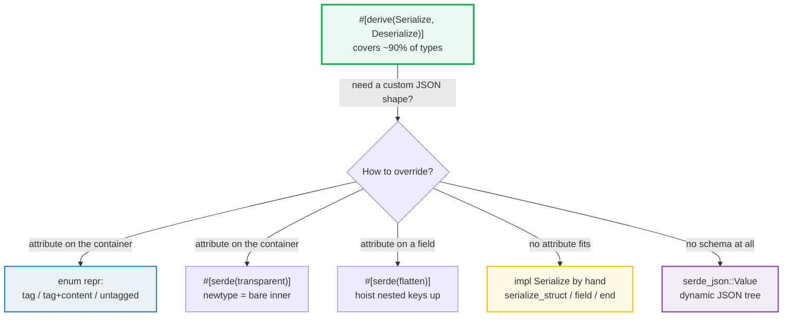
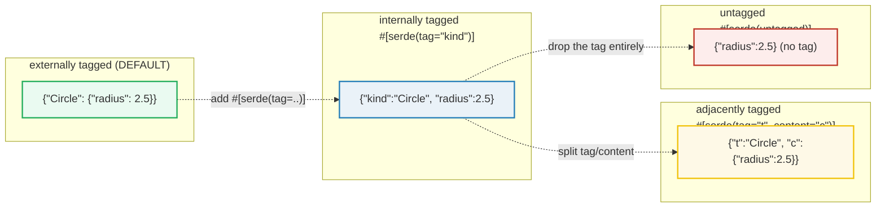
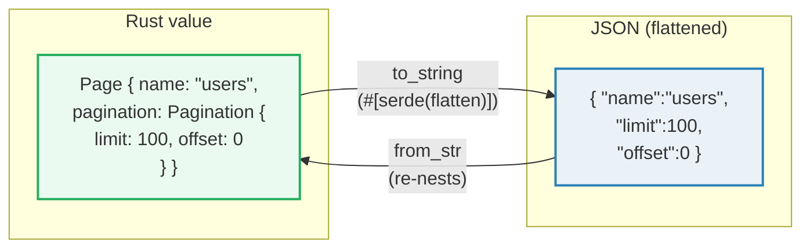
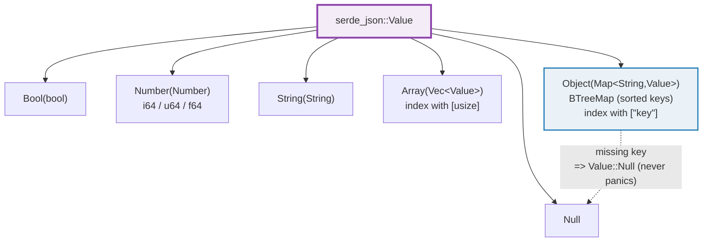

# SERDE_ADVANCED — Custom Impls, Enum Representations, Flatten, Transparent, and `Value`

> **One-line goal:** move past `#[derive(Serialize, Deserialize)]` and take
> **direct control** of serde's output — hand-write a `Serialize` impl, pick one
> of the **four enum representations** (externally / internally / adjacently /
> untagged), inline fields with **`flatten`**, erase a wrapper with
> **`transparent`**, and handle **schema-less JSON** with `serde_json::Value`.
>
> **Run:** `just run serde_advanced` (== `cargo run --bin serde_advanced`)
> **Member:** `serde` (deps: `serde` with `derive`, `serde_json`).
> **Prerequisites:** 🔗 [SERDE_BASICS](./SERDE_BASICS.md) (the derive, `to_string`
> / `from_str`, the Serde data model); 🔗 [STRUCTS_ENUMS](../core/STRUCTS_ENUMS.md)
> (struct vs tuple/newtype/unit variants — the enum-tag modes depend on them);
> 🔗 [TRAITS_BASICS](../core/TRAITS_BASICS.md) (`Serialize`/`Deserialize` are
> traits — this bundle is *hand-implementing* one); 🔗 [ERROR_HANDLING](../core/ERROR_HANDLING.md)
> (`Result` + `?` inside `serialize`/`from_str`).
> **Ground truth:** [`serde_advanced.rs`](./serde_advanced.rs); captured stdout:
> [`serde_advanced_output.txt`](./serde_advanced_output.txt).

---

## Why this exists (lineage)

`#[derive(Serialize, Deserialize)]` covers ~90% of real types — a struct with
plain fields round-trips to JSON for free (that is the SERDE_BASICS story). But
the moment a type's *desired JSON shape* diverges from its *Rust shape*, the
derive alone is not enough. You hit one of these walls:

| Wall | What you want | What the default derive gives you |
|---|---|---|
| An enum should look like `{"kind":"Circle",...}` (one object, like a TS discriminated union) | tag **inside** the object | `{"Circle":{...}}` — tag **outside** (externally tagged, the default) |
| A tagged union of *different value shapes* (`7` OR `"hi"`) | no tag at all | an external wrapper you don't want |
| A nested struct's fields should sit at the parent level | `{"name":...,"limit":...}` | `{"name":...,"pagination":{"limit":...}}` |
| A newtype `UserId(String)` should be just `"u-42"` | the bare inner value | `"u-42"` *is* the default for newtypes in JSON, but not in every format — and you may want to *guarantee* it |
| A type needs a non-derivable serialization (rename at runtime, combine fields, emit a custom shape) | total control | a struct-shaped object |

Serde answers every one of these with a **container/field attribute** or a
**hand-written trait impl**. This bundle is the map of those escape hatches.



---

## The four enum representations at a glance

This is the single most-requested serde feature and the easiest to get wrong. The
**default** is **externally tagged**; the other three are opt-in via container
attributes ([Serde — Enum representations][serde-enum]).



| Representation | Attribute | JSON shape (struct variant `Circle{radius}`) | Works for tuple variants? |
|---|---|---|---|
| **externally tagged** | *(default)* | `{"Circle":{"radius":2.5}}` | ✅ yes |
| **internally tagged** | `#[serde(tag = "kind")]` | `{"kind":"Circle","radius":2.5}` | ❌ **compile error** |
| **adjacently tagged** | `#[serde(tag = "t", content = "c")]` | `{"t":"Circle","c":{"radius":2.5}}` | ✅ yes |
| **untagged** | `#[serde(untagged)]` | `{"radius":2.5}` | ✅ yes |

The serde docs are explicit that internally tagged **cannot** carry tuple
variants: "This representation works for struct variants, newtype variants
containing structs or maps, and unit variants but does not work for enums
containing tuple variants. Using a `#[serde(tag = "...")]` attribute on an enum
containing a tuple variant is an error at compile time." ([Serde — Enum
representations][serde-enum]).

> **Alloc requirement.** Deserializing internally/adjacently/untagged enums
> requires serde's `"alloc"` Cargo feature, which is **on by default**. Only the
> default externally-tagged form works in strict `no-alloc` projects
> ([Serde — Enum representations][serde-enum]).

---

## Section A — A hand-written `Serialize` impl + `#[serde(transparent)]`

The `Serialize` trait has exactly **one** method; your job is to map `&self` into
the [Serde data model][serde-datamodel] by calling **one** `Serializer` method:

```rust
pub trait Serialize {
    fn serialize<S>(&self, serializer: S) -> Result<S::Ok, S::Error>
    where S: Serializer;
}
```

For a compound type you follow the universal **three-step process**: *init* →
*elements* → *end* ([Serde — Implementing Serialize][serde-implser]). For a struct
that is `serialize_struct` → `serialize_field` (per field) → `end`:

```rust
impl Serialize for Rgb {
    fn serialize<S>(&self, serializer: S) -> Result<S::Ok, S::Error>
    where S: Serializer,
    {
        let mut st = serializer.serialize_struct("Rgb", 3)?; // (name, len hint)
        st.serialize_field("r", &self.r)?;
        st.serialize_field("g", &self.g)?;
        st.serialize_field("b", &self.b)?;
        st.end()
    }
}
```

> **From serde_advanced.rs Section A:**
> ```
> ======================================================================
> SECTION A — a CUSTOM Serialize impl + #[serde(transparent)]
> ======================================================================
>   manual Serialize for Rgb{r:255,g:128,b:0} -> {"r":255,"g":128,"b":0}
> [check] custom Serialize yields exactly {"r":255,"g":128,"b":0} (field order = call order): OK
>   #[serde(transparent)] UserId("u-42") -> "u-42"
> [check] transparent wrapper serializes as its BARE inner value (no object layer): OK
> [check] transparent output == serializing the inner value directly: OK
> ```

**What.** The first check pins the exact bytes: `Rgb{r:255,g:128,b:0}` serializes
to `{"r":255,"g":128,"b":0}` — the field order is the **call order** of
`serialize_field`, not alphabetic. The second/third checks show
`#[serde(transparent)]`: the newtype `UserId(String)` serializes as the **bare**
string `"u-42"`, byte-identical to serializing the inner `&str` directly.

**Why (internals).**
- **`serialize_struct` is exactly what `#[derive(Serialize)]` emits** for a plain
  struct. The literal `"Rgb"` is the *type name* the data format records; JSON
  ignores it, but binary formats (bincode, MessagePack) and the `Deserializer`
  contract still **require** a name and a length hint ([Serde — Implementing
  Serialize][serde-implser]). Hand-writing the impl gives you the same output as
  the derive *plus* the freedom to rename/recombine fields, omit some, or pull
  values from several places — none of which the derive can express.
- **`#[serde(transparent)]` is a *guarantee*, not a convenience.** serde's docs:
  "Serialize and deserialize a newtype struct or a braced struct with one field
  exactly the same as if its one field were serialized and deserialized by
  itself. Analogous to `#[repr(transparent)]`." ([Serde — Container
  attributes][serde-container]). JSON already drops the wrapper for one-field
  newtypes by convention, but `transparent` **promises** this behavior across
  *every* format — so a `UserId(String)` stays `"u-42"` in bincode too, with no
  extra length prefix or tag. It is the type-level way to say "this wrapper has
  zero serialization footprint."
- **Field order is deterministic.** serde_json's struct serializer writes fields
  in the order they are serialized (here `r`, `g`, `b`). This is independent of
  the `BTreeMap` key-sorting that governs `Value::Object` (see Section E) — both
  are reproducible, just for different reasons.

> **When to write the impl by hand.** Reach for a manual `Serialize` only when no
> attribute fits: combining multiple source fields into one output field,
> producing a value whose shape depends on runtime data, or serializing a type
> from another crate (the newtype-pattern workaround). For *renaming*,
> *skipping*, *defaulting*, or *repr changes*, an attribute is always cheaper.
> Deserialize-by-hand is markedly heavier (a `Visitor` + `Deserializer` impl) —
> the serde docs themselves say "in most cases Serde's derive is able to generate
> an appropriate implementation" ([Serde — Implementing Deserialize][serde-implde]);
> prefer `#[serde(from = "..")]` or a `Value` round-trip for custom reads.

🔗 [TRAITS_BASICS](../core/TRAITS_BASICS.md) — `Serialize`/`Deserialize` are
traits; this section is literally `impl Trait for Type`. 🔗 [ERROR_HANDLING](../core/ERROR_HANDLING.md)
— the `?` inside `serialize` propagates `S::Error`, the format's error type.

---

## Section B — Internally tagged enum: `#[serde(tag = "kind")]`

```rust
#[derive(Serialize, Deserialize)]
#[serde(tag = "kind")]
enum Shape {
    Circle { radius: f64 },
    Rect { w: f64, h: f64 },
}
```

> **From serde_advanced.rs Section B:**
> ```
> ======================================================================
> SECTION B — internally tagged enum: #[serde(tag = "kind")]
> ======================================================================
>   Circle{radius:2.5} -> {"kind":"Circle","radius":2.5}
>   Rect{w:3.0,h:4.0}   -> {"kind":"Rect","w":3.0,"h":4.0}
> [check] internally tagged: Circle carries "kind":"Circle" inside the object: OK
> [check] internally tagged: Rect carries "kind":"Rect" inside the object: OK
> [check] internally tagged: fields sit at the SAME level as the tag (flat object): OK
> ```

**What.** The discriminator `"kind"` is **inside** the same object as the fields
— the classic TypeScript/Java discriminated-union shape. The three checks pin
the exact shape per variant and confirm the fields are *flat* (no extra nesting).

**Why (internals).** This is the representation that "is common in Java
libraries" ([Serde — Enum representations][serde-enum]). The price: serde must
**buffer the content** into an intermediate `Value`/map to read the tag first,
then dispatch — so internally/adjacently/untagged all cost an extra allocation on
deserialize (this is tracked as a known efficiency caveat in serde issue #1495).
That is also *why* tuple variants are forbidden: a tuple like `Rect(f64, f64)`
has no field names to live alongside `"kind"`, so the representation is
ill-defined and serde rejects it at compile time.

🔗 [STRUCTS_ENUMS](../core/STRUCTS_ENUMS.md) — the distinction between struct,
tuple, newtype, and unit variants is what decides which tag modes are legal.

---

## Section C — Untagged enum: `#[serde(untagged)]`

```rust
#[derive(Serialize, Deserialize)]
#[serde(untagged)]
enum NumOrText {
    Number(i64),
    Text(String),
}
```

> **From serde_advanced.rs Section C:**
> ```
> ======================================================================
> SECTION C — untagged enum: #[serde(untagged)] (NO discriminator)
> ======================================================================
>   Number(7)   -> 7
>   Text("hi")  -> "hi"
> [check] untagged Number(i64) serializes as the BARE integer, no tag: OK
> [check] untagged Text(String) serializes as the BARE string, no tag: OK
> [check] untagged output carries NO discriminator key (no type/kind/tag): OK
> ```

**What.** There is **no tag at all** — `Number(7)` writes the bare `7`,
`Text("hi")` writes the bare `"hi"`. The third check asserts no discriminator
key leaks into either output.

**Why (internals).** With no tag, the *reader* must **guess** the variant.
Serde's rule: "Serde will try to match the data against each variant in order and
the first one that deserializes successfully is the one returned" ([Serde — Enum
representations][serde-enum]). Two consequences fall out of that rule:

1. **Declaration order matters.** Put the *more specific* variant first. If you
   listed `Text` before `Number`, a `7` would still try `Text` first (fail — not a
   string) and fall through to `Number`; but if two variants both accept the same
   input (e.g. two newtypes around `String`), the **first one silently wins**.
2. **Errors are useless.** When *no* variant matches, `untagged` cannot tell you
   why — it just reports "data did not match any variant of untagged enum". The
   serde docs recommend adding `#[serde(expecting = "...")]` to improve the
   message ([Serde — Container attributes][serde-container]).

The serde docs also warn that "in performance-critical code, the implementation
approach used by `untagged` can be costly" — every variant is attempted by
buffering into a `Value` first ([Serde — Container attributes][serde-container]).

---

## Section D — `#[serde(flatten)]`: inline a nested struct into the parent

```rust
#[derive(Serialize, Deserialize)]
struct Pagination { limit: u64, offset: u64 }

#[derive(Serialize, Deserialize)]
struct Page {
    name: String,
    #[serde(flatten)]
    pagination: Pagination,
}
```

> **From serde_advanced.rs Section D:**
> ```
> ======================================================================
> SECTION D — #[serde(flatten)]: inline a nested struct into the parent
> ======================================================================
>   Page{name, pagination:{limit,offset}} -> {"name":"users","limit":100,"offset":0}
> [check] flatten: limit and offset appear at the PARENT level (no nesting): OK
> [check] flatten: there is NO "pagination" key in the output: OK
> [check] flatten round-trips: deserialize reconstructs the nested Pagination: OK
> ```

**What.** `limit` and `offset` appear at the **parent** level — the
`"pagination": { ... }` wrapper is gone. The round-trip check proves the
deserializer is symmetric: it **un-flattens** the keys back into the nested
`Pagination`.

**Why (internals).** serde's docs: "The `flatten` attribute inlines keys from a
field into the parent struct… supported only within structs that have named
fields, and the field to which it is applied must be a struct or map type"
([Serde — Struct flattening][serde-flatten]). Two real-world use-cases drive it:

1. **Factor out shared sub-shapes** — every paginated API endpoint reuses one
   `Pagination` struct flattened into each response.
2. **Capture arbitrary extra fields** — flatten a `HashMap<String, Value>` to
   collect unknown keys ("bag of extras") alongside the typed ones.

The same buffering caveat applies: flatten deserializes the whole object into a
`Map` first, then picks fields out, which is why the serde docs note "`flatten`
is not supported in combination with `deny_unknown_fields`" on either the outer
or the inner struct ([Serde — Struct flattening][serde-flatten]).



---

## Section E — `serde_json::Value` + the `json!` macro (schema-less JSON)

When there is no schema (or you only care about a few fields of a big blob),
`Value` is Rust's dynamic JSON tree:

```rust
pub enum Value {
    Null,
    Bool(bool),
    Number(Number),
    String(String),
    Array(Vec<Value>),
    Object(Map<String, Value>),   // Map is a BTreeMap by default
}
```

> **From serde_advanced.rs Section E:**
> ```
> ======================================================================
> SECTION E — serde_json::Value + the json! macro (dynamic JSON)
> ======================================================================
>   json!({...}) as compact JSON (object keys sorted: BTreeMap):
>     {"a":1,"active":true,"b":[2,3],"note":null}
> [check] Value::Object discriminant matches the json! object: OK
> [check] the object has exactly 4 keys: OK
>   v["b"][1] == 3   (index chain drills into the array)
> [check] json!({"a":1,"b":[2,3]})["b"][1] == 3: OK
>   v.get("a").as_i64() -> Some(1) ; v.get("zzz") -> None
> [check] .get("a") yields Some(1) via as_i64: OK
> [check] .get("zzz") yields None (a truly absent key): OK
> [check] v["zzz"] is Value::Null (indexing never panics): OK
> ```

**What.** The `json!` macro builds a `Value` from a JSON literal (with
interpolation of any `Serialize` value); the printed object has its keys
**sorted** (`a, active, b, note`), not in insertion order. Indexing chains
(`v["b"][1]`) drill into the tree and yield `3`; `.get()` returns `Option` so a
missing key is `None`, while bracket-index of a missing key yields `Value::Null`
— **never a panic**.

**Why (internals).**
- **`Value` is a recursive tagged union** of the six JSON types — the same shape
  as JSON itself, so `Value` *is* schema-less JSON ([serde_json — Value][json-value]).
  The `json!` macro is just sugar over `Value::Object`/`Array`/etc.; "variables
  or expressions can be interpolated… any type interpolated into an array element
  or object value must implement Serde's `Serialize` trait" ([serde_json —
  json!][json-macro]).
- **`Object` is a `BTreeMap` by default** — serde_json's docs: "By default the
  map is backed by a `BTreeMap`. Enable the `preserve_order` feature of
  serde_json to use `IndexMap` instead, which preserves entries in the order they
  are inserted" ([serde_json — Value][json-value]). This is *why* the printed
  object's keys come out sorted, and it is the load-bearing determinism fact for
  this whole bundle (see "Determinism" below).
- **Two indexing styles, two semantics.** `Value` implements `Index` for `&str`
  and `usize`: the docs spell out that `v["missing"]` returns `Value::Null` "in
  cases where `get` would have returned `None`", and even
  `v[0]["x"]["y"]["z"]` on a non-object yields `Null` rather than panicking
  ([serde_json — Value][json-value]). So `[...]` is convenient but **erases the
  absent-vs-null distinction**; `.get()` preserves it (returns `None` for truly
  absent). The last three checks in Section E demonstrate exactly this split.
- **`as_i64`/`as_str`/`as_bool`/…** are the typed accessors: they return
  `Option<T>`, so you compose them with `.get()` and `?` for safe drilling
  (`v.get("a").and_then(Value::as_i64)`).



🔗 [ERROR_HANDLING](../core/ERROR_HANDLING.md) — `Option`/`Result` chaining with
`?` is how you drill safely into a `Value`.

---

## Section F — Round-trip: serialize → deserialize → equality

A serialization format is only useful if it **round-trips**. The two checks here
prove lossless round-trips for both a tagged and an untagged enum, and the third
shows *where the ambiguity lives*.

> **From serde_advanced.rs Section F:**
> ```
> ======================================================================
> SECTION F — round-trip: serialize -> deserialize -> equality
> ======================================================================
>   internally tagged: {"kind":"Circle","radius":2.5} -> Circle { radius: 2.5 }
> [check] internally tagged enum round-trips losslessly: OK
>   untagged: 7 -> Number(7)
> [check] untagged enum round-trips losslessly (variant re-inferred): OK
> [check] untagged reader infers NumOrText::Number from a bare `7`: OK
> ```

**What.** `Circle{radius:2.5}` → `{"kind":"Circle","radius":2.5}` → back to an
equal `Circle`. `Number(7)` → `7` → back to an equal `Number(7)`. And a *bare*
`7` (with no Rust ever having produced it) deserializes to `NumOrText::Number(7)`
under the untagged reader.

**Why (internals).** The tag is the **writer's** promise to the **reader**.
- For the **internally tagged** enum, the `"kind"` key is *load-bearing*: it is
  the only thing telling the deserializer which variant to build. Remove it and
  `Shape` cannot be deserialized at all (it would not know `Circle` from `Rect`).
- For the **untagged** enum, there is no such promise — the reader **infers** the
  variant from the value's shape alone, trying each in declaration order. That is
  why a bare `7` (which no `NumOrText` value produced) still resolves to
  `Number(7)`: the `Number(i64)` variant is first and `7` parses as `i64`.

This is the core trade-off across all four representations: **the more
information you put in the tag, the more unambiguous (and verbose) the format;
the less you put in, the more you rely on the reader to guess — and guessing can
go wrong when two variants accept the same shape.**

---

## Determinism (why every byte below reproduces)

This bundle's `_output.txt` is byte-identical across runs because of **two
independent ordering rules**, neither of which involves any hand-sorting:

1. **`Value::Object` keys are sorted.** serde_json's `Map` is a `BTreeMap` unless
   the `preserve_order` feature is on ([serde_json — Value][json-value]). This
   member does **not** enable it, so `json!({"b":..,"a":..})` serializes with
   keys in `a, b` order — always. (If you *did* enable `preserve_order`, call
   `Value::sort_all_objects` before printing to restore determinism — the docs
   note that method "does no work" when the feature is off because "all JSON maps
   are always kept in a sorted state" ([serde_json — Value][json-value]).)
2. **Struct field order is fixed.** A custom `Serialize` writes fields in
   `serialize_field` call order; a derive writes them in declaration order.
   Both are compile-time-fixed.

There are no `HashMap`s, no thread interleaving, no printed addresses, and no RNG
in this file — so the output is reproducible by construction, satisfying the
`HOW_TO_RESEARCH.md` §4.2 DETERMINISM rules.

---

## Pitfalls (the expert payoff)

| Trap | Symptom | Fix / why |
|---|---|---|
| **`#[serde(tag = "..")]` on a tuple-variant enum** | compile error | Internally tagged needs named fields to live next to the tag. Use adjacently tagged (`tag`+`content`) or externally tagged for tuple variants ([Serde][serde-enum]). |
| **`flatten` + `deny_unknown_fields`** | compile error / silent ignore | "not supported in combination" — flatten buffers into a `Map`, which can't enforce unknown-field rejection. Drop `deny_unknown_fields` ([Serde][serde-flatten]). |
| **`untagged` variant order is wrong** | the *wrong* variant is picked silently | serde tries variants top-to-bottom and keeps the first that parses. Put the **more specific** variant first; if two accept the same input the first wins with no warning. |
| **`untagged` deserialization errors are useless** | "data did not match any variant of untagged enum" | Add `#[serde(expecting = "needed: an i64 or a string")]` on the enum for a better message ([Serde][serde-container]). |
| **`v["missing"]` looks "null" but the key was absent** | you treat absent as `null` and crash on `.as_i64().unwrap()` | Bracket indexing returns `Value::Null` for a missing key (never panics). Use `.get(key)` → `Option<&Value>` to tell absent (`None`) from explicit `null`. |
| **Expecting `Value` keys in insertion order** | output looks reordered | `Map` is a `BTreeMap` by default → keys are sorted. Enable `preserve_order` (IndexMap) if you need insertion order, then `sort_all_objects` only when you want sorted. |
| **Custom `Serialize` with the wrong field-count hint** | some formats mis-size the output | The 2nd arg to `serialize_struct(name, n)` is a *hint*; pass the real field count. JSON ignores it, but binary formats (bincode) encode the length from it. |
| **Implementing `Deserialize` by hand** | ~80 lines of `Visitor` + `Deserializer` | It is far heavier than `Serialize`. Prefer `#[serde(from = "T")]` with a `From` impl, or deserialize through `Value` and convert — both reuse a derive. |
| **`transparent` on a multi-field struct** | compile error | It is legal **only** for a newtype (1 field) or a braced struct with exactly one field ([Serde][serde-container]). |
| **Comparing `Value` numbers across int widths** | `json!(2) == json!(2_i64)` surprises | Use the typed accessors (`as_i64`/`as_u64`/`as_f64`) instead of `==` on `Value` when the source integer widths might differ — Section E uses `as_i64` for exactly this reason. |
| **`externally tagged` is the default and you forgot** | you get `{"Variant":{...}}` when you wanted `{"kind":"Variant",...}` | The default is externally tagged. Add `#[serde(tag = "..")]` explicitly to switch to internally tagged. |

---

## Cheat sheet

```rust
use serde::{Serialize, Deserialize, Serializer};
use serde::ser::SerializeStruct;
use serde_json::{json, Value};

// ── Custom Serialize (three-step: init, fields, end) ──────────────────────
impl Serialize for Rgb {
    fn serialize<S>(&self, ser: S) -> Result<S::Ok, S::Error>
    where S: Serializer {
        let mut st = ser.serialize_struct("Rgb", 3)?;   // (name, field-count hint)
        st.serialize_field("r", &self.r)?;
        st.serialize_field("g", &self.g)?;
        st.serialize_field("b", &self.b)?;
        st.end()                                         // ALWAYS call end()
    }
}

// ── Enum representations ──────────────────────────────────────────────────
// default (externally tagged):  {"Circle":{"radius":2.5}}
#[serde(tag = "kind")]            // internally:  {"kind":"Circle","radius":2.5}  (no tuple vars!)
#[serde(tag="t", content="c")]    // adjacently:  {"t":"Circle","c":{"radius":2.5}}
#[serde(untagged)]                // untagged:    {"radius":2.5}   (reader infers variant, in order)

// ── Container / field shape attributes ────────────────────────────────────
#[serde(transparent)] struct UserId(String);   // serializes as the BARE inner value
struct Page {
    name: String,
    #[serde(flatten)] pagination: Pagination,  // hoist nested keys up to the parent
}                                             // (NOT allowed with deny_unknown_fields)

// ── Dynamic JSON: Value + json! ───────────────────────────────────────────
let v: Value = json!({"a":1, "b":[2,3]});      // Object keys sorted (BTreeMap default)
v["b"][1];        // => Value 3      (chain index; missing => Value::Null, NEVER panics)
v.get("a");       // => Option<&Value> = Some(...)   (absent => None, distinct from null)
v["a"].as_i64();  // => Option<i64>  (typed accessor; compose with .get + ?)

// ── Round-trip ────────────────────────────────────────────────────────────
let s = serde_json::to_string(&x)?;             // Rust -> JSON string
let y = serde_json::from_str::<T>(&s)?;        // JSON string -> Rust; assert y == x
```

---

## Sources

Every claim above was web-verified in at least two authoritative places (the
serde.rs guide + the serde_json docs.rs / the Rust Reference).

- **Serde — Enum representations** — the four modes (externally/internally/
  adjacently/untagged), exact JSON shapes, the compile-error for tuple variants
  under `tag`, the `"alloc"` requirement, and "try each variant in order":
  https://serde.rs/enum-representations.html
- **Serde — Container attributes** — `#[serde(tag = "..")]`,
  `#[serde(tag="..", content="..")]`, `#[serde(untagged)]`,
  `#[serde(transparent)]` ("analogous to `#[repr(transparent)]`"),
  `#[serde(expecting = "..")]` for untagged error messages, the `untagged`
  performance caveat:
  https://serde.rs/container-attrs.html
- **Serde — Implementing Serialize** — the trait signature, the universal
  three-step process (init → elements → end), the `Color`/`serialize_struct`
  example that this bundle's `Rgb` mirrors, the four struct kinds:
  https://serde.rs/impl-serialize.html
- **Serde — Implementing Deserialize** — the `Visitor`/`Deserializer` machinery
  (why hand-written Deserialize is far heavier than Serialize), "in most cases
  the derive is able to generate an appropriate implementation":
  https://serde.rs/impl-deserialize.html
- **Serde — Struct flattening (`#[serde(flatten)]`)** — inlines keys into the
  parent, named-fields-only, struct/map field type, the two use-cases (factor-out
  + capture-extras), and the `deny_unknown_fields` incompatibility:
  https://serde.rs/attr-flatten.html
- **serde_json — `Value` enum** — the six variants (`Null`/`Bool`/`Number`/
  `String`/`Array`/`Object`), `Object` backed by `BTreeMap` by default vs
  `IndexMap` under `preserve_order`, `get` vs `Index` (`[...]` returns `Null` for
  a missing key, never panics), the typed accessors, `sort_all_objects`:
  https://docs.rs/serde_json/latest/serde_json/value/enum.Value.html
- **serde_json — `json!` macro** — build a `Value` from a JSON literal,
  interpolation requires `Serialize` (values) / `Into<String>` (keys), trailing
  commas allowed:
  https://docs.rs/serde_json/latest/serde_json/macro.json.html
- **Serde — The data model** — the 16 types every `Serializer`/`Deserializer`
  speaks (why `serialize_struct` needs a name + length hint):
  https://serde.rs/data-model.html
