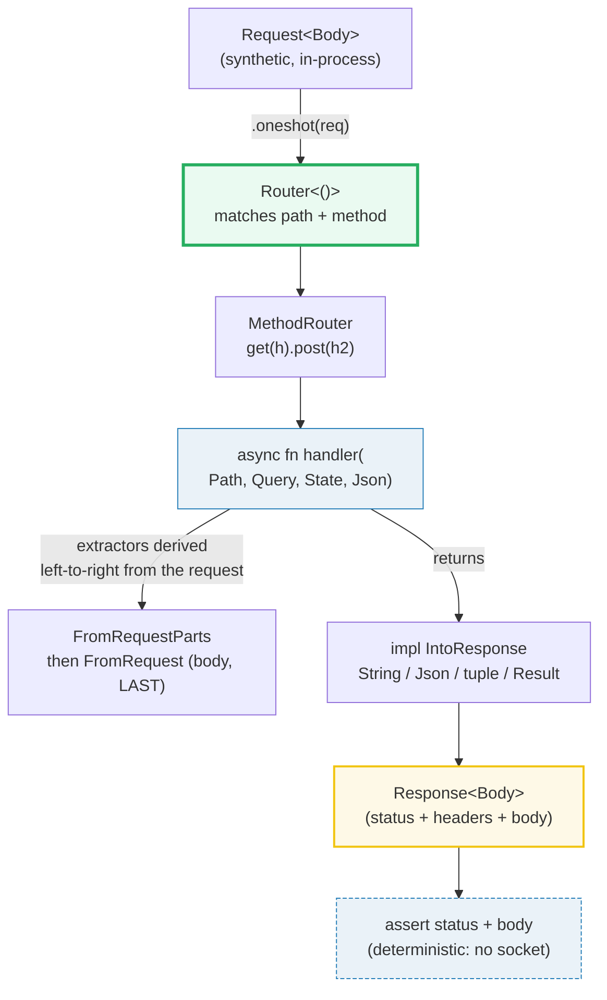
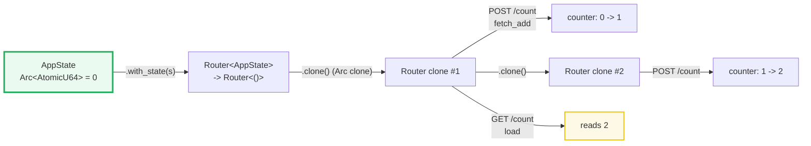
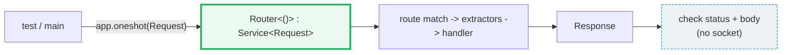

# AXUM_BASICS — Routing, Extractors, State, and In-Process Testing

> **One-line goal:** axum models a web app as a `Router` that maps **HTTP method
> + path** to **async handler functions**; handlers are plain `async fn`s whose
> **typed arguments are extractors** (axum derives them from the request) and
> whose return is any `impl IntoResponse`. The whole thing is driven
> **in-process** via `tower::ServiceExt::oneshot` — no socket, no port.
>
> **Run:** `just run axum_basics` (== `cargo run --bin axum_basics`)
> **Member:** `web` (deps: axum 0.8, serde, serde_json, tokio, reqwest, tower, http).
> **Prerequisites:** 🔗 [TOKIO_RUNTIME](../async/TOKIO_RUNTIME.md) — handlers are
> `async fn`s that run on a tokio executor; 🔗 [SERDE_BASICS](../serde/SERDE_BASICS.md)
> — `Json<T>` is `serde_json` deserialization/serialization behind an extractor.
> **Ground truth:** [`axum_basics.rs`](./axum_basics.rs); captured stdout:
> [`axum_basics_output.txt`](./axum_basics_output.txt).
>
> **Offline by design:** this bundle opens **no socket** and binds **no port**.
> Every handler is exercised through the `Service` interface in-process, so it
> runs deterministically anywhere with no network.

---

## Why this exists (lineage)

A web framework has to answer three questions, and axum's answer to each is a
**Rust type**:

| Question | Most frameworks | axum |
|---|---|---|
| Which code runs for this request? | A string match on `"GET /foo"` | `Router::new().route("/foo", get(h))` — a **method-typed** `MethodRouter` |
| How do I read the request? | `request.body()`, then parse by hand | **Extractors** — `Path`, `Query`, `Json<T>` are *typed arguments* axum fills for you |
| How do I build a response? | Set status, headers, body in 3 calls | Return any `impl IntoResponse` (a `String`, a `(StatusCode, Json<T>)` tuple, a `Result`) |

axum is built on **tower**'s `Service<Request>` trait and **hyper**'s HTTP
types. A `Router` *is* a `Service`: it takes a `Request<Body>`, routes it,
extracts arguments, calls the handler, and returns a `Response`. That single
abstraction is what lets us **test the entire pipeline in-process** with
`oneshot` — the exact same code that serves real TCP traffic, driven by a
synthetic `Request`, with no listener.

> **"Parse, don't validate."** axum's extractors are the web-facing instance of
> this Rust discipline: instead of checking "is this JSON? does it have a
> `name`?" at runtime, you declare `Json<NewItem>` and a *missing* `name` is a
> compile error in your handler's contract. The request either deserializes into
> your type (and your handler runs) or it is rejected before your code is called.



---

## The four primitives (memorize these)

1. **`Router::new().route("/path", method_router)`** — declarative routing. The
   second argument is a `MethodRouter`, built by `get(h)`, `post(h)`, or chained
   `get(h).post(h2)` to answer multiple methods on one path.
2. **Handlers are `async fn`s.** Their **arguments are extractors** (any type
   implementing `FromRequest`/`FromRequestParts`); their **return is
   `impl IntoResponse`**. axum counts the arguments and wires them up.
3. **`State<S>`** — shared application state, attached with `.with_state(s)`,
   cloned into every request. `S` must be `Clone`.
4. **`IntoResponse`** — the one return trait. axum implements it for `String`,
   `&'static str`, `StatusCode`, `Json<T>`, `Result<T, E>`, and tuples up to 16
   parts, so you compose a response by *returning* it.

---

## Section A — A Router and a GET handler returning `&'static str`

```rust
async fn root() -> &'static str { "hello, axum" }

let app: Router = Router::new().route("/", get(root));
```

> **From axum_basics.rs Section A:**
> ```
> ======================================================================
> SECTION A — Router + a GET handler returning &'static str
> ======================================================================
>   // `Router::new().route("/", get(handler))` maps GET / to the
>   // handler fn. `get` returns a `MethodRouter` that only answers GET.
>   // We drive it IN-PROCESS with `oneshot`: no socket, no port.
>   let app: Router = Router::new().route("/", get(root));
>   GET /  -> 200 OK  body = "hello, axum"
> [check] GET / returns 200 OK: OK
> [check] GET / body contains "hello": OK
> [check] &'static str handler sets Content-Type: text/plain; charset=utf-8: OK
> ```

**What.** `get(root)` builds a `MethodRouter` that answers only `GET`. We fire a
synthetic `GET /` through `oneshot`; the handler returns `&'static str`, which
axum turns into a `200 OK` whose `Content-Type` is
`text/plain; charset=utf-8`. The third check pins that header — a handler that
returns a string does **not** set `application/json`; the body type *is* the
content type.

**Why (internals).**
- **`get` vs `post` vs `MethodRouter`.** `axum::routing::get(h)` returns a
  `MethodRouter` with a single handler bound to `GET`. Passing it to `.route`
  registers it for that path. An unsupported method (e.g. `DELETE /`) yields a
  `405 Method Not Allowed` automatically — you never write that branch.
- **`oneshot` is the `Service` interface.** A finished `Router<()>` implements
  `tower::Service<Request<Body>>`. `ServiceExt::oneshot(self, req)` takes the
  service **by value**, calls the full routing→extraction→handler→response
  pipeline, and returns the `Response` — the same code path that serves a real
  TCP connection. There is no `TcpListener` anywhere in this file.

> **Why return `impl IntoResponse` instead of a concrete type?** Handlers
> commonly write `-> impl IntoResponse` so they can return different concrete
> shapes from different branches (a `String` here, a `(StatusCode, Json)` there)
> while exposing one opaque return type to callers. Section E shows the tuple;
> Section F shows `Result`. axum also accepts a bare concrete return like
> `-> &'static str` (as here) — anything `IntoResponse` works.

---

## Section B — Method routing: GET and POST on the SAME path

```rust
let app = Router::new().route("/echo", get(echo_get).post(echo_post));
```

> **From axum_basics.rs Section B:**
> ```
> ======================================================================
> SECTION B — method routing: GET and POST on the SAME path
> ======================================================================
>   // `get(h).post(h2)` builds a `MethodRouter` that dispatches by the
>   // HTTP method. Same path, two handlers — declarative, type-checked.
>   let app = Router::new().route("/echo", get(echo_get).post(echo_post));
>   GET  /echo -> 200 OK  body = "echo: GET"
>   POST /echo -> 200 OK  body = "echo: POST"
> [check] GET /echo returns 200 + the GET handler's body: OK
> [check] POST /echo returns 200 + the POST handler's body: OK
> ```

**What.** One path, two methods, two distinct bodies. `get(echo_get)` returns a
`MethodRouter`; `.post(echo_post)` adds the POST handler to the *same*
`MethodRouter`. axum inspects `Request::method()` and dispatches — the GET
request gets `"echo: GET"`, the POST request gets `"echo: POST"`.

**Why (internals).** Routing is **two-stage**: the path selects a
`MethodRouter`, then the method selects the handler within it. This is why a
path can legitimately answer several methods. Each handler has its own
independent signature and extractor set — a `GET /users/{id}` might take only
`Path`, while `POST /users` takes `State` + `Json`. They share nothing but the
path string.

---

## Section C — Extractors: `Path` + `Query` + `Json`, derived from the request

```rust
async fn create_item(
    Path(id): Path<u32>,                 // from the URL
    Query(Filter { q }): Query<Filter>,  // from the query string
    Json(NewItem { name }): Json<NewItem>, // from the body (MUST be last)
) -> String {
    format!("id={id}, q={q}, name={name}")
}

let app = Router::new().route("/items/{id}", post(create_item));
```

> **From axum_basics.rs Section C:**
> ```
> ======================================================================
> SECTION C — extractors: Path + Query + Json, derived from the request
> ======================================================================
>   // `Path<T>` from the URL, `Query<T>` from the query string,
>   // `Json<T>` from the body — all typed, all serde-deserialized.
>   // axum 0.8 path capture syntax is {id} (not :id).
>   let app = Router::new().route("/items/{id}", post(create_item));
>   POST /items/7?q=widget  {"name":"axum"}
>     -> 200 OK  body = "id=7, q=widget, name=axum"
> [check] POST with Path+Query+Json returns 200: OK
> [check] Path(id) parsed 7 from the URL: OK
> [check] Query(q) parsed 'widget' from the query string: OK
> [check] Json(NewItem) parsed 'axum' from the body: OK
> ```

**What.** One request — `POST /items/7?q=widget` with body `{"name":"axum"}` —
feeds three extractors that each read a *different part* of it. The handler
receives `id = 7u32`, `q = "widget"`, `name = "axum"`, all already typed. The
four checks confirm each extractor pulled its value from the right place.

**Why (internals).**
- **Two extractor traits, one ordering rule.** `FromRequestParts` reads request
  *parts* (method, URI, headers) and can run **anywhere** in the argument list;
  `FromRequest` **consumes the body** and must be the **last** argument. `Path`
  and `Query` are `FromRequestParts`; `Json` (and `String`, `Bytes`) are
  `FromRequest`. axum enforces this at compile time: a body extractor not last
  is a type error. The body is an async stream read **once** — you cannot have
  two body extractors.
- **`{id}` is the axum 0.8 capture syntax.** axum 0.8 switched path captures
  from `:id` to `{id}` (the `{user_id}` form is shown throughout axum's own
  extractor docs). `Path<u32>` then deserializes the captured segment with
  serde — a non-numeric `/items/abc` is rejected automatically.
- **Extractors run left-to-right**, in argument order. They short-circuit on the
  first failure: a malformed body means `Json` rejects the request and your
  handler **never runs** — the rejection response (a `400`/`415`) is generated
  by axum itself.

> **Default body limit.** For DoS protection, `Json`/`String`/`Bytes` reject
> bodies larger than **2 MiB** by default. Raise it with
> `DefaultBodyLimit::max(..)` as a layer. (These in-process tests send tiny
> bodies, so the limit is never hit.)

🔗 [SERDE_BASICS](../serde/SERDE_BASICS.md) — `Json<T>` is `#[derive(Deserialize)]`
+ `serde_json::from_slice` behind the extractor; `Query<T>` is the same against
the query string. 🔗 [ERROR_HANDLING](../core/ERROR_HANDLING.md) — a rejected
extractor returns a typed `Rejection`; wrap an extractor in `Result<T, Rejection>`
to handle failures per-handler instead of letting axum reject globally.

---

## Section D — `State`: a shared counter threaded via `.with_state(..)`

```rust
#[derive(Clone)]
struct AppState { counter: Arc<AtomicU64> }

async fn increment(State(state): State<AppState>) -> StatusCode { /* +1 */ }
async fn current(State(state): State<AppState>) -> String { /* read */ }

let app = Router::new()
    .route("/count", get(current).post(increment))
    .with_state(AppState { counter: Arc::new(AtomicU64::new(0)) });
```

> **From axum_basics.rs Section D:**
> ```
> ======================================================================
> SECTION D — State: a shared counter threaded via .with_state(..)
> ======================================================================
>   // `.with_state(s)` finalizes the Router, cloning `s` into each
>   // request. `Arc<AtomicU64>` makes the counter shared across clones.
>   // We fire requests on `app.clone()` — oneshot takes the Router by
>   // value, but cloning a Router clones the Arc'd state (cheap), so
>   // increments ACCUMULATE across the cloned routers.
>   GET  /count (start)         -> 200 OK  body = "0"
> [check] counter starts at 0: OK
>     [increment] counter: 0 -> 1
>     [increment] counter: 1 -> 2
>   POST /count (increment #1)  -> 204 No Content
>   POST /count (increment #2)  -> 204 No Content
>   GET  /count (after 2 POSTs) -> 200 OK  body = "2"
> [check] POST increments return 204 No Content: OK
> [check] two POSTs share one Arc'd counter: OK
> [check] after two increments the counter reads 2: OK
> ```

**What.** A counter starts at `0`; two `POST /count` requests each bump it; a
final `GET /count` reads `2`. The increments survive across **separate**
`oneshot` calls, proving the requests share one piece of state.

**Why (internals).**
- **`with_state` changes the Router's type.** Before `with_state`, the router is
  `Router<AppState>` (its handlers need `State<AppState>`); after, it is
  `Router<()>` — a fully-erased, self-contained `Service`. This is exactly the
  move from "needs configuration" to "ready to serve", expressed in the type.
  `Router` (no parameter) is shorthand for `Router<()>`.
- **`State<S>` clones per request, so wrap mutation in `Arc`.** axum hands each
  request a **clone** of `S` (hence `#[derive(Clone)]`). A bare `AtomicU64`
  clone would be independent; an `Arc<AtomicU64>` clone shares the allocation,
  so a bump in one request is visible to the next. This is interior mutability
  through shared ownership — the async analog of a `Send + Sync` global. For
  non-`Copy` mutable state use `Arc<Mutex<T>>` (or `tokio::sync::Mutex`).
- **Why `app.clone().oneshot(..)`?** `oneshot` consumes the `Service` by value.
  Cloning a `Router` clones the `Arc`'d state (cheap), so the **same** counter
  is threaded through every cloned router — which is exactly how a shared
  `Arc`-backed state survives across sequential in-process calls.



🔗 [TOKIO_RUNTIME](../async/TOKIO_RUNTIME.md) — under real load, many tasks
share this `Arc` concurrently; the `AtomicU64`/`Mutex` is what keeps that safe.
🔗 [BOX_RC_ARC](../core/BOX_RC_ARC.md) — `Arc` is shared ownership across
threads; `Send + Sync` is why an `Arc<AtomicU64>` can live in a `Clone` state.

---

## Section E — `IntoResponse` variants: a `(StatusCode, Json<T>)` tuple

```rust
#[derive(serde::Serialize)]
struct Health { ok: bool }

async fn health() -> impl IntoResponse {
    (StatusCode::OK, Json(Health { ok: true }))
}
```

> **From axum_basics.rs Section E:**
> ```
> ======================================================================
> SECTION E — IntoResponse variants: a (StatusCode, Json<T>) tuple
> ======================================================================
>   // `impl IntoResponse` is the handler return contract. axum impls it
>   // for String, &'static str, StatusCode, Json<T>, HeaderMap, and
>   // for tuples like (StatusCode, Json<T>) up to 16 parts. Returning a
>   // tuple composes status + headers + body in one expression.
>   let app = Router::new().route("/health", get(health));
>   GET /health -> 200 OK  ctype = Some("application/json")
>                body = "{\"ok\":true}"
> [check] tuple response carries the explicit 200 status: OK
> [check] Json<T> sets Content-Type: application/json: OK
> [check] Json(Health) serialized the struct to {"ok":true}: OK
> ```

**What.** Returning a **tuple** composes a response from parts: the `StatusCode`
sets the status line, the `Json(Health { ok: true })` serializes the struct to
`{"ok":true}` and sets `Content-Type: application/json`. One expression, full
control over status + headers + body.

**Why (internals).**
- **`IntoResponse` is a single-method trait:** `fn into_response(self) ->
  Response<Body>`. axum implements it for the primitives (`String`,
  `&'static str`, `()`, `StatusCode`, `Bytes`, `HeaderMap`) **and** for tuples
  `(StatusCode, T1, ..., R)` up to 16 elements, where the leading parts
  implement `IntoResponseParts` (headers/status) and the trailing `R` is the
  body. So `(StatusCode::OK, Json(..))`, `(StatusCode::CREATED, [(LOCATION, url)],
  Json(user))`, and `Json(value)` alone are all valid returns.
- **`Json<T>` sets the content type for you.** A bare `String`/`&'static str`
  returns `text/plain` (Section A); wrapping the body in `Json(..)` returns
  `application/json` *and* serializes with serde. The content type follows from
  the response type you return — no manual `set_header`.
- **`impl IntoResponse` erases the concrete return.** Different branches can
  return different concrete types (a tuple here, a `String` elsewhere) behind
  one `impl IntoResponse`; the compiler pins a single anonymous type per fn.

---

## Section F — Error handling: a `Result<Ok, Err>` handler

```rust
async fn greet(Json(p): Json<Greet>) -> Result<String, (StatusCode, String)> {
    match p.name {
        Some(n) if !n.is_empty() => Ok(format!("hello, {n}")),
        _ => Err((StatusCode::BAD_REQUEST, "missing or empty 'name'".to_owned())),
    }
}
```

> **From axum_basics.rs Section F:**
> ```
> ======================================================================
> SECTION F — error handling: a Result<Ok, Err> handler
> ======================================================================
>   // `Result<T, E>` is IntoResponse when both arms are IntoResponse.
>   // The Ok arm returns 200 + the String; the Err arm returns the
>   // (StatusCode::BAD_REQUEST, message) tuple -> a 400 response.
>   let app = Router::new().route("/greet", post(greet));
>   POST /greet {"name":"rust"} -> 200 OK  body = "hello, rust"
>   POST /greet {}              -> 400 Bad Request  body = "missing or empty 'name'"
> [check] Result::Ok arm returns 200 + greeting: OK
> [check] Result::Err arm returns 400 Bad Request: OK
> [check] Err arm body carries the error message: OK
> ```

**What.** The same endpoint returns `200` for a valid payload and `400` for an
invalid one — selected by the handler's own `Result`. `{"name":"rust"}` yields
`hello, rust`; `{}` (missing/empty `name`) yields a `400 Bad Request` with the
reason in the body.

**Why (internals).**
- **`Result<T, E>` is `IntoResponse` when both arms are.** axum maps `Ok(t)` to
  `t.into_response()` and `Err(e)` to `e.into_response()`. So a handler that
  returns `Result<Json<User>, (StatusCode, String)>` produces a JSON success or
  a typed error — no `match` at the call site, no `unwrap`. This is the
  per-handler error pattern; for app-wide error shapes, implement
  `IntoResponse` for your own error `enum` and return
  `Result<impl IntoResponse, MyError>`.

> **Two kinds of "error".** Don't confuse them: an **extractor rejection** (bad
> JSON, missing `Content-Type`) happens *before* your handler and returns
> axum's generic rejection automatically. A **`Result::Err`** happens *inside*
> your handler and carries *your* business error. Section C is the first;
> Section F is the second. Wrap an extractor in `Result<T, Rejection>` if you
> want to handle the former per-handler.

---

## Testing: why `oneshot` (and why no socket)

```rust
use tower::ServiceExt;                          // brings .oneshot into scope

let app: Router = Router::new().route("/", get(root));
let response = app                              // a Router<()> IS a Service
    .oneshot(Request::builder().uri("/").body(Body::empty()).unwrap())
    .await
    .unwrap();
assert_eq!(response.status(), StatusCode::OK);  // (we use check() instead)
```

| Aspect | A real server | This bundle (`oneshot`) |
|---|---|---|
| Network | binds `127.0.0.1:PORT` | **none** |
| Port | random → non-deterministic URL | **none** |
| Pipeline | Router → extractors → handler → Response | **identical** |
| Determinism | timing-dependent | **byte-reproducible** |

`oneshot` runs the **exact** `Service::call` that hyper would invoke on a live
connection, so a test that passes in-process passes in production — the routing,
extraction, and response-building code is shared. The only thing skipped is the
`tokio::net::TcpListener` and the HTTP/1.1 framing, which are not your code.



---

## Pitfalls (the expert payoff)

| Trap | Symptom | Fix / why |
|---|---|---|
| **Body extractor not last** | compile error: only one `FromRequest` (body-consuming) arg, and it must be last | `Json`/`String`/`Bytes` consume the body stream once; axum enforces "body extractor is the final argument". Reorder so `Path`/`Query`/`State` precede it. |
| **Two body extractors** | compile error: cannot consume the body twice | You cannot have `Json<A>` **and** `String` together. Read the body once into one type. |
| **`:id` path syntax** | `404` / route never matches on axum 0.8 | axum 0.8 uses **`{id}`**, not `:id`. The capture syntax changed in 0.7/0.8; older tutorials mislead. |
| **Forgetting `.with_state(..)`** | compile error: expected `Router<()>`, found `Router<AppState>` | A router whose handlers take `State<S>` is `Router<S>` until `.with_state(s)` erases it to `Router<()>`. The type tells you it isn't finished. |
| **State not `Clone`** | compile error: `S: Clone` bound not satisfied | `State<S>` clones per request. Derive `Clone`; put mutable fields behind `Arc<Atomic*>`/`Arc<Mutex>`. |
| **Mutable state not shared** | counter resets to 0 per request | A cloned `AtomicU64` is independent. Wrap it in `Arc` so every clone shares one allocation (Section D). |
| **`String` returns as `text/plain`** | client expects JSON, gets `text/plain; charset=utf-8` | The return *type* sets the content type. Wrap in `Json(value)` for `application/json`. |
| **Expecting a handler for extraction errors** | handler never logs; axum already returned a `400`/`415` | A rejected extractor short-circuits **before** the handler. Wrap the extractor in `Result<T, Rejection>` to handle it yourself. |
| **`oneshot` consumes the router** | "use of moved value: `app`" on the 2nd call | `oneshot(self, ..)` takes the service by value. For sequential calls on shared state, use `app.clone().oneshot(..)` (cloning a `Router` clones the `Arc`'d state). |
| **`&'static str` vs owned `String`** | handler returns a built string, not a literal | `&'static str` only works for compile-time constants; `format!(..)` returns `String`. Both are `IntoResponse`. |
| **Body > 2 MiB silently rejected** | `Json`/`String` extraction fails on large payloads | Default body limit is 2 MiB (DoS guard). Raise with `DefaultBodyLimit::max(..)` as a layer. |

---

## Cheat sheet

```rust
use axum::{Router, routing::{get, post}, extract::{Path, Query, State}, Json};
use axum::http::StatusCode;
use axum::response::IntoResponse;
use tower::ServiceExt;                       // .oneshot(req) for in-process tests

// 1. ROUTING: route(path, MethodRouter); chain methods on one path.
let app: Router = Router::new()
    .route("/",         get(root))                       // GET only
    .route("/echo",     get(echo_get).post(echo_post))   // GET + POST
    .route("/items/{id}", post(create_item))             // {id} capture (0.8)
    .with_state(state);                                  // Router<S> -> Router<()>

// 2. HANDLER: async fn; args = extractors; return = impl IntoResponse.
//    FromRequestParts anywhere; FromRequest (body) LAST. Left-to-right.
async fn create_item(
    Path(id): Path<u32>,                       // FromRequestParts
    Query(q): Query<Filter>,                   // FromRequestParts
    State(s): State<AppState>,                 // FromRequestParts (clone/share)
    Json(p): Json<New>,                        // FromRequest (body) — LAST
) -> impl IntoResponse { /* ... */ }

// 3. STATE: Clone + Arc for shared mutation.
#[derive(Clone)]
struct AppState { counter: Arc<AtomicU64> }
//   .with_state(AppState { counter: Arc::new(AtomicU64::new(0)) });

// 4. RESPONSES: return any IntoResponse — type sets status + content-type.
async fn h() -> impl IntoResponse {
    "plain"                                 // 200, text/plain
    // Json(json)                           // 200, application/json
    // (StatusCode::CREATED, Json(user))    // 201, application/json  (tuple)
    // StatusCode::NO_CONTENT               // 204, empty
}

// 5. ERRORS: Result<T, E> where both arms are IntoResponse.
async fn g() -> Result<String, (StatusCode, String)> {
    Err((StatusCode::BAD_REQUEST, "nope".into()))   // -> 400
}

// 6. TEST IN-PROCESS — no socket, no port, deterministic.
let resp = app.oneshot(
    Request::builder().uri("/").body(Body::empty()).unwrap()
).await.unwrap();
check("200", resp.status() == StatusCode::OK);
```

---

## Sources

Every claim above was web-verified in at least two authoritative places (the
axum docs + the local walkthrough), and every status code / body was reproduced
by the running `axum_basics.rs` binary driven in-process via `oneshot`.

- **axum 0.8 `extract` module docs** — handlers are async fns taking extractors;
  the common extractors (`Path`, `Query`, `Json`, `State`, `Extension`); multiple
  extractors run left-to-right; the **body-consuming extractor must be the last
  argument** (enforced at compile time); default **2 MiB** body limit; axum 0.8
  path-capture syntax **`{user_id}`**:
  https://docs.rs/axum/0.8/axum/extract/index.html
- **axum 0.8 `IntoResponse` trait docs** — the single-method trait
  `fn into_response(self) -> Response<Body>`; blanket impls for `&'static str`,
  `String`, `()`, `StatusCode`, `Bytes`, `HeaderMap`, `Result<T, E>`, and tuples
  `(StatusCode, T1..T16, R)`; how to implement it for a custom error `enum`:
  https://docs.rs/axum/0.8/axum/response/trait.IntoResponse.html
- **axum 0.8.9 crate docs (overview)** — `Router`/`routing`/`response`/`body`
  module layout, axum built on tower `Service` + hyper `http` types:
  https://docs.rs/axum/0.8/axum/index.html
- **tower `ServiceExt::oneshot` docs** — `oneshot(self, req)` consumes the
  service by value and returns its `Future<Response>`; the `Service` trait a
  finished `Router<()>` implements (the basis for in-process testing):
  https://docs.rs/tower/0.5/tower/trait.ServiceExt.html#method.oneshot
- **axum walkthrough — "Extractors and Responses" (local deep-dive companion)**
  — the `(StatusCode::CREATED, Json(user))` response-composition idiom; `Json`
  sets `Content-Type: application/json`; `&'static str` sets
  `text/plain; charset=utf-8`; the "parse, don't validate" philosophy behind
  extractors: [`axum/03-extractors-and-responses.md`](../axum/03-extractors-and-responses.md)
- **axum walkthrough — "Dependency Injection and State" (local)** — `State<S>`,
  `.with_state`, `FromRef`, and the `Router<S>` → `Router<()>` erasure:
  [`axum/06-dependency-injection-and-state.md`](../axum/06-dependency-injection-and-state.md)
