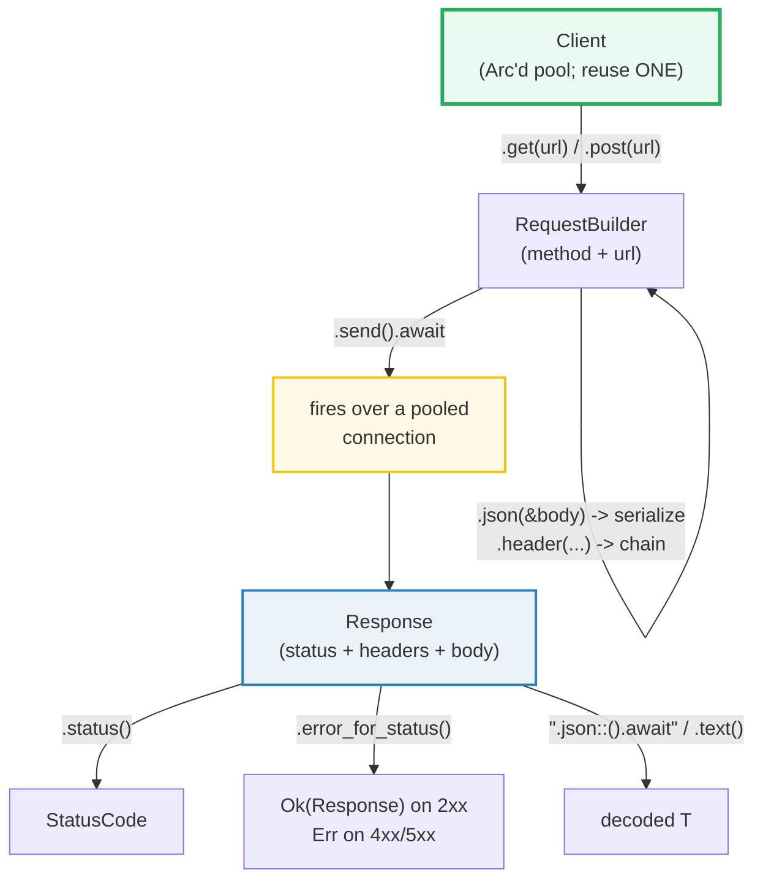
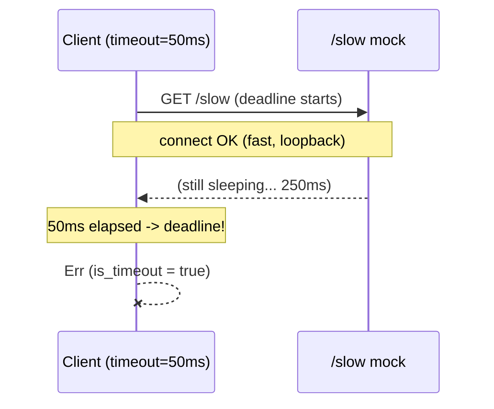

# REQWEST_CLIENT — The Async HTTP Client: Pooled Client, Typed Bodies, Timeouts, Retry

> **One-line goal:** `reqwest::Client` is a **connection-pooled async HTTP
> client** — you build **one**, reuse it, drive typed `get`/`post` request
> builders to a `Response`, and decode the body with serde; the production rules
> are **always set a `timeout`**, turn 4xx/5xx into errors with
> `error_for_status`, and retry transient failures.
>
> **Run:** `just run reqwest_client` (== `cargo run --bin reqwest_client`)
> **Member:** `web` (deps: axum 0.8, serde, serde_json, tokio, reqwest, tower, http).
> **Prerequisites:** 🔗 [TOKIO_RUNTIME](../async/TOKIO_RUNTIME.md) — `reqwest` is
> async; its futures need a tokio executor (and tokio timer for timeouts);
> 🔗 [SERDE_BASICS](../serde/SERDE_BASICS.md) — `.json::<T>()` is serde
> deserialization behind the client; 🔗 [AXUM_BASICS](./AXUM_BASICS.md) — the
> *server* side; this bundle's mock is a one-route axum `Router`.
> **Ground truth:** [`reqwest_client.rs`](./reqwest_client.rs); captured stdout:
> [`reqwest_client_output.txt`](./reqwest_client_output.txt).
>
> **Offline by design:** every request goes to an in-process **axum mock served
> on `127.0.0.1:0`** (loopback; the OS picks a free port that we **never print**
> — a random port would make `_output.txt` non-reproducible). No external network
> is touched. Statuses/bodies are fixed, so output is byte-reproducible.

---

## Why this exists (lineage)

[AXUM_BASICS](./AXUM_BASICS.md) answers "how do I *serve* HTTP?". This bundle
answers the other half: **how do I *call* HTTP from async Rust?** The two halves
meet over the same `http` crate types (`StatusCode`, `Method`, `HeaderMap`) —
axum produces them, reqwest consumes them — which is exactly why this bundle's
mock *is* an axum `Router`.

A production HTTP client has to answer four questions, and reqwest's answer to
each is a **type**:

| Question | curl / hand-rolled | reqwest |
|---|---|---|
| How do I reuse connections? | nothing (new socket each call) | **`Client`** — holds a connection **pool** wrapped in an `Arc`; reuse one |
| How do I read a typed body? | `resp.text()`, parse by hand | **`.json::<T>()`** — serde deserialization, `T: DeserializeOwned` |
| How do I avoid hanging forever? | `setopt(TIMEOUT)` | **`ClientBuilder::timeout(Duration)`** — a total deadline (default: **none**) |
| How do I treat 5xx as errors? | check `>= 400` by hand | **`error_for_status()`** — turns any 4xx/5xx `Response` into an `Err` |

reqwest sits on **hyper** (the HTTP/1+2 engine) and **tokio** (the async
runtime). A `Client` is a cheap handle — `Clone` is an `Arc` bump — that owns a
shared pool of keep-alive connections, so the cardinal rule is: **build one,
reuse it**.



---

## The five primitives (memorize these)

1. **`Client`** — a pooled handle. Build it **once** with `Client::builder()…build()`
   and **reuse** it. It is already `Arc`'d internally, so don't wrap it in your
   own `Arc`; `client.clone()` is a cheap pool-sharing clone.
2. **`Client::get(url)` / `.post(url)` …** — return a **`RequestBuilder`**. Chain
   `.json(&body)`, `.header(...)`, `.query(...)`, then **`.send().await`** →
   `Result<Response, Error>`.
3. **`Response`** — `.status() -> StatusCode`, `.text()`, `.bytes()`,
   `.json::<T>()` (serde), `.error_for_status()`. The **body is a stream consumed
   once**: call exactly one body method.
4. **`ClientBuilder::timeout(Duration)`** — a **total** deadline from the start
   of the connect until the response body is fully read. **Default is no
   timeout** — so always set one in production. Use `connect_timeout` /
   `read_timeout` for finer-grained control.
5. **`error_for_status()`** — turns a `Response` with a 4xx/5xx status into an
   `Err`, so the `?` operator propagates server errors just like transport
   errors. `.send()` alone is `Ok` for a 404 — the HTTP call succeeded.

---

## Section A — GET JSON: builder → send → Response → `.json::<T>()`

```rust
let resp = client.get(url).send().await?;     // RequestBuilder -> Response
let msg: Msg = resp.json().await?;            // body -> serde -> Msg
```

> **From reqwest_client.rs Section A:**
> ```
> ======================================================================
> SECTION A — GET JSON: builder -> send -> Response -> .json::<T>()
> ======================================================================
>   // `Client::get(url)` returns a RequestBuilder; `.send().await` fires
>   // it over the pooled connection and yields a `Response`; then
>   // `.json::<T>()` deserializes the body via serde_json.
>   let resp = client.get(url).send().await?;   // url = mock + "/json"
>   GET /json -> 200 OK  decoded msg.msg = "hi"
> [check] GET /json returns 200 OK: OK
> [check] deserialized struct field == "hi": OK
> ```

**What.** `Client::get(url)` returns a `RequestBuilder`; `.send().await` opens a
(pooled) connection, writes the request, reads the response head, and yields a
`Response`. Then `.json().await` reads the body fully and deserializes it into
`Msg` via serde_json — the two checks confirm the `200 OK` and that the decoded
`msg` field equals `"hi"`.

**Why (internals).**
- **`send()` is the boundary between builder and future.** `RequestBuilder`
  only *accumulates* configuration (method, url, headers, body); it sends
  nothing until `.send()`. That method returns `impl Future<Output =
  Result<Response, Error>>`. The `Result` is an `Err` only for a *transport*
  failure (DNS, connect, TLS, a redirect loop) — **not** for an HTTP 4xx/5xx;
  those are successful HTTP responses (Section C).
- **`.json::<T>()` requires `T: DeserializeOwned`.** It buffers the entire body
  then calls `serde_json::from_slice`. That is why it owns the `Response`
  (`self`, not `&self`) and why you can call it exactly **once** — the body
  stream is consumed. The `json` cargo feature must be enabled (the `web` member
  has `reqwest = { features = ["json"] }`); without it `.json()` does not exist.
- **The pool is why `Client` is reused.** Each `send()` checks the connection
  pool for a keep-alive connection to the host and reuses it, amortizing the TCP
  + TLS handshake. Building a `Client` per request forfeits this (see pitfalls).

🔗 [SERDE_BASICS](../serde/SERDE_BASICS.md) — `DeserializeOwned` is "deserialize
from a fully-owned buffer"; `.json::<T>()` is `serde_json::from_slice` in a trench
coat.

---

## Section B — POST JSON: `.json(&payload)` serializes; the mock echoes

```rust
let resp = client.post(url).json(&payload).send().await?;
let echoed: Echo = resp.json().await?;
```

> **From reqwest_client.rs Section B:**
> ```
> ======================================================================
> SECTION B — POST JSON: .json(&payload) serializes; mock echoes; decode
> ======================================================================
>   // `.json(&body)` serializes any serde::Serialize type AND sets the
>   // `Content-Type: application/json` header for you.
>   let resp = client.post(url).json(&payload).send().await?;
>   POST /echo {name:"widget",qty:7} -> 200 OK  echoed name="widget" qty=7
> [check] POST /echo returns 200 OK: OK
> [check] echoed payload name == "widget": OK
> [check] echoed payload qty == 7: OK
> ```

**What.** `RequestBuilder::json(&self, body: &T)` where `T: Serialize` does two
things at once: it serializes `body` to JSON **and** sets
`Content-Type: application/json`. The mock's `/echo` handler deserializes the
body into `Echo` (an axum extractor) and returns it back as JSON, so the whole
trip is `Echo → JSON → wire → JSON → Echo` — a serde round-trip through reqwest
on both ends. The three checks confirm the status and that `name`/`qty` survived.

**Why (internals).**
- **`.json()` on the builder takes `&T`, on the response takes `self`.** The
  asymmetry is ownership: serializing the request body borrows `&payload` (you
  keep it), but deserializing the response **consumes** the `Response` (the body
  is read once and discarded).
- **`Content-Type` follows from the method you call.** `.json(..)` sets
  `application/json`; `.body(..)`/`.form(..)` set others. This mirrors axum's
  "the return type is the content type" rule (🔗 [AXUM_BASICS](./AXUM_BASICS.md)
  Section E) — the two crates agree because they share the `http` types.

---

## Section C — `status()` + `error_for_status()`: 4xx/5xx become `Err`

```rust
let resp = client.get(url).send().await?;   // Ok even for a 404
let status = resp.status();                 // 404 Not Found
resp.error_for_status()?;                    // Err on 4xx/5xx
```

> **From reqwest_client.rs Section C:**
> ```
> ======================================================================
> SECTION C — status + error_for_status: 4xx/5xx become Err
> ======================================================================
>   // `.send()` is Ok for a 404 too — the HTTP call itself succeeded;
>   // the error is encoded in `Response::status()`. `.error_for_status()`
>   // converts any 4xx/5xx into an `Err` so the `?` operator propagates it.
>   let res = client.get(url).send().await?.error_for_status();
>   GET /missing -> 404 Not Found  (send() is Ok; the 404 is in the status)
> [check] GET /missing returns 404 Not Found: OK
>   resp.error_for_status() -> Err
> [check] error_for_status() turns a 404 Response into an Err: OK
> ```

**What.** A `GET /missing` comes back as a `404`, yet `.send()` is `Ok` — the
HTTP transaction succeeded; the server's verdict lives in `Response::status()`.
The first check pins that status. Then `error_for_status()` converts that `404`
`Response` into an `Err`, which the second check confirms. This is the line that
turns "the server said no" into a Rust `Result` the `?` operator can propagate.

**Why (internals).**
- **Two failure modes, deliberately separate.** A *transport* failure (cannot
  connect, TLS error, timeout) is an `Err` from `.send()`. An *application*
  failure (404, 500) is a successful `Response` with a non-2xx status. Forcing
  both into `Err` would lose the response body/headers — and on a 4xx you often
  want to *read* the body (the error details). So reqwest gives you the
  `Response` and lets **you** decide, via `error_for_status()`, when to escalate.
- **`error_for_status` covers 400–599.** The docs example states the returned
  error's `status()` "could be any status between 400...599". The sibling
  `error_for_status_ref(&self)` does the same without consuming the `Response`
  (useful when you want to read the body *and* decide).
- **The idiomatic chain is `send().await?.error_for_status()?`** — one `?` for
  transport, the next for application status. Both then funnel through a single
  error path.

🔗 [ERROR_HANDLING](../core/ERROR_HANDLING.md) — `?` and `Result` propagation;
`error_for_status()` is how HTTP errors join that pipeline.

---

## Section D — `ClientBuilder::timeout`: the #1 production rule

```rust
// The DEFAULT Client has NO timeout — always set one.
let client = Client::builder()
    .timeout(Duration::from_secs(30))
    .build()?;
```

> **From reqwest_client.rs Section D:**
> ```
> ======================================================================
> SECTION D — ClientBuilder::timeout: the #1 production rule (always set one)
> ======================================================================
>   // The DEFAULT Client has NO timeout (docs: "Default is no timeout").
>   // In production ALWAYS set one via the builder — a hung server would
>   // otherwise hang your caller forever. The timeout is TOTAL: from the
>   // start of the connect until the response body is fully read.
>   Client::builder().timeout(1s) -> GET /json -> 200 OK
> [check] a 1s timeout does not fire against an instant response: OK
>   Client::builder().timeout(50ms) -> GET /slow -> Err (is_timeout=true)
> [check] a 50ms total timeout fires against a 250ms-slow server: OK
> [check] the timeout error reports is_timeout() == true: OK
> ```

**What.** Two checks pin the rule. (1) A client built with `timeout(1s)` against
an instant `/json` returns `200 OK` — the deadline never fires. (2) A client
built with `timeout(50ms)` against `/slow` (a mock that sleeps 250 ms) gets an
`Err` whose `Error::is_timeout()` is `true` — the deadline fires at ~50 ms while
the client is still waiting for response headers. Together they prove the timeout
is real and is a *deadline*, not just a connect cap.

**Why (internals).**
- **`timeout` is TOTAL, and the default is *none*.** The `ClientBuilder::timeout`
  docs are explicit: *"The timeout is applied from when the request starts
  connecting until the response body has finished. Also considered a total
  deadline. **Default is no timeout.**"* A `Client::new()` with no builder
  therefore has **no deadline at all** — a server that accepts the connection and
  never responds will hang your task forever. Setting a timeout is not optional
  in production; it is the single most important line.
- **`connect_timeout` vs `read_timeout` vs `timeout`.** `connect_timeout` caps
  only the TCP+TLS handshake (good for failing fast on an unreachable host);
  `read_timeout` caps *each* read and resets after a successful read (good for
  detecting a stalled streaming body whose size is unknown); `timeout` is the
  whole-transaction ceiling. For "did the whole call finish in time?" use
  `timeout`; for "is this *specific* phase stuck?" add the finer-grained ones.
- **`is_timeout()` classifies the error.** `reqwest::Error` carries kind
  predicates — `is_timeout()`, `is_connect()`, `is_request()`, `is_decode()`.
  Use them in a retry policy (Section E): you retry `is_connect()`/`is_timeout()`
  and most 5xx, but **never** a `is_decode()` or a 4xx.

> **Note on determinism.** Section D's outcome (Ok vs Err) is deterministic, not
> timing-dependent: `/slow` *always* sleeps longer than the impatient client's
> 50 ms deadline, so the timeout *always* fires; and `/json` *always* answers
> instantly, so a 1 s deadline never does. The wall-clock durations are never
> printed.



---

## Section E — A retry loop for transient (5xx) failures

```rust
// retry_transient: re-issue the request until 2xx or budget exhausted.
let outcome = retry_transient(3, || {
    let c = client.clone();
    let url = url.clone();
    async move { c.get(&url).send().await }
}).await;
```

> **From reqwest_client.rs Section E:**
> ```
> ======================================================================
> SECTION E — a retry loop: fail-twice-then-ok mock recovers on attempt 3
> ======================================================================
>   // The `/flaky` mock returns 503 for the first 2 calls, then 200.
>   // `retry_transient(3, ..)` re-issues the GET on any non-2xx until it
>   // either sees a success or exhausts the budget. The shared mock
>   // counter is the authoritative witness of how many calls happened.
>   retry_transient(3) on /flaky -> attempts=3, success=true, final_status=Some(200)
>   the mock saw 3 handler calls (one per attempt)
> [check] the flaky mock eventually recovered (success): OK
> [check] recovered after exactly 3 attempts: OK
> [check] final_status on success is 200 OK: OK
> [check] the mock counter agrees: 3 handler calls: OK
> ```

**What.** The `/flaky` mock returns `503` for its first two calls and `200` for
the third (a transiently failing upstream that recovers). `retry_transient(3,
..)` re-issues the `GET` on any non-2xx until it sees a success or burns the
3-attempt budget. The four checks pin that it recovered, that it took exactly 3
attempts, that the final status was `200`, and that the mock's authoritative
counter agrees (3 handler calls = 3 attempts).

**Why (internals).**
- **Retry on *transient* failures only.** A correct policy retries `5xx` and
  transport errors (the server is probably temporarily broken) and *never*
  retries `4xx` (the request itself is wrong — retrying is futile and can
  amplify a bad request). This bundle's `retry_transient` keys on
  `!resp.status().is_success()` for simplicity; a production version checks
  `status.is_server_error() || err.is_connect() || err.is_timeout()`.
- **Backoff is mandatory.** Retrying instantly in a tight loop hammers a
  struggling server (the "thundering herd"). The helper sleeps a fixed tiny
  interval between attempts for determinism; real systems use **exponential
  backoff with jitter** so retries spread out and don't synchronize.
- **The closure clones the `Client` and the URL per call.** `retry_transient`
  takes `F: Fn() -> Fut` — a closure callable many times, each returning a fresh
  future. Because `async move` *moves* its captures, each call must produce its
  own owned `Client` clone (cheap — `Arc` bump) and `String`; borrowing would
  move the borrow out of the reusable `Fn` closure. This is the standard
  "factory of futures" pattern for retry loops.
- **reqwest now ships a built-in retry policy** — `ClientBuilder::retry(Builder)`
  (added in 0.12.4) configures idempotent retries of connection/protocol NACKs
  without a manual loop. The manual helper here is for teaching the mechanism;
  reach for the built-in first in production.

🔗 The Go sibling [RESILIENCE_PATTERNS](../../go/RESILIENCE_PATTERNS.md) covers
the general retry/backoff/circuit-breaker family — the *policy* side of what
this section shows as *mechanism*.

---

## Section F — `Client` reuse: ONE pooled client across many calls

```rust
let shared = Client::builder().build()?;
let m1: Msg = shared.get(url1).send().await?.json().await?;   // call #1
let m2: Msg = shared.get(url2).send().await?.json().await?;   // call #2, same pool
let clone = shared.clone();   // cheap Arc bump; SHARES the pool
```

> **From reqwest_client.rs Section F:**
> ```
> ======================================================================
> SECTION F — Client reuse: ONE pooled client across many calls
> ======================================================================
>   // `Client` holds an internal connection pool wrapped in an `Arc`, so
>   // you should build ONE and reuse it (do NOT wrap it in your own Arc).
>   // Cloning a Client is cheap — it bumps the inner Arc and SHARES the pool.
>   call #1 -> 200 OK msg="hi"    call #2 -> 200 OK msg="hi"
> [check] a second call via the SAME client succeeds (200): OK
> [check] both calls via one client decoded msg == "hi": OK
> [check] Client::clone() shares the pool: a cloned client's call also succeeds: OK
> ```

**What.** One `Client` drives two sequential `GET /json` calls — both succeed and
both decode `msg == "hi"`. A `client.clone()` then drives a third call, also
`200`. The three checks prove a single client is reusable and that a clone is a
pool-sharing alias, not an independent client.

**Why (internals).**
- **`Client` is `Clone + Send + Sync` and internally `Arc`'d.** The docs state:
  *"The Client holds a connection pool internally… so it is advised that you
  create one and reuse it. You do not have to wrap the Client in an Rc or Arc to
  reuse it, because it already uses an Arc internally."* So `client.clone()`
  bumps the inner `Arc` and the clone **shares** the very same pool and config —
  exactly why a cloned client's call works against the same keep-alive
  connections.
- **A `Client` per request is an anti-pattern.** Each `Client::builder().build()`
  creates a *fresh* pool, so per-request clients never reuse connections — every
  call pays the full TCP/TLS handshake. The pool's `pool_idle_timeout` defaults
  to **90 s** and `pool_max_idle_per_host` to `usize::MAX`: the pool keeps idle
  connections warm precisely so the *next* call on the same `Client` reuses them.
- **Hand the `Client` through your app like shared state.** Store it in an
  `axum::State`, a `OnceLock`, or pass `&Client` down — it is the canonical
  "cheap to clone, cheap to share" resource. 🔗 [BOX_RC_ARC](../core/BOX_RC_ARC.md)
  for the `Arc` semantics under the hood.

---

## Pitfalls (the expert payoff)

| Trap | Symptom | Fix / why |
|---|---|---|
| **Default `Client` has no timeout** | a hung server hangs the task **forever** | `Client::new()`/`builder().build()` set **no** deadline (docs: "Default is no timeout"). Always `.timeout(Duration::from_secs(N))`. |
| **Forgetting `error_for_status()`** | a 404/500 is silently treated as success | `.send()` is `Ok` for any HTTP response including 4xx/5xx. Chain `.error_for_status()?` to turn server errors into `Err`. |
| **Calling a body method twice** | `error: use of moved value: resp` | The body is a stream consumed once. `.text()`/`.json()`/`.bytes()` take `self`. Read it exactly once; use `error_for_status_ref` if you must inspect status after. |
| **Reading status AFTER `.json()`** | borrow-of-moved-value | `.json()` consumes the `Response`. Capture `let s = resp.status();` *before* `resp.json().await`. |
| **A `Client` per request** | every call pays a fresh TCP/TLS handshake; no keep-alive | Build **one** `Client` and reuse it; the pool amortizes connections. Clone it (cheap `Arc` bump) to share. |
| **Wrapping `Client` in your own `Arc`/`Rc`** | needless indirection; clippy smell | `Client` is *already* `Arc`'d internally. Just `client.clone()`. |
| **`.json()` feature not enabled** | `method not found: json` | `.json()` needs the `json` cargo feature (`reqwest = { features = ["json"] }`). Likewise `stream`/`cookies`/`gzip` are feature-gated. |
| **`timeout` mistaken for connect-only** | the call still hangs mid-body | `timeout` is **total** (connect → body done). Use `connect_timeout` for the handshake phase, `read_timeout` for per-read stalls. |
| **Retrying a non-idempotent request** | duplicate side effects (double charge/write) | Retry only idempotent verbs (GET/HEAD/PUT/DELETE) and only transient classes (5xx, connect/timeout) — never 4xx. |
| **Retry with no backoff** | thundering herd on a struggling server | Add exponential backoff **with jitter**. The bundle's fixed 1 ms sleep is for determinism, not production. |
| **Using reqwest without a tokio runtime** | panic / future never resolves | reqwest futures need a `tokio` runtime with a **timer** (for timeouts). `#[tokio::main]` provides both; a bare `block_on` without a timer breaks `timeout`. |
| **Expecting `.json::<T>()` to validate status** | you decode a 500 error page as `T` | Decode **after** `error_for_status()`, or you'll try to serde-parse an HTML error page. |
| **`Client::new()` panicking** | process aborts if TLS backend/resolver fails | `Client::new()` panics on init failure; use `Client::builder().build()` and handle the `Result` in code that must not abort. |

---

## Cheat sheet

```rust
use reqwest::Client;
use std::time::Duration;

// 1. BUILD ONE CLIENT, REUSE IT. It is already Arc'd + pooled internally.
//    The DEFAULT has NO timeout — always set one (the #1 production rule).
let client = Client::builder()
    .timeout(Duration::from_secs(30))      // total deadline (connect -> body done)
    .connect_timeout(Duration::from_secs(3)) // handshake-only (optional, finer)
    .build()?;                              // Result<Client> (no panic vs Client::new)

// 2. GET -> Response -> decode. send() is Ok even for 4xx/5xx.
let u: User = client.get(url)
    .header("accept", "application/json")
    .send().await?                // Err = transport failure only
    .error_for_status()?          // Err = 4xx/5xx  (chain after send)
    .json().await?;               // consumes Response; T: DeserializeOwned

// 3. POST a Serialize body. .json(&t) sets Content-Type AND serializes.
//    NOTE: error_for_status() is NOT async (it returns Result<Response>).
client.post(url).json(&payload).send().await?.error_for_status()?;

// 4. INSPECT without consuming: .status(), .headers(); then ONE body method.
let status = resp.status();       // capture BEFORE .json()/.text() (they take self)
let text = resp.text().await?;    // OR .bytes() / .json::<T>() — exactly one

// 5. TIMEOUT classification: retry connect/timeout errors, NOT decode/4xx.
match client.get(url).send().await {
    Ok(r) => r.error_for_status(),           // 2xx Ok, 4xx/5xx Err (sync fn)
    Err(e) if e.is_timeout() || e.is_connect() => { /* transient: retry */ }
    Err(e) => Err(e),                        // permanent: bail
}

// 6. RETRY (manual, transient only). Per-call clone because async move captures.
async fn retry<F, Fut>(n: u32, f: F) -> Result<reqwest::Response, reqwest::Error>
where F: Fn() -> Fut, Fut: std::future::Future<Output = Result<reqwest::Response, reqwest::Error>> {
    for attempt in 1..=n {
        match f().await {
            Ok(r) if r.status().is_success() => return Ok(r),
            Ok(r) if attempt == n => return Ok(r), // give up, hand back last
            Err(e) if attempt == n => return Err(e),
            _ => tokio::time::sleep(Duration::from_millis(1 << attempt)).await,
        }
    }
    unreachable!()
}
// (Production: prefer the built-in ClientBuilder::retry(Builder).)
```

---

## Sources

Every claim above was web-verified in the official docs and reproduced by the
running `reqwest_client.rs` binary against an in-process axum mock.

- **reqwest `Client` docs** — `Client` *"holds a connection pool internally to
  improve performance by reusing connections… so it is advised that you create
  one and reuse it. You do not have to wrap the Client in an Rc or Arc to reuse
  it, because it already uses an Arc internally"*; `Client::new()` panics vs
  `builder().build()` returns `Result`; `get`/`post`/… return `RequestBuilder`;
  `Client` is `Clone + Send + Sync`:
  https://docs.rs/reqwest/latest/reqwest/struct.Client.html
- **reqwest `ClientBuilder` docs** — `timeout(Duration)` *"Enables a total
  request timeout… from when the request starts connecting until the response
  body has finished. **Default is no timeout.**"*; `connect_timeout` (default
  `None`, needs a tokio timer); `read_timeout`; `pool_idle_timeout` default
  **90 s**; `pool_max_idle_per_host` default `usize::MAX`; `retry(Builder)` for
  built-in retries:
  https://docs.rs/reqwest/latest/reqwest/struct.ClientBuilder.html
- **reqwest `Response` docs** — `status() -> StatusCode`; `text()`, `json::<T:
  DeserializeOwned>()` (json feature, consumes `self`, fails if not JSON or
  wrong type); `bytes()`; **`error_for_status(self) -> Result<Response>`**
  *"Turn a response into an error if the server returned an error… any status
  between 400...599"*; sibling `error_for_status_ref(&self)`:
  https://docs.rs/reqwest/latest/reqwest/struct.Response.html
- **axum 0.8 `serve` docs** — `serve(listener, make_service)` where `listener:
  Listener`; the canonical pattern `let listener =
  TcpListener::bind("0.0.0.0:3000").await?; axum::serve(listener, router).await?`
  used here on loopback (`127.0.0.1:0`) to host the in-process mock:
  https://docs.rs/axum/0.8/axum/fn.serve.html
- **axum 0.8 `Router`/`Json` (the mock)** — the server side of the client/server
  pair; `Json<T>` serialization and the `(StatusCode, …)`/`IntoResponse` rules
  the mock relies on are covered end-to-end in 🔗 [AXUM_BASICS](./AXUM_BASICS.md)
  and its sources.
- **reqwest `Error` kind predicates** — `is_timeout()`, `is_connect()`,
  `is_request()`, `is_decode()` for classifying failures in a retry policy:
  https://docs.rs/reqwest/latest/reqwest/struct.Error.html
