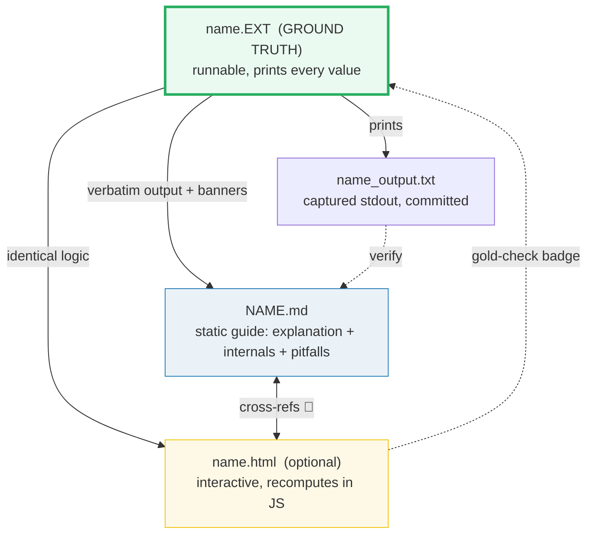
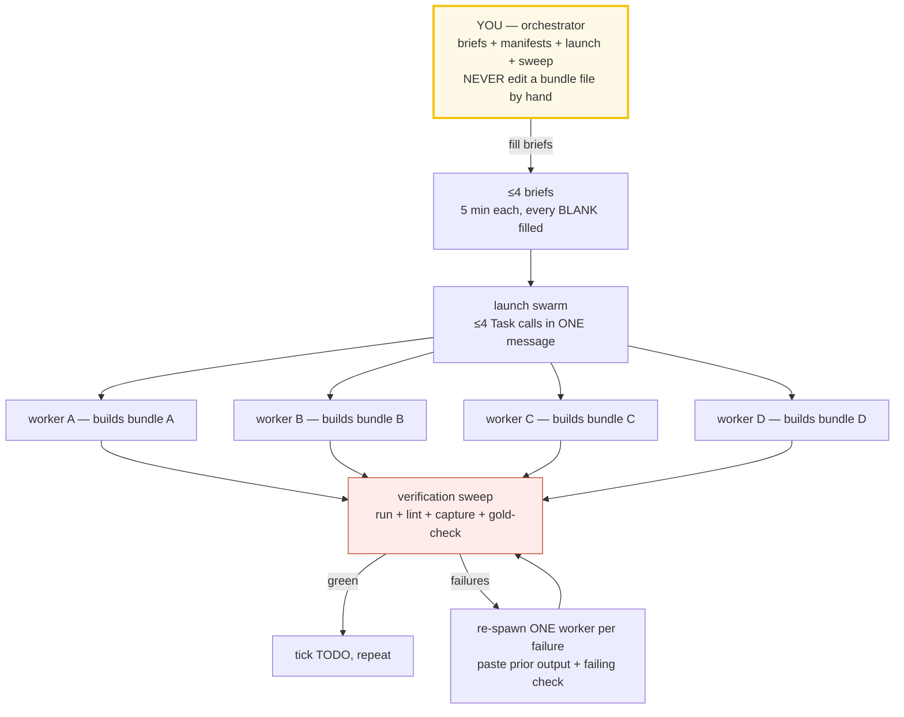
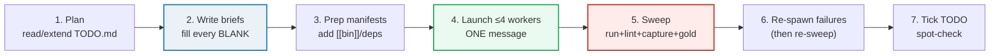

# concept-builder — the multi-agent "concept-as-a-bundle" workflow

> A complete, standalone guide. Any AI agent can read this and operate — no
> prior context about any specific repo required. Build verified learning
> material at scale: many concepts, each as rigorous as the first, produced by a
> subagent swarm you orchestrate.

## 0. What this is, in one paragraph

A **concept bundle** is a small set of files that teach ONE idea, where every
number, table, and claim is printed by a single runnable **ground-truth** file
(`.py`/`.go`/`.rs`/`.ts`/`.cpp`) and pasted *verbatim* into a static guide
(`.md`), with an optional interactive companion (`.html`) that recomputes the
same logic and proves it with a gold-check badge. You never hand-compute, never
trust prose alone. To build **many** bundles without quality drift, you act as
an **orchestrator**: you write tight per-concept "briefs", launch up to 4
**worker** subagents in parallel (each owns one bundle's disjoint files), then
run a **verification sweep** that catches every silent failure. Your judgment
lives in 5-minute briefs, not 50-minute hand-writes.

---

## 1. The philosophy — why this discipline exists

Three problems plague "learning material written by an AI in one long session":

1. **Unfalsifiable claims.** Prose says "the borrow checker does X" or "this
   loop runs in O(n)". A reader can't verify it without re-deriving everything.
   **Fix:** every claim is printed by a runnable file. Anyone executes it and
   sees the exact output. No "trust me" math.
2. **Quality drift.** Hand-build 20 things in one context and the 20th is sloppy
   — the model's attention is spread thin, later items get less care.
   **Fix:** each bundle is built by a worker with a *fresh* context, so bundle
   #50 is as rigorous as #1.
3. **Inconsistency.** Different sessions invent different structures, palettes,
   callout formats. **Fix:** every worker gets the *same* constant prompt
   preamble; only the per-concept brief varies. Uniformity for free.

The result is material that is **falsifiable, uniform, and ages well** — a
zero-dep runnable + a committed `_output.txt` + a static `.md` will still make
sense in 5 years; a 47-cell notebook won't.

---

## 2. The one rule

> **Every concept is a set of files that cite each other, all deriving from ONE
> runnable ground-truth file. Nothing is ever hand-computed.**

If a number appears in a `.md` or `.html`, it was either printed by the runnable
file or recomputed with the *identical* formula and spot-checked against it.



### A bundle's files

```
{name}.{py|go|rs|ts|cpp}     ← GROUND TRUTH — the single source of truth
{name}_output.txt            ← captured stdout (committed; re-derivable without running)
{name}_reference.txt         ← web provenance log from Step 2 (URLs + what each verifies)
{NAME}.md                    ← static guide; output pasted under "> From name.EXT Section X:" callouts
{name}.html                  ← (interactive flavor only) recomputes in JS, gold-checked
```

**Naming:** runnable + `_output.txt` → `lower_snake_case` (e.g. `ownership.rs`);
`.md` → `UPPER_SNAKE_CASE` (e.g. `OWNERSHIP.md`). One stem per concept; all
files share it so cross-links are obvious.

---

## 3. A concrete worked example (read this first)

Concept: "how integer overflow behaves." Ground-truth `overflow.py`:

```python
BANNER = "=" * 60
def banner(t): print(f"\n{BANNER}\nSECTION {t}\n{BANNER}")
def check(desc, ok):
    if not ok: raise SystemExit(f"FAIL: {desc}")
    print(f"[check] {desc}: OK")

def section_a():
    banner("A: wrapping vs Python")
    print(f"  (1<<32) - 1     = {(1<<32)-1}")
    print(f"  fixed-width wrap = {(1<<32)-1 + 1 & 0xFFFFFFFF}")  # 0
    check("32-bit wrap of 0xFFFFFFFF + 1 == 0", (((1<<32)-1)+1 & 0xFFFFFFFF) == 0)

if __name__ == "__main__":
    section_a()
    banner("DONE")
```

Run → `python3 overflow.py > overflow_output.txt 2>/dev/null`. The guide
`OVERFLOW.md` then pastes the output **verbatim** under a callout:

```markdown
> From overflow.py Section A:
> ```
>   (1<<32) - 1     = 4294967295
>   fixed-width wrap = 0
> [check] 32-bit wrap of 0xFFFFFFFF + 1 == 0: OK
> ```
```

The interactive `overflow.html` (if you build one) recomputes `((1<<32)-1)+1 & 0xFFFFFFFF`
in JS and shows `[check: OK]` green when it equals `0` — the same value the `.py`
pinned. That cross-file agreement is the whole trust model, made visible.

---

## 4. The two flavors — interactive vs non-interactive

Both follow the **same** orchestrator + worker discipline. The only difference
is whether a 4th file (`.html`) is produced.

| | **Non-interactive (runnable-only)** | **Interactive (with `.html`)** |
|---|---|---|
| Files | runnable + `_output.txt` + `_reference.txt` + `.md` | + `name.html` |
| Interactive artifact | the runnable file itself — reader opens, edits, watches output change | a dark-palette `.html` with sliders/steppers that recomputes live |
| When to choose | deep language/systems concepts where *running the code* is the point (Go, Rust, Python, TS, C++ language curricula) | interview patterns, system design, analytics — where a visual "aha" beats static text |
| Extra rule | none | `.html` must be single-file zero-dep, gold-checked against a known runnable value |
| Gold-check | (n/a — the runnable IS the truth) | recompute a value in JS, `diff` against `_output.txt`, show `[check: OK/FAIL]` badge |

> **The `.html` is never the source of truth.** It recomputes with the identical
> formula and is verified against the runnable. If they disagree, the `.html` is
> wrong, not the runnable.

---

## 5. The orchestrator + worker model



- **You (orchestrator)** do NOT write bundle code. You: (a) write per-concept
  briefs, (b) prep manifests/`[[bin]]`/deps between batches (workers can't touch
  them), (c) launch ≤4 workers in ONE message, (d) run the sweep, (e) re-spawn
  failures, (f) tick the master TODO.
- **Each worker** owns exactly ONE bundle (its disjoint files) and follows the
  constant preamble to the letter. It is forbidden from touching any other
  bundle, any manifest, the tooling, or the guides.
- **Judgment is front-loaded** into briefs; execution is hands-off. Workers
  self-resolve facts via mandatory web search and surface un-resolvable
  uncertainty only in their *final* report.

---

## 6. The workflow, step by step



1. **Plan.** Read or extend the section's `TODO.md` (the phase-by-phase build
   list). Decide which ≤4 bundles to build next.
2. **Write briefs.** For each bundle, fill every `{BLANK}` field (see
   `brief_checklist.md`). This is the ONLY place you "think hard". 5 min each.
3. **Prep manifests** (language-dependent). Rust: add `[[bin]]` entries to the
   member `Cargo.toml`. Go: ensure `go.mod` has the phase's deps. TS: ensure the
   pnpm member + `package.json`. Python/`.html`-family: usually none. Workers
   cannot edit manifests.
4. **Launch.** Send up to 4 worker `Task` calls in ONE message (the constant
   preamble + each brief). Parallel + disjoint ownership = safe concurrency.
5. **Sweep.** Run `just sweep` (or the equivalent loop) after the batch returns:
   run every file, count `[check] OK`, lint/format/typecheck, confirm
   `_output.txt` present + byte-identical on re-run, and `_reference.txt` present
   with >=2 URLs each carrying a "Verifies:" line.
6. **Re-spawn failures.** One worker per failure. Paste its prior output + the
   exact failing check; ask it to fix ONLY that. Don't rewrite from scratch.
7. **Tick + spot-check.** Mark `TODO.md` done; open 2–3 `.md` files and confirm
   `> From … Section X:` callouts match `_output.txt` byte-for-byte.

---

## 7. The constant worker preamble

Every worker gets the **same** preamble; only the brief changes. This is what
keeps bundles uniform. The full copy-paste template is in
[`worker_prompt_template.md`](./worker_prompt_template.md). Its spine:

```
STEP 0  Absorb the workflow  → read HOW_TO_RESEARCH.md + study the style anchor bundle
STEP 1  Mine the source      → quote real code/signatures, never paraphrase
STEP 2  Web-search (MANDATORY) → verify every fact in ≥2 sources; log URLs in ## Sources
        build                 → under the HARD RULES (determinism, lint, verbatim callouts)
        self-verify           → run + capture + lint + gold-check
        report back           → paths, [check] count, URLs, any unverifiable fact
```

**Step 2 is non-skippable.** Workers never guess a formula/signature/version —
they search official docs + ≥1 other authoritative source and cite every URL. If
a fact can't be verified, they flag it in the final report (never hide it).

---

## 8. Filling the brief — the `{BLANK}` fields

Each brief is the constant preamble + a per-concept block. The fields (with
examples) live in [`brief_checklist.md`](./brief_checklist.md). The essential
ones:

- `{CITE_SOURCES}` — real docs refs to mine (not paraphrases).
- `{WEB_ANCHORS}` — official doc URL + a search phrase to start Step 2.
- `{ANCHOR_CONCEPTS}` — the exact behaviors/signatures to verify & assert.
- `{PINNED_VALUE}` — a concrete output the runnable MUST print (sanity anchor).
- `{SECTION_LIST}` — suggested teachable points (A/B/C/D).
- `{SIBLING_LINKS}` — which 🔗 bundles to reference, each with a one-line why.
- `{MODEL_BUNDLES}` — 1–2 already-shipped bundles to copy style from.

**Rule of thumb:** if you can't fill `{ANCHOR_CONCEPTS}` and `{PINNED_VALUE}`,
you don't understand the concept well enough to delegate it — research it first.

---

## 9. Coordination / safety rules (what makes the swarm safe)

1. **Disjoint file ownership.** Each worker writes only its own stem's files.
   State exact paths; forbid edits everywhere else. → safe parallel writes, no
   merge conflicts.
2. **No manifest edits by workers.** All `Cargo.toml` / `go.mod` /
   `package.json` / `pyproject.toml` / `tsconfig.json` / the `Justfile` /
   `scripts/` are read-only to workers. The orchestrator adds deps/`[[bin]]`
   between batches.
3. **Max 4 workers per batch.** All `Task` calls in ONE message. Sweep, then the
   next 4. Small batches = observable, recoverable failures.
4. **One concept per worker.** Never two (context splits, both degrade). A huge
   concept is still one worker with a richer brief.
5. **The brief + the sweep are non-negotiable.** Vague brief → worker guesses.
   Skip the sweep → silent bugs ship.

---

## 10. Determinism hard rules (or `_output.txt` won't reproduce)

These are the recurring traps across all languages. Cite them when re-spawning a
worker whose output drifted:

| Trap | Fix |
|---|---|
| Map/unordered iteration randomized (Go, Rust, C++ `unordered_map`, JS int-keys) | collect keys into an array, **sort**, then print (or use ordered `BTreeMap`/`Map`) |
| Thread/goroutine/async output interleaving | collect into a container (Mutex/channel), **sort**, print from `main` after all join |
| Unseeded RNG | fixed seed only — `math/rand/v2` seed, `mt19937(42)`, fixed-seed LCG, `mulberry32(seed)` |
| Wall-clock as a printed value | NEVER `time.Now()`/`Date.now()`/`system_clock::now()` for a verified number; fixed durations only |
| Raw pointer address printed | assert structural facts (equality/length/capacity), never the address (ASLR) |
| Float drift | print to fixed precision (`.toFixed` / `%.6f`); never `-ffast-math` |

**No raw `assert()` for output invariants** — use a `check(desc, ok)` helper
that prints `[check] desc: OK` and panics/exits non-zero on failure, so the
sweep flags it. (Plain `assert` is compiled out under `-DNDEBUG`/`-O2` in some
setups — unreliable as a gate.)

---

## 11. The gold-check (interactive flavor only)

The `.html` proves it recomputes the same truth as the runnable:

1. Pick one concrete value the runnable prints (the "gold value").
2. In the `.html`'s `<script>`, recompute it with the **identical** formula.
3. Compare; show a badge: `[check: OK]` (green) or `[check: FAIL]` (red).
4. `node --check` the extracted `<script>` before shipping (must pass).

If the badge is red, the JS drifted from the runnable — copy the runnable's
formula verbatim into JS.

---

## 12. The `.md` authoring conventions (the "expert depth" rule)

A junior tutorial stops at syntax. This discipline's bar is higher. Every `.md`
must answer three layers:

1. **What** — the syntax/API + a runnable worked example.
2. **Why** — the mechanism beneath it (internals: the borrow checker, the GMP
   scheduler, the GIL, the event loop, RAII/move, UB…).
3. **Gotchas** — the silent-bug traps that separate juniors from experts.

Structure (copy a style anchor): header block (one-line goal + run cmd +
prerequisites) → lineage/why → ≥1 mermaid diagram → `> From name.EXT Section X:`
verbatim callouts → the "why/internals" section → 🔗 cross-refs (each with a
one-line *why*) → **pitfalls table** (trap | symptom | fix) → cheat sheet →
`## Sources` (web-verified URLs).

**Diagrams — prefer mermaid.** Every `.md` uses [mermaid](https://mermaid.js.org)
(```mermaid fenced blocks) for ALL diagrams — architecture, data flow, decision
trees, state machines, class diagrams, the cross-bundle learning spine. Do NOT
use ASCII art, embedded PNG/SVG images, or external draw.io links.

Why mermaid is the only choice here:

- **Renders natively** on GitHub, GitLab, and most markdown viewers — no build
  step, no plugin, no click-through.
- **It's text** — version-controlled, diffable, and stays in sync with the guide
  as the concept evolves (an image drifts silently; mermaid can't).
- **Zero-dep consistency** — matches the same "nothing external, ages well"
  philosophy as the zero-dep `.html` and the committed `_output.txt`.
- **Contrast builds understanding** — a mermaid diagram is how you make the
  *dynamic* structure visible (a pipeline, an ownership flow, a happens-before
  chain) that a static table can't show. That's the whole point of the diagram.

Each guide should carry **at least one** mermaid diagram (more where the concept
is dynamic). Suggest the diagrams up front in the brief's `{MERMAID_IDEAS}`
field so the worker knows what to draw.

**The pitfalls table is non-negotiable** — it is the "expert payoff." Re-spawn
any worker that ships a `.md` without one.

---

## 13. Cross-referencing convention

The point is **contrast to build understanding.** Be explicit:

- 🔗 in a `.md` = a cross-reference to a related bundle.
- Always state *why* the link matters in one line, e.g.
  "🔗 [LIFETIMES](./LIFETIMES.md) — you can't understand a move until you see
  that a reference is a *permission to use without owning*."

Wire a **spine** of cross-refs so the bundles form a learning path (e.g.
ownership → borrowing → lifetimes → traits → smart pointers → threads → async).
That chain *is* the expertise.

---

## 14. Verification discipline (the sweep)

Workers self-verify, but you **independently** re-check the whole batch. A
minimal sweep loop (adapt per language):

```bash
cd {SECTION}
for name in {batch_stems}; do
  echo "===== $name ====="
  {run} "$name" >/tmp/$name.out 2>/tmp/$name.err && echo "  run: OK" || { echo "  run: FAIL"; cat /tmp/$name.err; }
  grep -c "\[check\]" /tmp/$name.out | xargs -I{} echo "  checks printed: {}"
  {lint} "$name" >/dev/null 2>&1 && echo "  lint: OK" || echo "  lint: FAIL"
  test -s "${name}_output.txt" && echo "  output.txt: present" || echo "  output.txt: MISSING"
  test -s "${name}_reference.txt" && echo "  reference.txt: present" || echo "  reference.txt: MISSING"
  # interactive flavor: node --check the extracted <script>
done
```

Then spot-check 2–3 `.md` callouts vs `_output.txt` byte-for-byte. For the
interactive flavor, open 1–2 `.html` in a browser and confirm `[check: OK]` is
green. The full failure→fix dispatch table is in `brief_checklist.md` §4.

---

## 15. Common failure modes (quick map)

| Symptom | Cause | Fix |
|---|---|---|
| compile/run fails | wrong API / signature / borrow-checker | re-spawn with correct `{ANCHOR_CONCEPTS}` + exact signature |
| lint/typecheck/warnings fail | unformatted / `any` leak / unused var | fix the cause; never suppress without justification in `.md` |
| `_output.txt` differs on re-run | nondeterminism (§10) | re-spawn citing the DETERMINISM rules |
| `[check]` count is 0 | worker skipped invariants | re-spawn: "add a `check(...)` for every invariant" |
| gold-check `[check: FAIL]` | JS formula drifted from runnable | re-spawn: copy runnable formula verbatim into JS |
| Numbers in `.md` ≠ `_output.txt` | worker hand-typed a table | regenerate, paste verbatim under callouts |
| No `_reference.txt` / `## Sources` | worker skipped web search | re-spawn, make Step 2 non-optional; require >=2 URLs with "Verifies:" lines |
| No pitfalls table | junior tutorial | re-spawn, cite the three-layer depth rule |
| Mermaid diagram doesn't render on GitHub | syntax not supported by GitHub's renderer (see §15.1) | run mermaid sweep, fix only broken blocks |

---

## 15.1 Mermaid diagram validation (non-negotiable for `.md` guides)

Mermaid diagrams that look fine in a local editor can silently break on GitHub.
**Always validate with the official CLI before shipping.**

### The three syntax patterns that break GitHub (verified by `mmdc`)

| Broken syntax | Why it breaks | Correct syntax |
|---|---|---|
| `A -.label.> B` or `A -.label.-> B` | Dotted-arrow-with-inline-label is not supported by GitHub's mermaid renderer | `A -.->\|label\| B` |
| `A -->\|text (with parens)\| B` | Unquoted `()` in edge labels close node shapes early | `A -->\|"text (with parens)"\| B` |
| `A -->\|GET /{key}\| B` | Unquoted `{}` in edge labels look like diamond/decision nodes | `A -->\|"GET /{key}"\| B` |

### Validation procedure

1. **Extract + render every mermaid block with `@mermaid-js/mermaid-cli`:**

```bash
# Validate all mermaid blocks in a section (sequential, ~2s per block)
python3 -c "
import re
from pathlib import Path
for md in sorted(Path('SECTION').rglob('*.md')):
    text = md.read_text(errors='replace')
    for i, m in enumerate(re.finditer(r'\`\`\`mermaid\n(.*?)\`\`\`', text, re.S)):
        open(f'/tmp/block_{i}.mmd', 'w').write(m.group(1))
        import subprocess
        r = subprocess.run(['npx', '@mermaid-js/mermaid-cli', '-i', f'/tmp/block_{i}.mmd', '-o', f'/tmp/block_{i}.svg'], capture_output=True)
        if r.returncode != 0 or not Path(f'/tmp/block_{i}.svg').exists():
            print(f'FAIL: {md} block#{i}')
"
```

2. **For large repos, run in background with `nohup`** (mmdc starts a headless
   browser per block — ~2s each, so batch in background):

```bash
nohup bash skills/concept-builder/mermaid_validate.sh > /tmp/mermaid_results.txt 2>&1 &
```

The script is at `skills/concept-builder/mermaid_validate.sh` (bundled with
this skill). Copy it into any project that uses the concept-builder workflow.

3. **Fix ONLY the blocks that `mmdc` confirms as broken.** Do not touch working
   diagrams — patterns like `[("text")]` (DB/cylinder shape), `[text/with/slash]`
   (unquoted labels with `/`), and `subgraph Title` all render fine on GitHub
   even though they look unusual.

### Rules for workers

- **Always use `-.->|label|`** for dotted arrows with labels. Never use
  `-.label.>` or `-.label.->`.
- **Quote edge labels containing `()`, `{}`, or `/`**: `|"GET /{key}"|` not
  `|GET /{key}|`.
- **Do NOT over-quote**: `[("text")]` DB shapes, `["text/with/slash"]` node
  labels, and `|simple text|` edge labels all work fine unquoted. Only quote
  when the label contains characters that mermaid interprets as syntax (`()`,
  `{}`).

---

## 16. Project bootstrap from scratch (new learning repo)

To start a brand-new project with this discipline:

1. **Pick the flavor** — interactive (runnable + `.md` + `.html`) or
   non-interactive (runnable + `.md`). See §4.
2. **Pick the language + tooling.** A `Justfile` is the canonical interface
   (`run`/`out`/`check`/`sweep`/`new`/`fmt`). Use the right manifest per
   language (`go.mod`, `Cargo.toml` workspace, `package.json` pnpm member,
   `pyproject.toml` for uv).
3. **Lay out the repo:**
   ```
   {PROJECT_ROOT}/
   ├── HOW_TO_RESEARCH.md     ← per-bundle workflow (adapt from this skill)
   ├── SUBAGENTS_GUIDE.md     ← delegation mechanics (or fold into HOW_TO_RESEARCH)
   ├── TODO.md                ← the phase-by-phase bundle list
   ├── Justfile               ← run/out/check/sweep/new/fmt
   ├── {manifest}             ← go.mod / Cargo.toml / package.json / pyproject.toml
   ├── scripts/skeleton.EXT   ← the banner()/check() scaffold (see worker_prompt_template.md)
   └── {section}/             ← bundles live here, flat
       ├── name.EXT + name_output.txt + NAME.md (+ name.html)
       └── index.html         ← a dashboard listing all bundles (cards)
   ```
4. **Write the style anchor first** — the very first bundle, by hand or with a
   rich brief. It defines the house style (banner/check helpers, callout format,
   pitfalls columns). Every later worker copies it via `{MODEL_BUNDLES}`.
5. **Ship the dashboard** (`index.html`) + a root launcher card.
6. **Then delegate** the rest in batches of ≤4.

The skeleton file (banner + check helpers) for each language is in
`worker_prompt_template.md` §"Skeleton files" — copy it into `scripts/skeleton.EXT`.

---

## 17. Why this produces experts (not just users)

- **The runnable makes it falsifiable.** Anyone executes it and sees the exact
  output — including internals (`id()`, `-gcflags=-m`, `dis.dis()`, sanitizer
  diagnostics, goroutine stacks). No hand-waving.
- **The three-layer depth rule** forces every concept past syntax into mechanism
  and into the traps working engineers actually hit.
- **Subagent delegation keeps depth uniform** — bundle #50 is as deep as #1.
- **Cross-references force the big picture.** Linking `is`-vs-`==` to refcounting,
  refcounting to the GIL, the GIL to asyncio — that chain *is* expertise.

---

## 18. Files in this skill

- **[`worker_prompt_template.md`](./worker_prompt_template.md)** — the constant
  worker preamble (STEP 0–6) with `{BLANK}` placeholders + the language-knobs
  table + the `banner()`/`check()` skeleton per language + HTML-family additions.
  Copy, substitute, send.
- **[`brief_checklist.md`](./brief_checklist.md)** — the per-concept `{BLANK}`
  fields with examples, the orchestrator pre-flight checklist, the determinism
  hard rules with code, the failure→fix dispatch table, and a worked example.

---

## 19. The non-negotiables (if you remember nothing else)

1. **One ground-truth runnable per concept.** Everything else derives from it.
2. **Orchestrator never edits bundles by hand** — brief, launch, sweep, re-spawn.
3. **Max 4 workers per batch**, disjoint file ownership, no manifest edits by
   workers.
4. **The brief + the sweep are non-negotiable.** Front-load judgment; verify
   independently.
5. **Mandatory web search** in every worker; cite >=2 sources; log every URL into
   `{name}_reference.txt`; flag uncertainty.
6. **Determinism over everything** — sorted maps, serialized threads, seeded RNG,
   `check()` not `assert`.
7. **Every `.md` ends with a pitfalls table + cheat sheet + `## Sources`.**
