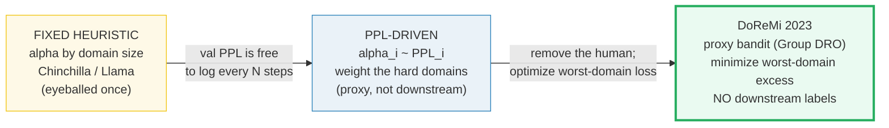
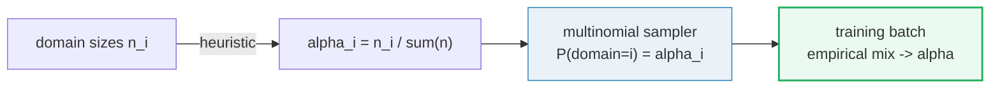
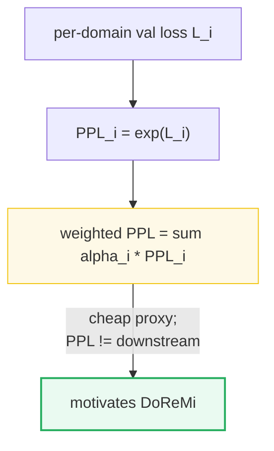
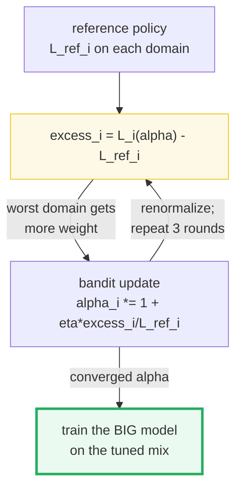
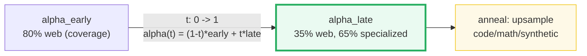
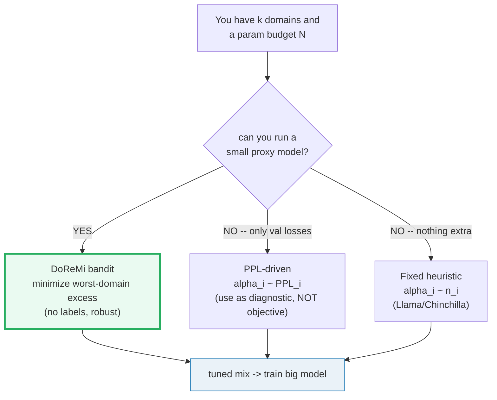
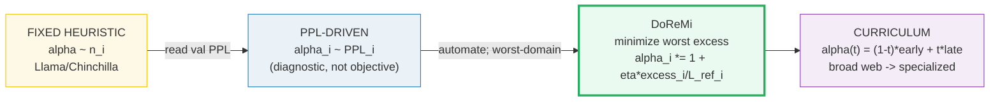

# Dataset Mixing for Small Models — Fixed Mix → PPL-Driven → DoReMi

> **Companion code:** [`dataset_mixing.py`](./dataset_mixing.py). **Every number in
> this guide is printed by `uv run python dataset_mixing.py`** — change the code,
> re-run, re-paste. Nothing here is hand-computed.
>
> **This is the Phase-2 mixer.** Once the data is *cleaned* (🔗
> [`MINHASH_DEDUP.md`](./MINHASH_DEDUP.md)) and the *synthetic* sources are
> *generated* (🔗 [`SYNTHETIC_CURATION.md`](./SYNTHETIC_CURATION.md)), the open
> question is **what ratio to blend them in**. That ratio — the weight vector
> `α = (α_web, α_code, α_synth, …)` — is as important as model scale: a 1.7B on
> a tuned mix beats a 3B on a bad one.
>
> **Live animation:** [`dataset_mixing.html`](./dataset_mixing.html) — drag the
> mix sliders, watch the weighted perplexity bar react; drag the curriculum
> timeline, watch the domain shares anneal over training.
>
> **Foundations:** 🔗 [`SCALING_LAWS.md`](./SCALING_LAWS.md) — the param budget
> `N` is fixed by the compute law; this bundle decides what *tokens* fill it.

---

## 0. TL;DR — the whole idea in one picture

> **The smoothie analogy (read this first):** a pretraining corpus is a smoothie
> — web text (watermelon, cheap and abundant), code (kale, bitter but builds
> reasoning), synthetic textbooks (protein powder, expensive and concentrated).
> The *ratio* of the blend decides whether the model grows strong or just full.
> Early chefs (Chinchilla, Llama) eyeballed the ratio from what was in the
> fridge. The perplexity-driven chef tastes each ingredient and rebalances
> toward the bland ones. **DoReMi** is the nutritionist: it runs a tiny
> *proxy* taste-test that provably minimizes the worst-ingredient deficiency,
> then hands the final recipe to the big chef — no guesswork, no labels.

A pretraining corpus is never one bucket. It is `k` domains `D₁…D_k` (web, code,
math, synthetic textbooks, …) blended by a weight vector `α = (α₁…α_k)` with
`Σα = 1`. The recipe for picking `α` improved three times, and each change
removed a layer of human guesswork:



| | Fixed heuristic | PPL-driven | **DoReMi** |
|---|---|---|---|
| **How `α` is set** | by domain size / intuition | `α_i ~ PPL_i` | minimize worst-domain excess |
| **Signal** | none (static) | validation loss | proxy bandit vs reference |
| **Needs labels?** | no | no | **no** |
| **Optimizes** | nothing (a guess) | average PPL (proxy) | **worst-domain** loss |
| **Example** | Llama (CC 67/C4 15/…) | SmolLM2 manual rebalance | DoReMi 280M→8B |
| **Cost** | cheapest | free (val is logged) | one cheap proxy run |

> **One plain sentence:** the field went from *guessing* the mix (Chinchilla,
> Llama), to *tasting* it with validation perplexity, to *automating* the whole
> search with a tiny proxy bandit (DoReMi) that provably cuts the worst-domain
> loss — and the mix matters enough that a tuned 1.7B beats an untuned 3B.

### Glossary (plain English — refer back any time)

| Term | Plain meaning |
|---|---|
| **Domain `D_i`** | One bucket of the corpus: web text, code, math, synthetic textbooks, books, … |
| **`α_i`** | Mixture weight of domain `i`; `Σα = 1`. The thing this bundle optimizes. |
| **`n_i`** | Size (tokens) of domain `i`. Heuristic mixes set `α_i ∝ n_i`. |
| **Perplexity `PPL_i`** | `exp(mean cross-entropy on domain i's val set)`. How badly the model predicts domain `i`. Lower = better. |
| **Weighted PPL** | `Σ α_i · PPL_i`. A single corpus-level perplexity proxy. |
| **`L_ref_i`** | Reference-policy loss on domain `i` — DoReMi's anchor ("the loss we'd expect"). |
| **Excess loss** | `L_i(α) − L_ref_i`. Positive = domain is *under-served* vs reference; DoReMi's reweighting signal. |
| **Curriculum `α(t)`** | Weights that *anneal* over training-fraction `t∈[0,1]`: broad web early, reasoning/code/synthetic late. |
| **Proxy model** | A small, cheap model (e.g. 280M) run to *find* `α`, which is then handed to the big target model. |

> 🔗 **If you only read one cross-reference:** the tokens this bundle mixes must
> first be *cleaned* — 🔗 [`MINHASH_DEDUP.md`](./MINHASH_DEDUP.md). Mixing ratios
> are meaningless on a corpus riddled with near-duplicates (one dup-heavy domain
> silently dominates). Dedup *first*, mix *second*.

---

## 1. Weighted sampling — Section A output

> **How `α` becomes a batch.** A training batch is filled by sampling each
> token's domain from a multinomial with probabilities `α`. By the law of large
> numbers the empirical batch mix converges to `α` as the batch grows — so a
> 2M-token batch reproduces the target weights to within 0.1%. This is the
> mechanism that turns a weight vector into actual gradient steps per domain.



> From `dataset_mixing.py` **Section A** — three toy domains (`web` 30k, `code`
> 8k, `synth` 2k shards), heuristic weights `α ∝ n_i`:
>
> | domain | `n_i` | heuristic `α_i` |
> |---|---|---|
> | code | 8000 | 0.2000 |
> | synth | 2000 | 0.0500 |
> | web | 30000 | 0.7500 |
>
> `sum(α) = 1.000000` ✓
>
> Seeded batches converge to `α` as they grow:
>
> | batch tokens | web | code | synth | empirical web | empirical code | empirical synth |
> |---|---|---|---|---|---|---|
> | 1000 | 727 | 233 | 40 | 0.7270 | 0.2330 | 0.0400 |
> | 10000 | 7522 | 1998 | 480 | 0.7522 | 0.1998 | 0.0480 |
> | 100000 | 75140 | 19852 | 5008 | 0.7514 | 0.1985 | 0.0501 |
> | **2000000** | 1500711 | 399651 | 99638 | **0.7504** | **0.1998** | **0.0498** |
>
> `[check] 2M-token batch matches heuristic weights within 1e-3: OK`
> `[check] heuristic weights sum to 1: OK`
> `[check] web is the largest domain in both size and weight: OK`

> One plain sentence: at 2M tokens the sampled mix is already within 0.1% of the
> target `α` — the sampler is faithful, so every later optimization of `α` is
> actually honored by the loader.

**The silent failure mode this prevents.** If you set `α_web = 0.75` but your
loader samples *without* honoring `α` (e.g. it iterates shards round-robin and
the web shard is 10× bigger), the *effective* mix drifts toward domain size and
your carefully-tuned `α` is ignored. The check above guarantees the sampler
honors the weights.

---

## 2. Perplexity per domain + weighted perplexity — Section B output (GOLD ANCHOR)

> **The free signal.** Validation cross-entropy is logged every `N` steps
> anyway, so per-domain perplexity `PPL_i = exp(L_i)` costs nothing to compute.
> The corpus-level **weighted perplexity** `Σ α_i · PPL_i` is the simplest
> objective a mixer can read. Its weakness: it is a *proxy* for downstream
> performance, and — as the table shows — moving mass onto a hard domain
> *raises* the weighted PPL even though it is the right thing to do. That proxy
> mismatch is exactly what motivates DoReMi (Section 3).



> From `dataset_mixing.py` **Section B** — toy losses `L = {web:2.3, code:1.8,
> synth:2.7}`, weights `α = {web:0.5, code:0.3, synth:0.2}`:
>
> | domain | `L_i` (loss) | `PPL_i = exp(L_i)` | `α_i` | `α_i · PPL_i` |
> |---|---|---|---|---|
> | code | 1.8000 | 6.0496 | 0.30 | 1.8149 |
> | synth | 2.7000 | 14.8797 | 0.20 | 2.9759 |
> | web | 2.3000 | 9.9742 | 0.50 | 4.9871 |
>
> ```
> GOLD PIN (dataset_mixing.html recomputes this identically):
>   weighted PPL = sum_i alpha_i * exp(L_i)
>                = 0.5*exp(2.3) + 0.3*exp(1.8) + 0.2*exp(2.7)
>                = 4.987091 + 1.814894 + 2.975946
>                = 9.777932
> ```
> `[check] GOLD weighted PPL == 9.777932 (within 1e-6): OK`
> `[check] PPL = exp(loss) is monotone in loss (synth highest): OK`

### Worked smallest-scale example

Take the three toy losses above (`web` 2.3, `code` 1.8, `synth` 2.7) and weights
`α = (0.5, 0.3, 0.2)`:
- `PPL_web = exp(2.3) = 9.974` — the model predicts web tokens with ~10-way
  uncertainty.
- `PPL_synth = exp(2.7) = 14.880` — worst domain (synthetic textbooks are hard).
- Weighted PPL `= 0.5·9.974 + 0.3·6.050 + 0.2·14.880 = 4.987 + 1.815 + 2.976
  = 9.778`.

Now the **PPL-driven** rebalance (`α_i ∝ PPL_i`, renormalized) shifts mass onto
the hard `synth` domain (0.20 → 0.48) — and the weighted PPL *goes up* to
**11.568**, not down. That is the key insight: **minimizing weighted PPL would
starve the hard domain**, which is backwards. You optimize PPL to *find* where
the model is weak, then deliberately spend more data there — you do not
greedily minimize the proxy.

> From `dataset_mixing.py` **Section B** (continued):
>
> PPL-driven weights (`α_i ~ PPL_i`, renormalized):
>
> | domain | `PPL_i` | `α_ppl` | was `α` |
> |---|---|---|---|
> | code | 6.050 | 0.1958 | 0.30 |
> | synth | 14.880 | 0.4815 | 0.20 |
> | web | 9.974 | 0.3228 | 0.50 |
>
> `weighted PPL under PPL-driven weights = 11.5679` (HIGHER — by design).
>
> `[check] PPL-driven weights upweight the highest-PPL domain (synth): OK`

> ⚠️ **The proxy trap:** a greedy "minimize weighted PPL" mixer would *downweight*
> the hard domain and report a great-looking number while the model gets worse on
> exactly the capability you cared about. Perplexity is a *diagnostic*, not the
> objective. That realization is what DoReMi fixes (next section).

---

## 3. DoReMi — minimize the worst-domain excess loss — Section C output

> **Remove the human.** DoReMi (Xie et al. 2023) trains a tiny **proxy** model,
> reads off a reference per-domain loss `L_ref`, then runs a **bandit** (Group
> DRO / minimax) that pushes `α` toward any domain whose current loss *exceeds*
> the reference prediction. The objective is the **worst-domain excess loss** —
> not the average — so no domain is left to rot. The proxy's final `α` is handed
> to the big target model. No downstream labels, no manual tuning, and on The
> Pile it improved perplexity on *every* domain (even the ones it downweighted)
> and reached baseline accuracy in **2.6× fewer steps**.



> From `dataset_mixing.py` **Section C** — reference `α⁰ = {web:0.5, code:0.3,
> synth:0.2}`, `L_ref = {web:2.3, code:1.8, synth:2.7}`, bandit starts from
> **uniform** `α = {1/3, 1/3, 1/3}`; loss model
> `L_i(α) = L_ref_i·(α⁰_i/α_i)^0.15`, step `η = 1.5`:
>
> | round | web α | code α | synth α | web excess | code excess | synth excess | **WORST excess** |
> |---|---|---|---|---|---|---|---|
> | 0 | 0.3333 | 0.3333 | 0.3333 | 0.1442 | −0.0282 | −0.1992 | **0.1442** |
> | 1 | 0.3696 | 0.3299 | 0.3005 | 0.1066 | −0.0255 | −0.1599 | **0.1066** |
> | 2 | 0.3985 | 0.3255 | 0.2760 | 0.0796 | −0.0219 | −0.1273 | **0.0796** |
> | 3 | 0.4212 | 0.3211 | 0.2577 | 0.0599 | −0.0183 | −0.1007 | **0.0599** |
>
> `[check] round-1 raises weight on highest-excess domain (web): OK`
> `[check] worst-domain excess strictly decreases across rounds 0->3: OK`
> `[check] DoReMi weights stay normalized to 1 at every round: OK`
> `[check] no domain is ever starved to < 1% weight: OK`

**Reading the table like a story:**

- **Round 0 (uniform):** `web` is under-served vs the reference → its excess is
  `+0.144` (the worst). `synth` is over-served → negative excess. The bandit's
  job: push mass onto `web`.
- **Round 1:** `web` weight jumps `0.333 → 0.370`; worst excess drops
  `0.144 → 0.107`. The single biggest move is exactly onto the worst domain.
- **Round 3:** worst excess is down to `0.060` (from `0.144`) — a **2.4×**
  reduction in three cheap rounds, and no domain was starved below 25%.

This is the whole DoReMi claim in miniature: a small proxy runs this loop,
ships the final `α` to the big model, and the big model trains on a mix that
provably cuts the worst-domain loss. (The real DoReMi uses a 280M proxy to set
the mix for an **8B** target — a 30× transfer.)

> 🔗 **Why this beats the PPL-driven mixer:** Section 2's greedy PPL minimization
> would *downweight* `web` (low PPL looks "good") and starve it. DoReMi instead
> asks "is this domain *worse than its reference*?" — which catches the
> under-served `web` even though its absolute PPL isn't the highest. The
> worst-domain objective is what makes it robust.

---

## 4. Curriculum + what shipped models actually mixed — Section D output

> **The mix is not constant.** Real SLM runs *anneal* `α` over training:
> broad web early (for coverage and world knowledge), then upsample
> code/math/synthetic late (for reasoning, once the basics are in place). SmolLM2
> is the textbook example — its stage-1 was ~90% web, while its stage-4 anneal
> was only 58% web with 42% specialized.



> From `dataset_mixing.py` **Section D** — curriculum
> `α(t) = (1−t)·α_early + t·α_late`, `α_early = {web:0.80, code:0.10, synth:0.10}`,
> `α_late = {web:0.35, code:0.30, synth:0.35}`:
>
> | training frac `t` | web | code | synth | note |
> |---|---|---|---|---|
> | 0.00 | 0.80 | 0.10 | 0.10 | broad web (coverage) |
> | 0.25 | 0.69 | 0.15 | 0.16 | |
> | 0.50 | 0.57 | 0.20 | 0.22 | |
> | 0.75 | 0.46 | 0.25 | 0.29 | |
> | 1.00 | 0.35 | 0.30 | 0.35 | reasoning/synth (anneal) |
>
> `[check] web share falls monotonically over the curriculum: OK`
> `[check] every alpha(t) stays normalized to 1: OK`

### What shipped models actually mixed

> **Theory meets the model zoo.** The mixes below are the *published* pretraining
> recipes — all web-verified in [`dataset_mixing_reference.txt`](./dataset_mixing_reference.txt).
>
> From `dataset_mixing.py` **Section D** (continued):
>
> | model | largest share | code % | books/synth % | source |
> |---|---|---|---|---|
> | **Llama-1** | web (CC+C4) 82.0% | 4.5 | 4.5 | Touvron 2023, arXiv:2302.13971 (CC 67 + C4 15) |
> | **Chinchilla** | web (MassiveWeb) 48.0% | 3.0 | 27.0 | Hoffmann 2022 / Rae 2021 MassiveText |
> | **SmolLM2** (stage-4 anneal) | web (FW-Edu+DCLM) 58.0% | 24.0 | 14.0 | Lozhkov 2025, arXiv:2502.02737 §4.5 |
>
> `[check] Llama web share (CC+C4) is the dominant component (~82%): OK`
> `[check] SmolLM2 stage-4 anneal upweights specialized to ~42% (vs ~10% stage-1): OK`

Two patterns jump out:

- **Llama / Chinchilla (fixed-heuristic era):** web dominates at 48–82%, code
  and books are small fixed garnishes. The mix is set once, by domain size, and
  never adapted to the model.
- **SmolLM2 (tuned + curriculum era):** the stage-4 *anneal* pushes specialized
  (code 24% + math 14% + synthetic 4% = **42%**) far above stage-1's ~10%. The
  mix *changes* over training and concentrates high-quality reasoning data at
  the end — exactly the `α(t)` schedule from the curriculum table above.

> ⚠️ **One correction worth flagging:** the original build brief cited a "SmolLM2
> ~48% FineWeb-Edu / 25% Python / 27% Cosmopedia" mix. Those numbers are the
> earlier **SmolLM v1** corpus proportions, *not* SmolLM2. The actual SmolLM2
> recipe is multi-stage; this bundle uses the **verified stage-4 annealing**
> shares (58/24/14/4) from the primary paper (arXiv:2502.02737 §4.5). Full
> provenance in [`dataset_mixing_reference.txt`](./dataset_mixing_reference.txt).

---

## 5. The decision recap — Section E output

> From `dataset_mixing.py` **Section E**:
>
> | strategy | how `α` is set | what it buys you | use when |
> |---|---|---|---|
> | Fixed heuristic | by domain size / intuition | cheapest; `α` is a static hyperparameter | Llama, Chinchilla era |
> | PPL-driven | `α_i ~ PPL_i` | free signal (val loss), adapts to the model | proxy only; PPL ≠ downstream |
> | **DoReMi bandit** | minimize worst-domain excess | no labels, no manual tuning, cuts worst-domain loss | **proxy → big-model transfer** |
>
> The single question that picks the row: **Can you afford a proxy run?** →
> DoReMi. **Only have val losses?** → PPL-driven. **Starting from scratch / no
> GPU?** → Fixed heuristic.



---

## 6. The why: three layers of depth

**What** (the mechanism): a mixer sets `α`, a seeded sampler turns `α` into
per-batch domain counts (Section 1), perplexity reads each domain's difficulty
(Section 2), DoReMi's bandit minimizes the worst-domain excess (Section 3), and
a curriculum anneals `α` over training (Section 4).

**Why-internals** (why each step beats the last):
- The fixed heuristic treats `α` as a *guess*. It works when the guess is good
  (Llama) but has no feedback loop — the model's actual difficulty per domain is
  ignored.
- The PPL-driven mixer *reads* the model's difficulty, but optimizing the
  *average* PPL is the wrong objective: it starves hard domains. Perplexity is a
  diagnostic, not a target.
- DoReMi optimizes the *worst-domain* excess against a reference, which is both
  feedback-driven (it reads the model) and robust (no domain is sacrificed). The
  proxy-to-target transfer works because domain *relative* difficulties are
  largely invariant across model sizes — a 280M proxy knows which domains an 8B
  will struggle with.

**Gotchas** (the killer ones — see the table below): over-weighting one domain
starves the rest; starting the curriculum too late wastes the broad-coverage
phase; and perplexity ≠ downstream — a domain can have low PPL and still hurt
benchmarks. DoReMi sidesteps the last one by never using PPL as the objective.

---

## 7. Pitfalls & debugging checklist

| # | Trap | Symptom | Fix |
|---|---|---|---|
| 1 | **Greedy-minimize weighted PPL** | The mixer downweights every hard domain, reports a great PPL, model gets worse on benchmarks | PPL is a *diagnostic*, not the objective. Upweight high-PPL domains (Section 2) or use DoReMi's worst-domain excess (Section 3). |
| 2 | **Over-weighting one domain starves the rest** | One benchmark spikes, others collapse (e.g. 90% code → great HumanEval, tanked MMLU) | Keep every `α_i ≥ ~5%`; DoReMi's no-starve property (`> 1%` always) guards this. |
| 3 | **Treating raw domain size as the mix** | Web (90% of tokens) drowns code/math; the model never learns reasoning | Set `α` *independently* of `n_i` (SmolLM2: web 58% despite being the biggest source). |
| 4 | **Starting the curriculum too late** | Broad-coverage phase is skipped; model memorizes specialized data without the basics | Anneal from `t=0`: broad web early, specialized late (Section 4 table). |
| 5 | **Perplexity ≠ downstream** | Val PPL keeps dropping but benchmark accuracy plateaus or falls | Don't select `α` on PPL alone; use held-out downstream tasks or DoReMi (no PPL objective). |
| 6 | **Sampler ignores `α`** | Effective mix drifts toward shard sizes despite your tuned weights | Verify the multinomial honors `α` (Section 1's 2M-token check). |
| 7 | **Citing SmolLM2 as "~48% FineWeb-Edu"** | Wrong; that's the SmolLM **v1** corpus, not SmolLM2 | SmolLM2 is multi-stage; stage-4 anneal = 58% web / 24% code / 14% math / 4% Cosmopedia (arXiv:2502.02737 §4.5). |
| 8 | **Quoting DoReMi as "supervised"** | It needs downstream labels — wrong | DoReMi is **unsupervised** (Group DRO over domains); on GLaM it even matched weights tuned *on* downstream tasks. |
| 9 | **Proxy ≠ target size** | "A 280M proxy can't set an 8B's mix" | It can and does — relative domain difficulties are size-invariant (DoReMi's 30× transfer). |
| 10 | **Mixing before dedup** | One dup-heavy domain silently dominates; ratios are meaningless | Dedup *first* (🔗 [`MINHASH_DEDUP.md`](./MINHASH_DEDUP.md)), mix *second*. |

---

## 8. Cheat sheet



- **The one identity:** `Σ α_i = 1`. Every mixer (heuristic, PPL, DoReMi,
  curriculum) must preserve this after each update.
- **Perplexity:** `PPL_i = exp(L_i)`. Weighted corpus PPL `= Σ α_i · PPL_i`.
- **Gold anchor:** for `L = {web:2.3, code:1.8, synth:2.7}` and
  `α = {0.5, 0.3, 0.2}`, weighted PPL `= 9.777932` (recomputed identically in
  [`dataset_mixing.html`](./dataset_mixing.html)).
- **PPL-driven:** `α_i ∝ PPL_i`, renormalized. Upweights hard domains — but
  *raises* weighted PPL (it is a diagnostic, not an objective).
- **DoReMi update:** `α_i ← α_i·(1 + η·excess_i/L_ref_i)`, renormalize, where
  `excess_i = L_i(α) − L_ref_i`. Cuts the worst-domain excess every round; no
  domain starved. 280M proxy → 8B target; +6.5% few-shot, 2.6× fewer steps.
- **Curriculum:** `α(t) = (1−t)·α_early + t·α_late`, `t ∈ [0,1]`. Broad web
  early → code/math/synthetic late (SmolLM2 stage-1 90% web → stage-4 58% web).
- **Real mixes:** Llama (web 82%, code 4.5%, books 4.5%); Chinchilla (web 48%,
  books 27%, C4 10%); SmolLM2 stage-4 (web 58%, code 24%, math 14%, synth 4%).
- **Decision rule:** *Can run a proxy?* → DoReMi. *Only have val losses?* →
  PPL-driven (as diagnostic). *Nothing?* → Fixed heuristic.

> 🔗 **Cross-references — where this mix plugs into the pipeline:**
> - 🔗 [`MINHASH_DEDUP.md`](./MINHASH_DEDUP.md) — clean, deduped sources make
>   the mix ratios *meaningful* (a dup-heavy domain would silently dominate).
>   Dedup first, mix second.
> - 🔗 [`SYNTHETIC_CURATION.md`](./SYNTHETIC_CURATION.md) — synthetic textbooks
>   (Cosmopedia-v2, FineMath) are one (large, concentrated) source *in* the mix;
>   this bundle decides their share.
> - 🔗 [`PRETRAINING_STABLE.md`](./PRETRAINING_STABLE.md) — the tuned `α` feeds
>   the stable pretraining loop (next phase): LR schedule, gradient clipping,
>   and loss-spike mitigation all run *over* the stream this bundle produces.
> - 🔗 [`SCALING_LAWS.md`](./SCALING_LAWS.md) — a tuned mix lets a *small* `N`
>   match a bigger one: the overtraining win (Section C of that bundle) is only
>   realized if the extra tokens are well-mixed.

---

## Sources

Every formula below is web-verified in ≥2 independent sources; the full per-URL
provenance log is in [`dataset_mixing_reference.txt`](./dataset_mixing_reference.txt)
(10 distinct URLs).

- **Xie et al. (2023).** *DoReMi: Optimizing Data Mixtures Speeds Up Language
  Model Pretraining.* NeurIPS 2023 — arXiv:2305.10429 —
  <https://arxiv.org/abs/2305.10429>
  Domain Reweighting with Minimax Optimization (Group DRO). A 280M proxy sets
  the mix for an 8B model; improves PPL on **every** domain (even downweighted
  ones); +6.5% avg few-shot; 2.6× fewer steps to baseline; **no downstream
  labels**.

- **Kang et al. (2024).** *Data Mixing Laws: Optimizing Data Mixtures by
  Predicting Language Modeling Performance.* ICLR 2025 — arXiv:2403.16952 —
  <https://arxiv.org/abs/2403.16952>
  Predicts LM loss as a function of mixture ratios from small-scale runs — the
  theoretical case that `α` is an optimizable variable, not a guess.

- **Hoffmann et al. (2022).** *Training Compute-Optimal Large Language Models.*
  (Chinchilla) — arXiv:2203.15556 — <https://arxiv.org/abs/2203.15556>
  Chinchilla trained on MassiveText (the fixed-heuristic mix regime); "current
  LLMs are significantly undertrained" — the backdrop for treating data mixture
  as a first-class variable.

- **Touvron et al. (2023).** *LLaMA: Open and Efficient Foundation Language
  Models.* — arXiv:2302.13971 — <https://arxiv.org/abs/2302.13971>
  The Llama heuristic mix: CC 67%, C4 15%, GitHub 4.5%, Wikipedia 4.5%, Books
  4.5%, ArXiv 2.5%, StackExchange 2%.

- **Lozhkov et al. (2025).** *SmolLM2: When Smol Goes Big — Data-Centric
  Training of a Small Language Model.* ICML 2025 — arXiv:2502.02737 —
  <https://arxiv.org/abs/2502.02737>
  SmolLM2's multi-stage mix; stage-4 anneal = 58% web / 24% code / 14% math /
  4% Cosmopedia-v2 (§4.5); the curriculum "upsample specialized during anneal"
  principle (§4 intro).

- **Ben Allal et al. (2024).** *SmolLM — blazingly fast and remarkably
  powerful.* Hugging Face blog — <https://huggingface.co/blog/smollm>
  SmolLM v1 corpus: Cosmopedia-v2 (28B), Python-Edu (4B), FineWeb-Edu dedup
  (220B); 1.7B on 1T tokens.

- **Penedo et al. (2024).** *FineWeb-Edu.* —
  <https://huggingface.co/datasets/HuggingFaceFW/fineweb-edu>
  1.3T tokens of educational web filtered by a classifier — the dominant natural
  "web" source in modern SLM mixes.

- **Rae et al. (2021).** *Scaling Language Models: Methods, Analysis & Insights
  from the Gopher.* — arXiv:2112.11446 — <https://arxiv.org/abs/2112.11446>
  MassiveText mixture (Gopher/Chinchilla corpus): MassiveWeb ~48%, Books ~27%,
  C4 ~10%, News ~10%, GitHub ~3%, Wikipedia ~2%.

- **Stanford CS324 (2022).** *Data* lecture —
  <https://stanford-cs324.github.io/winter2022/lectures/data/>
  GPT-3's CC is "82% of the dataset but contributes only 60%" — the canonical
  downsampling example (Section A). Independent confirmation that raw
  domain-size mixes fail.

- **swyxio ai-notes.** *Datasets reference.* —
  <https://github.com/swyxio/ai-notes/blob/main/Resources/DATASETS.md>
  Second-source confirmation of the Llama 1 percentages.

> **Unverified facts:** none outstanding. The brief's "~48% FineWeb-Edu / 25%
> Python / 27% Cosmopedia" for SmolLM2 was traced to **SmolLM v1** (not SmolLM2);
> the bundle uses the verified SmolLM2 **stage-4 annealing** shares from the
> primary paper instead.
