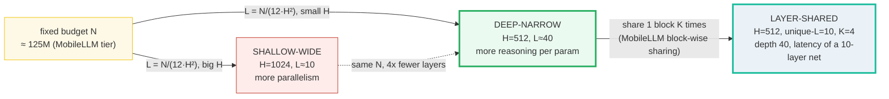
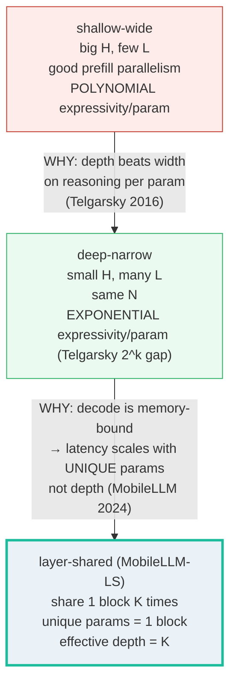
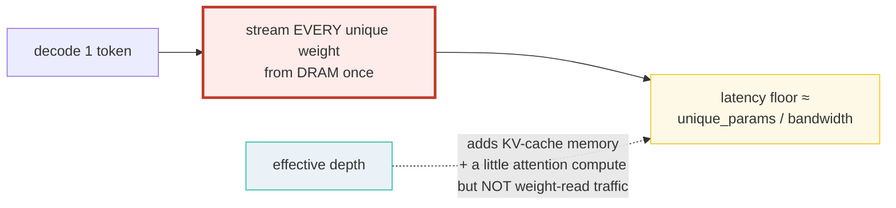
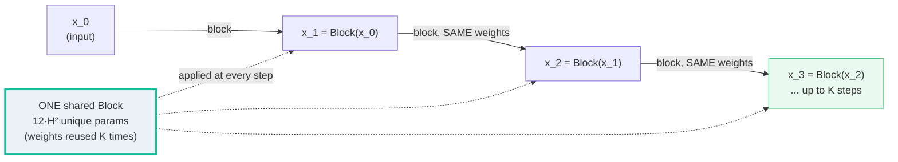
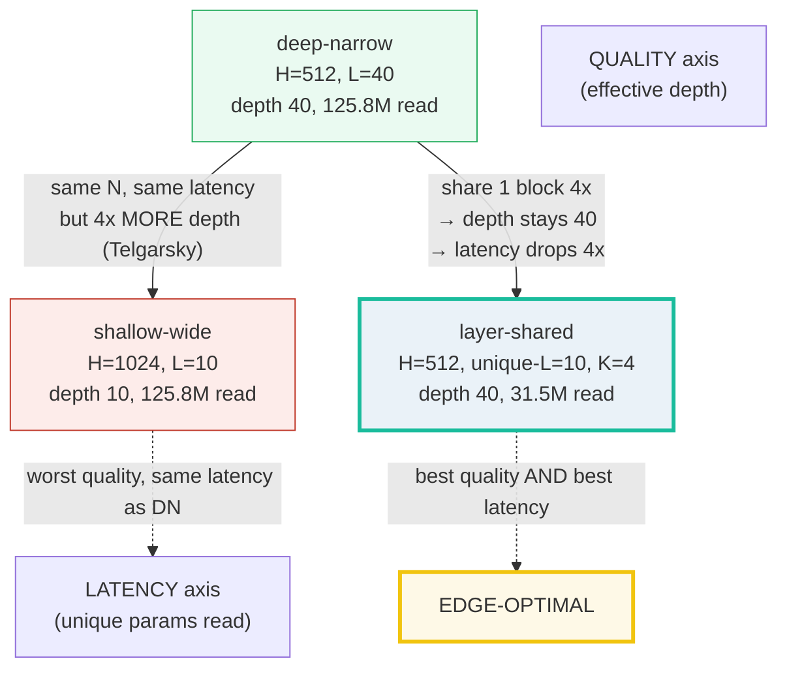
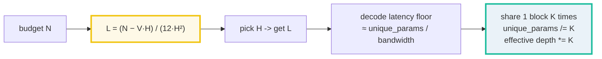

# Depth vs Width — Why Edge SLMs Go Deep-and-Narrow, Then Share Layers

> **Companion code:** [`depth_vs_width.py`](./depth_vs_width.py). **Every number
> in this guide is printed by `uv run python depth_vs_width.py`** — change the
> code, re-run, re-paste. Nothing here is hand-computed.
>
> **Live animation:** [`depth_vs_width.html`](./depth_vs_width.html) — drag the
> width slider, toggle the share factor K, watch the depth bar and the unique-
> params counter react.
>
> **Lineage source:** [`../llm/ROPE.md`](../llm/ROPE.md) — how position
> embeddings interact with depth (RoPE is applied *in every layer*, so depth
> also multiplies where position info gets injected).
>
> **Provenance:** every claim is traced in
> [`depth_vs_width_reference.txt`](./depth_vs_width_reference.txt); its public
> face is [§Sources](#sources) at the bottom. Cross-references are marked 🔗.

---

## 0. TL;DR — the whole trade-off in one picture

> **The budget seesaw (read this first):** One transformer layer costs
> **`12·H²`** parameters — `4·H²` for attention (Q, K, V, O) plus `8·H²` for the
> MLP (a `4·H` intermediate, two matmuls). For a **fixed** parameter budget `N`,
> depth `L` and width `H` trade one-for-one against the *square* of the width:
> `L ≈ N / (12·H²)`. So you can spend the same `N` two very different ways —
> **deep-and-narrow** (small `H`, big `L`) or **shallow-and-wide** (big `H`,
> small `L`). Same parameter bill; different behavior.

Two facts decide which one wins on an edge device:

1. **Depth is provably more expressive per parameter.** Telgarsky (2016) proved
   there exist networks with `Θ(k³)` layers and `Θ(1)` parameters that a
   shallower `O(k)`-layer net can only match if it is **exponentially** larger —
   `Ω(2^k)` nodes. Quality therefore prefers **deep-narrow**.
2. **Decoding one token is memory-bandwidth bound.** It streams **every unique
   weight** from DRAM once, so the latency floor scales with the **unique**
   parameter count, *not* with effective depth. This is the opening
   **MobileLLM** (arXiv:2402.14905) exploits: share ONE block `K` times
   recurrently — unique params = 1 block, effective depth = `K`. You buy the
   *quality* of a deep net for the *latency* of a shallow net.



| | shallow-wide | deep-narrow | layer-shared (MobileLLM-LS) |
|---|---|---|---|
| **Width `H`** | large (1024) | small (512) | small (512) |
| **Layers `L`** | few (~10) | many (~40) | few unique (~10), `K=4` reuses |
| **Unique params** | ~125M | ~125M | **~31M (1/K)** |
| **Effective depth** | 10 | 40 | **40** |
| **Decode latency floor** | ~125M-token read | ~125M-token read | **~31M-token read** |
| **Reasoning quality** | worst (poly expressivity) | best (`2^k` gap) | best (depth matched) |
| **Edge verdict** | too slow + too shallow | quality great, still slow | **quality great AND fast** |

> 🔗 **If you only read one cross-reference:** the *budget* `N` these
> architectures trade off within is the compute-optimal parameter count of
> [`SCALING_LAWS.md`](./SCALING_LAWS.md). This bundle decides *how to shape* `N`;
> that one decides *how big* `N` should be.

---

### Glossary (plain English — refer back any time)

| Term | Plain meaning |
|---|---|
| **H (width)** | Hidden dimension of one layer. Bigger `H` = wider weight matrices. |
| **L (depth)** | Number of transformer layers stacked sequentially. |
| **N** | Total **non-embedding** parameter budget (what we spend on the layer stack). |
| **V (vocab)** | Tokenizer vocabulary size; the embedding tax is `V·H` (see [§E](#e-the-embedding-tax--why-vh-is-subtracted-before-counting-layers)). |
| **per-layer params** | `~12·H²`: `4·H²` (Q,K,V,O attention) + `8·H²` (MLP `fc1` `H→4H`, `fc2` `4H→H`). Biases and LayerNorm γ/β are `O(H)` and dropped from the leading term. |
| **decode** | Generating ONE autoregressive token. Memory-bandwidth bound: it reads EVERY unique weight once. |
| **unique params** | The count of DISTINCT weight elements. Shared/tied/reused weights count ONCE — that is the whole point of sharing. |
| **effective depth** | How many block applications a token passes through. For layer-shared models: `unique_layers · K`. |
| **K (share factor)** | How many times ONE shared block is applied recurrently. |
| **KV cache** | Per-layer memory holding past keys/values. Grows with `L` and seq_len, but is NOT part of the per-token weight-read traffic. |
| **deep-narrow** | Small `H`, large `L` (e.g. `H=512, L=40`). Telgarsky's favoured profile. |
| **shallow-wide** | Large `H`, small `L` (e.g. `H=1024, L=10`). Good prefill parallelism, worse per-param reasoning. |
| **MobileLLM-LS** | Meta's sub-billion family with embedding sharing + block-wise weight sharing (arXiv:2402.14905). |

---

## 1. The lineage — old → new, with WHY each step happened



**Step 1 — shallow-wide → deep-narrow (the expressivity argument).**
A wider layer adds parameters *polynomially* in expressivity; a deeper stack adds
them *exponentially*. Telgarsky (COLT 2016) made this precise: there are networks
with `Θ(k³)` layers and `Θ(1)` distinct parameters that **no** `O(k)`-layer net
can approximate unless it has `Ω(2^k)` nodes. Same parameter budget, therefore,
buys far more function complexity if you spend it on **depth** than on **width**.
This is *why* modern SLMs (MobileLLM, TinyLlama, the sub-billion tier generally)
prefer many thin layers over a few fat ones.

**Step 2 — deep-narrow → layer-shared (the edge-latency argument).**
Depth is great for quality, but on a phone the bottleneck at decode is not FLOPs
— it is **memory bandwidth**. Generating one token streams **every unique
weight** from DRAM once, so the latency floor is `unique_params / bandwidth`,
which is **independent of effective depth**. MobileLLM (Liu et al. 2024) exploits
exactly this seam: instead of `L` distinct blocks, define a few unique blocks and
**reuse each one `K` times** (block-wise weight sharing, "MobileLLM-LS"). The
effective depth stays `unique_layers · K`, but the **unique** parameter count —
and therefore the decode-latency floor — drops by a factor of `K`.

> One plain sentence: depth buys quality for free in *expressivity* terms, and
> sharing lets you keep that depth while cutting the *latency* bill that depth
> would otherwise not even affect.

---

## 2. The `12·H²` law — Section A output

Every pre-norm transformer layer costs the same leading-order number of
parameters, regardless of whose checkpoint it is:

```
attention:  Q (H·H) + K (H·H) + V (H·H) + O (H·H) = 4·H²
MLP:        fc1 (H·4H) + fc2 (4H·H)             = 8·H²
────────────────────────────────────────────────────────────
per layer                                          = 12·H²
```

(Biases and LayerNorm γ/β are `O(H)` each — negligible against `O(H²)` at real
widths. The `Block` in [§C](#4-layer-sharing-in-torch--section-c-output) confirms
this by direct count.)

So for a fixed budget `N`, the depth is just `L = N / (12·H²)`:

> From `depth_vs_width.py` **Section A**:
>
> Non-embedding budget N = 125,000,000 params. Per-layer cost = 12·H².
>
> | H (width) | per-layer 12·H² | layers L = N/(12·H²) | profile |
> |---|---|---|---|
> | 512 | 3,145,728 | **39.7364** | deep-narrow (more reasoning per param) |
> | 768 | 7,077,888 | 17.6606 | balanced |
> | 1024 | 12,582,912 | **9.9341** | shallow-wide (more parallelism, fewer sequential steps) |
>
> ```
> GOLD PINS (depth_vs_width.html recomputes these, N=125,000,000):
>   H=512  -> L = 39.7364   (deep-narrow)
>   H=1024 -> L = 9.9341  (shallow-wide)
>   ratio L(512)/L(1024) = 4.0000  (= (1024/512)^2 = 4x: halving H quadruples depth at fixed N)
> ```

**Read it like a story:** at the same 125M budget, halving the width (1024 → 512)
**quadruples** the depth (≈9.9 → ≈39.7 layers). The relationship is `1/H²`, which
is why width is so expensive: doubling `H` costs you *four times* the layers.
MobileLLM's deep-and-thin choice sits at the small-`H` end of this table on
purpose — it is buying Telgarsky's exponential expressivity.

> 🔗 The budget `N = 125M` itself comes from [`SCALING_LAWS.md`](./SCALING_LAWS.md):
> it is the (heavily overtrained) sub-billion tier. This bundle decides how to
> *shape* those 125M into layers; that one decides the 125M was the right total.

---

## 3. Decode is memory-bandwidth bound — Section B output

> **The edge tax, in one breath.** Generating text one token at a time is not
> compute-bound — it is **memory-bandwidth bound**. Each decode step must stream
> **every unique weight** from DRAM to the compute unit once, because every
> matrix participates in producing a single token. So the latency floor is
> `unique_params / bandwidth`. The deep part of the story: **effective depth does
> not change this term** — applying the same block `K` times reads it `K` times,
> but it is still ONE set of unique weights.



Four configurations at the **same** effective depth (40), same `H=512`, varying
only the share factor `K`:

> From `depth_vs_width.py` **Section B**:
>
> H = 512, per-layer 12·H² = 3,145,728 params.
>
> | config | unique layers | unique params | effective depth | weight-read/token | KV-cache (rel) |
> |---|---|---|---|---|---|
> | deep-narrow (no share) | 40 | 125,829,120 | 40 | 125,829,120 | 40 |
> | layer-shared K=2 | 20 | 62,914,560 | 40 | 62,914,560 | 40 |
> | layer-shared K=4 | 10 | 31,457,280 | 40 | 31,457,280 | 40 |
> | layer-shared K=8 | 5 | 15,728,640 | 40 | 15,728,640 | 40 |
>
> ```
> deep-narrow (no share): effective depth 40, weight-read 125.83M -> 1.0x less
> layer-shared K=2      : effective depth 40, weight-read  62.91M -> 2.0x less
> layer-shared K=4      : effective depth 40, weight-read  31.46M -> 4.0x less
> layer-shared K=8      : effective depth 40, weight-read  15.73M -> 8.0x less
> ```

**Read it like a story:** all four rows have **identical effective depth 40** —
so Telgarsky's reasoning budget is the same. But the **unique** parameter count,
which is what the DRAM actually has to ship per token, drops linearly with `K`.
At `K=8` you read **8× fewer** weights per token for the same depth-quality. That
is the entire edge argument for layer sharing.

**What depth DOES add** (not shown as weight-read traffic): the **KV cache**
grows with effective depth (one `K,V` per block application) and the attention
re-scores over more layers. These are real costs, but at short-to-medium context
the weight-read term dominates batch-1 decode — which is exactly the on-device
regime MobileLLM targets.

> 🔗 Decode-as-memory-bound is the *same* reason quantization helps: fewer bytes
> per unique weight = less DRAM traffic per token. See the future
> [`GGUF_QUANT.md`](./GGUF_QUANT.md) bundle, and the sibling
> [`../local-llm/VRAM_ESTIMATOR.md`](../local-llm/VRAM_ESTIMATOR.md) for the
> bandwidth arithmetic.

---

## 4. Layer sharing in torch — Section C output

> **One block, many applications.** The `Block` below is a complete pre-norm
> transformer layer in miniature (`H=8`): a fused QKV projection, an output
> projection, and a 2-layer MLP with a `4·H` intermediate. By construction its
> weight count is `12·H²` (plus `4·H` of LayerNorm γ/β, which the table shows as
> the small `800 vs 768` gap). MobileLLM's block-wise weight sharing is simply:
> apply this **same** block `K` times, feeding each output back in as the next
> input. Unique parameters stay at one block regardless of `K`.

> From `depth_vs_width.py` **Section C**:
>
> One `Block(H=8)`. Total weight params (incl. LayerNorm): **800**. Leading-order
> 12·H² = **768**. (The difference is the 4·H LayerNorm γ/β; negligible at real H.)
>
> Input `x0` shape `(1, 4, 8)` = `[B=1, L=4, H=8]`, seeded (deterministic).
>
> **SHARED** block: the SAME `Block` is applied K times (weights reused):
>
> | share K | step norms (‖x_k‖) | unique params | vs K separate |
> |---|---|---|---|
> | 1 | [3.3574] | 800 | 100.0% (1x fewer) |
> | 2 | [4.4197, 6.0012] | 800 | 50.0% (2x fewer) |
> | 3 | [7.9226, 9.9699, 12.0442] | 800 | 33.3% (3x fewer) |
> | 4 | [14.1150, 16.1673, 18.1963, 20.2035] | 800 | 25.0% (4x fewer) |
>
> **SEPARATE** blocks: K DISTINCT `Block`s stacked (K·params, no reuse):
> `[check] K=1..4: shared uses 1/K the params of K separate blocks: OK`
> `[check] recurrent reuse: parameter tensor ids unchanged across K steps: OK`
> `[check] unique param count is independent of share factor K: OK`

**How to read the step norms:** `‖x_k‖` is the L2 norm of the activation after
the `k`-th application of the shared block. They grow monotonically (3.36 → 4.42
→ 7.92 → 14.12 → …) because the **same** nonlinear block keeps transforming its
own output — that recurrence is what gives a shared block effective depth. The
crucial column is **unique params = 800 for every K**: no matter how many times
you reuse the block, you only store one copy. Stacking `K` *separate* blocks
would cost `K·800` and is what the "vs K separate" column rules out.



> 🔗 Sharing *across layers* is conceptually parallel to **weight tying** across
> the input/output embeddings — both recover parameter budget by reusing one
> matrix in two roles. See [`SHARED_EMBEDDINGS.md`](./SHARED_EMBEDDINGS.md) for
> the embedding-tying twin of this trick.

---

## 5. The contrast table — Section D output

Three architectures, all ≈125M non-embedding params, all at the **same** effective
depth where applicable. This is the centerpiece: it shows that layer-sharing is
the edge-optimal point that gets deep-narrow quality for shallow-wide latency.

> From `depth_vs_width.py` **Section D**:
>
> Three architectures, all ~125M non-embedding params, effective depth 40:
>
> | architecture | H | unique L | K | unique params | effective depth | weight-read/token |
> |---|---|---|---|---|---|---|
> | deep-narrow | 512 | 40 | 1 | 125,829,120 | **40** | 125,829,120 |
> | shallow-wide | 1024 | 10 | 1 | 125,829,120 | **10** | 125,829,120 |
> | layer-shared (LS) | 512 | 10 | 4 | **31,457,280** | **40** | **31,457,280** |
>
> ```
> deep-narrow : 125.8M unique, depth 40  (the Telgarsky-favoured profile)
> shallow-wide: 125.8M unique, depth 10   (same N, 4x fewer layers, 4x the width)
> layer-shared: 31.5M unique, depth 40  (depth of deep-narrow, latency of a 10-layer net)
> ```

**Read the three rows left-to-right:**

- **deep-narrow** (`H=512, L=40`): spends the whole budget on depth — Telgarsky's
  `2^k` expressivity, the best reasoning per param. But it still reads **125.8M**
  unique weights per token at decode.
- **shallow-wide** (`H=1024, L=10`): same 125.8M unique params, but only **10**
  effective layers — it throws away 4× of the depth-driven expressivity for
  nothing. Strictly worse than deep-narrow on quality at equal latency.
- **layer-shared** (`H=512, unique-L=10, K=4`): the MobileLLM-LS move. It keeps
  deep-narrow's effective depth (40) **and** cuts the decode weight-read to
  **31.5M** — a quarter. Same quality, 4× faster decode.



---

## 6. Worked example — the `12·H²` law at the smallest scale

The `.py` uses `H=8, L=4` so every number prints. Here is the `12·H²` law traced
by hand on that tiny scale, the same way the `Block` counts itself:

```
H = 8   (the tiny width)
per-layer params = 12 · H² = 12 · 64 = 768

  attention:  attn_in  (8 → 24)  = 8·24  = 192   # fused Q,K,V (3·H²)
              attn_out (8 →  8)  = 8·8   =  64   # output proj (1·H²)
                                                  #   subtotal 4·H² = 256
  MLP:        fc1      (8 → 32)  = 8·32  = 256   # 4·H²
              fc2      (32 → 8)  = 32·8  = 256   # 4·H²
                                                  #   subtotal 8·H² = 512
  ─────────────────────────────────────────────
  weight total per block                          = 768   = 12·H²  ✓

If the budget were N = 7,680 (= 10 blocks at H=8):
  L = N / (12·H²) = 7,680 / 768 = 10 layers.
Halve the width to H=4:
  per-layer = 12·16 = 192;  L = 7,680 / 192 = 40 layers  (4× more, the 1/H² law).
```

And the layer-sharing math at this scale: one `H=8` block reused `K=4` times
gives effective depth 4 for **768** unique params; four separate `H=8` blocks
would cost **4·768 = 3,072**. The shared path uses **exactly 1/K** the params —
verified by `[check] K=4: shared uses 1/4 the params of 4 separate blocks: OK` in
[§C](#4-layer-sharing-in-torch--section-c-output).

---

## 7. E. The embedding tax `V·H` — why it is subtracted before counting layers

Embeddings are **not** layers: `V·H` parameters sit in the token table and steal
capacity from the stack. The honest layer count subtracts the tax first:

```
L = (N_total − V·H) / (12·H²)
```

> From `depth_vs_width.py` **Section E**:
>
> | V (vocab) | H | embed tax V·H | layers L @ 125M (post-tax) | tax % of 125M |
> |---|---|---|---|---|
> | 49152 | 512 | 25,165,824 | 31.7364 | 20.1% |
> | 49152 | 1024 | 50,331,648 | 5.9341 | 40.3% |
> | 128000 | 512 | 65,536,000 | 18.9031 | 52.4% |
> | 128000 | 1024 | 131,072,000 | **−0.4826** | 104.9% |

**The killer row:** at `H=1024` a 128k vocab eats **104.9%** of the entire 125M
budget as embeddings — `L` goes *negative* (no layers left). This is exactly why
MobileLLM **reuses the input embeddings as the output head** ("embedding
sharing", ~20% of a 125M model is embeddings per the ICML paper) and picks a
modest `V`. The depth-vs-width trade-off only even *exists* after the embedding
tax is paid.

> 🔗 [`VOCAB_RATIONALIZATION.md`](./VOCAB_RATIONALIZATION.md) — the full story of
> sizing `V` (Llama's 128k vs. SmolLM's 49k) under a parameter budget; this
> bundle only subtracts `V·H` as a tax. 🔗 [`SHARED_EMBEDDINGS.md`](./SHARED_EMBEDDINGS.md)
> — the *other* MobileLLM sharing trick (tie input embed to the LM head) that
> reclaims the `V·H` budget this table shows being eaten.

---

## 8. Pitfalls & debugging checklist

| # | Mistake | Symptom | Fix |
|---|---|---|---|
| 1 | Counting embeddings as "layers" | `L` too high, model over-parameterized | Subtract `V·H` first: `L = (N − V·H)/(12·H²)` (§E) |
| 2 | Thinking depth raises decode latency | Wrong speed model — you add layers to "go faster" vainly | Decode latency ∝ **unique** params, not depth (§B). Depth adds KV-cache, not weight-read. |
| 3 | Forgetting the `1/H²` (not `1/H`) law | Halving `H` and expecting 2× the layers | You get **4×** the layers — `L = N/(12·H²)` (§A) |
| 4 | Stacking `K` *separate* blocks instead of sharing `K` times | Params balloon to `K·12·H²`; no edge win | Reuse ONE block recurrently; verify param ids unchanged across steps (§C) |
| 5 | Assuming shared == identical to `K` distinct layers | Quality slightly lower (same weights re-applied) | MobileLLM reports +0.7–0.8% from sharing, not free; it is a *latency* trade, accept the small quality delta |
| 6 | Ignoring GQA when counting attention params | `4·H²` over-counts K,V for GQA/MQA | This bundle uses MHA (`4·H²`); GQA cuts the K,V term — re-derive `12·H²` for your head config |
| 7 | Picking shallow-wide "for parallelism" on an edge device | Slow *and* shallow | Prefill parallelism matters server-side; on-device is decode-bound → go deep-narrow or layer-shared (§D) |
| 8 | Treating effective depth as a free quality dial | KV-cache and attention compute grow with it | Effective depth is free for *weight-read*, not for *KV-cache* — bound `K` by your context-length memory budget |

---

## 9. Cheat sheet



- **Per-layer params:** `12·H²` (`4·H²` attn + `8·H²` MLP). Biases/LN are `O(H)`.
- **Depth law:** `L = (N − V·H) / (12·H²)`. Halving `H` **quadruples** `L`.
- **Gold pins (N=125M):** `H=512 → L≈39.74` (deep-narrow); `H=1024 → L≈9.93`
  (shallow-wide); ratio exactly `4.0`.
- **Decode:** memory-bandwidth bound. Latency floor ∝ **unique** params, *not*
  effective depth. KV-cache (grows with depth) and attention compute are the
  only depth-driven decode costs.
- **Layer sharing (MobileLLM-LS):** one block applied `K` times → unique params
  `12·H²`, effective depth `K`. Decode traffic cut by `K`× at equal quality.
- **Edge verdict:** deep-narrow for quality; layer-shared for quality **and**
  latency. Avoid shallow-wide on-device.
- **Telgarsky (2016):** `Θ(k³)`-layer `Θ(1)`-param nets need `Ω(2^k)` nodes to
  match in `O(k)` layers — the formal reason depth > width per param.

> 🔗 [`../llm/ROPE.md`](../llm/ROPE.md) — RoPE is applied *inside every layer*,
> so depth also multiplies where position information gets injected; the lineage
> source for this bundle.

---

## Sources

- **Liu, Z.; Zhao, C.; Iandola, F.; Lai, C.; Tian, Y.; Fedorov, I.; Xiong, Y.;
  Chang, E.; Shi, Y.; Krishnamoorthi, R.; Lai, L.; Chandra, V. (2024).**
  *MobileLLM: Optimizing Sub-billion Parameter Language Models for On-Device
  Use Cases.* ICML 2024 — https://arxiv.org/abs/2402.14905
  The source of the "deep and thin" architecture, embedding sharing, and the
  "immediate block-wise weight-sharing approach with no increase in model size
  and only marginal latency overhead" (MobileLLM-LS, +0.7%/0.8% over MobileLLM
  125M/350M) that this bundle implements in miniature ([§C](#4-layer-sharing-in-torch--section-c-output),
  [§D](#5-the-contrast-table--section-d-output)). The ICML proceedings PDF
  (https://raw.githubusercontent.com/mlresearch/v235/main/assets/liu24ce/liu24ce.pdf)
  confirms embeddings are ~20% of a 125M model — the §E tax. Official training
  code: https://github.com/facebookresearch/mobilellm.

- **Telgarsky, M. (2016).**
  *benefits of depth in neural networks.* COLT 2016, PMLR 49:1517-1539 —
  https://proceedings.mlr.press/v49/telgarsky16.html
  The depth-expressivity theorem: networks with `Θ(k³)` layers and `Θ(1)`
  distinct parameters cannot be approximated by `O(k)`-layer nets unless they
  have `Ω(2^k)` nodes. The formal reason deep-narrow beats shallow-wide at equal
  parameter count ([§1](#1-the-lineage--old--new-with-why-each-step-happened),
  [§A](#2-the-12h²-law--section-a-output)).

- **Raghu, M.; Poole, B.; Kleinberg, J.; Ganguli, S.; Sohl-Dickstein, J. (2016/2017).**
  *On the Expressive Power of Deep Neural Networks.* ICML 2017 —
  https://arxiv.org/abs/1606.05336
  Independent corroboration: "The complexity of the computed function grows
  exponentially with depth." Second source for the depth-expressivity claim.

- **NVIDIA.** *Mastering LLM Techniques: Inference Optimization.* —
  https://developer.nvidia.com/blog/mastering-llm-techniques-inference-optimization/
  "Model execution is frequently memory-bandwidth bound — in particular,
  bandwidth-bound in the weights." The decode-is-memory-bound model behind
  [§B](#3-decode-is-memory-bandwidth-bound--section-b-output).

- **Databricks.** *LLM Inference Performance Engineering: Best Practices.* —
  https://www.databricks.com/blog/llm-inference-performance-engineering-best-practices
  Second source confirming batch-1 autoregressive decode is memory-bandwidth
  bound; the operator intensity of the weight load dominates compute for
  on-device inference.

- **Hoffmann, J.; Borgeaud, S.; et al. (2022).**
  *Training Compute-Optimal Large Language Models (Chinchilla).* —
  https://arxiv.org/abs/2203.15556
  The compute-optimal parameter budget `N` that depth-vs-width trades off
  *within* (the `N` of [§A](#2-the-12h²-law--section-a-output)); cross-refs
  [`SCALING_LAWS.md`](./SCALING_LAWS.md).

> **Full per-URL provenance** (one `Verifies:` line each) lives in
> [`depth_vs_width_reference.txt`](./depth_vs_width_reference.txt) — 8 entries,
> 8 distinct URLs.
