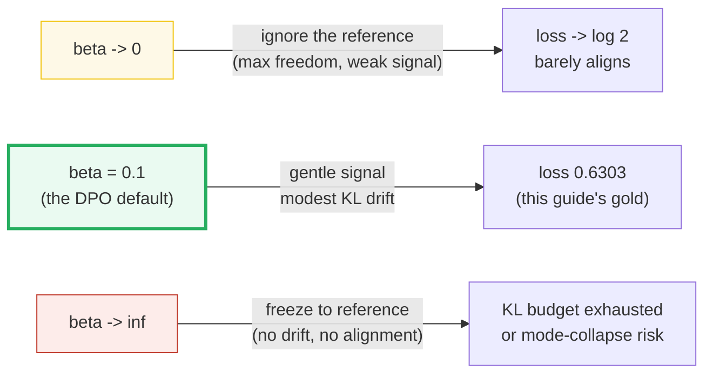

# Direct Preference Optimization (DPO) — Align from Pairs, No Reward Model, No RL

> **Companion code:** [`direct_preference_dpo.py`](./direct_preference_dpo.py).
> **Every number in this guide is printed by
> `uv run python direct_preference_dpo.py`** — change the code, re-run, re-paste.
> Nothing here is hand-computed.
>
> **This is the Phase-4 alignment stage.** Once the model is instruction-tuned
> (🔗 [`INSTRUCTION_SFT.md`](./INSTRUCTION_SFT.md)), the open question is *how to
> push its output distribution toward what humans actually prefer*. There are two
> answers in the lineage. **RLHF** (what InstructGPT / Llama 2-Chat do) trains a
> *separate* reward model on `(chosen, rejected)` pairs and then optimizes the
> policy with PPO against that reward plus a KL penalty to a frozen reference —
> four models in memory, an RL inner loop, famously unstable. **DPO** writes down
> the *same* KL-constrained reward objective, solves it analytically, and
> discovers the reward model *cancels*. You are left with **one binary
> cross-entropy-style loss on pairs**, two models (policy + frozen reference),
> and no reinforcement learning.
>
> **Live animation:** [`direct_preference_dpo.html`](./direct_preference_dpo.html)
> — drag the four logπ sliders + β, watch the implicit-reward bars and the DPO
> loss react; step the micro training loop to watch the policy push chosen up /
> rejected down relative to the frozen reference.
>
> **Foundations:** 🔗 [`PRETRAINING_STABLE.md`](./PRETRAINING_STABLE.md) — the
> gradient-clip + LR-schedule stability tricks apply to the DPO fine-tune loop,
> and the SFT checkpoint it stabilizes *is* DPO's reference policy π_ref.

---

## 0. TL;DR — the whole idea in one picture

> **The balance-scale analogy (read this first):** RLHF builds a *separate*
> weighing machine (the reward model) to score responses, then pushes the model
> toward high-scoring ones with a separate reinforcement-learning controller.
> DPO notices that the *optimal* policy for that whole setup has a closed form:
> `π*(y|x) ∝ π_ref(y|x)·exp(r(x,y)/β)`. Rearrange that, and the reward can be
> written purely in terms of the policy and the frozen reference —
> `r(x,y) = β·log(π(y|x)/π_ref(y|x))`. Plug it into the Bradley-Terry preference
> model and the partition function **cancels in the reward difference**. The
> reward model vanishes; what's left is a single sigmoid loss on each
> `(chosen, rejected)` pair. The policy *is* the reward model.

The alignment stage shed two whole models by solving the RL objective
analytically — each step removes a failure mode:

```mermaid
graph LR
    SFT["SFT<br/>fine-tune on demos<br/>-> pi_SFT (the reference)"] -->|collect (chosen, rejected) pairs| RL["RLHF<br/>train reward model r_phi<br/>+ PPO against r - beta*KL<br/>4 models in memory"]
    RL -->|solve the KL objective analytically<br/>optimal pi* has a closed form| DPO["DPO<br/>reward cancels in the preference prob<br/>one BCE loss on pairs, 2 models, no RL"]
    style DPO fill:#eafaf1,stroke:#1abc9c,stroke-width:3px
    style RL fill:#fdecea,stroke:#c0392b
    style SFT fill:#fef9e7,stroke:#f1c40f
```

| | **RLHF (InstructGPT, Llama 2-Chat)** | **DPO (Rafailov 2023; Zephyr)** |
|---|---|---|
| **Models in memory** | 4: policy + ref + reward + value | **2: policy + frozen ref** |
| **Separate reward model?** | yes (`r_phi`, trained first) | **no** (implicit: `β·log(π/π_ref)`) |
| **RL loop?** | yes (PPO, on-policy sampling) | **no** (pure supervised loss) |
| **Loss** | `−E[r(x,y)] + β·KL(π‖π_ref)` (eq.3) | **`−log σ(β·log(π_c/π_ref_c) − β·log(π_l/π_ref_l))`** (eq.7) |
| **Hyperparameter** | many (PPO clip, GAE λ, KL coef, …) | **just β** (0.1–0.5) |
| **Failure mode** | unstable, sensitive, expensive | can over-optimize / drift if β off |

> **One plain sentence:** DPO replaces "train a reward model, then RL against
> it" with "one classification loss on `(chosen, rejected)` pairs, computed with
> two models — the policy and a frozen reference that is usually the SFT
> checkpoint."

### Glossary (plain English — refer back any time)

| Term | Plain meaning |
|---|---|
| **prompt (`x`)** | The input the model conditions on. |
| **completion (`y`)** | The model's response to `x`. |
| **chosen (`y_w`)** | The PREFERRED completion (the *winner*) of a preference pair. |
| **rejected (`y_l`)** | The DISPREFERRED completion (the *loser*) of the pair. |
| **policy (`π_θ`)** | The model being trained; `θ` are its parameters. |
| **reference (`π_ref`)** | The FROZEN model DPO must stay close to. Almost always the SFT checkpoint (`π_ref = π_SFT`). **Never** updated during DPO. |
| **`logπ(y|x)`** | `log π(y|x)`: the log-probability of a completion. In practice the **sum of per-token logprobs** over `y`. Modeled as a given scalar here (no real LM runs). |
| **implicit reward (`r̂`)** | The reward the policy *defines*, relative to the ref: `r̂(x,y) = β·(logπ_θ(y|x) − logπ_ref(y|x))`. The reference is the reward's zero point. |
| **β (beta)** | The temperature. Scales the preference signal AND how far π_θ may drift from π_ref. Typical **0.1–0.5**. `β→0`: ignore the reference (max freedom). `β→∞`: freeze to the reference (no alignment). |
| **σ (sigma)** | The logistic sigmoid: `σ(z) = 1/(1+e^−z)`. |
| **margin (`z`)** | The sigmoid's input: `z = r̂(chosen) − r̂(rejected)`. `z > 0` ⇒ the policy prefers chosen MORE than the ref did ⇒ small loss. |
| **Bradley-Terry** | The preference model: `p(y_w ≻ y_l) = σ(r(y_w) − r(y_l))`. DPO is its MLE once `r` is reparameterized as `β·log(π/π_ref)`. |
| **KL budget** | What β buys you. Large β = large allowed `KL(π_θ‖π_ref)` = strong alignment but risk of drifting off-distribution. |

> 🔗 **If you only read one cross-reference:** DPO starts from the SFT
> checkpoint, and the SFT model *is* the reference policy `π_ref`. So everything
> in 🔗 [`INSTRUCTION_SFT.md`](./INSTRUCTION_SFT.md) (the SFT data, the SFT
> checkpoint) defines the zero-point of DPO's implicit reward.

---

## 1. The lineage: why RLHF → DPO happened

> **The story in one breath.** RLHF aligns a model with a *separate* reward
> model plus a PPO inner loop — that's four models resident (policy, reference,
> reward, value) and an on-policy RL optimization that is famously touchy. DPO's
> only move is to take the *exact* KL-constrained reward objective RLHF optimizes
> and solve it analytically. The optimal policy has a closed form involving the
> policy and a frozen reference; substituting that back into the preference
> model makes the reward model **cancel**. One classification-style loss
> remains. No reward model, no RL.

```mermaid
graph TD
    EQ3["RLHF objective (eq.3)<br/>max_pi E[r(x,y)] - beta*KL(pi || pi_ref)"] --> SOLVE["solve analytically<br/>(KL-constrained reward max)"]
    SOLVE --> EQ4["closed-form optimum (eq.4)<br/>pi*(y|x) = (1/Z(x)) * pi_ref(y|x) * exp(r/beta)"]
    EQ4 --> EQ5["rearrange -> reward in terms of policy (eq.5)<br/>r(x,y) = beta*log(pi/pi_ref) + beta*log Z(x)"]
    EQ5 --> SUB["substitute into Bradley-Terry<br/>p(y_w > y_l) = sigma(r(y_w) - r(y_l))"]
    SUB --> CANCEL["Z(x) CANCELS in the reward DIFFERENCE<br/>(it depends only on x, not y)"]
    CANCEL --> EQ7["DPO loss (eq.7)<br/>-log sigma(beta*log(pi_c/pi_ref_c) - beta*log(pi_l/pi_ref_l))"]
    style SOLVE fill:#fef9e7,stroke:#f1c40f
    style CANCEL fill:#eafaf1,stroke:#27ae60,stroke-width:2px
    style EQ7 fill:#0f2e29,stroke:#1abc9c,stroke-width:3px
    style EQ3 fill:#fdecea,stroke:#c0392b
```



- **SFT** is the starting point — supervised fine-tune on high-quality
  demonstrations → `π_SFT`. It defines both the policy's initialization and the
  *reference* `π_ref` for the next stage.
- **RLHF** collects `(chosen, rejected)` preference pairs, trains a separate
  reward model `r_φ` on them (Bradley-Terry), then optimizes the policy with PPO
  against `r(x,y) = r_φ(x,y) − β·(log π_θ − log π_ref)`. The KL term keeps the
  policy near `π_ref` so the reward model stays accurate and the policy does not
  mode-collapse. **Problem:** 4 models in memory, an RL inner loop, on-policy
  sampling during training — complex, unstable, expensive. (InstructGPT,
  Ouyang et al 2022, arXiv:2203.02155.)
- **DPO** notices the *same* KL-constrained reward objective has a **closed-form
  optimal policy**: `π*(y|x) = (1/Z(x))·π_ref(y|x)·exp(r(x,y)/β)` (eq.4).
  Rearrange → `r(x,y) = β·log(π/π_ref) + β·log Z(x)` (eq.5). Substitute into
  Bradley-Terry: the partition function `Z(x)` **cancels in the reward
  difference** (it depends only on `x`, not `y`), leaving a preference
  probability that depends ONLY on the policy and the frozen ref (eq.6).
  Maximum-likelihood on that is the DPO loss (eq.7). One objective, two models,
  no RL, no reward model. (Rafailov et al 2023, arXiv:2305.18290.)

> One plain sentence: DPO did not change the *goal* of RLHF — it changed the
> *route*, turning an RL problem into a supervised one by solving for the
> optimal policy in closed form and watching the reward model evaporate.

---

## 2. The DPO loss (eq.7) — Section A output (the GOLD anchor)

> **The loss in one line.** Define the implicit reward each policy defines,
> relative to the frozen reference:
> `r̂(x,y) = β·(logπ_θ(y|x) − logπ_ref(y|x))`. Then:
>
> `L_DPO = −log σ( r̂(x,y_w) − r̂(x,y_l) )`
>       `= −log σ( β·(logπ_c − logπ_ref_c) − β·(logπ_l − logπ_ref_l) )`.
>
> That is a binary cross-entropy — "the chosen completion should have a higher
> implicit reward than the rejected one." The reference is the zero of the
> reward scale.

Take the pinned toy quadruple (the GOLD anchor both this guide and
`direct_preference_dpo.html` recompute):

- `logπ_c = −2.0`, `logπ_ref_c = −2.5` (policy rates chosen HIGHER than ref did)
- `logπ_l = −3.0`, `logπ_ref_l = −2.2` (policy rates rejected LOWER than ref did)
- `β = 0.1`

> From `direct_preference_dpo.py` **Section A**:
>
> **Step 1** — the implicit reward of each completion (relative to the FROZEN ref):
> ```
> r_chosen   = β·(logπ_c − logπ_ref_c)  = 0.1·(−2.0 − (−2.5)) = 0.1·+0.50 = +0.0500
> r_rejected = β·(logπ_l − logπ_ref_l)  = 0.1·(−3.0 − (−2.2)) = 0.1·−0.80 = −0.0800
> ```
> **Step 2** — the margin (the sigmoid's input):
> ```
> z = r_chosen − r_rejected = +0.0500 − (−0.0800) = +0.1300
> ```
> **Step 3** — the loss:
> ```
> σ(0.13) = 1/(1+e^−0.13) = 0.532454
> L = −log σ(0.13) = −log(0.532454) = 0.6303
> ```
>
> | quantity | value |
> |---|---|
> | r_chosen (implicit rew.) | **+0.0500** |
> | r_rejected (implicit rew.) | **−0.0800** |
> | margin z = r_c − r_l | **+0.1300** |
> | σ(z) | 0.532454 |
> | L_DPO = −log σ(z) | **0.6303** |
>
> `[check] GOLD margin z == 0.13 (within 1e-9): OK`
> `[check] GOLD L ~= 0.6303 (within 1e-3): OK`
> `[check] loss matches the closed form log(1+e^−z): OK`

### Worked smallest-scale example (the gold anchor)

The arithmetic in one breath:
- The policy rates the chosen completion *higher* than the reference did
  (`logπ_c − logπ_ref_c = +0.5`), and the rejected completion *lower* than the
  reference did (`logπ_l − logπ_ref_l = −0.8`).
- So the implicit reward of chosen is positive (`+0.05` after β scaling) and the
  implicit reward of rejected is negative (`−0.08`).
- The margin is `+0.05 − (−0.08) = +0.13` — the policy *already* prefers the
  chosen completion more than the reference did.
- A positive margin → `σ(0.13) > 0.5` → `−log σ(0.13) < log 2`. The loss is
  **0.6303**, below the `log 2 ≈ 0.6931` "no information" baseline. The policy
  is already partly aligned; DPO just sharpens it.

Pin `L = 0.6303` (4 decimals). Recompute it in JS with the identical formula and
the gold-check badge confirms the formula was copied verbatim — see
`direct_preference_dpo.html`.

> ⚠️ **Note on the closed form.** `−log σ(z)` is numerically identical to
> `log(1 + e^−z) = softplus(−z)`. The `.py` uses the stable `softplus` form in
> its micro training loop (Section 4); both give `0.6303` for `z = 0.13`.

---

## 3. The loss is a sigmoid of the margin — Section B output

> **Positive margin → small loss; negative margin → large loss.** That is the
> whole behavioral shape of DPO. When the policy *already* prefers the chosen
> completion more than the reference did, the margin is positive and the loss
> sits below `log 2` (nothing much to learn). When the policy prefers the
> *rejected* completion more, the margin is negative and the loss blows up
> (lots to learn). At the tie (policy == reference on both), the margin is 0 and
> the loss is exactly `log 2` — the entropy of a fair coin.

Fix the reference at `logπ_ref_c = logπ_ref_l = −2.0` and `β = 0.1`. Vary the
policy's logπ on chosen vs rejected:

> From `direct_preference_dpo.py` **Section B**:
>
> | logπ_c | logπ_l | r_c | r_l | margin z | σ(z) | L_DPO | reading |
> |---|---|---|---|---|---|---|---|
> | −2.0 | −2.0 | +0.0000 | +0.0000 | +0.0000 | 0.5000 | **0.6931** | tie: policy == ref on both (no signal) |
> | −1.5 | −2.5 | +0.0500 | −0.0500 | +0.1000 | 0.5250 | **0.6444** | chosen UP, rejected DOWN → big positive margin |
> | −2.5 | −1.5 | −0.0500 | +0.0500 | −0.1000 | 0.4750 | **0.7444** | chosen DOWN, rejected UP → big negative margin |
> | −1.8 | −2.2 | +0.0200 | −0.0200 | +0.0400 | 0.5100 | **0.6733** | mild preference for chosen |
> | −2.2 | −1.8 | −0.0200 | +0.0200 | −0.0400 | 0.4900 | **0.7133** | mild preference for rejected |
>
> `[check] tie (r_c==r_l) -> margin 0, loss = log 2 = 0.6931: OK`
> `[check] chosen UP/rejected DOWN -> positive margin, loss < log 2: OK`
> `[check] chosen DOWN/rejected UP -> negative margin, loss > log 2: OK`
> `[check] fundamental sigmoid complement: sigma(-z) = 1 - sigma(z): OK`

**Reading the table like a story:**

- The **first row** is the "cold start": policy and reference agree on both
  completions, so both implicit rewards are 0, the margin is 0, and the loss is
  exactly `log 2 ≈ 0.6931` — the entropy of `σ(0)`. This is what the loss looks
  like at the very first DPO step when `π_θ` is initialized from `π_ref`.
- The **second row** is the dream case: the policy already up-weights chosen and
  down-weights rejected relative to the reference. Margin `+0.1`, loss `0.6444` —
  below `log 2`, the model is already partly aligned.
- The **third row** is the nightmare: the policy has it backwards — it prefers
  the *rejected* completion. Margin `−0.1`, loss `0.7444` — above `log 2`, the
  gradient will fire hard to fix it (Section 4).

> One plain sentence: the loss only asks "does the policy rank chosen above
> rejected, *relative to how the reference ranked them*?" — and it is gentle
> when the answer is already yes, savage when the answer is no.

---

## 4. β controls sensitivity AND the KL budget — Section C output

> **β is doing two jobs at once.** It scales the preference signal (how strongly
> the loss fires) AND sets the KL budget (how far the policy may drift from
> `π_ref`). For a *fixed* `(chosen, rejected)` quadruple, the log-ratio
> difference `(logπ_c − logπ_ref_c) − (logπ_l − logπ_ref_l)` is fixed; β just
> multiplies it. So the margin `z = β·(that difference)` grows linearly with β.
> Small β → margin ≈ 0 → loss ≈ `log 2` (ignore the reference, weak signal).
> Large β → huge margin → loss → 0 if positive (strong alignment, big drift).

For the same quadruple as Section A, sweep β:

> From `direct_preference_dpo.py` **Section C** — the log-ratio difference
> `(−2.0−(−2.5)) − (−3.0−(−2.2)) = +1.30` is FIXED; β scales it:
>
> | β | r_c | r_l | margin z | σ(z) | L_DPO | reading |
> |---|---|---|---|---|---|---|
> | 0.01 | +0.0050 | −0.0080 | +0.0130 | 0.5032 | **0.6867** | β→0: ignore ref, loss→log 2 |
> | 0.05 | +0.0250 | −0.0400 | +0.0650 | 0.5162 | **0.6612** | β→0: ignore ref, loss→log 2 |
> | 0.10 | +0.0500 | −0.0800 | +0.1300 | 0.5325 | **0.6303** | typical DPO range |
> | 0.50 | +0.2500 | −0.4000 | +0.6500 | 0.6570 | **0.4201** | large β: strong signal, big KL drift |
> | 1.00 | +0.5000 | −0.8000 | +1.3000 | 0.7858 | **0.2410** | large β: strong signal, big KL drift |
>
> `[check] margin scales linearly with beta (z(1.0) = 10*z(0.1)): OK`
> `[check] z(beta) = beta * log_ratio_diff (= beta*0.13 here): OK`
> `[check] as beta -> 0, loss -> log 2 (no preference signal): OK`
> `[check] typical DPO beta 0.1 falls in the verified 0.1-0.5 range: OK`



**Reading the table like a story:**

- **β = 0.01** (nearly 0): the margin collapses to `0.013`, the loss sits at
  `0.6867` — almost `log 2`. The reference is essentially ignored; the
  preference signal is too weak to move the policy. This is the "we forgot to
  anchor to the SFT model" failure mode.
- **β = 0.1** (the DPO default, Zephyr's choice): margin `0.13`, loss `0.6303`.
  A meaningful but gentle signal — the standard pick for most open DPO recipes.
- **β = 1.0**: margin `1.3`, loss `0.2410`. The signal is strong and the loss
  drops fast — but the policy is now allowed to drift far from `π_ref`, which
  risks leaving the distribution where the (implicit) reward is calibrated.

> ⚠️ **The β trap:** β is a *single* knob that trades off alignment strength
> against drift from the reference. There is no "right" β independent of the
> dataset and the SFT quality. TRL's documented typical range is **0.1–0.5**;
> outside it, you either under-align (β too small) or over-drift (β too large).

---

## 5. Gradient direction + a micro training loop — Section D output

> **What does minimizing L_DPO actually DO to the policy?** Take the gradient
> with respect to the policy's logπ values (the reference is frozen). Two signs
> tell the whole story:
> - `∂L/∂(logπ_c) = (σ(z) − 1)·β < 0` → gradient **descent increases** `logπ_c`
>   (push chosen UP).
> - `∂L/∂(logπ_l) = (1 − σ(z))·β > 0` → gradient **descent decreases** `logπ_l`
>   (push rejected DOWN).
>
> Both movements are *relative to the frozen reference*. The margin
> `(logπ_c − logπ_ref_c) − (logπ_l − logπ_ref_l)` grows; the loss falls.

```mermaid
graph LR
    START["policy STARTS at pi_ref<br/>logpi_c == logpi_ref_c<br/>margin z = 0, loss = log 2"] -->|"dL/d(logpi_c) < 0"| UP["gradient descent<br/>INCREASES logpi_c<br/>(chosen UP)"]
    START -->|"dL/d(logpi_l) > 0"| DOWN["gradient descent<br/>DECREASES logpi_l<br/>(rejected DOWN)"]
    UP --> GROW["margin grows<br/>loss falls"]
    DOWN --> GROW
    GROW --> REF["reference logpi_ref_c, logpi_ref_l<br/>NEVER move (FROZEN)"]
    style UP fill:#eafaf1,stroke:#27ae60
    style DOWN fill:#fdecea,stroke:#c0392b
    style GROW fill:#0f2e29,stroke:#1abc9c,stroke-width:3px
    style REF fill:#fef9e7,stroke:#f1c40f
```



We treat `logπ_c, logπ_l` as the policy's two trainable log-probs and use torch
autograd for the exact gradient, then take 5 manual SGD steps (`lr=1.0`, β=0.1,
ref FROZEN):

> From `direct_preference_dpo.py` **Section D** — gradient signs at the start
> (policy == reference, so `z = 0`, `σ(0) = 0.5`):
> ```
> dL/d(logpi_c) = (sigma(z) - 1)*beta = -0.050000   <- NEGATIVE  (chosen UP)
> dL/d(logpi_l) = (1 - sigma(z))*beta = +0.050000   <- POSITIVE  (rejected DOWN)
> ```

> From `direct_preference_dpo.py` **Section D** — the micro training loop:
>
> | step | logπ_c | logπ_l | r_c | r_l | margin z | L_DPO |
> |---|---|---|---|---|---|---|
> | 0 | −2.5000 | −2.2000 | +0.0000 | +0.0000 | +0.0000 | 0.6931 |
> | 1 | −2.4500 | −2.2500 | +0.0050 | −0.0050 | +0.0100 | 0.6882 |
> | 2 | −2.4002 | −2.2998 | +0.0100 | −0.0100 | +0.0200 | 0.6832 |
> | 3 | −2.3507 | −2.3493 | +0.0149 | −0.0149 | +0.0299 | 0.6783 |
> | 4 | −2.3015 | −2.3985 | +0.0199 | −0.0199 | +0.0397 | 0.6735 |
> | 5 | −2.2525 | −2.4475 | +0.0248 | −0.0248 | +0.0495 | 0.6687 |
>
> `[check] dL/d(logpi_c) < 0 (chosen is pushed UP): OK`
> `[check] dL/d(logpi_l) > 0 (rejected is pushed DOWN): OK`
> `[check] logpi_c rose over the loop (chosen up): OK`
> `[check] logpi_l fell over the loop (rejected down): OK`
> `[check] margin grew monotonically: OK`
> `[check] loss fell over the loop: OK`
> `[check] the reference log-probs are FROZEN (never passed to an optimizer): OK`

**Reading the loop like a story:** every step, `logπ_c` rises (chosen pushed up)
and `logπ_l` falls (rejected pushed down). The margin grows monotonically and
the loss falls. The reference (`−2.5, −2.2`) never moves — that is the whole
point of `π_ref` being frozen. This is the DPO update in miniature: a relative
re-ranking of chosen vs rejected, anchored to the SFT checkpoint.

> 🔗 This is exactly the same loop shape as the optimizer step in 🔗
> [`PRETRAINING_STABLE.md`](./PRETRAINING_STABLE.md) Section D — same
> gradient-clip, same LR schedule — just with the DPO loss instead of MSE, and a
> frozen twin for the reference log-probs.

---

## 6. Lineage + what shipped models actually used — Section E output

> **Theory meets the model zoo.** The recipes below are the *published*
> alignment pipelines — all web-verified in
> [`direct_preference_dpo_reference.txt`](./direct_preference_dpo_reference.txt).

> From `direct_preference_dpo.py` **Section E** — the alignment lineage:
>
> | stage | what it does | failure removed | used by |
> |---|---|---|---|
> | SFT | supervised fine-tune on demonstrations | no preference signal yet | the starting point |
> | RLHF (PPO) | train reward model, then PPO against it + KL to ref | 4 models in memory; RL unstable; on-policy sampling | InstructGPT, Llama 2-Chat |
> | **DPO** | closed-form optimal policy → reward model cancels | **no RL; 2 models; one BCE-style loss on pairs** | **Rafailov 2023; Zephyr-7B-beta** |

> From `direct_preference_dpo.py` **Section E** — what shipped models actually
> used:
>
> | model | method | models in memory | β | dataset | source |
> |---|---|---|---|---|---|
> | InstructGPT | RLHF (reward model + PPO) | 4: policy + ref + reward + value | n/a (KL coef 0.02) | human prefs | Ouyang 2022 arXiv:2203.02155 |
> | Llama 2-Chat | RLHF (reward model + PPO + safety) | 4: policy + ref + reward + value | n/a (KL via reward) | human prefs | Touvron 2023 arXiv:2307.09288 |
> | DPO paper | DPO (no RL, no reward model) | 2: policy + ref | 0.1 (TL;DR, HH); 0.05–0.5 (IMDb) | human prefs | Rafailov 2023 arXiv:2305.18290 |
> | Zephyr-7B-beta | DPO (distilled, TRL DPOTrainer) | 2: policy + ref | **0.1** | UltraFeedback (GPT-4 ranked) | Tunstall 2023 arXiv:2310.16944 |
>
> `[check] RLHF needs 4 models in memory; DPO needs 2: OK`
> `[check] DPO ships WITHOUT an RL loop (no PPO): OK`
> `[check] Zephyr beta=0.1 falls in the verified 0.1-0.5 typical range: OK`

Two patterns:

- **InstructGPT / Llama 2-Chat (the RLHF era):** the full pipeline — a separate
  reward model + PPO + a value head + a KL anchor to the reference. Four models
  resident, an RL inner loop, sensitive to tune. This is what DPO was invented
  to replace.
- **DPO paper / Zephyr (the DPO era):** drop the reward model and the RL loop
  entirely. Two models (policy + frozen ref), one classification-style loss.
  Zephyr-7B-beta reaches near-Llama2-Chat-70B chat quality with a single 7B base
  (Mistral-7B) + DPO on UltraFeedback at β=0.1 — strong evidence the DPO route
  scales without the RL machinery.

---

## 7. The why: three layers of depth

**What** (the mechanism): the DPO loss is `−log σ(r̂_c − r̂_l)` where the
implicit reward `r̂ = β·(logπ_θ − logπ_ref)` is defined *relative to the frozen
reference* (Section 2). Minimizing it pushes the policy to rank chosen above
rejected *relative to how the reference ranked them* (Section 5), with β
controlling both the signal strength and the KL budget (Section 4).

**Why-internals** (why each piece exists):
- **The implicit reward `r̂ = β·log(π_θ/π_ref)`** exists because the
  KL-constrained reward-maximization objective (eq.3) has a *closed-form*
  optimal policy (eq.4). Rearranging that closed form expresses the reward in
  terms of the policy and the reference (eq.5) — so the reward model is no
  longer a separate network, it *is* the policy (relative to the reference).
- **The partition function `Z(x)` cancels** because Bradley-Terry depends only
  on the *difference* of rewards, and `Z(x)` is a function of `x` alone — it
  appears identically in `r̂(y_w)` and `r̂(y_l)` and subtracts out (eq.6). This
  is the algebraic miracle that lets DPO skip the intractable partition-function
  estimation that made the original closed form impractical.
- **β exists** because RLHF's KL penalty `β·KL(π‖π_ref)` exists — to keep the
  policy near the reference so it doesn't drift off-distribution and mode-
  collapse. DPO inherits the same β and the same role; it just bakes it into a
  single loss instead of a PPO penalty.
- **The reference is frozen** because it is the *calibration* of the implicit
  reward: `r̂ = 0` means "the policy matches the reference on this completion."
  If the reference moved, the reward's zero point would move with it and the
  preference signal would be meaningless.

**Gotchas** (the killer ones — see the table below): β too high drifts off the
reference and breaks the calibration; β too low under-aligns; an *unfrozen*
reference makes the loss trivially minimizable (degenerate); `chosen == rejected`
collapses the margin to 0 (no signal); and summing logπ over the wrong token
span (prompt tokens vs completion tokens) silently corrupts the reward.

---

## 8. Pitfalls & debugging checklist

| # | Trap | Symptom | Fix |
|---|---|---|---|
| 1 | **β too high (> 0.5)** | Policy drifts far from `π_ref`; rewards/margins explode; model becomes over-aligned / degenerate (repeats, mode-collapse) | Lower β into the 0.1–0.5 range. Large β = large KL budget = the policy can leave the distribution where the implicit reward is meaningful. |
| 2 | **β too low (< 0.05)** | Loss ≈ `log 2` and barely moves; the model doesn't align at all (the reference is effectively ignored) | Raise β to 0.1 (the DPO default). At β→0 the margin → 0 and the loss → `log 2` — no preference signal fires. |
| 3 | **The reference `π_ref` is NOT frozen** | Loss collapses to ~0 trivially; the model solves the objective by moving the reference, not the policy | Freeze `π_ref` (it is the SFT checkpoint). With PEFT/LoRA this is free (the base weights ARE the frozen ref); full fine-tune needs a separate frozen copy in memory. 🔗 [`LOW_RANK_DORA.md`](./LOW_RANK_DORA.md) |
| 4 | **`chosen == rejected` (identical text)** | Margin = 0, loss = `log 2`, gradient = 0 — the pair contributes nothing and wastes a batch slot | Filter preference datasets for `chosen != rejected` (and near-duplicates). This is the DPO analog of feeding the SFT loss an identical input/target pair. |
| 5 | **logπ summed over the wrong span** | Rewards look reasonable but the model aligns to length/position artifacts instead of preference | Sum per-token logprobs only over the COMPLETION tokens (mask the prompt). Summing prompt tokens makes `logπ` a function of prompt length, not response quality. |
| 6 | **`π_ref != π_SFT` (distribution shift)** | DPO is calibrated to a reference the preference data was NOT sampled from → noisy, unstable alignment | Initialize `π_ref = π_SFT` whenever possible (the DPO paper's default). If no SFT model exists, fit one by max-likelihood on the chosen completions first. 🔗 [`INSTRUCTION_SFT.md`](./INSTRUCTION_SFT.md) |
| 7 | **Reference computed without `torch.no_grad()` / `inference_mode`** | Memory blows up (you build a graph for the reference forward pass) or the reference accidentally gets gradients | Run the reference forward in `torch.no_grad()`. TRL can precompute `logπ_ref` once if the data is static. |
| 8 | **No gradient clipping on the DPO loss** | Occasional loss spikes (a pair with a huge negative margin) derail the run | Apply the same global-norm clip (`max_norm=1.0`) as pretraining. 🔗 [`PRETRAINING_STABLE.md`](./PRETRAINING_STABLE.md) Section 2 |
| 9 | **Unpaired data fed to DPO** | Crash or silent garbage — DPO needs `(chosen, rejected)` PAIRS; a lone good or bad response is not a pair | Use a pairwise method (DPO) only on paired data. For unpaired thumbs-up/down, use the unpaired counterpart. 🔗 [`KTO_ALIGNMENT.md`](./KTO_ALIGNMENT.md) |
| 10 | **Treating DPO as one-shot (no iterative refinement)** | Plateau — a single DPO pass on stale preferences under-aligns vs iterative RLHF | Iterate: DPO → sample new preferences from the updated policy → DPO again (iterative DPO). Each round the reference becomes the previous policy. |

---

## 9. Cheat sheet

```mermaid
graph LR
    RL["RLHF<br/>reward model + PPO<br/>4 models, RL loop"] -->|"solve KL objective<br/>in closed form"| DPO["DPO<br/>one BCE loss on pairs<br/>2 models, no RL"]
    DPO --> LOSS["L = -log sigma( r_c - r_l )<br/>r_hat = beta*(logpi_th - logpi_ref)"]
    LOSS --> BETA["beta: 0.1-0.5<br/>(signal + KL budget)"]
    LOSS --> REF["pi_ref = pi_SFT<br/>(FROZEN)"]
    style DPO fill:#eafaf1,stroke:#1abc9c,stroke-width:3px
    style RL fill:#fdecea,stroke:#c0392b
    style LOSS fill:#0f2e29,stroke:#1abc9c
```



- **The one lineage:** SFT → RLHF (reward model + PPO, 4 models) → **DPO**
  (closed-form optimum, reward cancels, 2 models). Same goal, no RL.
- **The loss (eq.7):**
  `L_DPO = −log σ( β·(logπ_c − logπ_ref_c) − β·(logπ_l − logπ_ref_l) )`.
  Gold pin: `logπ_c=−2.0, logπ_ref_c=−2.5, logπ_l=−3.0, logπ_ref_l=−2.2, β=0.1`
  → `r_c=+0.05, r_l=−0.08, z=+0.13`, **`L = 0.6303`**.
- **Implicit reward:** `r̂(x,y) = β·(logπ_θ(y|x) − logπ_ref(y|x))` — the reward
  the policy defines *relative to the frozen reference*. The reference is the
  zero of the reward scale.
- **Behavior:** positive margin (`r̂_c > r̂_l`) → loss < `log 2` (already
  aligned); negative margin → loss > `log 2` (gradient fires hard). Tie (policy
  == ref) → loss = `log 2 ≈ 0.6931`.
- **β:** 0.1–0.5 typical (Zephyr = 0.1). Scales the preference signal AND the KL
  budget. β→0: ignore the reference; β→∞: freeze to it.
- **Reference:** `π_ref = π_SFT`, **FROZEN**. Never receives gradients. With LoRA
  the frozen base weights are the reference for free.
- **Gradient:** `∂L/∂logπ_c < 0` (chosen up), `∂L/∂logπ_l > 0` (rejected down),
  both relative to the frozen ref. The margin grows monotonically.
- **Shipped recipes:** InstructGPT / Llama 2-Chat (RLHF, 4 models); DPO paper
  (β 0.05–0.5, Pythia); Zephyr-7B-beta (β=0.1, Mistral-7B + UltraFeedback, 2
  models).

> 🔗 **Cross-references — where this bundle plugs into the pipeline:**
> - 🔗 [`./KTO_ALIGNMENT.md`](./KTO_ALIGNMENT.md) — the **unpaired**
>   (thumbs-up/down) counterpart to DPO's **paired** `(chosen, rejected)` data.
>   KTO needs only binary labels per response; DPO needs a preference *pair*.
> - 🔗 [`./INSTRUCTION_SFT.md`](./INSTRUCTION_SFT.md) — DPO starts from the SFT
>   checkpoint, and the SFT model **is** the reference policy `π_ref`. The SFT
>   data quality sets DPO's reward zero-point.
> - 🔗 [`./LOW_RANK_DORA.md`](./LOW_RANK_DORA.md) — DPO is almost always applied
>   via LoRA/DoRA adapters: the frozen base weights ARE `π_ref`, so the reference
>   costs zero extra memory (no second model in VRAM).
> - 🔗 [`./PRETRAINING_STABLE.md`](./PRETRAINING_STABLE.md) — the same
>   optimization stability tricks (global-norm gradient clip `1.0`, cosine LR
>   schedule, AdamW) apply to the DPO fine-tune loop; the loss spikes a bad pair
>   can produce are exactly what clipping was invented to kill.

---

## Sources

Every formula below is web-verified in ≥2 independent sources; the full per-URL
provenance log is in
[`direct_preference_dpo_reference.txt`](./direct_preference_dpo_reference.txt)
(6 distinct URLs).

- **Rafailov, Sharma, Mitchell, Ermon, Manning & Finn (2023).**
  *Direct Preference Optimization: Your Language Model is Secretly a Reward
  Model.* NeurIPS 2023 — arXiv:2305.18290 —
  <https://arxiv.org/abs/2305.18290>
  The canonical DPO paper. Defines the **DPO loss (Equation 7)** —
  `L = −E[log σ(β·log(π(y_w|x)/π_ref(y_w|x)) − β·log(π(y_l|x)/π_ref(y_l|x)))]`
  — used verbatim in [§2](#2-the-dpo-loss-eq7--section-a-output-the-gold-anchor).
  Also the source of the **implicit reward** `r̂ = β·log(π/π_ref)` (eq.5), the
  closed-form optimal policy (eq.4), the gradient that pushes chosen up /
  rejected down (Section 4), and the `π_ref = π_SFT` convention.

- **Rafailov et al. (2023), full HTML text (v3).** —
  <https://arxiv.org/html/2305.18290v3>
  Second-source confirmation of every equation with verbatim numbering: eq.3
  (the RLHF RL objective DPO replaces), eq.4 (closed-form optimum), eq.5
  (reward ↔ policy reparameterization), eq.6 (preference probability in policy +
  ref only), eq.7 (the loss). Confirms `Z(x)` cancels in the reward difference.

- **HuggingFace TRL — DPO Trainer documentation.** —
  <https://huggingface.co/docs/trl/dpo_trainer>
  The reference implementation (used by Zephyr and most open DPO training).
  States the loss **identically** to eq.7, with `y+`/`y−` notation. Documents
  the logged metrics `rewards/chosen = β·log(π(y+)/π_ref(y+))`,
  `rewards/rejected`, `rewards/margins` — the exact implicit-reward quantities.

- **HuggingFace TRL — DPO Trainer docs (v0.7.2 archive).** —
  <https://huggingface.co/docs/trl/v0.7.2/dpo_trainer>
  Authoritative β guidance: *"beta is the temperature parameter for the DPO
  loss, typically something in the range of 0.1 to 0.5. We ignore the reference
  model as beta → 0."* Source for the **0.1–0.5** typical-β range and the β→0
  behavior used in [§4](#4-β-controls-sensitivity-and-the-kl-budget--section-c-output).

- **Ouyang, Wu, Jiang, Almeida, Wainwright et al. (2022).**
  *Training language models to follow instructions with human feedback.*
  (InstructGPT) — arXiv:2203.02155 — <https://arxiv.org/abs/2203.02155>
  The canonical **RLHF** paper — the lineage "old" DPO replaces. Defines the
  three-stage pipeline (SFT → reward model → PPO + KL) and is the source of the
  "4 models in memory: policy + ref + reward + value" claim in
  [§6](#6-lineage--what-shipped-models-actually-used--section-e-output).

- **Tunstall, Beeching, Lambert, Rajani et al. (2023).**
  *Zephyr: Direct Distillation of LM Alignment.* — arXiv:2310.16944 —
  <https://arxiv.org/abs/2310.16944>
  The shipped-recipe DPO model. Zephyr-7B-beta = Mistral-7B-v0.1 SFT + DPO on
  UltraFeedback (64k GPT-4-ranked prompts) via TRL's DPOTrainer, **β = 0.1**.
  The HuggingFace model card (HuggingFaceH4/zephyr-7b-beta) confirms the
  two-model footprint and the implicit-reward metrics (`rewards/chosen`,
  `rewards/rejected`, `rewards/margins`).

> **Unverified facts:** none outstanding. The eq.7 loss, the implicit-reward
> definition, the gradient direction, the `π_ref = π_SFT` convention, the
> 0.1–0.5 typical β range (and the β→0 behavior), the RLHF 4-model pipeline, and
> the Zephyr recipe are each confirmed by ≥2 independent sources in
> [`direct_preference_dpo_reference.txt`](./direct_preference_dpo_reference.txt).
