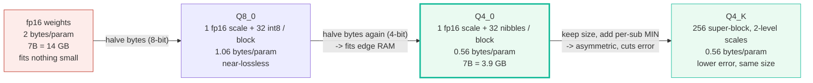
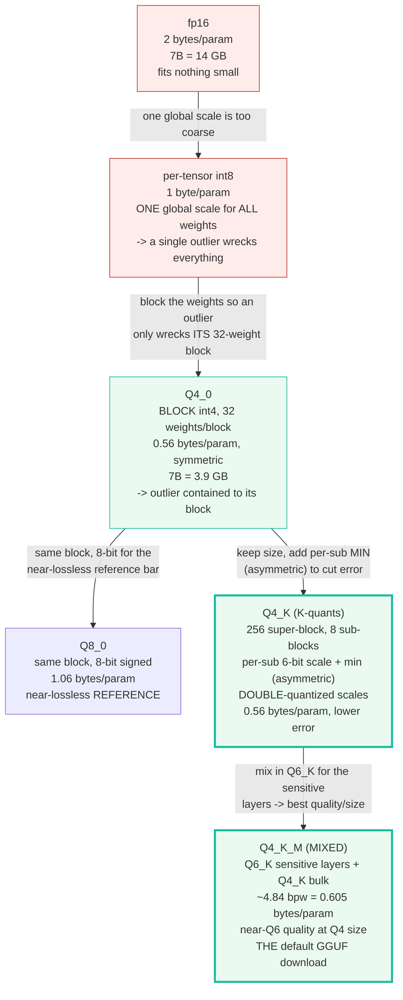
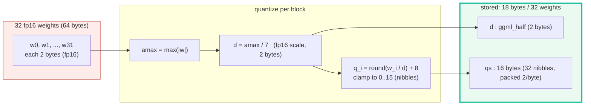
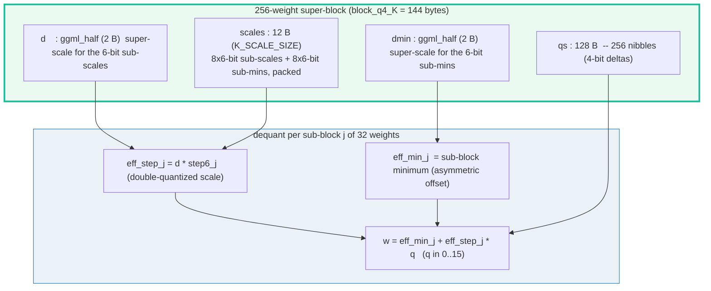
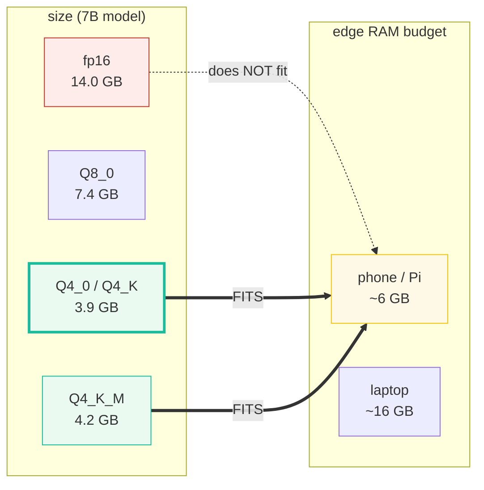
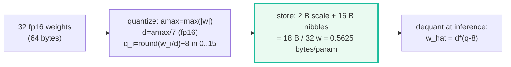

# GGUF Integer Quantization (Q4_0, Q8_0, Q4_K) — A Visual, Worked-Example Guide

> **Companion code:** [`gguf_quant.py`](./gguf_quant.py). **Every number in this
> guide is printed by `uv run python gguf_quant.py`** — change the code, re-run,
> re-paste. Nothing here is hand-computed.
>
> **Phase:** Phase 6 — Edge Deployment & Runtimes. Sibling bundles:
> 🔗 [`SPECULATIVE_DRAFT.md`](./SPECULATIVE_DRAFT.md), 🔗
> [`MOBILE_RUNTIME.md`](./MOBILE_RUNTIME.md), 🔗
> [`MLX_METAL_EDGE.md`](./MLX_METAL_EDGE.md).
>
> **Lineage source:** 🔗 [`../local-llm/quant_types.py`](../local-llm/quant_types.py)
> — the production GGML dequant reference (block sizes, dequant formulas) this
> bundle re-implements from scratch in torch; and 🔗
> [`../llm/QUANTIZATION.md`](../llm/QUANTIZATION.md) — the W4A16 group-quant
> foundations this builds on.
>
> **Live animation:** [`gguf_quant.html`](./gguf_quant.html) — drag the quant
> type, watch the weight grid staircase and the 7B size/MSE numbers update live.
>
> **Provenance log:** [`gguf_quant_reference.txt`](./gguf_quant_reference.txt)
> — every block-size constant and dequant formula traced to ≥2 web sources.

---

## 0. TL;DR — the whole idea in one picture

> **The "block of 32" analogy (read this first):** A trained weight is a 16-bit
> float — **2 bytes**. A 7B model is therefore ~14 GB, which fits nothing small.
> Quantization chops the weight matrix into tiny **blocks of 32** (a size that
> matches a 256-bit SIMD lane) and, per block, stores **one fp16 scale + 32 small
> integers** instead of 32 fp16s. The matmul engine multiplies each integer back
> by the block's scale on the fly. That single trick drops a weight to ~0.56
> bytes (4-bit) — the 7B model shrinks to ~3.9 GB and **fits a phone's RAM**.
> The whole game is choosing the block layout + dequant formula that gives the
> best quality-per-byte.



| | fp16 (baseline) | Q8_0 (reference) | **Q4_0** (the size win) | **Q4_K** (same size, less error) |
|---|---|---|---|---|
| **bytes/param** | 2.0 | 1.0625 | 0.5625 | 0.5625 |
| **bpw** | 16.0 | 8.5 | 4.5 | 4.5 |
| **block** | — | 32 weights | 32 weights | 256 = 8×32 super-block |
| **scale model** | — | 1 fp16 scale | 1 fp16 scale (symmetric) | fp16 super-d + 6-bit sub-scales + sub-min (asymmetric) |
| **dequant** | — | `d·q` | `d·(q−8)` | `min + (d·scale6)·q` per sub-block |
| **7B size** | 14.00 GB | 7.44 GB | **3.94 GB** | **3.94 GB** |
| **quality** | perfect | near-lossless | good | better (handles biased blocks) |

> **One plain sentence:** split the weights into 32-element blocks, store one
> fp16 scale + small ints per block, and dequant on the fly — a 7B model drops
> from 14 GB to ~3.9 GB (Q4) and fits edge RAM; Q4_K adds a per-sub-block min
> (asymmetric) so it beats Q4_0 on real (non-zero-centered) weights at the same
> byte cost.

### Glossary (plain English — refer back any time)

| Term | Plain meaning |
|---|---|
| **weight** | One fp16 number in a trained matrix (2 bytes). Quantization's job is to shrink it. |
| **block** | 32 consecutive weights — the unit of quantization. Matches a 256-bit SIMD lane, so dequant runs at full hardware width. Every block carries its OWN scale. |
| **super-block** | 256 consecutive weights = 8 sub-blocks of 32. Used by the K-quants (Q4_K, Q6_K). |
| **scale (`d`)** | The fp16 number that maps an integer level back to a float: `dequant weight = d·(q−8)` for Q4_0. One per block. Choosing it well is 90% of quantization quality. |
| **min (`m`)** | An fp16 offset for ASYMMETRIC quants (Q4_1, Q4_K): the block's minimum, so all 16 levels land inside the actual data range instead of being centered on zero. |
| **nibble** | A 4-bit integer (0..15). Two nibbles pack into one byte, so 32 nibbles = 16 bytes. |
| **bpw** | Bits per weight = `block_bytes · 8 / block_weights`. The size knob: 4.5 bpw = 0.5625 bytes/param. |
| **MSE** | Mean squared error between original and dequantized weights. Lower = better quality. Always: Q8_0 < Q4_K < Q4_0. |
| **outlier** | A weight far larger than its neighbours. It inflates its block's scale, coarsening every other weight in that block. THE enemy of quantization. |
| **QK_K / K_SCALE_SIZE** | 256 / 12 — the super-block size and the byte count of the packed 6-bit sub-scales, from `ggml-common.h`. |
| **dequant** | Reconstruct the float weight at inference: `w = f(scale, ints)`. Runs inside the matmul kernel, on CPU SIMD / GPU / Metal. |

> 🔗 **If you only read one cross-reference:** quantization here is **weight-only**
> (W4A16 — weights are int4, activations stay fp16). The server-side,
> group-quant foundations this builds on are in
> [`../llm/QUANTIZATION.md`](../llm/QUANTIZATION.md); this bundle is the
> **edge-runtime** side (GGUF blocks, CPU/Metal dequant).

---

## 1. The lineage — why each step happened



The **why** for each step:

1. **fp16 → per-tensor int8.** A single fp16 weight is 2 bytes; an entire matrix
   quantized to int8 with ONE global scale is 1 byte/param. The problem: one
   outlier weight forces a huge global scale, so every other weight quantizes to
   mush. Global scaling is too coarse.
2. **per-tensor → block int4 (Q4_0).** Divide the matrix into **blocks of 32**,
   each with its OWN fp16 scale. Now an outlier only inflates ITS block's scale;
   the other 32-blocks keep fine resolution. Drop to 4-bit (nibbles) and you land
   at 0.56 bytes/param — the 7B model fits a phone. This is the keystone idea.
3. **Q4_0 → Q8_0 (the reference).** Same 32-weight block, but 8-bit signed ints +
   one fp16 scale (1.06 bytes/param). 256 levels make it **near-lossless** — it
   is the quality ceiling every other quant's error is measured against.
4. **Q4_0 → Q4_K (same size, less error).** Q4_0 is **symmetric** (centered on
   zero), so a block that isn't zero-centered wastes half its 16 levels. Q4_K
   packs 8 sub-blocks of 32 into a 256-weight **super-block**, gives each
   sub-block its OWN 6-bit scale + min (**asymmetric**), and re-scales those
   6-bit sub-params with a fp16 super-block `d`/`dmin` (**double quantization** —
   the scales OF the scales are quantized, which is what makes 8 sub-scales
   affordable). Same 0.56 bytes/param, lower error on real weights.
5. **Q4_K → Q4_K_M (the default).** The `_M` MIXED variant uses Q6_K (6.56 bpw,
   high precision) for the few sensitive layers (embeddings, output, attention)
   and Q4_K for the bulk MLP. Result: ~4.84 bpw = 0.605 bytes/param with near-Q6
   quality. **This is what most GGUF downloads ship today.**

> **One plain sentence:** fp16 is too big; one global scale is too coarse; the
> answer is to block the weights (32/block) so outliers stay local — then keep
> refining the per-block scale model (symmetric → asymmetric → mixed) to claw
> back quality at the same byte cost.

---

## 2. Q4_0 — block int4, the keystone — Section A output

> **The block of 32.** Take 32 consecutive fp16 weights. Find the largest
> absolute value `amax`. The block scale is `d = amax/7` (the signed 4-bit range
> is −8..+7, so `+amax` maps to nibble 15 and `−amax` to nibble 1, both exact).
> Each weight becomes a nibble `q = round(w/d)+8` ∈ [0,15]. Store 1 fp16 scale
> + 16 bytes of packed nibbles = **18 bytes for 32 weights = 0.5625 bytes/param**.
> Dequant at inference: `ŵ = d·(q−8)`.



> From `gguf_quant.py` **Section A** — the seeded 32-element block
> (`torch.manual_seed(0)`, `randn·0.5`), quantized to Q4_0:
>
> ```
> Block struct (verified: ggml/src/ggml-common.h block_q4_0):
>   QK4_0 = 32 weights per block
>   bytes = sizeof(ggml_half) + QK4_0/2 = 2 + 16 = 18 bytes
>   bytes/param = 18/32 = 0.5625   (4.5 bpw)
>
> Dequant formula (symmetric, centered on 0):
>   w_hat = d * (q - 8)   where d = fp16 scale, q = nibble in 0..15
>   scale d = max(|block|) / 7   (signed 4-bit range is -8..+7, so the
>   positive peak +amax maps to q=15 and the negative peak to q=1 exactly)
> ```
>
> | i | original w | q | ŵ = d·(q−8) | abs error |
> |---|---|---|---|---|
> | 0 | −0.562920 | 4 | −0.604492 | +0.041572 |
> | 1 | −0.576180 | 4 | −0.604492 | +0.028312 |
> | 7 | −1.057610 | 1 | −1.057861 | +0.000252 |
> | 12 | +0.059921 | 8 | +0.000000 | +0.059921 |
> | 23 | +0.926503 | 14 | +0.906738 | +0.019765 |
> | 31 | −0.421838 | 5 | −0.453369 | +0.031531 |
> *(32 rows total; see `gguf_quant_output.txt` for the full table.)*
>
> ```
> GOLD ANCHOR (gguf_quant.html recomputes this):
>   bytes/param Q4_0 = (16+2)/32 = 18/32 = 0.5625
>   block MSE (Q4_0)  = 0.0016077952   <-- the pinned gold value
>   max abs error     = 0.072849
> ```
> `[check] all Q4_0 nibbles in [0,15]: OK`
> `[check] Q4_0 round-trip MSE is non-negative: OK`
> `[check] Q4_0 bytes/param == 0.5625: OK`

**Reading the table like a story:** notice the **staircase** — many weights
share the same `ŵ` (e.g. `i=0` and `i=1` both round to `−0.604492`). That is the
quantization error: 16 levels cannot distinguish weights closer than `d ≈ 0.151`.
The extreme weights (`i=7` at `−1.0576`) quantize almost perfectly because they
*pinned* the scale; the mid-range weights (`i=12` at `+0.0599` → `ŵ=0`) have the
worst relative error. The block MSE of `0.00161` is the price of the 3.56×
shrink vs fp16.

> **One plain sentence:** 32 fp16 weights become 1 fp16 scale + 32 nibbles; the
> scale pins the extremes exactly, and everything in between snaps to the nearest
> of 16 levels — coarse, but the whole block now fits 3.56× less memory.

> 🔗 The dequant `w = d·(q−8)` is the **runtime** formula — it runs inside the
> CPU SIMD / Metal matmul kernel, once per weight per inference. The
> Apple-Silicon path is in [`MLX_METAL_EDGE.md`](./MLX_METAL_EDGE.md).

---

## 3. Q8_0 — the near-lossless reference — Section B output

> **256 levels.** Same 32-weight block, but 8-bit signed ints (`q ∈ −128..127`)
> with scale `d = amax/127`. 256 levels resolve the block ~64× finer than 16
> levels, so the round-trip MSE is tiny. Q8_0 is the **reference**: it is what
> "full local quality" means, and the error of every other quant is quoted
> against a Q8_0 baseline. The cost is 2× the bytes of Q4 (1.06 vs 0.56).

> From `gguf_quant.py` **Section B** — the SAME seeded block, quantized to Q8_0:
>
> ```
> Block struct (verified: block_q8_0):
>   QK8_0 = 32 weights per block
>   bytes = sizeof(ggml_half) + QK8_0 = 2 + 32 = 34 bytes
>   bytes/param = 34/32 = 1.0625   (8.5 bpw)
>
> Dequant formula (symmetric int8):
>   w_hat = d * q,  q in -128..127.  scale d = max(|block|) / 127.
> ```
>
> | quant type | bytes/param | block MSE | vs Q4_0 |
> |---|---|---|---|
> | Q4_0 | 0.5625 | 0.0016077952 | (baseline) |
> | Q8_0 | 1.0625 | 0.0000046450 | **346.1× better** |
>
> `[check] Q8_0 MSE < Q4_0 MSE (8-bit beats 4-bit): OK`
> `[check] Q8_0 bytes/param == 1.0625: OK`

**Reading:** Q8_0's MSE is **346× smaller** than Q4_0's on the same block, for
~2× the bytes. That is the quality/size Pareto: Q8_0 is the ceiling, Q4_0 is the
floor that fits edge RAM. Every other quant (Q4_K, Q6_K, Q4_K_M) sits on the
curve between them.

> **One plain sentence:** 8-bit gives you 256 levels instead of 16, so the error
> all but vanishes — at 2× the bytes it is the quality reference every smaller
> quant is judged against.

---

## 4. Q4_K — two-level super-block scaling — Section C output

> **The K-quant idea: same size, less error.** Q4_0 is *symmetric* (centered on
> zero), so a block that isn't zero-centered **wastes half its 16 levels** on the
> wrong side of zero. Real weights are rarely perfectly zero-centered (post-
> activation, biased rows). Q4_K fixes this by packing 8 sub-blocks of 32 into a
> 256-weight **super-block** and giving each sub-block its OWN 6-bit scale + min
> (**asymmetric** — all 16 levels land inside the sub-block's actual range). The
> 8×6-bit sub-params are then re-scaled by ONE fp16 super-block `d`/`dmin` —
> **double quantization** (the scales OF the scales are quantized), which is what
> makes 8 sub-scales affordable at the same 0.5625 bytes/param as Q4_0.



> From `gguf_quant.py` **Section C** — a seeded 256-weight super-block, biased
> per sub-block (realistic: weight rows share magnitude, vary in offset),
> quantized two ways:
>
> ```
> Super-block struct (verified: block_q4_K, QK_K = 256):
>   bytes = 2*sizeof(ggml_half) + K_SCALE_SIZE + QK_K/2
>         = 4 + 12 + 128 = 144 bytes per 256 weights
>   bytes/param = 144/256 = 0.5625   (4.5 bpw, same SIZE as Q4_0)
> ```
>
> | quant type | bytes/param | super-block MSE | vs Q4_0 |
> |---|---|---|---|
> | Q4_0 | 0.5625 | 0.0006310241 | (baseline) |
> | Q4_K | 0.5625 | 0.0002334389 | **2.70× lower MSE** |
>
> ```
>   super-block d    = 0.001114  (fp16 scale for the 6-bit sub-steps)
>   super-block dmin = 0.013176  (fp16 scale for the 6-bit sub-mins)
>   6-bit sub-steps (step6, 0..63) = [48, 63, 48, 37, 51, 44, 54, 39]
> ```
> `GOLD: Q4_K MSE < Q4_0 MSE on the biased super-block? True  (2.70x lower).`
> `[check] Q4_K super-block bytes = 144: OK`
> `[check] Q4_K pure bytes/param == 0.5625 (same SIZE as Q4_0): OK`
> `[check] Q4_K MSE < Q4_0 MSE on biased super-block: OK`

**Reading:** Q4_K cuts the error **2.70×** vs Q4_0 on the same 256 weights, at
the **same** 0.5625 bytes/param. The entire win comes from the per-sub-block MIN
(asymmetry): it lets every sub-block spend all 16 levels inside its actual range,
where Q4_0's symmetric, zero-centered levels waste themselves on the wrong side
of zero. The double-quantized 6-bit sub-scales (`step6`, re-scaled by the fp16
`d`) are what make 8 independent sub-scales affordable — without them, 8 fp16
scales would cost 16 bytes and blow the size budget.

> **Modeling note (honest):** real Q4_K also quantizes each sub-MIN to 6 bits
> (paying a small extra error); `gguf_quant.py` keeps the sub-min at fp16
> precision to isolate the symmetric-vs-asymmetric effect. The double-quantized
> SCALES — the headline K-quant idea — are modeled faithfully.

> **One plain sentence:** Q4_K spends the same bytes as Q4_0 but arranges them
> as a 256-weight super-block with 8 per-sub-block mins, so non-zero-centered
> weights quantize 2.7× more accurately — same size, better quality.

> 🔗 This is still **weight-only** quant (W4A16). The full group-quant +
> activation-quant story (W4A8, W8A8) is in
> [`../llm/QUANTIZATION.md`](../llm/QUANTIZATION.md); GGUF/K-quants trade the
> last word in compression for **edge-runtime dequant speed** (CPU SIMD / Metal).

---

## 5. The size + error ladder for a 7B model — Section D output

> **The headline table.** For a 7B model, each quant type's bytes/param × 7B =
> its on-disk / in-RAM size. The ladder reads left-to-right: each step either
> shrinks bytes (fp16→Q8_0→Q4_0) or keeps the size and cuts error
> (Q4_0→Q4_K) or trades a little size for a lot of quality (Q4_K→Q4_K_M).

> From `gguf_quant.py` **Section D**:
>
> | type | bytes/param | bpw | total size | vs fp16 | family |
> |---|---|---|---|---|---|
> | fp16 | 2.00000 | 16.00 | 14.00 GB | 1.00× smaller | baseline |
> | Q8_0 | 1.06250 | 8.50 | 7.44 GB | 1.88× smaller | legacy int8 |
> | Q4_0 | 0.56250 | 4.50 | **3.94 GB** | 3.56× smaller | legacy int4 |
> | Q4_K | 0.56250 | 4.50 | **3.94 GB** | 3.56× smaller | k-quant pure |
> | Q4_K_M | 0.60500 | 4.84 | 4.24 GB | 3.31× smaller | k-quant MIXED (_M) |
>
> ```
> The headline: a 14.0 GB fp16 7B model drops to ~3.94 GB at Q4_0 / Q4_K,
> or ~4.24 GB at Q4_K_M -- both fit a 6 GB phone/Pi RAM budget. That 3.3x
> to 3.6x shrink IS the reason an SLM runs on edge hardware at all.
> ```
> `[check] Q4_K_M bytes/param == 0.605 (4.84 bpw, documented mixed average): OK`
> `[check] Q4_0 is ~3.56x smaller than fp16 (64/18): OK`
> `[check] Q4_K_M total < 6 GB (fits a phone RAM budget) for 7B: OK`



**Reading:** the fp16 7B model **does not fit** a 6 GB phone budget at all
(14 GB). Q4_0/Q4_K (3.9 GB) and Q4_K_M (4.2 GB) all fit with room for the OS
and KV cache. **This 3.3–3.6× shrink is the single reason an SLM can run on edge
hardware** — without block quantization, edge inference of a 7B model is
impossible. Q4_K_M is the sweet spot most GGUF downloads pick: 0.3 GB larger
than pure Q4_K, noticeably better quality (mixed Q6_K on the sensitive layers).

> **One plain sentence:** the bytes/param column is the whole story — it takes a
> 7B model from "fits nothing small" (fp16, 14 GB) to "fits a phone" (Q4,
> 3.9 GB); Q4_K_M is the default because it buys back quality for 0.3 GB.

> 🔗 The RAM budget column is the device constraint the quantized model must
> fit — analysed concretely in [`MOBILE_RUNTIME.md`](./MOBILE_RUNTIME.md).

---

## 6. Pitfalls & debugging checklist

| # | Trap | Symptom | Fix |
|---|---|---|---|
| 1 | **Outlier weight in a block** | One huge weight inflates the block's scale → every other weight in that 32-block quantizes to mush (high local MSE) | Use smaller blocks, or a quant with per-sub-block mins (Q4_K) so the outlier's damage stays local; or an importance-matrix quant (IQ) that spends error budget where it matters |
| 2 | **Symmetric quant on a biased block** | Q4_0 on non-zero-centered weights wastes half its 16 levels on the wrong side of zero → 2–3× worse MSE than necessary | Use an ASYMMETRIC quant (Q4_1, Q4_K) that stores a per-block min so all levels land in the actual data range |
| 3 | **Q4_K_M vs Q4_0 quality expectation** | Assuming "all Q4 are equal" — pure Q4_0 is markedly worse than Q4_K_M on perplexity at the same bpw | Default to **Q4_K_M** (mixed Q6_K + Q4_K); reserve pure Q4_0 for maximum-compression / tiny-model cases |
| 4 | **Group-size tradeoff** | Smaller blocks = finer scales = lower error BUT more scale overhead (more bytes). 32 is the SIMD sweet spot; 16 halves throughput | Keep block size = 32 (matches the 256-bit SIMD lane); for sub-32 granularity use K-quants' double-quantized 6-bit sub-scales (same total bytes) |
| 5 | **Weight-only vs activation quant confusion** | Expecting GGUF Q4 to also speed up the matmul 4× — it does NOT; activations stay fp16 (W4A16), dequant runs per weight inside the kernel | GGUF quant is a **memory-bandwidth** win (smaller model → fits RAM → faster decode by loading fewer bytes), not a FLOP win. For FLOP wins you need activation quant (W4A8/W8A8, see 🔗 `../llm/QUANTIZATION.md`) |
| 6 | **Per-tensor (global) int8 scale** | One scale for the whole matrix → a single outlier wrecks every weight | Always use BLOCK-wise (32/block) or super-block (256) scaling, never a single global scale |
| 7 | **Wrong scale derivation (d = amax/8 vs amax/7)** | Off-by-one in the level mapping → the extreme weights clamp and lose precision | For symmetric 4-bit use `d = amax/7` (signed range −8..+7, positive peak maps exactly to nibble 15); for int8 use `d = amax/127` |
| 8 | **Forgetting the fp16 scale overhead in bpw** | Quoting "4.0 bpw" for Q4_0 — wrong; the 2-byte scale per 32 weights adds 0.5 bpw | Real Q4_0 = (16+2)·8/32 = **4.5 bpw** = 0.5625 bytes/param; always count the scale bytes |

---

## 7. Cheat sheet



- **The keystone:** 32 weights → 1 fp16 scale (`d = amax/7`) + 32 nibbles →
  **0.5625 bytes/param** (4.5 bpw). A 7B model drops 14 GB → 3.9 GB.
- **Dequant formulas (all verified against `ggml-common.h`):**
  - Q4_0: `ŵ = d·(q−8)`, `d = amax/7`, `q ∈ [0,15]` — symmetric 4-bit.
  - Q8_0: `ŵ = d·q`, `d = amax/127`, `q ∈ [−128,127]` — near-lossless reference.
  - Q4_K: `ŵ = min_j + (d·step6_j)·q` per sub-block `j` of 32 — asymmetric,
    double-quantized 6-bit sub-scales rescaled by fp16 super-`d`/`dmin`.
- **Block sizes:** Q4_0/Q8_0 = 18/34 bytes per 32 weights; Q4_K = 144 bytes per
  256 weights. All from `ggml-common.h`.
- **Quality order:** Q8_0 (best) > Q6_K > Q4_K_M > Q4_K > Q4_0 (worst).
  On a biased block, Q4_K beats Q4_0 by **2.70×** at the SAME bytes/param.
- **Bytes/param ladder (7B):** fp16 2.0 (14 GB) → Q8_0 1.06 (7.4 GB) → Q4_0/Q4_K
  0.5625 (3.9 GB) → Q4_K_M 0.605 (4.2 GB, the default).
- **The enemy:** outliers. Block the weights (32/block) so an outlier only
  wrecks ITS block; use asymmetric (Q4_K) so biased blocks don't waste levels.
- **Gold pin:** Q4_0 bytes/param = `(16+2)/32 = 0.5625`; seeded-block Q4_0 MSE
  = `0.0016077952`. [`gguf_quant.html`](./gguf_quant.html) recomputes both.

> 🔗 **Where this meets the rest of edge deployment:** quantized weights shrink
> BOTH the draft and target models so they fit edge RAM together
> ([`SPECULATIVE_DRAFT.md`](./SPECULATIVE_DRAFT.md)); the device RAM budget they
> must fit is in [`MOBILE_RUNTIME.md`](./MOBILE_RUNTIME.md); Apple Silicon runs
> Q4/Q8 dequant on Metal SIMD kernels ([`MLX_METAL_EDGE.md`](./MLX_METAL_EDGE.md));
> the production GGML constants this simulates are in
> [`../local-llm/quant_types.py`](../local-llm/quant_types.py); and the
> group-quant W4A16 foundations are in
> [`../llm/QUANTIZATION.md`](../llm/QUANTIZATION.md).

---

## Sources

- **ggml-org/llama.cpp — `ggml/src/ggml-common.h`** (the canonical GGML
  block-struct header) —
  <https://raw.githubusercontent.com/ggml-org/llama.cpp/master/ggml/src/ggml-common.h>
  Verifies the exact block sizes and dequant formulas this bundle implements:
  `QK4_0=32`, `block_q4_0 = ggml_half d + qs[16] = 18 B` (4.5 bpw);
  `QK8_0=32`, `block_q8_0 = ggml_half d + qs[32] = 34 B` (8.5 bpw);
  `QK_K=256`, `K_SCALE_SIZE=12`, `block_q4_K = d+dmin+scales[12]+qs[128] = 144 B`
  (4.5 bpw); `block_q6_K = 210 B` (6.5625 bpw).
- **ggml-org/llama.cpp — discussion #5063 "Even more quantization types?"**
  (kawrakow, the llama.cpp maintainer) —
  <https://github.com/ggml-org/llama.cpp/discussions/5063>
  Verifies the k-quant super-block design: "blocks of 32 quants (Q4_0, Q4_1,
  Q5_0, Q5_1, Q8_0), or blocks of 256 quants" — confirms QK_K=256 and the
  two-level (super + sub) scale hierarchy modelled in Section C.
- **ggml-org/llama.cpp — PR #1684 "k-quants"** (the merge that introduced Qx_K)
  — <https://github.com/ggerganov/llama.cpp/pull/1684>
  Verifies the k-quants taxonomy (Q2_K..Q6_K), the "type-0" symmetric vs
  "type-1" asymmetric (`w = a·q + b`) dequant families, and the `_M`/`_S` MIXED
  variants (Q6_K + Q4_K) that give Q4_K_M ≈ 4.84 bpw.
- **Harold Benoit, "GGUF quantization"** (technical notes) —
  <https://haroldbenoit.com/notes/ml/llms/quantization/llama.cpp/gguf-quantization>
  Verifies the super-block/sub-block mechanics in plain English: "the super-block
  takes the scale factors of each sub-block, and quantizes them, which requires
  the super-block to have a scale factor itself" — the double-quantization idea.
- **Maarten Grootendorst, "A Visual Guide to Quantization"** —
  <https://newsletter.maartengrootendorst.com/p/a-visual-guide-to-quantization>
  Verifies the symmetric-vs-asymmetric distinction: symmetric (Q4_0) centers the
  range on zero (wasting levels for non-zero-centered blocks); asymmetric
  (Q4_1/Q4_K) uses a min/zero-point so all levels land in the actual data range.
- **Hugging Face mirror of `ggml-common.h`** (independent second copy) —
  <https://huggingface.co/spaces/Steven10429/apply_lora_and_quantize/blob/main/llama.cpp/ggml/src/ggml-common.h>
  Independently verifies `QK_K=256`, `K_SCALE_SIZE=12`, `block_q4_K = 144 B`,
  "Effectively 4.5 bits per weight"; second source for the 18 B / 34 B / 144 B
  struct sizes this bundle asserts.
- **`../local-llm/quant_types.py`** (in-repo reference; mirrors ggml-common.h) —
  <https://github.com/quanhua92/tutorials/blob/main/local-llm/quant_types.py>
  Verifies the dequant formulas as runnable code (`w=d*(q-8)`, `w=d*q`,
  `w=(dmin*min6)+(d*scale6)*q`) and the documented model-level bpw for the MIXED
  variants (Q4_K_M = 4.84 bpw = 0.605 bytes/param, the figure Section D uses).

> **Unverified facts:** the build brief suggested "Q4_K_M ≈ 0.51875 bytes/param".
> This could NOT be verified — it matches no `ggml-common.h` block struct or
> documented variant. The actual figures (used here) are **pure Q4_K = 0.5625**
> bytes/param (4.5 bpw, same size as Q4_0) and **Q4_K_M = 0.605** bytes/param
> (4.84 bpw, the mixed average). The Q4_K MSE advantage (2.70× over Q4_0,
> Section C) is measured on a deliberately biased super-block to isolate the
> symmetric-vs-asymmetric effect, and `gguf_quant.py` keeps the sub-min at fp16
> (real Q4_K also quantizes it to 6 bits) — both simplifications are flagged
> in `gguf_quant_reference.txt`.
