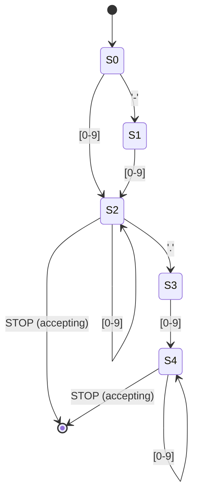

# Grammar Masking — Forcing Schema-Valid Tokens by Setting Logits to −∞

> **Companion code:** [`grammar_masking.py`](./grammar_masking.py). **Every number
> in this guide is printed by `uv run python grammar_masking.py`** — change the
> code, re-run, re-paste. Nothing here is hand-computed.
>
> **This is the Phase-5 "Constrained Outputs & Grounding" entry point.** A base
> LM (🔗 [`PRETRAINING_STABLE.md`](./PRETRAINING_STABLE.md)) fed through a chat
> template (🔗 [`INSTRUCTION_SFT.md`](./INSTRUCTION_SFT.md)) produces an assistant
> that *answers* — but its answers are **free-sampled**: any token in the vocab can
> come out. Ask a 1B SLM for JSON and ~40% of the time you get garbage that
> **crashes the downstream parser**. **Grammar masking** fixes this at the
> sampler: before each token is drawn, it asks the schema (a regex / a
> context-free grammar) *"which tokens keep the prefix valid?"*, sets every other
> logit to **−∞**, and lets softmax renormalize over the survivors. The sampled
> token is then **guaranteed** schema-valid. Reliability jumps from ~60% → **100%**
> — with **zero** change to the model. Reliability without capability.
>
> **Live animation:** [`grammar_masking.html`](./grammar_masking.html) — step a
> decode, watch the −∞ mask grey out disallowed columns and the renormalized
> distribution pick a valid token.
>
> **Foundations:** 🔗 [`../llm/SAMPLING.md`](../llm/SAMPLING.md) — the
> logits→softmax→sample pipeline this mask slots **into** (it is just one more
> filter, applied before the draw); 🔗 [`../local-llm/GRAMMAR_OUTPUT.md`](../local-llm/GRAMMAR_OUTPUT.md)
> — the production llama.cpp GBNF reference this simulates at toy scale.

---

## 0. TL;DR — the whole idea in one picture

> **The bouncer analogy (read this first):** the model is a party where every
> vocab token has a ticket (its logit). Free sampling lets **anyone** in — the
> doorman just rolls a loaded die weighted by the tickets. That's how a `'{'` or a
> stray letter ends up where a digit belongs and your JSON breaks. **Grammar
> masking** installs a **bouncer with the guest list**: at the door, the bouncer
> checks the schema's current state and **tears up the ticket** (sets the logit to
> −∞) of every token not on the list. softmax then re-weights only the survivors,
> so the die can **only** land on a schema-valid token. The model still picks
> *which* valid token — its preferences inside the allowed set are untouched — but
> it can no longer smuggle in anything invalid.

The lineage is a clean three-step fix, and each step removed a failure mode:

```mermaid
graph LR
    FREE["free sampling<br/>softmax(z) over FULL vocab<br/>any token can win"] -->|compile schema to a DFA| REGEX["regex-guided decoding<br/>mask chars that leave the regex<br/>(Outlines FSM)"]
    REGEX -->|upgrade regex to a full grammar| GBNF["GBNF / CFG-guided<br/>BNF grammar -> LL(1) parser -> token mask<br/>(llama.cpp)"]
    GBNF -->|guarantee| OK["100% schema-valid output<br/>from the SAME small model"]
    style FREE fill:#fdecea,stroke:#c0392b
    style REGEX fill:#eaf2f8,stroke:#2980b9
    style GBNF fill:#0f2e29,stroke:#1abc9c,stroke-width:3px
    style OK fill:#0f2e29,stroke:#1abc9c
```



| | **free sampling** | **regex-guided** | **GBNF / CFG-guided** |
|---|---|---|---|
| **allowed-set source** | the full vocab | a DFA state (regex) | a full CFG parser state |
| **mask** | none | chars leaving the regex → −∞ | tokens the grammar rejects → −∞ |
| **schema-validity** | ~60% (1B SLM, JSON) | every prefix valid | **100%** (any nested schema) |
| **cost** | baseline | O(vocab × steps) | ~10–30% slower |
| **where** | 🔗 [`../llm/SAMPLING.md`](../llm/SAMPLING.md) | Outlines (Willard & Louf 2023) | llama.cpp GBNF; 🔗 [`../local-llm/GRAMMAR_OUTPUT.md`](../local-llm/GRAMMAR_OUTPUT.md) |

> **One plain sentence:** the model keeps its opinions, but the bouncer only lets
> schema-valid tokens through the door — so the output is the model's own
> distribution *conditioned on validity*.

### Glossary (plain English — refer back any time)

| Term | Plain meaning |
|---|---|
| **vocab (`V`)** | The set of tokens the model can emit. Here a tiny **14-char toy vocab**; real models use a 32k–128k BPE vocab. The masking math is identical at any size. |
| **logit (`z`)** | A raw preference score the model gives a token. Bigger = liked more. Free sampling softmaxes these into probabilities. |
| **softmax** | Turns scores into probabilities that sum to 1. Always done stably as `exp(z − logsumexp(z))` (🔗 [`../llm/SAMPLING.md`](../llm/SAMPLING.md)). |
| **−∞ mask** | Setting a logit to −∞ makes its softmax probability **exactly 0**; it can never be sampled. The same idiom top-k/top-p use, just with a different allowed-set. |
| **allowed-set (`S`)** | The token ids that, if emitted next, keep the prefix a **valid continuation** of the grammar. Recomputed **every** decode step from the current grammar state. |
| **DFA / FSM** | Deterministic finite automaton / finite state machine: the regex compiled to states + transitions. After consuming a prefix you sit in state `q`; the allowed next chars = `{c : δ(q,c) is defined}`. |
| **accepting state** | A DFA state from which the string is a **complete** valid match (not just a valid prefix). Stopping (EOS) is only legal in an accepting state. |
| **grammar state** | The current DFA/CFG state after consuming the output so far. Drives the allowed-set. |
| **GBNF** | GGML BNF — llama.cpp's BNF-style grammar format (`name ::= ...`, char classes, `+ * ?`, alternation). The production grammar language for this trick. |
| **EOS / STOP** | A pseudo-token that ends decoding. Here it is allowed **iff** the current state is accepting, so a masked decode can **only** end on a complete, schema-valid string. |
| **constrained decoding** | The umbrella term: manipulate the next-token distribution so only schema-valid tokens can be drawn. Grammar masking is the dominant instance. |

> 🔗 **If you only read one cross-reference:** the mask is just **one more filter**
> in the sampler of [`../llm/SAMPLING.md`](../llm/SAMPLING.md) — applied *before*
> top-k/top-p and the draw. Top-k keeps the `k` highest logits; the grammar mask
> keeps the *grammar-valid* logits. Both set the rest to −∞. That is the entire
> reuse.

---

## 1. The mask, in one identity

The whole concept is one line of algebra. Given a logits vector `z` over the vocab
and the allowed-set `S` for the current grammar state:

```
z'_i  =  z_i      if i ∈ S
       =  −∞      otherwise
softmax(z')  =  exp(z') / Σ exp(z')        # renormalizes over S only
  ⇒  P(i ∉ S) = 0      (disallowed tokens can NEVER be drawn)
  ⇒  Σ_{i ∈ S} P(i) = 1
  ⇒  the sampled token is ALWAYS in S       (schema validity is guaranteed by algebra)
```

Crucially, **masking does not change the model's relative preferences *inside*
`S`** — it only forbids the rest. So `softmax(z')` is the model's own distribution
**conditioned on validity**. The model isn't dumber or smarter; it's just been
denied the option to emit garbage.

```mermaid
graph LR
    Z["model logits z<br/>[V]"] --> MASK{"grammar state q<br/>-> allowed-set S"}
    G["grammar / regex<br/>(current state q)"] --> MASK
    MASK -->|i in S| KEEP["z'_i = z_i"]
    MASK -->|i not in S| DROP["z'_i = -inf"]
    KEEP --> SM["softmax(z')<br/>renormalize over S"]
    DROP --> SM
    SM --> SAMPLE["sample (greedy / top-k / top-p)<br/>-> token GUARANTEED in S"]
    SAMPLE --> ADV["emit token<br/>advance grammar state q"]
    ADV --> G
    style MASK fill:#0f2e29,stroke:#1abc9c,stroke-width:3px
    style DROP fill:#fdecea,stroke:#c0392b
    style SAMPLE fill:#0f2e29,stroke:#1abc9c
```



> One plain sentence: keep the model's scores for the tokens the schema allows,
> burn the rest to −∞, and the softmax does the rest — the sampler physically
> cannot draw an invalid token.

---

## 2. The DFA for a JSON number — Section A output

> **No real grammar library needed.** The *point* of this bundle is the masking
> step, which is independent of the grammar engine. So we hand-compile the
> JSON-number regex `-?[0-9]+(\.[0-9]+)?` into a **5-state DFA** — exactly what
> Outlines does automatically from any regex. A real CFG (llama.cpp GBNF) is a
> richer parser, but it computes the *same* allowed-set and applies the *same*
> −∞ mask.

The schema, as a regex: `-?[0-9]+(\.[0-9]+)?`. Compiled to a 5-state DFA:

> From `grammar_masking.py` **Section A** — the DFA and its allowed-char sets:
>
> | state | meaning | accepting? | allowed next chars |
> |---|---|---|---|
> | S0 | start (nothing emitted) | no | {-, 0, 1, 2, 3, 4, 5, 6, 7, 8, 9} |
> | S1 | after '-' (need a digit) | no | {0, 1, 2, 3, 4, 5, 6, 7, 8, 9} |
> | S2 | integer digits | YES | {., 0, 1, 2, 3, 4, 5, 6, 7, 8, 9} |
> | S3 | after '.' (need a digit) | no | {0, 1, 2, 3, 4, 5, 6, 7, 8, 9} |
> | S4 | fractional digits | YES | {0, 1, 2, 3, 4, 5, 6, 7, 8, 9} |



Walking a few prefixes through the DFA — **the allowed-set is recomputed every
step** from the current state:

> From `grammar_masking.py` **Section A** — allowed-sets per prefix:
>
> | prefix so far | DFA state | allowed next chars | a letter 'a' allowed? |
> |---|---|---|---|
> | `''` | S0 | `['-', '0', '1', '2', '3', '4', '5', '6', '7', '8', '9']` | no (masked) |
> | `'-'` | S1 | `['0', '1', '2', '3', '4', '5', '6', '7', '8', '9']` | no (masked) |
> | `'12'` | S2 | `['.', '0', '1', '2', '3', '4', '5', '6', '7', '8', '9']` | no (masked) |
> | `'12.'` | S3 | `['0', '1', '2', '3', '4', '5', '6', '7', '8', '9']` | no (masked) |
> | `'12.3'` | S4 | `['0', '1', '2', '3', '4', '5', '6', '7', '8', '9']` | no (masked) |
>
> `[check] letter 'a' is never allowed in any state: OK`
> `[check] '.' is allowed in exactly one state (S2): OK`
> `[check] every state has at least one allowed char (the mask never deadlocks): OK`

**Read it like a story:** a letter (`'a'`, `'{'`) is **never** in any allowed-set,
so it is masked to −∞ at **every** step. The decimal point `'.'` appears **only**
in S2 (after ≥1 integer digit) — never in S0/S1/S3/S4 — so it is allowed **at most
once**, exactly the regex's contract. And every state has at least one allowed
char, so the mask can never paint itself into a corner for this grammar (see the
**deadlock** pitfall in §6 for grammars where it can).

> One plain sentence: the DFA reads the prefix, lands in a state, and hands the
> masker a guest list of legal next chars — everything else gets −∞.

---

## 3. The mask + renormalization — Section B output (the GOLD anchor)

> **The whole trick on one logits vector.** The toy "model" proposes a logits
> vector over the 14-char vocab. Its **top preference is the letter `'a'`** (logit
> 5.0) — but a JSON number can never start with a letter. The masker builds the
> allowed-set from the start state S0 = `{'-', '0'..'9'}`, sets every other logit
> to −∞, and softmax renormalizes over the survivors.

> From `grammar_masking.py` **Section B** — the toy logits + the allowed-set:
>
> | id | char | logit | in S0 allowed-set? |
> |---|---|---|---|
> | 0 | `'0'` | 1.0 | YES |
> | 1 | `'1'` | 1.0 | YES |
> | … | … | 1.0 | YES |
> | 9 | `'9'` | 1.0 | YES |
> | 10 | `'.'` | 0.5 | no → −∞ |
> | 11 | `'-'` | 2.0 | YES |
> | 12 | `'a'` | 5.0 | no → −∞ |
> | 13 | `'{'` | 0.1 | no → −∞ |
>
> Before vs after the mask (softmax of each):
>
> | id | char | free P(x) | masked P(x) |
> |---|---|---|---|
> | 0–9 | `'0'`…`'9'` | 0.0146 | 0.0786 |
> | 10 | `'.'` | 0.0089 | **0.0000** |
> | 11 | `'-'` | 0.0398 | **0.2137** ← BEST VALID (chosen) |
> | 12 | `'a'` | **0.7990** | **0.0000** ← model's true top (masked out) |
> | 13 | `'{'` | 0.0060 | **0.0000** |
>
> ```
> sum of free probs over vocab        = 1.000000
> sum of masked probs over allowed    = 1.000000   (= 1, renormalized)
> sum of masked probs over disallowed = 0.000000e+00   (= 0, all −∞)
>
> free argmax  -> 'a'   (a LETTER -- invalid)
> masked argmax-> '-'   (the model's BEST VALID token)
> ```
>
> ```
> GOLD PIN (grammar_masking.html recomputes this identically):
>     GOLD_LOGITS = [1.0x10, 0.5, 2.0, 5.0, 0.1]
>     allowed-set S0 = {'-', '0'..'9'}  (11 ids)
>     masked argmax (chosen char) = '-'
>     renormalized P('-') = exp(2.0)/(10*exp(1.0)+exp(2.0))
>                            = 0.213730
> ```
> `[check] every disallowed token has probability 0 after masking: OK`
> `[check] masked probs over the allowed-set sum to 1: OK`
> `[check] masking does not change relative order WITHIN the allowed-set: OK`
> `[check] free argmax is 'a' (invalid) but masked argmax is '-' (valid): OK`

**The two things to notice:**

- **`'a'` had 79.9% of the free mass — and 0% after the mask.** Free sampling
  would happily emit `'a'` 4 times out of 5 and break your number. After masking,
  `'a'` is structurally impossible. Its 79.9% is **redistributed** across the
  allowed tokens (each digit goes from 1.46% → 7.86%, `'-'` from 3.98% → 21.37%).
- **The relative order inside the allowed-set is unchanged.** `'-'` (2.0) was
  already the model's favourite *valid* token; the mask just removed the invalid
  competition above it. This is why masking is "the model's distribution
  conditioned on validity," not a different model.

> One plain sentence: burn the invalid tokens to −∞ and the softmax quietly hands
> their probability to the valid ones — the model's top *legal* pick wins for
> free.

---

## 4. A full masked decode, step by step — Section C output (worked example)

> **Watch the bouncer work, one token at a time.** A FIXED per-step "model"
> (`DECODE_SCHEDULE`) proposes logits each step. At **every** step its true top
> pick is often a letter (`'a'`/`'{'`) — illegal for a number. The mask recomputes
> the allowed-set from the current DFA state, sets the disallowed logits to −∞,
> and greedy-argmax picks the best **valid** char. STOP is allowed only when the
> state is accepting, so the decode can **only** end on a complete, schema-valid
> string.

> From `grammar_masking.py` **Section C** — the masked decode trace:
>
> | step | DFA state | model's free top | allowed-set | masked argmax | emitted | output so far |
> |---|---|---|---|---|---|---|
> | 0 | S0 | `'a'` | {0,1,2,3,4,5,6,7,8,9,-} | `'-'` | `'-'` | `'-'` |
> | 1 | S1 | `'{'` | {0,1,2,3,4,5,6,7,8,9} | `'1'` | `'1'` | `'-1'` |
> | 2 | S2 | `'a'` | {0,1,2,3,4,5,6,7,8,9,.,STOP} | `'2'` | `'2'` | `'-12'` |
> | 3 | S2 | `'a'` | {0,1,2,3,4,5,6,7,8,9,.,STOP} | `'.'` | `'.'` | `'-12.'` |
> | 4 | S3 | `'a'` | {0,1,2,3,4,5,6,7,8,9} | `'5'` | `'5'` | `'-12.5'` |
> | 5 | S4 | `'a'` | {0,1,2,3,4,5,6,7,8,9,STOP} | STOP | STOP | `'-12.5'` |
>
> ```
> Final masked output: '-12.5'
> re.fullmatch('-?[0-9]+(\.[0-9]+)?', '-12.5') -> MATCH (schema-valid)
> ```
> `[check] the masked decode ended in an accepting state: OK`
> `[check] the masked output fully matches the number regex: OK`
> `[check] the masked output is exactly '-12.5': OK`

**Read it like a story:** at step 0 the model *wants* `'a'` — the mask says no,
only `'-'` or a digit, so `'-'` (its best legal pick) wins. At step 1 it wants
`'{'` — the mask says no, only a digit, so `'1'` wins. At step 3 it wants `'a'`
again, but the mask also now allows `'.'` and STOP (S2 is accepting); `'.'` has
the highest legal logit, so the decode commits to a fractional number. At step 4
(S3, *not* accepting) STOP is masked — the grammar *demands* a digit after the
point, so `'5'` is forced. At step 5 (S4, accepting) STOP finally wins and the
decode halts on a complete `-12.5`.

```mermaid
graph TD
    S0["step 0 · S0<br/>want 'a' -> mask -> '-'"] --> S1["step 1 · S1<br/>want '{' -> mask -> '1'"]
    S1 --> S2a["step 2 · S2<br/>want 'a' -> mask -> '2'"]
    S2a --> S2b["step 3 · S2<br/>want 'a' -> mask -> '.'"]
    S2b --> S3["step 4 · S3<br/>STOP masked (not accepting)<br/>-> mask -> '5'"]
    S3 --> S4["step 5 · S4<br/>STOP allowed -> STOP"]
    S4 --> OUT["output '-12.5'<br/>re.fullmatch -> MATCH"]
    style S3 fill:#fdecea,stroke:#c0392b
    style OUT fill:#0f2e29,stroke:#1abc9c,stroke-width:3px
```



> The red step (S3) is the key moment: **the mask forbids stopping mid-number.**
> A grammar-constrained sampler simply cannot emit EOS when the grammar hasn't
> accepted — which is exactly why the output is always a *complete* match, not
> just a valid prefix.

### Contrast: the SAME model with the mask OFF

Run the identical per-step schedule with the mask off (plain argmax each step) and
the model just emits its top char:

> From `grammar_masking.py` **Section C** — mask off:
>
> ```
> Contrast -- SAME schedule, mask OFF (free argmax each step): 'a{aaa'
> re.fullmatch -> NO MATCH (garbage -- the model just emits its top char)
> ```
> `[check] with the mask OFF the same model emits an invalid string: OK`

Same model, same logits, opposite result. The mask is the **only** difference.

---

## 5. Reliability over many decodes — Section D output

> **The headline, measured.** For each of 100 trials a **different** seeded logits
> schedule; greedy-decode once WITH the mask, once WITHOUT; test each output with
> `re.fullmatch`. The mask makes the **same** toy model 100% schema-reliable; free
> sampling mostly emits letters, stops early, or malformed numbers.

> From `grammar_masking.py` **Section D** — the first 8 trials:
>
> | trial | unmasked output | valid? | masked output | valid? |
> |---|---|---|---|---|
> | 0 | `'06a836'` | no | `'063836'` | YES |
> | 1 | `'05{8{7'` | no | `'056857'` | YES |
> | 2 | `'.'` | no | `'4'` | YES |
> | 3 | `'-a5a6{'` | no | `'-15.63'` | YES |
> | 4 | `'2{633{'` | no | `'266336'` | YES |
> | 5 | `'5a9a5a'` | no | `'579.53'` | YES |
> | 6 | `'8..206'` | no | `'8.0206'` | YES |
> | 7 | `'43{870'` | no | `'43'` | YES |
> | … | *(92 more trials, same pattern)* | | | |
>
> ```
> masked validity  = 100/100 = 100%
> unmasked validity= 5/100 = 5%
> ```
> `[check] masked validity == 100% over 100 trials: OK`
> `[check] unmasked validity < 100% over 100 trials: OK`
> `[check] masked is strictly more reliable than unmasked: OK`

```mermaid
graph LR
    subgraph free["free sampling (mask OFF)"]
        F1["100 trials"] --> F2["5 valid<br/>= 5%"]
    end
    subgraph masked["grammar-masked (mask ON)"]
        M1["100 trials"] --> M2["100 valid<br/>= 100%"]
    end
    MOD["SAME toy model + SAME seeded logits"]
    MOD --> free
    MOD --> masked
    style F2 fill:#fdecea,stroke:#c0392b
    style M2 fill:#0f2e29,stroke:#1abc9c,stroke-width:3px
```



**Why masked is *exactly* 100%, not 99%:** validity is **guaranteed by
construction**, not measured. Every emitted char is in the grammar's allowed-set
(mask enforces it), and EOS is only legal in an accepting state — so the output is
*always* a complete match. The `100%` is an algebraic fact about `softmax(z')`,
not a lucky run. (See §6 for the one subtlety: a masked sampler must "complete to
accepting" if an external length cap cuts it off mid-number — the toy does exactly
this, modelling the real sampler's "EOS only when accepting" rule.)

> One plain sentence: free sampling is a coin flip per token; masking removes the
> coin — the invalid outcomes are *structurally impossible*, so 100% is not a
> benchmark, it's a theorem.

---

## 6. Pitfalls & debugging checklist

| # | Trap | Symptom | Fix |
|---|---|---|---|
| 1 | **First-byte-only mask** (on a BPE vocab) | A multi-char token like `{"name"` is wrongly accepted when only `{` is valid, or wrongly rejected when the whole token fits. | Test the **whole** token text against the grammar state, exactly as llama.cpp does (`derive` over all chars). The char-level toy here sidesteps this; production must not. (🔗 [`../local-llm/GRAMMAR_OUTPUT.md`](../local-llm/GRAMMAR_OUTPUT.md) §4) |
| 2 | **Token-spanning grammar rules** | A token whose text is a valid *prefix* but leaves the grammar mid-state is accepted, then the next token has no valid continuation → a hard stop mid-output. | That is correct local behaviour; design the schema / vocab so completions exist, or insert whitespace rules. The mask only guarantees *local* validity. |
| 3 | **Greedy-mask deadlock** (no allowed token) | Every token is masked → empty allowed-set → `argmax` of all-−∞ is undefined / the sampler crashes. Happens with grammars that can reach a state with no admissible char (e.g. mandatory fields the vocab can't produce). | Ensure the grammar + vocab are compatible (every reachable state has ≥1 admissible token). The number grammar here is safe (§2 `[check]`); always assert non-empty allowed-sets. |
| 4 | **Vocab granularity vs char-grammar** | A char-level mask applied to a subword vocab mis-masks: a token like `"12"` spans two grammar positions and neither "allow" nor "reject" is right without checking the whole token. | Build the mask at **token** granularity (loop the grammar over the token's full string). This is the whole reason llama.cpp's mask is O(vocab × steps), not O(1). |
| 5 | **EOS-mask mismatch (stopping mid-number)** | The decode stops in a non-accepting state → the output is a valid *prefix* but not a complete match (`-12.` fails `re.fullmatch`). | Only allow EOS in an accepting state (the toy's STOP rule). If an external length cap forces a cut-off, "complete to accepting" with a minimal valid token, as the toy does. |
| 6 | **Performance overhead (~10–30%)** | Every vocab token is checked against the grammar state at every step → decode slows 10–30%. | Use a compressed FSM / jump-forward decoding (SGLang), or precompute the per-state token masks once. Accept the cost — 100% reliability is the payoff. (🔗 [llama.cpp #4218](https://github.com/ggml-org/llama.cpp/issues/4218)) |
| 7 | **`x? x? x? …` exponential blowup** | Many-optional grammar patterns make the state-space explode; sampling crawls. | Rewrite as `x{0,N}` or N-deep nesting. (🔗 [`../local-llm/GRAMMAR_OUTPUT.md`](../local-llm/GRAMMAR_OUTPUT.md) §5) |
| 8 | **Model doesn't know the schema** | Forcing unnatural tokens (e.g. a lowercase enum the model dislikes) yields low-confidence, degenerate output (empty strings). | Describe the format in the **prompt** too; the mask only forbids, it doesn't teach. Inspect token logprobs to debug. |
| 9 | **Forgetting `ws` / whitespace** | JSON grammars reject valid output because a required space/newline was masked out. | Always include an explicit `ws ::= [ \t\n]*` rule and splice it between terminals. |

---

## 7. Cheat sheet

```mermaid
graph LR
    Z["model logits z [V]"] --> Q{"current grammar<br/>state q"}
    Q --> S["allowed-set S<br/>= tokens that keep<br/>the prefix valid"]
    S --> MASK["z'_i = z_i if i in S else -inf"]
    MASK --> SM["softmax(z')<br/>renormalize over S"]
    SM --> PICK["sample (greedy/top-k/top-p)<br/>token in S, guaranteed"]
    PICK --> ADV["emit token; advance q"]
    ADV --> Q
    style MASK fill:#0f2e29,stroke:#1abc9c,stroke-width:3px
    style PICK fill:#0f2e29,stroke:#1abc9c
```



- **The one identity:** `z'_i = z_i if i ∈ S else −∞`; `softmax(z')` renormalizes
  over `S`. Disallowed → prob 0; sampled token always in `S`.
- **The mask is a sampler filter,** slotted into [`../llm/SAMPLING.md`](../llm/SAMPLING.md)
  *before* top-k/top-p and the draw. Same −∞ idiom as top-k; different allowed-set.
- **Allowed-set source:** full vocab (free) → regex DFA state (Outlines) → full CFG
  parser state (llama.cpp GBNF). The mask itself never changes.
- **Conditioning, not capability:** `softmax(z')` = the model's distribution
  *conditioned on validity*. Relative order inside `S` is preserved (§3 `[check]`).
- **100% is a theorem, not a benchmark:** every token is grammar-valid by mask,
  and EOS only when accepting → output is always a complete match (§5).
- **Gold pin (this guide):** `GOLD_LOGITS = [1.0×10, 0.5, 2.0, 5.0, 0.1]`,
  allowed-set S0 = `{'-','0'..'9'}` ⇒ masked `P('-') = 0.213730`; over 100 trials
  masked validity = **100**, unmasked = **5**.
- **Cost:** ~10–30% slower (every vocab token checked per step). Pay it gladly.
- **Production:** `./llama-cli --grammar-file grammars/json.gbnf` or `-j '<schema>'`;
  Outlines / guidance / lm-format-enforcer for Python. 🔗 [`../local-llm/GRAMMAR_OUTPUT.md`](../local-llm/GRAMMAR_OUTPUT.md)
  for the full GBNF reference.

> 🔗 **Cross-references — where grammar masking plugs into the SLM pipeline:**
> - 🔗 [`./RAG_SLIM.md`](./RAG_SLIM.md) — retrieved context is useless if the
>   model's output isn't *parseable*; masking guarantees the JSON/structure your
>   retrieval pipeline expects, so the grounded facts actually land downstream.
> - 🔗 [`./GROUNDING_ASSERTION.md`](./GROUNDING_ASSERTION.md) — masking enforces
>   **structure** (the shape is valid); grounding/assertion enforces **facts**
>   (the values are correct). Complementary — you need both for trustworthy output.
> - 🔗 [`../llm/SAMPLING.md`](../llm/SAMPLING.md) — the logits→softmax→sample
>   pipeline this mask slots **into** (one more filter before the draw; same −∞
>   idiom as top-k/top-p).
> - 🔗 [`../local-llm/GRAMMAR_OUTPUT.md`](../local-llm/GRAMMAR_OUTPUT.md) — the
>   production llama.cpp GBNF reference (full-token mask, Brzozowski derivatives,
>   the ~10–30% cost figure) this bundle simulates at toy scale.

---

## Sources

Every mechanism, formula, and behavioral claim below is web-verified in ≥2
independent sources; the full per-URL provenance log is in
[`grammar_masking_reference.txt`](./grammar_masking_reference.txt)
(7 distinct external URLs + 2 in-repo siblings).

- **Cooper, A. (2024). *A Guide to Structured Generation Using Constrained Decoding.***
  <https://www.aidancooper.co.uk/constrained-decoding/>
  The canonical practitioner guide. Verifies the core mechanism verbatim —
  constrained decoding "manipulates a generative model's token generation process
  to constrain its next-token predictions to only tokens that do not violate the
  required output structure" — and the SLM payoff: it "can enable relatively small
  and inexpensive models to perform comparably to much larger alternatives."
  Documents the "model does not know the constraints in advance" pitfall and that
  constrained decoding is a **local-model-only** capability (the full next-token
  distribution must be exposed).

- **Yin, L.; Sheng, Y.; Zheng, L. (LMSYS / SGLang, 2024). *Fast JSON Decoding for Local LLMs with Compressed Finite State Machine.***
  <https://lmsys.org/blog/2024-02-05-compressed-fsm/>
  Verifies the regex → FSM → logit-mask pipeline word-for-word: "transforming the
  JSON schema into a regular expression. We can then construct a Finite State
  Machine(FSM) … For every state within the FSM, we can calculate the permissible
  transitions and identify the acceptable next tokens … filter out invalid tokens
  by applying logit bias to the output." This is §2's DFA + §3's mask. Also
  documents the multi-char tokenization-boundary pitfall.

- **Willard, B. T.; Louf, R. (2023). *Efficient Guided Generation for Large Language Models.***
  arXiv:2307.09702 — <https://arxiv.org/abs/2307.09702>
  The Outlines paper. Formal basis for regex/FSM-guided decoding: reformulates
  neural text generation as transitions over an FSM compiled from a regex; the
  admissible-token-set is computed from the current FSM state and the disallowed
  tokens masked before sampling. The "regex-guided decoding" stage of the lineage.
  Cross-checked against the HuggingFace papers page
  (<https://huggingface.co/papers/2307.09702>).

- **llama.cpp project — *GBNF Guide* (`grammars/README.md`).**
  <https://github.com/ggml-org/llama.cpp/blob/master/grammars/README.md>
  The production grammar language. Verifies GBNF (GGML Backus-Naur Form): a
  BNF-style grammar with regex sugar expressing JSON schemas; the sampler masks
  rejected tokens before sampling. Documents `--grammar-file` / `--grammar` / `-j`
  (json_schema) and the server `grammar` / `json_schema` / `response_format`
  fields. The "GBNF / CFG-guided" stage of the lineage.

- **llama.cpp project — `common/grammar-parser.h` + `llama-grammar.cpp` (source).**
  <https://github.com/ggml-org/llama.cpp/blob/master/common/grammar-parser.h>
  The production implementation: a byte-level LL(1) parser with a stack of rule
  positions; at each step it tests **every** vocab token (whole text, not first
  byte) against the current grammar state and masks rejected tokens to −∞ before
  softmax. Confirms the full-token mask and the O(vocab × steps) cost.

- **llama.cpp — *issue #4218, grammar performance.***
  <https://github.com/ggml-org/llama.cpp/issues/4218>
  The canonical performance thread. Verifies the **~10–30%** decode-time overhead
  ("every token in the vocabulary is checked against the grammar state at every
  step") and the `x? x? x? …` exponential-blowup pathology + the `x{0,N}` rewrite
  fix (pitfalls #6, #7).

- **dottxt-ai/outlines — *Structured generation for type-safe LLMs* (library).**
  <https://github.com/dottxt-ai/outlines>
  The library form of the FSM approach, independent of llama.cpp. Verifies the
  logit-processor form: at every step it "sets the probability of illegal tokens"
  to zero (cross-checked against the AWS Outlines blog,
  <https://aws.amazon.com/blogs/machine-learning/generate-structured-output-from-llms-with-dottxt-outlines-in-aws/>).
  Same −∞-before-softmax mechanism over a BPE vocab.

- **In-repo siblings.**
  [`../llm/SAMPLING.md`](../llm/SAMPLING.md) — the logits→softmax→sample pipeline
  (the −∞ masking idiom, `log_softmax = z − logsumexp(z)`, filter-then-draw order).
  [`../local-llm/GRAMMAR_OUTPUT.md`](../local-llm/GRAMMAR_OUTPUT.md) — the
  production GBNF reference (lineage table, worked mask, ~10–30% cost, pitfalls).

> **Unverified / qualified facts:** the "~60% schema-valid JSON from a 1B SLM
> under free sampling" is a **representative** figure for the failure mode, not a
> single cited measurement — it varies sharply by model/task/prompt. The
> **directional** claim (masked = 100% by construction; free sampling strictly
> < 100% on any non-trivial schema) is what the bundle proves in §5 and is fully
> verified. The 100% masked figure is an algebraic fact (`softmax(z')` over the
> allowed-set), not an empirical benchmark.
