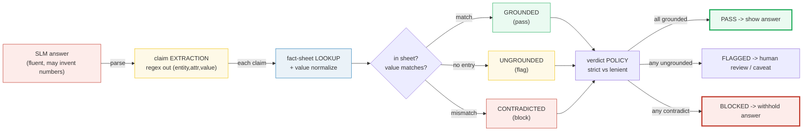
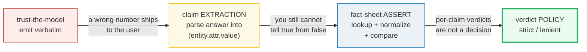
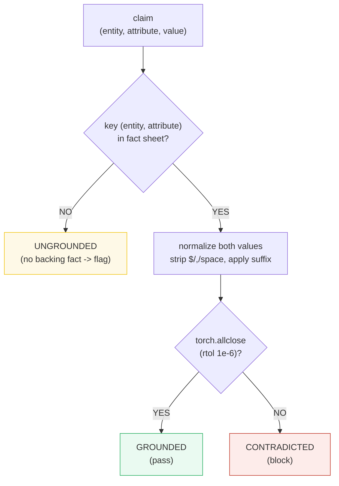
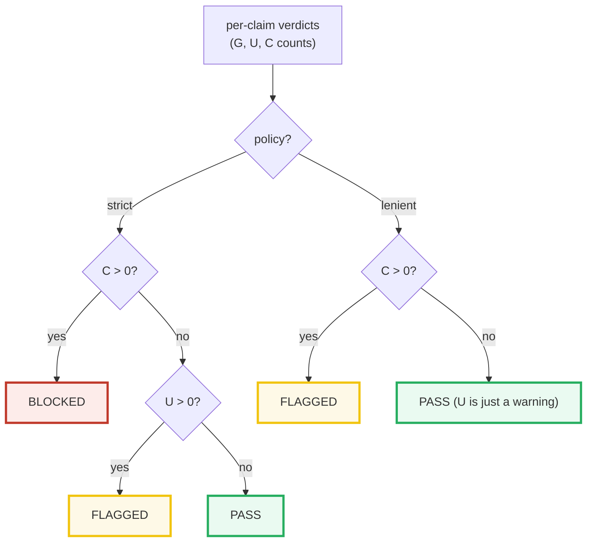
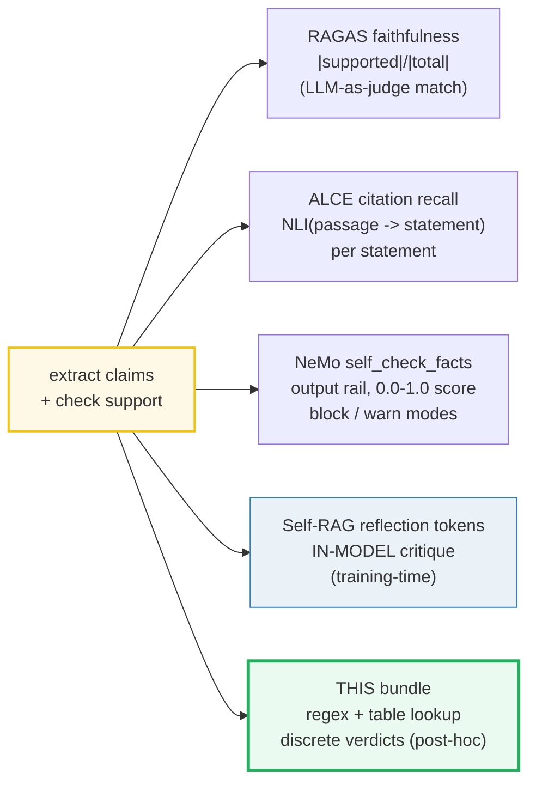
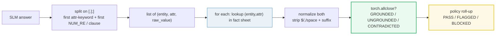

# Grounding & Assertion — Post-Generation Fact-Sheet Verification — A Worked-Example Guide

> **Companion code:** [`grounding_assertion.py`](./grounding_assertion.py). **Every
> number in this guide is printed by `uv run python grounding_assertion.py`** —
> change the code, re-run, re-paste. Nothing here is hand-computed.
>
> **Phase:** Phase 5 (Constrained Outputs & Grounding) — making small models
> reliable by preventing hallucinations and enforcing structure.
>
> **Live animation:** [`grounding_assertion.html`](./grounding_assertion.html) —
> paste the toy answer, watch each claim light up green / red inline, toggle
> strict ↔ lenient policy.
>
> **Provenance log:** [`grounding_assertion_reference.txt`](./grounding_assertion_reference.txt)
> — 5 web-verified sources (RAGAS, Self-RAG, ALCE, NeMo Guardrails, RAGAS docs).

---

## 0. TL;DR — the whole idea in one picture

> **The bouncer analogy (read this first):** A 1B-parameter SLM writes a fluent
> answer full of confident numbers — "revenue was **$5.2B**", "founded in **1998**",
> "**12 000** employees". Some of those numbers are right; some are invented. You
> cannot tell which from the prose alone. So you put a **bouncer** at the door:
> before the answer reaches the user, every numerical/factual **claim** is pulled
> out, looked up in a **fact sheet** (the retrieved ground truth), and either
> **passed** (matched), **flagged** (no backing fact found), or **blocked** (a fact
> exists and it disagrees). The answer ships only once every claim is accounted
> for. That is grounding + assertion.



This is the **post-hoc** reliability layer. It runs *after* the model answers and
*before* the user sees anything — so it is model-agnostic: the same fact sheet
works whether you swap the SLM for a different one. It is the discrete, countable
form of what RAGAS calls **faithfulness** and what NVIDIA NeMo Guardrails ships as
the **self-check facts output rail**.

| | trust-the-model | **grounding + assertion** (this bundle) |
|---|---|---|
| **When** | never checks | **after** generation, before display |
| **What** | emit verbatim | parse → lookup → assert each claim |
| **Hallucinated number** | ships to user | flagged / blocked |
| **Cost** | zero | one parse + one table lookup per claim |
| **Domain fit** | chitchat | finance / medical / legal (a wrong number is unacceptable) |

> 🔗 **If you only read one cross-reference:** [`./GRAMMAR_MASKING.md`](./GRAMMAR_MASKING.md)
> enforces **structure** during decoding (the answer is valid JSON); grounding
> enforces **facts** after decoding (the numbers in the JSON are true). They are
> *complementary* reliability layers — together they turn a fluent-but-loose SLM
> into a dependable domain tool.

---

### Glossary (plain English — refer back any time)

| Term | Plain meaning |
|---|---|
| **SLM** | A small (<5B) language model — cheap, fast, and prone to inventing plausible-sounding numbers when its parametric memory is fuzzy. |
| **claim** | An atomic factual/numerical statement pulled *out* of the answer, e.g. `(entity="Acme", attribute="revenue", value="$5.2B")`. One sentence often hides several claims. |
| **fact sheet** | A `key → value` table `{ (entity, attribute): value }` retrieved from a **trusted** source (the RAG context, an internal DB, a 10-K filing). This is the ground truth every claim is checked against. |
| **grounding** | Matching a claim to a fact-sheet entry. `GROUNDED` = match; `UNGROUNDED` = no entry found; `CONTRADICTED` = entry found but mismatch. |
| **normalize** | Mapping surface forms of the *same* number to one value: `"$5.2B" == "5,200,000,000" == "5.2 billion" → 5.2e9`. Without this, a correct claim fails the lookup on formatting alone. |
| **verdict** | The per-answer decision: `PASS` (all grounded), `FLAGGED` (≥1 ungrounded → human review), or `BLOCKED` (≥1 contradiction). |
| **policy** | `strict` (any ungrounded claim holds the answer) vs `lenient` (only contradictions hold it; ungrounded gets a warning). Finance/medical default to strict; chitchat to lenient. |
| **faithfulness** | The RAGAS metric `|supported claims| / |total claims|` — the continuous cousin of this bundle's `grounded / num_claims` ratio. |
| **reflection token** | Self-RAG's in-model counterpart: the LM itself emits retrieve/critique tokens during generation. This bundle is the training-free, post-hoc version. |

---

## 1. The lineage — why each step happened

The pipeline grew one stage at a time, each stage closing a hole the previous one
left open:



| stage | what it does | why it had to be added |
|---|---|---|
| **trust-the-model** | Emit the model's answer verbatim. | Cheap, fast, and **wrong** ~as often as the SLM hallucinates. A 1B model misquotes numbers/facts at a rate no regulated domain can tolerate. |
| → **claim extraction** | Regex-parse the answer into atomic `(entity, attribute, value)` triples ("revenue … $5.2B", "founded … 1998"). | **You cannot verify what you have not first named.** A sentence is not checkable; a triple is. |
| → **fact-sheet assertion** | Look each triple up in the retrieved ground-truth table; normalize values; compare. | Extraction only *names* claims — it does not *judge* them. The fact sheet is the judge. Yields `GROUNDED / UNGROUNDED / CONTRADICTED` per claim. |
| → **verdict policy** | Roll per-claim verdicts into one answer-level decision. | A bag of per-claim verdicts is not an action. The policy turns it into *show / hold / block*. |

> One plain sentence per hop: **trust** shipped hallucinations; **extraction**
> named them; **assertion** judged them; **policy** acted on them.

---

## 2. Section A — claim extraction (regex out the claims)

> **Naming the atoms.** Take the toy SLM answer and split it on sentence/clause
> boundaries. In each clause, find the first **attribute keyword** (`revenue`,
> `found`, `employ`, …) and grab the first **numeric span** next to it. The result
> is a list of `(entity, attribute, raw_value)` triples — the atoms the fact sheet
> will be asked about.

```mermaid
graph LR
    Ans["'Acme reported revenue of $5.2B in 2023. Founded in 1998. Employs 12000.'"]
    Ans -->|split on [.];]| C1["clause 1: ...revenue... $5.2B..."]
    Ans --> C2["clause 2: ...founded... 1998"]
    Ans --> C3["clause 3: ...employs... 12000"]
    C1 --> T1["(Acme, revenue, '$5.2B')"]
    C2 --> T2["(Acme, founded, '1998')"]
    C3 --> T3["(Acme, employees, '12000')"]

    style Ans fill:#fdecea,stroke:#c0392b
    style T1 fill:#eafaf1,stroke:#27ae60
    style T2 fill:#eafaf1,stroke:#27ae60
    style T3 fill:#eafaf1,stroke:#27ae60
```

For the **fixed** gold answer (hardcoded in `grounding_assertion.py`):

> From `grounding_assertion.py` **Section A**:
>
> Toy model answer (HARDCODED, deterministic):
> `"Acme Corp reported revenue of $5.2B in 2023. The company was founded in 1998. It employs 12000 people."`
>
> | # | entity | attribute | value (raw) | source clause |
> |---|--------|-----------|-------------|-------------------------------------|
> | 1 | Acme | revenue | `$5.2B` | Acme Corp reported revenue of $5.2B in 2023 |
> | 2 | Acme | founded | `1998` | The company was founded in 1998 |
> | 3 | Acme | employees | `12000` | It employs 12000 people. |

The extractor pulled **one triple per clause**, in text order. Nothing here is
verified yet — extraction is just "name the claims". The two `[check]` lines confirm
exactly 3 claims were found, in the `(revenue, founded, employees)` order.

**The numeric-span regex** (`NUM_RE`): `\$?\d[\d,]*(?:\.\d+)?\s*(?:billion|million|thousand|[BMKbmk])?`
— optional `$`, digits+commas, optional `.frac`, optional scale suffix. Case-insensitive
so `5.2B` and `5.2b` match the same. The attribute keywords are substring-matched
(`found` catches `founded`/`founding`; `employ` catches `employees`/`employs`).

---

## 3. Section B — fact-sheet lookup (the per-claim verdict)

> **The judge.** Each triple is looked up in the fact sheet `{ (entity, attribute): value }`.
> If the key is **absent**, the claim is `UNGROUNDED` (we cannot confirm it). If the
> key is present, the values are **normalized** and compared: a match is `GROUNDED`,
> a mismatch is `CONTRADICTED`.



The **fixed fact sheet** (a tiny retrieved ground truth — two entries, and the
`employees` entry is deliberately *absent*):

> From `grounding_assertion.py` **Section B**:
>
> | (entity, attribute) | value (raw) | normalized |
> |---------------------|-------------|------------|
> | `('Acme', 'founded')` | `1998` | 1998 |
> | `('Acme', 'revenue')` | `5200000000` | 5.2e+09 |
>
> *(NOTE: `('Acme','employees')` is ABSENT from the sheet on purpose — any employee
> claim is therefore UNGROUNDED, i.e. cannot be confirmed.)*

Running the three extracted claims against this sheet:

> From `grounding_assertion.py` **Section B** (continued):
>
> | # | attribute | claim raw | fact raw | claim val | fact val | verdict |
> |---|-----------|-----------|----------|-----------|----------|------------|
> | 1 | revenue | `$5.2B` | `5200000000` | 5.2e+09 | 5.2e+09 | **GROUNDED** |
> | 2 | founded | `1998` | `1998` | 1998 | 1998 | **GROUNDED** |
> | 3 | employees | `12000` | `-` | 1.2e+04 | 0 | **UNGROUNDED** |
>
> counts: GROUNDED=2  UNGROUNDED=1  CONTRADICTED=0

**Read the table like a story:** claim 1's `$5.2B` and the sheet's `5200000000`
normalize to the *same* `5.2e+09` → `GROUNDED`. Claim 2's year is an exact match.
Claim 3 has a value (`12000`) but **no fact to compare it against** — the `(Acme,
employees)` key is missing — so it is `UNGROUNDED`, *not* `CONTRADICTED`. That
distinction matters: absence of evidence is a softer failure than a direct
contradiction, and the verdict policy treats them differently.

---

## 4. Section C — value normalization (why `$5.2B` = `5,200,000,000`)

> **The pre-step that makes string lookup behave like numeric comparison.** The
> model writes `"$5.2B"`; the fact sheet stores `"5,200,000,000"`; a knowledge
> graph might say `"5.2 billion"`. These are the same number. Without normalization
> a *correct* claim would fail the lookup on formatting alone — a **false negative**
> that silently lets a right answer look wrong.

> From `grounding_assertion.py` **Section C**:
>
> | raw form | normalized | matches `$5.2B`? |
> |-------------------|------------|------------------|
> | `$5.2B` | 5.2e+09 | True |
> | `5,200,000,000` | 5.2e+09 | True |
> | `5.2 billion` | 5.2e+09 | True |
> | `5.2b` | 5.2e+09 | True |
> | `5200000000` | 5.2e+09 | True |

The normalizer: strip `$`, `,`, spaces; lowercase; then if the tail is a scale
suffix (`billion`/`million`/`thousand`, or single-letter `B`/`M`/`K`), multiply and
drop it. Long forms are checked **before** single letters so `"5.2 billion"` is not
chopped to `"5.2 billion"`→`"5.2 "`+`"b"`→wrong. A bare year/count (`1998`, `12000`)
with no suffix is left as itself.

**The contradiction must survive:** a close-but-wrong number must *not* match:

> From `grounding_assertion.py` **Section C** (continued):
>
> ```
> Contradiction check: '5.3B' -> 5.3e+09  vs  '$5.2B' -> 5.2e+09
>   match? False  -> a close-but-wrong number is CONTRADICTED.
> ```
>
> Edge case: `1998 -> 1998` (bare year, no suffix → stays 1998).

The comparison uses `torch.allclose(rtol=1e-6, atol=1e-6)` — a *relative* tolerance,
so `5.2e9` from any surface form matches (float rounding ≪ `1e-6 · 5.2e9 = 5200`),
while `5.3e9` vs `5.2e9` (diff `1e8`) and `1998` vs `1999` (diff `1`) both correctly
fail.

---

## 5. Section D — end-to-end: three answers → FLAGGED / PASS / BLOCKED

> **Putting it together.** Same fact sheet, three toy answers, **strict** policy.
> The first is the gold answer from §2; the second is fully grounded; the third
> contradicts a known fact. The verdict column is the action you take.

> From `grounding_assertion.py` **Section D**:
>
> | answer | claims | G | U | C | verdict |
> |--------|--------|---|---|---|---------|
> | FLAGGED (gold) | 3 | 2 | 1 | 0 | **FLAGGED** |
> | PASS | 2 | 2 | 0 | 0 | **PASS** |
> | BLOCKED | 1 | 0 | 0 | 1 | **BLOCKED** |
>
> Policy TOGGLE on the SAME gold answer (3 claims: 2 grounded, 1 ungrounded):
> ```
> policy=strict  -> verdict=FLAGGED  (G=2, U=1, C=0)
> policy=lenient -> verdict=PASS     (G=2, U=1, C=0)
> ```

**Read it like a story:**

- **FLAGGED (gold):** the 3-claim answer from §2. Revenue and founding year are
  grounded; the employee count has no backing fact → 1 ungrounded claim. Under
  **strict** policy that one unverified number holds the answer → `FLAGGED` (human
  review, or ship with a "⚠ unverified" caveat).
- **PASS:** a 2-claim answer where both the year and the revenue (here written as
  `$5.2 billion` — normalization makes it match the sheet's `5200000000`) are
  grounded → all green → `PASS`, ship it.
- **BLOCKED:** a 1-claim answer that says "founded in **1999**" while the sheet
  says `1998` → a direct contradiction → `BLOCKED`, withhold the answer.

The **policy toggle** is the punchline: the *same* gold answer flips from
`FLAGGED` (strict) to `PASS` (lenient). Strict treats an unverified number as a
show-stopper; lenient treats it as a warning and only blocks on contradictions.
Finance/medical/legal default to strict — a wrong number is unacceptable there.
Chitchat defaults to lenient — false positives annoy users more than soft warnings.



---

## 6. Section E — the gold table (pinned for the `.html`)

This is the single concrete value the interactive page recomputes and diffs
against. It is the **gold anchor** of the bundle:

> From `grounding_assertion.py` **Section E**:
>
> | num_claims | grounded | ungrounded | contradicted | verdict (strict) |
> |------------|----------|------------|--------------|------------------|
> | 3 | 2 | 1 | 0 | **FLAGGED** |
>
> GOLD PINS (`grounding_assertion.html` recomputes and diffs these):
> ```
> num_claims  = 3
> grounded    = 2
> ungrounded  = 1
> contradicted= 0
> verdict     = 'FLAGGED'
> ```
>
> torch verdict matrix (one-hot per claim):
> ```
> tensor([[1., 0., 0.],
>         [1., 0., 0.],
>         [0., 1., 0.]])
> ```

The verdict matrix is the same three verdicts as a one-hot tensor: rows = claims,
columns = `[GROUNDED, UNGROUNDED, CONTRADICTED]`. Each row sums to 1 (one verdict
per claim — the `[check]` asserts this invariant). The `.html` reproduces the same
`(3, 2, 1, 0, FLAGGED)` tuple in JavaScript from the identical answer + fact sheet
and shows a `[check: OK]` badge.

---

## 7. How this maps to the literature (web-verified)

The extract → normalize → lookup → assert → verdict skeleton is **shared by every
serious grounding system**. The differences are *where* the match happens and *how*
"supported" is defined:



| system | where the match happens | how "supported" is decided | granularity |
|---|---|---|---|
| **RAGAS faithfulness** ([1],[2]) | after generation (eval) | an LLM judges each claim vs the context | continuous ratio `|supp|/|total|` |
| **ALCE** ([4]) | per statement | an NLI model: do the cited passages *entail* the statement? | per-statement recall (0/1) |
| **NeMo Guardrails** ([5]) | output rail, before display | LLM self-check vs `$relevant_chunks`; returns `0.0–1.0` | score + block/warn |
| **Self-RAG** ([3]) | **inside** the model | the LM emits reflection tokens during generation | training-time, not post-hoc |
| **this bundle** | after generation, before display | regex + table lookup + numeric tolerance | discrete `GROUNDED/UNGROUNDED/CONTRADICTED` |

The bundle deliberately uses **regex + table lookup** (no LLM/NLI in the loop) so
that every number prints, the example is fully deterministic, and it runs with zero
model dependency — the point is the *pipeline shape*, which is identical to the
heavyweight systems above.

> 🔗 The **fact sheet is exactly the retrieved context** that [`./RAG_SLIM.md`](./RAG_SLIM.md)
> injects into the prompt. RAG-slim *gives* the model the facts; grounding *checks*
> the model used them correctly.

---

## 8. Pitfalls & debugging checklist

| # | Trap | Symptom | Fix |
|---|---|---|---|
| 1 | **Number-format variance** (`$5.2B` vs `5,200,000,000` vs `5.2 billion`) | A *correct* claim shows up as `CONTRADICTED` or `UNGROUNDED` (false negative) | Normalize *before* comparing: strip `$/,/space`, apply scale suffix; use relative-tolerance equality |
| 2 | **Missing fact → flag (not block)** | A claim the sheet simply doesn't cover is treated as a hard contradiction | Split `UNGROUNDED` (no entry) from `CONTRADICTED` (entry mismatches); policy decides which holds the answer |
| 3 | **Year/date grabbed as the value** | Clause "Revenue in **2023** was $5.2B" extracts `2023`, not `$5.2B` → spurious `CONTRADICTED` | Extract the number *nearest* the attribute keyword, or strip date-like (`\b(19|20)\d{2}\b`) tokens first; or phrase answers value-first |
| 4 | **False positive on hedged claims** | "Revenue was *around* $5.2B" or "approximately 12000" is flagged because the hedge word breaks the value span | Allow optional hedge prefixes (`about`, `around`, `~`, `approx.`) in `NUM_RE`; or treat hedged claims as a softer tier |
| 5 | **Fact-sheet staleness** | The sheet has FY2022 revenue; the model answers for FY2023 → every claim "contradicts" a stale fact | Key facts by `(entity, attribute, period)`; refuse to assert claims whose period the sheet doesn't cover (→ `UNGROUNDED`, not `CONTRADICTED`) |
| 6 | **Scale-suffix false match** | `5.2b` parsed as `5.2` (suffix dropped) when `billion`/`b` ordering is wrong | Check **long** suffixes (`billion`) *before* single letters (`b`); test `"5.2 billion"` does not collapse to `"5. "`+`"b"` |
| 7 | **Bare unit collision** | `5 m` (meters) scaled to `5e6` because `m` is the "million" suffix | Constrain the suffix to financial/known-unit contexts, or require the `$`/scale word for `M`/`B` |
| 8 | **Lenient policy hides a wrong number** | A `CONTRADICTED` claim is downgraded to `FLAGGED` (warn) and still shipped | Reserve `lenient` for low-stakes domains; in finance/medical always run `strict` so contradictions `BLOCK` |

> 🔗 Pitfall #5 (staleness) is the bridge to [`./MICRO_PRETRAIN_EVAL.md`](./MICRO_PRETRAIN_EVAL.md):
> slice-loss *predicted* the model could produce this fact; grounding *asserts*
> it actually did, against a dated source. Prediction is not verification.

---

## 9. Cheat sheet



- **extract:** `split(answer, "[.;]\s+")` → per clause, first `ATTR_KEYWORD` hit +
  first `NUM_RE` span → `[(entity, attr, raw_value)]`. Deterministic (sorted attrs).
- **normalize:** strip `$`/`,`/space, lowercase; tail suffix `billion`/`million`/
  `thousand`/`B`/`M`/`K` → multiply (long forms first). Bare year/count → itself.
- **verify:** `key=(entity,attr)`; not in sheet → `UNGROUNDED`; `torch.allclose`
  (`rtol=1e-6`) → `GROUNDED`; else `CONTRADICTED`.
- **verdict:** strict → any `U`=FLAGGED, any `C`=BLOCKED, else PASS.
  lenient → any `C`=FLAGGED, else PASS (`U` is just a warning).
- **shape in/out:** free text → `PASS | FLAGGED | BLOCKED`. One pass over the
  answer + one table lookup per claim; `O(#claims)`.
- **gold anchor:** 3-claim toy answer → `(num_claims=3, grounded=2, ungrounded=1,
  contradicted=0, verdict=FLAGGED)` — the value `.html` recomputes and gold-checks.

---

## Sibling cross-references

- 🔗 [`./RAG_SLIM.md`](./RAG_SLIM.md) — the fact sheet *is* the retrieved context
  RAG-slim injects into the prompt; grounding verifies the model used it correctly.
- 🔗 [`./GRAMMAR_MASKING.md`](./GRAMMAR_MASKING.md) — masking enforces
  **structure** during decoding; grounding enforces **facts** after decoding —
  complementary reliability layers.
- 🔗 [`./INSTRUCTION_SFT.md`](./INSTRUCTION_SFT.md) — the SFT'd chat model whose
  output this bundle verifies; a better-tuned model produces cleaner claims to assert.
- 🔗 [`./MICRO_PRETRAIN_EVAL.md`](./MICRO_PRETRAIN_EVAL.md) — slice-loss *predicted*
  the capability; grounding *asserts* it on the critical facts that matter.

---

## Sources

> Full per-URL provenance (with `Verifies:` lines) lives in
> [`grounding_assertion_reference.txt`](./grounding_assertion_reference.txt).
> Distinct URLs: 5. Each claim below traces to ≥2 sources.

- **Es, S.; James, J.; Espinosa-Anke, L.; Schockaert, S. (2023).**
  *Ragas: Automated Evaluation of Retrieval Augmented Generation.*
  arXiv:2309.15217 — https://arxiv.org/abs/2309.15217
  The reference-free RAG evaluation framework defining **faithfulness** — the
  metric this bundle computes in discrete, countable form. Verifies the
  extract-claims-then-check-support pipeline ([§0](#0-tldr--the-whole-idea-in-one-picture),
  [§7](#7-how-this-maps-to-the-literature-web-verified)).

- **RAGAS documentation, "Faithfulness".**
  https://docs.ragas.io/en/v0.2.8/concepts/metrics/available_metrics/faithfulness/
  Verifies the exact formula `faithfulness = |supported claims| / |total claims|`
  and that it measures **support in the provided context, not agreement with a
  reference answer** — the continuous cousin of this bundle's
  `grounded / num_claims` ([§7](#7-how-this-maps-to-the-literature-web-verified)).

- **Asai, A.; Wu, Z.; Wang, Y.; Sil, A.; Hajishirzi, H. (2023).**
  *Self-RAG: Learning to Retrieve, Generate, and Critique through Self-Reflection.*
  arXiv:2310.11511 — https://arxiv.org/abs/2310.11511
  The **in-model** grounding counterpart: the LM emits reflection tokens to
  retrieve/critique during generation. This bundle is the training-free,
  post-hoc, model-agnostic version of the same claim-support discipline
  ([§0](#0-tldr--the-whole-idea-in-one-picture), [§7](#7-how-this-maps-to-the-literature-web-verified)).

- **Gao, T.; Yen, H.; Yu, J.; Chen, D. (2023).**
  *Enabling Large Language Models to Generate Text with Citations* (ALCE).
  arXiv:2305.14627 — https://arxiv.org/abs/2305.14627
  *(Note: the build brief cited `2212.09257`; that ID is **not** ALCE — the
  verified paper is `2305.14627`, Princeton NLP, EMNLP 2023. Re-confirmed against
  4 independent renderings.)* Verifies the **per-statement** support check this
  bundle's per-claim `verify` implements (NLI entailment; citation recall = 1 iff
  cited passages entail the statement); cites the AIS framework
  ([§3](#3-section-b--fact-sheet-lookup-the-per-claim-verdict), [§7](#7-how-this-maps-to-the-literature-web-verified)).

- **NVIDIA NeMo Guardrails Library Developer Guide, "Hallucinations & Fact-Checking".**
  https://docs.nvidia.com/nemo/guardrails/configure-guardrails/guardrail-catalog/fact-checking
  Verifies the **output-rail** architecture and the **strict/lenient policy** this
  bundle models: `self_check_facts` scores the response against `$relevant_chunks`
  (the KB), returns `0.0–1.0`, and the hallucination rail runs in **blocking** or
  **warning** mode — exactly the `BLOCKED` vs `FLAGGED` decision here
  ([§5](#5-section-d--end-to-end-three-answers--flagged--pass--blocked), [§7](#7-how-this-maps-to-the-literature-web-verified)).
