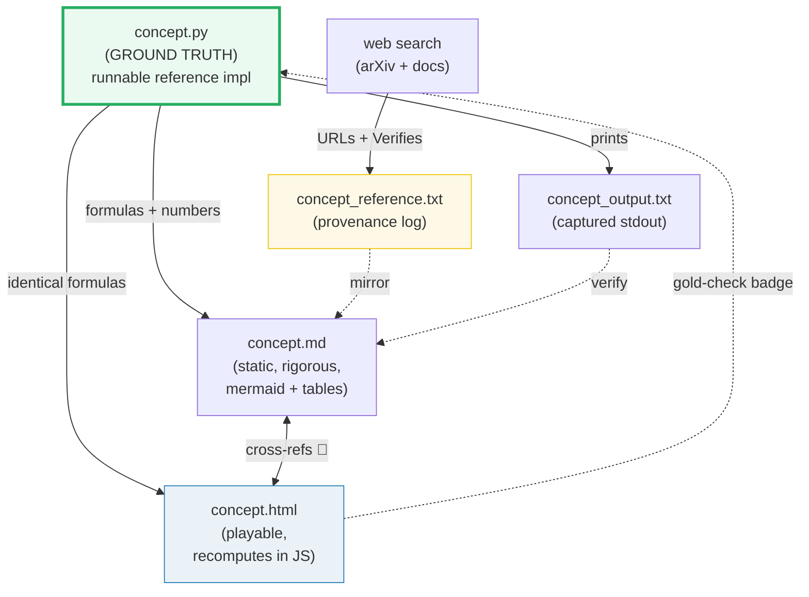
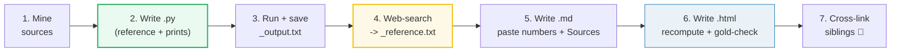

# HOW_TO_RESEARCH — The "Concept-as-a-Bundle" Workflow (SLM Engineering)

> A note from past-me to future-me: **how this `slm-engineering/` folder is
> organized, why, and how to extend it.** This is the meta-guide that sits above
> the individual concept guides ([`SCALING_LAWS.md`](./SCALING_LAWS.md),
> [`VOCAB_RATIONALIZATION.md`](./VOCAB_RATIONALIZATION.md), …) and the animation
> recipe ([`HOW_TO_ANIMATE.md`](./HOW_TO_ANIMATE.md)).
>
> This section is a sibling of [`../llm/`](../llm/HOW_TO_RESEARCH.md) (large-model
> training/serving) and [`../local-llm/`](../local-llm/) (local inference). SLM
> Engineering is the **<5B-parameter edge/domain** track: every million
> parameters counts, every megabyte of RAM counts, every inference-joule counts.
> The plan for all 20 bundles lives in [`RESEARCH.md`](./RESEARCH.md); the
> per-bundle build queue lives in [`TODO.md`](./TODO.md).

---

## 0. The one rule

> **Every concept is a bundle of files that cite each other, all deriving from ONE
> ground-truth `.py`. Nothing is ever hand-computed.**

If a number appears in a `.md` or an `.html`, it was either printed by the `.py`
or recomputed with the *identical* formula and spot-checked against it. This is
the discipline that keeps these guides trustworthy as they grow.



---

## 1. The directory layout

```
slm-engineering/
├── RESEARCH.md             ← the 20-bundle master plan (the map)
├── HOW_TO_RESEARCH.md      ← you are here (per-bundle workflow)
├── HOW_TO_ANIMATE.md       ← how to build the .html (points at ../llm/)
├── SUBAGENTS_RESEARCH_GUIDE.md ← how to delegate bundles to a worker swarm
├── TODO.md                 ← per-bundle build queue + status
├── pyproject.toml          ← uv env (torch)
│
├── scaling_laws.py         ─┐
├── scaling_laws_output.txt  │
├── scaling_laws_reference.txt │  one concept
├── SCALING_LAWS.md          │  bundle (5 files)
├── scaling_laws.html       ─┘
│
├── vocab_rationalization.py  ─┐
│   ... (4 more files)          │  another bundle
│                              ─┘
└── index.html              ← the section dashboard (cards, one per bundle)
```

A **concept bundle** = `{name}.py` + `{name}_output.txt` + `{name}_reference.txt` +
`{NAME}.md` + `{name}.html` — **5 files, one stem**. When you add a concept, add
all five.

---

## 2. The five roles of each file

| File | Role | Hard rules |
|---|---|---|
| **`name.py`** | Ground truth. Clean, runnable reference implementation + `print` of every number the docs need. | Single source of truth. **torch only.** Run via `uv run python name.py`. Sections printed with banners. Tiny-but-complete dims (e.g. `D=8, L=4, V=49152`) so every number prints while every behavior shows. |
| **`name_output.txt`** | Captured stdout. Committed so the `.md` can be re-derived/audited without running. | `uv run python name.py > name_output.txt 2>/dev/null` — must be byte-identical on re-run (deterministic inputs, seeded RNG, sorted dict iteration). |
| **`name_reference.txt`** | **Web provenance log.** One entry per URL with a `Verifies:` line. The full audit trail. | Mandatory ≥2 distinct URLs. Every formula/signature/value claim traced to ≥2 sources. This is the file the sweep greps; the `.md`'s `## Sources` is its public face. |
| **`NAME}.md`** | Static, rigorous guide. Mermaid diagrams + tables pasted *verbatim* from the `.py` output. | Every number traced to a `> From name.py Section X:` callout. Cross-refs to siblings marked 🔗. Ends with a **pitfalls table** + **cheat sheet** + `## Sources` (mirrors `name_reference.txt`). Three-layer depth: what / why-internals / gotchas. |
| **`name.html`** | Playable companion. Recomputes in JS with the *identical* formula, gold-checked against `.py`. | Single file, zero deps, opens from `file://`. Header mirrors `../llm/rope.html` exactly (badges + guide-callout). Section accent = **teal `#1abc9c`**. See [`HOW_TO_ANIMATE.md`](./HOW_TO_ANIMATE.md). |

---

## 3. The workflow (step by step)



### Step 1 — Mine the source
Read the lineage cited in [`RESEARCH.md`](./RESEARCH.md) for the bundle (e.g. for
`vocab_rationalization`, read [`../llm/TOKENIZATION.md`](../llm/TOKENIZATION.md)).
Note the code, the math, the pitfalls. These become the spine of the `.md`.

### Step 2 — Write the `.py` (the keystone)
- One clean class/function that is the reference.
- A `section_*()` function per teachable point, each printing a **banner** + a
  markdown-friendly table.
- A `check(desc, ok)` helper that prints `[check] desc: OK` and exits non-zero on
  failure (no raw `assert` — it's compiled out under `-O`).
- **Deterministic inputs** (hardcoded vectors, seeded `torch.Generator`).

### Step 3 — Run & capture
```bash
cd slm-engineering
uv run python name.py > name_output.txt 2>/dev/null   # also prints to terminal
```
Verify `[check] ... OK` lines pass and output is byte-identical on a 2nd run.

### Step 4 — Web-search → `_reference.txt`
For every formula, signature, year, and behavioral claim, web-search the original
paper (arXiv) + ≥1 other authoritative source. Verify the **exact** fact in ≥2
places. Log every URL into `name_reference.txt`:
```
[1] https://arxiv.org/abs/2203.15556
    Hoffmann et al 2022 "Training Compute-Optimal LLMs" (Chinchilla, official)
    Verifies: compute-optimal token/param ratio N_opt ≈ 20·D (tokens ≈ 20× params)
[2] https://arxiv.org/abs/2405.15071
    Huguet et al 2024 "SmolLM2" (official)
    Verifies: 1.7B model trained on 11T tokens = ~6500× Chinchilla (overtrained)
```

### Step 5 — Write the `.md`
- Paste tables **verbatim** from `_output.txt`, each under a
  `> From name.py Section X:` callout.
- Add mermaid diagrams (≥1) for the *dynamic* structure (pipelines, shapes, contrast).
- Add a worked example at the smallest scale.
- Add a **pitfalls table** (trap | symptom | fix).
- End with a **cheat sheet** + `## Sources` (mirrors `_reference.txt`).

### Step 6 — Write the `.html`
Follow [`HOW_TO_ANIMATE.md`](./HOW_TO_ANIMATE.md). Critically: recompute in JS with
the same formula, then **gold-check** one known value from the `.py` and show a
`[check: OK]` badge. Header mirrors `../llm/rope.html`.

### Step 7 — Cross-link
- `.md` ↔ sibling `.md` (🔗 markers for the conceptual contrasts).
- `.html` ↔ its `.md` (badges in the header).
- `.html` ↔ sibling `.html` (the "compare with…" relative link).

---

## 4. Cross-referencing conventions

The whole point of sibling bundles is **contrast to build understanding**. Be explicit:

- 🔗 marker in `.md` = a cross-reference to a sibling bundle (inside this section
  or in `../llm/` / `../local-llm/`).
- Always state *why* the cross-ref matters in one line, e.g.
  "🔗 [`../llm/SPECULATIVE_DECODING.md`](../llm/SPECULATIVE_DECODING.md) — the
  big-model version; this bundle is its inverse (SLM as the *draft* model)".

The 20-bundle spine (from `RESEARCH.md`) wires a learning path:
architecture → data → pretraining → alignment → grounding → edge deployment.

---

## 5. Verification discipline (do not skip)

1. **`.py` self-checks:** `check(...)` for every invariant; count of `[check] ... OK` > 0.
2. **`.md` traceability:** every number block sits under a `> From name.py Section X:` callout — no orphan numbers.
3. **`.html` gold-check:** recompute in JS, `diff` against a known `.py` value, show `[check: OK/FAIL]` badge with color.
4. **JS syntax + runtime:** `node --check` the extracted `<script>` (syntax) AND run the DOM-mock runtime smoke test (catches real crashes `node --check` misses).
5. **Provenance:** `name_reference.txt` exists, non-empty, every entry has a URL line AND a `Verifies:` line; ≥2 distinct URLs.
6. **Determinism:** `uv run python name.py` produces byte-identical `_output.txt` on a 2nd run.

Commands used during this build (reusable):

```bash
cd slm-engineering
uv run python scaling_laws.py > scaling_laws_output.txt 2>/dev/null   # capture
uv run python scaling_laws.py 2>/dev/null | grep -c OK                 # sanity
# JS gold-check (extract + node):
python3 -c "import re;print(re.search(r'<script>(.*)</script>',open('scaling_laws.html').read(),re.S).group(1))" > /tmp/c.js
node --check /tmp/c.js
```

---

## 6. Tooling

- **`uv`** manages the env; **torch** is the numerical backend (NOT numpy). We
  standardize on torch because it is portable and is the universal reference — so
  the numbers reproduce on any machine. See `pyproject.toml`.
- Run anything with `uv run python <file>`. No manual venv activation.
- Mermaid renders in GitHub/GitLab and most markdown viewers natively.
- `.html` needs nothing — open with any browser, even offline.

---

## 7. Adding a new concept (checklist)

- [ ] Read the bundle's lineage cited in [`RESEARCH.md`](./RESEARCH.md).
- [ ] `name.py`: reference impl + `section_*()` printouts + `[check]` asserts.
- [ ] `uv run python name.py > name_output.txt 2>/dev/null` — all checks pass, byte-identical re-run.
- [ ] `name_reference.txt`: ≥2 URLs each with a `Verifies:` line.
- [ ] `NAME.md`: mermaid + verbatim tables + worked example + pitfalls + cheat sheet + `## Sources`, 🔗 to siblings.
- [ ] `name.html`: recompute in JS, gold-check badge, header mirrors `../llm/rope.html`, links to `.md`/`.py`/siblings, `node --check` + runtime smoke pass.
- [ ] Update `TODO.md` status; add a card to `index.html`.

---

## 8. Why this structure works

- **The `.py` makes it falsifiable.** Anyone can re-run and see the exact numbers.
- **The `.md` is rigorous but static** — good for careful reading and search.
- **The `.html` is intuitive but dynamic** — good for the "aha" moment.
- **The `_reference.txt` makes it auditable** — every claim traces to a URL.
- **Cross-references force clarity.** Explaining *why* an SLM overtrains vs a
  Chinchilla-optimal model, with matching section numbers, is what makes it click.
- **It ages well.** Zero-deps `.html` + a `.py` + committed `_output.txt` +
  `_reference.txt` will still make sense in 5 years.

---

## 9. Style anchors (copy these exactly)

The canonical model bundles for this section live in the sibling `../llm/` section
(they are the proven, green reference for this exact 5-file discipline):

- [`../llm/rope.py`](../llm/rope.py) + [`../llm/ROPE.md`](../llm/ROPE.md) +
  [`../llm/rope.html`](../llm/rope.html) — the rotating-vector pattern, the
  banner/section/`[check]` `.py` structure, the `> From … Section X:` callouts.
- [`../llm/zero.py`](../llm/zero.py) + [`../llm/ZERO.md`](../llm/ZERO.md) +
  [`../llm/zero.html`](../llm/zero.html) — the "faithful single-process simulation"
  doc-comment header (SLM bundles reuse this style for things like speculative
  decoding and quantization).

**Note:** those `../llm/` bundles predate the `_reference.txt` convention — they
carry `## Sources` in the `.md` only. **This `slm-engineering/` section adds the
`_reference.txt` provenance file** as a fifth bundle member. When in doubt, this
section's own first bundle (`scaling_laws`) is the in-section style anchor.
