# Instruction SFT — ChatML Templates & Completion-Only Label Masking

> **Companion code:** [`instruction_sft.py`](./instruction_sft.py). **Every number
> in this guide is printed by `uv run python instruction_sft.py`** — change the
> code, re-run, re-paste. Nothing here is hand-computed.
>
> **This is the Phase-4 alignment entry point.** A *base* LM (🔗
> [`PRETRAINING_STABLE.md`](./PRETRAINING_STABLE.md)) predicts *every* next token
> of plain text. To make it a chat assistant you (1) wrap each turn in a
> **chat template** (ChatML) so the model can tell roles apart, and (2) decide
> **which tokens to train on**. The naive choice — train on the whole templated
> sequence — is *wrong*: it teaches the model to generate the **user's** prompts
> too, which is never its job. The fix is **completion-only / assistant-only
> loss**: set `labels = -100` on every system / user / role-marker / padding
> token and keep the real id only on the assistant's content (+ its closing
> `<|im_end|>`). This one-line mask is the single most important SFT rule.
>
> **Live animation:** [`instruction_sft.html`](./instruction_sft.html) — toggle
> the mask on/off and watch which tokens carry loss (teal) vs get masked (gray).
>
> **Foundations:** 🔗 [`../llm/SAMPLING.md`](../llm/SAMPLING.md) — the assistant
> tokens this mask trains the model to *emit* are exactly what a sampler later
> *draws*; 🔗 [`PRETRAINING_STABLE.md`](./PRETRAINING_STABLE.md) — the base LM
> being tuned.

---

## 0. TL;DR — the whole idea in one picture

> **The highlighter analogy (read this first):** you have a finished chat
> transcript and a highlighter. Naive SFT highlights *every* word and tells the
> model "learn to type all of this" — including the human's lines, which is
> nonsense (the model is never asked to play the human). **Completion-only SFT**
> highlights **only the assistant's lines** (plus the `<|im_end|>` that ends
> each, so it learns to *stop*). Everything else — system prompt, user turns,
> the `<|im_start|>assistant\n` header, padding — is left gray and ignored.
> `CrossEntropyLoss(ignore_index=-100)` is the mechanism: gray positions get
> label `-100`, and `-100` is the loss function's *default* "skip me" value, so
> the gradient flows only where the highlighter hit.

The lineage is a clean four-step fix, and each step removed a failure mode:

```mermaid
graph LR
    LM["base LM<br/>predict EVERY next token<br/>no notion of roles"] -->|wrap turns| TPL["chat template (ChatML)<br/>&lt;|im_start|&gt;role&#92;n{msg}&lt;|im_end|&gt;&#92;n<br/>model now sees role boundaries"]
    TPL -->|naive labels = input_ids| BAD["naive SFT<br/>loss on the WHOLE stream<br/>trains the model to EMIT user turns"]
    BAD -->|labels[role!=assistant]=-100| GOOD["completion-only / assistant-only loss<br/>CrossEntropyLoss(ignore_index=-100)<br/>loss ONLY on assistant content + closing &lt;|im_end|&gt;"]
    style GOOD fill:#0f2e29,stroke:#1abc9c,stroke-width:3px
    style BAD fill:#fdecea,stroke:#c0392b
    style LM fill:#fef9e7,stroke:#f1c40f
    style TPL fill:#eaf2f8,stroke:#2980b9
```

| | base LM | + chat template | **naive SFT** | **completion-only** |
|---|---|---|---|---|
| **Roles** | none | system / user / assistant markers | visible but unused | visible + used for masking |
| **Train targets** | every token | every token | every token (**wrong**) | **assistant tokens only** |
| **`labels`** | `= input_ids` | `= input_ids` | `= input_ids` (no mask) | `role != assistant → -100` |
| **Failure** | — | — | model learns to generate user prompts; wasted capacity; shifted target distribution | — (the fix) |
| **Used by** | pretraining | templating layer | legacy copy-paste scripts | trl `assistant_only_loss` / `completion_only_loss` |

> **One plain sentence:** highlight only the assistant's words, set every other
> label to `-100`, and the default cross-entropy loss trains the model to be the
> assistant — not to mimic the user.

### Glossary (plain English — refer back any time)

| Term | Plain meaning |
|---|---|
| **SFT** | Supervised Fine-Tuning — adapt a *base* LM to follow instructions using `{prompt, response}` pairs. |
| **Chat template** | A Jinja string (baked into the tokenizer, called via `apply_chat_template`) that turns a list of `{role, content}` messages into one token stream with role markers. |
| **ChatML** | The dominant chat layout: `<|im_start|>role\n{msg}<|im_end|>\n`. Used by Qwen, SmolLM, OpenAI ChatGPT. (`<|im_start|>`/`<|im_end|>` are *special single tokens*.) |
| **`<|im_start|>` / `<|im_end|>`** | The special tokens that open / close a turn. `add_generation_prompt=True` appends a trailing `<|im_start|>assistant\n` for *inference*. |
| **role** | Who owns a token: `system`, `user`, `assistant`. Only `assistant` tokens are ever training targets. |
| **assistant span** | The contiguous tokens the loss trains on: the assistant's **content + its closing `<|im_end|>`** (so the model learns to stop). The `<|im_start|>assistant\n` *header* before it is **context**, not a target. |
| **labels** | A `[T]` int tensor; `labels[t]` is the target id the model must predict at position `t`. The causal shift makes `logits[:-1]` predict `labels[1:]`. |
| **`-100`** | The magic value: `torch.nn.CrossEntropyLoss` has `ignore_index=-100` **by default**, so any position whose label is `-100` contributes **zero** loss and is excluded from the mean. |
| **completion-only loss** | `labels[role != assistant] = -100` (multi-turn). trl: `SFTConfig(assistant_only_loss=True)`. For prompt/completion pairs: `completion_only_loss=True`. |
| **`DataCollatorForCompletionOnlyLM`** | The *legacy* trl collator that masks everything before the response template to `-100`. Same semantics as today's `assistant_only_loss`. |
| **shift** | Causal-LM convention: `shift_logits = logits[:-1]`, `shift_labels = labels[1:]`. Position `t`'s label is predicted from tokens `0..t-1`. |

> 🔗 **If you only read one cross-reference:** the base LM being tuned here is
> the one [`PRETRAINING_STABLE.md`](./PRETRAINING_STABLE.md) trains; the
> assistant tokens this mask teaches the model to emit are what a sampler
> ([`../llm/SAMPLING.md`](../llm/SAMPLING.md)) later draws. SFT is the bridge
> from "predicts text" to "acts as an assistant."

---

## 1. A toy ChatML conversation as integer ids — Section A output

> **No real tokenizer needed.** The *point* of this bundle is the masking logic,
> not BPE. So we model a tiny **16-id toy vocabulary** where each control token
> (`<|im_start|>`, `<|im_end|>`), each role word (`system`/`user`/`assistant`),
> the newline, and a few content words each get one integer id. A real ChatML
> tokenizer produces the **same structural stream** — just more ids, from a
> 32k–128k vocab. The masking is byte-for-byte identical.

The fixed 2-turn conversation (the **GOLD anchor** for the `.html`):

```
<|im_start|>user\nHi<|im_end|>\n
<|im_start|>assistant\nHi!<|im_end|>\n
<|im_start|>user\nBye<|im_end|>\n
<|im_start|>assistant\nBye!<|im_end|>\n
```

Alongside every id we keep a parallel **role array** recording *who owns* each
token. Only `ROLE_ASSISTANT` positions will later carry loss; everything else
(system, user, the `<|im_start|>assistant\n` header, separators) is masked.

```mermaid
graph LR
    subgraph turn1["turn 1"]
        U1["user: Hi"] --> A1["assistant: Hi!"]
    end
    subgraph turn2["turn 2"]
        U2["user: Bye"] --> A2["assistant: Bye!"]
    end
    turn1 --> turn2
    A1 -.->|"only the assistant spans<br/>(content + &lt;|im_end|&gt;)<br/>carry loss"| HL["highlight = teal<br/>label = real id"]
    U1 -.->|"system / user / headers / separators<br/>are GRAY (ignored)"| GR["label = -100"]
    style A1 fill:#0f2e29,stroke:#1abc9c,stroke-width:3px
    style A2 fill:#0f2e29,stroke:#1abc9c,stroke-width:3px
    style U1 fill:#161b22,stroke:#8b949e
    style U2 fill:#161b22,stroke:#8b949e
    style HL fill:#0f2e29,stroke:#1abc9c
    style GR fill:#161b22,stroke:#8b949e
```



> From `instruction_sft.py` **Section A** — the 24-token stream + role/loss flags:
>
> | pos | id | token | role | loss? |
> |---|---|---|---|---|
> | 0 | 1 | `<\|im_start\|>` | special | - |
> | 1 | 4 | `user` | user | - |
> | 2 | 6 | `\n` | user | - |
> | 3 | 7 | `Hi` | user | - |
> | 4 | 2 | `<\|im_end\|>` | special | - |
> | 5 | 6 | `\n` | special | - |
> | 6 | 1 | `<\|im_start\|>` | special | - |
> | 7 | 5 | `assistant` | asst-hdr | - |
> | 8 | 6 | `\n` | asst-hdr | - |
> | 9 | 8 | `Hi!` | **ASSISTANT** | **YES** |
> | 10 | 2 | `<\|im_end\|>` | **ASSISTANT** | **YES** |
> | 11 | 6 | `\n` | special | - |
> | 12 | 1 | `<\|im_start\|>` | special | - |
> | 13 | 4 | `user` | user | - |
> | 14 | 6 | `\n` | user | - |
> | 15 | 9 | `Bye` | user | - |
> | 16 | 2 | `<\|im_end\|>` | special | - |
> | 17 | 6 | `\n` | special | - |
> | 18 | 1 | `<\|im_start\|>` | special | - |
> | 19 | 5 | `assistant` | asst-hdr | - |
> | 20 | 6 | `\n` | asst-hdr | - |
> | 21 | 10 | `Bye!` | **ASSISTANT** | **YES** |
> | 22 | 2 | `<\|im_end\|>` | **ASSISTANT** | **YES** |
> | 23 | 6 | `\n` | special | - |
>
> ```
> GOLD PIN (instruction_sft.html recomputes these identically):
>     T = 24 ,  A = 4 ,  masked = 20
> ```
> `[check] GOLD T == 24: OK` &nbsp; `[check] GOLD A == 4 (...content + closing <|im_end|>): OK`

**Read the table like a story:** positions 9–10 and 21–22 are the *only* `YES`
rows — the assistant's content (`Hi!`/`Bye!`) plus the `<|im_end|>` that closes
each assistant turn. Note position 7–8 (`assistant` + `\n`) is `asst-hdr`, *not*
a target: that header is the **generation prompt** — the context the model reads
to know "now *you* speak". Position 4 (`<|im_end|>` closing the *user* turn) is
masked too: the model never emits the user's turn-end.

> One plain sentence: 24 tokens, but the highlighter hits only 4 — the two
> assistant answers and the stop token after each.

---

## 2. Build the labels by masking — Section B output

> **The whole SFT rule in one line:** `labels = ids.clone(); labels[role != ASSISTANT] = -100`.
> PyTorch's `CrossEntropyLoss` ships with `ignore_index = -100` **by default**
> (verified verbatim in the [class signature](https://docs.pytorch.org/docs/stable/generated/torch.nn.CrossEntropyLoss.html)),
> so every `-100` position contributes **zero** loss and is left out of the mean.

```mermaid
graph LR
    IDS["ids [T]<br/>(the token stream)"] --> CLONE["labels = ids.clone()"]
    ROLE["role [T]<br/>(who owns each token)"] --> MASK{"role[i]<br/>== ASSISTANT?"}
    CLONE --> MASK
    MASK -->|YES| KEEP["labels[i] = id<br/>(real target)"]
    MASK -->|NO| DROP["labels[i] = -100<br/>(ignored by the loss)"]
    KEEP --> CE["CrossEntropyLoss<br/>(ignore_index=-100)"]
    DROP --> CE
    CE --> LOSS["loss averaged ONLY<br/>over assistant positions"]
    style KEEP fill:#0f2e29,stroke:#1abc9c,stroke-width:2px
    style DROP fill:#161b22,stroke:#8b949e
    style LOSS fill:#0f2e29,stroke:#1abc9c,stroke-width:3px
```



> From `instruction_sft.py` **Section B** — the masked labels:
>
> | pos | id | token | role | label |
> |---|---|---|---|---|
> | 0 | 1 | `<\|im_start\|>` | special | -100 (mask) |
> | 1 | 4 | `user` | user | -100 (mask) |
> | 2 | 6 | `\n` | user | -100 (mask) |
> | 3 | 7 | `Hi` | user | -100 (mask) |
> | 4 | 2 | `<\|im_end\|>` | special | -100 (mask) |
> | 5 | 6 | `\n` | special | -100 (mask) |
> | 6 | 1 | `<\|im_start\|>` | special | -100 (mask) |
> | 7 | 5 | `assistant` | asst-hdr | -100 (mask) |
> | 8 | 6 | `\n` | asst-hdr | -100 (mask) |
> | 9 | 8 | `Hi!` | **ASSISTANT** | **8 (Hi!)** |
> | 10 | 2 | `<\|im_end\|>` | **ASSISTANT** | **2 (<\|im_end\|>)** |
> | 11 | 6 | `\n` | special | -100 (mask) |
> | 12 | 1 | `<\|im_start\|>` | special | -100 (mask) |
> | 13 | 4 | `user` | user | -100 (mask) |
> | 14 | 6 | `\n` | user | -100 (mask) |
> | 15 | 9 | `Bye` | user | -100 (mask) |
> | 16 | 2 | `<\|im_end\|>` | special | -100 (mask) |
> | 17 | 6 | `\n` | special | -100 (mask) |
> | 18 | 1 | `<\|im_start\|>` | special | -100 (mask) |
> | 19 | 5 | `assistant` | asst-hdr | -100 (mask) |
> | 20 | 6 | `\n` | asst-hdr | -100 (mask) |
> | 21 | 10 | `Bye!` | **ASSISTANT** | **10 (Bye!)** |
> | 22 | 2 | `<\|im_end\|>` | **ASSISTANT** | **2 (<\|im_end\|>)** |
> | 23 | 6 | `\n` | special | -100 (mask) |
>
> ```
> labels array = [-100, -100, -100, -100, -100, -100, -100, -100, -100, 8, 2, -100, -100, -100, -100, -100, -100, -100, -100, -100, -100, 10, 2, -100]
> non-masked (real id, assistant) = 4
> masked  (-100, everything else) = 20
> ```
> `[check] non-masked label count == assistant span length == 4: OK`
> `[check] the <|im_start|>assistant\n header tokens are masked (they are context): OK`
> `[check] the kept assistant tokens include the closing <|im_end|> (id 2) twice: OK`

**The subtle bits (read these twice):**

- **The `<|im_start|>assistant\n` header is masked.** It is the *generation
  prompt* — the model *reads* it to know it's its turn, but it is never asked to
  *predict* it (no one types the header; it's prepended for the model).
- **The closing `<|im_end|>` of each *assistant* turn IS kept** (so the model
  learns to **stop**). The `<|im_end|>` that closes a *user* turn is masked
  (the model never plays the user, so it never emits a user turn-ender).
- **`-100` is a label value, not a token id.** The loss ignores positions whose
  *target* is `-100`. This matters for padding (see [§5](#5-multi-turn-spans--padding--lineage--section-e-output)).

> One plain sentence: copy the ids, then scribble `-100` over every position
> that isn't part of an assistant answer — that's the entire formatting step.

---

## 3. Cross-entropy with `ignore_index=-100` — Section C output

> **Proof the mask does what we claim.** Feed seeded random logits `[T=24, V=16]`
> and the masked labels into the standard causal shift
> (`shift_logits = logits[:-1]`, `shift_labels = labels[1:]`). With
> `ignore_index=-100`, the loss is the mean over **only the 4 non-masked**
> positions — and the 19 masked positions contribute **exactly 0.0**.

> From `instruction_sft.py` **Section C** — per-position loss under the shift
> (targets marked):
>
> | shift-pos | predicts token | label | per-pos loss | contributes? |
> |---|---|---|---|---|
> | 8 | `Hi!` | 8 (Hi!) | **2.8202** | YES -> target |
> | 9 | `<\|im_end\|>` | 2 (<\|im_end\|>) | **2.6800** | YES -> target |
> | 20 | `Bye!` | 10 (Bye!) | **2.8963** | YES -> target |
> | 21 | `<\|im_end\|>` | 2 (<\|im_end\|>) | **3.2612** | YES -> target |
> | *(all other 19 positions)* | *…* | -100 (mask) | **0.0000** | NO (ignored) |
>
> ```
> number of TARGET (non-masked) shift positions = 4
> loss = F.cross_entropy(..., ignore_index=-100) = 2.914430
> manual: mean of per-pos loss over the 4 target positions = 2.914430
> ```
> `[check] F.cross_entropy(ignore_index=-100) == manual mean over non-masked: OK`
> `[check] every masked position contributes exactly 0.0 to the loss: OK`

**Why the 4 targets, not 23?** The shift drops position 0, so there are `T-1 = 23`
shift positions. Of those, only the 4 that predict an assistant token (the
content + the closing `<|im_end|>` of each turn) carry a real label; the other
19 are `-100` and contribute nothing. The averaged loss `(2.8202+2.6800+2.8963+3.2612)/4 = 2.914430`
is exactly what `F.cross_entropy(ignore_index=-100)` returns — proving the mask
is the only thing selecting which positions train.

> One plain sentence: the loss function silently divides by 4, not 23 — the mask
> isn't a heuristic, it's wired into the cross-entropy's `ignore_index`.

---

## 4. Naive SFT vs completion-only — Section D output

> **The bug, dramatized.** Same seeded logits, two label arrays. Naive SFT
> (`labels = input_ids`, no mask) makes **every** shift position a target (23 of
> them) — so the model is trained to predict `user`, `Hi`, `Bye`, the `<|im_start|>`
> markers, *everything*. Completion-only masks all but the assistant spans (4
> targets). The two losses differ because they average over *different* position
> sets.

> From `instruction_sft.py` **Section D** — the contrast:
>
> | variant | label rule | target positions | loss |
> |---|---|---|---|
> | **naive (wrong)** | `labels = input_ids` (NO mask) | **23** | **2.9207** |
> | **completion-only** | `labels[role != assistant] = -100` | **4** | **2.9144** |
>
> ```
> naive targets           = [0..22]  (23 positions -- every shift slot)
> completion-only targets = [8, 9, 20, 21]  (4 positions -- assistant spans only)
> ```
> `[check] naive targets == T - 1 == 23: OK`
> `[check] naive target set is a strict superset of completion-only target set: OK`
> `[check] the two losses differ (they average over different position sets): OK`

**Why naive is wrong (the core argument):**

- **Wrong target distribution.** At inference the model is *only* ever asked to
  generate **assistant** tokens — a human supplies the user turns. Training it to
  predict user/system tokens teaches a distribution it will never be asked to
  sample from. You're optimizing the wrong objective.
- **Wasted capacity.** A model with a fixed parameter budget spends gradient
  updates learning to emit `"Hi"`, `"Bye"`, role markers — capacity that should
  go to *answering*. On imbalanced datasets (long prompt, short answer, à la
  NER/extraction) this measurably *raises* validation loss (Gottesman 2024).
- **It's a silent bug.** Naive labels still *train* — the loss goes down, the
  model improves — so it ships. The damage shows up only as a worse final
  assistant, not a crash.

HuggingFace ships the fix as two `SFTConfig` flags (and one legacy collator):

```mermaid
graph TD
    DATA{"dataset shape?"} -->|"{messages: [...]}" multi-turn| ASST["SFTConfig(assistant_only_loss=True)<br/>masks via {% generation %} Jinja markers<br/>(this bundle's model)"]
    DATA -->|"{prompt, completion}" pairs| COMP["SFTConfig(completion_only_loss=True)<br/>masks everything before the completion"]
    ASST --> RULE["labels[role != assistant] = -100"]
    COMP --> RULE
    RULE --> CE["CrossEntropyLoss(ignore_index=-100)"]
    style RULE fill:#0f2e29,stroke:#1abc9c,stroke-width:3px
    style CE fill:#0f2e29,stroke:#1abc9c
```



> ⚠️ **`assistant_only_loss=True` requires the chat template to include
> ``/`` markers** around the assistant spans
> (trl auto-patches known families like Qwen3). Without them, trl falls back to
> loss on the full sequence — i.e. the naive bug. Check your template.

---

## 5. Multi-turn spans, padding & lineage — Section E output

> **Multi-turn is free.** A K-turn conversation has K assistant turns → K
> assistant spans. The role array finds them all with the same one-line mask; no
> special multi-turn code.

> From `instruction_sft.py` **Section E** — the two assistant spans:
>
> ```
> assistant (loss) positions = [9, 10, 21, 22]
> = 2 contiguous assistant spans:
>   turn 1: positions [9, 10] -> tokens ['Hi!', '<|im_end|>']  (content + closing <|im_end|>)
>   turn 2: positions [21, 22] -> tokens ['Bye!', '<|im_end|>']  (content + closing <|im_end|>)
> ```
> `[check] 2-turn conversation has exactly 2 assistant spans: OK`
> `[check] each span ends with the closing <|im_end|> (id 2): OK`

### Padding: `<pad>` labels are NOT auto-masked

When you right-pad a batch to a fixed length, the pad tokens must **also** get
label `-100`. The loss ignores the **label value** `-100`, *not* the token id —
so if your collator leaves pad labels as the pad id (`0`), the model is silently
trained to **predict `<pad>`**.

> From `instruction_sft.py` **Section E** — right-pad the 24-token convo to 28:
>
> ```
> right-pad the 24-token convo to length 28 (+4 pad tokens, id=0).
> padded labels (tail) = [-100, -100, -100, -100]
> non-masked count unchanged after padding (still 4)
> ```
> `[check] all pad-token labels are -100 (padding masked): OK`

> From `instruction_sft.py` **Section E** — the lineage ladder:
>
> | stage | what it does | failure / win | where |
> |---|---|---|---|
> | base LM | predict EVERY next token of plain text | no notion of roles; fine for pretrain | next-token CE on the raw stream |
> | chat template | wrap turns: `<\|im_start\|>role\n{msg}<\|im_end\|>\n` | model can now see role boundaries | ChatML (Qwen/SmolLM/OpenAI); Jinja in the tokenizer |
> | naive SFT | tokenise template; `labels = input_ids` (NO mask) | trains the model to GENERATE user turns too | wrong target distribution; wasted capacity (the bug) |
> | **completion-only** | `labels[role != assistant] = -100`; `CE(ignore_index=-100)` | loss ONLY on assistant content + closing `<\|im_end\|>` | trl `SFTConfig(assistant_only_loss=True)`; the SFT rule |

---

## 6. The why: three layers of depth

**What** (the mechanism): `apply_chat_template` flattens a `{role, content}` list
into one token stream with `<|im_start|>role\n…<|im_end|>\n` markers ([§1](#1-a-toy-chatml-conversation-as-integer-ids--section-a-output));
the one-line mask `labels[role != assistant] = -100` ([§2](#2-build-the-labels-by-masking--section-b-output))
selects the assistant spans; `CrossEntropyLoss(ignore_index=-100)` ([§3](#3-cross-entropy-with-ignore_index100--section-c-output))
trains only on them.

**Why-internals** (why each piece exists):
- **The template** exists because a base LM's attention has no concept of "who
  said this" — the role markers give it explicit turn boundaries so it can learn
  *when* to stop reading and *start* answering.
- **The `-100` ignore_index** exists (and is the *default*) so NLP pipelines can
  uniformly skip padding and masked positions without a custom loss — SFT reuses
  it to skip non-assistant tokens for free.
- **The closing `<|im_end|>` is kept** so the model learns the **stop** token —
  without it, the assistant would never terminate and would ramble past the
  turn boundary.
- **The header `<|im_start|>assistant\n` is masked** because it is *context*, not
  a target: at inference it's prepended (via `add_generation_prompt=True`) to
  cue the model, so the model must *read* it, never *predict* it.

**Gotchas** (see the table below): naive `labels = input_ids` (the silent bug);
pad labels left as id `0`; `assistant_only_loss` silently ignored when the
template lacks `` markers; masking the `<|im_end|>` you actually
want the model to learn to emit; and special tokens that aren't in the tokenizer
being treated as literal text.

---

## 7. Pitfalls & debugging checklist

| # | Trap | Symptom | Fix |
|---|---|---|---|
| 1 | **`labels = input_ids` (no mask)** — the naive bug | Model slowly learns to generate user turns / role markers; worse assistant quality; no crash | Mask: `labels[role != assistant] = -100`. Use trl `SFTConfig(assistant_only_loss=True)` or `completion_only_loss=True`. (§4) |
| 2 | **Pad labels left as pad-id (`0`)** | Model trained to predict `<pad>`; degenerate outputs full of padding | Set pad labels to `-100` too. The loss ignores the *label* `-100`, **not** the token id `0`. (§5) |
| 3 | **`assistant_only_loss=True` silently ignored** | Loss computed on the full sequence (reverts to the naive bug); no error | Ensure the chat template has ``/`` around assistant spans (trl auto-patches Qwen3-family; others need it manually). (§4) |
| 4 | **Masking the assistant's closing `<|im_end|>`** | Model never learns to stop; assistant rambles past the turn boundary / runs into the next user turn | Keep the closing `<|im_end|>` of each *assistant* turn as a real label (so the model learns the stop token). Only *user* `<|im_end|>` is masked. (§2) |
| 5 | **Special tokens not registered** (`<\|im_start\|>` as literal text) | Template markers split into many BPE pieces; masking by string-match fails; model sees garbled boundaries | Add `<\|im_start\|>`/`<\|im_end\|>` as **single special tokens** (`tokenizer.add_special_tokens`) and resize embeddings. |
| 6 | **Multi-turn: wrong assistant-span boundaries** | Loss on the wrong tokens; some turns silently skipped | Walk the conversation and mark *each* assistant turn's content + its closing `<\|im_end\|>`; the role array handles K turns for free. (§5) |
| 7 | **Training with `add_generation_prompt=True`** | A trailing empty `<\|im_start\|>assistant\n` becomes a (masked) target with nothing after it | For *training* set `add_generation_prompt=False`; reserve the generation prompt for *inference* only. |
| 8 | **Shifting twice** (manual shift + model's internal shift) | Targets off-by-one; loss on the wrong positions | Let the model/the HF convention do **one** shift (`logits[:-1]` vs `labels[1:]`). Don't shift labels yourself. |

---

## 8. Cheat sheet

```mermaid
graph LR
    MSGS["messages: [{role,content}, ...]"] --> TPL["apply_chat_template<br/>-> ids [T] + role [T]"]
    TPL --> MASK["labels = ids.clone()<br/>labels[role != assistant] = -100"]
    MASK --> SHIFT["shift: logits[:-1] vs labels[1:]"]
    SHIFT --> CE["CrossEntropyLoss(ignore_index=-100)<br/>loss ONLY on assistant content + closing <|im_end|>"]
    style MASK fill:#0f2e29,stroke:#1abc9c,stroke-width:3px
    style CE fill:#0f2e29,stroke:#1abc9c
```



- **The one rule:** `labels[role != assistant] = -100`. That's it.
- **ChatML:** `<|im_start|>role\n{msg}<|im_end|>\n`. Qwen / SmolLM / OpenAI.
  `<|im_start|>`/`<|im_end|>` are single special tokens.
- **`-100`:** `torch.nn.CrossEntropyLoss`'s **default** `ignore_index` — masked
  positions contribute **0** loss and are excluded from the mean.
- **Assistant span:** content **+ closing `<|im_end|>`** (so the model learns to
  stop). The `<|im_start|>assistant\n` **header** is *context*, masked.
- **Gold pin:** the 2-turn toy convo → **T=24, A=4, masked=20**.
- **Shift:** `shift_logits = logits[:-1]`, `shift_labels = labels[1:]`. One
  shift only (the model's).
- **trl:** `SFTConfig(assistant_only_loss=True)` (multi-turn) or
  `completion_only_loss=True` (prompt/completion); legacy
  `DataCollatorForCompletionOnlyLM`. Needs `` markers.
- **Padding:** pad labels → `-100` (NOT the pad token id, or the model learns to
  emit `<pad>`).
- **Training vs inference:** train with `add_generation_prompt=False`; inference
  appends `<|im_start|>assistant\n` to cue the model.

> 🔗 **Cross-references — where SFT plugs into the pipeline:**
> - 🔗 [`./LOW_RANK_DORA.md`](./LOW_RANK_DORA.md) — SFT is usually done via
>   parameter-efficient adapters (DoRA/LoRA), not full fine-tuning; the masking
>   here is identical, the gradient just hits fewer params.
> - 🔗 [`./DIRECT_PREFERENCE_DPO.md`](./DIRECT_PREFERENCE_DPO.md) — DPO starts
>   from this SFT checkpoint; the chat template + `-100` masking carries over
>   verbatim (DPO only swaps the loss).
> - 🔗 [`./KTO_ALIGNMENT.md`](./KTO_ALIGNMENT.md) — same ChatML format and
>   masking for preference / KTO data.
> - 🔗 [`../llm/SAMPLING.md`](../llm/SAMPLING.md) — the assistant tokens this
>   mask trains the model to *emit* are what a sampler (greedy / top-k / nucleus)
>   later *draws* at inference.
> - 🔗 [`./PRETRAINING_STABLE.md`](./PRETRAINING_STABLE.md) — the base LM
>   (AdamW + cosine + clip) that this SFT step tunes into an assistant.

---

## Sources

Every format and convention below is web-verified in ≥2 independent sources; the
full per-URL provenance log is in
[`instruction_sft_reference.txt`](./instruction_sft_reference.txt)
(7 distinct URLs).

- **HuggingFace Transformers — Chat templates.**
  <https://huggingface.co/docs/transformers/chat_templating>
  The ChatML layout **verbatim** (`<|im_start|>user\n…<|im_end|>\n<|im_start|>assistant\n…`),
  the `apply_chat_template` / `add_generation_prompt` API, and the role set
  `{system, user, assistant}`. Notes chat models "are still just language models
  that continue a sequence of tokens" with control tokens marking structure.

- **Gottesman, Y. (2024). *Mask Your User Tokens.***
  <https://yonigottesman.github.io/2024/05/13/mask-user-tokens.html>
  The canonical "why mask the prompt" writeup with a **position-by-position
  worked table**: labels = `-100` on user / system / role / separator tokens,
  real id only on assistant content + its closing `<|im_end|>`. Confirms
  "-100 is the default `ignore_index` in PyTorch's `CrossEntropyLoss`" and
  shows empirically that masking lowers validation loss vs naive
  `labels = input_ids`.

- **PyTorch — `torch.nn.CrossEntropyLoss`.**
  <https://docs.pytorch.org/docs/stable/generated/torch.nn.CrossEntropyLoss.html>
  The class signature with the **default `ignore_index=-100`** verbatim:
  `CrossEntropyLoss(weight=None, size_average=None, ignore_index=-100, …)`;
  "Specifies a target value that is ignored and does not contribute to the input
  gradient. … the loss is averaged over non-ignored targets." The unreduced loss
  multiplies by `1{y_n ≠ ignore_index}`, so masked positions contribute exactly
  0.

- **HuggingFace TRL — SFT Trainer.**
  <https://huggingface.co/docs/trl/sft_trainer>
  The SFT loss is the token-level cross-entropy; "Padding tokens … are ignored
  … by applying an ignore index (default: -100)"; the two shipped completion-only
  modes — `completion_only_loss=True` (prompt/completion) and
  `assistant_only_loss=True` (multi-turn, "loss is computed ONLY on the
  assistant responses, ignoring user or system messages"). Confirms Qwen uses
  ChatML (`<|im_end|>` as eos).

- **HuggingFace TRL — `DataCollatorForCompletionOnlyLM` (source).**
  <https://github.com/huggingface/trl/blob/main/trl/trainer/utils.py>
  The *legacy* completion-only collator (cited by Gottesman): masks everything
  before the response template to `-100`, so loss is on the response only. Same
  masking semantics as today's `assistant_only_loss`.

- **OpenAI Developer Community — *How does ChatML do the exact formatting?***
  <https://community.openai.com/t/how-does-chatml-do-the-exact-formatting/80751>
  The original ChatML spec: each message is
  `<|im_start|>{role}\n{content}<|im_end|>\n` with `<|im_start|>`/`<|im_end|>` as
  **single special tokens**, a newline after the role and after every
  `<|im_end|>`. Traces the layout HF and Gottesman also render.

- **LM-Sys FastChat — `train.py` (source).**
  <https://github.com/lm-sys/FastChat/blob/main/fastchat/train/train.py>
  A production multi-turn SFT masker (cited by Gottesman as a script that masks
  correctly): walks the conversation, sets labels = `-100` on user/system/
  separator tokens, keeps the real id only on assistant spans. Independent of
  HuggingFace's collator.

> **Unverified facts:** none outstanding. The ChatML layout, the `-100` default
> `ignore_index`, the label-masking convention, and the completion-only /
> assistant-only loss modes each trace to ≥2 independent sources in
> [`instruction_sft_reference.txt`](./instruction_sft_reference.txt).
